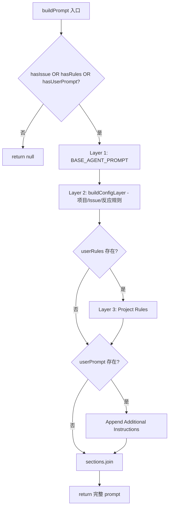
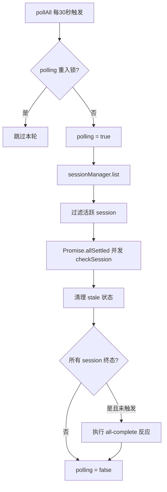
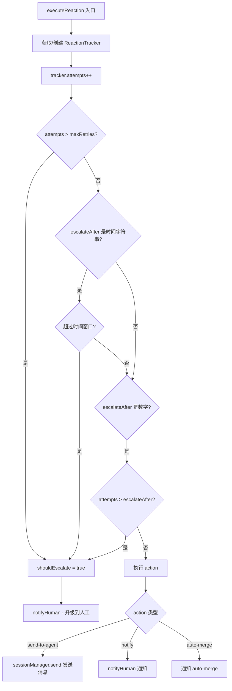

# PD-10.AO AgentOrchestrator — 三层 Prompt 管道 + 事件→反应→通知处理引擎

> 文档编号：PD-10.AO
> 来源：AgentOrchestrator `packages/core/src/prompt-builder.ts`, `packages/core/src/lifecycle-manager.ts`
> GitHub：https://github.com/ComposioHQ/agent-orchestrator.git
> 问题域：PD-10 中间件管道 Middleware Pipeline
> 状态：可复用方案

---

## 第 1 章 问题与动机（≥ 30 行）

### 1.1 核心问题

Agent 编排系统需要在多个层面实现"管道化"处理：

1. **Prompt 组装管道**：Agent 启动时需要将系统指令、项目上下文、用户规则按优先级分层组装成最终 prompt，不同层之间互不干扰且可独立扩展。
2. **生命周期事件管道**：多个 Agent session 并行运行时，需要持续轮询状态变化，将状态转换映射为事件，再将事件路由到自动反应或人工通知——形成 event→reaction→notify 三级处理管道。
3. **元数据回流管道**：Agent 内部执行 git/gh 命令时，需要通过 PostToolUse Hook 将 PR URL、分支名等信息自动回写到编排层的 metadata 文件，实现 agent→hook→metadata 的数据回流管道。

这三条管道共同构成了 Agent Orchestrator 的中间件体系：Prompt 管道负责"输入侧"，Lifecycle 管道负责"运行时"，Hook 管道负责"输出侧"。

### 1.2 AgentOrchestrator 的解法概述

1. **三层 Prompt 管道**（`prompt-builder.ts:148-178`）：BASE_AGENT_PROMPT（常量指令）→ Config-derived context（项目/Issue/反应规则）→ User rules（agentRules + agentRulesFile），三层用 `sections.push()` 串联，返回 null 表示无内容可组装。
2. **LifecycleManager 轮询引擎**（`lifecycle-manager.ts:524-580`）：30 秒间隔 `setInterval` 轮询所有 session，通过 `Promise.allSettled` 并发检查，re-entrancy guard 防止重入，`allCompleteEmitted` 防止重复触发全局完成事件。
3. **状态→事件→反应→升级 四级管道**（`lifecycle-manager.ts:436-521`）：`determineStatus()` 探测状态 → `statusToEventType()` 映射事件 → `eventToReactionKey()` 查找反应配置 → `executeReaction()` 执行或升级到人工通知。
4. **PostToolUse Hook 元数据回流**（`agent-claude-code/src/index.ts:31-167`）：Bash 脚本通过 stdin 读取 JSON hook 输入，正则匹配 `gh pr create`/`git checkout -b`/`gh pr merge` 命令，原子更新 metadata 文件。
5. **插件注册表**（`plugin-registry.ts:62-119`）：`slot:name` 键值对注册，7 个插件槽位（runtime/agent/workspace/tracker/scm/notifier/terminal），`loadBuiltins()` 按需加载。

### 1.3 设计思想

| 设计原则 | 具体实现 | 理由 | 替代方案 |
|----------|----------|------|----------|
| 分层组装 | 三层 Prompt 用 sections 数组串联 | 各层独立可测，新增层只需 push | 模板引擎（Handlebars/Jinja） |
| 轮询而非推送 | setInterval + Promise.allSettled | Agent 进程无法主动推送状态，只能外部探测 | WebSocket 双向通信 |
| 反应升级 | retries + escalateAfter 双维度 | 自动修复失败后必须通知人类 | 固定重试次数 |
| 原子元数据更新 | temp file + mv 替换 | 防止并发写入导致文件损坏 | SQLite/Redis |
| 插件槽位 | slot:name 键值对 | 同一槽位可有多个实现，按名称选择 | 接口继承 |

---

## 第 2 章 源码实现分析（≥ 60 行，核心章节）

### 2.1 架构概览

```
┌─────────────────────────────────────────────────────────────────┐
│                    Agent Orchestrator Core                       │
├─────────────────────────────────────────────────────────────────┤
│                                                                 │
│  ┌──────────────┐   ┌──────────────────┐   ┌────────────────┐  │
│  │ PromptBuilder│   │ LifecycleManager │   │ PluginRegistry │  │
│  │  (输入管道)   │   │  (运行时管道)     │   │  (插件发现)     │  │
│  └──────┬───────┘   └────────┬─────────┘   └───────┬────────┘  │
│         │                    │                      │           │
│  Layer1: BASE_PROMPT   pollAll() 30s loop    slot:name 注册    │
│  Layer2: Config ctx    ┌─────┴──────┐        7 个插件槽位      │
│  Layer3: User rules    │checkSession│                           │
│         │              └─────┬──────┘                           │
│         ▼                    │                                  │
│  SessionManager.spawn()      ├─ determineStatus()               │
│                              ├─ statusToEventType()             │
│                              ├─ eventToReactionKey()            │
│                              └─ executeReaction()               │
│                                   │                             │
│                              ┌────┴────┐                        │
│                              │escalate?│                        │
│                              └────┬────┘                        │
│                                   │                             │
│                              notifyHuman()                      │
│                              (按 priority 路由到 notifier)       │
├─────────────────────────────────────────────────────────────────┤
│  Agent Plugin (Claude Code)                                     │
│  ┌──────────────────────────────────────────────────────────┐   │
│  │ PostToolUse Hook: metadata-updater.sh                    │   │
│  │   stdin JSON → 正则匹配 gh/git 命令 → 原子更新 metadata  │   │
│  └──────────────────────────────────────────────────────────┘   │
└─────────────────────────────────────────────────────────────────┘
```

### 2.2 核心实现

#### 2.2.1 三层 Prompt 管道



对应源码 `packages/core/src/prompt-builder.ts:148-178`：

```typescript
export function buildPrompt(config: PromptBuildConfig): string | null {
  const hasIssue = Boolean(config.issueId);
  const userRules = readUserRules(config.project);
  const hasRules = Boolean(userRules);
  const hasUserPrompt = Boolean(config.userPrompt);

  // Nothing to compose — return null for backward compatibility
  if (!hasIssue && !hasRules && !hasUserPrompt) {
    return null;
  }

  const sections: string[] = [];

  // Layer 1: Base prompt (always included when we have something to compose)
  sections.push(BASE_AGENT_PROMPT);

  // Layer 2: Config-derived context
  sections.push(buildConfigLayer(config));

  // Layer 3: User rules
  if (userRules) {
    sections.push(`## Project Rules\n${userRules}`);
  }

  // Explicit user prompt (appended last, highest priority)
  if (config.userPrompt) {
    sections.push(`## Additional Instructions\n${config.userPrompt}`);
  }

  return sections.join("\n\n");
}
```

Layer 2 的 `buildConfigLayer()`（`prompt-builder.ts:67-109`）动态注入项目名、仓库、默认分支、Tracker 信息，以及 reaction 规则提示（让 Agent 知道 CI 失败会自动收到修复指令）。

Layer 3 的 `readUserRules()`（`prompt-builder.ts:115-135`）支持两种来源：`project.agentRules`（内联字符串）和 `project.agentRulesFile`（外部文件路径），两者可叠加。

#### 2.2.2 LifecycleManager 轮询引擎与反应管道



对应源码 `packages/core/src/lifecycle-manager.ts:524-580`：

```typescript
async function pollAll(): Promise<void> {
  // Re-entrancy guard: skip if previous poll is still running
  if (polling) return;
  polling = true;

  try {
    const sessions = await sessionManager.list();

    const sessionsToCheck = sessions.filter((s) => {
      if (s.status !== "merged" && s.status !== "killed") return true;
      const tracked = states.get(s.id);
      return tracked !== undefined && tracked !== s.status;
    });

    // Poll all sessions concurrently
    await Promise.allSettled(sessionsToCheck.map((s) => checkSession(s)));

    // Prune stale entries
    const currentSessionIds = new Set(sessions.map((s) => s.id));
    for (const trackedId of states.keys()) {
      if (!currentSessionIds.has(trackedId)) {
        states.delete(trackedId);
      }
    }

    // Check if all sessions are complete (trigger reaction only once)
    const activeSessions = sessions.filter(
      (s) => s.status !== "merged" && s.status !== "killed"
    );
    if (sessions.length > 0 && activeSessions.length === 0 && !allCompleteEmitted) {
      allCompleteEmitted = true;
      // Execute all-complete reaction...
    }
  } finally {
    polling = false;
  }
}
```

#### 2.2.3 状态探测与反应执行

`checkSession()`（`lifecycle-manager.ts:436-521`）是单个 session 的处理管道核心：

1. **状态探测**：`determineStatus()` 按优先级链式探测——Runtime 存活 → Agent 活动检测 → PR 自动发现 → PR/CI/Review 状态
2. **状态转换检测**：比较 `oldStatus` 与 `newStatus`，不同则触发事件
3. **反应配置合并**：项目级 `project.reactions` 覆盖全局 `config.reactions`
4. **反应执行或通知**：有反应配置则执行反应（抑制直接通知），否则按优先级通知人类

`executeReaction()`（`lifecycle-manager.ts:292-416`）实现双维度升级判定：



对应源码 `packages/core/src/lifecycle-manager.ts:292-345`：

```typescript
async function executeReaction(
  sessionId: SessionId,
  projectId: string,
  reactionKey: string,
  reactionConfig: ReactionConfig,
): Promise<ReactionResult> {
  const trackerKey = `${sessionId}:${reactionKey}`;
  let tracker = reactionTrackers.get(trackerKey);

  if (!tracker) {
    tracker = { attempts: 0, firstTriggered: new Date() };
    reactionTrackers.set(trackerKey, tracker);
  }

  tracker.attempts++;

  // Check if we should escalate
  const maxRetries = reactionConfig.retries ?? Infinity;
  const escalateAfter = reactionConfig.escalateAfter;
  let shouldEscalate = false;

  if (tracker.attempts > maxRetries) {
    shouldEscalate = true;
  }

  if (typeof escalateAfter === "string") {
    const durationMs = parseDuration(escalateAfter);
    if (durationMs > 0 && Date.now() - tracker.firstTriggered.getTime() > durationMs) {
      shouldEscalate = true;
    }
  }
  // ...
}
```

#### 2.2.4 PostToolUse Hook 元数据回流

```mermaid
graph TD
    A[Agent 执行 Bash 命令] --> B[Claude Code PostToolUse Hook 触发]
    B --> C[metadata-updater.sh 从 stdin 读取 JSON]
    C --> D{tool_name == Bash?}
    D -->|否| E[echo '{}' 退出]
    D -->|是| F{exit_code == 0?}
    F -->|否| E
    F -->|是| G{命令匹配}
    G -->|gh pr create| H[提取 PR URL → 更新 pr + status=pr_open]
    G -->|git checkout -b| I[提取 branch → 更新 branch]
    G -->|gh pr merge| J[更新 status=merged]
    G -->|其他| E
    H --> K[update_metadata_key: temp file + mv 原子替换]
    I --> K
    J --> K
```

对应源码 `packages/plugins/agent-claude-code/src/index.ts:31-167`，Hook 脚本通过 `setupHookInWorkspace()`（`index.ts:497-575`）写入 `.claude/settings.json`：

```json
{
  "hooks": {
    "PostToolUse": [{
      "matcher": "Bash",
      "hooks": [{
        "type": "command",
        "command": "/path/to/.claude/metadata-updater.sh",
        "timeout": 5000
      }]
    }]
  }
}
```

### 2.3 实现细节

**通知路由**（`lifecycle-manager.ts:419-433`）：`notifyHuman()` 根据事件优先级（urgent/action/warning/info）从 `config.notificationRouting` 查找对应的 notifier 列表，逐个调用 `notifier.notify()`。

**状态转换清理**（`lifecycle-manager.ts:462-468`）：当 session 状态变化时，旧状态对应的 reactionTracker 被清除，确保新状态的反应从零开始计数。

**全局完成检测**（`lifecycle-manager.ts:560-574`）：`allCompleteEmitted` 布尔守卫确保 `summary.all_complete` 事件只触发一次。当任何 session 重新变为活跃状态时，守卫重置。

**插件链式探测**（`lifecycle-manager.ts:182-289`）：`determineStatus()` 按 Runtime → Agent → SCM 顺序探测，每层失败不影响下一层（catch 静默），最终 fallback 到当前状态。

---

## 第 3 章 迁移指南（≥ 40 行）

### 3.1 迁移清单

**阶段 1：Prompt 管道**
- [ ] 定义 BASE_PROMPT 常量（系统级指令）
- [ ] 实现 `buildConfigLayer()` 注入项目上下文
- [ ] 实现 `readUserRules()` 支持内联 + 文件两种来源
- [ ] 组装函数返回 null 表示无内容（向后兼容）

**阶段 2：生命周期轮询**
- [ ] 实现 `determineStatus()` 链式状态探测
- [ ] 定义 `SessionStatus` 枚举（14 种状态）
- [ ] 实现 `statusToEventType()` 和 `eventToReactionKey()` 映射表
- [ ] 实现 `pollAll()` 带重入锁和并发检查
- [ ] 实现 `executeReaction()` 带双维度升级

**阶段 3：Hook 元数据回流**
- [ ] 编写 PostToolUse Hook 脚本（Bash）
- [ ] 实现 `setupHookInWorkspace()` 写入 Agent 配置
- [ ] 定义 `update_metadata_key()` 原子更新函数

### 3.2 适配代码模板

**三层 Prompt 管道（TypeScript）：**

```typescript
// 可直接复用的 Prompt 管道模板
interface PromptLayer {
  name: string;
  build(ctx: PromptContext): string | null;
}

const layers: PromptLayer[] = [
  {
    name: "system",
    build: () => SYSTEM_PROMPT,
  },
  {
    name: "context",
    build: (ctx) => {
      const lines: string[] = [];
      lines.push(`## Project: ${ctx.projectName}`);
      if (ctx.issueId) lines.push(`## Task: ${ctx.issueId}`);
      if (ctx.reactions) {
        lines.push("## Automated Reactions");
        for (const [event, config] of Object.entries(ctx.reactions)) {
          if (config.auto) lines.push(`- ${event}: auto-handled`);
        }
      }
      return lines.join("\n");
    },
  },
  {
    name: "userRules",
    build: (ctx) => ctx.userRules ?? null,
  },
];

function buildPrompt(ctx: PromptContext): string | null {
  const sections = layers
    .map((l) => l.build(ctx))
    .filter((s): s is string => s !== null);
  return sections.length > 0 ? sections.join("\n\n") : null;
}
```

**轮询引擎 + 反应升级（TypeScript）：**

```typescript
interface ReactionTracker {
  attempts: number;
  firstTriggered: Date;
}

class LifecyclePoller {
  private polling = false;
  private trackers = new Map<string, ReactionTracker>();

  async pollAll(sessions: Session[]): Promise<void> {
    if (this.polling) return; // re-entrancy guard
    this.polling = true;
    try {
      await Promise.allSettled(
        sessions.filter(s => !isTerminal(s)).map(s => this.check(s))
      );
    } finally {
      this.polling = false;
    }
  }

  private shouldEscalate(key: string, config: ReactionConfig): boolean {
    const tracker = this.trackers.get(key);
    if (!tracker) return false;
    if (tracker.attempts > (config.retries ?? Infinity)) return true;
    if (typeof config.escalateAfter === "string") {
      const ms = parseDuration(config.escalateAfter);
      return Date.now() - tracker.firstTriggered.getTime() > ms;
    }
    return false;
  }
}
```

### 3.3 适用场景

| 场景 | 适用度 | 说明 |
|------|--------|------|
| 多 Agent 编排系统 | ⭐⭐⭐ | 核心场景：管理多个并行 Agent session |
| CI/CD 管道监控 | ⭐⭐⭐ | 状态轮询 + 反应升级模式通用 |
| 单 Agent 工具链 | ⭐⭐ | Prompt 管道和 Hook 回流可独立使用 |
| 实时流式系统 | ⭐ | 轮询模式不适合低延迟场景 |

---

## 第 4 章 测试用例（≥ 20 行）

```typescript
import { describe, it, expect, vi, beforeEach } from "vitest";

// ---- Prompt Builder Tests ----
describe("buildPrompt", () => {
  it("returns null when no issue, rules, or prompt", () => {
    const result = buildPrompt({
      project: { path: "/tmp", repo: "org/repo", defaultBranch: "main",
                 name: "test", sessionPrefix: "t" },
      projectId: "test",
    });
    expect(result).toBeNull();
  });

  it("includes all three layers when issue + rules present", () => {
    const result = buildPrompt({
      project: { path: "/tmp", repo: "org/repo", defaultBranch: "main",
                 name: "test", sessionPrefix: "t", agentRules: "No console.log" },
      projectId: "test",
      issueId: "INT-42",
    });
    expect(result).toContain("AI coding agent"); // Layer 1
    expect(result).toContain("INT-42");          // Layer 2
    expect(result).toContain("No console.log");  // Layer 3
  });
});

// ---- Reaction Escalation Tests ----
describe("executeReaction escalation", () => {
  it("escalates after max retries", () => {
    const tracker = { attempts: 3, firstTriggered: new Date() };
    const config = { retries: 2, auto: true, action: "send-to-agent" as const };
    expect(tracker.attempts > (config.retries ?? Infinity)).toBe(true);
  });

  it("escalates after time window", () => {
    const tracker = {
      attempts: 1,
      firstTriggered: new Date(Date.now() - 600_000), // 10 min ago
    };
    const escalateAfterMs = 300_000; // 5 min
    expect(Date.now() - tracker.firstTriggered.getTime() > escalateAfterMs).toBe(true);
  });
});

// ---- Polling Re-entrancy Tests ----
describe("pollAll re-entrancy", () => {
  it("skips when already polling", async () => {
    let polling = false;
    const pollAll = async () => {
      if (polling) return "skipped";
      polling = true;
      await new Promise((r) => setTimeout(r, 50));
      polling = false;
      return "done";
    };
    const [r1, r2] = await Promise.all([pollAll(), pollAll()]);
    expect([r1, r2]).toContain("skipped");
  });
});
```

---

## 第 5 章 跨域关联

| 关联域 | 关系类型 | 说明 |
|--------|----------|------|
| PD-01 上下文管理 | 协同 | Prompt 管道的三层组装本质上是上下文管理的一种形式，Layer 2 动态注入 Issue 上下文 |
| PD-02 多 Agent 编排 | 依赖 | LifecycleManager 是编排层的核心组件，pollAll 并发检查所有 session |
| PD-03 容错与重试 | 协同 | executeReaction 的 retries + escalateAfter 双维度升级是容错的具体实现 |
| PD-04 工具系统 | 依赖 | PostToolUse Hook 依赖 Agent 的工具系统（Claude Code 的 Bash 工具）触发回调 |
| PD-06 记忆持久化 | 协同 | metadata 文件（key=value 格式）是 session 状态的持久化载体 |
| PD-07 质量检查 | 协同 | CI 状态检查（getCISummary）和 Review 检查（getReviewDecision）是质量门控的自动化 |
| PD-09 Human-in-the-Loop | 依赖 | notifyHuman 按优先级路由通知，是 HITL 的核心实现 |
| PD-11 可观测性 | 协同 | 事件系统（OrchestratorEvent）提供全链路可观测性，每个事件含 id/type/priority/timestamp |

---

## 第 6 章 来源文件索引

| 文件 | 行范围 | 关键实现 |
|------|--------|----------|
| `packages/core/src/prompt-builder.ts` | L22-40 | BASE_AGENT_PROMPT 常量定义 |
| `packages/core/src/prompt-builder.ts` | L67-109 | buildConfigLayer() 项目上下文注入 |
| `packages/core/src/prompt-builder.ts` | L115-135 | readUserRules() 双来源规则读取 |
| `packages/core/src/prompt-builder.ts` | L148-178 | buildPrompt() 三层组装入口 |
| `packages/core/src/lifecycle-manager.ts` | L57-76 | inferPriority() 事件优先级推断 |
| `packages/core/src/lifecycle-manager.ts` | L102-131 | statusToEventType() 状态→事件映射 |
| `packages/core/src/lifecycle-manager.ts` | L134-157 | eventToReactionKey() 事件→反应键映射 |
| `packages/core/src/lifecycle-manager.ts` | L172-607 | createLifecycleManager() 完整实现 |
| `packages/core/src/lifecycle-manager.ts` | L182-289 | determineStatus() 链式状态探测 |
| `packages/core/src/lifecycle-manager.ts` | L292-416 | executeReaction() 反应执行与升级 |
| `packages/core/src/lifecycle-manager.ts` | L419-433 | notifyHuman() 通知路由 |
| `packages/core/src/lifecycle-manager.ts` | L436-521 | checkSession() 单 session 处理管道 |
| `packages/core/src/lifecycle-manager.ts` | L524-580 | pollAll() 轮询引擎 |
| `packages/core/src/plugin-registry.ts` | L62-119 | createPluginRegistry() 插件注册表 |
| `packages/core/src/types.ts` | L26-42 | SessionStatus 14 种状态定义 |
| `packages/core/src/types.ts` | L700-736 | EventType 全部事件类型 |
| `packages/core/src/types.ts` | L755-779 | ReactionConfig 反应配置接口 |
| `packages/core/src/types.ts` | L917-924 | PluginSlot 7 个插件槽位 |
| `packages/plugins/agent-claude-code/src/index.ts` | L31-167 | METADATA_UPDATER_SCRIPT Hook 脚本 |
| `packages/plugins/agent-claude-code/src/index.ts` | L458-484 | classifyTerminalOutput() 活动检测 |
| `packages/plugins/agent-claude-code/src/index.ts` | L497-575 | setupHookInWorkspace() Hook 安装 |
| `packages/plugins/agent-claude-code/src/index.ts` | L761-773 | setupWorkspaceHooks/postLaunchSetup |
| `packages/core/src/orchestrator-prompt.ts` | L21-211 | generateOrchestratorPrompt() 编排 prompt |
| `packages/core/src/config.ts` | L215-278 | applyDefaultReactions() 默认反应配置 |
| `packages/core/src/session-manager.ts` | L315-559 | spawn() session 创建全流程 |
| `packages/core/src/metadata.ts` | L160-185 | updateMetadata() 合并更新 |

---

## 第 7 章 横向对比维度

```json comparison_data
{
  "project": "AgentOrchestrator",
  "dimensions": {
    "中间件基类": "无基类，三条独立管道：Prompt sections 数组、Lifecycle 轮询函数、Hook Bash 脚本",
    "钩子点": "PostToolUse（Bash 命令后）+ postLaunchSetup（Agent 启动后）+ 状态转换事件",
    "中间件数量": "Prompt 3 层 + Lifecycle 4 级管道 + 7 个插件槽位",
    "条件激活": "Prompt 层按 hasIssue/hasRules/hasUserPrompt 条件跳过",
    "状态管理": "Map<SessionId, SessionStatus> 内存状态 + key=value 文件持久化",
    "执行模型": "Prompt 同步串行，Lifecycle 异步轮询 Promise.allSettled 并发",
    "同步热路径": "Prompt 组装纯同步，Hook 脚本 5s 超时",
    "错误隔离": "每层 catch 静默，determineStatus 逐步降级不影响后续探测",
    "交互桥接": "notifyHuman 按 priority 路由到 desktop/slack/webhook notifier",
    "通知路由": "4 级优先级（urgent/action/warning/info）→ notifier 列表映射",
    "反应升级": "retries 次数 + escalateAfter 时间窗口双维度升级到人工通知",
    "超时保护": "Hook 脚本 5000ms timeout，session 探测 2s enrichment timeout",
    "数据传递": "Prompt 用 sections 数组，Lifecycle 用 OrchestratorEvent 结构体",
    "可观测性": "OrchestratorEvent 含 id/type/priority/sessionId/timestamp/data",
    "外部管理器集成": "无外部 Hook 管理器，直接写入 .claude/settings.json",
    "版本同步": "Hook 脚本每次 postLaunchSetup 重写，自动保持最新"
  }
}
```

### 域元数据补充

```json domain_metadata
{
  "solution_summary": "AgentOrchestrator 用三层 Prompt sections 数组 + LifecycleManager 30s 轮询 + PostToolUse Hook Bash 脚本构成三条独立管道，通过 event→reaction→escalate 四级处理实现自动修复与人工升级",
  "description": "管道不仅是请求处理链，也包括状态轮询管道和元数据回流管道",
  "sub_problems": [
    "通知优先级路由：不同严重度事件如何分发到不同通知渠道",
    "全局完成一次性触发：所有 session 终态时如何确保汇总通知只发一次",
    "反应配置合并：项目级覆盖全局级反应配置的合并策略",
    "PR 自动发现：Agent 无 Hook 时通过分支名反向查找 PR"
  ],
  "best_practices": [
    "Prompt 管道返回 null 表示无内容：向后兼容裸启动场景",
    "反应执行抑制直接通知：避免 reaction 和 notification 双重触发",
    "状态转换时清除旧反应计数器：确保新状态的反应从零开始"
  ]
}
```
