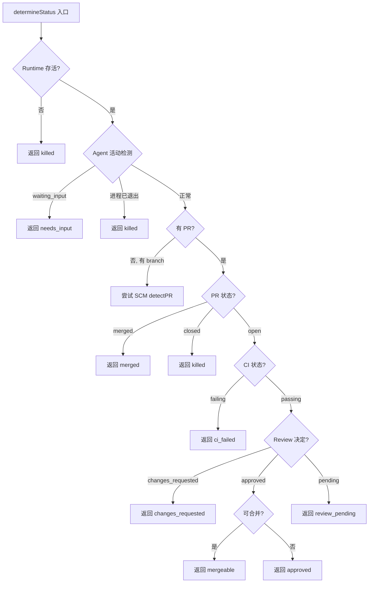
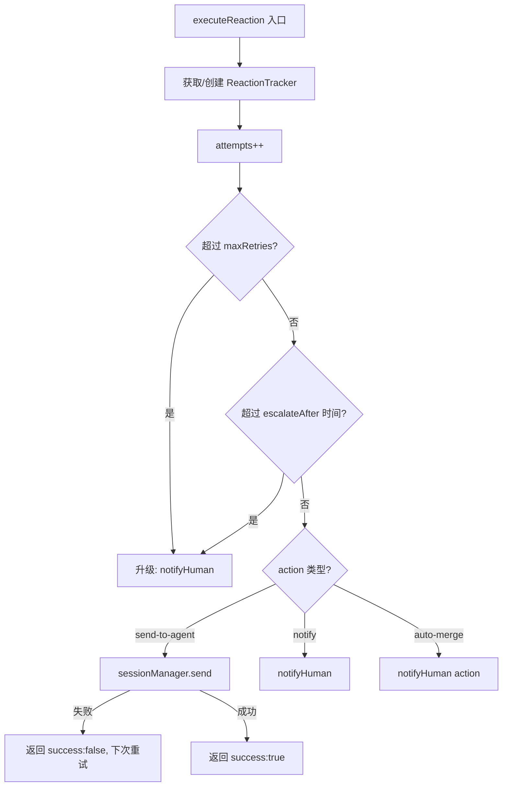

# PD-10.03 Agent Orchestrator — 事件驱动生命周期管道

> 文档编号：PD-10.03
> 来源：Agent Orchestrator `packages/core/src/lifecycle-manager.ts`
> GitHub：https://github.com/ComposioHQ/agent-orchestrator.git
> 问题域：PD-10 中间件管道 Middleware Pipeline
> 状态：可复用方案

---

## 第 1 章 问题与动机

### 1.1 核心问题

当多个 AI Agent 会话并行运行时（每个处理不同的 GitHub Issue），系统需要一条自动化管道来：

1. **状态感知**：持续轮询每个 session 的运行状态（agent 是否存活、PR 是否创建、CI 是否通过、Review 是否完成）
2. **事件推断**：从状态转换中推断出语义事件（`ci.failing`、`review.changes_requested`、`merge.ready`）
3. **自动反应**：根据事件自动执行动作（向 agent 发送修复指令、通知人类、自动合并）
4. **升级兜底**：当自动反应多次失败后，升级为人类通知

传统中间件管道（如 Express/Koa）处理的是 HTTP 请求的线性流水线。Agent Orchestrator 面对的是一个**状态机驱动的事件循环**——每个 session 有 14 种状态、20+ 种事件类型、10 种反应配置，且需要跨插件协调（Runtime × Agent × SCM × Notifier）。

### 1.2 Agent Orchestrator 的解法概述

Agent Orchestrator 采用 **LifecycleManager** 作为核心管道，实现五阶段事件驱动循环：

1. **状态轮询**：`pollAll()` 定时遍历所有 session，调用 `determineStatus()` 通过 Runtime/Agent/SCM 插件探测真实状态（`lifecycle-manager.ts:524-580`）
2. **状态转换检测**：`checkSession()` 对比 tracked state 与新状态，检测转换（`lifecycle-manager.ts:436-521`）
3. **事件推断**：`statusToEventType()` 将状态转换映射为语义事件（`lifecycle-manager.ts:102-131`）
4. **反应键映射**：`eventToReactionKey()` 将事件映射为可配置的反应键（`lifecycle-manager.ts:134-157`）
5. **反应执行 + 升级**：`executeReaction()` 执行动作，跟踪重试次数，超限后升级为人类通知（`lifecycle-manager.ts:292-416`）

同时，Agent 插件通过 **PostToolUse Hook**（Bash 脚本）拦截 agent 的工具调用，自动更新 session 元数据（PR URL、branch name、merge status），实现从 agent 内部到编排层的信息回流（`agent-claude-code/src/index.ts:31-167`）。

### 1.3 设计思想

| 设计原则 | 具体实现 | 理由 | 替代方案 |
|----------|----------|------|----------|
| 轮询而非推送 | `setInterval` 定时 `pollAll()`，默认 30s | Agent 运行在 tmux/docker 中，无法主动推送状态变更；轮询是最可靠的跨运行时方案 | WebSocket 推送（需要 agent 支持）、文件系统 watch（不可靠） |
| 状态机而非管道 | 14 种 `SessionStatus` + 转换检测 | Session 生命周期是非线性的（可回退、可跳跃），管道模型无法表达 | 线性中间件链（无法处理状态回退） |
| 插件探测而非自报 | `determineStatus()` 主动调用 Runtime/Agent/SCM 插件 | 不同 agent（Claude Code/Codex/Aider）有不同的状态报告机制，统一由编排层探测 | Agent 自报状态（需要统一协议） |
| 反应可配置 | YAML 配置 `reactions` 字段，支持 `auto`/`retries`/`escalateAfter` | 不同团队对自动化程度有不同偏好，硬编码不灵活 | 硬编码反应逻辑 |
| Hook 脚本元数据回流 | PostToolUse Bash 脚本解析 agent 工具调用输出 | Agent 内部无法直接写入编排层数据库，Hook 是 Claude Code 原生支持的扩展点 | MCP Server（更重）、轮询 git log（延迟高） |

---

## 第 2 章 源码实现分析

### 2.1 架构概览

Agent Orchestrator 的中间件管道不是传统的请求-响应链，而是一个**事件驱动的状态机循环**，由 LifecycleManager 驱动：

```
┌─────────────────────────────────────────────────────────────┐
│                    LifecycleManager                          │
│                                                              │
│  ┌──────────┐    ┌──────────────┐    ┌──────────────────┐   │
│  │ pollAll() │───→│ checkSession │───→│ executeReaction  │   │
│  │ (30s loop)│    │ (per session)│    │ (auto-handle)    │   │
│  └──────────┘    └──────┬───────┘    └────────┬─────────┘   │
│       ↑                 │                      │             │
│       │          ┌──────▼───────┐    ┌────────▼─────────┐   │
│       │          │determineStatus│    │  notifyHuman     │   │
│       │          │(plugin probe) │    │  (escalation)    │   │
│       │          └──────┬───────┘    └──────────────────┘   │
│       │                 │                                    │
│       │    ┌────────────┼────────────┐                      │
│       │    ▼            ▼            ▼                      │
│  ┌─────────┐   ┌──────────┐   ┌──────────┐                 │
│  │ Runtime  │   │  Agent   │   │   SCM    │                 │
│  │ (tmux)   │   │ (claude) │   │ (github) │                 │
│  └─────────┘   └──────────┘   └──────────┘                 │
└─────────────────────────────────────────────────────────────┘
                          ↑
                          │ PostToolUse Hook
                   ┌──────┴───────┐
                   │ metadata-    │
                   │ updater.sh   │
                   │ (Bash script)│
                   └──────────────┘
```

### 2.2 核心实现

#### 2.2.1 状态探测管道：determineStatus

LifecycleManager 的核心是 `determineStatus()` 函数，它按优先级依次调用多个插件来确定 session 的真实状态。



对应源码 `packages/core/src/lifecycle-manager.ts:182-289`：

```typescript
async function determineStatus(session: Session): Promise<SessionStatus> {
    const project = config.projects[session.projectId];
    if (!project) return session.status;

    const agentName = session.metadata["agent"] ?? project.agent ?? config.defaults.agent;
    const agent = registry.get<Agent>("agent", agentName);
    const scm = project.scm ? registry.get<SCM>("scm", project.scm.plugin) : null;

    // 1. Check if runtime is alive
    if (session.runtimeHandle) {
      const runtime = registry.get<Runtime>("runtime", project.runtime ?? config.defaults.runtime);
      if (runtime) {
        const alive = await runtime.isAlive(session.runtimeHandle).catch(() => true);
        if (!alive) return "killed";
      }
    }

    // 2. Check agent activity via terminal output + process liveness
    if (agent && session.runtimeHandle) {
      try {
        const runtime = registry.get<Runtime>("runtime", project.runtime ?? config.defaults.runtime);
        const terminalOutput = runtime ? await runtime.getOutput(session.runtimeHandle, 10) : "";
        if (terminalOutput) {
          const activity = agent.detectActivity(terminalOutput);
          if (activity === "waiting_input") return "needs_input";
          const processAlive = await agent.isProcessRunning(session.runtimeHandle);
          if (!processAlive) return "killed";
        }
      } catch {
        if (session.status === SESSION_STATUS.STUCK || session.status === SESSION_STATUS.NEEDS_INPUT) {
          return session.status;
        }
      }
    }

    // 3. Auto-detect PR by branch if metadata.pr is missing
    if (!session.pr && scm && session.branch) {
      try {
        const detectedPR = await scm.detectPR(session, project);
        if (detectedPR) {
          session.pr = detectedPR;
          const sessionsDir = getSessionsDir(config.configPath, project.path);
          updateMetadata(sessionsDir, session.id, { pr: detectedPR.url });
        }
      } catch { /* retry next poll */ }
    }

    // 4. Check PR state if PR exists
    if (session.pr && scm) {
      const prState = await scm.getPRState(session.pr);
      if (prState === PR_STATE.MERGED) return "merged";
      if (prState === PR_STATE.CLOSED) return "killed";
      const ciStatus = await scm.getCISummary(session.pr);
      if (ciStatus === CI_STATUS.FAILING) return "ci_failed";
      const reviewDecision = await scm.getReviewDecision(session.pr);
      if (reviewDecision === "changes_requested") return "changes_requested";
      if (reviewDecision === "approved") {
        const mergeReady = await scm.getMergeability(session.pr);
        if (mergeReady.mergeable) return "mergeable";
        return "approved";
      }
      if (reviewDecision === "pending") return "review_pending";
      return "pr_open";
    }

    return session.status;
  }
```

#### 2.2.2 反应执行与升级机制



对应源码 `packages/core/src/lifecycle-manager.ts:292-416`：

```typescript
async function executeReaction(
    sessionId: SessionId,
    projectId: string,
    reactionKey: string,
    reactionConfig: ReactionConfig,
  ): Promise<ReactionResult> {
    const trackerKey = `${sessionId}:${reactionKey}`;
    let tracker = reactionTrackers.get(trackerKey);
    if (!tracker) {
      tracker = { attempts: 0, firstTriggered: new Date() };
      reactionTrackers.set(trackerKey, tracker);
    }
    tracker.attempts++;

    // Check if we should escalate
    const maxRetries = reactionConfig.retries ?? Infinity;
    const escalateAfter = reactionConfig.escalateAfter;
    let shouldEscalate = false;

    if (tracker.attempts > maxRetries) shouldEscalate = true;
    if (typeof escalateAfter === "string") {
      const durationMs = parseDuration(escalateAfter);
      if (durationMs > 0 && Date.now() - tracker.firstTriggered.getTime() > durationMs) {
        shouldEscalate = true;
      }
    }
    if (typeof escalateAfter === "number" && tracker.attempts > escalateAfter) {
      shouldEscalate = true;
    }

    if (shouldEscalate) {
      const event = createEvent("reaction.escalated", {
        sessionId, projectId,
        message: `Reaction '${reactionKey}' escalated after ${tracker.attempts} attempts`,
      });
      await notifyHuman(event, reactionConfig.priority ?? "urgent");
      return { reactionType: reactionKey, success: true, action: "escalated", escalated: true };
    }

    // Execute the reaction action
    switch (reactionConfig.action ?? "notify") {
      case "send-to-agent":
        if (reactionConfig.message) {
          try {
            await sessionManager.send(sessionId, reactionConfig.message);
            return { reactionType: reactionKey, success: true, action: "send-to-agent", escalated: false };
          } catch {
            return { reactionType: reactionKey, success: false, action: "send-to-agent", escalated: false };
          }
        }
        break;
      case "notify": { /* ... notify human ... */ }
      case "auto-merge": { /* ... trigger merge ... */ }
    }
  }
```

### 2.3 实现细节

#### PostToolUse Hook 元数据回流

Agent 插件通过 `setupWorkspaceHooks()` 在工作区写入 `.claude/settings.json` 和 `metadata-updater.sh`，实现从 agent 内部到编排层的信息回流。

Hook 脚本解析 agent 的 Bash 工具调用输出，检测 `gh pr create`、`git checkout -b`、`gh pr merge` 等命令，自动更新 session 元数据文件（`agent-claude-code/src/index.ts:31-167`）。

关键设计：
- **原子更新**：使用 `mv temp_file metadata_file` 保证写入原子性（`index.ts:111`）
- **工具过滤**：只处理 `Bash` 工具调用，忽略 Read/Write 等（`index.ts:68`）
- **退出码语义**：只处理 exit_code=0 的成功命令（`index.ts:62-65`）
- **jq 降级**：优先用 jq 解析 JSON，无 jq 时降级为 grep/cut（`index.ts:48-59`）

#### 通知路由

`notifyHuman()` 根据事件优先级路由到不同通知渠道（`lifecycle-manager.ts:419-433`）：

```typescript
async function notifyHuman(event: OrchestratorEvent, priority: EventPriority): Promise<void> {
    const eventWithPriority = { ...event, priority };
    const notifierNames = config.notificationRouting[priority] ?? config.defaults.notifiers;
    for (const name of notifierNames) {
      const notifier = registry.get<Notifier>("notifier", name);
      if (notifier) {
        try { await notifier.notify(eventWithPriority); } catch { /* notifier failed */ }
      }
    }
  }
```

配置示例（`examples/auto-merge.yaml`）：

```yaml
notificationRouting:
  urgent: [desktop, slack]
  action: [desktop, slack]
  warning: [slack]
  info: [slack]
```

#### 插件注册表

`PluginRegistry` 使用 `Map<"slot:name", instance>` 存储 8 种插件槽位（Runtime/Agent/Workspace/Tracker/SCM/Notifier/Terminal），支持 16 个内置插件的动态加载（`plugin-registry.ts:26-50`）。

#### 反应追踪器重置

当 session 状态发生转换时，旧状态对应的反应追踪器会被清除，确保重试计数不会跨状态累积（`lifecycle-manager.ts:462-468`）：

```typescript
const oldEventType = statusToEventType(undefined, oldStatus);
if (oldEventType) {
  const oldReactionKey = eventToReactionKey(oldEventType);
  if (oldReactionKey) {
    reactionTrackers.delete(`${session.id}:${oldReactionKey}`);
  }
}
```

---

## 第 3 章 迁移指南

### 3.1 迁移清单

**阶段 1：状态机基础**
- [ ] 定义 session 状态枚举（至少：spawning/working/pr_open/ci_failed/review_pending/approved/merged/killed）
- [ ] 实现 `statusToEventType()` 状态→事件映射表
- [ ] 实现 `eventToReactionKey()` 事件→反应键映射表
- [ ] 创建 `ReactionTracker` 跟踪每个 session 的反应重试次数

**阶段 2：插件探测层**
- [ ] 定义 Runtime/Agent/SCM 插件接口（`isAlive`/`detectActivity`/`getPRState`）
- [ ] 实现 `PluginRegistry`（`Map<"slot:name", instance>`）
- [ ] 实现 `determineStatus()` 按优先级调用插件链

**阶段 3：反应引擎**
- [ ] 实现 `executeReaction()` 支持 `send-to-agent`/`notify`/`auto-merge` 三种动作
- [ ] 实现升级机制：基于重试次数 + 时间窗口
- [ ] 实现通知路由：按优先级分发到不同通知渠道

**阶段 4：Hook 元数据回流**
- [ ] 编写 PostToolUse Hook 脚本（解析 agent 工具调用输出）
- [ ] 实现 `setupWorkspaceHooks()` 自动注入 Hook 到工作区配置

### 3.2 适配代码模板

以下是一个可直接复用的 TypeScript 事件驱动生命周期管道骨架：

```typescript
// lifecycle-pipeline.ts — 可复用的事件驱动生命周期管道

type SessionStatus = "spawning" | "working" | "pr_open" | "ci_failed"
  | "review_pending" | "approved" | "mergeable" | "merged" | "killed";

type EventType = "session.working" | "pr.created" | "ci.failing"
  | "review.changes_requested" | "review.approved" | "merge.ready" | "merge.completed";

interface ReactionConfig {
  auto: boolean;
  action: "send-to-agent" | "notify" | "auto-merge";
  message?: string;
  retries?: number;
  escalateAfter?: number | string;
  priority?: "urgent" | "action" | "warning" | "info";
}

interface ReactionTracker {
  attempts: number;
  firstTriggered: Date;
}

// 状态→事件映射
function statusToEventType(to: SessionStatus): EventType | null {
  const map: Partial<Record<SessionStatus, EventType>> = {
    working: "session.working",
    pr_open: "pr.created",
    ci_failed: "ci.failing",
    approved: "review.approved",
    mergeable: "merge.ready",
    merged: "merge.completed",
  };
  return map[to] ?? null;
}

// 事件→反应键映射
function eventToReactionKey(eventType: EventType): string | null {
  const map: Partial<Record<EventType, string>> = {
    "ci.failing": "ci-failed",
    "review.changes_requested": "changes-requested",
    "merge.ready": "approved-and-green",
  };
  return map[eventType] ?? null;
}

// 反应执行器（含升级逻辑）
class ReactionEngine {
  private trackers = new Map<string, ReactionTracker>();
  private reactions: Record<string, ReactionConfig>;

  constructor(reactions: Record<string, ReactionConfig>) {
    this.reactions = reactions;
  }

  async execute(
    sessionId: string,
    reactionKey: string,
    sendToAgent: (id: string, msg: string) => Promise<void>,
    notifyHuman: (msg: string, priority: string) => Promise<void>,
  ): Promise<{ success: boolean; escalated: boolean }> {
    const config = this.reactions[reactionKey];
    if (!config) return { success: false, escalated: false };

    const trackerKey = `${sessionId}:${reactionKey}`;
    let tracker = this.trackers.get(trackerKey);
    if (!tracker) {
      tracker = { attempts: 0, firstTriggered: new Date() };
      this.trackers.set(trackerKey, tracker);
    }
    tracker.attempts++;

    // 升级检查
    const maxRetries = config.retries ?? Infinity;
    if (tracker.attempts > maxRetries) {
      await notifyHuman(
        `Reaction '${reactionKey}' escalated after ${tracker.attempts} attempts`,
        config.priority ?? "urgent",
      );
      return { success: true, escalated: true };
    }

    // 执行动作
    if (config.action === "send-to-agent" && config.message) {
      try {
        await sendToAgent(sessionId, config.message);
        return { success: true, escalated: false };
      } catch {
        return { success: false, escalated: false };
      }
    }

    if (config.action === "notify") {
      await notifyHuman(`Reaction '${reactionKey}' triggered`, config.priority ?? "info");
      return { success: true, escalated: false };
    }

    return { success: false, escalated: false };
  }

  resetForSession(sessionId: string, reactionKey: string): void {
    this.trackers.delete(`${sessionId}:${reactionKey}`);
  }
}

// 生命周期管理器
class LifecyclePipeline {
  private states = new Map<string, SessionStatus>();
  private engine: ReactionEngine;
  private timer: ReturnType<typeof setInterval> | null = null;

  constructor(
    reactions: Record<string, ReactionConfig>,
    private pollFn: () => Promise<Array<{ id: string; status: SessionStatus }>>,
    private sendToAgent: (id: string, msg: string) => Promise<void>,
    private notifyHuman: (msg: string, priority: string) => Promise<void>,
  ) {
    this.engine = new ReactionEngine(reactions);
  }

  start(intervalMs = 30_000): void {
    if (this.timer) return;
    this.timer = setInterval(() => void this.poll(), intervalMs);
    void this.poll();
  }

  stop(): void {
    if (this.timer) { clearInterval(this.timer); this.timer = null; }
  }

  private async poll(): Promise<void> {
    const sessions = await this.pollFn();
    for (const session of sessions) {
      const oldStatus = this.states.get(session.id);
      if (oldStatus !== session.status) {
        this.states.set(session.id, session.status);
        const eventType = statusToEventType(session.status);
        if (eventType) {
          const reactionKey = eventToReactionKey(eventType);
          if (reactionKey) {
            await this.engine.execute(
              session.id, reactionKey, this.sendToAgent, this.notifyHuman,
            );
          }
        }
      }
    }
  }
}
```

### 3.3 适用场景

| 场景 | 适用度 | 说明 |
|------|--------|------|
| 多 Agent 并行编排 | ⭐⭐⭐ | 核心场景：多个 agent 同时处理不同 issue，需要统一监控和自动反应 |
| CI/CD 自动修复 | ⭐⭐⭐ | CI 失败时自动向 agent 发送修复指令，减少人工干预 |
| PR 生命周期管理 | ⭐⭐⭐ | 从 PR 创建到合并的全流程自动化（review → CI → merge） |
| 单 Agent 监控 | ⭐⭐ | 可用但过度设计，简单的 health check 即可 |
| 实时流式处理 | ⭐ | 轮询模型不适合低延迟场景，需改为事件推送 |

---

## 第 4 章 测试用例

```python
import pytest
from datetime import datetime, timedelta
from unittest.mock import AsyncMock, MagicMock
from typing import Optional

# 模拟核心类型
class SessionStatus:
    SPAWNING = "spawning"
    WORKING = "working"
    PR_OPEN = "pr_open"
    CI_FAILED = "ci_failed"
    REVIEW_PENDING = "review_pending"
    APPROVED = "approved"
    MERGEABLE = "mergeable"
    MERGED = "merged"
    KILLED = "killed"
    NEEDS_INPUT = "needs_input"
    STUCK = "stuck"

class ReactionTracker:
    def __init__(self):
        self.attempts = 0
        self.first_triggered = datetime.now()

class ReactionConfig:
    def __init__(self, auto=True, action="notify", retries=None, escalate_after=None, message=None):
        self.auto = auto
        self.action = action
        self.retries = retries
        self.escalate_after = escalate_after
        self.message = message


class TestStatusToEventType:
    """测试状态→事件映射（lifecycle-manager.ts:102-131）"""

    def test_working_maps_to_session_working(self):
        assert status_to_event_type("working") == "session.working"

    def test_ci_failed_maps_to_ci_failing(self):
        assert status_to_event_type("ci_failed") == "ci.failing"

    def test_merged_maps_to_merge_completed(self):
        assert status_to_event_type("merged") == "merge.completed"

    def test_unknown_status_returns_none(self):
        assert status_to_event_type("spawning") is None


class TestEventToReactionKey:
    """测试事件→反应键映射（lifecycle-manager.ts:134-157）"""

    def test_ci_failing_maps_to_ci_failed(self):
        assert event_to_reaction_key("ci.failing") == "ci-failed"

    def test_changes_requested_maps_correctly(self):
        assert event_to_reaction_key("review.changes_requested") == "changes-requested"

    def test_merge_ready_maps_to_approved_and_green(self):
        assert event_to_reaction_key("merge.ready") == "approved-and-green"

    def test_session_working_returns_none(self):
        assert event_to_reaction_key("session.working") is None


class TestReactionEscalation:
    """测试反应升级机制（lifecycle-manager.ts:292-344）"""

    def test_escalates_after_max_retries(self):
        tracker = ReactionTracker()
        config = ReactionConfig(retries=3, action="send-to-agent", message="fix CI")
        tracker.attempts = 4  # 超过 retries=3
        assert tracker.attempts > config.retries

    def test_escalates_after_duration(self):
        tracker = ReactionTracker()
        tracker.first_triggered = datetime.now() - timedelta(hours=2)
        config = ReactionConfig(escalate_after="1h")
        elapsed_ms = (datetime.now() - tracker.first_triggered).total_seconds() * 1000
        assert elapsed_ms > 3_600_000  # 1h in ms

    def test_no_escalation_within_limits(self):
        tracker = ReactionTracker()
        tracker.attempts = 1
        config = ReactionConfig(retries=3)
        assert tracker.attempts <= config.retries


class TestReactionTrackerReset:
    """测试状态转换时反应追踪器重置（lifecycle-manager.ts:462-468）"""

    def test_tracker_cleared_on_state_transition(self):
        trackers = {"session-1:ci-failed": ReactionTracker()}
        trackers["session-1:ci-failed"].attempts = 3
        # 模拟状态从 ci_failed 转换到 working
        old_event = status_to_event_type("ci_failed")
        old_key = event_to_reaction_key(old_event) if old_event else None
        if old_key:
            del trackers[f"session-1:{old_key}"]
        assert "session-1:ci-failed" not in trackers


class TestNotificationRouting:
    """测试通知路由（lifecycle-manager.ts:419-433）"""

    def test_urgent_routes_to_desktop_and_slack(self):
        routing = {
            "urgent": ["desktop", "slack"],
            "action": ["desktop", "slack"],
            "warning": ["slack"],
            "info": ["slack"],
        }
        assert "desktop" in routing["urgent"]
        assert "slack" in routing["urgent"]

    def test_info_routes_only_to_slack(self):
        routing = {"info": ["slack"]}
        assert routing["info"] == ["slack"]


class TestDetermineStatusPriority:
    """测试 determineStatus 的优先级链（lifecycle-manager.ts:182-289）"""

    def test_runtime_dead_takes_highest_priority(self):
        """Runtime 不存活时，无论其他状态如何，都返回 killed"""
        # 模拟：runtime.isAlive() 返回 False
        assert determine_status_priority(runtime_alive=False) == "killed"

    def test_agent_waiting_input_overrides_pr_state(self):
        """Agent 等待输入时，即使 PR 存在也返回 needs_input"""
        assert determine_status_priority(
            runtime_alive=True, agent_activity="waiting_input", has_pr=True
        ) == "needs_input"

    def test_pr_merged_overrides_ci_status(self):
        """PR 已合并时，CI 状态不再重要"""
        assert determine_status_priority(
            runtime_alive=True, agent_activity="active",
            has_pr=True, pr_state="merged"
        ) == "merged"


# 辅助函数实现
def status_to_event_type(status: str) -> Optional[str]:
    mapping = {
        "working": "session.working", "pr_open": "pr.created",
        "ci_failed": "ci.failing", "review_pending": "review.pending",
        "changes_requested": "review.changes_requested",
        "approved": "review.approved", "mergeable": "merge.ready",
        "merged": "merge.completed", "needs_input": "session.needs_input",
        "stuck": "session.stuck", "killed": "session.killed",
    }
    return mapping.get(status)

def event_to_reaction_key(event_type: str) -> Optional[str]:
    mapping = {
        "ci.failing": "ci-failed",
        "review.changes_requested": "changes-requested",
        "merge.ready": "approved-and-green",
        "session.stuck": "agent-stuck",
        "session.needs_input": "agent-needs-input",
        "session.killed": "agent-exited",
    }
    return mapping.get(event_type)

def determine_status_priority(
    runtime_alive=True, agent_activity="active",
    has_pr=False, pr_state="open", ci_status="passing",
    review_decision="none"
) -> str:
    if not runtime_alive: return "killed"
    if agent_activity == "waiting_input": return "needs_input"
    if has_pr:
        if pr_state == "merged": return "merged"
        if pr_state == "closed": return "killed"
        if ci_status == "failing": return "ci_failed"
        if review_decision == "approved": return "approved"
    return "working"
```

---

## 第 5 章 跨域关联

| 关联域 | 关系类型 | 说明 |
|--------|----------|------|
| PD-02 多 Agent 编排 | 依赖 | LifecycleManager 依赖 SessionManager 管理多个并行 session，`pollAll()` 并发检查所有 session 状态 |
| PD-04 工具系统 | 协同 | PostToolUse Hook 是工具系统的扩展点，agent-claude-code 插件通过 Hook 拦截 Bash 工具调用实现元数据回流 |
| PD-09 Human-in-the-Loop | 协同 | `needs_input` 状态检测 + 通知路由实现人机交互闭环；`executeReaction` 的升级机制是 HITL 的自动化入口 |
| PD-11 可观测性 | 协同 | 事件系统（20+ EventType）为可观测性提供数据源；Slack/Webhook 通知器是可观测性的输出渠道 |
| PD-03 容错与重试 | 协同 | `ReactionTracker` 的重试计数 + `escalateAfter` 时间窗口是容错机制的一种实现；`determineStatus` 中的 `catch` 保留当前状态而非崩溃 |
| PD-06 记忆持久化 | 依赖 | 元数据文件（flat key=value）是 session 状态的持久化载体，`updateMetadata` 在状态转换时写入磁盘 |

---

## 第 6 章 来源文件索引

| 文件 | 行范围 | 关键实现 |
|------|--------|----------|
| `packages/core/src/lifecycle-manager.ts` | L1-L607 | LifecycleManager 完整实现：状态机 + 轮询循环 + 反应引擎 |
| `packages/core/src/lifecycle-manager.ts` | L182-L289 | `determineStatus()` 五层插件探测链 |
| `packages/core/src/lifecycle-manager.ts` | L292-L416 | `executeReaction()` 反应执行 + 升级机制 |
| `packages/core/src/lifecycle-manager.ts` | L436-L521 | `checkSession()` 状态转换检测 + 事件分发 |
| `packages/core/src/lifecycle-manager.ts` | L524-L580 | `pollAll()` 并发轮询 + 重入保护 + 全局完成检测 |
| `packages/core/src/types.ts` | L26-L42 | `SessionStatus` 14 种状态定义 |
| `packages/core/src/types.ts` | L44-L51 | `ActivityState` 6 种活动状态 |
| `packages/core/src/types.ts` | L700-L736 | `EventType` 20+ 事件类型定义 |
| `packages/core/src/types.ts` | L755-L779 | `ReactionConfig` 反应配置接口 |
| `packages/core/src/types.ts` | L917-L924 | `PluginSlot` 7 种插件槽位 |
| `packages/plugins/agent-claude-code/src/index.ts` | L31-L167 | PostToolUse Hook Bash 脚本（元数据回流） |
| `packages/plugins/agent-claude-code/src/index.ts` | L497-L575 | `setupHookInWorkspace()` Hook 注入逻辑 |
| `packages/plugins/agent-claude-code/src/index.ts` | L459-L484 | `classifyTerminalOutput()` 终端输出活动分类 |
| `packages/core/src/plugin-registry.ts` | L26-L50 | 16 个内置插件注册表 |
| `packages/core/src/metadata.ts` | L160-L185 | `updateMetadata()` 原子性元数据更新 |
| `packages/core/src/session-manager.ts` | L315-L559 | `spawn()` session 创建全流程（workspace → runtime → agent → hook） |
| `examples/auto-merge.yaml` | L1-L38 | 反应配置示例（ci-failed/changes-requested/agent-stuck） |

---

## 第 7 章 横向对比维度

```json comparison_data
{
  "project": "AgentOrchestrator",
  "dimensions": {
    "中间件基类": "无基类，函数式闭包 + PluginRegistry 插件槽位",
    "钩子点": "14 种 SessionStatus 转换 + PostToolUse Hook",
    "中间件数量": "8 插件槽位 × 16 内置插件 + 10 反应配置",
    "条件激活": "YAML reactions.auto 字段 + 项目级 override",
    "状态管理": "Map<SessionId, SessionStatus> 内存 + flat key=value 文件持久化",
    "执行模型": "setInterval 轮询（30s）+ Promise.allSettled 并发探测",
    "同步热路径": "determineStatus 全异步，无同步热路径约束",
    "错误隔离": "每个 session 独立 try/catch，插件探测失败保留当前状态",
    "交互桥接": "needs_input 状态检测 → 通知路由 → 人类响应 → send-to-agent",
    "装饰器包装": "PostToolUse Hook 脚本拦截 agent 工具调用，不修改 agent 代码",
    "通知路由": "按 EventPriority 四级路由到不同 Notifier 插件组合",
    "反应升级": "ReactionTracker 跟踪重试次数 + 时间窗口，超限升级为人类通知"
  }
}
```

### 域元数据补充

```json domain_metadata
{
  "solution_summary": "AgentOrchestrator 用 LifecycleManager 状态机 + 14 态转换 + 10 种 YAML 可配置反应实现事件驱动生命周期管道，PostToolUse Hook 脚本拦截 agent 工具调用自动回流元数据",
  "description": "事件驱动的状态机循环可替代线性中间件链处理非线性生命周期",
  "sub_problems": [
    "反应升级策略：重试次数 vs 时间窗口的双维度升级判定",
    "跨插件状态探测：多插件按优先级链式探测 session 真实状态",
    "元数据回流：agent 内部信息如何通过 Hook 回传到编排层",
    "轮询重入保护：定时轮询如何防止上一轮未完成时重复执行",
    "全局完成检测：所有 session 终态时的一次性汇总通知"
  ],
  "best_practices": [
    "状态转换时重置反应追踪器：避免重试计数跨状态累积导致误升级",
    "插件探测失败保留当前状态：catch 中返回 session.status 而非默认值，防止状态抖动",
    "PostToolUse Hook 原子写入：mv temp_file 保证元数据文件一致性",
    "并发轮询用 Promise.allSettled：单个 session 探测失败不阻塞其他 session",
    "反应配置支持项目级 override：全局默认 + 项目特化，用 spread 合并"
  ]
}
```
