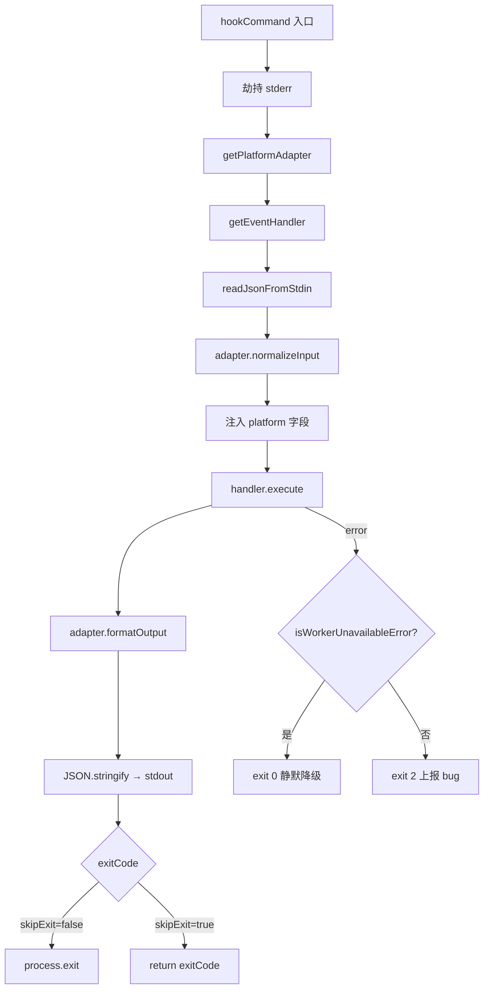
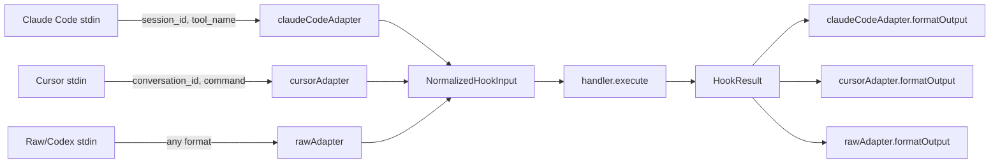

# PD-10.04 claude-mem — Adapter 模式 × 生命周期 Hook 管道

> 文档编号：PD-10.04
> 来源：claude-mem `src/cli/hook-command.ts`, `src/cli/adapters/index.ts`, `src/cli/handlers/index.ts`
> GitHub：https://github.com/thedotmack/claude-mem.git
> 问题域：PD-10 中间件管道 Middleware Pipeline
> 状态：可复用方案

---

## 第 1 章 问题与动机

### 1.1 核心问题

AI 编码助手（Claude Code、Cursor、Codex CLI 等）各自定义了不同的 Hook 生命周期事件和 stdin/stdout 数据格式。一个记忆插件如果要同时支持多个平台，面临两个核心挑战：

1. **平台差异归一化**：Claude Code 用 `session_id` + `tool_name`，Cursor 用 `conversation_id` + `command`/`result_json`，字段名、嵌套结构、可选字段完全不同。如果每个 handler 都自己做格式转换，代码会迅速膨胀且难以维护。
2. **Hook 事件路由与容错**：5 个生命周期阶段（SessionStart → UserPromptSubmit → PostToolUse → Stop → SessionEnd）各自需要不同的处理逻辑，但都必须遵守同一条铁律——**Hook 失败绝不能阻塞宿主 IDE 的正常工作流**。

claude-mem 的解法是将这两个关注点彻底分离：Adapter 层负责 I/O 归一化，Handler 层负责业务逻辑，`hookCommand` 函数作为管道编排器串联两者并提供统一的错误分类与降级策略。

### 1.2 claude-mem 的解法概述

1. **Adapter 模式归一化输入输出**：3 个平台适配器（claude-code / cursor / raw）将平台特定的 stdin JSON 转换为统一的 `NormalizedHookInput` 接口，handler 完全不感知平台差异（`src/cli/adapters/index.ts:6-14`）
2. **Handler 工厂 + 静态注册表**：7 个事件处理器通过 `Record<EventType, EventHandler>` 静态映射注册，未知事件返回 no-op handler 而非抛异常（`src/cli/handlers/index.ts:27-35`）
3. **hookCommand 管道编排器**：单一入口函数串联 stdin 读取 → adapter 归一化 → handler 执行 → adapter 格式化输出 → JSON stdout，全程 try/catch 包裹（`src/cli/hook-command.ts:68-112`）
4. **错误二分类降级**：`isWorkerUnavailableError` 将错误分为"worker 不可用"（exit 0 静默降级）和"代码 bug"（exit 2 上报），避免网络抖动阻塞用户（`src/cli/hook-command.ts:26-66`）
5. **stderr 静默策略**：Hook 执行期间劫持 `process.stderr.write` 为 no-op，所有诊断走日志文件，防止 Claude Code 将 stderr 误判为错误 UI（`src/cli/hook-command.ts:72-73`）

### 1.3 设计思想

| 设计原则 | 具体实现 | 理由 | 替代方案 |
|----------|----------|------|----------|
| Adapter 模式解耦平台差异 | `PlatformAdapter` 接口 + 3 个实现 | Handler 零平台感知，新增平台只加 adapter | 每个 handler 内部 if/else 判断平台 |
| 静态 Handler 注册表 | `Record<EventType, EventHandler>` 字面量 | 编译期类型安全，无运行时注册开销 | 动态 registry.register() 模式 |
| 未知事件 no-op 降级 | `getEventHandler` 返回空 handler | 宿主 IDE 新增事件不会导致插件崩溃 | throw Error 阻塞用户 |
| 错误二分类 | transport/timeout → exit 0, 4xx/TypeError → exit 2 | Worker 不可用时静默，代码 bug 上报 | 统一 exit 1 无法区分 |
| stderr 劫持 | `process.stderr.write = () => true` | Claude Code 对 stderr 有特殊 UI 处理 | 不劫持，依赖 logger 过滤 |
| Worker 健康前置检查 | 每个 handler 首行 `ensureWorkerRunning()` | 快速失败，避免无意义的业务逻辑执行 | 在 hookCommand 层统一检查 |

---

## 第 2 章 源码实现分析

### 2.1 架构概览

claude-mem 的 Hook 管道采用经典的三层架构：Adapter → Orchestrator → Handler，通过 stdin/stdout JSON 与宿主 IDE 通信。

```
┌─────────────────────────────────────────────────────────────────┐
│                    宿主 IDE (Claude Code / Cursor)               │
│  hooks.json 声明 5 个生命周期事件 → spawn 子进程执行 hook         │
└──────────────┬──────────────────────────────────┬───────────────┘
               │ stdin (JSON)                     ↑ stdout (JSON)
┌──────────────▼──────────────────────────────────┴───────────────┐
│                    hookCommand() 管道编排器                       │
│  ┌─────────────┐   ┌──────────────┐   ┌─────────────────────┐  │
│  │ stdinReader  │──→│ adapter.     │──→│ handler.execute()   │  │
│  │ (JSON parse) │   │ normalizeInput│   │ (业务逻辑)          │  │
│  └─────────────┘   └──────────────┘   └────────┬────────────┘  │
│                                                  │              │
│  ┌─────────────────────────────────────────────▼────────────┐  │
│  │ adapter.formatOutput() → JSON.stringify → stdout          │  │
│  └──────────────────────────────────────────────────────────┘  │
│                                                                 │
│  错误处理: isWorkerUnavailableError() → exit 0 或 exit 2        │
└─────────────────────────────────────────────────────────────────┘
               │ HTTP
┌──────────────▼──────────────────────────────────────────────────┐
│              Worker Service (常驻后台进程)                        │
│  /api/context/inject  /api/sessions/init  /api/sessions/observe │
└─────────────────────────────────────────────────────────────────┘
```

### 2.2 核心实现

#### 2.2.1 hookCommand 管道编排器



对应源码 `src/cli/hook-command.ts:68-112`：

```typescript
export async function hookCommand(platform: string, event: string, options: HookCommandOptions = {}): Promise<number> {
  // 劫持 stderr — Claude Code 对 stderr 有特殊 UI 处理 (#1181)
  const originalStderrWrite = process.stderr.write.bind(process.stderr);
  process.stderr.write = (() => true) as typeof process.stderr.write;

  try {
    const adapter = getPlatformAdapter(platform);
    const handler = getEventHandler(event);

    const rawInput = await readJsonFromStdin();
    const input = adapter.normalizeInput(rawInput);
    input.platform = platform;  // 注入平台标识供 handler 决策
    const result = await handler.execute(input);
    const output = adapter.formatOutput(result);

    console.log(JSON.stringify(output));
    const exitCode = result.exitCode ?? HOOK_EXIT_CODES.SUCCESS;
    if (!options.skipExit) {
      process.exit(exitCode);
    }
    return exitCode;
  } catch (error) {
    if (isWorkerUnavailableError(error)) {
      logger.warn('HOOK', `Worker unavailable, skipping hook: ${error instanceof Error ? error.message : error}`);
      if (!options.skipExit) {
        process.exit(HOOK_EXIT_CODES.SUCCESS);  // = 0 (graceful)
      }
      return HOOK_EXIT_CODES.SUCCESS;
    }
    logger.error('HOOK', `Hook error: ${error instanceof Error ? error.message : error}`, {}, error instanceof Error ? error : undefined);
    if (!options.skipExit) {
      process.exit(HOOK_EXIT_CODES.BLOCKING_ERROR);  // = 2
    }
    return HOOK_EXIT_CODES.BLOCKING_ERROR;
  } finally {
    process.stderr.write = originalStderrWrite;
  }
}
```

#### 2.2.2 Adapter 模式：平台差异归一化



对应源码 `src/cli/types.ts:1-30`（类型定义）：

```typescript
export interface NormalizedHookInput {
  sessionId: string;
  cwd: string;
  platform?: string;   // 'claude-code' or 'cursor'
  prompt?: string;
  toolName?: string;
  toolInput?: unknown;
  toolResponse?: unknown;
  transcriptPath?: string;
  filePath?: string;   // Cursor afterFileEdit
  edits?: unknown[];   // Cursor afterFileEdit
}

export interface PlatformAdapter {
  normalizeInput(raw: unknown): NormalizedHookInput;
  formatOutput(result: HookResult): unknown;
}

export interface EventHandler {
  execute(input: NormalizedHookInput): Promise<HookResult>;
}
```

Cursor adapter 的归一化逻辑展示了平台差异的复杂度（`src/cli/adapters/cursor.ts:11-33`）：

```typescript
export const cursorAdapter: PlatformAdapter = {
  normalizeInput(raw) {
    const r = (raw ?? {}) as any;
    const isShellCommand = !!r.command && !r.tool_name;
    return {
      sessionId: r.conversation_id || r.generation_id || r.id,
      cwd: r.workspace_roots?.[0] ?? r.cwd ?? process.cwd(),
      prompt: r.prompt ?? r.query ?? r.input ?? r.message,
      toolName: isShellCommand ? 'Bash' : r.tool_name,
      toolInput: isShellCommand ? { command: r.command } : r.tool_input,
      toolResponse: isShellCommand ? { output: r.output } : r.result_json,
      transcriptPath: undefined,  // Cursor 不提供 transcript
      filePath: r.file_path,
      edits: r.edits,
    };
  },
  formatOutput(result) {
    return { continue: result.continue ?? true };
  }
};
```

### 2.3 实现细节

#### Handler 注册与未知事件降级

Handler 工厂使用静态 `Record` 映射 7 个事件类型到对应处理器（`src/cli/handlers/index.ts:27-58`）。关键设计：未知事件不抛异常，返回 no-op handler：

```typescript
const handlers: Record<EventType, EventHandler> = {
  'context': contextHandler,           // SessionStart — 注入上下文
  'session-init': sessionInitHandler,  // UserPromptSubmit — 初始化会话
  'observation': observationHandler,   // PostToolUse — 保存工具观察
  'summarize': summarizeHandler,       // Stop (phase 1) — 生成摘要
  'session-complete': sessionCompleteHandler,  // Stop (phase 2) — 清理会话
  'user-message': userMessageHandler,  // SessionStart (parallel) — 用户展示
  'file-edit': fileEditHandler         // Cursor afterFileEdit
};

export function getEventHandler(eventType: string): EventHandler {
  const handler = handlers[eventType as EventType];
  if (!handler) {
    logger.warn('HOOK', `Unknown event type: ${eventType}, returning no-op`);
    return {
      async execute() {
        return { continue: true, suppressOutput: true, exitCode: HOOK_EXIT_CODES.SUCCESS };
      }
    };
  }
  return handler;
}
```

#### 错误二分类策略

`isWorkerUnavailableError`（`src/cli/hook-command.ts:26-66`）将错误精确分为两类：

- **Worker 不可用**（exit 0）：ECONNREFUSED、ECONNRESET、timeout、HTTP 5xx/429 → 静默降级
- **代码 bug**（exit 2）：HTTP 4xx、TypeError、ReferenceError → 上报给开发者

这种分类确保网络抖动或 worker 未启动时不会阻塞用户的编码工作流。

#### hooks.json 声明式注册

`plugin/hooks/hooks.json` 声明了 5 个生命周期阶段的 hook 链（`plugin/hooks/hooks.json:3-97`）：

| 生命周期事件 | 内部事件名 | Handler | 超时 |
|-------------|-----------|---------|------|
| SessionStart | context | contextHandler | 60s |
| UserPromptSubmit | session-init | sessionInitHandler | 60s |
| PostToolUse | observation | observationHandler | 120s |
| Stop (phase 1) | summarize | summarizeHandler | 120s |
| Stop (phase 2) | session-complete | sessionCompleteHandler | 30s |

每个 hook 链都先执行 `worker-service start`（确保 worker 运行），再执行具体的 hook 命令。这是一种"前置守卫"模式。

#### stdin 读取的自定界 JSON 解析

`readJsonFromStdin`（`src/cli/stdin-reader.ts:66-178`）解决了 Claude Code 不关闭 stdin 导致 `on('end')` 永不触发的问题。方案：JSON 是自定界的，每收到一个 chunk 就尝试 `JSON.parse`，成功即 resolve，无需等待 EOF。配合 30s 安全超时兜底。


---

## 第 3 章 迁移指南

### 3.1 迁移清单

#### 阶段 1：类型定义（0 依赖）

- [ ] 定义 `NormalizedInput` 接口（统一所有平台的输入字段）
- [ ] 定义 `HandlerResult` 接口（统一所有 handler 的返回值）
- [ ] 定义 `PlatformAdapter` 接口（`normalizeInput` + `formatOutput`）
- [ ] 定义 `EventHandler` 接口（`execute(input) → Promise<Result>`）
- [ ] 定义退出码常量（SUCCESS / FAILURE / BLOCKING_ERROR）

#### 阶段 2：Adapter 层

- [ ] 实现目标平台的 adapter（至少 1 个 + raw 测试 adapter）
- [ ] 每个 adapter 处理字段名映射、可选字段默认值、平台特有字段
- [ ] 实现 `getPlatformAdapter(name)` 工厂函数，default 分支返回 raw adapter

#### 阶段 3：Handler 层

- [ ] 实现各生命周期事件的 handler
- [ ] 每个 handler 首行调用 `ensureBackendReady()` 前置检查
- [ ] 实现 `getEventHandler(event)` 工厂函数，未知事件返回 no-op handler

#### 阶段 4：管道编排器

- [ ] 实现 `hookCommand(platform, event, options)` 管道函数
- [ ] 串联：stdin 读取 → adapter 归一化 → handler 执行 → adapter 格式化 → stdout
- [ ] 实现错误二分类：基础设施错误 vs 代码 bug
- [ ] 添加 stderr 劫持（如果宿主 IDE 对 stderr 有特殊处理）

### 3.2 适配代码模板

以下是一个可直接运行的 TypeScript 迁移模板：

```typescript
// types.ts — 核心类型定义
export interface NormalizedInput {
  sessionId: string;
  cwd: string;
  platform?: string;
  [key: string]: unknown;  // 扩展字段
}

export interface HandlerResult {
  continue?: boolean;
  exitCode?: number;
  output?: Record<string, unknown>;
}

export interface PlatformAdapter {
  normalizeInput(raw: unknown): NormalizedInput;
  formatOutput(result: HandlerResult): unknown;
}

export interface EventHandler {
  execute(input: NormalizedInput): Promise<HandlerResult>;
}

// exit-codes.ts
export const EXIT_CODES = {
  SUCCESS: 0,
  FAILURE: 1,
  BLOCKING_ERROR: 2,
} as const;

// adapters/factory.ts
const adapters: Record<string, PlatformAdapter> = {};

export function registerAdapter(name: string, adapter: PlatformAdapter): void {
  adapters[name] = adapter;
}

export function getAdapter(name: string): PlatformAdapter {
  return adapters[name] ?? adapters['raw'];
}

// handlers/factory.ts
const handlers: Record<string, EventHandler> = {};

export function registerHandler(event: string, handler: EventHandler): void {
  handlers[event] = handler;
}

export function getHandler(event: string): EventHandler {
  return handlers[event] ?? {
    async execute() {
      return { continue: true, exitCode: EXIT_CODES.SUCCESS };
    }
  };
}

// pipeline.ts — 管道编排器
export function isInfrastructureError(error: unknown): boolean {
  const msg = (error instanceof Error ? error.message : String(error)).toLowerCase();
  return ['econnrefused', 'econnreset', 'timeout', 'fetch failed'].some(p => msg.includes(p));
}

export async function runHookPipeline(
  platform: string,
  event: string,
  readInput: () => Promise<unknown>
): Promise<number> {
  try {
    const adapter = getAdapter(platform);
    const handler = getHandler(event);
    const raw = await readInput();
    const input = adapter.normalizeInput(raw);
    input.platform = platform;
    const result = await handler.execute(input);
    const output = adapter.formatOutput(result);
    console.log(JSON.stringify(output));
    return result.exitCode ?? EXIT_CODES.SUCCESS;
  } catch (error) {
    if (isInfrastructureError(error)) {
      return EXIT_CODES.SUCCESS;  // 静默降级
    }
    return EXIT_CODES.BLOCKING_ERROR;  // 上报 bug
  }
}
```

### 3.3 适用场景

| 场景 | 适用度 | 说明 |
|------|--------|------|
| IDE 插件需支持多平台 Hook | ⭐⭐⭐ | 核心场景：Adapter 模式消除平台差异 |
| 单平台 Hook 插件 | ⭐⭐ | Adapter 层可简化为直通，但 Handler 工厂 + 错误分类仍有价值 |
| 微服务 Webhook 网关 | ⭐⭐ | 类似模式：归一化不同来源的 webhook payload |
| CLI 工具的子命令路由 | ⭐ | Handler 工厂模式可复用，但 Adapter 层不需要 |

---

## 第 4 章 测试用例

```typescript
import { describe, it, expect, vi, beforeEach } from 'vitest';

// ---- Adapter 测试 ----

describe('PlatformAdapter', () => {
  describe('claudeCodeAdapter', () => {
    it('should normalize Claude Code stdin format', () => {
      const adapter = claudeCodeAdapter;
      const raw = {
        session_id: 'sess-123',
        cwd: '/home/user/project',
        tool_name: 'Read',
        tool_input: { file: 'foo.ts' },
        tool_response: { content: '...' },
      };
      const input = adapter.normalizeInput(raw);
      expect(input.sessionId).toBe('sess-123');
      expect(input.toolName).toBe('Read');
      expect(input.cwd).toBe('/home/user/project');
    });

    it('should handle undefined stdin gracefully (SessionStart)', () => {
      const input = claudeCodeAdapter.normalizeInput(undefined);
      expect(input.sessionId).toBeUndefined();
      expect(input.cwd).toBe(process.cwd());
    });

    it('should format hookSpecificOutput for context injection', () => {
      const result = { hookSpecificOutput: { hookEventName: 'SessionStart', additionalContext: 'ctx' } };
      const output = claudeCodeAdapter.formatOutput(result) as any;
      expect(output.hookSpecificOutput.additionalContext).toBe('ctx');
    });
  });

  describe('cursorAdapter', () => {
    it('should map Cursor shell command to Bash tool', () => {
      const raw = { conversation_id: 'conv-1', command: 'ls -la', output: 'file.txt' };
      const input = cursorAdapter.normalizeInput(raw);
      expect(input.toolName).toBe('Bash');
      expect(input.toolInput).toEqual({ command: 'ls -la' });
    });

    it('should try multiple session ID fields', () => {
      const raw1 = { conversation_id: 'c1' };
      const raw2 = { generation_id: 'g2' };
      const raw3 = { id: 'i3' };
      expect(cursorAdapter.normalizeInput(raw1).sessionId).toBe('c1');
      expect(cursorAdapter.normalizeInput(raw2).sessionId).toBe('g2');
      expect(cursorAdapter.normalizeInput(raw3).sessionId).toBe('i3');
    });
  });
});

// ---- Handler 工厂测试 ----

describe('getEventHandler', () => {
  it('should return registered handler for known event', () => {
    const handler = getEventHandler('context');
    expect(handler).toBe(contextHandler);
  });

  it('should return no-op handler for unknown event (no throw)', async () => {
    const handler = getEventHandler('future-event-v2');
    const result = await handler.execute({ sessionId: 'x', cwd: '/' });
    expect(result.continue).toBe(true);
    expect(result.exitCode).toBe(0);
  });
});

// ---- 错误分类测试 ----

describe('isWorkerUnavailableError', () => {
  it('should classify ECONNREFUSED as worker unavailable', () => {
    expect(isWorkerUnavailableError(new Error('connect ECONNREFUSED 127.0.0.1:37777'))).toBe(true);
  });

  it('should classify timeout as worker unavailable', () => {
    expect(isWorkerUnavailableError(new Error('Request timed out after 5000ms'))).toBe(true);
  });

  it('should classify HTTP 500 as worker unavailable', () => {
    expect(isWorkerUnavailableError(new Error('Request failed: 500'))).toBe(true);
  });

  it('should classify HTTP 429 as worker unavailable (rate limit)', () => {
    expect(isWorkerUnavailableError(new Error('Request failed: 429'))).toBe(true);
  });

  it('should classify HTTP 400 as code bug (NOT worker unavailable)', () => {
    expect(isWorkerUnavailableError(new Error('Request failed: 400'))).toBe(false);
  });

  it('should classify TypeError as code bug', () => {
    expect(isWorkerUnavailableError(new TypeError('Cannot read property x'))).toBe(false);
  });

  it('should default unknown errors to code bug (conservative)', () => {
    expect(isWorkerUnavailableError(new Error('something weird'))).toBe(false);
  });
});

// ---- 管道集成测试 ----

describe('hookCommand pipeline', () => {
  it('should pipe stdin → adapter → handler → adapter → stdout', async () => {
    const consoleSpy = vi.spyOn(console, 'log').mockImplementation(() => {});
    // 模拟 stdin 返回 JSON
    vi.mock('./stdin-reader', () => ({
      readJsonFromStdin: () => Promise.resolve({ session_id: 's1', cwd: '/tmp' })
    }));

    const exitCode = await hookCommand('claude-code', 'context', { skipExit: true });
    expect(exitCode).toBe(0);
    expect(consoleSpy).toHaveBeenCalledWith(expect.stringContaining('"hookSpecificOutput"'));
    consoleSpy.mockRestore();
  });
});
```

---

## 第 5 章 跨域关联

| 关联域 | 关系类型 | 说明 |
|--------|----------|------|
| PD-01 上下文管理 | 协同 | contextHandler 在 SessionStart 注入记忆上下文到 Claude 的 system prompt，是上下文管理的消费端 |
| PD-03 容错与重试 | 依赖 | `isWorkerUnavailableError` 错误分类 + `ensureWorkerRunning` 健康检查是容错策略的具体实现 |
| PD-04 工具系统 | 协同 | observationHandler 在 PostToolUse 阶段捕获工具调用数据，是工具系统的观测层 |
| PD-06 记忆持久化 | 依赖 | 整个 Hook 管道的目的是将会话数据持久化到 Worker 的 SQLite 数据库 |
| PD-09 Human-in-the-Loop | 协同 | userMessageHandler 通过 stderr 向用户展示上下文信息，是人机交互的一个通道 |
| PD-11 可观测性 | 协同 | 所有 handler 通过 `logger` 记录结构化日志，支持 debug/info/warn/error 级别 |


---

## 第 6 章 来源文件索引

| 文件 | 行范围 | 关键实现 |
|------|--------|----------|
| `src/cli/hook-command.ts` | L1-L112 | hookCommand 管道编排器 + isWorkerUnavailableError 错误分类 |
| `src/cli/types.ts` | L1-L30 | NormalizedHookInput / HookResult / PlatformAdapter / EventHandler 接口 |
| `src/cli/adapters/index.ts` | L1-L16 | getPlatformAdapter 工厂 + 3 个 adapter 导出 |
| `src/cli/adapters/claude-code.ts` | L1-L28 | Claude Code 平台适配器（session_id → sessionId 映射） |
| `src/cli/adapters/cursor.ts` | L1-L33 | Cursor 平台适配器（conversation_id / command 映射） |
| `src/cli/adapters/raw.ts` | L1-L22 | Raw 直通适配器（camelCase + snake_case 双格式兼容） |
| `src/cli/handlers/index.ts` | L1-L67 | getEventHandler 工厂 + 7 事件静态注册表 + no-op 降级 |
| `src/cli/handlers/context.ts` | L1-L90 | SessionStart 上下文注入 handler |
| `src/cli/handlers/session-init.ts` | L1-L131 | UserPromptSubmit 会话初始化 handler |
| `src/cli/handlers/observation.ts` | L1-L81 | PostToolUse 工具观察存储 handler |
| `src/cli/handlers/summarize.ts` | L1-L70 | Stop (phase 1) 摘要生成 handler |
| `src/cli/handlers/session-complete.ts` | L1-L66 | Stop (phase 2) 会话清理 handler |
| `src/cli/handlers/user-message.ts` | L1-L58 | SessionStart (parallel) 用户消息展示 handler |
| `src/cli/handlers/file-edit.ts` | L1-L71 | Cursor afterFileEdit 文件编辑观察 handler |
| `src/cli/stdin-reader.ts` | L1-L178 | 自定界 JSON stdin 读取器（解决 Claude Code 不关闭 stdin 问题） |
| `src/shared/hook-constants.ts` | L1-L34 | Hook 退出码 + 超时常量 + Windows 平台乘数 |
| `src/shared/worker-utils.ts` | L1-L197 | Worker 健康检查 + 端口缓存 + fetchWithTimeout |
| `plugin/hooks/hooks.json` | L1-L98 | Claude Code 插件 Hook 声明（5 个生命周期阶段） |
| `cursor-hooks/hooks.json` | L1-L33 | Cursor Hook 声明（5 个事件映射） |

---

## 第 7 章 横向对比维度

```json comparison_data
{
  "project": "claude-mem",
  "dimensions": {
    "中间件基类": "PlatformAdapter + EventHandler 双接口，Adapter 归一化 I/O，Handler 处理业务",
    "钩子点": "5 阶段：SessionStart / UserPromptSubmit / PostToolUse / Stop(2-phase) / afterFileEdit",
    "中间件数量": "3 Adapter + 7 Handler，共 10 个独立模块",
    "条件激活": "hooks.json matcher 字段 + handler 内 ensureWorkerRunning 前置守卫",
    "状态管理": "无状态 Hook 进程，所有状态通过 HTTP 委托给常驻 Worker Service",
    "执行模型": "子进程模型：IDE spawn 独立进程执行 hook，进程退出码传递结果",
    "同步热路径": "全异步（async/await），通过 process.exit 退出码同步结果给 IDE",
    "错误隔离": "isWorkerUnavailableError 二分类：infra 错误 exit 0 降级，code bug exit 2 上报",
    "交互桥接": "stderr 劫持 + userMessageHandler 通过 stderr 向用户展示上下文",
    "装饰器包装": "hookCommand 函数包装 adapter→handler 管道，stderr 劫持作为 AOP 切面"
  }
}
```

### 域元数据补充

```json domain_metadata
{
  "solution_summary": "claude-mem 用 Adapter 模式归一化多平台 Hook stdin/stdout + 静态 Handler 注册表路由 7 种事件 + 错误二分类降级策略，实现跨 IDE 的无阻塞生命周期管道",
  "description": "跨平台 IDE 插件的 Hook I/O 归一化与事件路由也是中间件管道的重要应用场景",
  "sub_problems": [
    "平台 I/O 归一化：不同 IDE 的 stdin/stdout JSON 格式差异如何统一",
    "退出码语义映射：Hook 进程退出码如何精确传递成功/降级/错误三种状态",
    "stdin 不关闭问题：宿主进程不发送 EOF 时如何可靠读取完整 JSON 输入",
    "Hook 链前置守卫：多步 hook 链中如何确保依赖服务（Worker）已就绪"
  ],
  "best_practices": [
    "未知事件返回 no-op handler 而非抛异常：宿主 IDE 新增事件不会导致插件崩溃",
    "错误二分类（infra vs code bug）决定退出码：网络抖动静默降级，代码 bug 上报开发者",
    "stderr 劫持防止宿主 IDE 误判：Hook 期间所有诊断走日志文件，stderr 保持干净",
    "自定界 JSON 解析替代 EOF 等待：每个 chunk 尝试 parse，成功即 resolve，兼容不关闭 stdin 的宿主"
  ]
}
```
