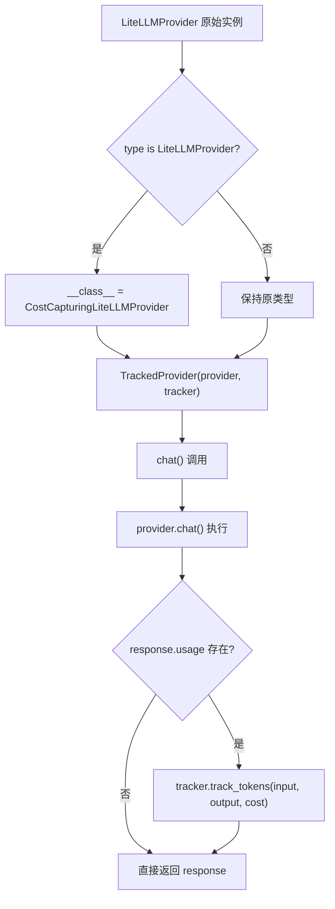
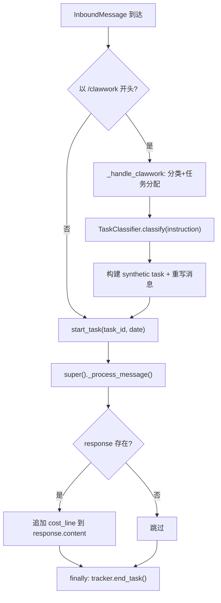

# PD-10.CW ClawWork — 双层 Provider 包装与 LangGraph 条件管道

> 文档编号：PD-10.CW
> 来源：ClawWork `clawmode_integration/provider_wrapper.py` `livebench/agent/wrapup_workflow.py` `clawmode_integration/agent_loop.py`
> GitHub：https://github.com/HKUDS/ClawWork.git
> 问题域：PD-10 中间件管道 Middleware Pipeline
> 状态：可复用方案

---

## 第 1 章 问题与动机

### 1.1 核心问题

Agent 系统中 LLM 调用的成本追踪和工作流编排是两个典型的横切关注点。ClawWork 面临的具体挑战：

1. **透明成本追踪**：每次 LLM 调用都需要记录 token 消耗和费用，但不能修改底层 nanobot 框架的源码
2. **多渠道费用分类**：LLM tokens、搜索 API、OCR API 等不同渠道的费用需要分别统计
3. **任务级成本隔离**：每个任务的成本需要独立核算，支持 start_task/end_task 生命周期
4. **迭代超限善后**：Agent 达到迭代上限时，需要一个独立的工作流来收集和提交已有产出物
5. **Provider 多源成本**：OpenRouter 等中间商直接报告的 cost 字段需要优先使用，而非本地估算

### 1.2 ClawWork 的解法概述

ClawWork 采用**双层 Provider 包装 + LangGraph 条件管道**的组合方案：

1. **CostCapturingLiteLLMProvider**（`provider_wrapper.py:18`）：通过类继承覆写 `_parse_response`，从 OpenRouter 响应中提取真实 cost 字段
2. **TrackedProvider**（`provider_wrapper.py:37`）：装饰器模式包装任意 LLMProvider，在 `chat()` 调用后自动将 usage 数据注入 EconomicTracker
3. **ClawWorkAgentLoop._process_message**（`agent_loop.py:91`）：在消息处理前后注入 start_task/end_task 经济簿记，并在响应末尾追加成本摘要
4. **WrapUpWorkflow**（`wrapup_workflow.py:41`）：LangGraph StateGraph 实现 4 节点条件管道，处理迭代超限时的产出物收集与提交
5. **ClawWorkState dataclass**（`tools.py:30`）：替代全局 dict，通过依赖注入在所有工具间共享经济追踪器等状态

### 1.3 设计思想

| 设计原则 | 具体实现 | 理由 | 替代方案 |
|----------|----------|------|----------|
| 不修改上游源码 | `__class__` 运行时类变更 + 装饰器包装 | nanobot 是外部依赖，不应 fork 修改 | Monkey-patch 单个方法 |
| 透明代理 | `__getattr__` 转发所有未覆写属性 | 调用方无需感知包装层存在 | 继承所有方法 |
| 任务级成本隔离 | start_task/end_task + try/finally | 确保异常时也能正确结束任务记录 | 上下文管理器 with 语句 |
| 条件管道 | LangGraph conditional_edges | 无产出物时直接跳过下载和提交节点 | if-else 硬编码 |
| 多渠道费用分类 | api_name 关键词匹配路由到不同 bucket | 简单有效，无需注册表 | 枚举类型 + 注册表 |

---

## 第 2 章 源码实现分析

### 2.1 架构概览

ClawWork 的中间件管道由三层组成：Provider 包装层、消息处理中间层、独立工作流层。

```
┌─────────────────────────────────────────────────────────────────┐
│                    ClawWorkAgentLoop                             │
│  ┌──────────────────────────────────────────────────────────┐   │
│  │ _process_message() 中间层                                 │   │
│  │  ┌─────────┐   ┌──────────────┐   ┌──────────────────┐  │   │
│  │  │ /clawwork│   │ start_task() │   │ append cost_line │  │   │
│  │  │ 命令拦截 │──→│ 经济簿记开始 │──→│ 响应后处理       │  │   │
│  │  └─────────┘   └──────────────┘   └──────────────────┘  │   │
│  └──────────────────────────────────────────────────────────┘   │
│                              │                                   │
│  ┌───────────────────────────┴──────────────────────────────┐   │
│  │ Provider 包装链                                           │   │
│  │  LiteLLMProvider                                          │   │
│  │    → __class__ = CostCapturingLiteLLMProvider             │   │
│  │      → TrackedProvider(provider, tracker)                 │   │
│  │        → chat() → track_tokens() → EconomicTracker       │   │
│  └──────────────────────────────────────────────────────────┘   │
│                                                                  │
│  ┌──────────────────────────────────────────────────────────┐   │
│  │ WrapUpWorkflow (LangGraph)                                │   │
│  │  list_artifacts → decide_submission ─┬→ download → submit │   │
│  │                                      └→ END (无产出物)    │   │
│  └──────────────────────────────────────────────────────────┘   │
└─────────────────────────────────────────────────────────────────┘
```

### 2.2 核心实现

#### 2.2.1 双层 Provider 包装链



对应源码 `clawmode_integration/agent_loop.py:58-67`：

```python
# Upgrade LiteLLMProvider to our cost-capturing subclass so that
# OpenRouter's reported cost flows through to EconomicTracker.
# Class mutation avoids recreating the provider with unknown kwargs.
from nanobot.providers.litellm_provider import LiteLLMProvider
if type(self.provider) is LiteLLMProvider:
    self.provider.__class__ = CostCapturingLiteLLMProvider

# Wrap the provider for automatic token cost tracking.
# Must happen *after* super().__init__() which stores self.provider.
self.provider = TrackedProvider(self.provider, self._lb.economic_tracker)
```

CostCapturingLiteLLMProvider 的 `_parse_response` 覆写（`provider_wrapper.py:27-34`）：

```python
def _parse_response(self, response: Any) -> LLMResponse:
    result = super()._parse_response(response)
    openrouter_cost = getattr(getattr(response, "usage", None), "cost", None)
    if openrouter_cost is None:
        openrouter_cost = (getattr(response, "_hidden_params", None) or {}).get(
            "response_cost"
        )
    if openrouter_cost is not None:
        result.usage["cost"] = openrouter_cost
    return result
```

TrackedProvider 的透明代理（`provider_wrapper.py:37-72`）：

```python
class TrackedProvider:
    def __init__(self, provider: LLMProvider, tracker: Any) -> None:
        self._provider = provider
        self._tracker = tracker

    async def chat(self, messages, tools=None, model=None,
                   max_tokens=4096, temperature=0.7) -> LLMResponse:
        response = await self._provider.chat(
            messages=messages, tools=tools, model=model,
            max_tokens=max_tokens, temperature=temperature,
        )
        if response.usage and self._tracker:
            self._tracker.track_tokens(
                response.usage["prompt_tokens"],
                response.usage["completion_tokens"],
                cost=response.usage.get("cost"),
            )
        return response

    def __getattr__(self, name: str) -> Any:
        return getattr(self._provider, name)
```

#### 2.2.2 消息处理中间层



对应源码 `clawmode_integration/agent_loop.py:91-135`：

```python
async def _process_message(self, msg: InboundMessage,
                           session_key=None, on_progress=None):
    content = (msg.content or "").strip()
    if content.lower().startswith("/clawwork"):
        return await self._handle_clawwork(msg, content, session_key=session_key)

    ts = msg.timestamp.strftime("%Y%m%d_%H%M%S")
    task_id = f"{msg.channel}_{msg.sender_id}_{ts}"
    date_str = msg.timestamp.strftime("%Y-%m-%d")

    tracker = self._lb.economic_tracker
    tracker.start_task(task_id, date=date_str)
    try:
        response = await super()._process_message(
            msg, session_key=session_key, on_progress=on_progress
        )
        if response and response.content and tracker.current_task_id:
            cost_line = self._format_cost_line()
            if cost_line:
                response = OutboundMessage(
                    channel=response.channel, chat_id=response.chat_id,
                    content=response.content + cost_line,
                    reply_to=response.reply_to, media=response.media,
                    metadata=response.metadata,
                )
        return response
    finally:
        tracker.end_task()
```

### 2.3 实现细节

#### 多渠道费用路由

EconomicTracker 通过 `api_name` 关键词匹配将费用路由到四个 bucket（`economic_tracker.py:222-228`）：

```python
if "search" in api_name.lower() or "jina" in api_name.lower() or "tavily" in api_name.lower():
    self.task_costs["search_api"] += cost
elif "ocr" in api_name.lower():
    self.task_costs["ocr_api"] += cost
else:
    self.task_costs["other_api"] += cost
```

四个 bucket：`llm_tokens`、`search_api`、`ocr_api`、`other_api`。

#### 任务记录持久化

`end_task()` 调用 `_save_task_record()`（`economic_tracker.py:288-356`），将整个任务的 LLM 调用明细、API 调用明细、分渠道成本汇总写入 `token_costs.jsonl`，每个任务一行。

#### 评估阈值悬崖

`add_work_income()`（`economic_tracker.py:358-395`）实现 0.6 分阈值的硬悬崖：低于阈值直接 0 收入，不做线性衰减。

#### WrapUpWorkflow 条件管道

`_should_download()`（`wrapup_workflow.py:95-99`）根据 `chosen_artifacts` 是否为空决定走 download 路径还是直接 END：

```python
def _should_download(self, state: WrapUpState) -> str:
    if state.get("chosen_artifacts") and len(state["chosen_artifacts"]) > 0:
        return "download"
    return "end"
```


---

## 第 3 章 迁移指南

### 3.1 迁移清单

**阶段 1：Provider 包装层（1 个文件）**
- [ ] 创建 `TrackedProvider` 类，包装目标 LLM Provider
- [ ] 实现 `__getattr__` 透明转发
- [ ] 在 `chat()` 中注入 usage 追踪逻辑
- [ ] 如需捕获第三方 cost 字段，创建对应的 Provider 子类

**阶段 2：经济追踪器（1 个文件）**
- [ ] 实现 `start_task(task_id)` / `end_task()` 生命周期
- [ ] 实现多渠道费用分类（按 api_name 路由）
- [ ] 实现 JSONL 持久化（每任务一行综合记录）
- [ ] 实现评估阈值逻辑（可选）

**阶段 3：消息处理中间层（修改 AgentLoop）**
- [ ] 在 `_process_message` 中注入 start_task/end_task
- [ ] 使用 try/finally 确保 end_task 总被调用
- [ ] 在响应末尾追加成本摘要（可选）
- [ ] 实现命令拦截（如 /clawwork）

**阶段 4：条件工作流（可选）**
- [ ] 安装 langgraph：`pip install langgraph`
- [ ] 定义 TypedDict 状态类
- [ ] 构建 StateGraph + conditional_edges
- [ ] 集成到主 Agent 的超限处理逻辑

### 3.2 适配代码模板

#### 通用 TrackedProvider 模板

```python
from __future__ import annotations
from typing import Any, Protocol

class UsageTracker(Protocol):
    """追踪器协议，适配你自己的追踪实现"""
    def track_tokens(self, input_tokens: int, output_tokens: int,
                     cost: float | None = None) -> None: ...

class TrackedProvider:
    """透明 Provider 包装器 — 在每次 chat() 后自动追踪 token 消耗"""

    def __init__(self, provider: Any, tracker: UsageTracker) -> None:
        self._provider = provider
        self._tracker = tracker

    async def chat(self, messages: list[dict], **kwargs: Any) -> Any:
        response = await self._provider.chat(messages=messages, **kwargs)
        usage = getattr(response, "usage", None) or {}
        if usage:
            self._tracker.track_tokens(
                input_tokens=usage.get("prompt_tokens", 0),
                output_tokens=usage.get("completion_tokens", 0),
                cost=usage.get("cost"),
            )
        return response

    def __getattr__(self, name: str) -> Any:
        return getattr(self._provider, name)
```

#### 任务级成本隔离模板

```python
import json
from datetime import datetime
from pathlib import Path
from dataclasses import dataclass, field

@dataclass
class TaskCostRecord:
    task_id: str
    start_time: str
    llm_calls: list = field(default_factory=list)
    api_calls: list = field(default_factory=list)
    costs: dict = field(default_factory=lambda: {
        "llm_tokens": 0.0, "search_api": 0.0, "ocr_api": 0.0, "other_api": 0.0
    })

class CostTracker:
    def __init__(self, output_path: str = "./costs.jsonl"):
        self._output = Path(output_path)
        self._current: TaskCostRecord | None = None

    def start_task(self, task_id: str) -> None:
        self._current = TaskCostRecord(
            task_id=task_id, start_time=datetime.now().isoformat()
        )

    def track_tokens(self, input_tokens: int, output_tokens: int,
                     cost: float | None = None) -> None:
        if not self._current:
            return
        if cost is None:
            cost = (input_tokens * 2.5 + output_tokens * 10.0) / 1_000_000
        self._current.costs["llm_tokens"] += cost
        self._current.llm_calls.append({
            "ts": datetime.now().isoformat(),
            "in": input_tokens, "out": output_tokens, "cost": cost
        })

    def end_task(self) -> None:
        if not self._current:
            return
        record = {
            "task_id": self._current.task_id,
            "start": self._current.start_time,
            "end": datetime.now().isoformat(),
            "costs": self._current.costs,
            "llm_calls": len(self._current.llm_calls),
            "total": sum(self._current.costs.values()),
        }
        self._output.parent.mkdir(parents=True, exist_ok=True)
        with open(self._output, "a") as f:
            f.write(json.dumps(record) + "\n")
        self._current = None
```

### 3.3 适用场景

| 场景 | 适用度 | 说明 |
|------|--------|------|
| 需要透明追踪 LLM 成本但不能改上游框架 | ⭐⭐⭐ | TrackedProvider 装饰器模式完美适配 |
| 多渠道 API 费用分类统计 | ⭐⭐⭐ | 四 bucket 关键词路由简单有效 |
| Agent 迭代超限后的善后工作流 | ⭐⭐⭐ | LangGraph 条件管道清晰可维护 |
| 需要任务级成本隔离和 JSONL 审计 | ⭐⭐⭐ | start_task/end_task + try/finally 模式可靠 |
| 需要实时成本反馈给用户 | ⭐⭐ | cost_line 追加到响应末尾，简单但不够灵活 |
| 复杂多阶段管道（>10 节点） | ⭐ | WrapUpWorkflow 仅 4 节点，复杂场景需更完整的编排 |

---

## 第 4 章 测试用例

```python
import pytest
from unittest.mock import AsyncMock, MagicMock, patch
from dataclasses import dataclass
from typing import Any


# ---- TrackedProvider 测试 ----

class TestTrackedProvider:
    """测试 TrackedProvider 的透明包装和成本追踪"""

    def setup_method(self):
        self.mock_provider = AsyncMock()
        self.mock_tracker = MagicMock()
        # 模拟 LLMResponse
        self.mock_response = MagicMock()
        self.mock_response.usage = {
            "prompt_tokens": 100,
            "completion_tokens": 50,
            "cost": 0.0025,
        }
        self.mock_provider.chat.return_value = self.mock_response

    @pytest.mark.asyncio
    async def test_chat_forwards_and_tracks(self):
        """chat() 应转发到真实 provider 并追踪 usage"""
        from clawmode_integration.provider_wrapper import TrackedProvider

        tracked = TrackedProvider(self.mock_provider, self.mock_tracker)
        result = await tracked.chat(messages=[{"role": "user", "content": "hi"}])

        assert result is self.mock_response
        self.mock_tracker.track_tokens.assert_called_once_with(100, 50, cost=0.0025)

    @pytest.mark.asyncio
    async def test_chat_no_usage_skips_tracking(self):
        """usage 为空时不调用 tracker"""
        from clawmode_integration.provider_wrapper import TrackedProvider

        self.mock_response.usage = None
        tracked = TrackedProvider(self.mock_provider, self.mock_tracker)
        await tracked.chat(messages=[])

        self.mock_tracker.track_tokens.assert_not_called()

    def test_getattr_forwards(self):
        """未覆写的属性应透明转发到真实 provider"""
        from clawmode_integration.provider_wrapper import TrackedProvider

        self.mock_provider.model_name = "gpt-4o"
        tracked = TrackedProvider(self.mock_provider, self.mock_tracker)
        assert tracked.model_name == "gpt-4o"


# ---- EconomicTracker 测试 ----

class TestEconomicTracker:
    """测试任务级成本隔离和多渠道路由"""

    def setup_method(self):
        import tempfile, os
        self.tmpdir = tempfile.mkdtemp()
        from livebench.agent.economic_tracker import EconomicTracker
        self.tracker = EconomicTracker(
            signature="test-agent",
            initial_balance=100.0,
            data_path=self.tmpdir,
        )

    def test_start_end_task_lifecycle(self):
        """start_task/end_task 应正确管理任务 ID"""
        self.tracker.start_task("task-001", date="2025-01-01")
        assert self.tracker.current_task_id == "task-001"
        assert self.tracker.task_costs["llm_tokens"] == 0.0

        self.tracker.end_task()
        assert self.tracker.current_task_id is None

    def test_track_tokens_routes_to_llm_bucket(self):
        """track_tokens 应累加到 llm_tokens bucket"""
        self.tracker.start_task("task-002")
        self.tracker.track_tokens(1000, 500, cost=0.01)
        assert self.tracker.task_costs["llm_tokens"] == pytest.approx(0.01)

    def test_track_api_call_routes_search(self):
        """search 关键词应路由到 search_api bucket"""
        self.tracker.start_task("task-003")
        self.tracker.track_api_call(5000, 1.0, api_name="jina_search")
        assert self.tracker.task_costs["search_api"] > 0
        assert self.tracker.task_costs["ocr_api"] == 0

    def test_evaluation_threshold_cliff(self):
        """低于 0.6 分应得 0 收入"""
        self.tracker.initialize()
        payment = self.tracker.add_work_income(
            amount=50.0, task_id="t1", evaluation_score=0.5
        )
        assert payment == 0.0

        payment = self.tracker.add_work_income(
            amount=50.0, task_id="t2", evaluation_score=0.8
        )
        assert payment == 50.0


# ---- WrapUpWorkflow 测试 ----

class TestWrapUpWorkflow:
    """测试 LangGraph 条件管道的路由逻辑"""

    def test_should_download_with_artifacts(self):
        """有 chosen_artifacts 时应返回 'download'"""
        from livebench.agent.wrapup_workflow import WrapUpWorkflow
        wf = WrapUpWorkflow(llm=MagicMock())
        state = {"chosen_artifacts": ["/tmp/report.pdf"]}
        assert wf._should_download(state) == "download"

    def test_should_download_empty(self):
        """无 chosen_artifacts 时应返回 'end'"""
        from livebench.agent.wrapup_workflow import WrapUpWorkflow
        wf = WrapUpWorkflow(llm=MagicMock())
        state = {"chosen_artifacts": []}
        assert wf._should_download(state) == "end"

    def test_graph_has_four_nodes(self):
        """编译后的图应包含 4 个业务节点"""
        from livebench.agent.wrapup_workflow import WrapUpWorkflow
        wf = WrapUpWorkflow(llm=MagicMock())
        # LangGraph compiled graph 的 nodes 属性
        assert hasattr(wf.graph, "nodes")
```


---

## 第 5 章 跨域关联

| 关联域 | 关系类型 | 说明 |
|--------|----------|------|
| PD-01 上下文管理 | 协同 | WrapUpWorkflow 的 `_summarize_conversation` 截取最近 10 条消息，是上下文窗口管理的一种简化实现 |
| PD-03 容错与重试 | 协同 | WrapUpWorkflow 本身就是迭代超限的容错善后机制；每个节点内部用 try/except 防止单节点失败阻塞整个管道 |
| PD-04 工具系统 | 依赖 | ClawWorkAgentLoop 通过 `_register_default_tools()` 扩展 nanobot 工具注册表，6 个 ClawWork 工具依赖 ClawWorkState 注入 |
| PD-06 记忆持久化 | 协同 | EconomicTracker 的 JSONL 持久化（balance.jsonl、token_costs.jsonl）是经济记忆的持久化形式 |
| PD-11 可观测性 | 强依赖 | TrackedProvider 和 EconomicTracker 的核心目的就是成本可观测性；cost_line 追加到响应是用户侧可观测性 |

---

## 第 6 章 来源文件索引

| 文件 | 行范围 | 关键实现 |
|------|--------|----------|
| `clawmode_integration/provider_wrapper.py` | L18-L34 | CostCapturingLiteLLMProvider：覆写 _parse_response 捕获 OpenRouter cost |
| `clawmode_integration/provider_wrapper.py` | L37-L72 | TrackedProvider：透明装饰器，chat() 后自动 track_tokens |
| `clawmode_integration/agent_loop.py` | L46-L67 | ClawWorkAgentLoop.__init__：双层 Provider 包装链构建 |
| `clawmode_integration/agent_loop.py` | L76-L85 | _register_default_tools：扩展工具注册 |
| `clawmode_integration/agent_loop.py` | L91-L135 | _process_message：消息处理中间层，start_task/end_task 簿记 |
| `clawmode_integration/agent_loop.py` | L141-L248 | _handle_clawwork：/clawwork 命令拦截、分类、任务分配 |
| `clawmode_integration/agent_loop.py` | L254-L266 | _format_cost_line：成本摘要格式化 |
| `clawmode_integration/task_classifier.py` | L39-L166 | TaskClassifier：LLM 驱动的任务分类 + 模糊匹配 |
| `clawmode_integration/tools.py` | L29-L41 | ClawWorkState dataclass：共享状态容器 |
| `livebench/agent/economic_tracker.py` | L12-L200 | EconomicTracker：初始化、start_task、track_tokens |
| `livebench/agent/economic_tracker.py` | L203-L282 | track_api_call / track_flat_api_call：多渠道费用路由 |
| `livebench/agent/economic_tracker.py` | L288-L356 | _save_task_record：JSONL 综合任务记录持久化 |
| `livebench/agent/economic_tracker.py` | L358-L421 | add_work_income：0.6 阈值悬崖 + 收入记录 |
| `livebench/agent/wrapup_workflow.py` | L26-L39 | WrapUpState TypedDict：管道状态定义 |
| `livebench/agent/wrapup_workflow.py` | L41-L93 | WrapUpWorkflow.__init__ + _build_graph：4 节点 LangGraph 构建 |
| `livebench/agent/wrapup_workflow.py` | L95-L99 | _should_download：条件边路由函数 |
| `livebench/agent/wrapup_workflow.py` | L101-L179 | _list_artifacts_node：E2B 沙箱产出物扫描 |
| `livebench/agent/wrapup_workflow.py` | L181-L272 | _decide_submission_node：LLM 决策 + JSON 解析 |
| `livebench/agent/wrapup_workflow.py` | L399-L452 | run()：异步入口，初始化状态 + ainvoke |
| `livebench/agent/wrapup_workflow.py` | L455-L468 | create_wrapup_workflow：工厂函数 |

---

## 第 7 章 横向对比维度

```json comparison_data
{
  "project": "ClawWork",
  "dimensions": {
    "中间件基类": "无统一基类，TrackedProvider 用 __getattr__ 透明代理，AgentLoop 用继承覆写",
    "钩子点": "chat() 后置追踪 + _process_message 前后置簿记",
    "中间件数量": "3 层：CostCapturing 子类 + TrackedProvider 包装 + AgentLoop 消息中间层",
    "条件激活": "LangGraph conditional_edges 按 chosen_artifacts 是否为空路由",
    "状态管理": "ClawWorkState dataclass 依赖注入 + WrapUpState TypedDict 管道状态",
    "执行模型": "异步 async/await 全链路",
    "装饰器包装": "__class__ 运行时类变更 + TrackedProvider 组合包装，不修改上游源码",
    "可观测性": "cost_line 追加到响应末尾 + JSONL 每任务综合记录",
    "数据传递": "LangGraph 节点间通过 WrapUpState dict 传递；工具间通过 ClawWorkState 共享",
    "成本预算控制": "0.6 评估阈值悬崖 + 四渠道分类统计（llm/search/ocr/other）",
    "错误隔离": "每个 WrapUp 节点独立 try/except + _process_message 用 try/finally 保证 end_task"
  }
}
```

### 域元数据补充

```json domain_metadata
{
  "solution_summary": "ClawWork 用 __class__ 运行时类变更 + TrackedProvider 装饰器实现双层 Provider 透明成本追踪，配合 LangGraph 4 节点条件管道处理迭代超限善后",
  "description": "不修改上游框架源码的透明中间层注入策略",
  "sub_problems": [
    "运行时类变更安全性：__class__ 赋值改变实例类型时的方法解析顺序（MRO）风险",
    "多定价模型统一：per-token 和 flat-rate 两种 API 计费模式的统一追踪接口",
    "迭代超限善后：Agent 达到迭代上限时如何自动收集和提交已有产出物",
    "成本摘要注入位置：在响应末尾追加 vs 通过 metadata 传递 vs 独立通知渠道"
  ],
  "best_practices": [
    "Provider 包装必须在 super().__init__() 之后：确保 self.provider 已被父类初始化",
    "try/finally 保证 end_task：即使处理异常也能正确关闭任务成本记录",
    "优先使用上游报告的 cost 字段：OpenRouter 等中间商的真实费用比本地估算更准确",
    "工厂函数封装工作流创建：create_wrapup_workflow 隐藏初始化细节，便于测试替换"
  ]
}
```

