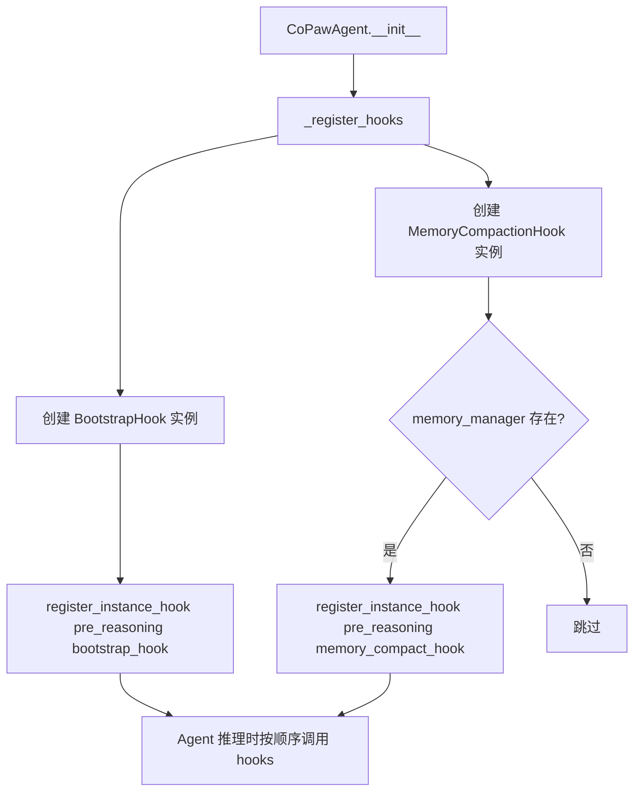
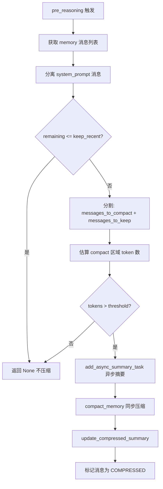
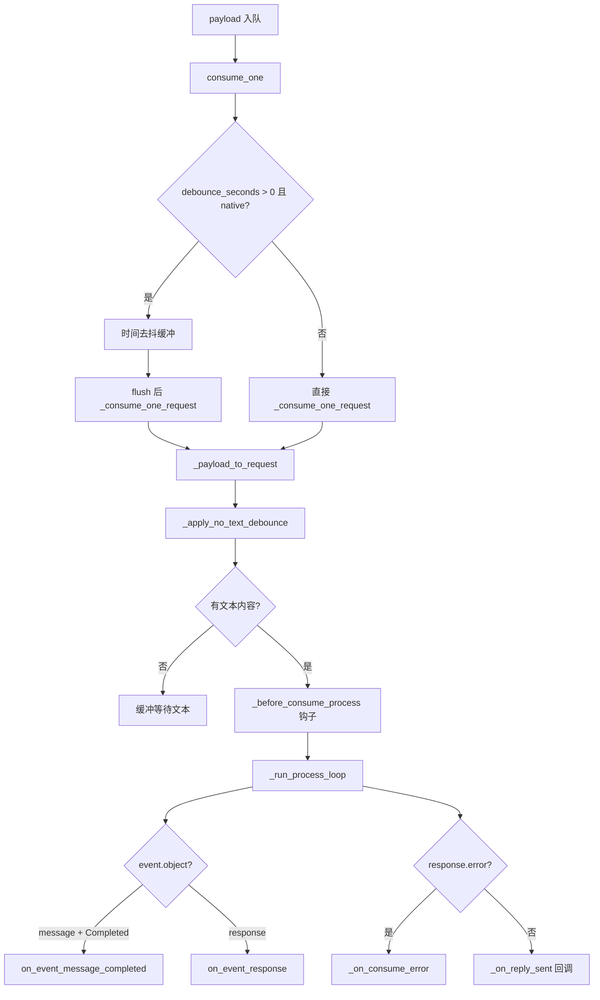

# PD-10.07 CoPaw — 双层 Hook 管道与 Channel 生命周期钩子

> 文档编号：PD-10.07
> 来源：CoPaw `src/copaw/agents/hooks/`, `src/copaw/app/channels/base.py`
> GitHub：https://github.com/agentscope-ai/CoPaw.git
> 问题域：PD-10 中间件管道 Middleware Pipeline
> 状态：可复用方案

---

## 第 1 章 问题与动机

### 1.1 核心问题

Agent 系统在推理前需要执行多种横切关注点：首次交互引导（Bootstrap）、上下文窗口压缩（Memory Compaction）等。同时，消息从多个渠道（DingTalk、飞书、Discord、iMessage、QQ、Console）进入系统后，需要经历统一的生命周期处理——去抖、合并、前置钩子、事件分发、错误处理。

这两层管道如何设计才能既保持可插拔性，又不让 Agent 核心逻辑和 Channel 传输逻辑互相耦合？

CoPaw 的回答是：**双层 Hook 管道**——Agent 层用 AgentScope 的 `register_instance_hook` 在 `pre_reasoning` 阶段注入 Callable Hook；Channel 层用模板方法模式在 `BaseChannel` 中定义 `_before_consume_process` / `on_event_message_completed` / `on_event_response` 等生命周期钩子，子类按需覆写。

### 1.2 CoPaw 的解法概述

1. **Agent Hook 层**：`CoPawAgent._register_hooks()` (`react_agent.py:217-244`) 在构造时注册 `BootstrapHook` 和 `MemoryCompactionHook` 到 `pre_reasoning` 阶段，每次推理前按注册顺序执行
2. **Hook 即 Callable**：每个 Hook 是一个实现了 `async __call__(self, agent, kwargs)` 的类实例，通过 AgentScope 的 `register_instance_hook(hook_type, hook_name, hook)` 注册（`hooks/__init__.py:22-26`）
3. **Channel 生命周期钩子**：`BaseChannel` 定义了 `_before_consume_process` / `on_event_message_completed` / `on_event_response` / `_on_consume_error` 四个模板方法钩子（`base.py:510-551`），子类如 FeishuChannel 覆写 `_before_consume_process` 保存 receive_id
4. **去抖管道**：`BaseChannel` 内置双层去抖——无文本内容去抖（`_apply_no_text_debounce`）和时间窗口去抖（`_debounce_seconds` + `asyncio.Task`），在 Hook 之前执行（`base.py:364-400`）
5. **ChannelManager 并发调度**：每个 Channel 4 个 worker 并行消费，同 session 通过 `_in_progress` + `_pending` + `_key_locks` 保证串行处理（`manager.py:260-301`）

### 1.3 设计思想

| 设计原则 | 具体实现 | 理由 | 替代方案 |
|----------|----------|------|----------|
| Hook 即 Callable | `async __call__(agent, kwargs) -> dict|None` | 最小接口约束，任何 async callable 都能当 Hook | 继承基类 / 装饰器模式 |
| 双层管道分离 | Agent Hook 管推理前置，Channel Hook 管消息生命周期 | 关注点分离：AI 逻辑 vs I/O 传输 | 统一中间件栈 |
| 模板方法钩子 | BaseChannel 定义空方法，子类覆写 | 零成本默认行为，按需扩展 | 事件总线 / 观察者模式 |
| 错误隔离 | 每个 Hook 内部 try/except，失败只 log 不中断 | 单个 Hook 故障不影响主推理流程 | 熔断器 / 重试 |
| 去抖前置于 Hook | 去抖在 `consume_one` 层，Hook 在 `_consume_one_request` 层 | 减少无效 Hook 调用 | Hook 内部自行去抖 |

---

## 第 2 章 源码实现分析

### 2.1 架构概览

CoPaw 的中间件管道分为两个独立层次：

```
┌─────────────────────────────────────────────────────────────────┐
│                    Agent Hook 层 (pre_reasoning)                 │
│  ┌──────────────┐    ┌─────────────────────┐                    │
│  │ BootstrapHook│───→│ MemoryCompactionHook│───→ LLM Reasoning  │
│  │ (首次引导)    │    │ (上下文压缩)         │                    │
│  └──────────────┘    └─────────────────────┘                    │
└─────────────────────────────────────────────────────────────────┘

┌─────────────────────────────────────────────────────────────────┐
│              Channel Hook 层 (消息生命周期)                       │
│                                                                  │
│  payload ──→ consume_one ──→ 时间去抖 ──→ _consume_one_request  │
│                                              │                   │
│                              ┌────────────────┤                  │
│                              ▼                ▼                  │
│                    _before_consume_process   _process(request)   │
│                    (子类覆写: 保存元数据)      │                  │
│                                              ▼                  │
│                              on_event_message_completed          │
│                              on_event_response                   │
│                              _on_consume_error                   │
└─────────────────────────────────────────────────────────────────┘

┌─────────────────────────────────────────────────────────────────┐
│              ChannelManager 调度层                                │
│  ┌─────────┐  ┌─────────┐  ┌─────────┐                         │
│  │Worker 0 │  │Worker 1 │  │Worker 2 │  │Worker 3│             │
│  └────┬────┘  └────┬────┘  └────┬────┘  └────┬───┘             │
│       └────────────┴────────────┴─────────────┘                 │
│              asyncio.Queue (per channel, maxsize=1000)           │
│              _in_progress + _pending (per session 串行)          │
└─────────────────────────────────────────────────────────────────┘
```

### 2.2 核心实现

#### 2.2.1 Agent Hook 注册与执行



对应源码 `src/copaw/agents/react_agent.py:217-244`：

```python
def _register_hooks(self) -> None:
    """Register pre-reasoning hooks for bootstrap and memory compaction."""
    config = load_config()
    bootstrap_hook = BootstrapHook(
        working_dir=WORKING_DIR,
        language=config.agents.language,
    )
    self.register_instance_hook(
        hook_type="pre_reasoning",
        hook_name="bootstrap_hook",
        hook=bootstrap_hook.__call__,
    )

    if self._enable_memory_manager and self.memory_manager is not None:
        memory_compact_hook = MemoryCompactionHook(
            memory_manager=self.memory_manager,
            memory_compact_threshold=self._memory_compact_threshold,
            keep_recent=MEMORY_COMPACT_KEEP_RECENT,
        )
        self.register_instance_hook(
            hook_type="pre_reasoning",
            hook_name="memory_compact_hook",
            hook=memory_compact_hook.__call__,
        )
```

#### 2.2.2 MemoryCompactionHook 实现



对应源码 `src/copaw/agents/hooks/memory_compaction.py:102-204`：

```python
async def __call__(
    self,
    agent,
    kwargs: dict[str, Any],
) -> dict[str, Any] | None:
    try:
        messages = await agent.memory.get_memory(
            exclude_mark=_MemoryMark.COMPRESSED,
            prepend_summary=False,
        )
        system_prompt_messages = []
        for msg in messages:
            if msg.role == "system":
                system_prompt_messages.append(msg)
            else:
                break

        remaining_messages = messages[len(system_prompt_messages):]
        if len(remaining_messages) <= self.keep_recent:
            return None

        keep_length = self.keep_recent
        while keep_length > 0 and not check_valid_messages(
            remaining_messages[-keep_length:],
        ):
            keep_length -= 1

        if keep_length > 0:
            messages_to_compact = remaining_messages[:-keep_length]
        else:
            messages_to_compact = remaining_messages

        prompt = await agent.formatter.format(msgs=messages_to_compact)
        estimated_tokens: int = await safe_count_message_tokens(prompt)

        if estimated_tokens > self.memory_compact_threshold:
            self.memory_manager.add_async_summary_task(
                messages=messages_to_compact,
            )
            compact_content = await self.memory_manager.compact_memory(
                messages_to_summarize=messages_to_compact,
                previous_summary=agent.memory.get_compressed_summary(),
            )
            await agent.memory.update_compressed_summary(compact_content)
            updated_count = await agent.memory.update_messages_mark(
                new_mark=_MemoryMark.COMPRESSED,
                msg_ids=[msg.id for msg in messages_to_compact],
            )
    except Exception as e:
        logger.error("Failed to compact memory in pre_reasoning hook: %s", e, exc_info=True)
    return None
```

#### 2.2.3 Channel 生命周期钩子管道



对应源码 `src/copaw/app/channels/base.py:402-508`：

```python
async def _consume_one_request(self, payload: Any) -> None:
    request = self._payload_to_request(payload)
    if isinstance(payload, dict):
        meta_from_payload = dict(payload.get("meta") or {})
        if payload.get("session_webhook"):
            meta_from_payload["session_webhook"] = payload["session_webhook"]
        if hasattr(request, "channel_meta"):
            request.channel_meta = meta_from_payload
    session_id = getattr(request, "session_id", "") or ""
    if request.input:
        contents = list(getattr(request.input[0], "content", None) or [])
        should_process, merged = self._apply_no_text_debounce(
            session_id, contents,
        )
        if not should_process:
            return
    to_handle = self.get_to_handle_from_request(request)
    await self._before_consume_process(request)
    await self._run_process_loop(request, to_handle, send_meta)
```

### 2.3 实现细节

#### BootstrapHook 的一次性触发机制

BootstrapHook (`bootstrap.py:42-103`) 使用文件系统标志 `.bootstrap_completed` 实现一次性触发：

1. 检查 `.bootstrap_completed` 文件是否存在 → 存在则跳过
2. 检查 `BOOTSTRAP.md` 是否存在 → 不存在则跳过
3. 检查是否为首次用户交互（`is_first_user_interaction`）
4. 将引导文本 prepend 到第一条用户消息
5. 创建 `.bootstrap_completed` 标志文件防止重复触发

#### ChannelManager 的 session 级串行保证

`ChannelManager` (`manager.py:260-301`) 通过三层机制保证同 session 消息串行处理：

- `_in_progress: Set[Tuple[str, str]]` — 标记正在处理的 (channel_id, debounce_key)
- `_pending: Dict[Tuple[str, str], List[Any]]` — 处理中到达的新消息暂存
- `_key_locks: Dict[Tuple[str, str], asyncio.Lock]` — 同 key 的 drain 操作互斥

当 worker 取到 payload 后，先获取 key_lock，drain 队列中同 key 的所有 payload 组成 batch，标记 in_progress，处理完毕后将 pending 中的消息合并后放回队列。

#### Channel 注册表的自定义扩展

`registry.py:34-66` 支持从 `CUSTOM_CHANNELS_DIR` 动态发现自定义 Channel：扫描目录下的 `.py` 文件和包，找到 `BaseChannel` 子类并按 `channel` 属性注册。内置 6 个 Channel（imessage、discord、dingtalk、feishu、qq、console）+ 自定义扩展。

#### MessageRenderer 的可插拔渲染

`renderer.py:37-44` 通过 `RenderStyle` dataclass 控制渲染行为（show_tool_details、supports_markdown、supports_code_fence、use_emoji），每个 Channel 可注入不同的 RenderStyle，实现同一消息在不同渠道的差异化展示。

---

## 第 3 章 迁移指南

### 3.1 迁移清单

**阶段 1：Agent Hook 管道**

1. 定义 Hook 协议：`async def __call__(self, agent, kwargs: dict) -> dict | None`
2. 实现具体 Hook 类（如 BootstrapHook、MemoryCompactionHook）
3. 在 Agent 构造时通过 `register_instance_hook(hook_type, hook_name, hook)` 注册
4. 确保每个 Hook 内部 try/except 隔离错误

**阶段 2：Channel 生命周期钩子**

1. 定义 BaseChannel 抽象基类，包含模板方法钩子
2. 实现去抖机制（无文本去抖 + 时间窗口去抖）
3. 子类覆写需要的钩子方法
4. 实现 ChannelManager 的并发调度和 session 串行保证

**阶段 3：注册表与渲染**

1. 实现 Channel 注册表（内置 + 自定义发现）
2. 实现可插拔 MessageRenderer

### 3.2 适配代码模板

```python
"""可复用的双层 Hook 管道模板"""
import asyncio
import logging
from abc import ABC
from typing import Any, Callable, Dict, List, Optional, AsyncIterator

logger = logging.getLogger(__name__)


# ── Agent Hook 层 ──

class AgentHook:
    """Agent Hook 基类：async callable 协议"""

    async def __call__(
        self,
        agent: Any,
        kwargs: dict[str, Any],
    ) -> dict[str, Any] | None:
        raise NotImplementedError


class BootstrapHook(AgentHook):
    """首次交互引导 Hook（一次性触发）"""

    def __init__(self, working_dir: str, language: str = "en"):
        self.working_dir = working_dir
        self.language = language
        self._triggered = False

    async def __call__(self, agent, kwargs):
        if self._triggered:
            return None
        try:
            # 检查是否首次交互，注入引导文本
            messages = await agent.memory.get_memory()
            if self._is_first_interaction(messages):
                self._inject_guidance(messages)
                self._triggered = True
        except Exception as e:
            logger.error("Bootstrap hook failed: %s", e, exc_info=True)
        return None

    def _is_first_interaction(self, messages) -> bool:
        user_msgs = [m for m in messages if m.role == "user"]
        assistant_msgs = [m for m in messages if m.role == "assistant"]
        return len(user_msgs) == 1 and len(assistant_msgs) == 0

    def _inject_guidance(self, messages):
        pass  # 实现引导文本注入


class HookRegistry:
    """Hook 注册表：按 hook_type 分组管理"""

    def __init__(self):
        self._hooks: Dict[str, List[tuple[str, Callable]]] = {}

    def register(self, hook_type: str, hook_name: str, hook: Callable):
        self._hooks.setdefault(hook_type, []).append((hook_name, hook))

    async def run_hooks(self, hook_type: str, agent, kwargs):
        for name, hook in self._hooks.get(hook_type, []):
            try:
                result = await hook(agent, kwargs)
                if result is not None:
                    kwargs.update(result)
            except Exception as e:
                logger.error("Hook %s failed: %s", name, e, exc_info=True)


# ── Channel Hook 层 ──

class BaseChannel(ABC):
    """Channel 基类：模板方法钩子 + 去抖管道"""

    def __init__(self, process: Callable):
        self._process = process
        self._debounce_seconds: float = 0.0
        self._pending_content: Dict[str, List[Any]] = {}

    async def consume_one(self, payload: Any) -> None:
        """入口：去抖 → _consume_one_request"""
        if self._debounce_seconds > 0:
            # 时间窗口去抖逻辑
            pass
        await self._consume_one_request(payload)

    async def _consume_one_request(self, payload: Any) -> None:
        request = self._to_request(payload)
        await self._before_consume_process(request)
        async for event in self._process(request):
            if self._is_completed_message(event):
                await self.on_event_message_completed(request, event)
            elif self._is_response(event):
                await self.on_event_response(request, event)

    # ── 模板方法钩子（子类覆写） ──

    async def _before_consume_process(self, request) -> None:
        """消息处理前钩子，如保存渠道元数据"""
        pass

    async def on_event_message_completed(self, request, event) -> None:
        """消息完成事件钩子，如发送回复"""
        pass

    async def on_event_response(self, request, event) -> None:
        """响应事件钩子"""
        pass

    def _to_request(self, payload):
        raise NotImplementedError

    def _is_completed_message(self, event) -> bool:
        raise NotImplementedError

    def _is_response(self, event) -> bool:
        raise NotImplementedError
```

### 3.3 适用场景

| 场景 | 适用度 | 说明 |
|------|--------|------|
| 多渠道 Agent 系统 | ⭐⭐⭐ | Channel 层钩子天然适配多渠道消息处理 |
| 需要推理前置处理的 Agent | ⭐⭐⭐ | pre_reasoning Hook 适合上下文压缩、引导注入等 |
| 单渠道简单 Agent | ⭐⭐ | 双层管道略显过度，但 Hook 层仍有价值 |
| 高并发消息场景 | ⭐⭐⭐ | ChannelManager 的 session 串行 + 跨 session 并行设计成熟 |
| 需要消息去抖的场景 | ⭐⭐⭐ | 双层去抖（无文本 + 时间窗口）覆盖常见需求 |

---

## 第 4 章 测试用例

```python
import asyncio
import pytest
from unittest.mock import AsyncMock, MagicMock, patch


class TestBootstrapHook:
    """测试 BootstrapHook 的一次性触发机制"""

    @pytest.fixture
    def hook(self, tmp_path):
        from copaw.agents.hooks.bootstrap import BootstrapHook
        # 创建 BOOTSTRAP.md
        (tmp_path / "BOOTSTRAP.md").write_text("# Welcome")
        return BootstrapHook(working_dir=tmp_path, language="en")

    @pytest.mark.asyncio
    async def test_first_interaction_triggers(self, hook, tmp_path):
        """首次交互应注入引导文本"""
        agent = MagicMock()
        msg = MagicMock(role="user", content="hello")
        sys_msg = MagicMock(role="system")
        agent.memory.get_memory = AsyncMock(return_value=[sys_msg, msg])

        await hook(agent, {})

        # 验证 .bootstrap_completed 标志已创建
        assert (tmp_path / ".bootstrap_completed").exists()

    @pytest.mark.asyncio
    async def test_second_interaction_skips(self, hook, tmp_path):
        """已完成引导后应跳过"""
        (tmp_path / ".bootstrap_completed").touch()
        agent = MagicMock()

        result = await hook(agent, {})
        assert result is None
        agent.memory.get_memory.assert_not_called()


class TestMemoryCompactionHook:
    """测试 MemoryCompactionHook 的阈值触发"""

    @pytest.mark.asyncio
    async def test_below_threshold_no_compact(self):
        """token 数低于阈值不触发压缩"""
        from copaw.agents.hooks.memory_compaction import MemoryCompactionHook

        mm = MagicMock()
        hook = MemoryCompactionHook(
            memory_manager=mm,
            memory_compact_threshold=100000,
            keep_recent=10,
        )
        agent = MagicMock()
        msgs = [MagicMock(role="system")] + [
            MagicMock(role="user") for _ in range(5)
        ]
        agent.memory.get_memory = AsyncMock(return_value=msgs)

        result = await hook(agent, {})
        assert result is None
        mm.compact_memory.assert_not_called()

    @pytest.mark.asyncio
    async def test_error_isolation(self):
        """Hook 异常不应向上传播"""
        from copaw.agents.hooks.memory_compaction import MemoryCompactionHook

        mm = MagicMock()
        hook = MemoryCompactionHook(
            memory_manager=mm,
            memory_compact_threshold=100,
            keep_recent=2,
        )
        agent = MagicMock()
        agent.memory.get_memory = AsyncMock(side_effect=RuntimeError("boom"))

        # 不应抛出异常
        result = await hook(agent, {})
        assert result is None


class TestBaseChannelDebounce:
    """测试 BaseChannel 的去抖机制"""

    @pytest.mark.asyncio
    async def test_no_text_debounce_buffers(self):
        """无文本内容应被缓冲"""
        from copaw.app.channels.base import BaseChannel

        ch = MagicMock(spec=BaseChannel)
        ch._pending_content_by_session = {}
        ch._content_has_text = BaseChannel._content_has_text.__get__(ch)
        ch._apply_no_text_debounce = (
            BaseChannel._apply_no_text_debounce.__get__(ch)
        )

        image_part = MagicMock()
        image_part.type = "image"
        should, merged = ch._apply_no_text_debounce("s1", [image_part])

        assert should is False
        assert "s1" in ch._pending_content_by_session

    @pytest.mark.asyncio
    async def test_text_flushes_buffer(self):
        """有文本内容应刷出缓冲"""
        from copaw.app.channels.base import BaseChannel
        from agentscope_runtime.engine.schemas.agent_schemas import ContentType

        ch = MagicMock(spec=BaseChannel)
        buffered = MagicMock()
        ch._pending_content_by_session = {"s1": [buffered]}
        ch._content_has_text = BaseChannel._content_has_text.__get__(ch)
        ch._apply_no_text_debounce = (
            BaseChannel._apply_no_text_debounce.__get__(ch)
        )

        text_part = MagicMock()
        text_part.type = ContentType.TEXT
        text_part.text = "hello"
        should, merged = ch._apply_no_text_debounce("s1", [text_part])

        assert should is True
        assert merged[0] is buffered  # 缓冲内容在前
        assert "s1" not in ch._pending_content_by_session
```

---

## 第 5 章 跨域关联

| 关联域 | 关系类型 | 说明 |
|--------|----------|------|
| PD-01 上下文管理 | 依赖 | MemoryCompactionHook 是 PD-01 的执行载体，通过 pre_reasoning Hook 触发上下文压缩 |
| PD-06 记忆持久化 | 协同 | MemoryManager 提供 compact_memory / summary_memory，Hook 调用其接口完成记忆压缩和摘要 |
| PD-04 工具系统 | 协同 | Channel 层的 MessageRenderer 处理工具调用/输出的渲染，与工具系统的输出格式耦合 |
| PD-11 可观测性 | 协同 | 每个 Hook 和 Channel 钩子都有 logger.debug/info/error 日志，但缺少结构化追踪 |
| PD-09 Human-in-the-Loop | 协同 | Channel 层的 `_before_consume_process` 钩子可用于实现消息审批前置检查 |

---

## 第 6 章 来源文件索引

| 文件 | 行范围 | 关键实现 |
|------|--------|----------|
| `src/copaw/agents/hooks/__init__.py` | L1-36 | Hook 包定义，导出 BootstrapHook 和 MemoryCompactionHook |
| `src/copaw/agents/hooks/bootstrap.py` | L20-103 | BootstrapHook：首次交互引导，文件标志一次性触发 |
| `src/copaw/agents/hooks/memory_compaction.py` | L65-204 | MemoryCompactionHook：token 阈值触发上下文压缩 |
| `src/copaw/agents/react_agent.py` | L217-244 | CoPawAgent._register_hooks：Hook 注册入口 |
| `src/copaw/app/channels/base.py` | L68-759 | BaseChannel：模板方法钩子 + 双层去抖 + 消息生命周期 |
| `src/copaw/app/channels/manager.py` | L113-509 | ChannelManager：并发调度 + session 串行 + 热替换 |
| `src/copaw/app/channels/registry.py` | L1-77 | Channel 注册表：内置 6 渠道 + 自定义发现 |
| `src/copaw/app/channels/renderer.py` | L37-339 | MessageRenderer + RenderStyle：可插拔消息渲染 |
| `src/copaw/app/channels/feishu/channel.py` | L1503-1513 | FeishuChannel._before_consume_process：保存 receive_id |
| `src/copaw/agents/utils/message_processing.py` | L271-313 | is_first_user_interaction / prepend_to_message_content |

---

## 第 7 章 横向对比维度

```json comparison_data
{
  "project": "CoPaw",
  "dimensions": {
    "中间件基类": "无统一基类，Agent Hook 用 async Callable 协议，Channel Hook 用 BaseChannel 模板方法",
    "钩子点": "Agent 层 pre_reasoning 1 个；Channel 层 4 个模板方法钩子",
    "中间件数量": "Agent Hook 2 个（Bootstrap + MemoryCompaction）；Channel 钩子 4 个",
    "条件激活": "BootstrapHook 文件标志一次性触发；MemoryCompaction 按 enable_memory_manager 条件注册",
    "状态管理": "Hook 实例持有自身状态；Channel 通过 _pending_content_by_session dict 管理去抖状态",
    "执行模型": "Agent Hook 串行 await；Channel 层 4 worker 并行消费，同 session key_lock 串行",
    "错误隔离": "每个 Hook 内部 try/except 吞异常只 log；Channel 层 consume_one 外层 catch 兜底",
    "数据传递": "Agent Hook 通过 agent 实例直接操作 memory；Channel 钩子通过 request 对象传递元数据",
    "去抖队列": "双层去抖：无文本内容缓冲 + 时间窗口 asyncio.Task 延迟 flush",
    "可观测性": "logging.debug/info/error 分级日志，无结构化追踪",
    "懒初始化策略": "MemoryManager 按 enable 标志条件创建；Channel 按 available_channels 配置按需实例化",
    "同步热路径": "Agent Hook 全异步；Channel 的 enqueue 通过 call_soon_threadsafe 线程安全入队"
  }
}
```

### 域元数据补充

```json domain_metadata
{
  "solution_summary": "CoPaw 用 AgentScope register_instance_hook 在 pre_reasoning 注册 Callable Hook 管道，Channel 层用 BaseChannel 模板方法钩子 + ChannelManager 4-worker 并发调度实现消息生命周期管理",
  "description": "Agent 推理前置 Hook 与多渠道消息生命周期钩子的双层管道协同",
  "sub_problems": [
    "双层去抖编排：无文本内容缓冲与时间窗口去抖的先后顺序和交互",
    "Channel 热替换：运行时替换 Channel 实例时如何保证队列和 worker 的连续性",
    "自定义 Channel 发现：从文件系统动态加载第三方 Channel 类的安全性和命名冲突",
    "session 级串行保证：多 worker 并发下同 session 消息的 drain-batch-process 原子性"
  ],
  "best_practices": [
    "Hook 即 Callable 最小协议：async __call__(agent, kwargs) 比继承基类更灵活，任何 async 函数都能当 Hook",
    "一次性 Hook 用文件标志而非内存标志：进程重启后仍能记住已触发状态",
    "Channel 去抖前置于业务钩子：先去抖再调 _before_consume_process，减少无效钩子调用"
  ]
}
```
