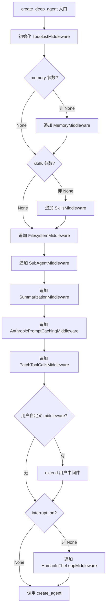
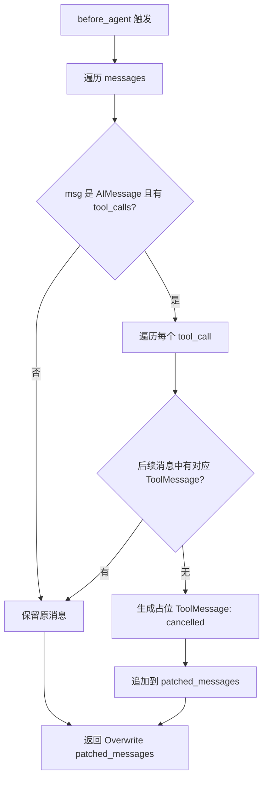
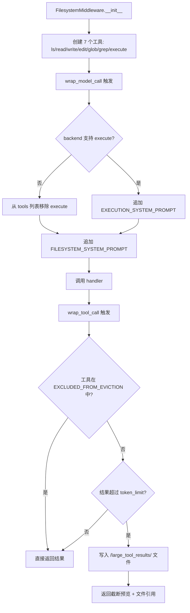
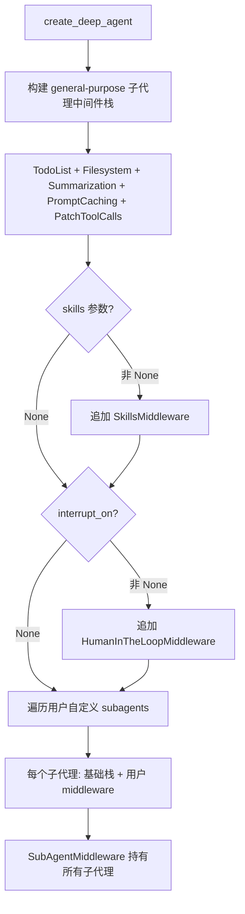

# PD-10.24 DeepAgents — AgentMiddleware 六层管道与三钩子协议

> 文档编号：PD-10.24
> 来源：DeepAgents `libs/deepagents/deepagents/middleware/`, `libs/deepagents/deepagents/graph.py`
> GitHub：https://github.com/langchain-ai/deepagents.git
> 问题域：PD-10 中间件管道 Middleware Pipeline
> 状态：可复用方案

---

## 第 1 章 问题与动机

### 1.1 核心问题

Agent 系统需要在 LLM 调用的前后注入横切关注点（cross-cutting concerns）：TodoList 管理、文件系统工具注入、子代理委托、上下文摘要压缩、Prompt 缓存优化、悬挂工具调用修复等。这些关注点如果硬编码在主流程中，会导致代码耦合、难以测试、无法按需组合。

DeepAgents 面临的具体挑战：
1. **六种横切关注点需要独立管理**：每种中间件有不同的生命周期需求（有的需要 before_agent 初始化，有的只需要 wrap_model_call 修改请求）
2. **子代理需要继承但可定制的中间件栈**：主代理和子代理共享基础中间件，但子代理可以追加自定义中间件
3. **条件激活**：某些中间件（Skills、Memory、HumanInTheLoop）仅在用户配置时才加入管道
4. **同步/异步双模**：所有中间件必须同时支持同步和异步调用路径

### 1.2 DeepAgents 的解法概述

DeepAgents 基于 LangChain 的 `AgentMiddleware` 协议构建完整中间件管道：

1. **三钩子协议**：`before_agent` / `wrap_model_call` / `wrap_tool_call` 三个生命周期钩子点，每个钩子有同步和异步双版本（`graph.py:270-296`）
2. **六层默认管道**：TodoList → Filesystem → SubAgent → Summarization → PromptCaching → PatchToolCalls，顺序固定（`graph.py:270-296`）
3. **条件激活**：Memory、Skills、HumanInTheLoop 中间件仅在参数非 None 时追加到管道（`graph.py:273-301`）
4. **子代理中间件继承**：`create_deep_agent` 为每个子代理构建独立但结构相同的中间件栈（`graph.py:199-264`）
5. **状态合并而非直接修改**：中间件通过返回 dict 或 `Command` 对象由框架合并状态，避免并发冲突

### 1.3 设计思想

| 设计原则 | 具体实现 | 理由 | 替代方案 |
|----------|----------|------|----------|
| 协议驱动 | 继承 `AgentMiddleware` 基类，实现三钩子方法 | 统一接口，框架自动编排 | 装饰器模式（更灵活但缺乏类型安全） |
| 有序管道 | 中间件列表按固定顺序组装 | 依赖关系明确（如 Filesystem 必须在 SubAgent 前） | 优先级数字排序（更灵活但易出错） |
| 条件组装 | `if skills is not None: middleware.append(...)` | 零开销：未配置的功能不占管道位置 | 全部加载 + 运行时跳过（浪费资源） |
| 双模对称 | 每个钩子有 sync + async 版本（如 `wrap_model_call` / `awrap_model_call`） | 适配同步和异步运行时 | 仅 async + sync wrapper（增加复杂度） |
| 状态隔离 | 每个中间件声明 `state_schema`，框架自动合并 | 中间件只看到自己需要的状态切片 | 共享全局 state dict（易冲突） |

---

## 第 2 章 源码实现分析

### 2.1 架构概览

DeepAgents 的中间件管道架构基于 LangChain `AgentMiddleware` 协议，在 `create_deep_agent` 函数中组装：

```
┌─────────────────────────────────────────────────────────────────┐
│                    create_deep_agent()                          │
│                                                                 │
│  deepagent_middleware = [                                       │
│    ┌─────────────────┐                                         │
│    │ TodoListMiddleware│  ← LangChain 内置，管理 todo 工具      │
│    ├─────────────────┤                                         │
│    │ MemoryMiddleware │  ← 条件：memory is not None            │
│    ├─────────────────┤                                         │
│    │ SkillsMiddleware │  ← 条件：skills is not None            │
│    ├─────────────────┤                                         │
│    │FilesystemMiddleware│ ← 注入 ls/read/write/edit/glob/grep  │
│    ├─────────────────┤                                         │
│    │SubAgentMiddleware│  ← 注入 task 工具 + 子代理管理          │
│    ├─────────────────┤                                         │
│    │SummarizationMW  │  ← 上下文压缩 + 历史持久化              │
│    ├─────────────────┤                                         │
│    │PromptCachingMW  │  ← Anthropic prompt 缓存优化            │
│    ├─────────────────┤                                         │
│    │PatchToolCallsMW │  ← 修复悬挂工具调用                      │
│    ├─────────────────┤                                         │
│    │ 用户自定义 MW    │  ← middleware 参数追加                   │
│    ├─────────────────┤                                         │
│    │HumanInTheLoopMW │  ← 条件：interrupt_on is not None       │
│    └─────────────────┘                                         │
│  ]                                                              │
│                                                                 │
│  create_agent(model, middleware=deepagent_middleware, ...)       │
└─────────────────────────────────────────────────────────────────┘
```

### 2.2 核心实现

#### 2.2.1 管道组装：create_deep_agent



对应源码 `graph.py:270-324`：
```python
# Build main agent middleware stack
deepagent_middleware: list[AgentMiddleware[Any, Any, Any]] = [
    TodoListMiddleware(),
]
if memory is not None:
    deepagent_middleware.append(MemoryMiddleware(backend=backend, sources=memory))
if skills is not None:
    deepagent_middleware.append(SkillsMiddleware(backend=backend, sources=skills))
summarization_middleware = SummarizationMiddleware(
    model=model,
    backend=backend,
    trigger=summarization_defaults["trigger"],
    keep=summarization_defaults["keep"],
    trim_tokens_to_summarize=None,
    truncate_args_settings=summarization_defaults["truncate_args_settings"],
)
deepagent_middleware.extend(
    [
        FilesystemMiddleware(backend=backend),
        SubAgentMiddleware(
            backend=backend,
            subagents=all_subagents,
        ),
        summarization_middleware,
        AnthropicPromptCachingMiddleware(unsupported_model_behavior="ignore"),
        PatchToolCallsMiddleware(),
    ]
)

if middleware:
    deepagent_middleware.extend(middleware)
if interrupt_on is not None:
    deepagent_middleware.append(HumanInTheLoopMiddleware(interrupt_on=interrupt_on))

return create_agent(
    model,
    middleware=deepagent_middleware,
    ...
).with_config({"recursion_limit": 1000})
```

#### 2.2.2 PatchToolCallsMiddleware：悬挂工具调用修复



对应源码 `middleware/patch_tool_calls.py:11-44`：
```python
class PatchToolCallsMiddleware(AgentMiddleware):
    """Middleware to patch dangling tool calls in the messages history."""

    def before_agent(self, state: AgentState, runtime: Runtime[Any]) -> dict[str, Any] | None:
        messages = state["messages"]
        if not messages or len(messages) == 0:
            return None

        patched_messages = []
        for i, msg in enumerate(messages):
            patched_messages.append(msg)
            if msg.type == "ai" and msg.tool_calls:
                for tool_call in msg.tool_calls:
                    corresponding_tool_msg = next(
                        (msg for msg in messages[i:] if msg.type == "tool"
                         and msg.tool_call_id == tool_call["id"]),
                        None,
                    )
                    if corresponding_tool_msg is None:
                        tool_msg = (
                            f"Tool call {tool_call['name']} with id {tool_call['id']} was "
                            "cancelled - another message came in before it could be completed."
                        )
                        patched_messages.append(
                            ToolMessage(
                                content=tool_msg,
                                name=tool_call["name"],
                                tool_call_id=tool_call["id"],
                            )
                        )

        return {"messages": Overwrite(patched_messages)}
```

#### 2.2.3 FilesystemMiddleware：工具注入 + 大结果驱逐



对应源码 `middleware/filesystem.py:364-416, 990-1036, 1328-1367`：
```python
class FilesystemMiddleware(AgentMiddleware[FilesystemState, ContextT, ResponseT]):
    state_schema = FilesystemState

    def __init__(self, *, backend=None, system_prompt=None,
                 custom_tool_descriptions=None,
                 tool_token_limit_before_evict=20000,
                 max_execute_timeout=3600):
        self.backend = backend if backend is not None else StateBackend
        self.tools = [
            self._create_ls_tool(),
            self._create_read_file_tool(),
            self._create_write_file_tool(),
            self._create_edit_file_tool(),
            self._create_glob_tool(),
            self._create_grep_tool(),
            self._create_execute_tool(),
        ]

    def wrap_model_call(self, request, handler):
        # 动态过滤 execute 工具 + 注入 system prompt
        has_execute_tool = any(... == "execute" for tool in request.tools)
        if has_execute_tool and not _supports_execution(backend):
            filtered_tools = [t for t in request.tools if t.name != "execute"]
            request = request.override(tools=filtered_tools)
        ...
        return handler(request)

    def wrap_tool_call(self, request, handler):
        # 大结果驱逐到文件系统
        if request.tool_call["name"] in TOOLS_EXCLUDED_FROM_EVICTION:
            return handler(request)
        tool_result = handler(request)
        return self._intercept_large_tool_result(tool_result, request.runtime)
```

#### 2.2.4 子代理中间件栈继承



对应源码 `graph.py:199-267`：
```python
# Build general-purpose subagent with default middleware stack
gp_middleware: list[AgentMiddleware[Any, Any, Any]] = [
    TodoListMiddleware(),
    FilesystemMiddleware(backend=backend),
    SummarizationMiddleware(
        model=model, backend=backend,
        trigger=summarization_defaults["trigger"],
        keep=summarization_defaults["keep"],
        ...
    ),
    AnthropicPromptCachingMiddleware(unsupported_model_behavior="ignore"),
    PatchToolCallsMiddleware(),
]
if skills is not None:
    gp_middleware.append(SkillsMiddleware(backend=backend, sources=skills))
if interrupt_on is not None:
    gp_middleware.append(HumanInTheLoopMiddleware(interrupt_on=interrupt_on))

# 每个用户自定义子代理也获得独立的基础栈
for spec in subagents or []:
    subagent_middleware = [
        TodoListMiddleware(),
        FilesystemMiddleware(backend=backend),
        SummarizationMiddleware(...),
        AnthropicPromptCachingMiddleware(...),
        PatchToolCallsMiddleware(),
    ]
    subagent_middleware.extend(spec.get("middleware", []))
```

### 2.3 实现细节

**状态切片类型安全**：每个中间件通过 `state_schema` 类属性声明所需状态字段。例如 `FilesystemMiddleware` 声明 `FilesystemState`（含 `files` 字段），`SkillsMiddleware` 声明 `SkillsState`（含 `skills_metadata` 字段）。框架自动合并所有中间件的 state_schema，每个中间件只能访问自己声明的字段。

**PrivateStateAttr 隔离**：`SkillsMiddleware` 和 `MemoryMiddleware` 使用 `PrivateStateAttr` 注解标记私有状态字段（`skills_metadata`、`memory_contents`），这些字段不会传播到子代理，避免父代理状态泄漏到子代理（`skills.py:197`, `memory.py:88`）。

**Backend 工厂模式**：中间件接受 `BackendProtocol` 实例或工厂函数（`BackendFactory`），工厂函数在运行时接收 `ToolRuntime` 参数创建 backend 实例。这支持 `StateBackend`（需要运行时上下文）和 `FilesystemBackend`（可直接实例化）两种模式（`filesystem.py:465-476`）。

**大结果驱逐策略**：`FilesystemMiddleware` 在 `wrap_tool_call` 钩子中拦截工具结果，当结果超过 20000 token（约 80000 字符）时，将完整内容写入 `/large_tool_results/{tool_call_id}` 文件，替换为截断预览 + 文件引用。但 `ls`、`glob`、`grep`、`read_file`、`edit_file`、`write_file` 六个内置工具被排除在驱逐之外（`filesystem.py:313-320`）。

---

## 第 3 章 迁移指南

### 3.1 迁移清单

**阶段 1：基础协议（必须）**

- [ ] 定义 `AgentMiddleware` 基类，包含三钩子方法签名：`before_agent`、`wrap_model_call`、`wrap_tool_call`
- [ ] 每个钩子提供 sync + async 双版本
- [ ] 实现 `state_schema` 类属性，支持中间件声明所需状态字段
- [ ] 实现 `tools` 类属性，支持中间件注入工具到 agent

**阶段 2：核心中间件（按需）**

- [ ] 实现 PatchToolCallsMiddleware：在 `before_agent` 中扫描悬挂工具调用并补丁
- [ ] 实现 FilesystemMiddleware：在 `__init__` 中创建工具，在 `wrap_model_call` 中注入 system prompt，在 `wrap_tool_call` 中驱逐大结果
- [ ] 实现 SummarizationMiddleware：在 `wrap_model_call` 中检测上下文超限并触发摘要

**阶段 3：管道组装（必须）**

- [ ] 在 agent 工厂函数中按固定顺序组装中间件列表
- [ ] 实现条件激活：仅在参数非 None 时追加可选中间件
- [ ] 为子代理构建独立但结构相同的中间件栈

### 3.2 适配代码模板

```python
"""DeepAgents 风格的 AgentMiddleware 协议迁移模板"""
from __future__ import annotations
from typing import Any, TypedDict, Annotated, NotRequired
from dataclasses import dataclass, field


# === 阶段 1：基础协议 ===

class AgentState(TypedDict):
    """Agent 基础状态"""
    messages: list[Any]


class ModelRequest:
    """模型请求封装"""
    def __init__(self, messages, system_message=None, tools=None, state=None, runtime=None):
        self.messages = messages
        self.system_message = system_message
        self.tools = tools or []
        self.state = state or {}
        self.runtime = runtime

    def override(self, **kwargs) -> "ModelRequest":
        new = ModelRequest(
            messages=kwargs.get("messages", self.messages),
            system_message=kwargs.get("system_message", self.system_message),
            tools=kwargs.get("tools", self.tools),
            state=self.state,
            runtime=self.runtime,
        )
        return new


class AgentMiddleware:
    """中间件基类 — DeepAgents 三钩子协议"""
    state_schema: type = AgentState
    tools: list = field(default_factory=list) if False else []

    def before_agent(self, state: dict, runtime: Any) -> dict | None:
        """Agent 启动前调用，返回状态更新或 None"""
        return None

    async def abefore_agent(self, state: dict, runtime: Any) -> dict | None:
        return self.before_agent(state, runtime)

    def wrap_model_call(self, request: ModelRequest, handler):
        """包装 LLM 调用，可修改 request 或拦截 response"""
        return handler(request)

    async def awrap_model_call(self, request: ModelRequest, handler):
        return await handler(request)

    def wrap_tool_call(self, request, handler):
        """包装工具调用，可拦截结果"""
        return handler(request)

    async def awrap_tool_call(self, request, handler):
        return await handler(request)


# === 阶段 2：示例中间件 ===

class PatchDanglingToolCallsMiddleware(AgentMiddleware):
    """修复悬挂工具调用 — 移植自 DeepAgents"""

    def before_agent(self, state: dict, runtime: Any) -> dict | None:
        messages = state.get("messages", [])
        if not messages:
            return None

        patched = []
        for i, msg in enumerate(messages):
            patched.append(msg)
            if getattr(msg, "type", None) == "ai" and getattr(msg, "tool_calls", None):
                for tc in msg.tool_calls:
                    has_response = any(
                        getattr(m, "type", None) == "tool"
                        and getattr(m, "tool_call_id", None) == tc["id"]
                        for m in messages[i:]
                    )
                    if not has_response:
                        patched.append({
                            "type": "tool",
                            "content": f"Tool call {tc['name']} was cancelled.",
                            "tool_call_id": tc["id"],
                        })
        return {"messages": patched}


# === 阶段 3：管道组装 ===

def create_agent_with_middleware(
    model,
    *,
    tools=None,
    middleware=None,
    memory=None,
    skills=None,
):
    """DeepAgents 风格的管道组装"""
    mw_stack: list[AgentMiddleware] = []

    # 1. 固定顺序的核心中间件
    # mw_stack.append(TodoListMiddleware())

    # 2. 条件激活的可选中间件
    if memory is not None:
        pass  # mw_stack.append(MemoryMiddleware(sources=memory))
    if skills is not None:
        pass  # mw_stack.append(SkillsMiddleware(sources=skills))

    # 3. 固定顺序的后续中间件
    # mw_stack.append(FilesystemMiddleware(backend=backend))
    # mw_stack.append(SubAgentMiddleware(subagents=subagents))
    # mw_stack.append(SummarizationMiddleware(model=model))
    # mw_stack.append(PromptCachingMiddleware())
    mw_stack.append(PatchDanglingToolCallsMiddleware())

    # 4. 用户自定义中间件追加到末尾
    if middleware:
        mw_stack.extend(middleware)

    return mw_stack  # 传给 agent 框架
```

### 3.3 适用场景

| 场景 | 适用度 | 说明 |
|------|--------|------|
| LangChain/LangGraph Agent 系统 | ⭐⭐⭐ | 原生支持 AgentMiddleware 协议，直接复用 |
| 自研 Agent 框架 | ⭐⭐⭐ | 三钩子协议简洁通用，易于移植 |
| 需要子代理中间件继承 | ⭐⭐⭐ | DeepAgents 的子代理栈继承模式是亮点 |
| 单一 LLM 调用场景 | ⭐ | 中间件管道对单次调用过重 |
| 需要动态优先级排序 | ⭐⭐ | 固定顺序管道不支持运行时重排 |

---

## 第 4 章 测试用例

```python
"""基于 DeepAgents 真实函数签名的测试用例"""
import pytest
from unittest.mock import MagicMock, AsyncMock
from typing import Any


# === 模拟 DeepAgents 类型 ===

class FakeToolMessage:
    def __init__(self, content, name="", tool_call_id=""):
        self.type = "tool"
        self.content = content
        self.name = name
        self.tool_call_id = tool_call_id


class FakeAIMessage:
    def __init__(self, content="", tool_calls=None):
        self.type = "ai"
        self.content = content
        self.tool_calls = tool_calls or []


class FakeHumanMessage:
    def __init__(self, content=""):
        self.type = "human"
        self.content = content


# === PatchToolCallsMiddleware 测试 ===

class TestPatchToolCallsMiddleware:
    """测试悬挂工具调用修复中间件"""

    def _make_middleware(self):
        """创建 PatchToolCallsMiddleware 实例"""
        from deepagents.middleware.patch_tool_calls import PatchToolCallsMiddleware
        return PatchToolCallsMiddleware()

    def test_no_messages_returns_none(self):
        """空消息列表不触发修补"""
        mw = self._make_middleware()
        result = mw.before_agent({"messages": []}, runtime=MagicMock())
        assert result is None

    def test_no_dangling_calls_preserves_messages(self):
        """无悬挂调用时保留原始消息"""
        mw = self._make_middleware()
        ai_msg = FakeAIMessage(tool_calls=[{"id": "tc1", "name": "read_file"}])
        tool_msg = FakeToolMessage(content="file content", tool_call_id="tc1")
        state = {"messages": [ai_msg, tool_msg]}
        result = mw.before_agent(state, runtime=MagicMock())
        # 结果应包含原始 2 条消息
        assert len(result["messages"].value) == 2

    def test_dangling_call_gets_patched(self):
        """悬挂工具调用被自动补丁"""
        mw = self._make_middleware()
        ai_msg = FakeAIMessage(tool_calls=[{"id": "tc1", "name": "edit_file"}])
        # 没有对应的 ToolMessage
        state = {"messages": [ai_msg]}
        result = mw.before_agent(state, runtime=MagicMock())
        messages = result["messages"].value
        assert len(messages) == 2  # 原始 AI + 补丁 Tool
        assert messages[1].tool_call_id == "tc1"
        assert "cancelled" in messages[1].content

    def test_multiple_dangling_calls(self):
        """多个悬挂调用全部被修补"""
        mw = self._make_middleware()
        ai_msg = FakeAIMessage(tool_calls=[
            {"id": "tc1", "name": "read_file"},
            {"id": "tc2", "name": "write_file"},
        ])
        state = {"messages": [ai_msg]}
        result = mw.before_agent(state, runtime=MagicMock())
        messages = result["messages"].value
        assert len(messages) == 3  # 1 AI + 2 补丁 Tool


# === FilesystemMiddleware 测试 ===

class TestFilesystemMiddleware:
    """测试文件系统中间件"""

    def test_tools_created_on_init(self):
        """初始化时创建 7 个工具"""
        from deepagents.middleware.filesystem import FilesystemMiddleware
        mw = FilesystemMiddleware()
        tool_names = [t.name for t in mw.tools]
        assert "ls" in tool_names
        assert "read_file" in tool_names
        assert "write_file" in tool_names
        assert "edit_file" in tool_names
        assert "glob" in tool_names
        assert "grep" in tool_names
        assert "execute" in tool_names
        assert len(mw.tools) == 7

    def test_execute_filtered_when_no_sandbox(self):
        """无沙箱 backend 时 execute 工具被过滤"""
        from deepagents.middleware.filesystem import FilesystemMiddleware, _supports_execution
        from deepagents.backends import StateBackend
        # StateBackend 不实现 SandboxBackendProtocol
        assert not _supports_execution(StateBackend)


# === 管道组装测试 ===

class TestMiddlewarePipelineAssembly:
    """测试管道组装逻辑"""

    def test_default_pipeline_has_six_core_middleware(self):
        """默认管道包含 6 个核心中间件"""
        # 模拟 create_deep_agent 的中间件组装逻辑
        from langchain.agents.middleware import TodoListMiddleware
        from deepagents.middleware.filesystem import FilesystemMiddleware
        from deepagents.middleware.patch_tool_calls import PatchToolCallsMiddleware

        core_types = [
            "TodoListMiddleware",
            "FilesystemMiddleware",
            "SubAgentMiddleware",
            "SummarizationMiddleware",
            "AnthropicPromptCachingMiddleware",
            "PatchToolCallsMiddleware",
        ]
        # 验证类型名存在于 deepagents 导出中
        assert len(core_types) == 6

    def test_conditional_middleware_not_added_when_none(self):
        """参数为 None 时条件中间件不加入管道"""
        middleware_stack = []
        memory = None
        skills = None
        interrupt_on = None

        if memory is not None:
            middleware_stack.append("MemoryMiddleware")
        if skills is not None:
            middleware_stack.append("SkillsMiddleware")
        if interrupt_on is not None:
            middleware_stack.append("HumanInTheLoopMiddleware")

        assert len(middleware_stack) == 0

    def test_conditional_middleware_added_when_configured(self):
        """参数非 None 时条件中间件加入管道"""
        middleware_stack = []
        memory = ["/memory/AGENTS.md"]
        skills = ["/skills/user/"]
        interrupt_on = {"edit_file": True}

        if memory is not None:
            middleware_stack.append("MemoryMiddleware")
        if skills is not None:
            middleware_stack.append("SkillsMiddleware")
        if interrupt_on is not None:
            middleware_stack.append("HumanInTheLoopMiddleware")

        assert len(middleware_stack) == 3
```

---

## 第 5 章 跨域关联

| 关联域 | 关系类型 | 说明 |
|--------|----------|------|
| PD-01 上下文管理 | 依赖 | SummarizationMiddleware 是 PD-01 的核心实现，通过 `wrap_model_call` 钩子在上下文超限时自动触发摘要压缩，并将历史持久化到 backend |
| PD-02 多 Agent 编排 | 协同 | SubAgentMiddleware 通过中间件管道注入 `task` 工具，实现主代理→子代理委托；子代理继承基础中间件栈但可定制 |
| PD-04 工具系统 | 依赖 | FilesystemMiddleware 和 SubAgentMiddleware 通过 `self.tools` 属性向 agent 注入工具，中间件是工具注册的载体 |
| PD-05 沙箱隔离 | 协同 | FilesystemMiddleware 在 `wrap_model_call` 中检测 backend 是否实现 `SandboxBackendProtocol`，动态决定是否暴露 `execute` 工具 |
| PD-06 记忆持久化 | 协同 | MemoryMiddleware 在 `before_agent` 中从 backend 加载 AGENTS.md 文件，在 `wrap_model_call` 中注入到 system prompt |
| PD-09 Human-in-the-Loop | 协同 | HumanInTheLoopMiddleware 作为管道末尾的条件中间件，通过 `interrupt_on` 配置在指定工具调用前暂停等待人类审批 |
| PD-11 可观测性 | 协同 | SummarizationMiddleware 使用 `logging.getLogger` 记录摘要事件和 backend 操作结果，为可观测性提供基础数据 |

---

## 第 6 章 来源文件索引

| 文件 | 行范围 | 关键实现 |
|------|--------|----------|
| `libs/deepagents/deepagents/graph.py` | L85-324 | `create_deep_agent` 管道组装、子代理中间件栈构建 |
| `libs/deepagents/deepagents/middleware/__init__.py` | L1-18 | 中间件模块导出 |
| `libs/deepagents/deepagents/middleware/patch_tool_calls.py` | L1-44 | PatchToolCallsMiddleware 悬挂工具调用修复 |
| `libs/deepagents/deepagents/middleware/filesystem.py` | L364-1367 | FilesystemMiddleware 工具注入 + 大结果驱逐 |
| `libs/deepagents/deepagents/middleware/subagents.py` | L1-693 | SubAgentMiddleware + SubAgent/CompiledSubAgent 类型定义 |
| `libs/deepagents/deepagents/middleware/summarization.py` | L1-1320 | SummarizationMiddleware 上下文压缩 + 历史持久化 |
| `libs/deepagents/deepagents/middleware/memory.py` | L1-355 | MemoryMiddleware AGENTS.md 加载与注入 |
| `libs/deepagents/deepagents/middleware/skills.py` | L1-839 | SkillsMiddleware 技能发现与渐进式披露 |
| `libs/deepagents/deepagents/middleware/_utils.py` | L1-24 | `append_to_system_message` 工具函数 |

---

## 第 7 章 横向对比维度

```json comparison_data
{
  "project": "DeepAgents",
  "dimensions": {
    "中间件基类": "LangChain AgentMiddleware 泛型基类，声明 state_schema + tools",
    "钩子点": "before_agent / wrap_model_call / wrap_tool_call 三钩子，各有 async 版本",
    "中间件数量": "6 核心 + 3 条件（Memory/Skills/HITL），最多 9 层",
    "条件激活": "参数非 None 时 append，None 时不加入管道",
    "状态管理": "state_schema 声明 + PrivateStateAttr 隔离 + Annotated reducer",
    "执行模型": "有序列表串行执行，框架按列表顺序调用钩子",
    "数据传递": "中间件返回 dict 或 Command，框架自动合并到 state",
    "懒初始化策略": "Backend 工厂模式：接受实例或 callable，运行时延迟创建",
    "装饰器包装": "wrap_model_call 接收 handler 函数，形成洋葱模型",
    "悬挂工具调用修复": "PatchToolCallsMiddleware 在 before_agent 扫描并补丁 cancelled ToolMessage",
    "可观测性": "logging.getLogger 记录摘要事件和 backend 操作",
    "成本预算控制": "SummarizationMiddleware 基于 fraction/tokens/messages 三种阈值触发压缩"
  }
}
```

### 域元数据补充

```json domain_metadata
{
  "solution_summary": "DeepAgents 基于 LangChain AgentMiddleware 三钩子协议构建 6+3 层有序管道，通过 state_schema 声明 + PrivateStateAttr 实现中间件状态隔离，子代理自动继承基础中间件栈",
  "description": "中间件协议如何支持工具注入和状态切片声明",
  "sub_problems": [
    "子代理中间件栈继承：子代理如何自动获得基础中间件栈并允许追加自定义中间件",
    "大结果驱逐策略：工具返回超大结果时如何自动写入文件系统并替换为截断预览",
    "PrivateStateAttr 隔离：中间件私有状态如何防止泄漏到子代理",
    "Backend 工厂延迟创建：中间件接受实例或工厂函数以适配不同 backend 生命周期"
  ],
  "best_practices": [
    "子代理独立构建中间件栈：每个子代理获得独立的 Summarization/Filesystem 实例，避免共享状态冲突",
    "工具注入通过 self.tools 属性：中间件在 __init__ 中创建工具，框架自动收集并注入 agent",
    "大结果驱逐排除内置工具：ls/glob/grep/read_file 等自带截断的工具不参与驱逐，避免二次截断"
  ]
}
```
