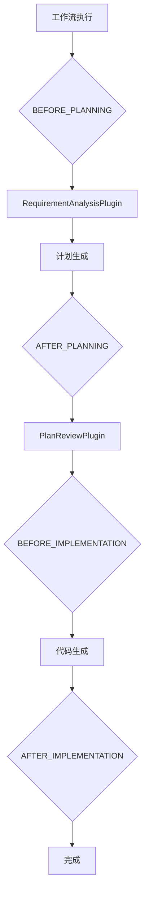
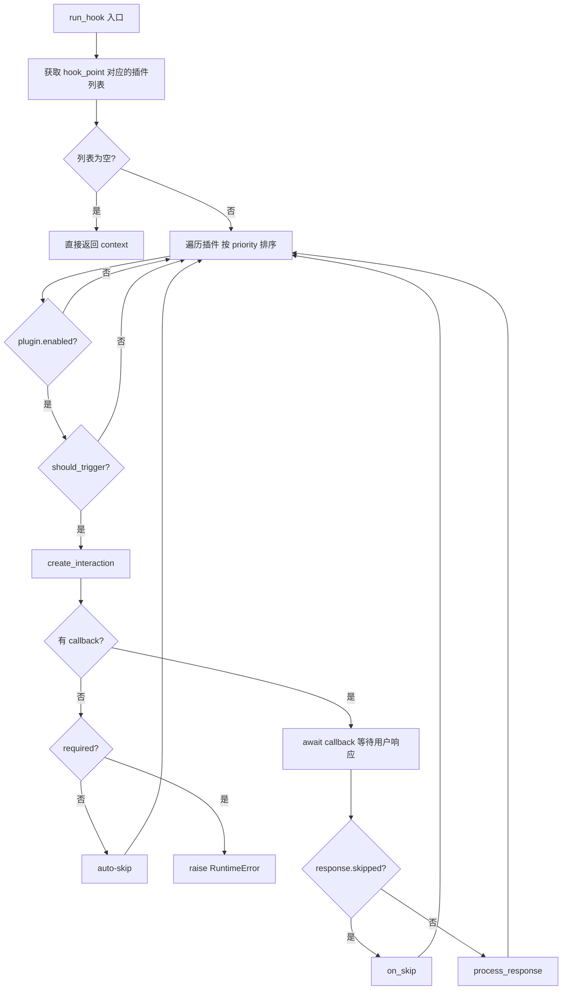

# PD-10.03 DeepCode — PluginRegistry 插件式中间件管道

> 文档编号：PD-10.03
> 来源：DeepCode `workflows/plugins/base.py`, `workflows/plugins/integration.py`
> GitHub：https://github.com/HKUDS/DeepCode.git
> 问题域：PD-10 中间件管道 Middleware Pipeline
> 状态：可复用方案

---

## 第 1 章 问题与动机

### 1.1 核心问题

在 AI 代码生成工作流中，核心管道（需求分析 → 计划生成 → 代码实现）一旦固化，就很难在不修改主流程代码的前提下插入新的横切关注点——比如用户确认、需求增强、计划审查等。传统做法是在主流程中硬编码 if/else 分支，导致：

- 主流程代码膨胀，每增加一个交互点就要改核心逻辑
- 交互逻辑与业务逻辑耦合，无法独立测试
- 无法动态启用/禁用某个交互步骤
- 新增交互点需要修改多处代码

DeepCode 面临的具体场景是：Paper-to-Code 和 Chat-based Planning 两条管道都需要在关键节点插入用户交互（User-in-Loop），但不希望污染已有的 `agent_orchestration_engine.py` 核心编排逻辑。

### 1.2 DeepCode 的解法概述

DeepCode 实现了一套完整的插件式中间件系统，核心设计：

1. **7 个 InteractionPoint 枚举** — 定义工作流中可插入的 hook 点（`workflows/plugins/base.py:34-54`）
2. **InteractionPlugin 抽象基类** — 三方法协议：`should_trigger()` → `create_interaction()` → `process_response()`（`workflows/plugins/base.py:79-183`）
3. **PluginRegistry 注册表** — 按 hook 点分组管理插件，按 priority 排序执行，错误隔离不影响主流程（`workflows/plugins/base.py:193-354`）
4. **WorkflowPluginIntegration 桥接层** — 将插件系统与 WebSocket 前端交互打通，用 `asyncio.Future` 实现异步等待用户响应（`workflows/plugins/integration.py:42-283`）
5. **全局单例 + 懒加载** — `get_default_registry()` 延迟初始化，自动注册默认插件（`workflows/plugins/base.py:361-386`）

### 1.3 设计思想

| 设计原则 | 具体实现 | 理由 | 替代方案 |
|----------|----------|------|----------|
| 零侵入集成 | 主流程只需加一行 `await plugins.run_hook(...)` | 不修改核心编排逻辑，降低回归风险 | 在主流程中硬编码 if/else 分支 |
| 条件触发 | 每个插件实现 `should_trigger()` 自主决定是否执行 | 避免不必要的用户交互，减少打断 | 全局开关一刀切 |
| 优先级排序 | `priority` 字段，数值越小优先级越高 | 控制插件执行顺序（需求分析先于计划审查） | 注册顺序决定执行顺序 |
| 错误隔离 | `run_hook` 中 try/except continue | 单个插件失败不阻塞整个工作流 | 任一插件失败则中止 |
| 异步交互 | `asyncio.Future` + `wait_for` 超时 | 支持前端 WebSocket 异步响应，超时自动降级 | 同步阻塞等待 |

---

## 第 2 章 源码实现分析

### 2.1 架构概览

DeepCode 的插件系统分为三层：基础协议层（base.py）、桥接层（integration.py）、具体插件层（requirement_analysis.py / plan_review.py）。

```
┌─────────────────────────────────────────────────────────────────┐
│                    WorkflowService                              │
│  execute_chat_planning() / execute_paper_to_code()              │
│                         │                                       │
│    plugin_context = create_context(task_id, user_input, ...)    │
│    plugin_context = await run_hook(BEFORE_PLANNING, ctx)        │
│                         │                                       │
└─────────────────────────┼───────────────────────────────────────┘
                          ▼
┌─────────────────────────────────────────────────────────────────┐
│              WorkflowPluginIntegration (桥接层)                  │
│  - create_context()     - run_hook() 委托给 Registry            │
│  - _handle_interaction() 通过 WebSocket 与前端交互               │
│  - submit_response()    用 asyncio.Future 传递用户响应           │
└─────────────────────────┼───────────────────────────────────────┘
                          ▼
┌─────────────────────────────────────────────────────────────────┐
│                   PluginRegistry (核心)                          │
│  _plugins: Dict[InteractionPoint, List[InteractionPlugin]]      │
│  register() / unregister() / enable() / disable()               │
│  run_hook(): 按 priority 遍历 → should_trigger → interact       │
└──────────┬──────────────────────────────────┬───────────────────┘
           ▼                                  ▼
┌─────────────────────┐          ┌─────────────────────────┐
│ RequirementAnalysis  │          │     PlanReview           │
│ Plugin               │          │     Plugin               │
│ hook: BEFORE_PLANNING│          │ hook: AFTER_PLANNING     │
│ priority: 10         │          │ priority: 10             │
│ 懒加载 Agent         │          │ 最多 3 轮修改            │
└─────────────────────┘          └─────────────────────────┘
```

### 2.2 核心实现

#### 2.2.1 InteractionPoint 枚举与 InteractionPlugin 基类



对应源码 `workflows/plugins/base.py:34-108`：

```python
class InteractionPoint(Enum):
    """定义工作流中可插入的 hook 点"""
    # Chat Planning Pipeline hooks
    BEFORE_PLANNING = "before_planning"
    AFTER_PLANNING = "after_planning"
    # Paper-to-Code Pipeline hooks
    BEFORE_RESEARCH_ANALYSIS = "before_research_analysis"
    AFTER_RESEARCH_ANALYSIS = "after_research_analysis"
    AFTER_CODE_PLANNING = "after_code_planning"
    # Common hooks
    BEFORE_IMPLEMENTATION = "before_implementation"
    AFTER_IMPLEMENTATION = "after_implementation"

class InteractionPlugin(ABC):
    name: str = "base_plugin"
    description: str = "Base plugin"
    hook_point: InteractionPoint = InteractionPoint.BEFORE_PLANNING
    priority: int = 100  # Lower number = higher priority

    @abstractmethod
    async def should_trigger(self, context: Dict[str, Any]) -> bool: ...
    @abstractmethod
    async def create_interaction(self, context: Dict[str, Any]) -> InteractionRequest: ...
    @abstractmethod
    async def process_response(self, response: InteractionResponse, context: Dict[str, Any]) -> Dict[str, Any]: ...
    async def on_skip(self, context): return context
    async def on_timeout(self, context): return await self.on_skip(context)
```

关键设计：插件基类定义了 5 个生命周期方法，其中 3 个抽象方法强制子类实现，2 个可选方法（`on_skip`、`on_timeout`）提供默认降级行为。

#### 2.2.2 PluginRegistry.run_hook — 核心执行引擎



对应源码 `workflows/plugins/base.py:271-354`：

```python
async def run_hook(
    self, hook_point: InteractionPoint,
    context: Dict[str, Any], task_id: Optional[str] = None,
) -> Dict[str, Any]:
    plugins = self._plugins.get(hook_point, [])
    if not plugins:
        return context

    for plugin in plugins:
        if not plugin.enabled:
            continue
        try:
            if not await plugin.should_trigger(context):
                continue
            interaction = await plugin.create_interaction(context)
            if self._interaction_callback and task_id:
                try:
                    response = await asyncio.wait_for(
                        self._interaction_callback(task_id, interaction),
                        timeout=interaction.timeout_seconds,
                    )
                    if response.skipped:
                        context = await plugin.on_skip(context)
                    else:
                        context = await plugin.process_response(response, context)
                except asyncio.TimeoutError:
                    context = await plugin.on_timeout(context)
            else:
                if not interaction.required:
                    context = await plugin.on_skip(context)
                else:
                    raise RuntimeError(f"Plugin '{plugin.name}' requires interaction but no callback")
        except Exception as e:
            self.logger.error(f"Plugin '{plugin.name}' failed: {e}")
            continue  # 错误隔离：单个插件失败不阻塞
    return context
```

### 2.3 实现细节

#### 全局单例与懒加载

`get_default_registry()` (`workflows/plugins/base.py:361-386`) 使用模块级全局变量实现单例，`auto_register` 参数避免循环导入：

```python
_default_registry: Optional[PluginRegistry] = None

def get_default_registry(auto_register: bool = True) -> PluginRegistry:
    global _default_registry
    if _default_registry is None:
        _default_registry = PluginRegistry()
        if auto_register:
            try:
                from .requirement_analysis import RequirementAnalysisPlugin
                from .plan_review import PlanReviewPlugin
                _default_registry.register(RequirementAnalysisPlugin())
                _default_registry.register(PlanReviewPlugin())
            except ImportError as e:
                logging.getLogger("plugin.registry").warning(f"Could not auto-register: {e}")
    return _default_registry
```

#### WorkflowService 集成点

`workflow_service.py:274-315` 展示了实际集成方式——仅在 `execute_chat_planning` 中添加约 30 行代码即可接入整个插件系统：

```python
# workflow_service.py:274-307
plugin_integration = self._get_plugin_integration()
if enable_user_interaction and plugin_integration:
    plugin_context = plugin_integration.create_context(
        task_id=task_id, user_input=requirements,
        requirements=requirements, enable_indexing=enable_indexing,
    )
    plugin_context = await plugin_integration.run_hook(
        InteractionPoint.BEFORE_PLANNING, plugin_context
    )
    if plugin_context.get("workflow_cancelled"):
        return {"status": "cancelled", "reason": plugin_context.get("cancel_reason")}
    final_requirements = plugin_context.get("requirements", requirements)
```

#### 异步交互桥接

`WorkflowPluginIntegration._handle_interaction()` (`integration.py:115-184`) 用 `asyncio.Future` 实现前端-后端异步交互：

1. 创建 Future 并存入 `_pending_interactions[task_id]`
2. 通过 WebSocket `_broadcast` 发送交互请求到前端
3. `await asyncio.wait_for(future, timeout)` 等待用户响应
4. 前端调用 `submit_response()` 时 `future.set_result(response)` 解除阻塞
5. 超时返回 `InteractionResponse(action="timeout", skipped=True)`

#### create_plugin_enabled_wrapper — 装饰器模式

`integration.py:232-283` 提供了一个高阶函数，可以不修改原函数代码直接包装 hook：

```python
async def wrapper(*args, task_id: str = None, **kwargs):
    context = integration.create_context(task_id=task_id or "unknown", args=args, kwargs=kwargs)
    for hook in before_hooks:
        context = await integration.run_hook(hook, context)
        if context.get("workflow_cancelled"):
            return {"status": "cancelled", "reason": context.get("cancel_reason")}
    result = await original_function(*args, **kwargs)
    context["result"] = result
    for hook in after_hooks:
        context = await integration.run_hook(hook, context)
    return result
```

---

## 第 3 章 迁移指南

### 3.1 迁移清单

**阶段 1：基础协议层（1 个文件）**
- [ ] 复制 `InteractionPoint` 枚举，根据自己的工作流定义 hook 点
- [ ] 复制 `InteractionPlugin` 抽象基类（含 5 个生命周期方法）
- [ ] 复制 `InteractionRequest` / `InteractionResponse` 数据类
- [ ] 复制 `PluginRegistry` 类（register/unregister/enable/disable/run_hook）

**阶段 2：桥接层（按需）**
- [ ] 如果需要前端交互：实现 `WorkflowPluginIntegration`（asyncio.Future 模式）
- [ ] 如果纯后端：直接在 `run_hook` 中处理，不需要桥接层

**阶段 3：具体插件**
- [ ] 继承 `InteractionPlugin`，实现 `should_trigger` / `create_interaction` / `process_response`
- [ ] 在 `get_default_registry()` 中注册默认插件

**阶段 4：集成**
- [ ] 在工作流关键节点添加 `await registry.run_hook(HookPoint.XXX, context)`
- [ ] 处理 `context.get("workflow_cancelled")` 取消信号

### 3.2 适配代码模板

以下是一个最小可运行的插件系统实现：

```python
"""minimal_plugin_system.py — 可直接复用的插件中间件系统"""
import asyncio
import logging
from abc import ABC, abstractmethod
from dataclasses import dataclass, field
from enum import Enum
from typing import Any, Callable, Dict, List, Optional, Awaitable

# === Step 1: 定义 Hook 点（根据你的工作流修改） ===
class HookPoint(Enum):
    BEFORE_PLANNING = "before_planning"
    AFTER_PLANNING = "after_planning"
    BEFORE_EXECUTION = "before_execution"
    AFTER_EXECUTION = "after_execution"

# === Step 2: 交互数据结构 ===
@dataclass
class PluginRequest:
    interaction_type: str
    title: str
    data: Dict[str, Any]
    required: bool = False
    timeout_seconds: int = 300

@dataclass
class PluginResponse:
    action: str
    data: Dict[str, Any] = field(default_factory=dict)
    skipped: bool = False

# === Step 3: 插件基类 ===
class BasePlugin(ABC):
    name: str = "base"
    hook_point: HookPoint = HookPoint.BEFORE_PLANNING
    priority: int = 100

    def __init__(self, enabled: bool = True):
        self.enabled = enabled
        self.logger = logging.getLogger(f"plugin.{self.name}")

    @abstractmethod
    async def should_trigger(self, ctx: Dict[str, Any]) -> bool: ...

    @abstractmethod
    async def execute(self, ctx: Dict[str, Any]) -> Dict[str, Any]: ...

    async def on_skip(self, ctx: Dict[str, Any]) -> Dict[str, Any]:
        return ctx

# === Step 4: 注册表 ===
InteractionCallback = Callable[[str, PluginRequest], Awaitable[PluginResponse]]

class PluginRegistry:
    def __init__(self):
        self._plugins: Dict[HookPoint, List[BasePlugin]] = {p: [] for p in HookPoint}
        self._callback: Optional[InteractionCallback] = None
        self.logger = logging.getLogger("plugin.registry")

    def register(self, plugin: BasePlugin) -> None:
        self._plugins[plugin.hook_point].append(plugin)
        self._plugins[plugin.hook_point].sort(key=lambda p: p.priority)

    def unregister(self, name: str) -> bool:
        for plugins in self._plugins.values():
            for p in plugins:
                if p.name == name:
                    plugins.remove(p)
                    return True
        return False

    def set_callback(self, cb: InteractionCallback) -> None:
        self._callback = cb

    async def run_hook(self, hook: HookPoint, ctx: Dict[str, Any]) -> Dict[str, Any]:
        for plugin in self._plugins.get(hook, []):
            if not plugin.enabled:
                continue
            try:
                if not await plugin.should_trigger(ctx):
                    continue
                ctx = await plugin.execute(ctx)
            except Exception as e:
                self.logger.error(f"Plugin '{plugin.name}' failed: {e}")
                continue  # 错误隔离
        return ctx

# === Step 5: 全局单例 ===
_registry: Optional[PluginRegistry] = None

def get_registry() -> PluginRegistry:
    global _registry
    if _registry is None:
        _registry = PluginRegistry()
    return _registry
```

### 3.3 适用场景

| 场景 | 适用度 | 说明 |
|------|--------|------|
| AI 工作流需要用户确认/审查 | ⭐⭐⭐ | DeepCode 的核心场景，直接复用 |
| 多阶段管道需要横切关注点 | ⭐⭐⭐ | 日志、鉴权、限流等都可以用插件实现 |
| 需要动态启用/禁用功能 | ⭐⭐⭐ | enable/disable + should_trigger 双重控制 |
| 高并发实时系统 | ⭐ | 全异步设计有开销，热路径不适合 |
| 简单线性管道（< 3 步） | ⭐ | 过度设计，直接写 if/else 更简单 |

---

## 第 4 章 测试用例

```python
"""test_plugin_registry.py — 基于 DeepCode 真实接口的测试"""
import asyncio
import pytest
from typing import Any, Dict

# 假设已复制 base.py 到项目中
from workflows.plugins.base import (
    InteractionPlugin, InteractionPoint, InteractionRequest,
    InteractionResponse, PluginRegistry, reset_registry,
)


class MockPlugin(InteractionPlugin):
    """测试用插件"""
    name = "mock_plugin"
    hook_point = InteractionPoint.BEFORE_PLANNING
    priority = 10

    def __init__(self, should_fire: bool = True, **kwargs):
        super().__init__(**kwargs)
        self._should_fire = should_fire
        self.triggered = False

    async def should_trigger(self, context: Dict[str, Any]) -> bool:
        return self._should_fire

    async def create_interaction(self, context: Dict[str, Any]) -> InteractionRequest:
        return InteractionRequest(
            interaction_type="test", title="Test", description="Test",
            data={"key": "value"}, required=False, timeout_seconds=5,
        )

    async def process_response(self, response: InteractionResponse, context: Dict[str, Any]) -> Dict[str, Any]:
        self.triggered = True
        context["mock_processed"] = True
        return context


class TestPluginRegistry:
    def setup_method(self):
        reset_registry()
        self.registry = PluginRegistry()

    def test_register_and_priority_sort(self):
        """插件按 priority 排序"""
        p1 = MockPlugin(); p1.name = "p1"; p1.priority = 50
        p2 = MockPlugin(); p2.name = "p2"; p2.priority = 10
        self.registry.register(p1)
        self.registry.register(p2)
        plugins = self.registry.get_plugins(InteractionPoint.BEFORE_PLANNING)
        assert [p.name for p in plugins] == ["p2", "p1"]

    def test_unregister(self):
        """注销插件"""
        p = MockPlugin()
        self.registry.register(p)
        assert self.registry.unregister("mock_plugin") is True
        assert self.registry.unregister("nonexistent") is False
        assert len(self.registry.get_plugins(InteractionPoint.BEFORE_PLANNING)) == 0

    def test_enable_disable(self):
        """动态启用/禁用"""
        p = MockPlugin()
        self.registry.register(p)
        self.registry.disable("mock_plugin")
        assert p.enabled is False
        self.registry.enable("mock_plugin")
        assert p.enabled is True

    @pytest.mark.asyncio
    async def test_run_hook_skips_disabled(self):
        """禁用的插件不执行"""
        p = MockPlugin()
        p.enabled = False
        self.registry.register(p)
        ctx = await self.registry.run_hook(InteractionPoint.BEFORE_PLANNING, {})
        assert "mock_processed" not in ctx

    @pytest.mark.asyncio
    async def test_run_hook_skips_when_should_trigger_false(self):
        """should_trigger 返回 False 时跳过"""
        p = MockPlugin(should_fire=False)
        self.registry.register(p)
        ctx = await self.registry.run_hook(InteractionPoint.BEFORE_PLANNING, {})
        assert "mock_processed" not in ctx

    @pytest.mark.asyncio
    async def test_run_hook_auto_skip_without_callback(self):
        """无 callback 时自动 skip 非 required 插件"""
        p = MockPlugin()
        self.registry.register(p)
        ctx = await self.registry.run_hook(InteractionPoint.BEFORE_PLANNING, {}, task_id="t1")
        # 无 callback，auto-skip，不会调用 process_response
        assert p.triggered is False

    @pytest.mark.asyncio
    async def test_error_isolation(self):
        """单个插件异常不阻塞后续插件"""
        class FailPlugin(MockPlugin):
            name = "fail_plugin"
            priority = 1
            async def should_trigger(self, ctx):
                raise RuntimeError("boom")

        p_fail = FailPlugin()
        p_ok = MockPlugin(); p_ok.priority = 50
        self.registry.register(p_fail)
        self.registry.register(p_ok)
        # 不应抛异常
        ctx = await self.registry.run_hook(InteractionPoint.BEFORE_PLANNING, {})
        # p_ok 仍然执行（auto-skip 因为无 callback）
        assert True  # 没有抛异常即通过

    @pytest.mark.asyncio
    async def test_run_hook_with_callback(self):
        """有 callback 时正常执行 process_response"""
        async def mock_callback(task_id, request):
            return InteractionResponse(action="confirm", data={"answer": "yes"})

        p = MockPlugin()
        self.registry.register(p)
        self.registry.set_interaction_callback(mock_callback)
        ctx = await self.registry.run_hook(
            InteractionPoint.BEFORE_PLANNING, {}, task_id="t1"
        )
        assert p.triggered is True
        assert ctx.get("mock_processed") is True

    @pytest.mark.asyncio
    async def test_context_chain_passing(self):
        """多插件间 context 链式传递"""
        class PluginA(MockPlugin):
            name = "a"; priority = 1
            async def process_response(self, resp, ctx):
                ctx["step_a"] = True; return ctx

        class PluginB(MockPlugin):
            name = "b"; priority = 2
            async def should_trigger(self, ctx):
                return ctx.get("step_a", False)
            async def process_response(self, resp, ctx):
                ctx["step_b"] = True; return ctx

        async def cb(tid, req):
            return InteractionResponse(action="ok")

        self.registry.set_interaction_callback(cb)
        self.registry.register(PluginA())
        self.registry.register(PluginB())
        ctx = await self.registry.run_hook(InteractionPoint.BEFORE_PLANNING, {}, "t1")
        assert ctx["step_a"] is True
        assert ctx["step_b"] is True
```

---

## 第 5 章 跨域关联

| 关联域 | 关系类型 | 说明 |
|--------|----------|------|
| PD-09 Human-in-the-Loop | 强协同 | DeepCode 的插件系统本质上是 User-in-Loop 的实现载体。`RequirementAnalysisPlugin` 和 `PlanReviewPlugin` 都是 HITL 交互点，通过插件模式解耦了交互逻辑与主流程 |
| PD-03 容错与重试 | 协同 | `run_hook` 中的 try/except continue 实现了插件级错误隔离；`asyncio.wait_for` 超时保护防止用户无响应阻塞管道；`on_timeout` 提供降级路径 |
| PD-04 工具系统 | 类比 | 插件注册表（PluginRegistry）与工具注册表（ToolRegistry）在设计模式上高度相似：都是 name→handler 映射 + 动态注册/注销 + 按条件分发 |
| PD-02 多 Agent 编排 | 依赖 | 插件系统嵌入在 `agent_orchestration_engine.py` 的多 Agent 管道中，作为编排节点间的拦截层 |
| PD-11 可观测性 | 协同 | 每个插件自带 `logging.getLogger(f"plugin.{self.name}")`，Registry 在 register/run_hook 时记录日志，可接入统一追踪 |

---

## 第 6 章 来源文件索引

| 文件 | 行范围 | 关键实现 |
|------|--------|----------|
| `workflows/plugins/base.py` | L34-L54 | InteractionPoint 枚举：7 个 hook 点定义 |
| `workflows/plugins/base.py` | L57-L77 | InteractionRequest / InteractionResponse 数据类 |
| `workflows/plugins/base.py` | L79-L183 | InteractionPlugin 抽象基类：5 个生命周期方法 |
| `workflows/plugins/base.py` | L193-L354 | PluginRegistry：注册、排序、run_hook 核心执行引擎 |
| `workflows/plugins/base.py` | L358-L392 | 全局单例 get_default_registry + reset_registry |
| `workflows/plugins/integration.py` | L42-L100 | WorkflowPluginIntegration：桥接层初始化与 context 创建 |
| `workflows/plugins/integration.py` | L102-L113 | run_hook 委托方法 |
| `workflows/plugins/integration.py` | L115-L184 | _handle_interaction：asyncio.Future + WebSocket 异步交互 |
| `workflows/plugins/integration.py` | L186-L216 | submit_response：前端响应注入 |
| `workflows/plugins/integration.py` | L232-L283 | create_plugin_enabled_wrapper：装饰器模式包装 |
| `workflows/plugins/requirement_analysis.py` | L24-L185 | RequirementAnalysisPlugin：需求增强插件，懒加载 Agent |
| `workflows/plugins/plan_review.py` | L24-L221 | PlanReviewPlugin：计划审查插件，最多 3 轮修改 |
| `new_ui/backend/services/workflow_service.py` | L39-L61 | WorkflowService 懒加载插件集成 |
| `new_ui/backend/services/workflow_service.py` | L272-L315 | execute_chat_planning 中的 BEFORE_PLANNING hook 集成 |

---

## 第 7 章 横向对比维度

```json comparison_data
{
  "project": "DeepCode",
  "dimensions": {
    "中间件基类": "InteractionPlugin ABC，3 抽象 + 2 可选生命周期方法",
    "钩子点": "7 个 InteractionPoint 枚举，覆盖 Planning/Research/Implementation",
    "中间件数量": "2 个默认插件：RequirementAnalysis + PlanReview",
    "条件激活": "should_trigger() 方法 + enabled 属性双重控制",
    "状态管理": "Dict[str, Any] context 链式传递，插件返回修改后的 context",
    "执行模型": "纯异步 async/await，asyncio.Future 等待用户响应",
    "同步热路径": "无同步模式，全部 async（不适合热路径）",
    "错误隔离": "try/except continue，单插件失败不阻塞管道",
    "交互桥接": "WorkflowPluginIntegration 通过 WebSocket + asyncio.Future 连接前端",
    "装饰器包装": "create_plugin_enabled_wrapper 高阶函数，零修改包装已有函数"
  }
}
```

### 域元数据补充

```json domain_metadata
{
  "solution_summary": "DeepCode 用 PluginRegistry + InteractionPlugin ABC 实现 7 hook 点插件管道，通过 asyncio.Future 桥接 WebSocket 前端交互，支持动态注册/注销和 priority 排序执行",
  "description": "插件系统可作为 User-in-Loop 交互的标准载体，将交互逻辑从主流程解耦",
  "sub_problems": [
    "异步交互桥接：插件需要等待前端用户响应时的 Future/Promise 模式",
    "装饰器包装：不修改原函数代码直接注入 before/after hook 的高阶函数模式",
    "超时降级策略：用户无响应时的 auto-skip vs auto-approve 选择"
  ],
  "best_practices": [
    "懒加载避免循环导入：get_default_registry(auto_register) 参数控制是否立即导入插件模块",
    "插件内资源懒初始化：RequirementAnalysisPlugin 的 _get_agent() 延迟到首次触发时才创建 Agent 实例",
    "装饰器模式零侵入：create_plugin_enabled_wrapper 包装已有函数，不修改原始代码即可注入 hook"
  ]
}
```
