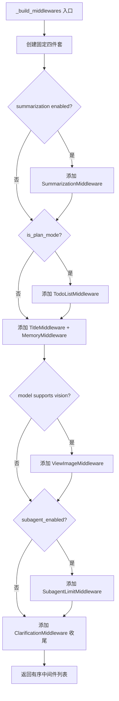
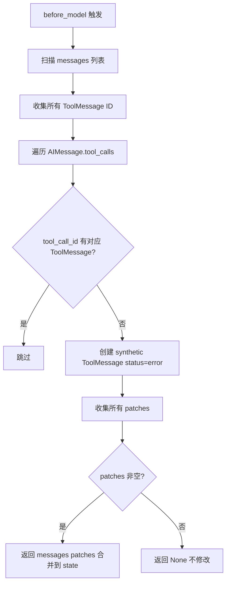
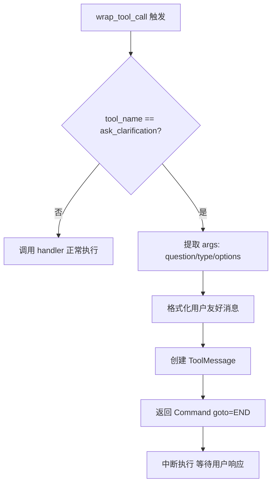

# PD-10.03 DeerFlow — AgentMiddleware 有序中间件链与五钩子生命周期

> 文档编号：PD-10.03
> 来源：DeerFlow `backend/src/agents/lead_agent/agent.py`
> GitHub：https://github.com/bytedance/deer-flow.git
> 问题域：PD-10 中间件管道 Middleware Pipeline
> 状态：可复用方案

---

## 第 1 章 问题与动机

### 1.1 核心问题

Agent 系统在处理用户请求时，需要在 LLM 调用前后执行大量横切关注点（cross-cutting concerns）：线程数据目录创建、文件上传注入、沙箱分配、悬挂工具调用修复、上下文摘要、待办管理、标题生成、记忆持久化、图片注入、子代理限流、澄清拦截。这些关注点如果直接写在 Agent 主逻辑中，会导致：

1. **代码膨胀**：Agent 入口函数变成上千行的 God Function
2. **耦合严重**：修改一个关注点可能影响其他关注点
3. **无法按需组合**：不同场景（plan mode vs normal mode）需要不同的中间件组合
4. **测试困难**：横切逻辑与业务逻辑纠缠，无法独立单测

### 1.2 DeerFlow 的解法概述

DeerFlow 2.0 基于 LangChain `AgentMiddleware` 泛型基类构建有序中间件链，核心设计：

1. **11 个独立中间件**：每个横切关注点封装为独立的 `AgentMiddleware[StateSchema]` 子类，通过 `state_schema` 类属性声明所需状态切片（`agent.py:195`）
2. **5 个生命周期钩子**：`before_agent` / `after_agent` / `before_model` / `after_model` / `wrap_tool_call`，每个中间件只覆写需要的钩子（`clarification_middleware.py:132`）
3. **条件激活**：通过 `RunnableConfig` 动态决定是否加入特定中间件（如 `TodoListMiddleware` 仅在 plan mode 启用，`ViewImageMiddleware` 仅在模型支持 vision 时启用）（`agent.py:203-225`）
4. **状态合并而非直接修改**：中间件返回 `dict | None`，由框架负责合并到 `ThreadState`，避免并发修改冲突（`thread_state.py:21-45`）
5. **严格顺序约束**：`ThreadDataMiddleware` 必须最先（创建目录供后续中间件使用），`ClarificationMiddleware` 必须最后（拦截澄清请求中断执行）（`agent.py:177-185`）

### 1.3 设计思想

| 设计原则 | 具体实现 | 理由 | 替代方案 |
|----------|----------|------|----------|
| 单一职责 | 每个中间件一个文件一个类 | 独立开发、测试、部署 | 一个大中间件处理所有逻辑 |
| 泛型状态切片 | `AgentMiddleware[SandboxMiddlewareState]` | 类型安全，中间件只访问声明的字段 | 全量 state 传递 |
| 懒初始化 | `SandboxMiddleware(lazy_init=True)` | 避免不必要的资源分配 | 始终 eager 初始化 |
| 配置驱动组合 | `_build_middlewares(config)` 根据 RunnableConfig 动态构建 | 不同场景不同中间件组合 | 硬编码固定链 |
| 同步/异步双模 | 每个钩子有 sync + async 版本（`abefore_model`） | 兼容同步和异步调用场景 | 只支持一种模式 |
| Reducer 合并 | `Annotated[list[str], merge_artifacts]` | 多中间件写同一字段时安全合并 | 直接覆写 |

---

## 第 2 章 源码实现分析

### 2.1 架构概览

DeerFlow 的中间件管道架构如下：

```
┌─────────────────────────────────────────────────────────────────┐
│                    make_lead_agent(config)                       │
│                     agent.py:238-265                            │
├─────────────────────────────────────────────────────────────────┤
│  _build_middlewares(config)  →  有序中间件列表                    │
│                                                                 │
│  ┌──────────────┐  ┌──────────────┐  ┌──────────────┐          │
│  │ ThreadData   │→ │  Uploads     │→ │  Sandbox     │→ ...     │
│  │ before_agent │  │ before_agent │  │ before_agent │          │
│  └──────────────┘  └──────────────┘  └──────────────┘          │
│                                                                 │
│  ... → ┌──────────────┐  ┌──────────────┐                      │
│        │ ViewImage    │→ │Clarification │  (always last)        │
│        │ before_model │  │wrap_tool_call│                       │
│        └──────────────┘  └──────────────┘                      │
├─────────────────────────────────────────────────────────────────┤
│  ThreadState (AgentState + 自定义字段 + Reducer)                 │
│  thread_state.py:48-55                                          │
└─────────────────────────────────────────────────────────────────┘
```

11 个中间件按生命周期钩子分布：

| 中间件 | before_agent | after_agent | before_model | after_model | wrap_tool_call |
|--------|:---:|:---:|:---:|:---:|:---:|
| ThreadDataMiddleware | ✅ | | | | |
| UploadsMiddleware | ✅ | | | | |
| SandboxMiddleware | ✅ | | | | ✅ (lazy) |
| DanglingToolCallMiddleware | | | ✅ | | |
| SummarizationMiddleware | | | ✅ | | |
| TodoListMiddleware | | | ✅ | | |
| TitleMiddleware | | ✅ | | | |
| MemoryMiddleware | | ✅ | | | |
| ViewImageMiddleware | | | ✅ | | |
| SubagentLimitMiddleware | | | | ✅ | |
| ClarificationMiddleware | | | | | ✅ |

### 2.2 核心实现

#### 2.2.1 中间件链构建器



对应源码 `backend/src/agents/lead_agent/agent.py:186-235`：

```python
def _build_middlewares(config: RunnableConfig):
    """Build middleware chain based on runtime configuration."""
    middlewares = [ThreadDataMiddleware(), UploadsMiddleware(),
                   SandboxMiddleware(), DanglingToolCallMiddleware()]

    # 条件激活：摘要中间件
    summarization_middleware = _create_summarization_middleware()
    if summarization_middleware is not None:
        middlewares.append(summarization_middleware)

    # 条件激活：TodoList 仅在 plan mode
    is_plan_mode = config.get("configurable", {}).get("is_plan_mode", False)
    todo_list_middleware = _create_todo_list_middleware(is_plan_mode)
    if todo_list_middleware is not None:
        middlewares.append(todo_list_middleware)

    middlewares.append(TitleMiddleware())
    middlewares.append(MemoryMiddleware())

    # 条件激活：ViewImage 仅在模型支持 vision 时
    model_name = config.get("configurable", {}).get("model_name")
    model_config = app_config.get_model_config(model_name)
    if model_config is not None and model_config.supports_vision:
        middlewares.append(ViewImageMiddleware())

    # 条件激活：SubagentLimit 仅在子代理启用时
    subagent_enabled = config.get("configurable", {}).get("subagent_enabled", False)
    if subagent_enabled:
        max_concurrent = config.get("configurable", {}).get("max_concurrent_subagents", 3)
        middlewares.append(SubagentLimitMiddleware(max_concurrent=max_concurrent))

    # ClarificationMiddleware 必须最后
    middlewares.append(ClarificationMiddleware())
    return middlewares
```

#### 2.2.2 悬挂工具调用修复（before_model 钩子）



对应源码 `backend/src/agents/middlewares/dangling_tool_call_middleware.py:30-66`：

```python
def _fix_dangling_tool_calls(self, state: AgentState) -> dict | None:
    messages = state.get("messages", [])
    if not messages:
        return None

    # 收集已有 ToolMessage 的 ID
    existing_tool_msg_ids: set[str] = set()
    for msg in messages:
        if isinstance(msg, ToolMessage):
            existing_tool_msg_ids.add(msg.tool_call_id)

    # 查找悬挂的 tool_calls 并构建补丁
    patches: list[ToolMessage] = []
    for msg in messages:
        if getattr(msg, "type", None) != "ai":
            continue
        tool_calls = getattr(msg, "tool_calls", None)
        if not tool_calls:
            continue
        for tc in tool_calls:
            tc_id = tc.get("id")
            if tc_id and tc_id not in existing_tool_msg_ids:
                patches.append(ToolMessage(
                    content="[Tool call was interrupted and did not return a result.]",
                    tool_call_id=tc_id,
                    name=tc.get("name", "unknown"),
                    status="error",
                ))
                existing_tool_msg_ids.add(tc_id)

    if not patches:
        return None
    return {"messages": patches}
```

#### 2.2.3 澄清拦截（wrap_tool_call 钩子）



对应源码 `backend/src/agents/middlewares/clarification_middleware.py:131-151`：

```python
@override
def wrap_tool_call(
    self,
    request: ToolCallRequest,
    handler: Callable[[ToolCallRequest], ToolMessage | Command],
) -> ToolMessage | Command:
    if request.tool_call.get("name") != "ask_clarification":
        return handler(request)
    return self._handle_clarification(request)

def _handle_clarification(self, request: ToolCallRequest) -> Command:
    args = request.tool_call.get("args", {})
    formatted_message = self._format_clarification_message(args)
    tool_call_id = request.tool_call.get("id", "")
    tool_message = ToolMessage(
        content=formatted_message,
        tool_call_id=tool_call_id,
        name="ask_clarification",
    )
    return Command(update={"messages": [tool_message]}, goto=END)
```

### 2.3 实现细节

#### 状态切片与 Reducer 机制

`ThreadState` 通过 `Annotated` 类型注解为特定字段注册 Reducer 函数，确保多中间件并发写入时安全合并（`thread_state.py:48-55`）：

```python
class ThreadState(AgentState):
    sandbox: NotRequired[SandboxState | None]
    thread_data: NotRequired[ThreadDataState | None]
    title: NotRequired[str | None]
    artifacts: Annotated[list[str], merge_artifacts]       # 去重合并
    todos: NotRequired[list | None]
    uploaded_files: NotRequired[list[dict] | None]
    viewed_images: Annotated[dict[str, ViewedImageData], merge_viewed_images]  # 空 dict 清除
```

`merge_viewed_images` 的特殊语义：传入空 `{}` 表示清除所有已查看图片，这是 ViewImageMiddleware 处理完图片后的清理信号（`thread_state.py:31-45`）。

#### 记忆中间件的异步去抖队列

MemoryMiddleware 不直接调用 LLM 更新记忆，而是将对话投入 `MemoryUpdateQueue` 单例队列，通过 `threading.Timer` 实现 30 秒去抖（`memory/queue.py:36-61`）。同一 thread_id 的多次更新会被合并为最新一次，避免频繁 LLM 调用。队列处理时还有 0.5 秒间隔防止 rate limiting（`queue.py:119-121`）。

#### 子代理限流的 after_model 截断

SubagentLimitMiddleware 在 `after_model` 钩子中检查 LLM 输出的 tool_calls，如果 `task` 类型调用超过 `max_concurrent`（clamped to [2,4]），直接截断多余的调用并用 `model_copy` 替换原消息（`subagent_limit_middleware.py:40-67`）。这比 prompt 限制更可靠。

---

## 第 3 章 迁移指南

### 3.1 迁移清单

**阶段 1：基础设施（必须）**

- [ ] 定义 `AgentMiddleware` 基类（如果不用 LangChain，需自行实现 5 钩子调度）
- [ ] 定义 `AgentState` 及各中间件的 `StateSchema` 切片
- [ ] 实现状态合并机制（Reducer 注册表）
- [ ] 实现中间件链构建器 `_build_middlewares(config)`

**阶段 2：核心中间件（按需）**

- [ ] ThreadDataMiddleware — 线程数据目录管理
- [ ] DanglingToolCallMiddleware — 悬挂工具调用修复（强烈推荐）
- [ ] SandboxMiddleware — 沙箱懒初始化
- [ ] ClarificationMiddleware — 澄清拦截与执行中断

**阶段 3：增强中间件（可选）**

- [ ] SummarizationMiddleware — 上下文摘要压缩
- [ ] MemoryMiddleware — 异步去抖记忆更新
- [ ] SubagentLimitMiddleware — 子代理并发限流
- [ ] ViewImageMiddleware — 多模态图片注入

### 3.2 适配代码模板

以下是不依赖 LangChain 的最小中间件框架实现：

```python
from abc import ABC
from typing import Any, Generic, TypeVar

S = TypeVar("S", bound=dict)


class MiddlewareBase(ABC, Generic[S]):
    """中间件基类，5 个生命周期钩子。"""

    state_schema: type[S] | None = None

    def before_agent(self, state: S, runtime: Any) -> dict | None:
        return None

    def after_agent(self, state: S, runtime: Any) -> dict | None:
        return None

    def before_model(self, state: S, runtime: Any) -> dict | None:
        return None

    def after_model(self, state: S, runtime: Any) -> dict | None:
        return None

    def wrap_tool_call(self, request: Any, handler: Any) -> Any:
        return handler(request)


class MiddlewareChain:
    """有序中间件链执行器。"""

    def __init__(self, middlewares: list[MiddlewareBase]):
        self._middlewares = middlewares

    def run_hook(self, hook_name: str, state: dict, runtime: Any) -> dict:
        """按顺序执行所有中间件的指定钩子，合并状态更新。"""
        for mw in self._middlewares:
            hook = getattr(mw, hook_name, None)
            if hook is None:
                continue
            update = hook(state, runtime)
            if update is not None:
                state = self._merge_state(state, update)
        return state

    def _merge_state(self, base: dict, update: dict) -> dict:
        """合并状态更新，支持 list append 和 dict merge。"""
        merged = dict(base)
        for key, value in update.items():
            if key in merged:
                existing = merged[key]
                if isinstance(existing, list) and isinstance(value, list):
                    merged[key] = existing + value
                elif isinstance(existing, dict) and isinstance(value, dict):
                    merged[key] = {**existing, **value}
                else:
                    merged[key] = value
            else:
                merged[key] = value
        return merged


def build_middlewares(config: dict) -> list[MiddlewareBase]:
    """根据配置动态构建中间件链。"""
    middlewares: list[MiddlewareBase] = [
        ThreadDataMiddleware(),  # 必须最先
    ]

    if config.get("sandbox_enabled", True):
        middlewares.append(SandboxMiddleware(lazy_init=True))

    if config.get("summarization_enabled", False):
        middlewares.append(SummarizationMiddleware())

    if config.get("memory_enabled", True):
        middlewares.append(MemoryMiddleware())

    # ClarificationMiddleware 必须最后
    middlewares.append(ClarificationMiddleware())
    return middlewares
```

### 3.3 适用场景

| 场景 | 适用度 | 说明 |
|------|--------|------|
| LangChain/LangGraph Agent | ⭐⭐⭐ | 直接使用 `AgentMiddleware` 基类，零适配成本 |
| 自研 Agent 框架 | ⭐⭐⭐ | 参考 5 钩子设计，自行实现调度器 |
| 简单 LLM 应用（无工具调用） | ⭐⭐ | 只需 before_model/after_model 两个钩子 |
| 多 Agent 编排系统 | ⭐⭐⭐ | 每个 Agent 独立中间件链，SubagentLimit 控制并发 |
| 流式对话系统 | ⭐⭐ | 需额外处理流式 chunk 与中间件状态的交互 |

---

## 第 4 章 测试用例

```python
import pytest
from unittest.mock import MagicMock, patch
from langchain_core.messages import AIMessage, HumanMessage, ToolMessage


class TestDanglingToolCallMiddleware:
    """测试悬挂工具调用修复中间件。"""

    def test_no_dangling_calls(self):
        """正常情况：所有 tool_calls 都有对应 ToolMessage。"""
        from src.agents.middlewares.dangling_tool_call_middleware import (
            DanglingToolCallMiddleware,
        )

        mw = DanglingToolCallMiddleware()
        state = {
            "messages": [
                AIMessage(content="", tool_calls=[{"id": "tc1", "name": "search"}]),
                ToolMessage(content="result", tool_call_id="tc1", name="search"),
            ]
        }
        result = mw._fix_dangling_tool_calls(state)
        assert result is None  # 无需修复

    def test_fix_dangling_call(self):
        """悬挂情况：AIMessage 有 tool_call 但无对应 ToolMessage。"""
        from src.agents.middlewares.dangling_tool_call_middleware import (
            DanglingToolCallMiddleware,
        )

        mw = DanglingToolCallMiddleware()
        state = {
            "messages": [
                AIMessage(content="", tool_calls=[{"id": "tc1", "name": "search"}]),
                # 缺少 ToolMessage for tc1
            ]
        }
        result = mw._fix_dangling_tool_calls(state)
        assert result is not None
        assert len(result["messages"]) == 1
        patch_msg = result["messages"][0]
        assert isinstance(patch_msg, ToolMessage)
        assert patch_msg.tool_call_id == "tc1"
        assert patch_msg.status == "error"

    def test_empty_messages(self):
        """空消息列表不报错。"""
        from src.agents.middlewares.dangling_tool_call_middleware import (
            DanglingToolCallMiddleware,
        )

        mw = DanglingToolCallMiddleware()
        assert mw._fix_dangling_tool_calls({"messages": []}) is None


class TestClarificationMiddleware:
    """测试澄清拦截中间件。"""

    def test_non_clarification_passthrough(self):
        """非澄清工具调用正常透传。"""
        from src.agents.middlewares.clarification_middleware import (
            ClarificationMiddleware,
        )

        mw = ClarificationMiddleware()
        request = MagicMock()
        request.tool_call = {"name": "search", "args": {}}
        handler = MagicMock(return_value=ToolMessage(content="ok", tool_call_id="t1"))
        result = mw.wrap_tool_call(request, handler)
        handler.assert_called_once_with(request)

    def test_clarification_intercept(self):
        """澄清工具调用被拦截，返回 Command(goto=END)。"""
        from src.agents.middlewares.clarification_middleware import (
            ClarificationMiddleware,
        )
        from langgraph.types import Command

        mw = ClarificationMiddleware()
        request = MagicMock()
        request.tool_call = {
            "name": "ask_clarification",
            "id": "tc1",
            "args": {"question": "Which format?", "clarification_type": "approach_choice"},
        }
        handler = MagicMock()
        result = mw.wrap_tool_call(request, handler)
        handler.assert_not_called()  # handler 不应被调用
        assert isinstance(result, Command)


class TestSubagentLimitMiddleware:
    """测试子代理限流中间件。"""

    def test_within_limit(self):
        """task 调用数在限制内，不截断。"""
        from src.agents.middlewares.subagent_limit_middleware import (
            SubagentLimitMiddleware,
        )

        mw = SubagentLimitMiddleware(max_concurrent=3)
        state = {
            "messages": [
                AIMessage(
                    content="",
                    tool_calls=[
                        {"id": "t1", "name": "task"},
                        {"id": "t2", "name": "task"},
                    ],
                )
            ]
        }
        assert mw._truncate_task_calls(state) is None

    def test_exceeds_limit(self):
        """task 调用数超限，截断多余的。"""
        from src.agents.middlewares.subagent_limit_middleware import (
            SubagentLimitMiddleware,
        )

        mw = SubagentLimitMiddleware(max_concurrent=2)
        state = {
            "messages": [
                AIMessage(
                    content="",
                    tool_calls=[
                        {"id": "t1", "name": "task"},
                        {"id": "t2", "name": "task"},
                        {"id": "t3", "name": "task"},
                        {"id": "t4", "name": "search"},  # 非 task 不受影响
                    ],
                )
            ]
        }
        result = mw._truncate_task_calls(state)
        assert result is not None
        updated_calls = result["messages"][0].tool_calls
        task_calls = [tc for tc in updated_calls if tc["name"] == "task"]
        assert len(task_calls) == 2
        # search 调用保留
        search_calls = [tc for tc in updated_calls if tc["name"] == "search"]
        assert len(search_calls) == 1

    def test_clamp_range(self):
        """max_concurrent 被 clamp 到 [2, 4]。"""
        from src.agents.middlewares.subagent_limit_middleware import (
            SubagentLimitMiddleware,
        )

        mw_low = SubagentLimitMiddleware(max_concurrent=0)
        assert mw_low.max_concurrent == 2
        mw_high = SubagentLimitMiddleware(max_concurrent=10)
        assert mw_high.max_concurrent == 4
```

---

## 第 5 章 跨域关联

| 关联域 | 关系类型 | 说明 |
|--------|----------|------|
| PD-01 上下文管理 | 协同 | SummarizationMiddleware 在 before_model 钩子中压缩上下文，直接服务于上下文窗口管理 |
| PD-06 记忆持久化 | 协同 | MemoryMiddleware 在 after_agent 钩子中将对话投入去抖队列，是记忆系统的入口 |
| PD-04 工具系统 | 依赖 | ClarificationMiddleware 的 wrap_tool_call 钩子依赖工具系统的 ToolCallRequest 协议 |
| PD-05 沙箱隔离 | 协同 | SandboxMiddleware 在 before_agent 中分配沙箱，ThreadDataMiddleware 提供目录路径 |
| PD-09 Human-in-the-Loop | 协同 | ClarificationMiddleware 通过 Command(goto=END) 实现执行中断，等待用户响应 |
| PD-02 多 Agent 编排 | 协同 | SubagentLimitMiddleware 在 after_model 中截断过多的并行子代理调用 |
| PD-11 可观测性 | 协同 | 中间件链的有序执行天然支持在每个钩子点插入 tracing/logging |

---

## 第 6 章 来源文件索引

| 文件 | 行范围 | 关键实现 |
|------|--------|----------|
| `backend/src/agents/lead_agent/agent.py` | L1-L265 | 中间件链构建器 `_build_middlewares`、Agent 工厂 `make_lead_agent` |
| `backend/src/agents/middlewares/thread_data_middleware.py` | L19-L95 | ThreadDataMiddleware：线程目录创建与懒初始化 |
| `backend/src/agents/middlewares/uploads_middleware.py` | L22-L221 | UploadsMiddleware：文件上传检测与消息注入 |
| `backend/src/sandbox/middleware.py` | L18-L61 | SandboxMiddleware：沙箱懒获取与 eager/lazy 双模式 |
| `backend/src/agents/middlewares/dangling_tool_call_middleware.py` | L22-L74 | DanglingToolCallMiddleware：悬挂工具调用检测与补丁注入 |
| `backend/src/agents/middlewares/clarification_middleware.py` | L20-L173 | ClarificationMiddleware：澄清拦截与 Command 中断 |
| `backend/src/agents/middlewares/title_middleware.py` | L19-L93 | TitleMiddleware：首轮对话后自动生成标题 |
| `backend/src/agents/middlewares/memory_middleware.py` | L53-L107 | MemoryMiddleware：对话过滤与去抖队列投递 |
| `backend/src/agents/middlewares/view_image_middleware.py` | L19-L221 | ViewImageMiddleware：图片 base64 注入与重复检测 |
| `backend/src/agents/middlewares/subagent_limit_middleware.py` | L24-L75 | SubagentLimitMiddleware：task 调用截断与 clamp 限制 |
| `backend/src/agents/thread_state.py` | L1-L55 | ThreadState 定义、Reducer 函数（merge_artifacts、merge_viewed_images） |
| `backend/src/agents/memory/queue.py` | L21-L191 | MemoryUpdateQueue：去抖队列单例、Timer 调度 |
| `backend/src/config/summarization_config.py` | L10-L74 | SummarizationConfig：触发阈值、保留策略、Pydantic 模型 |
| `backend/src/config/memory_config.py` | L6-L69 | MemoryConfig：去抖秒数、最大事实数、置信度阈值 |

---

## 第 7 章 横向对比维度

```json comparison_data
{
  "project": "DeerFlow",
  "dimensions": {
    "中间件基类": "LangChain AgentMiddleware[S] 泛型基类，state_schema 声明状态切片",
    "钩子点": "5 个：before/after_agent、before/after_model、wrap_tool_call",
    "中间件数量": "11 个独立中间件，每个一文件一类",
    "条件激活": "RunnableConfig 驱动：plan_mode/vision/subagent 三维条件",
    "状态管理": "Annotated Reducer 合并，中间件返回 dict 由框架 merge",
    "执行模型": "有序串行链，列表顺序即执行顺序",
    "同步热路径": "sync/async 双模，每个钩子有 a 前缀异步版本",
    "错误隔离": "DanglingToolCallMiddleware 注入 synthetic error ToolMessage",
    "交互桥接": "ClarificationMiddleware 通过 Command(goto=END) 中断等待用户",
    "数据传递": "ThreadState 共享状态 + runtime.context 传递 thread_id",
    "懒初始化策略": "Sandbox/ThreadData 支持 lazy_init 参数延迟资源获取",
    "去抖队列": "MemoryMiddleware 通过 threading.Timer 30s 去抖批量更新记忆",
    "并发限流": "SubagentLimitMiddleware after_model 截断超限 task 调用 [2,4]"
  }
}
```

### 域元数据补充

```json domain_metadata
{
  "solution_summary": "DeerFlow 基于 LangChain AgentMiddleware 泛型基类构建 11 个有序中间件，通过 5 钩子生命周期（before/after_agent、before/after_model、wrap_tool_call）和 RunnableConfig 条件激活实现横切关注点解耦",
  "description": "中间件链的条件激活与泛型状态切片类型安全",
  "sub_problems": [
    "悬挂工具调用修复：用户中断导致 AIMessage.tool_calls 无对应 ToolMessage 时的自动补丁策略",
    "去抖记忆更新：高频对话场景下中间件如何通过 Timer 去抖避免频繁 LLM 调用",
    "子代理调用截断：LLM 输出过多并行 task 调用时的 after_model 硬截断 vs prompt 软限制",
    "多模态条件注入：仅在模型支持 vision 时动态添加图片注入中间件",
    "Reducer 清除语义：空 dict 作为清除信号的约定（merge_viewed_images 空 dict 清除全部）"
  ],
  "best_practices": [
    "懒初始化减少冷启动开销：Sandbox 和 ThreadData 默认 lazy_init=True，首次使用时才分配资源",
    "wrap_tool_call 拦截优于工具内判断：澄清逻辑在中间件层拦截而非工具实现内部处理，保持工具纯净",
    "去抖队列替代同步写入：MemoryMiddleware 投递到 Timer 去抖队列，避免阻塞 Agent 主流程",
    "after_model 硬截断比 prompt 限制更可靠：SubagentLimitMiddleware 直接截断 tool_calls 而非依赖 LLM 遵守 prompt 指令"
  ]
}
```
