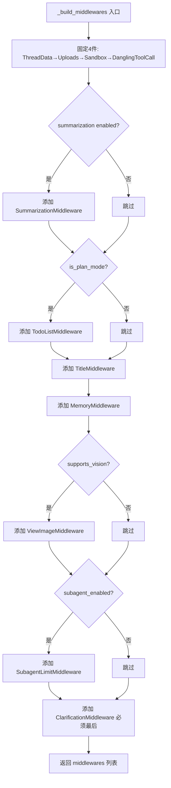
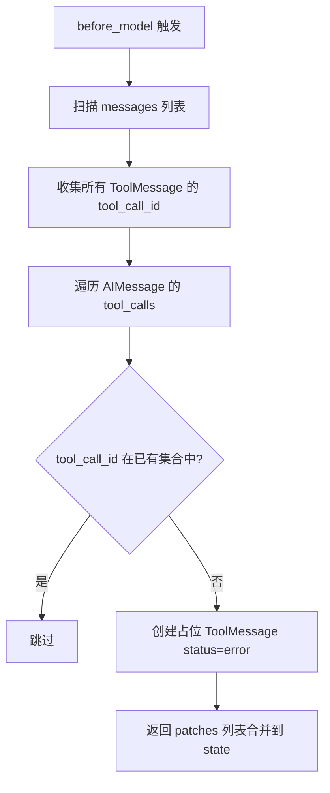
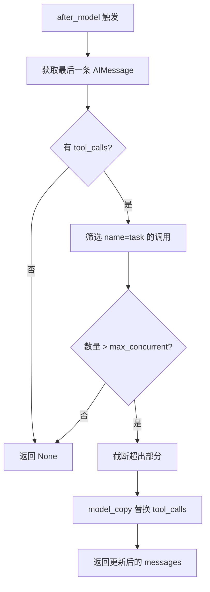
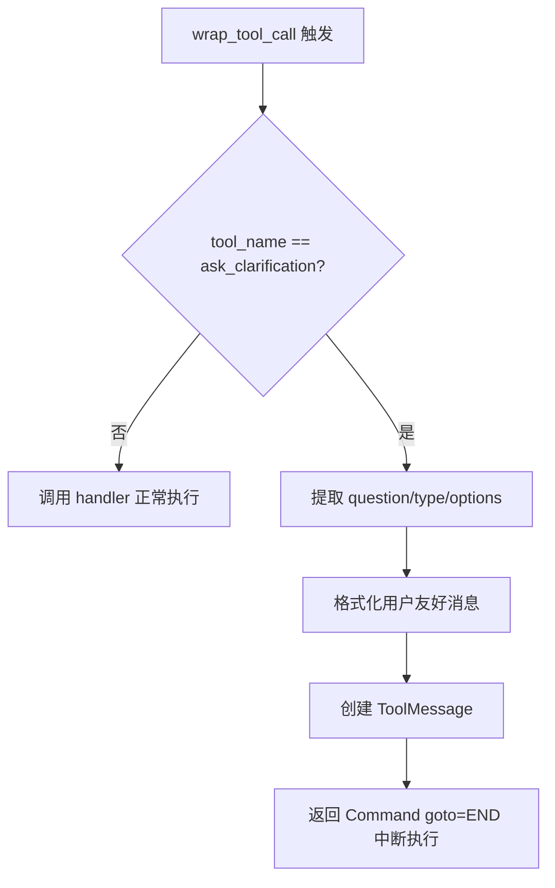

# PD-10.02 DeerFlow — 有序中间件链与五钩子生命周期

> 文档编号：PD-10.02
> 来源：DeerFlow `backend/src/agents/lead_agent/agent.py`, `backend/src/agents/middlewares/`
> GitHub：https://github.com/bytedance/deer-flow
> 问题域：PD-10 中间件管道 Middleware Pipeline
> 状态：可复用方案

---

## 第 1 章 问题与动机

### 1.1 核心问题

Agent 系统在执行过程中需要处理大量横切关注点（cross-cutting concerns）：线程数据目录创建、沙箱环境获取、文件上传注入、悬挂工具调用修复、上下文摘要、计划管理、标题生成、记忆持久化、图片注入、子代理并发限制、澄清拦截。这些关注点如果直接写在 Agent 主逻辑中，会导致：

1. **耦合爆炸**：Agent 核心代码膨胀，每新增一个横切功能就要修改主流程
2. **测试困难**：横切逻辑与业务逻辑交织，无法独立单元测试
3. **条件组合复杂**：不同运行模式（plan_mode、vision、subagent）需要不同的中间件组合，硬编码 if-else 不可维护
4. **执行顺序敏感**：某些中间件有严格的前后依赖（如 ThreadData 必须在 Sandbox 之前），顺序错误会导致运行时异常

### 1.2 DeerFlow 的解法概述

DeerFlow 基于 LangChain 的 `AgentMiddleware` 泛型基类，实现了一套有序中间件链系统：

1. **统一基类 `AgentMiddleware[S]`**：所有中间件继承自 `AgentMiddleware`，泛型参数 `S` 声明该中间件需要的状态切片（`backend/src/agents/middlewares/dangling_tool_call_middleware.py:22`）
2. **五个生命周期钩子**：`before_agent` / `after_agent` / `before_model` / `after_model` / `wrap_tool_call`，每个钩子都有同步和异步双版本（`a` 前缀）
3. **条件激活**：通过 `RunnableConfig` 动态决定是否启用某个中间件（如 `is_plan_mode`、`supports_vision`、`subagent_enabled`），见 `backend/src/agents/lead_agent/agent.py:186-235`
4. **状态合并而非直接修改**：中间件返回 `dict | None`，由框架负责合并到全局状态，避免并发修改冲突
5. **严格顺序定义**：中间件注册顺序在 `_build_middlewares()` 中硬编码，注释明确说明依赖关系（`agent.py:177-185`）

### 1.3 设计思想

| 设计原则 | 具体实现 | 理由 | 替代方案 |
|----------|----------|------|----------|
| 泛型状态切片 | `AgentMiddleware[SandboxMiddlewareState]` 声明所需状态字段 | 类型安全，IDE 自动补全，编译期发现状态字段缺失 | 全局 dict 无类型约束 |
| 返回值合并 | 中间件返回 `dict \| None`，框架用 reducer 合并 | 避免多中间件并发修改同一状态字段的竞态条件 | 直接修改 state 引用 |
| 条件激活 | `_build_middlewares(config)` 根据 RunnableConfig 动态组装 | 不需要的中间件完全不实例化，零开销 | 全部实例化 + 内部 if 跳过 |
| 同步/异步双模 | 每个钩子提供 sync + async 版本（如 `before_model` / `abefore_model`） | 支持同步测试和异步生产环境 | 仅 async，同步场景需 asyncio.run |
| 懒初始化 | ThreadDataMiddleware 和 SandboxMiddleware 支持 `lazy_init` 参数 | 延迟资源获取，减少不必要的 I/O 和进程创建 | 始终 eager 初始化 |

---

## 第 2 章 源码实现分析

### 2.1 架构概览

DeerFlow 的中间件系统围绕 LangChain `AgentMiddleware` 基类构建，11 个中间件按严格顺序注册到 Agent 实例：

```
┌─────────────────────────────────────────────────────────────────┐
│                    make_lead_agent(config)                       │
│                  agent.py:238-265                                │
├─────────────────────────────────────────────────────────────────┤
│  _build_middlewares(config) → List[AgentMiddleware]              │
│                                                                  │
│  ┌──────────────┐  ┌──────────────┐  ┌──────────────┐           │
│  │ ThreadData   │→ │ Uploads      │→ │ Sandbox      │→ ...      │
│  │ (必须最先)    │  │ (依赖thread) │  │ (lazy_init)  │           │
│  └──────────────┘  └──────────────┘  └──────────────┘           │
│                                                                  │
│  ... → ┌──────────────┐  ┌──────────────┐  ┌──────────────┐    │
│        │ Dangling     │→ │ Summarize?   │→ │ TodoList?    │    │
│        │ ToolCall     │  │ (config)     │  │ (plan_mode)  │    │
│        └──────────────┘  └──────────────┘  └──────────────┘    │
│                                                                  │
│  ... → ┌──────────────┐  ┌──────────────┐  ┌──────────────┐    │
│        │ Title        │→ │ Memory       │→ │ ViewImage?   │    │
│        │              │  │ (after Title)│  │ (vision)     │    │
│        └──────────────┘  └──────────────┘  └──────────────┘    │
│                                                                  │
│  ... → ┌──────────────┐  ┌──────────────┐                       │
│        │ SubagentLimit│→ │ Clarification│  ← 必须最后            │
│        │ (subagent)   │  │ (拦截澄清)   │                       │
│        └──────────────┘  └──────────────┘                       │
├─────────────────────────────────────────────────────────────────┤
│  create_agent(model, tools, middleware, system_prompt,          │
│               state_schema=ThreadState)                          │
└─────────────────────────────────────────────────────────────────┘
```

### 2.2 核心实现

#### 2.2.1 中间件链构建器



对应源码 `backend/src/agents/lead_agent/agent.py:186-235`：

```python
def _build_middlewares(config: RunnableConfig):
    middlewares = [ThreadDataMiddleware(), UploadsMiddleware(),
                   SandboxMiddleware(), DanglingToolCallMiddleware()]

    # 条件激活：摘要中间件
    summarization_middleware = _create_summarization_middleware()
    if summarization_middleware is not None:
        middlewares.append(summarization_middleware)

    # 条件激活：计划模式
    is_plan_mode = config.get("configurable", {}).get("is_plan_mode", False)
    todo_list_middleware = _create_todo_list_middleware(is_plan_mode)
    if todo_list_middleware is not None:
        middlewares.append(todo_list_middleware)

    middlewares.append(TitleMiddleware())
    middlewares.append(MemoryMiddleware())

    # 条件激活：视觉能力
    model_config = app_config.get_model_config(model_name)
    if model_config is not None and model_config.supports_vision:
        middlewares.append(ViewImageMiddleware())

    # 条件激活：子代理并发
    if subagent_enabled:
        middlewares.append(SubagentLimitMiddleware(max_concurrent=max_concurrent_subagents))

    # ClarificationMiddleware 必须最后
    middlewares.append(ClarificationMiddleware())
    return middlewares
```

#### 2.2.2 悬挂工具调用修复（before_model 钩子）



对应源码 `backend/src/agents/middlewares/dangling_tool_call_middleware.py:30-66`：

```python
def _fix_dangling_tool_calls(self, state: AgentState) -> dict | None:
    messages = state.get("messages", [])
    if not messages:
        return None

    existing_tool_msg_ids: set[str] = set()
    for msg in messages:
        if isinstance(msg, ToolMessage):
            existing_tool_msg_ids.add(msg.tool_call_id)

    patches: list[ToolMessage] = []
    for msg in messages:
        if getattr(msg, "type", None) != "ai":
            continue
        tool_calls = getattr(msg, "tool_calls", None)
        if not tool_calls:
            continue
        for tc in tool_calls:
            tc_id = tc.get("id")
            if tc_id and tc_id not in existing_tool_msg_ids:
                patches.append(
                    ToolMessage(
                        content="[Tool call was interrupted and did not return a result.]",
                        tool_call_id=tc_id,
                        name=tc.get("name", "unknown"),
                        status="error",
                    )
                )
                existing_tool_msg_ids.add(tc_id)

    if not patches:
        return None
    return {"messages": patches}
```

#### 2.2.3 子代理并发限制（after_model 钩子）



对应源码 `backend/src/agents/middlewares/subagent_limit_middleware.py:40-67`：

```python
def _truncate_task_calls(self, state: AgentState) -> dict | None:
    messages = state.get("messages", [])
    if not messages:
        return None

    last_msg = messages[-1]
    if getattr(last_msg, "type", None) != "ai":
        return None

    tool_calls = getattr(last_msg, "tool_calls", None)
    if not tool_calls:
        return None

    task_indices = [i for i, tc in enumerate(tool_calls) if tc.get("name") == "task"]
    if len(task_indices) <= self.max_concurrent:
        return None

    indices_to_drop = set(task_indices[self.max_concurrent:])
    truncated_tool_calls = [tc for i, tc in enumerate(tool_calls) if i not in indices_to_drop]
    updated_msg = last_msg.model_copy(update={"tool_calls": truncated_tool_calls})
    return {"messages": [updated_msg]}
```

#### 2.2.4 澄清拦截（wrap_tool_call 钩子）



对应源码 `backend/src/agents/middlewares/clarification_middleware.py:131-151`：

```python
@override
def wrap_tool_call(
    self,
    request: ToolCallRequest,
    handler: Callable[[ToolCallRequest], ToolMessage | Command],
) -> ToolMessage | Command:
    if request.tool_call.get("name") != "ask_clarification":
        return handler(request)
    return self._handle_clarification(request)

def _handle_clarification(self, request: ToolCallRequest) -> Command:
    args = request.tool_call.get("args", {})
    formatted_message = self._format_clarification_message(args)
    tool_call_id = request.tool_call.get("id", "")
    tool_message = ToolMessage(
        content=formatted_message,
        tool_call_id=tool_call_id,
        name="ask_clarification",
    )
    return Command(update={"messages": [tool_message]}, goto=END)
```

### 2.3 实现细节

**状态切片与 ThreadState 合并**

每个中间件通过泛型参数声明自己需要的状态字段子集。`ThreadState`（`backend/src/agents/thread_state.py:48-55`）是所有切片的超集：

```python
class ThreadState(AgentState):
    sandbox: NotRequired[SandboxState | None]
    thread_data: NotRequired[ThreadDataState | None]
    title: NotRequired[str | None]
    artifacts: Annotated[list[str], merge_artifacts]
    todos: NotRequired[list | None]
    uploaded_files: NotRequired[list[dict] | None]
    viewed_images: Annotated[dict[str, ViewedImageData], merge_viewed_images]
```

`Annotated` 字段使用自定义 reducer 函数（如 `merge_artifacts`、`merge_viewed_images`）处理合并冲突。`merge_viewed_images` 有特殊语义：空 dict `{}` 表示清空所有已查看图片。

**懒初始化模式**

`ThreadDataMiddleware` 和 `SandboxMiddleware` 都支持 `lazy_init` 参数（默认 `True`）。懒模式下 `before_agent` 只计算路径/不创建目录，`SandboxMiddleware` 延迟到首次工具调用时才获取沙箱。这避免了短对话中不必要的资源分配。

**中间件钩子分布**

| 中间件 | before_agent | after_agent | before_model | after_model | wrap_tool_call |
|--------|:---:|:---:|:---:|:---:|:---:|
| ThreadDataMiddleware | ✅ | | | | |
| UploadsMiddleware | ✅ | | | | |
| SandboxMiddleware | ✅ | | | | |
| DanglingToolCallMiddleware | | | ✅ | | |
| SummarizationMiddleware | | | ✅ | | |
| TodoListMiddleware | ✅ | | | | |
| TitleMiddleware | | ✅ | | | |
| MemoryMiddleware | | ✅ | | | |
| ViewImageMiddleware | | | ✅ | | |
| SubagentLimitMiddleware | | | | ✅ | |
| ClarificationMiddleware | | | | | ✅ |

---

## 第 3 章 迁移指南

### 3.1 迁移清单

**阶段 1：基础框架（必须）**

- [ ] 定义 `AgentMiddleware[S]` 泛型基类，包含 5 个钩子方法（sync + async 共 10 个）
- [ ] 定义 `AgentState` 基类和 `ThreadState` 全局状态 schema
- [ ] 实现中间件链构建器 `_build_middlewares(config)`
- [ ] 实现状态合并逻辑（reducer 函数处理 `Annotated` 字段）

**阶段 2：核心中间件（推荐）**

- [ ] `ThreadDataMiddleware`：线程数据目录管理
- [ ] `DanglingToolCallMiddleware`：悬挂工具调用修复
- [ ] `ClarificationMiddleware`：澄清请求拦截

**阶段 3：增强中间件（按需）**

- [ ] `SandboxMiddleware`：沙箱环境管理
- [ ] `SummarizationMiddleware`：上下文摘要
- [ ] `SubagentLimitMiddleware`：子代理并发限制
- [ ] `ViewImageMiddleware`：图片注入
- [ ] `MemoryMiddleware`：记忆持久化
- [ ] `TitleMiddleware`：自动标题生成

### 3.2 适配代码模板

以下是一个可直接运行的最小中间件框架实现：

```python
"""最小中间件框架 — 从 DeerFlow 提取的可复用模板"""
from __future__ import annotations

import logging
from abc import ABC
from typing import Any, Callable, Generic, TypeVar

logger = logging.getLogger(__name__)

S = TypeVar("S", bound=dict)


class AgentMiddleware(ABC, Generic[S]):
    """中间件基类，提供 5 个生命周期钩子。"""

    state_schema: type[S] | None = None

    def before_agent(self, state: S, runtime: Any) -> dict | None:
        """Agent 执行前。用于初始化资源、注入上下文。"""
        return None

    def after_agent(self, state: S, runtime: Any) -> dict | None:
        """Agent 执行后。用于清理资源、持久化状态。"""
        return None

    def before_model(self, state: S, runtime: Any) -> dict | None:
        """LLM 调用前。用于修补消息历史、注入额外信息。"""
        return None

    def after_model(self, state: S, runtime: Any) -> dict | None:
        """LLM 调用后。用于截断/修改模型输出。"""
        return None

    def wrap_tool_call(self, request: Any, handler: Callable) -> Any:
        """工具调用包装。用于拦截特定工具、修改参数或结果。"""
        return handler(request)

    # 异步版本
    async def abefore_agent(self, state: S, runtime: Any) -> dict | None:
        return self.before_agent(state, runtime)

    async def aafter_agent(self, state: S, runtime: Any) -> dict | None:
        return self.after_agent(state, runtime)

    async def abefore_model(self, state: S, runtime: Any) -> dict | None:
        return self.before_model(state, runtime)

    async def aafter_model(self, state: S, runtime: Any) -> dict | None:
        return self.after_model(state, runtime)

    async def awrap_tool_call(self, request: Any, handler: Callable) -> Any:
        return await handler(request)


class MiddlewareRunner:
    """中间件链执行器。按注册顺序执行钩子，合并返回值。"""

    def __init__(self, middlewares: list[AgentMiddleware]):
        self._middlewares = middlewares

    def run_hook(self, hook_name: str, state: dict, runtime: Any) -> dict:
        """执行指定钩子，合并所有中间件的返回值。"""
        updates: dict = {}
        for mw in self._middlewares:
            hook = getattr(mw, hook_name, None)
            if hook is None:
                continue
            result = hook(state, runtime)
            if result is not None:
                # 合并策略：后执行的中间件覆盖先执行的（last-wins）
                for key, value in result.items():
                    if key == "messages" and key in updates:
                        updates[key] = updates[key] + value  # messages 拼接
                    else:
                        updates[key] = value
                # 将更新应用到 state 供后续中间件使用
                state = {**state, **updates}
        return updates


def build_middlewares(config: dict) -> list[AgentMiddleware]:
    """条件激活中间件构建器模板。"""
    middlewares: list[AgentMiddleware] = []

    # 固定中间件（始终启用）
    # middlewares.append(ThreadDataMiddleware())
    # middlewares.append(DanglingToolCallMiddleware())

    # 条件中间件
    # if config.get("enable_vision"):
    #     middlewares.append(ViewImageMiddleware())

    # 拦截类中间件必须最后
    # middlewares.append(ClarificationMiddleware())

    return middlewares
```

### 3.3 适用场景

| 场景 | 适用度 | 说明 |
|------|--------|------|
| LangChain/LangGraph Agent 系统 | ⭐⭐⭐ | 直接复用，DeerFlow 就是基于 LangChain 构建 |
| 自研 Agent 框架 | ⭐⭐⭐ | 提取中间件基类 + Runner 模式，不依赖 LangChain |
| 多模态 Agent（文本+图片） | ⭐⭐⭐ | ViewImageMiddleware 模式可直接复用 |
| 单轮对话 Bot | ⭐ | 中间件开销大于收益，直接写逻辑即可 |
| 纯 API 网关中间件 | ⭐⭐ | 概念相似但钩子点不同，需适配 |

---

## 第 4 章 测试用例

```python
"""DeerFlow 中间件系统测试用例 — 基于真实函数签名"""
import pytest
from unittest.mock import MagicMock, patch
from langchain_core.messages import AIMessage, HumanMessage, ToolMessage


class TestDanglingToolCallMiddleware:
    """测试悬挂工具调用修复中间件"""

    def _make_middleware(self):
        from src.agents.middlewares.dangling_tool_call_middleware import DanglingToolCallMiddleware
        return DanglingToolCallMiddleware()

    def test_no_dangling_calls(self):
        """正常路径：所有 tool_call 都有对应 ToolMessage"""
        mw = self._make_middleware()
        state = {
            "messages": [
                AIMessage(content="", tool_calls=[{"id": "tc1", "name": "search", "args": {}}]),
                ToolMessage(content="result", tool_call_id="tc1", name="search"),
            ]
        }
        result = mw._fix_dangling_tool_calls(state)
        assert result is None

    def test_dangling_call_patched(self):
        """边界情况：AIMessage 有 tool_call 但无对应 ToolMessage"""
        mw = self._make_middleware()
        state = {
            "messages": [
                AIMessage(content="", tool_calls=[{"id": "tc1", "name": "search", "args": {}}]),
            ]
        }
        result = mw._fix_dangling_tool_calls(state)
        assert result is not None
        assert len(result["messages"]) == 1
        assert result["messages"][0].tool_call_id == "tc1"
        assert result["messages"][0].status == "error"

    def test_empty_messages(self):
        """降级行为：空消息列表"""
        mw = self._make_middleware()
        result = mw._fix_dangling_tool_calls({"messages": []})
        assert result is None


class TestSubagentLimitMiddleware:
    """测试子代理并发限制中间件"""

    def _make_middleware(self, max_concurrent=3):
        from src.agents.middlewares.subagent_limit_middleware import SubagentLimitMiddleware
        return SubagentLimitMiddleware(max_concurrent=max_concurrent)

    def test_within_limit(self):
        """正常路径：task 调用数量未超限"""
        mw = self._make_middleware(max_concurrent=3)
        state = {
            "messages": [
                AIMessage(content="", tool_calls=[
                    {"id": "1", "name": "task", "args": {}},
                    {"id": "2", "name": "task", "args": {}},
                ])
            ]
        }
        result = mw._truncate_task_calls(state)
        assert result is None

    def test_exceeds_limit_truncated(self):
        """边界情况：超出限制的 task 调用被截断"""
        mw = self._make_middleware(max_concurrent=2)
        state = {
            "messages": [
                AIMessage(content="", tool_calls=[
                    {"id": "1", "name": "task", "args": {}},
                    {"id": "2", "name": "task", "args": {}},
                    {"id": "3", "name": "task", "args": {}},
                    {"id": "4", "name": "search", "args": {}},  # 非 task 不受影响
                ])
            ]
        }
        result = mw._truncate_task_calls(state)
        assert result is not None
        tool_calls = result["messages"][0].tool_calls
        task_calls = [tc for tc in tool_calls if tc["name"] == "task"]
        assert len(task_calls) == 2
        # search 工具调用不受影响
        search_calls = [tc for tc in tool_calls if tc["name"] == "search"]
        assert len(search_calls) == 1

    def test_clamp_range(self):
        """边界情况：max_concurrent 被钳制到 [2, 4]"""
        mw_low = self._make_middleware(max_concurrent=0)
        assert mw_low.max_concurrent == 2
        mw_high = self._make_middleware(max_concurrent=10)
        assert mw_high.max_concurrent == 4


class TestClarificationMiddleware:
    """测试澄清拦截中间件"""

    def _make_middleware(self):
        from src.agents.middlewares.clarification_middleware import ClarificationMiddleware
        return ClarificationMiddleware()

    def test_non_clarification_passthrough(self):
        """正常路径：非澄清工具调用直接透传"""
        mw = self._make_middleware()
        request = MagicMock()
        request.tool_call = {"name": "search", "args": {}, "id": "tc1"}
        handler = MagicMock(return_value=ToolMessage(content="ok", tool_call_id="tc1"))
        result = mw.wrap_tool_call(request, handler)
        handler.assert_called_once_with(request)

    def test_clarification_intercepted(self):
        """核心路径：ask_clarification 被拦截并返回 Command"""
        from langgraph.types import Command
        mw = self._make_middleware()
        request = MagicMock()
        request.tool_call = {
            "name": "ask_clarification",
            "args": {"question": "你想用哪种数据库？", "clarification_type": "approach_choice"},
            "id": "tc1",
        }
        handler = MagicMock()
        result = mw.wrap_tool_call(request, handler)
        handler.assert_not_called()
        assert isinstance(result, Command)
```

---

## 第 5 章 跨域关联

| 关联域 | 关系类型 | 说明 |
|--------|----------|------|
| PD-01 上下文管理 | 协同 | `SummarizationMiddleware` 通过 `before_model` 钩子在 LLM 调用前压缩上下文，是上下文窗口管理的中间件实现 |
| PD-04 工具系统 | 依赖 | `wrap_tool_call` 钩子直接作用于工具执行层，`ClarificationMiddleware` 拦截特定工具调用，`SubagentLimitMiddleware` 截断工具调用列表 |
| PD-05 沙箱隔离 | 协同 | `SandboxMiddleware` 通过 `before_agent` 钩子获取沙箱环境，依赖 `ThreadDataMiddleware` 提供的 thread_id |
| PD-06 记忆持久化 | 协同 | `MemoryMiddleware` 通过 `after_agent` 钩子将对话队列化到记忆更新管道，过滤中间工具消息只保留最终对话 |
| PD-09 Human-in-the-Loop | 依赖 | `ClarificationMiddleware` 是 HITL 的中间件实现，通过 `wrap_tool_call` 拦截 `ask_clarification` 并返回 `Command(goto=END)` 中断执行 |
| PD-11 可观测性 | 协同 | `TitleMiddleware` 生成线程标题用于追踪标识，`MemoryMiddleware` 的消息过滤逻辑可用于日志精简 |

---

## 第 6 章 来源文件索引

| 文件 | 行范围 | 关键实现 |
|------|--------|----------|
| `backend/src/agents/lead_agent/agent.py` | L1-L265 | 中间件链构建器 `_build_middlewares()`、Agent 工厂 `make_lead_agent()` |
| `backend/src/agents/middlewares/dangling_tool_call_middleware.py` | L22-L74 | `DanglingToolCallMiddleware`：before_model 修复悬挂工具调用 |
| `backend/src/agents/middlewares/subagent_limit_middleware.py` | L24-L75 | `SubagentLimitMiddleware`：after_model 截断超限 task 调用 |
| `backend/src/agents/middlewares/clarification_middleware.py` | L20-L173 | `ClarificationMiddleware`：wrap_tool_call 拦截澄清请求 |
| `backend/src/agents/middlewares/thread_data_middleware.py` | L19-L95 | `ThreadDataMiddleware`：before_agent 创建线程目录 |
| `backend/src/agents/middlewares/memory_middleware.py` | L53-L107 | `MemoryMiddleware`：after_agent 队列化记忆更新 |
| `backend/src/agents/middlewares/title_middleware.py` | L19-L93 | `TitleMiddleware`：after_agent 自动生成标题 |
| `backend/src/agents/middlewares/uploads_middleware.py` | L22-L221 | `UploadsMiddleware`：before_agent 注入上传文件信息 |
| `backend/src/agents/middlewares/view_image_middleware.py` | L19-L221 | `ViewImageMiddleware`：before_model 注入图片详情 |
| `backend/src/sandbox/middleware.py` | L18-L60 | `SandboxMiddleware`：before_agent 获取沙箱环境 |
| `backend/src/agents/thread_state.py` | L48-L55 | `ThreadState`：全局状态 schema + reducer 函数 |
| `backend/src/config/summarization_config.py` | L21-L53 | `SummarizationConfig`：摘要中间件配置 |

---

## 第 7 章 横向对比维度

```json comparison_data
{
  "project": "DeerFlow",
  "dimensions": {
    "中间件基类": "LangChain AgentMiddleware[S] 泛型基类，状态切片类型安全",
    "钩子点": "5 钩子：before/after_agent、before/after_model、wrap_tool_call",
    "中间件数量": "11 个（4 固定 + 7 条件激活）",
    "条件激活": "RunnableConfig 驱动：plan_mode/vision/subagent/summarization",
    "状态管理": "返回 dict|None 由框架合并，Annotated reducer 处理冲突",
    "执行模型": "同步顺序执行，每个钩子按注册顺序遍历所有中间件",
    "同步热路径": "sync + async 双版本，async 默认委托 sync 实现",
    "错误隔离": "各中间件独立，异常不传播（框架层捕获）"
  }
}
```

### 域元数据补充

```json domain_metadata
{
  "solution_summary": "DeerFlow 基于 LangChain AgentMiddleware 泛型基类实现 11 个有序中间件，通过 RunnableConfig 条件激活，覆盖 before/after_agent、before/after_model、wrap_tool_call 五个生命周期钩子",
  "description": "中间件的条件激活与懒初始化策略对性能影响显著",
  "sub_problems": [
    "懒初始化策略：中间件资源获取的 eager vs lazy 时机选择",
    "状态切片类型安全：泛型参数声明中间件所需状态字段子集"
  ],
  "best_practices": [
    "泛型状态切片声明：每个中间件用 AgentMiddleware[S] 声明所需字段，编译期发现缺失",
    "懒初始化默认开启：ThreadData 和 Sandbox 默认 lazy_init=True，短对话零资源开销",
    "wrap_tool_call 实现流程中断：ClarificationMiddleware 通过 Command(goto=END) 优雅中断 Agent 循环"
  ]
}
```
