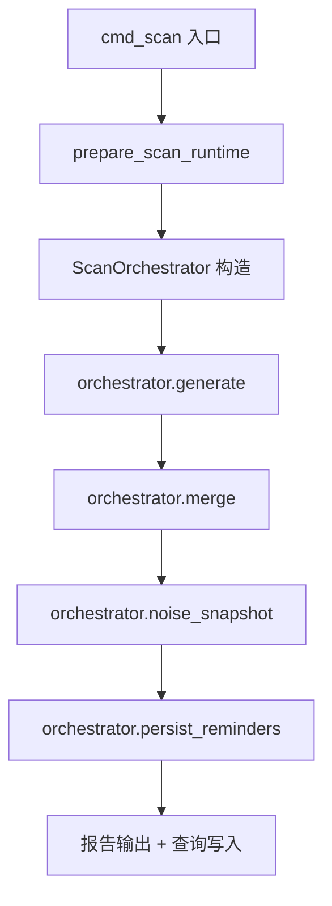
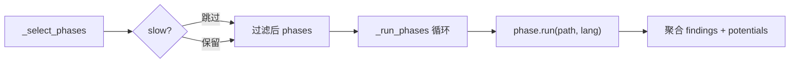
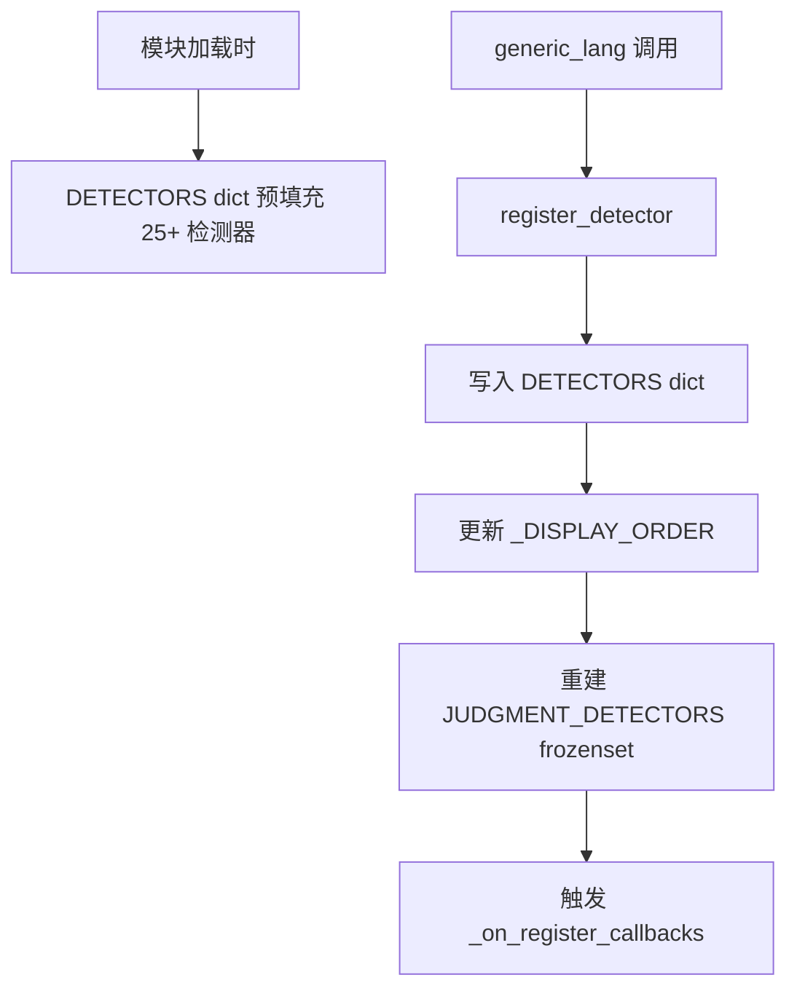
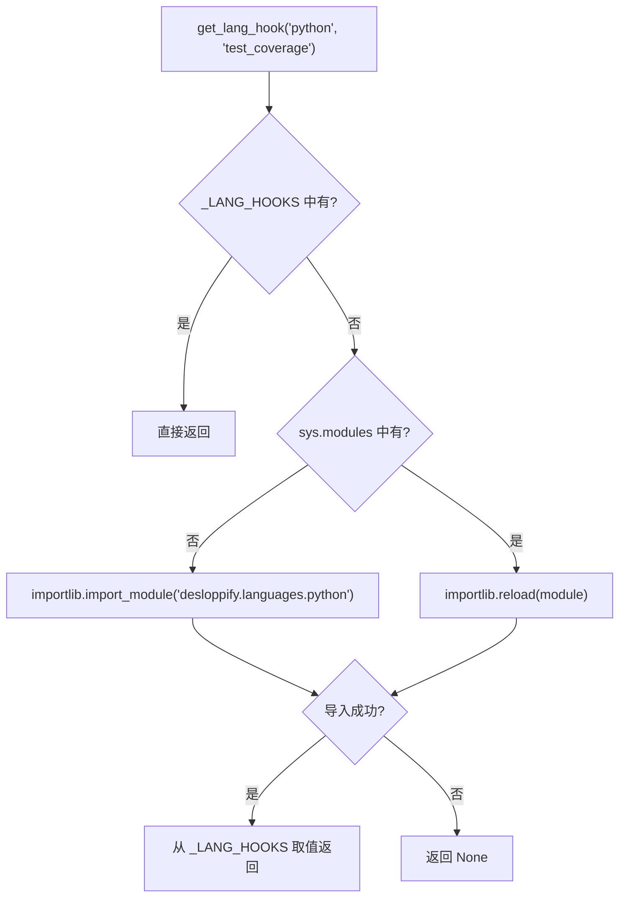

# PD-10.11 Desloppify — 三层管道编排与惰性钩子注册

> 文档编号：PD-10.11
> 来源：Desloppify `scan_orchestrator.py` `registry.py` `hook_registry.py`
> GitHub：https://github.com/peteromallet/desloppify.git
> 问题域：PD-10 中间件管道 Middleware Pipeline
> 状态：可复用方案

---

## 第 1 章 问题与动机

### 1.1 核心问题

代码质量扫描工具需要运行数十个检测器（detector），每个检测器有不同的执行条件（语言支持、外部工具依赖、快/慢模式）。核心挑战：

1. **管道编排**：如何将 generate → merge → noise_snapshot → persist_reminders 四阶段生命周期组织为可测试、可替换的管道？
2. **检测器注册**：25+ 个内置检测器 + 运行时动态注册的泛型插件检测器，如何维护单一注册表并支持回调通知？
3. **语言钩子惰性加载**：不同语言（Python/TypeScript/Go/C#/Dart/GDScript）各有专属钩子模块，如何避免启动时全量导入，实现按需加载？

这三个问题分别对应 Desloppify 的三层管道设计：
- **编排层**（ScanOrchestrator）：生命周期阶段的函数式组合
- **注册层**（DetectorRegistry）：检测器元数据的运行时注册 + 回调
- **钩子层**（hook_registry）：语言扩展点的惰性加载

### 1.2 Desloppify 的解法概述

1. **ScanOrchestrator 用 dataclass + 可替换函数字段**实现四阶段管道，每个阶段是一个独立的 Callable，默认绑定到 scan_workflow 模块的实现函数，测试时可注入 mock（`scan_orchestrator.py:25-44`）
2. **DetectorRegistry 用模块级 dict + frozen 集合**维护 25+ 检测器元数据，`register_detector()` 支持运行时注册并触发回调链（`registry.py:337-347`）
3. **hook_registry 用 defaultdict + importlib 惰性导入**实现语言钩子按需加载，首次 `get_lang_hook()` 时才导入对应语言包（`hook_registry.py:25-55`）
4. **DetectorPhase 是管道的最小执行单元**，每个 phase 封装 label + run 函数，由 `_run_phases()` 顺序执行并聚合结果（`scan.py:83-94`）
5. **generic_lang() 工厂函数**将外部工具规格转化为 DetectorPhase + DetectorMeta + ScoringPolicy 三件套，自动注册到全局注册表（`generic.py:124-285`）

### 1.3 设计思想

| 设计原则 | 具体实现 | 理由 | 替代方案 |
|----------|----------|------|----------|
| 函数式组合优于继承 | ScanOrchestrator 的四个阶段是 Callable 字段而非虚方法 | 测试时直接替换函数，无需子类化 | Template Method 模式（需要继承层次） |
| 单一注册表 | DETECTORS dict 是所有检测器元数据的唯一来源 | 消除多处维护列表的同步问题 | 每个模块维护自己的检测器列表 |
| 惰性加载 | hook_registry 首次访问时才 importlib.import_module | 避免启动时导入 6 种语言的全部依赖 | 启动时全量导入（慢且可能失败） |
| 回调通知 | register_detector 触发 _on_register_callbacks | 允许下游模块（如 narrative）响应新检测器注册 | 轮询检查注册表变化 |
| 阶段可跳过 | _select_phases 按 slow/profile 过滤 phase 列表 | CI 模式跳过慢阶段，objective 模式跳过主观评审 | 每个 phase 内部自行判断是否执行 |

---

## 第 2 章 源码实现分析

### 2.1 架构概览

Desloppify 的扫描管道分为三个层次，从外到内：

```
┌─────────────────────────────────────────────────────────┐
│  cmd_scan (scan.py)                                     │
│  ┌───────────────────────────────────────────────────┐  │
│  │  ScanOrchestrator (scan_orchestrator.py)           │  │
│  │  ┌──────────┐ ┌──────┐ ┌───────────┐ ┌─────────┐ │  │
│  │  │ generate  │→│merge │→│noise_snap │→│persist  │ │  │
│  │  │          │ │      │ │           │ │reminders│ │  │
│  │  └────┬─────┘ └──────┘ └───────────┘ └─────────┘ │  │
│  └───────┼───────────────────────────────────────────┘  │
│          ↓                                              │
│  ┌───────────────────────────────────────────────────┐  │
│  │  _run_phases (planning/scan.py)                    │  │
│  │  Phase[1] → Phase[2] → ... → Phase[N]             │  │
│  │  (DetectorPhase: label + run Callable)             │  │
│  └───────┬───────────────────────────────────────────┘  │
│          ↓                                              │
│  ┌───────────────────────────────────────────────────┐  │
│  │  DetectorRegistry (core/registry.py)               │  │
│  │  DETECTORS dict + register_detector() + callbacks  │  │
│  │                                                    │  │
│  │  hook_registry (hook_registry.py)                  │  │
│  │  _LANG_HOOKS defaultdict + lazy importlib          │  │
│  └───────────────────────────────────────────────────┘  │
└─────────────────────────────────────────────────────────┘
```

### 2.2 核心实现

#### 2.2.1 ScanOrchestrator — 函数式四阶段管道



对应源码 `desloppify/app/commands/scan/scan_orchestrator.py:24-73`：

```python
@dataclass
class ScanOrchestrator:
    """Compose scan lifecycle stages around a resolved ScanRuntime."""

    runtime: ScanRuntime
    run_scan_generation_fn: Callable[
        [ScanRuntime],
        tuple[list[dict[str, Any]], dict[str, object], dict[str, object] | None],
    ] = run_scan_generation
    merge_scan_results_fn: Callable[
        [ScanRuntime, list[dict[str, Any]], dict[str, object], dict[str, object] | None],
        ScanMergeResult,
    ] = merge_scan_results
    resolve_noise_snapshot_fn: Callable[
        [dict[str, Any], dict[str, object]],
        ScanNoiseSnapshot,
    ] = resolve_noise_snapshot
    persist_reminder_history_fn: Callable[
        [ScanRuntime, dict[str, object]],
        None,
    ] = persist_reminder_history

    def generate(self):
        return self.run_scan_generation_fn(self.runtime)

    def merge(self, findings, potentials, codebase_metrics):
        return self.merge_scan_results_fn(
            self.runtime, findings, potentials, codebase_metrics,
        )

    def noise_snapshot(self):
        return self.resolve_noise_snapshot_fn(self.runtime.state, self.runtime.config)

    def persist_reminders(self, narrative):
        self.persist_reminder_history_fn(self.runtime, narrative)
```

关键设计：每个阶段函数都有默认值（指向 scan_workflow 模块的实现），但可以在构造时替换。`cmd_scan` 在 `scan.py:120-126` 显式传入所有函数，使依赖关系透明。

#### 2.2.2 DetectorPhase 顺序执行管道



对应源码 `desloppify/engine/planning/scan.py:73-94`：

```python
def _select_phases(lang, *, include_slow, profile):
    active_profile = profile if profile in {"objective", "full", "ci"} else "full"
    phases = lang.phases
    if not include_slow or active_profile == "ci":
        phases = [phase for phase in phases if not phase.slow]
    if active_profile in {"objective", "ci"}:
        phases = [phase for phase in phases if not is_subjective_phase(phase)]
    return phases

def _run_phases(path, lang, phases):
    findings = []
    all_potentials = {}
    total = len(phases)
    for idx, phase in enumerate(phases, start=1):
        _stderr(f"  [{idx}/{total}] {phase.label}...")
        phase_findings, phase_potentials = phase.run(path, lang)
        all_potentials.update(phase_potentials)
        findings.extend(phase_findings)
    return findings, all_potentials
```

DetectorPhase 本身极简（`types.py:27-38`）：仅 `label: str` + `run: Callable` + `slow: bool`。

#### 2.2.3 DetectorRegistry — 运行时注册 + 回调



对应源码 `desloppify/core/registry.py:337-347`：

```python
_on_register_callbacks: list[Callable[[], None]] = []

def on_detector_registered(callback: Callable[[], None]) -> None:
    """Register a callback invoked after register_detector(). No-arg."""
    _on_register_callbacks.append(callback)

def register_detector(meta: DetectorMeta) -> None:
    """Register a detector at runtime (used by generic plugins)."""
    global JUDGMENT_DETECTORS
    DETECTORS[meta.name] = meta
    if meta.name not in _DISPLAY_ORDER:
        _DISPLAY_ORDER.append(meta.name)
    JUDGMENT_DETECTORS = frozenset(
        name for name, m in DETECTORS.items() if m.needs_judgment
    )
    for cb in _on_register_callbacks:
        cb()
```

DetectorMeta 是 frozen dataclass（`registry.py:46-56`），包含 name/display/dimension/action_type/guidance/fixers/tool/structural/needs_judgment 九个字段。

#### 2.2.4 hook_registry — 惰性加载语言钩子



对应源码 `desloppify/hook_registry.py:25-55`：

```python
def get_lang_hook(lang_name: str | None, hook_name: str) -> object | None:
    if not lang_name:
        return None
    hook = _LANG_HOOKS.get(lang_name, {}).get(hook_name)
    if hook is not None:
        return hook
    module_name = f"desloppify.languages.{lang_name}"
    module = sys.modules.get(module_name)
    if module is None:
        try:
            importlib.import_module(module_name)
        except (ImportError, ValueError, TypeError, RuntimeError, OSError):
            return None
    elif lang_name not in _LANG_HOOKS:
        try:
            importlib.reload(module)
        except (ImportError, ValueError, TypeError, RuntimeError, OSError):
            return None
    return _LANG_HOOKS.get(lang_name, {}).get(hook_name)
```

语言包的 `__init__.py` 在导入时调用 `register_lang_hooks()` 注册自己的钩子（如 `python/__init__.py:95`）。

### 2.3 实现细节

**augmenter 管道**：`run_scan_generation()` 在检测器管道执行后，串联两个 augmenter（`scan_workflow.py:325-365`）：
- `_augment_with_stale_exclusion_findings`：检查排除目录是否过时
- `_augment_with_stale_wontfix_findings`：检查 wontfix 债务是否恶化

这些 augmenter 是纯函数，接收 findings 列表返回增强后的列表，不修改原始数据。

**generic_lang 工厂**：`generic.py:124-285` 是泛型语言插件的一站式注册入口。它将一组工具规格（cmd/fmt/id/tier）转化为：
- DetectorMeta → 注册到 DETECTORS
- DetectorScoringPolicy → 注册到评分系统
- DetectorPhase → 加入 LangConfig.phases 列表
- FixerConfig → 加入 LangConfig.fixers 字典

**数据流**：findings 在管道中以 `list[dict[str, Any]]` 传递，每个 finding 是一个扁平字典。`_stamp_finding_context()` 在所有 phase 执行完后统一注入 lang/zone/confidence 字段（`scan.py:97-115`）。


---

## 第 3 章 迁移指南

### 3.1 迁移清单

**阶段 1：编排层（ScanOrchestrator 模式）**
- [ ] 定义管道的生命周期阶段（如 collect → analyze → merge → report）
- [ ] 为每个阶段创建独立函数，签名明确（输入类型 + 返回类型）
- [ ] 创建 Orchestrator dataclass，每个阶段作为 Callable 字段并设默认值
- [ ] 在入口函数中显式构造 Orchestrator，传入所有阶段函数

**阶段 2：注册层（DetectorRegistry 模式）**
- [ ] 定义组件元数据 dataclass（frozen=True），包含 name/display/category 等字段
- [ ] 创建模块级 dict 作为全局注册表
- [ ] 实现 `register_component()` 函数，支持运行时注册
- [ ] 添加回调机制（`on_registered()` + callback 列表）
- [ ] 提供 `display_order()` 等派生视图函数

**阶段 3：钩子层（hook_registry 模式）**
- [ ] 创建 defaultdict 存储钩子映射
- [ ] 实现 `get_hook()` 函数，首次访问时 importlib 惰性导入
- [ ] 在各扩展模块的 `__init__.py` 中调用 `register_hooks()` 注册
- [ ] 添加 `clear_for_tests()` 辅助函数

### 3.2 适配代码模板

#### 模板 1：函数式编排器

```python
from __future__ import annotations
from collections.abc import Callable
from dataclasses import dataclass
from typing import Any

@dataclass
class PipelineResult:
    """Pipeline stage output container."""
    items: list[dict[str, Any]]
    metadata: dict[str, Any]

@dataclass
class PipelineOrchestrator:
    """Compose pipeline stages as replaceable Callable fields."""
    context: Any
    collect_fn: Callable[[Any], list[dict[str, Any]]] = lambda ctx: []
    analyze_fn: Callable[[Any, list[dict[str, Any]]], PipelineResult] = (
        lambda ctx, items: PipelineResult(items=items, metadata={})
    )
    merge_fn: Callable[[Any, PipelineResult], dict[str, Any]] = (
        lambda ctx, result: {}
    )

    def collect(self) -> list[dict[str, Any]]:
        return self.collect_fn(self.context)

    def analyze(self, items: list[dict[str, Any]]) -> PipelineResult:
        return self.analyze_fn(self.context, items)

    def merge(self, result: PipelineResult) -> dict[str, Any]:
        return self.merge_fn(self.context, result)

    def run(self) -> dict[str, Any]:
        items = self.collect()
        result = self.analyze(items)
        return self.merge(result)
```

#### 模板 2：运行时注册表 + 回调

```python
from __future__ import annotations
from collections.abc import Callable
from dataclasses import dataclass

@dataclass(frozen=True)
class ComponentMeta:
    name: str
    display: str
    category: str
    priority: int = 0

_REGISTRY: dict[str, ComponentMeta] = {}
_DISPLAY_ORDER: list[str] = []
_ON_REGISTER: list[Callable[[], None]] = []

def on_registered(callback: Callable[[], None]) -> None:
    _ON_REGISTER.append(callback)

def register_component(meta: ComponentMeta) -> None:
    _REGISTRY[meta.name] = meta
    if meta.name not in _DISPLAY_ORDER:
        _DISPLAY_ORDER.append(meta.name)
    for cb in _ON_REGISTER:
        cb()

def get_component(name: str) -> ComponentMeta | None:
    return _REGISTRY.get(name)

def all_names() -> list[str]:
    return sorted(_REGISTRY.keys())
```

#### 模板 3：惰性钩子注册

```python
from __future__ import annotations
import importlib
import logging
import sys
from collections import defaultdict

_HOOKS: dict[str, dict[str, object]] = defaultdict(dict)
_logger = logging.getLogger(__name__)

def register_hooks(namespace: str, **hooks: object) -> None:
    for key, value in hooks.items():
        if value is not None:
            _HOOKS[namespace][key] = value

def get_hook(namespace: str | None, hook_name: str) -> object | None:
    if not namespace:
        return None
    hook = _HOOKS.get(namespace, {}).get(hook_name)
    if hook is not None:
        return hook
    module_name = f"myproject.plugins.{namespace}"
    if module_name not in sys.modules:
        try:
            importlib.import_module(module_name)
        except (ImportError, OSError) as exc:
            _logger.debug("Failed to import %s: %s", namespace, exc)
            return None
    return _HOOKS.get(namespace, {}).get(hook_name)

def clear_for_tests() -> None:
    _HOOKS.clear()
```

### 3.3 适用场景

| 场景 | 适用度 | 说明 |
|------|--------|------|
| 多阶段扫描/分析管道 | ⭐⭐⭐ | 直接复用 ScanOrchestrator 模式 |
| 插件式检测器系统 | ⭐⭐⭐ | DetectorRegistry 模式天然适合 |
| 多语言/多后端扩展 | ⭐⭐⭐ | hook_registry 惰性加载避免启动开销 |
| 简单线性管道 | ⭐⭐ | 阶段少于 3 个时 Orchestrator 过度设计 |
| 需要 DAG 编排 | ⭐ | 本方案仅支持线性顺序，不支持分支/并行 |

---

## 第 4 章 测试用例

```python
"""Tests for the three-layer pipeline pattern extracted from Desloppify."""
from __future__ import annotations
from collections.abc import Callable
from dataclasses import dataclass
from typing import Any
from collections import defaultdict
import importlib
import sys

# ── Orchestrator tests ──

@dataclass
class MockRuntime:
    data: list[str]

@dataclass
class MockOrchestrator:
    runtime: MockRuntime
    generate_fn: Callable = lambda rt: rt.data
    transform_fn: Callable = lambda rt, items: [x.upper() for x in items]

    def generate(self):
        return self.generate_fn(self.runtime)

    def transform(self, items):
        return self.transform_fn(self.runtime, items)


class TestOrchestrator:
    def test_default_functions_execute(self):
        orch = MockOrchestrator(runtime=MockRuntime(data=["a", "b"]))
        items = orch.generate()
        result = orch.transform(items)
        assert result == ["A", "B"]

    def test_injectable_functions(self):
        orch = MockOrchestrator(
            runtime=MockRuntime(data=["x"]),
            generate_fn=lambda rt: ["injected"],
            transform_fn=lambda rt, items: items * 2,
        )
        assert orch.transform(orch.generate()) == ["injected", "injected"]


# ── Registry tests ──

_REGISTRY: dict[str, dict] = {}
_CALLBACKS: list[Callable] = []

def _register(name: str, meta: dict):
    _REGISTRY[name] = meta
    for cb in _CALLBACKS:
        cb()

class TestRegistry:
    def setup_method(self):
        _REGISTRY.clear()
        _CALLBACKS.clear()

    def test_register_and_retrieve(self):
        _register("lint", {"display": "Linter", "tier": 1})
        assert "lint" in _REGISTRY
        assert _REGISTRY["lint"]["display"] == "Linter"

    def test_callback_fires_on_register(self):
        fired = []
        _CALLBACKS.append(lambda: fired.append(True))
        _register("sec", {"display": "Security"})
        assert len(fired) == 1

    def test_overwrite_existing(self):
        _register("lint", {"tier": 1})
        _register("lint", {"tier": 2})
        assert _REGISTRY["lint"]["tier"] == 2


# ── Hook registry tests ──

_HOOKS: dict[str, dict[str, object]] = defaultdict(dict)

def _register_hook(ns: str, **hooks):
    for k, v in hooks.items():
        if v is not None:
            _HOOKS[ns][k] = v

def _get_hook(ns: str | None, name: str) -> object | None:
    if not ns:
        return None
    return _HOOKS.get(ns, {}).get(name)

class TestHookRegistry:
    def setup_method(self):
        _HOOKS.clear()

    def test_register_and_get(self):
        sentinel = object()
        _register_hook("python", test_coverage=sentinel)
        assert _get_hook("python", "test_coverage") is sentinel

    def test_none_namespace_returns_none(self):
        assert _get_hook(None, "test_coverage") is None

    def test_missing_hook_returns_none(self):
        assert _get_hook("rust", "test_coverage") is None

    def test_none_value_not_registered(self):
        _register_hook("go", test_coverage=None)
        assert _get_hook("go", "test_coverage") is None
```


---

## 第 5 章 跨域关联

| 关联域 | 关系类型 | 说明 |
|--------|----------|------|
| PD-04 工具系统 | 依赖 | DetectorRegistry 是工具注册的基础设施，generic_lang() 将外部工具规格转化为检测器 + 评分策略 + 修复器三件套 |
| PD-07 质量检查 | 协同 | 管道的 DetectorPhase 是质量检查的执行单元，subjective_review 和 design_review 作为管道尾部 phase 运行 |
| PD-01 上下文管理 | 协同 | ScanRuntime dataclass 封装了扫描上下文（state/config/lang/profile），在管道各阶段间传递 |
| PD-03 容错与重试 | 协同 | hook_registry 的惰性加载捕获 5 种异常类型（ImportError/ValueError/TypeError/RuntimeError/OSError）实现优雅降级 |
| PD-11 可观测性 | 协同 | _run_phases 在每个 phase 执行前输出 `[idx/total] label...` 进度信息到 stderr |

---

## 第 6 章 来源文件索引

| 文件 | 行范围 | 关键实现 |
|------|--------|----------|
| `desloppify/app/commands/scan/scan_orchestrator.py` | L24-L75 | ScanOrchestrator dataclass，四阶段函数式管道 |
| `desloppify/core/registry.py` | L46-L56 | DetectorMeta frozen dataclass，9 字段检测器元数据 |
| `desloppify/core/registry.py` | L59-L321 | DETECTORS 全局注册表，25+ 内置检测器定义 |
| `desloppify/core/registry.py` | L329-L347 | register_detector() + on_detector_registered() 回调机制 |
| `desloppify/hook_registry.py` | L10-L55 | _LANG_HOOKS defaultdict + get_lang_hook() 惰性加载 |
| `desloppify/languages/_framework/base/types.py` | L27-L38 | DetectorPhase dataclass（label + run + slow） |
| `desloppify/engine/planning/scan.py` | L73-L94 | _select_phases() 条件过滤 + _run_phases() 顺序执行 |
| `desloppify/app/commands/scan/scan_workflow.py` | L325-L365 | run_scan_generation() + augmenter 串联 |
| `desloppify/languages/_framework/generic.py` | L124-L285 | generic_lang() 工厂：工具规格 → 检测器 + phase + 评分策略 |
| `desloppify/app/commands/scan/scan.py` | L108-L201 | cmd_scan() 入口，构造 Orchestrator 并驱动完整生命周期 |
| `desloppify/languages/python/__init__.py` | L95 | register_lang_hooks() 调用示例 |
| `desloppify/languages/python/__init__.py` | L176-L189 | PythonConfig.phases 列表：12 个 DetectorPhase 定义 |

---

## 第 7 章 横向对比维度

```json comparison_data
{
  "project": "Desloppify",
  "dimensions": {
    "中间件基类": "DetectorPhase dataclass（label + run Callable + slow bool），无继承层次",
    "钩子点": "四阶段生命周期（generate/merge/noise_snapshot/persist）+ augmenter 串联",
    "中间件数量": "25+ 内置检测器 + 泛型插件动态注册，Python 语言 12 个 phase",
    "条件激活": "_select_phases 按 slow/profile 双维度过滤，CI 模式跳过慢阶段和主观评审",
    "状态管理": "ScanRuntime dataclass 封装全部上下文，findings 以 list[dict] 在阶段间传递",
    "执行模型": "严格顺序执行，_run_phases 逐个调用 phase.run 并聚合结果",
    "懒初始化策略": "hook_registry 首次 get_lang_hook 时 importlib 惰性导入语言包",
    "错误隔离": "hook_registry 捕获 5 种异常返回 None，augmenter 为纯函数不修改原数据",
    "数据传递": "findings 为 list[dict] 扁平结构，_stamp_finding_context 统一后置注入 lang/zone",
    "副作用注册模式": "语言包 __init__.py 导入时执行 register_lang_hooks 副作用注册钩子",
    "可观测性": "_run_phases 每阶段输出 [idx/total] label 进度到 stderr"
  }
}
```

### 域元数据补充

```json domain_metadata
{
  "solution_summary": "Desloppify 用 dataclass Callable 字段实现四阶段函数式编排器，DetectorRegistry 全局 dict + 回调链支持 25+ 检测器运行时注册，hook_registry 通过 importlib 惰性加载 6 种语言钩子",
  "description": "函数式阶段组合与运行时注册表的轻量管道模式",
  "sub_problems": [
    "augmenter 串联：检测器管道执行后如何串联多个纯函数增强器扩展 findings",
    "泛型插件工厂：如何将外部工具规格一站式转化为检测器+评分策略+修复器三件套",
    "profile 驱动阶段裁剪：objective/full/ci 三种扫描模式如何复用同一 phase 列表"
  ],
  "best_practices": [
    "Orchestrator 用 Callable 字段而非虚方法：测试时直接替换函数，无需子类化",
    "检测器元数据用 frozen dataclass：不可变保证注册后不被意外修改",
    "语言钩子惰性加载捕获宽异常谱：ImportError 到 OSError 五种异常确保任何导入失败都优雅降级"
  ]
}
```

