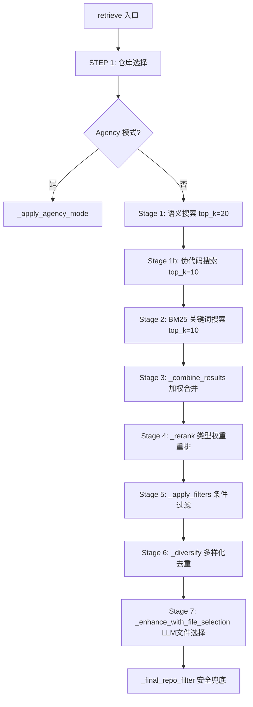
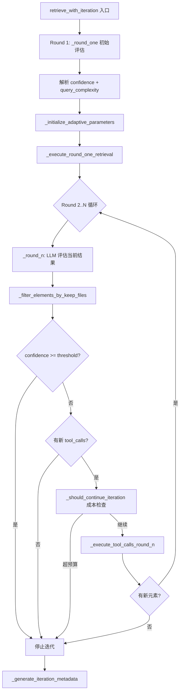
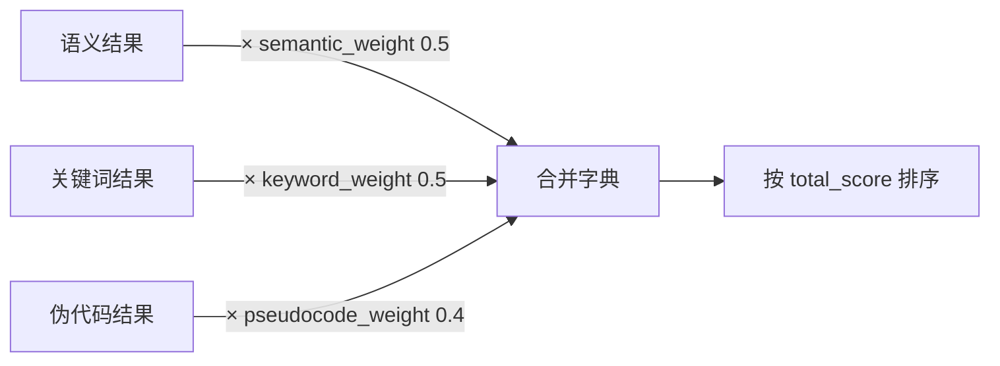

# PD-10.04 FastCode — 多阶段检索管道与置信度迭代控制

> 文档编号：PD-10.04
> 来源：FastCode `fastcode/retriever.py`, `fastcode/iterative_agent.py`, `fastcode/query_processor.py`
> GitHub：https://github.com/HKUDS/FastCode.git
> 问题域：PD-10 中间件管道 Middleware Pipeline
> 状态：可复用方案

---

## 第 1 章 问题与动机

### 1.1 核心问题

代码检索系统面临一个根本矛盾：**单次检索无法同时满足精度和召回率**。语义搜索擅长理解意图但可能遗漏关键词匹配；BM25 擅长精确匹配但缺乏语义理解；图搜索能发现关联代码但噪声大。更关键的是，对于复杂查询，一轮检索的结果往往不够充分——系统无法预知需要多少轮搜索才能收集到足够的上下文。

FastCode 的核心挑战是：如何将多种检索策略组织成一条可配置、可迭代、有成本控制的处理管道，使每个阶段独立可调，同时整体管道能自适应地决定何时停止。

### 1.2 FastCode 的解法概述

FastCode 实现了一条 **10+ 阶段的检索管道**，核心特征：

1. **双模管道**：标准模式（固定 7 阶段串行）和 Agency 模式（置信度驱动的迭代管道），通过 `enable_agency_mode` 配置切换（`fastcode/retriever.py:56`）
2. **配置驱动权重**：每个检索阶段的权重通过 `config.yaml` 独立配置（semantic_weight=0.5, keyword_weight=0.5, graph_weight=1），运行时可调（`config/config.yaml:100-103`）
3. **自适应迭代控制**：Agency 模式下，LLM 评估每轮检索的置信度（0-100），动态决定是否继续迭代，最多 4 轮（`fastcode/iterative_agent.py:109-152`）
4. **成本预算机制**：通过 `max_total_lines`（12000 行）和 `budget_usage_pct` 追踪资源消耗，防止过度检索（`fastcode/iterative_agent.py:53`）
5. **多层安全过滤**：每个阶段都有 `repo_filter` 检查，最终通过 `_final_repo_filter` 兜底，防止跨仓库数据泄漏（`fastcode/retriever.py:1045-1082`）

### 1.3 设计思想

| 设计原则 | 具体实现 | 理由 | 替代方案 |
|----------|----------|------|----------|
| 管道双模切换 | `enable_agency_mode` 配置项控制标准/迭代两条路径 | 简单查询不需要多轮迭代，避免浪费 LLM 调用 | 统一用迭代模式（成本高） |
| 配置驱动权重 | YAML 配置 semantic/keyword/graph 三路权重 | 不同场景需要不同权重，无需改代码 | 硬编码权重（不灵活） |
| 置信度驱动停止 | LLM 每轮输出 confidence 分数，达到阈值即停 | 避免固定轮数导致的过度/不足检索 | 固定轮数（浪费或不足） |
| 自适应参数 | 根据 query_complexity 动态调整 max_iterations/threshold/budget | 简单查询 2 轮即可，复杂查询需要 5-6 轮 | 统一参数（一刀切） |
| 多层安全过滤 | 每个检索阶段 + 最终兜底都检查 repo_filter | 多仓库场景下防止数据泄漏 | 只在入口过滤（不安全） |

---

## 第 2 章 源码实现分析

### 2.1 架构概览

FastCode 的检索管道分为两条路径，由 `HybridRetriever.retrieve()` 方法统一调度：

```
┌─────────────────────────────────────────────────────────────────┐
│                    FastCode.query() 入口                         │
│                  fastcode/main.py:267                            │
└──────────────────────┬──────────────────────────────────────────┘
                       │
          ┌────────────▼────────────┐
          │  QueryProcessor.process()│  ← 标准模式才执行
          │  query_processor.py:129  │  ← Agency 模式跳过
          └────────────┬────────────┘
                       │
          ┌────────────▼────────────┐
          │ HybridRetriever.retrieve│
          │   retriever.py:184      │
          └────────────┬────────────┘
                       │
        ┌──────────────┼──────────────┐
        │              │              │
   STEP 1         STEP 2         STEP 3
  仓库选择       模式分发       标准检索
  (共用)      ┌────┴────┐     (7阶段)
              │         │
         Agency      Standard
         模式          模式
    ┌────┴────┐   ┌────┴────────────────────┐
    │Iterative│   │ Semantic → Keyword →     │
    │ Agent   │   │ Combine → Rerank →       │
    │ 2-6轮   │   │ Filter → Diversify →     │
    │ 置信度  │   │ FileSelection            │
    └─────────┘   └──────────────────────────┘
```

### 2.2 核心实现：标准模式 7 阶段管道



对应源码 `fastcode/retriever.py:330-388`：
```python
# Stage 1: Semantic search (use enhanced query text)
semantic_results = self._semantic_search(search_text4semantic, top_k=20, repo_filter=repo_filter)

# Stage 1b: Pseudocode-based search (if available)
pseudocode_results = []
if pseudocode:
    pseudocode_results = self._semantic_search(pseudocode, top_k=10, repo_filter=repo_filter)

# Stage 2: Keyword search (use enhanced keywords if available)
keyword_query = " ".join(keywords) if keywords else query_str
keyword_results = self._keyword_search(keyword_query, top_k=10, repo_filter=repo_filter)

# Stage 3: Combine and score (include pseudocode results)
combined_results = self._combine_results(
    semantic_results, keyword_results, pseudocode_results
)

# Stage 5: Re-rank
final_results = self._rerank(query_str, combined_results)

# Stage 6: Apply filters
if filters:
    final_results = self._apply_filters(final_results, filters)

# Stage 7: Diversification
final_results = self._diversify(final_results)
```

### 2.3 核心实现：Agency 模式迭代管道



对应源码 `fastcode/iterative_agent.py:154-343`：
```python
def retrieve_with_iteration(self, query, processed_query, query_info,
                            repo_filter=None, dialogue_history=None):
    # Round 1: Initial assessment
    round1_result = self._round_one(query, processed_query, query_info, 
                                     repo_filter, dialogue_history)
    
    # Initialize adaptive parameters based on query complexity
    query_complexity = round1_result.get("query_complexity", 50)
    self._initialize_adaptive_parameters(query_complexity)
    
    # Iterative rounds (2 to n)
    while current_round <= self.max_iterations:
        round_result = self._round_n(query, current_elements, query_info, 
                                      current_round, dialogue_history)
        
        # Filter elements based on keep_files
        if round_result.get("keep_files"):
            filtered_elements = self._filter_elements_by_keep_files(
                current_elements, round_result["keep_files"]
            )
        
        # Check stopping conditions
        if confidence >= self.confidence_threshold:
            break
        if not round_result.get("tool_calls"):
            break
        
        should_continue = self._should_continue_iteration(
            current_round, confidence, current_elements, 
            round1_result.get("query_complexity", 50)
        )
        if not should_continue:
            break
        
        # Execute tool calls for next round
        new_elements = self._execute_tool_calls_round_n(
            query, round_result["tool_calls"], repo_filter, current_elements
        )
```

### 2.4 自适应参数机制

`_initialize_adaptive_parameters` 根据查询复杂度动态调整三个关键参数（`fastcode/iterative_agent.py:109-152`）：

| 查询复杂度 | max_iterations | confidence_threshold | line_budget |
|-----------|---------------|---------------------|-------------|
| ≤30（简单） | 2-3 | 95（高标准） | 6000 行（60%） |
| 31-60（中等） | 3-4 | 92（略放宽） | 8000 行（80%） |
| ≥80（复杂） | 4-6 | 90（更宽容） | 12000-20000 行 |

### 2.5 加权合并策略

`_combine_results` 方法将三路搜索结果按配置权重合并（`fastcode/retriever.py:837-907`）：



BM25 分数先归一化到 0-1 范围再乘以权重，确保不同量纲的分数可比。同一元素出现在多路结果中时，分数累加而非取最大值。

### 2.6 多样化去重

`_diversify` 方法通过文件级惩罚避免结果过于集中（`fastcode/retriever.py:1016-1043`）：同一文件的第二个及后续结果，其所有分数乘以 `(1 - diversity_penalty)` 即 0.9 的衰减因子。


---

## 第 3 章 迁移指南

### 3.1 迁移清单

**阶段 1：基础管道框架（1-2 天）**
- [ ] 定义 `PipelineStage` 协议/接口，统一阶段签名
- [ ] 实现 `PipelineOrchestrator`，支持阶段注册和串行执行
- [ ] 实现配置加载（YAML），支持权重和参数热配置

**阶段 2：检索阶段实现（2-3 天）**
- [ ] 实现语义搜索阶段（向量相似度）
- [ ] 实现关键词搜索阶段（BM25）
- [ ] 实现结果合并阶段（加权融合）
- [ ] 实现重排序阶段（类型权重）
- [ ] 实现多样化去重阶段（文件级惩罚）

**阶段 3：迭代控制（2-3 天）**
- [ ] 实现置信度评估（LLM 打分）
- [ ] 实现自适应参数调整（基于查询复杂度）
- [ ] 实现成本预算追踪（行数预算）
- [ ] 实现停止条件判断（多条件 OR）

**阶段 4：安全与可观测（1 天）**
- [ ] 实现多层过滤（每阶段 + 最终兜底）
- [ ] 实现迭代元数据记录（ROI、效率评级）

### 3.2 适配代码模板

以下是一个可直接复用的管道框架，提取了 FastCode 的核心模式：

```python
"""
多阶段检索管道框架 — 从 FastCode 提取的可复用模板
"""
from dataclasses import dataclass, field
from typing import Any, Dict, List, Optional, Protocol, Tuple
import yaml


# ── 1. 管道阶段协议 ──────────────────────────────────────────

class PipelineStage(Protocol):
    """每个管道阶段必须实现的接口"""
    name: str
    weight: float
    enabled: bool
    
    def execute(self, context: "PipelineContext") -> "PipelineContext":
        """执行阶段逻辑，返回更新后的上下文"""
        ...


@dataclass
class PipelineContext:
    """管道上下文 — 在阶段间传递的状态"""
    query: str
    results: List[Dict[str, Any]] = field(default_factory=list)
    scores: Dict[str, Dict[str, float]] = field(default_factory=dict)
    metadata: Dict[str, Any] = field(default_factory=dict)
    filters: Dict[str, Any] = field(default_factory=dict)
    confidence: float = 0.0
    iteration_round: int = 0
    total_lines: int = 0
    budget_limit: int = 12000


# ── 2. 管道编排器 ────────────────────────────────────────────

class PipelineOrchestrator:
    """
    管道编排器 — 管理阶段注册、执行顺序和迭代控制
    
    复用 FastCode 的双模设计：
    - 标准模式：所有阶段串行执行一次
    - 迭代模式：置信度驱动的多轮执行
    """
    
    def __init__(self, config_path: str):
        with open(config_path) as f:
            self.config = yaml.safe_load(f)
        
        self.stages: List[PipelineStage] = []
        self.iteration_config = self.config.get("iteration", {})
        self.max_iterations = self.iteration_config.get("max_iterations", 4)
        self.confidence_threshold = self.iteration_config.get("confidence_threshold", 95)
    
    def register(self, stage: PipelineStage) -> "PipelineOrchestrator":
        """注册管道阶段（链式调用）"""
        self.stages.append(stage)
        return self
    
    def execute(self, query: str, mode: str = "standard") -> PipelineContext:
        """执行管道"""
        ctx = PipelineContext(query=query)
        
        if mode == "iterative":
            return self._execute_iterative(ctx)
        return self._execute_standard(ctx)
    
    def _execute_standard(self, ctx: PipelineContext) -> PipelineContext:
        """标准模式：所有启用的阶段串行执行一次"""
        for stage in self.stages:
            if stage.enabled:
                ctx = stage.execute(ctx)
        return ctx
    
    def _execute_iterative(self, ctx: PipelineContext) -> PipelineContext:
        """
        迭代模式：置信度驱动的多轮执行
        复用 FastCode 的 retrieve_with_iteration 模式
        """
        for round_num in range(1, self.max_iterations + 1):
            ctx.iteration_round = round_num
            
            # 执行所有启用的阶段
            for stage in self.stages:
                if stage.enabled:
                    ctx = stage.execute(ctx)
            
            # 检查停止条件（复用 FastCode 的多条件 OR 逻辑）
            if ctx.confidence >= self.confidence_threshold:
                break
            if ctx.total_lines >= ctx.budget_limit:
                break
        
        return ctx


# ── 3. 具体阶段实现示例 ──────────────────────────────────────

@dataclass
class WeightedSearchStage:
    """加权搜索阶段 — 复用 FastCode 的 _combine_results 模式"""
    name: str = "weighted_search"
    weight: float = 0.5
    enabled: bool = True
    
    def execute(self, ctx: PipelineContext) -> PipelineContext:
        # 每个搜索结果乘以配置权重后累加
        for result_id, scores in ctx.scores.items():
            scores[self.name] = scores.get("raw", 0) * self.weight
            scores["total"] = sum(
                v for k, v in scores.items() if k != "raw"
            )
        return ctx


@dataclass
class DiversityStage:
    """多样化去重 — 复用 FastCode 的 _diversify 模式"""
    name: str = "diversity"
    weight: float = 1.0
    enabled: bool = True
    penalty: float = 0.1
    
    def execute(self, ctx: PipelineContext) -> PipelineContext:
        seen_groups: set = set()
        for result in ctx.results:
            group_key = result.get("file_path", "")
            if group_key in seen_groups:
                # 同组后续结果施加惩罚
                for score_key in ctx.scores.get(result["id"], {}):
                    ctx.scores[result["id"]][score_key] *= (1 - self.penalty)
            else:
                seen_groups.add(group_key)
        return ctx
```

### 3.3 适用场景

| 场景 | 适用度 | 说明 |
|------|--------|------|
| 代码检索系统（RAG） | ⭐⭐⭐ | FastCode 的核心场景，直接复用 |
| 多源信息检索 | ⭐⭐⭐ | 加权合并 + 多样化去重模式通用 |
| Agent 工具调用编排 | ⭐⭐ | 迭代控制 + 置信度停止可复用 |
| 简单 CRUD 管道 | ⭐ | 过度设计，不需要迭代控制 |
| 实时流处理 | ⭐ | FastCode 是批处理模式，不适合流式 |

---

## 第 4 章 测试用例

```python
"""
FastCode 多阶段检索管道测试 — 基于真实函数签名
"""
import pytest
from unittest.mock import MagicMock, patch
from dataclasses import dataclass
from typing import List, Dict, Any, Optional


# ── 模拟 FastCode 核心数据结构 ──────────────────────────────

@dataclass
class MockCodeElement:
    id: str
    name: str
    type: str
    repo_name: str
    relative_path: str
    file_path: str
    start_line: int = 0
    end_line: int = 100
    code: str = ""
    language: str = "python"
    docstring: str = ""
    signature: str = ""
    summary: str = ""
    metadata: dict = None
    
    def __post_init__(self):
        if self.metadata is None:
            self.metadata = {}
    
    def to_dict(self):
        return {
            "id": self.id, "name": self.name, "type": self.type,
            "repo_name": self.repo_name, "relative_path": self.relative_path,
            "file_path": self.file_path, "start_line": self.start_line,
            "end_line": self.end_line, "code": self.code,
            "language": self.language,
        }


# ── 测试加权合并 _combine_results ────────────────────────────

class TestCombineResults:
    """测试 retriever.py:837 的 _combine_results 方法"""
    
    def _make_retriever(self, semantic_w=0.5, keyword_w=0.5):
        retriever = MagicMock()
        retriever.semantic_weight = semantic_w
        retriever.keyword_weight = keyword_w
        return retriever
    
    def test_semantic_only(self):
        """语义结果独占时，分数 = raw_score × semantic_weight"""
        semantic = [
            ({"id": "a", "name": "func_a"}, 0.9),
            ({"id": "b", "name": "func_b"}, 0.7),
        ]
        # 模拟 _combine_results 逻辑
        combined = {}
        for meta, score in semantic:
            combined[meta["id"]] = {
                "element": meta,
                "semantic_score": score * 0.5,
                "keyword_score": 0.0,
                "total_score": score * 0.5,
            }
        assert combined["a"]["total_score"] == pytest.approx(0.45)
        assert combined["b"]["total_score"] == pytest.approx(0.35)
    
    def test_overlap_accumulates(self):
        """同一元素出现在语义和关键词结果中，分数累加"""
        semantic = [({"id": "x"}, 0.8)]
        keyword = [({"id": "x"}, 10.0)]  # BM25 原始分数
        
        combined = {}
        # 语义
        for meta, score in semantic:
            combined[meta["id"]] = {
                "semantic_score": score * 0.5,
                "keyword_score": 0.0,
                "total_score": score * 0.5,
            }
        # 关键词（归一化后）
        max_bm25 = 10.0
        for meta, score in keyword:
            normalized = (score / max_bm25) * 0.5
            if meta["id"] in combined:
                combined[meta["id"]]["keyword_score"] = normalized
                combined[meta["id"]]["total_score"] += normalized
        
        assert combined["x"]["total_score"] == pytest.approx(0.9)  # 0.4 + 0.5


# ── 测试多样化去重 _diversify ────────────────────────────────

class TestDiversify:
    """测试 retriever.py:1016 的 _diversify 方法"""
    
    def test_same_file_penalized(self):
        """同一文件的第二个结果被惩罚"""
        results = [
            {"element": {"file_path": "a.py"}, "total_score": 1.0,
             "semantic_score": 1.0, "keyword_score": 0.0,
             "pseudocode_score": 0.0, "graph_score": 0.0},
            {"element": {"file_path": "a.py"}, "total_score": 0.8,
             "semantic_score": 0.8, "keyword_score": 0.0,
             "pseudocode_score": 0.0, "graph_score": 0.0},
        ]
        penalty = 0.1
        seen = set()
        for r in results:
            fp = r["element"]["file_path"]
            if fp in seen:
                r["total_score"] *= (1 - penalty)
            else:
                seen.add(fp)
        
        assert results[0]["total_score"] == 1.0  # 首次不惩罚
        assert results[1]["total_score"] == pytest.approx(0.72)  # 0.8 × 0.9
    
    def test_different_files_no_penalty(self):
        """不同文件不受惩罚"""
        results = [
            {"element": {"file_path": "a.py"}, "total_score": 1.0,
             "semantic_score": 1.0, "keyword_score": 0.0,
             "pseudocode_score": 0.0, "graph_score": 0.0},
            {"element": {"file_path": "b.py"}, "total_score": 0.8,
             "semantic_score": 0.8, "keyword_score": 0.0,
             "pseudocode_score": 0.0, "graph_score": 0.0},
        ]
        penalty = 0.1
        seen = set()
        for r in results:
            fp = r["element"]["file_path"]
            if fp in seen:
                r["total_score"] *= (1 - penalty)
            else:
                seen.add(fp)
        
        assert results[1]["total_score"] == 0.8  # 无惩罚


# ── 测试自适应参数 ───────────────────────────────────────────

class TestAdaptiveParameters:
    """测试 iterative_agent.py:109 的 _initialize_adaptive_parameters"""
    
    def test_simple_query_low_budget(self):
        """简单查询（complexity ≤ 30）应使用较小预算"""
        max_total_lines = 12000
        complexity = 20
        budget = int(max_total_lines * 0.6)
        assert budget == 7200
    
    def test_complex_query_high_budget(self):
        """复杂查询（complexity ≥ 80）应使用完整预算"""
        max_total_lines = 12000
        complexity = 85
        repo_factor = 1.5  # 大仓库
        budget = int(max_total_lines * 1.0 * repo_factor)
        assert budget == 18000
    
    def test_confidence_threshold_scales(self):
        """复杂查询的置信度阈值应降低"""
        base_threshold = 95
        # complexity >= 80
        threshold_complex = max(90, base_threshold - 5)
        assert threshold_complex == 90
        # complexity >= 60
        threshold_medium = max(92, base_threshold - 3)
        assert threshold_medium == 92
        # complexity < 60
        threshold_simple = base_threshold
        assert threshold_simple == 95


# ── 测试最终安全过滤 ─────────────────────────────────────────

class TestFinalRepoFilter:
    """测试 retriever.py:1045 的 _final_repo_filter"""
    
    def test_filters_unexpected_repos(self):
        """应过滤掉不在 repo_filter 中的结果"""
        results = [
            {"element": {"repo_name": "allowed", "name": "f1"}, "total_score": 1.0},
            {"element": {"repo_name": "leaked", "name": "f2"}, "total_score": 0.9},
            {"element": {"repo_name": "allowed", "name": "f3"}, "total_score": 0.8},
        ]
        repo_filter = ["allowed"]
        filtered = [r for r in results if r["element"]["repo_name"] in repo_filter]
        
        assert len(filtered) == 2
        assert all(r["element"]["repo_name"] == "allowed" for r in filtered)
    
    def test_empty_filter_returns_all(self):
        """空 repo_filter 应返回所有结果"""
        results = [
            {"element": {"repo_name": "a"}, "total_score": 1.0},
            {"element": {"repo_name": "b"}, "total_score": 0.9},
        ]
        repo_filter = None
        if not repo_filter:
            filtered = results
        else:
            filtered = [r for r in results if r["element"]["repo_name"] in repo_filter]
        
        assert len(filtered) == 2
```


---

## 第 5 章 跨域关联

| 关联域 | 关系类型 | 说明 |
|--------|----------|------|
| PD-01 上下文管理 | 依赖 | `AnswerGenerator` 的 `max_context_tokens=200000` 和 `_truncate_context` 方法直接处理上下文窗口管理，迭代管道的 `max_total_lines` 预算也是上下文管理的一种形式 |
| PD-04 工具系统 | 协同 | Agency 模式的 `AgentTools`（`agent_tools.py`）提供 5 个只读工具（list_directory/search_codebase/get_file_info/get_file_structure_summary/read_file_content），是迭代管道的执行手段 |
| PD-08 搜索与检索 | 依赖 | 管道的核心阶段（语义搜索、BM25、图扩展）本质上是 PD-08 的具体实现，管道框架是对搜索策略的编排层 |
| PD-11 可观测性 | 协同 | `_generate_iteration_metadata` 输出详细的效率指标（ROI、budget_used_pct、efficiency_rating），是管道可观测性的内建支持 |
| PD-03 容错与重试 | 协同 | 迭代管道的 `_smart_prune_elements` 回退机制和 `last_round_unfiltered_elements` 兜底逻辑，是管道级别的容错设计 |
| PD-06 记忆持久化 | 协同 | `CacheManager` 的 `save_dialogue_turn` 和 `get_recent_summaries` 为多轮对话提供记忆支持，迭代管道利用 `dialogue_history` 实现跨轮上下文传递 |

---

## 第 6 章 来源文件索引

| 文件 | 行范围 | 关键实现 |
|------|--------|----------|
| `fastcode/retriever.py` | L23-L96 | `HybridRetriever.__init__` — 管道初始化，权重配置，双索引体系 |
| `fastcode/retriever.py` | L184-L390 | `HybridRetriever.retrieve` — 管道主入口，三步调度（仓库选择→模式分发→标准检索） |
| `fastcode/retriever.py` | L330-L388 | 标准模式 7 阶段串行管道（语义→关键词→合并→重排→过滤→多样化→文件选择） |
| `fastcode/retriever.py` | L837-L907 | `_combine_results` — 三路加权合并，BM25 归一化 |
| `fastcode/retriever.py` | L964-L987 | `_rerank` — 元素类型权重重排序 |
| `fastcode/retriever.py` | L1016-L1043 | `_diversify` — 文件级惩罚多样化 |
| `fastcode/retriever.py` | L1045-L1082 | `_final_repo_filter` — 最终安全过滤兜底 |
| `fastcode/iterative_agent.py` | L20-L84 | `IterativeAgent.__init__` — 迭代代理初始化，自适应参数基线 |
| `fastcode/iterative_agent.py` | L109-L152 | `_initialize_adaptive_parameters` — 根据查询复杂度动态调整迭代参数 |
| `fastcode/iterative_agent.py` | L154-L343 | `retrieve_with_iteration` — 迭代管道主循环，置信度驱动停止 |
| `fastcode/iterative_agent.py` | L345-L420 | `_generate_iteration_metadata` — 效率分析和元数据生成 |
| `fastcode/query_processor.py` | L17-L43 | `ProcessedQuery` 数据类 — 管道间传递的查询上下文 |
| `fastcode/query_processor.py` | L129-L233 | `QueryProcessor.process` — 查询预处理管道（意图→关键词→过滤→扩展→分解→LLM增强） |
| `fastcode/main.py` | L267-L431 | `FastCode.query` — 顶层编排入口，决定标准/迭代模式 |
| `fastcode/main.py` | L328-L372 | 模式分发逻辑：迭代模式跳过 QueryProcessor，标准模式走完整流程 |
| `config/config.yaml` | L98-L119 | 检索配置：权重、阈值、Agency 模式开关 |
| `config/config.yaml` | L169-L180 | 迭代代理配置：max_iterations、confidence_threshold、line_budget |
| `fastcode/answer_generator.py` | L71-L194 | `AnswerGenerator.generate` — 答案生成管道（上下文准备→截断→prompt构建→LLM调用→解析） |

---

## 第 7 章 横向对比维度

```json comparison_data
{
  "project": "FastCode",
  "dimensions": {
    "中间件基类": "无显式基类，各阶段为 HybridRetriever 的私有方法",
    "钩子点": "7 个串行阶段 + Agency 模式分支，通过 config 开关控制",
    "中间件数量": "标准模式 7 阶段 + Agency 模式 4 轮迭代",
    "条件激活": "enable_agency_mode 配置切换双模，pseudocode 阶段按需激活",
    "状态管理": "PipelineContext 隐式传递（方法参数），迭代模式用 iteration_history 列表",
    "执行模型": "标准模式同步串行，Agency 模式 LLM 驱动的迭代循环",
    "同步热路径": "全同步执行，无异步阶段",
    "错误隔离": "每阶段 try-except 独立捕获，Agency 模式有 fallback 到标准模式",
    "置信度驱动停止": "LLM 每轮评估 confidence(0-100)，达阈值即停",
    "自适应参数": "根据 query_complexity 动态调整 iterations/threshold/budget 三参数",
    "加权合并策略": "三路搜索结果按 YAML 配置权重累加，BM25 先归一化",
    "成本预算控制": "max_total_lines 行数预算 + budget_usage_pct 追踪"
  }
}
```

### 域元数据补充

```json domain_metadata
{
  "solution_summary": "FastCode 用 7 阶段串行管道 + LLM 置信度驱动的迭代模式实现双模检索管道，通过 YAML 配置权重和自适应参数控制每阶段行为",
  "description": "检索管道中的置信度迭代控制与成本预算约束",
  "sub_problems": [
    "置信度驱动停止：LLM 评估每轮检索充分度，动态决定是否继续迭代",
    "自适应参数调整：根据查询复杂度和仓库规模动态调整迭代轮数、置信度阈值和行数预算",
    "加权合并归一化：不同量纲的搜索分数（向量相似度 vs BM25）如何归一化后加权融合",
    "双模管道切换：同一入口根据配置分发到标准串行管道或迭代管道的路由设计",
    "迭代效率评估：ROI（置信度增益/行数增量）和效率评级的量化指标体系"
  ],
  "best_practices": [
    "多层安全过滤兜底：每个检索阶段都检查 repo_filter，最终用 _final_repo_filter 兜底防止数据泄漏",
    "BM25 分数归一化后再加权：不同搜索引擎的分数量纲不同，必须先归一化到 0-1 再乘以权重",
    "迭代模式跳过查询预处理：Agency 模式下 IterativeAgent 自行处理查询增强，避免 QueryProcessor 的冗余 LLM 调用",
    "文件级多样化惩罚：同一文件的后续结果施加衰减因子，避免结果过度集中在单个文件"
  ]
}
```

