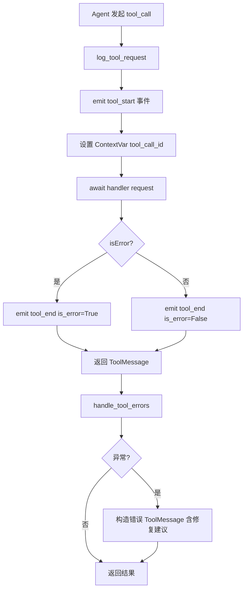
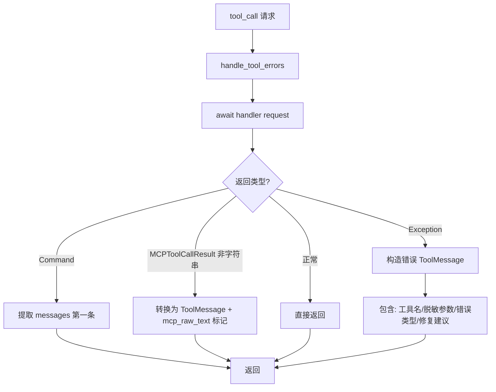
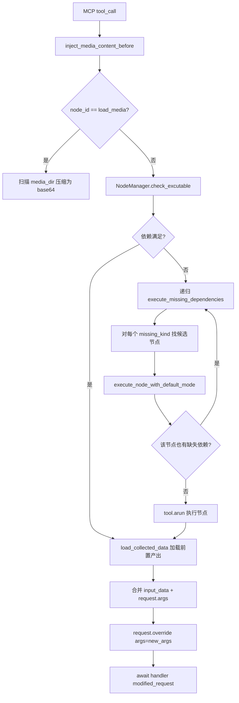

# PD-10.NN FireRed-OpenStoryline — 双层中间件与依赖图拦截器

> 文档编号：PD-10.NN
> 来源：FireRed-OpenStoryline `src/open_storyline/mcp/hooks/chat_middleware.py`, `src/open_storyline/mcp/hooks/node_interceptors.py`
> GitHub：https://github.com/FireRedTeam/FireRed-OpenStoryline.git
> 问题域：PD-10 中间件管道 Middleware Pipeline
> 状态：可复用方案

---

## 第 1 章 问题与动机

### 1.1 核心问题

在 AI 视频编辑 Agent 系统中，工具调用（tool call）不是简单的"调用→返回"。每次工具调用前需要：
- **依赖解析**：当前节点依赖的前置节点是否已执行？未执行则递归补全
- **媒体数据注入**：将前置节点的产出物（视频帧、图片 base64）注入到请求参数中
- **运行时配置注入**：TTS 配置、Pexels API Key 等运行时参数按工具类型条件注入
- **日志与可观测性**：每次工具调用的开始/结束/错误需要通过 ContextVar 推送到 GUI
- **错误隔离**：工具异常不能崩溃 Agent 主循环，需要转化为结构化 ToolMessage 让 LLM 自行决策重试

这些横切关注点如果硬编码在每个工具内部，会导致工具逻辑与基础设施逻辑耦合。OpenStoryline 的解法是**双层中间件架构**：LangChain 层的 `@wrap_tool_call` 装饰器处理日志和错误，MCP 层的 `ToolInterceptor` 静态方法处理依赖注入和数据序列化。

### 1.2 FireRed-OpenStoryline 的解法概述

1. **LangChain 层中间件**（`chat_middleware.py`）：用 `@wrap_tool_call` 装饰器定义 `log_tool_request` 和 `handle_tool_errors` 两个中间件，注册到 `create_agent(middleware=[...])` 中（`agent.py:122`）
2. **MCP 层拦截器**（`node_interceptors.py`）：`ToolInterceptor` 类的 4 个静态方法作为拦截器列表传入 `MultiServerMCPClient(tool_interceptors=[...])` 中（`agent.py:109`）
3. **依赖图自动补全**：`inject_media_content_before` 拦截器通过 `NodeManager.check_excutable()` 检查前置依赖，缺失时递归执行前置节点（`node_interceptors.py:112-228`）
4. **ContextVar 日志通道**：`_MCP_LOG_SINK` 和 `_MCP_ACTIVE_TOOL_CALL_ID` 两个 ContextVar 实现跨层日志推送（`chat_middleware.py:32-33`）
5. **敏感信息脱敏**：`_mask_secrets()` 递归遍历所有参数，对 api_key/token 等字段自动替换为 `***`（`chat_middleware.py:45-65`）

### 1.3 设计思想

| 设计原则 | 具体实现 | 理由 | 替代方案 |
|----------|----------|------|----------|
| 双层分离 | LangChain 层处理日志/错误，MCP 层处理数据注入 | 两层关注点不同：一层面向 Agent 运行时，一层面向 MCP 协议 | 单层中间件栈（会混杂不同抽象层级的逻辑） |
| 静态方法拦截器 | ToolInterceptor 用 @staticmethod 定义，无实例状态 | 拦截器本身无状态，所有上下文通过 request.runtime.context 传递 | 实例方法（需要管理拦截器生命周期） |
| 递归依赖补全 | inject_media_content_before 内部递归调用 execute_missing_dependencies | 视频编辑 DAG 有严格的节点依赖顺序，缺失前置节点时自动补全 | 要求 LLM 自行按顺序调用（不可靠） |
| ContextVar 日志通道 | _MCP_LOG_SINK 允许外部注入日志回调 | GUI 和 CLI 有不同的日志展示方式，通过 ContextVar 解耦 | 全局 logger（无法区分并发会话） |
| 条件注入 | inject_tts_config 仅对 voiceover 工具注入，inject_pexels_api_key 仅对 search_media 注入 | 避免无关工具收到多余参数 | 全量注入（工具需要自行忽略无关参数） |

---

## 第 2 章 源码实现分析

### 2.1 架构概览

OpenStoryline 的中间件架构分为两个独立层，在 Agent 构建时分别注册：

```
┌─────────────────────────────────────────────────────────────┐
│                    Agent Runtime (LangChain)                 │
│                                                             │
│  create_agent(middleware=[log_tool_request,                  │
│                           handle_tool_errors])               │
│                                                             │
│  ┌─────────────────┐    ┌──────────────────┐                │
│  │ log_tool_request │───→│ handle_tool_errors│───→ tool()    │
│  │ (日志+事件推送)   │    │ (异常→ToolMessage) │              │
│  └─────────────────┘    └──────────────────┘                │
│           │                                                  │
│           ▼                                                  │
│  ┌─────────────────────────────────────────────────────┐    │
│  │           MCP Client (tool_interceptors)             │    │
│  │                                                      │    │
│  │  inject_media_content_before ──→ MCP Server ──→      │    │
│  │  save_media_content_after   ←── (tool result) ←──    │    │
│  │  inject_tts_config          ──→ (条件注入)            │    │
│  │  inject_pexels_api_key      ──→ (条件注入)            │    │
│  └─────────────────────────────────────────────────────┘    │
└─────────────────────────────────────────────────────────────┘
```

两层的注册入口在 `agent.py:107-122`：

```python
# MCP 层：拦截器传入 MultiServerMCPClient
client = MultiServerMCPClient(
    connections=connections,
    tool_interceptors=tool_interceptors,  # [inject_media_content_before, ...]
    callbacks=Callbacks(on_progress=on_progress),
)

# LangChain 层：中间件传入 create_agent
agent = create_agent(
    model=llm,
    tools=tools+skills,
    middleware=[log_tool_request, handle_tool_errors],  # 日志+错误处理
    store=store,
    context_schema=ClientContext,
)
```

### 2.2 核心实现

#### 2.2.1 LangChain 层：@wrap_tool_call 装饰器中间件



对应源码 `chat_middleware.py:94-207`：

```python
@wrap_tool_call
async def log_tool_request(request, handler):
    sink = _MCP_LOG_SINK.get()
    server_names = {"storyline"}

    tool_call_info = request.tool_call
    tool_complete_name = tool_call_info.get("name", "")

    # 解析 server_name 和 tool_name
    server_name, tool_name = "", tool_complete_name
    for s in server_names:
        prefix = f"{s}_"
        if tool_complete_name.startswith(prefix):
            server_name = s
            tool_name = tool_complete_name[len(prefix):]
            break

    # 过滤敏感参数 + 排除内部元数据字段
    meta_collector = request.runtime.context.node_manager
    exclude = set(meta_collector.kind_to_node_ids.keys()) | {
        "inputs", "artifacts_dir", "artifact_id", ...
    }
    extracted_args = _mask_secrets({
        k: v for k, v in tool_call_info["args"].items() if k not in exclude
    })

    # ContextVar 追踪当前 tool_call_id
    active_tok = _MCP_ACTIVE_TOOL_CALL_ID.set(tool_call_id)
    try:
        emit_event({"type": "tool_start", ...})
        out = await handler(request)
        # 解析 isError 状态（MCP 工具 vs Skill 工具有不同判断逻辑）
        ...
    finally:
        _MCP_ACTIVE_TOOL_CALL_ID.reset(active_tok)
    return out
```

关键设计点：
- `_MCP_LOG_SINK` ContextVar 允许 GUI/CLI 注入不同的日志回调（`chat_middleware.py:32`）
- `_mask_secrets()` 递归脱敏，防止 API Key 泄露到日志/ToolMessage（`chat_middleware.py:45`）
- MCP 工具和 Skill 工具的错误判断逻辑不同：MCP 工具通过 `additional_kwargs.isError` 或解析 JSON 内容判断，Skill 工具默认成功（`chat_middleware.py:153-180`）

#### 2.2.2 错误处理中间件



对应源码 `chat_middleware.py:223-268`：

```python
@wrap_tool_call
async def handle_tool_errors(request, handler):
    try:
        out = await handler(request)
        if isinstance(out, Command):
            return out.update.get('messages')[0]
        elif isinstance(out, MCPToolCallResult) and not isinstance(out.content, str):
            return ToolMessage(
                content=out.content[0].get("text", ""),
                tool_call_id=out.tool_call_id,
                additional_kwargs={"isError": False, "mcp_raw_text": True},
            )
        return out
    except Exception as e:
        safe_args = _mask_secrets(tc.get("args") or {})
        return ToolMessage(
            content=(
                "Tool call failed\n"
                f"Tool name: {tool_name}\n"
                f"Tool params: {safe_args}\n"
                f"Error messege: {type(e).__name__}: {e}\n"
                "If it is a parameter issue, please correct the parameters..."
            ),
            tool_call_id=tc["id"],
            additional_kwargs={"isError": True, "error_type": type(e).__name__},
        )
```

#### 2.2.3 MCP 层：ToolInterceptor 依赖图拦截器



对应源码 `node_interceptors.py:42-249`：

```python
class ToolInterceptor:
    @staticmethod
    async def inject_media_content_before(request: MCPToolCallRequest, handler):
        runtime = request.runtime
        context = runtime.context
        store = runtime.store
        node_id = request.name
        meta_collector: NodeManager = context.node_manager

        # 检查依赖是否满足
        require_kind = meta_collector.id_to_require_prior_kind[node_id]
        collect_result = meta_collector.check_excutable(session_id, store, require_kind)

        if not collect_result['excutable']:
            missing_kinds = collect_result['missing_kind']
            # 递归执行缺失的前置节点
            await execute_missing_dependencies(missing_kinds, for_node_id=node_id)
            # 重新收集依赖
            collect_result = meta_collector.check_excutable(session_id, store, require_kind)

        # 合并注入数据
        new_req_args = {'artifact_id': artifact_id, 'lang': lang}
        new_req_args.update(request.args)
        new_req_args.update(input_data)
        modified_request = request.override(args=new_req_args)
        return await handler(modified_request)
```

### 2.3 实现细节

**NodeManager 依赖图**（`node_manager.py:11-169`）：

NodeManager 从 MCP 工具的 metadata 中提取依赖关系，维护双向索引：
- `id_to_require_prior_kind`：节点 → 所需前置 kind 列表（auto 模式）
- `id_to_default_require_prior_kind`：节点 → 所需前置 kind 列表（default 模式）
- `kind_to_node_ids`：kind → 可提供该 kind 的节点列表（按 priority 排序）
- `kind_to_dependent_nodes`：反向索引，kind → 依赖该 kind 的节点集合

`check_excutable()` 方法（`node_manager.py:145`）遍历所有 require_kind，从 ArtifactStore 查找最新产出物，返回 `{excutable, collected_node, missing_kind}` 三元组。

**条件注入拦截器**：

`inject_tts_config`（`node_interceptors.py:313-348`）仅在工具名包含 "voiceover" 时注入 TTS 配置，通过 `args.setdefault()` 保证不覆盖已有参数。

`inject_pexels_api_key`（`node_interceptors.py:351-379`）仅在工具名包含 "search_media" 时注入 API Key，空值时跳过让工具内部 fallback 到环境变量。

**媒体序列化**（`node_interceptors.py:22-38`）：

`compress_payload_to_base64()` 递归遍历 payload dict，对包含 `path` 字段的项调用 `FileCompressor.compress_and_encode()` 生成 base64 + md5，实现媒体文件的跨进程传输。

---

## 第 3 章 迁移指南

### 3.1 迁移清单

**阶段 1：LangChain 层中间件（1-2 个文件）**

1. 定义 `@wrap_tool_call` 装饰器中间件函数（日志 + 错误处理）
2. 在 `create_agent()` 中注册 `middleware=[...]` 列表
3. 配置 ContextVar 日志通道（可选，用于 GUI 集成）

**阶段 2：MCP 层拦截器（2-3 个文件）**

1. 定义 `ToolInterceptor` 类，每个拦截器为 `@staticmethod`
2. 实现条件注入逻辑（按工具名过滤）
3. 在 `MultiServerMCPClient(tool_interceptors=[...])` 中注册

**阶段 3：依赖图补全（可选，复杂场景）**

1. 实现 `NodeManager` 维护节点依赖关系
2. 在 before 拦截器中调用 `check_excutable()` + 递归补全
3. 实现 `ArtifactStore` 持久化节点产出物

### 3.2 适配代码模板

#### 最小可用的双层中间件模板

```python
import contextvars
from typing import Callable, Optional
from langchain.agents.middleware import wrap_tool_call
from langchain.agents import create_agent
from langchain_core.messages import ToolMessage
from langchain_mcp_adapters.interceptors import MCPToolCallRequest
from langchain_mcp_adapters.client import MultiServerMCPClient

# ---- Layer 1: LangChain 中间件 ----

_LOG_SINK = contextvars.ContextVar("log_sink", default=None)

def set_log_sink(sink: Optional[Callable[[dict], None]]):
    return _LOG_SINK.set(sink)

@wrap_tool_call
async def log_middleware(request, handler):
    """日志中间件：记录工具调用开始/结束"""
    sink = _LOG_SINK.get()
    tool_name = request.tool_call.get("name", "")
    tool_call_id = request.tool_call.get("id", "")

    if sink:
        sink({"type": "tool_start", "name": tool_name, "id": tool_call_id})

    out = await handler(request)

    if sink:
        is_error = getattr(out, "additional_kwargs", {}).get("isError", False)
        sink({"type": "tool_end", "name": tool_name, "id": tool_call_id, "is_error": is_error})

    return out

@wrap_tool_call
async def error_middleware(request, handler):
    """错误隔离中间件：异常转为结构化 ToolMessage"""
    try:
        return await handler(request)
    except Exception as e:
        tc = request.tool_call
        return ToolMessage(
            content=f"Tool '{tc.get('name')}' failed: {type(e).__name__}: {e}",
            tool_call_id=tc["id"],
            name=tc.get("name", ""),
            additional_kwargs={"isError": True},
        )

# ---- Layer 2: MCP 拦截器 ----

class MyInterceptor:
    @staticmethod
    async def inject_config_before(request: MCPToolCallRequest, handler):
        """条件注入拦截器：仅对特定工具注入配置"""
        tool_name = getattr(request, "name", "")
        args = getattr(request, "args", {})

        if "target_tool" in tool_name and isinstance(args, dict):
            ctx = request.runtime.context
            config_value = getattr(ctx, "my_config", None)
            if config_value:
                args.setdefault("config_key", config_value)

        return await handler(request)

# ---- 组装 ----

async def build_my_agent(llm, connections, context_schema):
    client = MultiServerMCPClient(
        connections=connections,
        tool_interceptors=[MyInterceptor.inject_config_before],
    )
    tools = await client.get_tools()

    agent = create_agent(
        model=llm,
        tools=tools,
        middleware=[log_middleware, error_middleware],
        context_schema=context_schema,
    )
    return agent
```

### 3.3 适用场景

| 场景 | 适用度 | 说明 |
|------|--------|------|
| MCP 工具 + LangChain Agent | ⭐⭐⭐ | 完美匹配，双层分离天然对应两个框架层 |
| 有 DAG 依赖的工具链 | ⭐⭐⭐ | 依赖图自动补全避免 LLM 遗漏前置步骤 |
| 需要 GUI 实时日志的 Agent | ⭐⭐⭐ | ContextVar 日志通道解耦 GUI/CLI |
| 纯 LangChain 无 MCP | ⭐⭐ | 只需 Layer 1，Layer 2 不适用 |
| 无依赖关系的简单工具集 | ⭐ | 过度设计，直接用 @wrap_tool_call 即可 |

---

## 第 4 章 测试用例

```python
import pytest
from unittest.mock import AsyncMock, MagicMock, patch
from dataclasses import dataclass
from typing import Optional

# ---- 测试 _mask_secrets ----

def _mask_secrets(obj):
    """从 chat_middleware.py:45 提取的脱敏函数"""
    SENSITIVE_KEYS = {"api_key", "access_token", "token", "password", "secret"}
    if isinstance(obj, dict):
        return {k: "***" if k.lower() in SENSITIVE_KEYS else _mask_secrets(v) for k, v in obj.items()}
    if isinstance(obj, list):
        return [_mask_secrets(x) for x in obj]
    return obj


class TestMaskSecrets:
    def test_flat_dict(self):
        result = _mask_secrets({"api_key": "sk-123", "name": "test"})
        assert result == {"api_key": "***", "name": "test"}

    def test_nested_dict(self):
        result = _mask_secrets({"config": {"api_key": "sk-123", "url": "http://x"}})
        assert result == {"config": {"api_key": "***", "url": "http://x"}}

    def test_list_of_dicts(self):
        result = _mask_secrets([{"token": "abc"}, {"name": "ok"}])
        assert result == [{"token": "***"}, {"name": "ok"}]

    def test_non_sensitive_passthrough(self):
        result = _mask_secrets({"model": "gpt-4", "temperature": 0.7})
        assert result == {"model": "gpt-4", "temperature": 0.7}


# ---- 测试条件注入逻辑 ----

class TestConditionalInjection:
    @pytest.mark.asyncio
    async def test_tts_config_injected_for_voiceover(self):
        """inject_tts_config 仅对 voiceover 工具注入"""
        handler = AsyncMock(return_value="result")

        @dataclass
        class FakeContext:
            tts_config: Optional[dict] = None

        @dataclass
        class FakeRuntime:
            context: FakeContext = None

        request = MagicMock()
        request.name = "storyline_voiceover_generate"
        request.args = {}
        request.runtime = FakeRuntime(context=FakeContext(
            tts_config={"provider": "azure", "azure": {"voice": "en-US-JennyNeural"}}
        ))

        # 模拟 inject_tts_config 的核心逻辑
        tool_name = request.name
        args = request.args
        if "voiceover" in tool_name:
            tts_cfg = request.runtime.context.tts_config
            provider = tts_cfg.get("provider", "").strip().lower()
            args.setdefault("provider", provider)
            provider_cfg = tts_cfg.get(provider, {})
            for k, v in provider_cfg.items():
                if v is not None:
                    args.setdefault(k, str(v).strip())

        assert args["provider"] == "azure"
        assert args["voice"] == "en-US-JennyNeural"

    @pytest.mark.asyncio
    async def test_tts_config_skipped_for_non_voiceover(self):
        """非 voiceover 工具不注入 TTS 配置"""
        request = MagicMock()
        request.name = "storyline_load_media"
        request.args = {}

        tool_name = request.name
        if "voiceover" not in tool_name:
            pass  # 不注入

        assert "provider" not in request.args


# ---- 测试依赖检查 ----

class TestNodeManagerCheckExcutable:
    def test_all_dependencies_met(self):
        """所有依赖满足时 excutable=True"""
        store = MagicMock()
        store.get_latest_meta.return_value = MagicMock(created_at=1.0)

        from collections import defaultdict
        kind_to_node_ids = defaultdict(list, {"audio": ["gen_audio"], "video": ["gen_video"]})

        collected = {}
        missing = []
        for kind in ["audio", "video"]:
            output = store.get_latest_meta(node_id=kind_to_node_ids[kind][0], session_id="s1")
            if output:
                collected[kind] = output
            else:
                missing.append(kind)

        assert len(collected) == 2
        assert len(missing) == 0

    def test_missing_dependency(self):
        """缺失依赖时返回 missing_kind"""
        store = MagicMock()
        store.get_latest_meta.side_effect = lambda **kw: (
            MagicMock(created_at=1.0) if kw["node_id"] == "gen_audio" else None
        )

        from collections import defaultdict
        kind_to_node_ids = defaultdict(list, {"audio": ["gen_audio"], "video": ["gen_video"]})

        collected = {}
        missing = []
        for kind in ["audio", "video"]:
            output = store.get_latest_meta(node_id=kind_to_node_ids[kind][0], session_id="s1")
            if output:
                collected[kind] = output
            else:
                missing.append(kind)

        assert len(collected) == 1
        assert missing == ["video"]
```

---

## 第 5 章 跨域关联

| 关联域 | 关系类型 | 说明 |
|--------|----------|------|
| PD-03 容错与重试 | 协同 | `handle_tool_errors` 中间件将异常转为结构化 ToolMessage，让 LLM 自行决策重试策略，与 PD-03 的容错机制互补 |
| PD-04 工具系统 | 依赖 | 双层中间件依赖 LangChain 的 `@wrap_tool_call` 和 MCP 的 `tool_interceptors` 接口，工具系统的设计直接决定中间件的挂载点 |
| PD-06 记忆持久化 | 协同 | `save_media_content_after` 拦截器通过 `ArtifactStore` 持久化工具产出物，`inject_media_content_before` 从 Store 加载前置产出，形成"写入→读取"闭环 |
| PD-11 可观测性 | 协同 | `log_tool_request` 中间件通过 ContextVar 推送 tool_start/tool_end 事件到 GUI，是可观测性的核心数据源 |
| PD-01 上下文管理 | 协同 | 拦截器注入的 media base64 数据会显著增加上下文大小，需要与上下文管理策略配合 |

---

## 第 6 章 来源文件索引

| 文件 | 行范围 | 关键实现 |
|------|--------|----------|
| `src/open_storyline/mcp/hooks/chat_middleware.py` | L1-L273 | LangChain 层中间件：log_tool_request、handle_tool_errors、_mask_secrets、ContextVar 日志通道 |
| `src/open_storyline/mcp/hooks/node_interceptors.py` | L1-L380 | MCP 层拦截器：ToolInterceptor（inject_media_content_before、save_media_content_after、inject_tts_config、inject_pexels_api_key） |
| `src/open_storyline/agent.py` | L35-L126 | Agent 构建入口：双层中间件注册、ClientContext 定义 |
| `src/open_storyline/nodes/node_manager.py` | L11-L169 | 依赖图管理：NodeManager（kind_to_node_ids、check_excutable、双向索引） |
| `src/open_storyline/storage/agent_memory.py` | L23-L152 | 产出物持久化：ArtifactStore（save_result、load_result、generate_artifact_id） |
| `src/open_storyline/mcp/sampling_handler.py` | L308-L432 | MCP sampling 回调：make_sampling_callback（多模态路由、视频帧采样） |
| `cli.py` | L28-L99 | CLI 入口：拦截器列表组装（3 个拦截器） |
| `agent_fastapi.py` | L1201-L1216 | FastAPI 入口：拦截器列表组装（4 个拦截器，含 inject_pexels_api_key） |

---

## 第 7 章 横向对比维度

```json comparison_data
{
  "project": "FireRed-OpenStoryline",
  "dimensions": {
    "中间件基类": "无基类，LangChain 层用 @wrap_tool_call 装饰器，MCP 层用 @staticmethod",
    "钩子点": "LangChain before/after tool + MCP before/after interceptor 共 4 个挂载点",
    "中间件数量": "LangChain 层 2 个 + MCP 层 4 个 = 共 6 个中间件/拦截器",
    "条件激活": "MCP 拦截器按工具名条件注入（voiceover/search_media），非目标工具直接透传",
    "状态管理": "无实例状态，所有上下文通过 request.runtime.context 传递",
    "执行模型": "双层串行：LangChain 中间件链 → MCP 拦截器链 → MCP Server",
    "错误隔离": "handle_tool_errors 捕获异常转为含修复建议的 ToolMessage，不中断 Agent 循环",
    "数据传递": "request.override(args=new_args) 不可变替换，拦截器间通过 args dict 传递",
    "可观测性": "ContextVar _MCP_LOG_SINK 推送 tool_start/tool_end/tool_progress 事件到 GUI",
    "装饰器包装": "@wrap_tool_call 装饰器实现 before/after 语义，handler 参数传递下一层",
    "懒初始化策略": "LLM 池 _get_llm 按 (model_name, streaming) 键懒创建并缓存"
  }
}
```

### 域元数据补充

```json domain_metadata
{
  "solution_summary": "OpenStoryline 用 LangChain @wrap_tool_call 装饰器（日志/错误隔离）+ MCP ToolInterceptor 静态方法（依赖图补全/媒体序列化/条件配置注入）实现双层中间件管道",
  "description": "双框架层中间件分离：Agent 运行时层与 MCP 协议层各自独立的拦截器栈",
  "sub_problems": [
    "递归依赖补全：拦截器内递归执行缺失前置节点的深度控制与循环检测",
    "媒体 base64 序列化：跨进程传输大文件时的压缩编码与 MD5 校验",
    "MCP vs Skill 错误判断分歧：不同工具类型的 isError 字段位置和语义不统一",
    "拦截器列表差异：CLI 和 FastAPI 入口注册不同数量的拦截器的一致性管理"
  ],
  "best_practices": [
    "静态方法拦截器无实例状态：所有上下文通过 request.runtime.context 传递，避免拦截器间状态耦合",
    "args.setdefault 保护已有参数：条件注入时不覆盖 LLM 已设置的参数值",
    "ContextVar 日志通道解耦 GUI/CLI：不同前端通过 set_mcp_log_sink 注入各自的日志回调"
  ]
}
```
