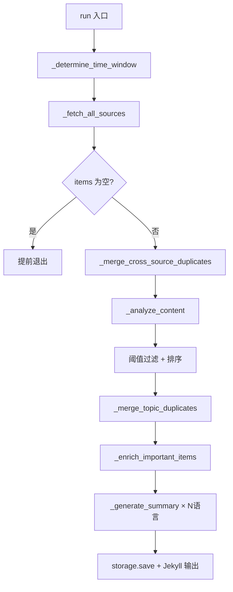
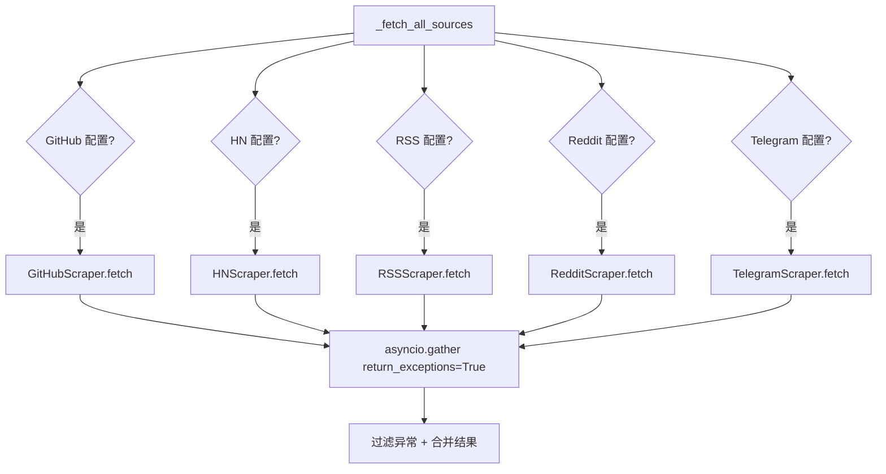

# PD-10.07 Horizon — 七阶段顺序数据处理管道

> 文档编号：PD-10.07
> 来源：Horizon `src/orchestrator.py`
> GitHub：https://github.com/Thysrael/Horizon.git
> 问题域：PD-10 中间件管道 Middleware Pipeline
> 状态：可复用方案

---

## 第 1 章 问题与动机

### 1.1 核心问题

信息聚合系统需要从多个异构数据源（GitHub、Hacker News、RSS、Reddit、Telegram）抓取内容，经过去重、AI 评分、过滤、语义去重、富化、摘要生成等多个处理阶段，最终输出结构化的每日摘要。每个阶段对数据的变换逻辑不同，但都操作同一个 `List[ContentItem]` 数据流。

核心挑战在于：
- **阶段间数据依赖**：后续阶段依赖前序阶段的输出（如 AI 评分必须在抓取之后、过滤必须在评分之后）
- **异构处理逻辑**：有的阶段是纯同步计算（URL 去重），有的是并发 I/O（多源抓取），有的是 AI 调用（评分/富化）
- **可观测性**：每个阶段需要输出进度和统计信息，便于调试和监控
- **容错隔离**：单个数据源抓取失败不应阻塞整个管道

### 1.2 Horizon 的解法概述

Horizon 采用**编排器顺序管道**模式，在 `HorizonOrchestrator.run()` 方法中硬编码 7 个处理阶段，每阶段接收 `List[ContentItem]` 并输出变换后的列表传递给下一阶段：

1. **时间窗口确定** — `_determine_time_window()` 计算抓取起始时间（`src/orchestrator.py:155-161`）
2. **并发多源抓取** — `_fetch_all_sources()` 用 `asyncio.gather` 并发抓取 5 种数据源（`src/orchestrator.py:163-211`）
3. **URL 去重合并** — `_merge_cross_source_duplicates()` 按 URL 归一化去重，保留内容最丰富的条目（`src/orchestrator.py:252-304`）
4. **AI 评分分析** — `_analyze_content()` 调用 LLM 为每条内容打分 0-10（`src/orchestrator.py:402-416`）
5. **阈值过滤 + 语义去重** — 按 `ai_score_threshold` 过滤后，用 Jaccard 相似度 + AI 标签重叠做语义去重（`src/orchestrator.py:73-91`）
6. **背景知识富化** — `_enrich_important_items()` 对高分条目做第二轮 AI 分析 + Web 搜索（`src/orchestrator.py:384-400`）
7. **多语言摘要生成** — `_generate_summary()` 按配置语言生成 Markdown 摘要并保存（`src/orchestrator.py:418-441`）

### 1.3 设计思想

| 设计原则 | 具体实现 | 理由 | 替代方案 |
|----------|----------|------|----------|
| 编排器即管道 | `run()` 方法顺序调用 7 个私有方法 | 简单直观，阶段依赖关系一目了然 | 中间件链/责任链模式 |
| 统一数据载体 | 全程操作 `List[ContentItem]` | 阶段间零序列化开销，Pydantic 模型保证类型安全 | 字典/元组传递 |
| 并发在阶段内 | `asyncio.gather` 在抓取/分析阶段内并发 | 阶段间串行保证依赖，阶段内并发提升吞吐 | 全局任务队列 |
| 渐进式过滤 | 每阶段缩减数据量：全量→去重→评分→过滤→语义去重 | 越往后 AI 调用越贵，提前过滤节省成本 | 一次性全量处理 |
| 容错不阻塞 | `return_exceptions=True` + 异常条目降级为 score=0 | 单源失败不影响其他源 | 严格失败快速退出 |

---

## 第 2 章 源码实现分析

### 2.1 架构概览

Horizon 的管道架构是一个典型的**线性数据处理流水线**，数据从左到右流经 7 个阶段，每阶段对 `List[ContentItem]` 做变换：

```
┌──────────────┐    ┌──────────────┐    ┌──────────────┐    ┌──────────────┐
│  时间窗口     │    │  并发抓取     │    │  URL 去重     │    │  AI 评分     │
│ (since 计算)  │───→│ (5源 gather) │───→│ (URL归一化)   │───→│ (LLM 打分)  │
└──────────────┘    └──────────────┘    └──────────────┘    └──────────────┘
                                                                    │
┌──────────────┐    ┌──────────────┐    ┌──────────────┐            │
│  摘要生成     │←───│  背景富化     │←───│ 阈值+语义去重 │←───────────┘
│ (Markdown)   │    │ (Web+LLM)   │    │ (Jaccard+Tag)│
└──────────────┘    └──────────────┘    └──────────────┘

数据流: List[ContentItem] ──→ 每阶段变换 ──→ 最终 Markdown
```

关键组件关系：

```
HorizonOrchestrator (编排器)
├── Config (配置)
├── StorageManager (持久化)
├── BaseScraper (抓取器基类)
│   ├── GitHubScraper
│   ├── HackerNewsScraper
│   ├── RSSScraper
│   ├── RedditScraper
│   └── TelegramScraper
├── ContentAnalyzer (AI 评分)
├── ContentEnricher (背景富化)
└── DailySummarizer (摘要生成)
```

### 2.2 核心实现

#### 2.2.1 编排器主管道



对应源码 `src/orchestrator.py:39-153`：

```python
async def run(self, force_hours: int = None) -> None:
    try:
        # 1. Determine time window
        since = self._determine_time_window(force_hours)

        # 2. Fetch content from all sources
        all_items = await self._fetch_all_sources(since)
        if not all_items:
            return

        # 3. Merge cross-source duplicates (same URL from different sources)
        merged_items = self._merge_cross_source_duplicates(all_items)

        # 4. Analyze with AI
        analyzed_items = await self._analyze_content(merged_items)

        # 5. Filter by score threshold
        threshold = self.config.filtering.ai_score_threshold
        important_items = [
            item for item in analyzed_items
            if item.ai_score and item.ai_score >= threshold
        ]
        important_items.sort(key=lambda x: x.ai_score or 0, reverse=True)

        # 5.5 Semantic deduplication
        deduped_items = self._merge_topic_duplicates(important_items)
        important_items = deduped_items

        # 6. Search related stories + enrich
        await self._enrich_important_items(important_items)

        # 7. Generate and save daily summaries for each language
        for lang in self.config.ai.languages:
            summary = await self._generate_summary(
                important_items, today, len(all_items), language=lang
            )
            summary_path = self.storage.save_daily_summary(today, summary, language=lang)
    except Exception as e:
        self.console.print(f"[bold red]❌ Error: {e}[/bold red]")
        raise
```

#### 2.2.2 并发抓取与容错隔离



对应源码 `src/orchestrator.py:163-211`：

```python
async def _fetch_all_sources(self, since: datetime) -> List[ContentItem]:
    async with httpx.AsyncClient(timeout=30.0) as client:
        tasks = []
        if self.config.sources.github:
            github_scraper = GitHubScraper(self.config.sources.github, client)
            tasks.append(self._fetch_with_progress("GitHub", github_scraper, since))
        if self.config.sources.hackernews.enabled:
            hn_scraper = HackerNewsScraper(self.config.sources.hackernews, client)
            tasks.append(self._fetch_with_progress("Hacker News", hn_scraper, since))
        # ... RSS, Reddit, Telegram 同理

        results = await asyncio.gather(*tasks, return_exceptions=True)

        all_items = []
        for result in results:
            if isinstance(result, Exception):
                self.console.print(f"[red]Error fetching source: {result}[/red]")
            elif isinstance(result, list):
                all_items.extend(result)
        return all_items
```

#### 2.2.3 双层去重策略

Horizon 实现了两层去重，分别在管道的不同位置：

**第一层：URL 归一化去重**（阶段 3，AI 评分之前）

对应源码 `src/orchestrator.py:252-304`：

```python
def _merge_cross_source_duplicates(self, items: List[ContentItem]) -> List[ContentItem]:
    def normalize_url(url: str) -> str:
        parsed = urlparse(str(url))
        host = parsed.hostname or ""
        if host.startswith("www."):
            host = host[4:]
        path = parsed.path.rstrip("/")
        return f"{host}{path}"

    url_groups: Dict[str, List[ContentItem]] = {}
    for item in items:
        key = normalize_url(str(item.url))
        url_groups.setdefault(key, []).append(item)

    merged = []
    for key, group in url_groups.items():
        if len(group) == 1:
            merged.append(group[0])
            continue
        primary = max(group, key=lambda x: len(x.content or ""))
        # 合并 metadata 和 content
        for item in group:
            for mk, mv in item.metadata.items():
                if mk not in primary.metadata or not primary.metadata[mk]:
                    primary.metadata[mk] = mv
        primary.metadata["merged_sources"] = list(all_sources)
        merged.append(primary)
    return merged
```

**第二层：语义去重**（阶段 5.5，阈值过滤之后）

对应源码 `src/orchestrator.py:348-382`：

```python
def _merge_topic_duplicates(
    self, items: List[ContentItem], threshold: float = 0.33
) -> List[ContentItem]:
    kept: List[ContentItem] = []
    for item in items:
        tokens = self._title_tokens(item.title)
        item_tags = set(item.ai_tags or [])
        merged_into = None
        for accepted in kept:
            a_tokens = self._title_tokens(accepted.title)
            union = a_tokens | tokens
            title_sim = len(a_tokens & tokens) / len(union) if union else 0.0
            tag_overlap = len(set(accepted.ai_tags or []) & item_tags)
            if title_sim >= threshold or (tag_overlap >= 2 and title_sim >= 0.15):
                merged_into = accepted
                break
        if merged_into is not None:
            self._merge_item_content(merged_into, item)
        else:
            kept.append(item)
    return kept
```

### 2.3 实现细节

**统一数据载体 ContentItem**（`src/models.py:18-35`）：

所有阶段共享同一个 Pydantic 模型，AI 分析结果通过 `ai_score`/`ai_reason`/`ai_summary`/`ai_tags` 字段原地写入，富化结果通过 `metadata` 字典扩展。这种设计避免了阶段间的数据转换开销。

**渐进式数据缩减**：

```
全量抓取 (N 条)
  → URL 去重 (去除跨源重复)
    → AI 评分 (全量评分)
      → 阈值过滤 (score >= 7.0)
        → 语义去重 (Jaccard + Tag)
          → 富化 (仅高分条目，节省 AI 调用)
            → 摘要生成 (最终精选)
```

每个阶段都通过 `self.console.print()` 输出统计信息（条目数变化），形成内置的可观测性。

**AI 分析的容错设计**（`src/ai/analyzer.py:38-46`）：

```python
try:
    await self._analyze_item(item)
    analyzed_items.append(item)
except Exception as e:
    item.ai_score = 0.0
    item.ai_reason = "Analysis failed"
    item.ai_summary = item.title
    analyzed_items.append(item)
```

单条分析失败时降级为 score=0，不会被后续阈值过滤选中，但也不会阻塞其他条目的分析。

**富化阶段的三步 AI 管道**（`src/ai/enricher.py:109-212`）：

富化本身也是一个子管道：概念提取 → Web 搜索 → 背景生成。每步都有独立的 prompt 和容错处理，`tenacity` 提供指数退避重试（最多 3 次）。


---

## 第 3 章 迁移指南

### 3.1 迁移清单

**阶段 1：定义数据载体**
- [ ] 创建统一的 Pydantic 数据模型（类似 `ContentItem`），包含原始字段和处理结果字段
- [ ] 确保模型支持原地修改（AI 结果写入同一对象）

**阶段 2：实现管道阶段**
- [ ] 为每个处理阶段创建独立的类/模块（Scraper、Analyzer、Enricher、Summarizer）
- [ ] 每个阶段接收 `List[DataItem]` 返回 `List[DataItem]`
- [ ] 阶段内部自行处理并发（`asyncio.gather`）

**阶段 3：编排器组装**
- [ ] 创建 Orchestrator 类，在 `run()` 中顺序调用各阶段
- [ ] 每阶段之间添加空列表检查（提前退出）
- [ ] 每阶段后输出统计日志

**阶段 4：容错与可观测**
- [ ] 并发调用使用 `return_exceptions=True`
- [ ] AI 调用添加 `tenacity` 重试
- [ ] 失败条目降级而非丢弃

### 3.2 适配代码模板

```python
"""可复用的顺序管道编排器模板。"""

import asyncio
from typing import List, TypeVar, Callable, Awaitable
from pydantic import BaseModel, Field
from rich.console import Console

T = TypeVar("T", bound=BaseModel)


class PipelineStage:
    """管道阶段基类。"""

    def __init__(self, name: str):
        self.name = name
        self.console = Console()

    async def process(self, items: List[T]) -> List[T]:
        raise NotImplementedError


class ConcurrentFetchStage(PipelineStage):
    """并发抓取阶段：多数据源并发，容错隔离。"""

    def __init__(self, name: str, fetchers: List[Callable[[], Awaitable[List[T]]]]):
        super().__init__(name)
        self.fetchers = fetchers

    async def process(self, items: List[T]) -> List[T]:
        results = await asyncio.gather(
            *[f() for f in self.fetchers],
            return_exceptions=True,
        )
        all_items = []
        for result in results:
            if isinstance(result, Exception):
                self.console.print(f"[red]Fetch error: {result}[/red]")
            elif isinstance(result, list):
                all_items.extend(result)
        return all_items


class FilterStage(PipelineStage):
    """过滤阶段：按条件筛选。"""

    def __init__(self, name: str, predicate: Callable[[T], bool]):
        super().__init__(name)
        self.predicate = predicate

    async def process(self, items: List[T]) -> List[T]:
        return [item for item in items if self.predicate(item)]


class SequentialPipeline:
    """顺序管道编排器。"""

    def __init__(self, stages: List[PipelineStage]):
        self.stages = stages
        self.console = Console()

    async def run(self, initial_items: List[T] = None) -> List[T]:
        items = initial_items or []
        for stage in self.stages:
            self.console.print(f"▶ {stage.name}: {len(items)} items")
            items = await stage.process(items)
            if not items:
                self.console.print(f"  ⚠ {stage.name} produced 0 items, stopping")
                break
            self.console.print(f"  ✓ {stage.name}: {len(items)} items")
        return items
```

### 3.3 适用场景

| 场景 | 适用度 | 说明 |
|------|--------|------|
| 信息聚合/新闻摘要 | ⭐⭐⭐ | 完美匹配：多源抓取→过滤→AI 分析→输出 |
| ETL 数据管道 | ⭐⭐⭐ | 经典的 Extract-Transform-Load 模式 |
| 内容审核流水线 | ⭐⭐ | 适合顺序审核，但可能需要并行审核阶段 |
| 实时流处理 | ⭐ | 不适合：Horizon 是批处理模式，无流式支持 |
| 复杂 DAG 编排 | ⭐ | 不适合：仅支持线性管道，无分支/合并 |

---

## 第 4 章 测试用例

```python
"""基于 Horizon 真实函数签名的测试用例。"""

import pytest
from datetime import datetime, timezone, timedelta
from unittest.mock import AsyncMock, MagicMock
from pydantic import HttpUrl

# 模拟 Horizon 的核心数据模型
from src.models import ContentItem, SourceType, Config, AIConfig, AIProvider
from src.models import SourcesConfig, FilteringConfig, HackerNewsConfig
from src.orchestrator import HorizonOrchestrator


def make_item(
    title: str,
    url: str = "https://example.com/1",
    source: SourceType = SourceType.HACKERNEWS,
    score: float = None,
    tags: list = None,
    content: str = None,
) -> ContentItem:
    return ContentItem(
        id=f"test:{title[:10]}",
        source_type=source,
        title=title,
        url=url,
        content=content,
        published_at=datetime.now(timezone.utc),
        ai_score=score,
        ai_tags=tags or [],
    )


class TestMergeCrossSourceDuplicates:
    """测试 URL 去重合并逻辑。"""

    def setup_method(self):
        config = Config(
            ai=AIConfig(provider=AIProvider.ANTHROPIC, model="test", api_key_env="TEST"),
            sources=SourcesConfig(),
            filtering=FilteringConfig(),
        )
        storage = MagicMock()
        self.orch = HorizonOrchestrator(config, storage)

    def test_no_duplicates(self):
        items = [
            make_item("A", url="https://example.com/a"),
            make_item("B", url="https://example.com/b"),
        ]
        result = self.orch._merge_cross_source_duplicates(items)
        assert len(result) == 2

    def test_same_url_different_sources(self):
        items = [
            make_item("A from HN", url="https://example.com/article",
                       source=SourceType.HACKERNEWS, content="short"),
            make_item("A from Reddit", url="https://example.com/article",
                       source=SourceType.REDDIT, content="longer content here"),
        ]
        result = self.orch._merge_cross_source_duplicates(items)
        assert len(result) == 1
        assert "longer content" in result[0].content

    def test_www_prefix_normalization(self):
        items = [
            make_item("A", url="https://www.example.com/page"),
            make_item("B", url="https://example.com/page"),
        ]
        result = self.orch._merge_cross_source_duplicates(items)
        assert len(result) == 1


class TestMergeTopicDuplicates:
    """测试语义去重逻辑。"""

    def setup_method(self):
        config = Config(
            ai=AIConfig(provider=AIProvider.ANTHROPIC, model="test", api_key_env="TEST"),
            sources=SourcesConfig(),
            filtering=FilteringConfig(),
        )
        storage = MagicMock()
        self.orch = HorizonOrchestrator(config, storage)

    def test_similar_titles_merged(self):
        items = [
            make_item("OpenAI releases GPT-5 model", score=9.0,
                       url="https://a.com/1", tags=["openai", "gpt"]),
            make_item("OpenAI announces GPT-5 release", score=8.0,
                       url="https://b.com/2", tags=["openai", "gpt"]),
        ]
        result = self.orch._merge_topic_duplicates(items)
        assert len(result) == 1
        assert result[0].ai_score == 9.0  # 保留高分

    def test_different_topics_kept(self):
        items = [
            make_item("Rust 2.0 released", score=9.0,
                       url="https://a.com/1", tags=["rust"]),
            make_item("Python 3.14 released", score=8.0,
                       url="https://b.com/2", tags=["python"]),
        ]
        result = self.orch._merge_topic_duplicates(items)
        assert len(result) == 2

    def test_tag_overlap_triggers_merge(self):
        items = [
            make_item("New breakthrough in AI safety", score=9.0,
                       url="https://a.com/1", tags=["ai", "safety", "alignment"]),
            make_item("AI alignment research update", score=7.0,
                       url="https://b.com/2", tags=["ai", "safety", "research"]),
        ]
        result = self.orch._merge_topic_duplicates(items)
        # tag_overlap >= 2 且 title_sim >= 0.15 触发合并
        assert len(result) <= 2


class TestDetermineTimeWindow:
    """测试时间窗口计算。"""

    def setup_method(self):
        config = Config(
            ai=AIConfig(provider=AIProvider.ANTHROPIC, model="test", api_key_env="TEST"),
            sources=SourcesConfig(),
            filtering=FilteringConfig(time_window_hours=24),
        )
        storage = MagicMock()
        self.orch = HorizonOrchestrator(config, storage)

    def test_default_window(self):
        since = self.orch._determine_time_window()
        expected = datetime.now(timezone.utc) - timedelta(hours=24)
        assert abs((since - expected).total_seconds()) < 2

    def test_force_hours_override(self):
        since = self.orch._determine_time_window(force_hours=48)
        expected = datetime.now(timezone.utc) - timedelta(hours=48)
        assert abs((since - expected).total_seconds()) < 2


class TestPipelineIntegration:
    """测试管道整体流程。"""

    @pytest.mark.asyncio
    async def test_empty_fetch_exits_early(self):
        config = Config(
            ai=AIConfig(provider=AIProvider.ANTHROPIC, model="test", api_key_env="TEST"),
            sources=SourcesConfig(),
            filtering=FilteringConfig(),
        )
        storage = MagicMock()
        orch = HorizonOrchestrator(config, storage)
        orch._fetch_all_sources = AsyncMock(return_value=[])
        await orch.run()
        # 不应调用 analyze
        assert not hasattr(orch, '_analyze_called')

    @pytest.mark.asyncio
    async def test_degraded_analysis_continues(self):
        """AI 分析失败时降级为 score=0，不阻塞管道。"""
        from src.ai.analyzer import ContentAnalyzer

        mock_client = AsyncMock()
        mock_client.complete.side_effect = Exception("API error")
        analyzer = ContentAnalyzer(mock_client)

        items = [make_item("Test item", content="test content")]
        result = await analyzer.analyze_batch(items)
        assert len(result) == 1
        assert result[0].ai_score == 0.0
        assert result[0].ai_reason == "Analysis failed"
```

---

## 第 5 章 跨域关联

| 关联域 | 关系类型 | 说明 |
|--------|----------|------|
| PD-01 上下文管理 | 协同 | 富化阶段的 `ContentEnricher` 对内容做截断（`content[:4000]`、`comments[:2000]`），是隐式的上下文窗口管理 |
| PD-02 多 Agent 编排 | 互补 | Horizon 是单编排器顺序管道，无多 Agent 协作；但富化阶段的"概念提取→搜索→背景生成"三步子管道可视为微型编排 |
| PD-03 容错与重试 | 依赖 | 管道的容错依赖 `asyncio.gather(return_exceptions=True)` 和 `tenacity` 指数退避重试（`src/ai/analyzer.py:51-53`） |
| PD-04 工具系统 | 协同 | AI 客户端通过工厂模式 `create_ai_client()` 支持 4 种 LLM 提供商（Anthropic/OpenAI/Gemini/Doubao），类似可插拔工具 |
| PD-08 搜索与检索 | 依赖 | 富化阶段依赖 `search.py` 的 HN Algolia + Reddit 搜索，以及 `enricher.py` 的 DuckDuckGo Web 搜索 |
| PD-11 可观测性 | 协同 | 每阶段通过 `rich.Console` 输出条目数变化和进度条，`rich.progress` 提供 AI 分析/富化的实时进度 |

---

## 第 6 章 来源文件索引

| 文件 | 行范围 | 关键实现 |
|------|--------|----------|
| `src/orchestrator.py` | L25-L441 | HorizonOrchestrator 完整实现：7 阶段管道、URL 去重、语义去重 |
| `src/models.py` | L18-L35 | ContentItem 统一数据载体定义 |
| `src/scrapers/base.py` | L11-L47 | BaseScraper 抽象基类，定义 `fetch()` 接口 |
| `src/ai/analyzer.py` | L13-L141 | ContentAnalyzer：AI 评分 + 容错降级 + tenacity 重试 |
| `src/ai/enricher.py` | L24-L213 | ContentEnricher：三步富化子管道（概念提取→Web 搜索→背景生成） |
| `src/ai/summarizer.py` | L60-L195 | DailySummarizer：纯编程式 Markdown 渲染（无 LLM 调用） |
| `src/ai/client.py` | L15-L213 | AIClient 抽象 + 4 种提供商实现 + 工厂函数 |
| `src/ai/prompts.py` | L1-L151 | 全部 AI prompt 定义（评分/概念提取/富化） |
| `src/search.py` | L1-L107 | HN Algolia + Reddit 搜索 + 并发去重 |
| `src/scrapers/hackernews.py` | L19-L143 | HN 抓取器：故事 + 评论并发抓取 |
| `src/scrapers/reddit.py` | L20-L211 | Reddit 抓取器：子版块/用户 + 评论 + 429 限流重试 |
| `src/main.py` | L34-L76 | CLI 入口：配置加载 → 编排器创建 → asyncio.run |

---

## 第 7 章 横向对比维度

```json comparison_data
{
  "project": "Horizon",
  "dimensions": {
    "中间件基类": "无中间件基类，阶段为编排器私有方法",
    "钩子点": "无显式钩子，阶段间通过 console.print 输出统计",
    "中间件数量": "7 个硬编码阶段（时间窗口/抓取/URL去重/AI评分/过滤+语义去重/富化/摘要）",
    "条件激活": "数据源按 config.enabled 条件激活，空列表提前退出",
    "状态管理": "List[ContentItem] 原地修改传递，Pydantic 模型保证类型安全",
    "执行模型": "阶段间串行，阶段内 asyncio.gather 并发",
    "错误隔离": "return_exceptions=True 隔离数据源失败，AI 失败降级为 score=0",
    "数据传递": "List[ContentItem] 直接传递，无序列化开销",
    "可观测性": "rich.Console 每阶段输出条目数变化 + rich.progress 进度条",
    "并发限流": "Reddit 用 asyncio.Semaphore(5) 限流，HN 无显式限流",
    "超时保护": "httpx.AsyncClient(timeout=30.0) 全局 HTTP 超时",
    "渐进式过滤": "7 阶段逐步缩减数据量，富化仅处理高分条目节省 AI 成本",
    "双层去重": "URL 归一化去重（AI 前）+ Jaccard+Tag 语义去重（AI 后）"
  }
}
```

### 域元数据补充

```json domain_metadata
{
  "solution_summary": "Horizon 用编排器 run() 硬编码 7 阶段顺序管道：多源并发抓取→URL归一化去重→AI评分→阈值过滤→Jaccard语义去重→Web搜索富化→多语言摘要，List[ContentItem] 全程原地传递",
  "description": "批处理场景下编排器方法即阶段的轻量管道模式",
  "sub_problems": [
    "渐进式数据缩减：多阶段逐步过滤减少下游 AI 调用量的成本优化策略",
    "双层去重时机：URL 精确去重在 AI 前、语义去重在 AI 后的阶段编排考量",
    "富化子管道嵌套：管道阶段内部再嵌套多步 AI 子管道的组织方式",
    "多语言并行输出：同一管道结果按配置语言列表生成多份输出的循环策略"
  ],
  "best_practices": [
    "空列表提前退出：每阶段检查输入为空则跳过后续所有阶段，避免无意义计算",
    "AI 失败降级不丢弃：分析异常时赋 score=0 保留条目，由后续阈值自然过滤",
    "渐进式过滤节省成本：URL 去重在 AI 评分前执行，语义去重在评分后执行，富化仅处理高分条目"
  ]
}
```
