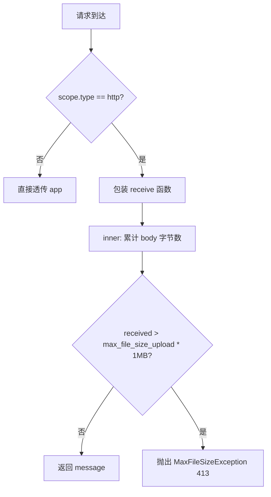
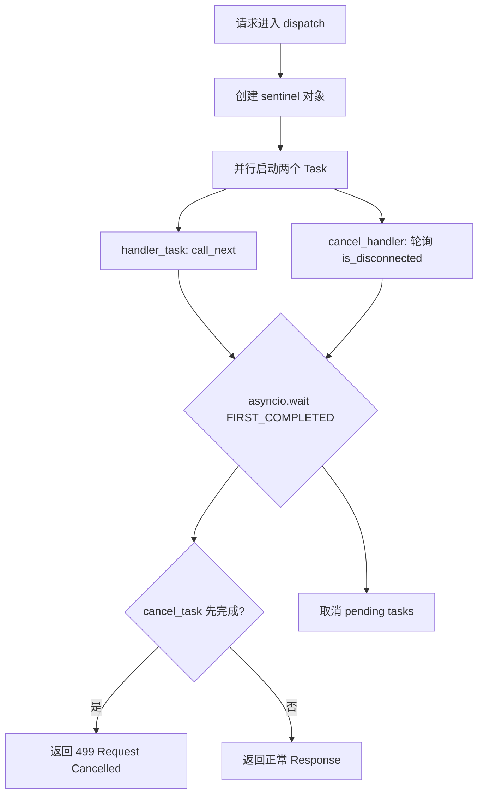
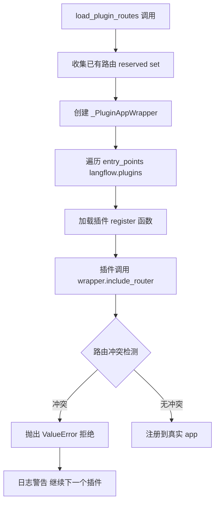

# PD-10.14 Langflow — FastAPI 多层中间件过滤链与插件路由防护

> 文档编号：PD-10.14
> 来源：Langflow `src/backend/base/langflow/main.py`, `src/backend/base/langflow/middleware.py`, `src/backend/base/langflow/plugin_routes.py`
> GitHub：https://github.com/langflow-ai/langflow.git
> 问题域：PD-10 中间件管道 Middleware Pipeline
> 状态：可复用方案

---

## 第 1 章 问题与动机

### 1.1 核心问题

Web 应用的请求管道需要在请求到达业务逻辑之前和响应返回客户端之前，执行一系列横切关注点：上传大小限制、客户端断连检测、Content-Type 修正、CORS 跨域控制、multipart 边界校验、查询参数归一化等。这些关注点如果散落在各个路由处理函数中，会导致代码重复、维护困难、安全漏洞遗漏。

Langflow 作为一个可视化 LLM 工作流编排平台，面临额外挑战：
- **文件上传场景频繁**：用户上传知识库文件、Flow JSON、组件包，需要严格的大小限制
- **长时间运行请求**：LLM 推理和 Flow 执行可能耗时数分钟，客户端可能中途断连
- **插件生态**：企业插件通过 entry_point 注册路由，必须防止插件覆盖核心路由
- **可观测性**：OpenTelemetry + Prometheus + Sentry 三层监控需要无侵入集成

### 1.2 Langflow 的解法概述

Langflow 基于 FastAPI/Starlette 的中间件机制，构建了一个 **6 层请求过滤链 + 插件路由防护包装器** 的管道架构：

1. **双基类中间件体系**：ASGI 原生中间件（`ContentSizeLimitMiddleware`）和 Starlette `BaseHTTPMiddleware`（`RequestCancelledMiddleware`、`JavaScriptMIMETypeMiddleware`）混合使用，按需选择抽象层级（`main.py:79-124`）
2. **配置驱动条件激活**：Sentry、Prometheus、MCP Server 等中间件通过 Pydantic Settings 模型的布尔开关控制是否加载（`main.py:497-516`）
3. **函数式中间件**：`@app.middleware("http")` 装饰器注册轻量级请求过滤器，用于 multipart 边界校验和查询参数归一化（`main.py:452-495`）
4. **插件路由防护**：`_PluginAppWrapper` 包装器拦截插件的路由注册，防止覆盖已有路由（`plugin_routes.py:31-97`）
5. **全局异常兜底**：`@app.exception_handler(Exception)` 捕获所有未处理异常，统一返回 JSON 并上报遥测（`main.py:525-540`）

### 1.3 设计思想

| 设计原则 | 具体实现 | 理由 | 替代方案 |
|----------|----------|------|----------|
| 按需选择抽象层级 | ASGI 原生 vs BaseHTTPMiddleware | ContentSizeLimit 需要拦截 receive，必须用 ASGI 原生；其他用 BaseHTTPMiddleware 更简洁 | 全部用 ASGI 原生（代码冗长） |
| 配置驱动激活 | Pydantic Settings + 环境变量控制 Sentry/Prometheus/MCP | 不同部署环境需要不同中间件组合，避免硬编码 | 代码中 if/else 硬编码 |
| 防御性插件隔离 | _PluginAppWrapper 路由冲突检测 | 企业插件不可信，必须防止覆盖核心路由 | 信任插件（安全风险） |
| 异步断连检测 | asyncio.wait + sentinel 竞赛模式 | 长时间 LLM 推理期间客户端可能断连，避免浪费计算资源 | 忽略断连（资源浪费） |
| 设置懒加载 | ContentSizeLimitMiddleware 在 receive 时才读取 max_file_size | 允许运行时动态修改上传限制，无需重启 | 构造时固定值 |

---

## 第 2 章 源码实现分析

### 2.1 架构概览

Langflow 的请求管道由 `create_app()` 函数在 `main.py:414-546` 中组装，中间件按 FastAPI 的 LIFO 栈顺序执行：

```
请求入站方向（从外到内）：
┌─────────────────────────────────────────────────────┐
│  Layer 6: SentryAsgiMiddleware (条件激活)             │
│  Layer 5: ContentSizeLimitMiddleware (ASGI 原生)      │
│  Layer 4: CORSMiddleware (Starlette 内置)             │
│  Layer 3: JavaScriptMIMETypeMiddleware (BaseHTTP)     │
│  Layer 2: check_boundary (函数式 @middleware)          │
│  Layer 1: flatten_query_string_lists (函数式)          │
│  ┌─────────────────────────────────────────────────┐ │
│  │  FastAPI Router + Exception Handler              │ │
│  │  + FastAPIInstrumentor (OpenTelemetry)            │ │
│  │  + Plugin Routes (_PluginAppWrapper)              │ │
│  └─────────────────────────────────────────────────┘ │
└─────────────────────────────────────────────────────┘
```

注意：FastAPI 的 `add_middleware` 是 LIFO 栈——最后添加的最先执行。因此 `ContentSizeLimitMiddleware`（第一个 add）实际在 CORS 之后执行，而 Sentry（最后 add）最先执行。

### 2.2 核心实现

#### 2.2.1 ASGI 原生中间件：ContentSizeLimitMiddleware



对应源码 `middleware.py:13-59`：

```python
class ContentSizeLimitMiddleware:
    def __init__(self, app):
        self.app = app
        self.logger = logger

    @staticmethod
    def receive_wrapper(receive):
        received = 0
        async def inner():
            max_file_size_upload = get_settings_service().settings.max_file_size_upload
            nonlocal received
            message = await receive()
            if message["type"] != "http.request" or max_file_size_upload is None:
                return message
            body_len = len(message.get("body", b""))
            received += body_len
            if received > max_file_size_upload * 1024 * 1024:
                received_in_mb = round(received / (1024 * 1024), 3)
                msg = (f"Content size limit exceeded. Maximum allowed is "
                       f"{max_file_size_upload}MB and got {received_in_mb}MB.")
                raise MaxFileSizeException(msg)
            return message
        return inner

    async def __call__(self, scope, receive, send):
        if scope["type"] != "http":
            await self.app(scope, receive, send)
            return
        wrapper = self.receive_wrapper(receive)
        await self.app(scope, wrapper, send)
```

关键设计：**每次 receive 调用时动态读取 `max_file_size_upload`**（`middleware.py:34`），而非构造时固定。这意味着管理员可以通过修改配置实时调整上传限制，无需重启服务。

#### 2.2.2 异步断连检测：RequestCancelledMiddleware



对应源码 `main.py:79-102`：

```python
class RequestCancelledMiddleware(BaseHTTPMiddleware):
    async def dispatch(self, request: Request, call_next: RequestResponseEndpoint) -> Response:
        sentinel = object()

        async def cancel_handler():
            while True:
                if await request.is_disconnected():
                    return sentinel
                await asyncio.sleep(0.1)

        handler_task = asyncio.create_task(call_next(request))
        cancel_task = asyncio.create_task(cancel_handler())

        done, pending = await asyncio.wait(
            [handler_task, cancel_task], return_when=asyncio.FIRST_COMPLETED
        )
        for task in pending:
            task.cancel()

        if cancel_task in done:
            return Response("Request was cancelled", status_code=499)
        return await handler_task
```

关键设计：使用 **asyncio.wait 竞赛模式**，每 100ms 轮询客户端连接状态。当客户端断连时，返回非标准 HTTP 499 状态码（Nginx 约定），并取消正在执行的 handler task，释放 LLM 推理等昂贵计算资源。

#### 2.2.3 插件路由防护：_PluginAppWrapper



对应源码 `plugin_routes.py:31-64`：

```python
class _PluginAppWrapper:
    def __init__(self, app: FastAPI, reserved: set[tuple[str, str]]) -> None:
        self._app = app
        self._reserved = set(reserved)

    def _check_and_reserve(self, path: str, methods: set[str]) -> None:
        for method in methods:
            if method == "HEAD":
                continue
            key = (path, method)
            if key in self._reserved:
                msg = f"Plugin route conflicts with existing route: {path} [{method}]"
                raise ValueError(msg)
            self._reserved.add(key)

    def include_router(self, router, prefix: str = "", **kwargs) -> None:
        router_prefix = getattr(router, "prefix", "") or ""
        base = (prefix or "") + router_prefix
        for route in router.routes:
            if hasattr(route, "path") and hasattr(route, "methods"):
                full_path = base + route.path
                self._check_and_reserve(full_path, set(route.methods))
            elif hasattr(route, "path"):
                full_path = base + route.path
                self._check_and_reserve(full_path, {"*"})
        self._app.include_router(router, prefix=prefix, **kwargs)
```

关键设计：**代理模式 + 路由冲突检测**。插件拿到的不是真实的 FastAPI app，而是一个只暴露路由注册方法的包装器。每次注册前检查 `(path, method)` 是否已被占用，防止插件覆盖核心 API。

### 2.3 实现细节

**中间件注册顺序与配置驱动激活**（`main.py:414-546`）：

```python
def create_app():
    app = FastAPI(title="Langflow", version=__version__, lifespan=lifespan)

    # Layer 1: 上传大小限制（ASGI 原生，始终激活）
    app.add_middleware(ContentSizeLimitMiddleware)

    # Layer 2: Sentry 错误追踪（条件激活）
    setup_sentry(app)  # 内部检查 settings.sentry_dsn

    # Layer 3: CORS 跨域控制（始终激活，参数可配置）
    app.add_middleware(CORSMiddleware, allow_origins=origins, ...)

    # Layer 4: JS MIME 类型修正（始终激活）
    app.add_middleware(JavaScriptMIMETypeMiddleware)

    # Layer 5-6: 函数式中间件（始终激活）
    @app.middleware("http")
    async def check_boundary(request, call_next): ...

    @app.middleware("http")
    async def flatten_query_string_lists(request, call_next): ...

    # 条件激活: Prometheus
    if settings.prometheus_enabled:
        start_http_server(settings.prometheus_port)

    # 条件激活: MCP Server 路由
    if settings.mcp_server_enabled:
        router.include_router(mcp_router)

    # 插件路由（防护包装器）
    load_plugin_routes(app)

    # OpenTelemetry 自动插桩
    FastAPIInstrumentor.instrument_app(app)
```

**Sentry 条件激活**（`main.py:549-560`）：

```python
def setup_sentry(app: FastAPI) -> None:
    settings = get_settings_service().settings
    if settings.sentry_dsn:
        import sentry_sdk
        from sentry_sdk.integrations.asgi import SentryAsgiMiddleware
        sentry_sdk.init(
            dsn=settings.sentry_dsn,
            traces_sample_rate=settings.sentry_traces_sample_rate,
            profiles_sample_rate=settings.sentry_profiles_sample_rate,
        )
        app.add_middleware(SentryAsgiMiddleware)
```

Sentry SDK 和中间件仅在 `sentry_dsn` 配置存在时才 import 和注册，实现了**零开销条件激活**——未配置时连模块都不加载。

---

## 第 3 章 迁移指南

### 3.1 迁移清单

**阶段 1：基础中间件管道**
- [ ] 创建 ASGI 原生中间件基类（用于需要拦截 receive/send 的场景）
- [ ] 创建 BaseHTTPMiddleware 子类（用于简单的 request/response 拦截）
- [ ] 在 `create_app()` 中按依赖顺序注册中间件
- [ ] 添加全局异常处理器兜底

**阶段 2：配置驱动激活**
- [ ] 定义 Pydantic Settings 模型，包含各中间件的开关字段
- [ ] 在 `create_app()` 中根据配置条件注册中间件
- [ ] 支持环境变量覆盖（`LANGFLOW_CORS_ORIGINS` 等）

**阶段 3：插件路由防护**
- [ ] 实现 `_PluginAppWrapper` 代理类
- [ ] 通过 `entry_points` 发现和加载插件
- [ ] 路由冲突检测和拒绝机制

**阶段 4：可观测性集成**
- [ ] OpenTelemetry FastAPI 自动插桩
- [ ] Prometheus 指标暴露（条件激活）
- [ ] Sentry 错误追踪（条件激活）

### 3.2 适配代码模板

#### 模板 1：ASGI 原生中间件（拦截 receive）

```python
from fastapi import HTTPException

class BodySizeLimitMiddleware:
    """ASGI 原生中间件：限制请求体大小。
    适用于需要在 receive 层拦截的场景。"""

    def __init__(self, app, max_size_mb: int = 100):
        self.app = app
        self.max_size_mb = max_size_mb

    def _wrap_receive(self, receive):
        received = 0
        max_bytes = self.max_size_mb * 1024 * 1024

        async def inner():
            nonlocal received
            message = await receive()
            if message["type"] == "http.request":
                received += len(message.get("body", b""))
                if received > max_bytes:
                    raise HTTPException(
                        status_code=413,
                        detail=f"Body exceeds {self.max_size_mb}MB limit"
                    )
            return message
        return inner

    async def __call__(self, scope, receive, send):
        if scope["type"] != "http":
            await self.app(scope, receive, send)
            return
        await self.app(scope, self._wrap_receive(receive), send)
```

#### 模板 2：竞赛式断连检测中间件

```python
import asyncio
from starlette.middleware.base import BaseHTTPMiddleware
from starlette.requests import Request
from starlette.responses import Response

class DisconnectDetectionMiddleware(BaseHTTPMiddleware):
    """检测客户端断连，提前终止长时间请求。"""

    def __init__(self, app, poll_interval: float = 0.1):
        super().__init__(app)
        self.poll_interval = poll_interval

    async def dispatch(self, request: Request, call_next):
        async def poll_disconnect():
            while True:
                if await request.is_disconnected():
                    return True
                await asyncio.sleep(self.poll_interval)

        handler = asyncio.create_task(call_next(request))
        detector = asyncio.create_task(poll_disconnect())

        done, pending = await asyncio.wait(
            [handler, detector], return_when=asyncio.FIRST_COMPLETED
        )
        for t in pending:
            t.cancel()

        if detector in done:
            return Response("Client disconnected", status_code=499)
        return await handler
```

#### 模板 3：插件路由防护包装器

```python
from importlib.metadata import entry_points
from fastapi import FastAPI

class SafePluginWrapper:
    """防止插件覆盖核心路由的代理包装器。"""

    def __init__(self, app: FastAPI):
        self._app = app
        self._reserved = {
            (r.path, m)
            for r in app.router.routes
            if hasattr(r, "path") and hasattr(r, "methods")
            for m in r.methods if m != "HEAD"
        }

    def include_router(self, router, prefix="", **kwargs):
        base = (prefix or "") + (getattr(router, "prefix", "") or "")
        for route in router.routes:
            if hasattr(route, "path") and hasattr(route, "methods"):
                for method in route.methods:
                    key = (base + route.path, method)
                    if key in self._reserved:
                        raise ValueError(f"Route conflict: {key}")
                    self._reserved.add(key)
        self._app.include_router(router, prefix=prefix, **kwargs)

def load_plugins(app: FastAPI, group: str = "myapp.plugins"):
    wrapper = SafePluginWrapper(app)
    for ep in entry_points(group=group):
        try:
            ep.load()(wrapper)
        except ValueError as e:
            print(f"Plugin {ep.name} rejected: {e}")
        except Exception as e:
            print(f"Plugin {ep.name} failed: {e}")
```

### 3.3 适用场景

| 场景 | 适用度 | 说明 |
|------|--------|------|
| FastAPI/Starlette Web 应用 | ⭐⭐⭐ | 直接复用，无需适配 |
| 有插件/扩展生态的平台 | ⭐⭐⭐ | _PluginAppWrapper 模式高度可移植 |
| LLM 推理服务（长请求） | ⭐⭐⭐ | 断连检测避免浪费 GPU 资源 |
| 文件上传密集型应用 | ⭐⭐⭐ | ASGI 原生 receive 拦截最高效 |
| 非 Python Web 框架 | ⭐ | 思想可借鉴，代码需重写 |
| 微服务网关层 | ⭐⭐ | 部分功能与 API Gateway 重叠 |

---

## 第 4 章 测试用例

```python
import asyncio
import pytest
from unittest.mock import AsyncMock, MagicMock, patch
from starlette.testclient import TestClient
from fastapi import FastAPI
from fastapi.responses import JSONResponse


class TestContentSizeLimitMiddleware:
    """测试 ASGI 原生上传大小限制中间件。"""

    def test_small_body_passes(self):
        """小于限制的请求体应正常通过。"""
        from langflow.middleware import ContentSizeLimitMiddleware

        app = FastAPI()
        app.add_middleware(ContentSizeLimitMiddleware)

        @app.post("/upload")
        async def upload():
            return {"status": "ok"}

        with patch("langflow.middleware.get_settings_service") as mock_settings:
            mock_settings.return_value.settings.max_file_size_upload = 10  # 10MB
            client = TestClient(app)
            response = client.post("/upload", content=b"x" * 1024)
            assert response.status_code == 200

    def test_oversized_body_rejected(self):
        """超过限制的请求体应返回 413。"""
        from langflow.middleware import ContentSizeLimitMiddleware

        app = FastAPI()
        app.add_middleware(ContentSizeLimitMiddleware)

        @app.post("/upload")
        async def upload():
            return {"status": "ok"}

        with patch("langflow.middleware.get_settings_service") as mock_settings:
            mock_settings.return_value.settings.max_file_size_upload = 0  # 0MB
            client = TestClient(app, raise_server_exceptions=False)
            response = client.post("/upload", content=b"x" * 1024 * 1024)
            assert response.status_code == 413

    def test_none_limit_allows_all(self):
        """max_file_size_upload 为 None 时不限制。"""
        from langflow.middleware import ContentSizeLimitMiddleware

        app = FastAPI()
        app.add_middleware(ContentSizeLimitMiddleware)

        @app.post("/upload")
        async def upload():
            return {"status": "ok"}

        with patch("langflow.middleware.get_settings_service") as mock_settings:
            mock_settings.return_value.settings.max_file_size_upload = None
            client = TestClient(app)
            response = client.post("/upload", content=b"x" * 10 * 1024 * 1024)
            assert response.status_code == 200


class TestPluginRouteProtection:
    """测试插件路由防护包装器。"""

    def test_conflict_detection(self):
        """插件注册与核心路由冲突时应抛出 ValueError。"""
        from langflow.plugin_routes import _PluginAppWrapper

        app = FastAPI()

        @app.get("/api/v1/health")
        async def health():
            return {"status": "ok"}

        reserved = {("/api/v1/health", "GET")}
        wrapper = _PluginAppWrapper(app, reserved)

        from fastapi import APIRouter
        plugin_router = APIRouter()

        @plugin_router.get("/api/v1/health")
        async def plugin_health():
            return {"status": "plugin"}

        with pytest.raises(ValueError, match="conflicts with existing route"):
            wrapper.include_router(plugin_router)

    def test_non_conflicting_route_accepted(self):
        """不冲突的插件路由应正常注册。"""
        from langflow.plugin_routes import _PluginAppWrapper

        app = FastAPI()
        reserved = {("/api/v1/health", "GET")}
        wrapper = _PluginAppWrapper(app, reserved)

        from fastapi import APIRouter
        plugin_router = APIRouter()

        @plugin_router.get("/api/v1/plugin-feature")
        async def plugin_feature():
            return {"status": "ok"}

        # 不应抛出异常
        wrapper.include_router(plugin_router)


class TestRequestCancelledMiddleware:
    """测试异步断连检测中间件。"""

    @pytest.mark.asyncio
    async def test_normal_request_completes(self):
        """正常请求应返回正常响应。"""
        from langflow.main import RequestCancelledMiddleware

        app = FastAPI()
        app.add_middleware(RequestCancelledMiddleware)

        @app.get("/slow")
        async def slow():
            await asyncio.sleep(0.01)
            return {"status": "done"}

        client = TestClient(app)
        response = client.get("/slow")
        assert response.status_code == 200
```

---

## 第 5 章 跨域关联

| 关联域 | 关系类型 | 说明 |
|--------|----------|------|
| PD-03 容错与重试 | 协同 | `RequestCancelledMiddleware` 是容错体系的一部分，检测客户端断连后主动取消任务，避免资源浪费 |
| PD-04 工具系统 | 协同 | 插件路由防护（`_PluginAppWrapper`）本质上是工具/插件注册系统的安全层，防止插件覆盖核心 API |
| PD-05 沙箱隔离 | 协同 | `ContentSizeLimitMiddleware` 是资源隔离的一种形式，限制单次上传的内存消耗 |
| PD-11 可观测性 | 依赖 | 全局异常处理器将未捕获异常上报到 Telemetry Service；OpenTelemetry `FastAPIInstrumentor` 自动追踪所有请求；Prometheus 指标通过条件激活的独立 HTTP 端口暴露 |
| PD-08 搜索与检索 | 协同 | `flatten_query_string_lists` 中间件归一化查询参数，确保搜索 API 的逗号分隔列表参数被正确解析 |

---

## 第 6 章 来源文件索引

| 文件 | 行范围 | 关键实现 |
|------|--------|----------|
| `src/backend/base/langflow/middleware.py` | L1-L60 | `ContentSizeLimitMiddleware` ASGI 原生中间件 + `MaxFileSizeException` |
| `src/backend/base/langflow/main.py` | L79-L102 | `RequestCancelledMiddleware` 异步断连检测 |
| `src/backend/base/langflow/main.py` | L105-L124 | `JavaScriptMIMETypeMiddleware` Content-Type 修正 |
| `src/backend/base/langflow/main.py` | L414-L546 | `create_app()` 中间件注册顺序 + 条件激活逻辑 |
| `src/backend/base/langflow/main.py` | L452-L495 | 函数式中间件：`check_boundary` + `flatten_query_string_lists` |
| `src/backend/base/langflow/main.py` | L525-L540 | 全局异常处理器 + 遥测上报 |
| `src/backend/base/langflow/main.py` | L549-L560 | `setup_sentry()` 条件激活 Sentry 中间件 |
| `src/backend/base/langflow/plugin_routes.py` | L31-L97 | `_PluginAppWrapper` 插件路由防护代理 |
| `src/backend/base/langflow/plugin_routes.py` | L100-L139 | `load_plugin_routes()` entry_point 插件发现与加载 |
| `src/lfx/src/lfx/services/settings/base.py` | L222-L231 | CORS 配置字段定义 |
| `src/lfx/src/lfx/services/settings/base.py` | L271 | `max_file_size_upload` 配置字段 |
| `src/lfx/src/lfx/services/settings/base.py` | L157-L160 | Prometheus 配置字段 |
| `src/lfx/src/lfx/services/settings/base.py` | L184-L186 | Sentry 配置字段 |
| `src/backend/base/langflow/services/telemetry/opentelemetry.py` | L108-L178 | `OpenTelemetry` 单例 + Prometheus MetricReader |

---

## 第 7 章 横向对比维度

> **重要：** 本章用于自动填充 Butcher Wiki 的横向对比表。

```json comparison_data
{
  "project": "Langflow",
  "dimensions": {
    "中间件基类": "双基类混合：ASGI 原生（ContentSizeLimit）+ Starlette BaseHTTPMiddleware + @app.middleware 函数式",
    "钩子点": "receive 拦截（上传限制）、dispatch 拦截（断连/MIME）、全局 exception_handler",
    "中间件数量": "6 层：ContentSize + Sentry(条件) + CORS + MIME + boundary校验 + 查询归一化",
    "条件激活": "Pydantic Settings 布尔开关：sentry_dsn/prometheus_enabled/mcp_server_enabled",
    "状态管理": "闭包累加器（receive_wrapper.received）+ Settings Service 全局单例",
    "执行模型": "ASGI LIFO 栈 + asyncio.wait 竞赛（断连检测）",
    "错误隔离": "全局 exception_handler 兜底 + 插件加载 try/except 隔离",
    "可观测性": "OpenTelemetry FastAPIInstrumentor 自动插桩 + Prometheus 条件端口 + Sentry 条件集成",
    "懒初始化策略": "receive 时动态读取 max_file_size_upload，支持运行时修改无需重启",
    "并发限流": "ContentSizeLimitMiddleware 按请求累计字节数限流，非全局限流",
    "数据传递": "scope dict 透传 + request.query_params 原地修改（flatten_query_string_lists）",
    "超时保护": "asyncio.wait + 100ms 轮询断连检测，返回 499 状态码"
  }
}
```

### 域元数据补充

```json domain_metadata
{
  "solution_summary": "Langflow 用 ASGI 原生 + BaseHTTPMiddleware + 函数式三种中间件混合构建 6 层过滤链，配合 _PluginAppWrapper 代理模式防止插件路由覆盖核心 API",
  "description": "Web 框架原生中间件栈与插件路由安全隔离的工程实践",
  "sub_problems": [
    "插件路由冲突检测：第三方插件注册路由时如何防止覆盖核心 API 端点",
    "客户端断连资源回收：长时间 LLM 推理期间客户端断连后如何取消计算任务",
    "ASGI receive 拦截 vs BaseHTTPMiddleware：何时选择低层 ASGI 原生 vs 高层抽象",
    "multipart 边界校验：上传请求的 boundary 格式验证防止畸形请求穿透"
  ],
  "best_practices": [
    "ASGI 原生中间件适合 receive/send 拦截场景，BaseHTTPMiddleware 适合 request/response 拦截",
    "插件路由注册必须通过代理包装器，收集已有路由集合后逐一冲突检测",
    "配置驱动的中间件激活应延迟 import，未启用时零开销（如 Sentry SDK）",
    "断连检测用 asyncio.wait 竞赛模式，轮询间隔 100ms 平衡灵敏度与 CPU 开销"
  ]
}
```
