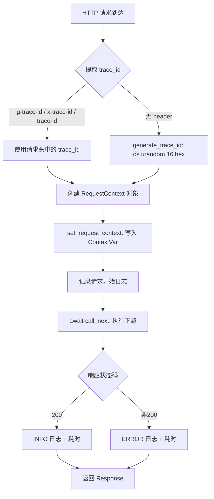
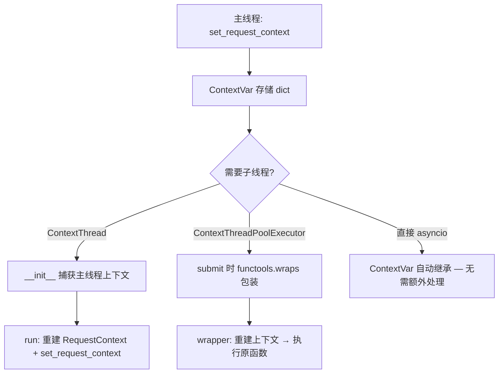
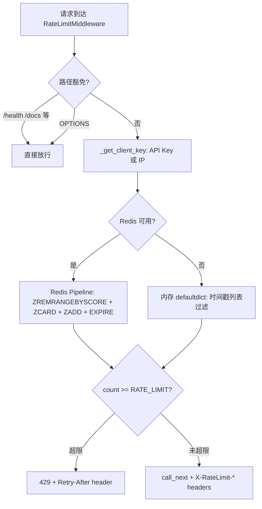

# PD-10.NN MemOS — ContextVar 四层中间件管道与 Redis 滑动窗口限流

> 文档编号：PD-10.NN
> 来源：MemOS `src/memos/api/middleware/`, `src/memos/context/context.py`, `src/memos/log.py`
> GitHub：https://github.com/MemTensor/MemOS.git
> 问题域：PD-10 中间件管道 Middleware Pipeline
> 状态：可复用方案

---

## 第 1 章 问题与动机

### 1.1 核心问题

MemOS 是一个记忆操作系统（Memory Operating System），提供多用户记忆存储、检索和对话能力。作为一个多 API 入口（start_api / server_api / product_api / server_api_ext）的 FastAPI 服务，它面临三个中间件层面的核心挑战：

1. **请求级上下文传播**：每个请求需要携带 trace_id、用户身份、环境标识等元数据，且这些数据必须在异步处理链和子线程中保持可见——Python 的 `threading.local()` 在 asyncio 环境下失效，需要 `ContextVar` 方案。

2. **多入口一致性**：四个 FastAPI app 实例（start_api、server_api、product_api、server_api_ext）需要共享同一套上下文注入逻辑，但各自的 source 标识不同（用于区分请求来源）。

3. **安全防护分层**：生产部署（Krolik 扩展）需要在基础中间件之上叠加 CORS、安全头、限流、认证四层防护，且限流必须在认证之前执行（防暴力破解），认证通过 FastAPI 依赖注入而非中间件实现（更细粒度的路由级控制）。

### 1.2 MemOS 的解法概述

1. **ContextVar 驱动的请求上下文**：`RequestContextMiddleware` 在每个请求入口创建 `RequestContext` 对象，通过 `contextvars.ContextVar` 存储，确保异步安全（`src/memos/api/middleware/request_context.py:29`）。

2. **ContextThread/ContextThreadPoolExecutor 跨线程传播**：自定义 `Thread` 和 `ThreadPoolExecutor` 子类，在 `submit()` 时捕获父线程上下文，在 worker 线程中重建（`src/memos/context/context.py:244`）。

3. **Redis 滑动窗口限流 + 内存回退**：`RateLimitMiddleware` 优先使用 Redis Sorted Set 实现分布式滑动窗口，Redis 不可用时自动降级为进程内 `defaultdict(list)` 限流（`src/memos/api/middleware/rate_limit.py:77`）。

4. **认证作为依赖注入而非中间件**：`verify_api_key` 是 FastAPI `Depends` 依赖，`require_scope()` 是依赖工厂——这让认证可以按路由粒度控制，而非全局拦截（`src/memos/api/middleware/auth.py:157`）。

5. **日志系统深度集成**：`ContextFilter` 日志过滤器从 ContextVar 读取 trace_id 等字段注入每条日志，`CustomLoggerRequestHandler` 异步推送日志到外部服务（`src/memos/log.py:44`）。

### 1.3 设计思想

| 设计原则 | 具体实现 | 理由 | 替代方案 |
|----------|----------|------|----------|
| ContextVar 替代 thread-local | `_request_context: ContextVar[dict]` 存储请求上下文 | asyncio 协程切换时 thread-local 会丢失上下文 | Flask g 对象（仅限同步）、Starlette State（仅限 Request 对象可达处） |
| 懒初始化外部依赖 | Redis 客户端和 PostgreSQL 连接池均在首次使用时创建 | 避免启动时外部服务不可用导致进程崩溃 | 启动时强制连接（fail-fast）、健康检查探针 |
| 限流先于认证 | `add_middleware(RateLimitMiddleware)` 在 auth 之前注册 | 防止未认证请求通过暴力破解消耗认证资源 | 认证后限流（无法防暴力破解）、网关层限流（需额外基础设施） |
| 认证用依赖注入而非中间件 | `Depends(verify_api_key)` 按路由挂载 | 不同路由需要不同 scope（read/write/admin），中间件粒度太粗 | 全局认证中间件 + 路由白名单 |
| 环境变量驱动条件激活 | `RATE_LIMIT_ENABLED`、`AUTH_ENABLED` 控制功能开关 | 开发环境无需限流和认证，生产环境按需开启 | 配置文件、Feature Flag 服务 |

---

## 第 2 章 源码实现分析

### 2.1 架构概览

MemOS 的中间件管道分为两层：基础层（所有 API 入口共享）和扩展层（Krolik 生产部署专用）。

```
请求入口
  │
  ▼
┌─────────────────────────────────────────────────────┐
│              server_api_ext.py (Krolik 扩展)          │
│  ┌───────────────┐  ┌──────────────────┐            │
│  │ CORSMiddleware │→│SecurityHeaders   │            │
│  │ (Starlette)    │  │Middleware        │            │
│  └───────────────┘  └──────────────────┘            │
│          │                    │                      │
│          ▼                    ▼                      │
│  ┌──────────────────────────────────┐               │
│  │ RateLimitMiddleware (条件激活)    │               │
│  │ Redis 滑动窗口 → 内存回退        │               │
│  └──────────────────────────────────┘               │
└─────────────────────────────────────────────────────┘
  │
  ▼
┌─────────────────────────────────────────────────────┐
│              基础层 (所有 API 入口)                    │
│  ┌──────────────────────────────────────────┐       │
│  │ RequestContextMiddleware                  │       │
│  │ trace_id 提取/生成 → RequestContext 注入   │       │
│  │ → ContextVar 存储 → 请求耗时日志          │       │
│  └──────────────────────────────────────────┘       │
└─────────────────────────────────────────────────────┘
  │
  ▼
┌─────────────────────────────────────────────────────┐
│              路由层 (FastAPI Depends)                 │
│  ┌────────────────┐  ┌──────────────┐               │
│  │ verify_api_key  │→│require_scope │               │
│  │ (认证依赖)      │  │(授权工厂)    │               │
│  └────────────────┘  └──────────────┘               │
└─────────────────────────────────────────────────────┘
  │
  ▼
  路由处理函数 → ContextThread/ContextThreadPoolExecutor
                  (子线程自动继承上下文)
```

四个 API 入口的中间件配置差异：

| 入口 | RequestContext | CORS | SecurityHeaders | RateLimit | Auth |
|------|:---:|:---:|:---:|:---:|:---:|
| start_api | ✅ source="api" | ✗ | ✗ | ✗ | ✗ |
| server_api | ✅ source="server_api" | ✗ | ✗ | ✗ | ✗ |
| product_api | ✅ source="product_api" | ✗ | ✗ | ✗ | ✗ |
| server_api_ext | ✗ (无显式注册) | ✅ | ✅ | ✅ (条件) | ✅ (Depends) |

### 2.2 核心实现

#### 2.2.1 RequestContextMiddleware — 请求上下文注入



对应源码 `src/memos/api/middleware/request_context.py:29-101`：

```python
class RequestContextMiddleware(BaseHTTPMiddleware):
    def __init__(self, app, source: str | None = None):
        super().__init__(app)
        self.source = source or "api"

    async def dispatch(self, request: Request, call_next: Callable) -> Response:
        trace_id = extract_trace_id_from_headers(request) or generate_trace_id()
        env = request.headers.get("x-env")
        user_type = request.headers.get("x-user-type")
        user_name = request.headers.get("x-user-name")
        start_time = time.time()

        context = RequestContext(
            trace_id=trace_id, api_path=request.url.path,
            env=env, user_type=user_type, user_name=user_name,
            source=self.source,
        )
        set_request_context(context)
        # ... 日志 + call_next + 耗时统计
```

关键设计点：
- **trace_id 优先级链**：`g-trace-id > x-trace-id > trace-id`，兼容 Google Cloud Trace 和自定义 header（`request_context.py:22-26`）
- **source 参数化**：同一中间件类通过构造参数区分不同 API 入口来源（`request_context.py:39`）
- **耗时统计内置**：每个请求自动记录 `cost: Xms`，无需额外中间件（`request_context.py:76-94`）

#### 2.2.2 ContextVar 上下文存储与跨线程传播



对应源码 `src/memos/context/context.py:244-277`：

```python
class ContextThreadPoolExecutor(ThreadPoolExecutor):
    def submit(self, fn: Callable[..., T], *args: Any, **kwargs: Any) -> Any:
        main_trace_id = get_current_trace_id()
        main_api_path = get_current_api_path()
        main_env = get_current_env()
        main_user_type = get_current_user_type()
        main_user_name = get_current_user_name()
        main_context = get_current_context()

        @functools.wraps(fn)
        def wrapper(*args: Any, **kwargs: Any) -> Any:
            if main_context:
                child_context = RequestContext(
                    trace_id=main_trace_id, api_path=main_api_path,
                    env=main_env, user_type=main_user_type,
                    user_name=main_user_name,
                )
                child_context._data = main_context._data.copy()
                set_request_context(child_context)
            return fn(*args, **kwargs)

        return super().submit(wrapper, *args, **kwargs)
```

关键设计点：
- **深拷贝 `_data`**：`main_context._data.copy()` 确保子线程修改不影响主线程（`context.py:272`）
- **双入口覆盖**：同时覆盖 `submit()` 和 `map()`，确保所有线程池使用方式都能传播上下文（`context.py:279-313`）
- **RequestContext 的 `__setattr__`/`__getattr__` 魔法**：非预定义字段自动存入 `_data` dict，提供类似 Flask `g` 的动态属性体验（`context.py:57-76`）

#### 2.2.3 Redis 滑动窗口限流



对应源码 `src/memos/api/middleware/rate_limit.py:77-119`：

```python
def _check_rate_limit_redis(key: str) -> tuple[bool, int, int]:
    redis_client = _get_redis()
    if not redis_client:
        return _check_rate_limit_memory(key)  # 自动降级
    try:
        now = time.time()
        window_start = now - RATE_WINDOW
        pipe = redis_client.pipeline()
        pipe.zremrangebyscore(key, 0, window_start)  # 清除过期条目
        pipe.zcard(key)                                # 当前窗口计数
        pipe.zadd(key, {str(now): now})                # 添加当前请求
        pipe.expire(key, RATE_WINDOW + 1)              # 设置 TTL
        results = pipe.execute()
        current_count = results[1]
        remaining = max(0, RATE_LIMIT - current_count - 1)
        reset_time = int(now + RATE_WINDOW)
        if current_count >= RATE_LIMIT:
            return False, 0, reset_time
        return True, remaining, reset_time
    except Exception as e:
        logger.warning(f"Redis rate limit error: {e}")
        return _check_rate_limit_memory(key)  # 异常也降级
```

关键设计点：
- **Pipeline 原子操作**：4 条 Redis 命令在一个 pipeline 中执行，减少网络往返（`rate_limit.py:92-106`）
- **双层降级**：`_get_redis()` 返回 None 时降级，pipeline 执行异常时也降级（`rate_limit.py:85-86, 117-119`）
- **客户端标识优先级**：API Key 前 20 字符 > X-Forwarded-For > client.host（`rate_limit.py:54-74`）
- **路径豁免集合**：`ClassVar[set[str]]` 定义免限流路径，O(1) 查找（`rate_limit.py:166`）

### 2.3 实现细节

#### 日志系统与上下文的深度集成

`ContextFilter`（`src/memos/log.py:44-61`）是一个 `logging.Filter`，在每条日志记录中注入 trace_id、env、user_type、user_name、api_path 五个字段。日志格式模板直接引用这些字段：

```
%(asctime)s | %(trace_id)s | path=%(api_path)s | env=%(env)s | ...
```

`CustomLoggerRequestHandler`（`src/memos/log.py:64-166`）是一个单例日志 Handler，通过 `ThreadPoolExecutor` 异步将日志推送到外部日志服务（URL 由 `CUSTOM_LOGGER_URL` 环境变量配置）。它在 `emit()` 中读取 ContextVar 获取 trace_id，确保外部日志与请求关联。

#### 认证的依赖注入模式

`verify_api_key`（`src/memos/api/middleware/auth.py:157-237`）不是中间件，而是 FastAPI 依赖。`require_scope()` 是依赖工厂，返回闭包：

```python
def require_scope(required_scope: str):
    async def scope_checker(auth: dict = Depends(verify_api_key)):
        scopes = auth.get("scopes", [])
        if "all" in scopes or required_scope in scopes:
            return auth
        raise HTTPException(status_code=403, ...)
    return scope_checker

require_read = require_scope("read")
require_write = require_scope("write")
require_admin = require_scope("admin")
```

这种模式让路由可以声明式地指定所需权限：`dependencies=[Depends(require_admin)]`。


---

## 第 3 章 迁移指南

### 3.1 迁移清单

**阶段 1：请求上下文基础设施**
- [ ] 创建 `RequestContext` 数据类，定义 trace_id、user_name 等字段
- [ ] 创建 `ContextVar[dict | None]` 全局变量
- [ ] 实现 `set_request_context()` / `get_current_*()` 访问函数
- [ ] 实现 `RequestContextMiddleware`，注册到 FastAPI app

**阶段 2：跨线程上下文传播**
- [ ] 实现 `ContextThreadPoolExecutor`，覆盖 `submit()` 和 `map()`
- [ ] 实现 `ContextThread`（如果项目使用原生 Thread）
- [ ] 替换项目中所有 `ThreadPoolExecutor` 为 `ContextThreadPoolExecutor`

**阶段 3：日志集成**
- [ ] 实现 `ContextFilter`，注入 trace_id 到日志记录
- [ ] 更新日志格式模板，添加 `%(trace_id)s` 等字段
- [ ] （可选）实现异步日志推送 Handler

**阶段 4：限流中间件（按需）**
- [ ] 实现 `RateLimitMiddleware`，支持 Redis + 内存双模式
- [ ] 配置环境变量：`RATE_LIMIT`、`RATE_WINDOW_SEC`、`REDIS_URL`
- [ ] 定义豁免路径集合

**阶段 5：认证依赖（按需）**
- [ ] 实现 `verify_api_key` 依赖函数
- [ ] 实现 `require_scope()` 依赖工厂
- [ ] 在路由上挂载 `Depends(require_read)` 等

### 3.2 适配代码模板

#### 最小可用的请求上下文系统

```python
"""request_context.py — 可直接复用的请求上下文模块"""
import os
import functools
from contextvars import ContextVar
from concurrent.futures import ThreadPoolExecutor
from typing import Any, TypeVar
from dataclasses import dataclass, field

from starlette.middleware.base import BaseHTTPMiddleware
from starlette.requests import Request
from starlette.responses import Response

T = TypeVar("T")

@dataclass
class RequestContext:
    trace_id: str = "unknown"
    api_path: str | None = None
    user_name: str | None = None
    source: str = "api"
    _data: dict[str, Any] = field(default_factory=dict)

    def set(self, key: str, value: Any) -> None:
        self._data[key] = value

    def get(self, key: str, default: Any = None) -> Any:
        return self._data.get(key, default)

_ctx_var: ContextVar[RequestContext | None] = ContextVar("request_ctx", default=None)

def set_context(ctx: RequestContext | None) -> None:
    _ctx_var.set(ctx)

def get_context() -> RequestContext | None:
    return _ctx_var.get()

def get_trace_id() -> str:
    ctx = _ctx_var.get()
    return ctx.trace_id if ctx else "no-trace"


class RequestContextMiddleware(BaseHTTPMiddleware):
    def __init__(self, app, source: str = "api"):
        super().__init__(app)
        self.source = source

    async def dispatch(self, request: Request, call_next) -> Response:
        trace_id = (
            request.headers.get("x-trace-id")
            or os.urandom(16).hex()
        )
        ctx = RequestContext(
            trace_id=trace_id,
            api_path=request.url.path,
            user_name=request.headers.get("x-user-name"),
            source=self.source,
        )
        set_context(ctx)
        response = await call_next(request)
        response.headers["X-Trace-Id"] = trace_id
        return response


class ContextThreadPoolExecutor(ThreadPoolExecutor):
    """自动传播 RequestContext 到 worker 线程"""
    def submit(self, fn, *args, **kwargs):
        parent_ctx = get_context()

        @functools.wraps(fn)
        def wrapper(*a, **kw):
            if parent_ctx:
                child = RequestContext(
                    trace_id=parent_ctx.trace_id,
                    api_path=parent_ctx.api_path,
                    user_name=parent_ctx.user_name,
                    source=parent_ctx.source,
                )
                child._data = parent_ctx._data.copy()
                set_context(child)
            return fn(*a, **kw)

        return super().submit(wrapper, *args, **kwargs)
```

#### Redis 滑动窗口限流模板

```python
"""rate_limiter.py — 可直接复用的限流中间件"""
import os
import time
from collections import defaultdict
from typing import ClassVar

from starlette.middleware.base import BaseHTTPMiddleware
from starlette.requests import Request
from starlette.responses import JSONResponse, Response

RATE_LIMIT = int(os.getenv("RATE_LIMIT", "100"))
RATE_WINDOW = int(os.getenv("RATE_WINDOW_SEC", "60"))

_redis = None
_memory: dict[str, list[float]] = defaultdict(list)

def _get_redis():
    global _redis
    if _redis is not None:
        return _redis
    try:
        import redis
        _redis = redis.from_url(os.getenv("REDIS_URL", "redis://localhost:6379"))
        _redis.ping()
        return _redis
    except Exception:
        return None

def _check_limit(key: str) -> tuple[bool, int]:
    r = _get_redis()
    if r:
        try:
            now = time.time()
            pipe = r.pipeline()
            pipe.zremrangebyscore(key, 0, now - RATE_WINDOW)
            pipe.zcard(key)
            pipe.zadd(key, {str(now): now})
            pipe.expire(key, RATE_WINDOW + 1)
            results = pipe.execute()
            count = results[1]
            return count < RATE_LIMIT, max(0, RATE_LIMIT - count - 1)
        except Exception:
            pass
    # 内存回退
    now = time.time()
    _memory[key] = [t for t in _memory[key] if t > now - RATE_WINDOW]
    if len(_memory[key]) >= RATE_LIMIT:
        return False, 0
    _memory[key].append(now)
    return True, RATE_LIMIT - len(_memory[key])


class RateLimitMiddleware(BaseHTTPMiddleware):
    EXEMPT: ClassVar[set[str]] = {"/health", "/docs"}

    async def dispatch(self, request: Request, call_next) -> Response:
        if request.url.path in self.EXEMPT or request.method == "OPTIONS":
            return await call_next(request)
        key = f"rl:{request.headers.get('Authorization', request.client.host)}"
        allowed, remaining = _check_limit(key)
        if not allowed:
            return JSONResponse(status_code=429, content={"detail": "Rate limited"})
        response = await call_next(request)
        response.headers["X-RateLimit-Remaining"] = str(remaining)
        return response
```

### 3.3 适用场景

| 场景 | 适用度 | 说明 |
|------|--------|------|
| FastAPI 多入口 API 服务 | ⭐⭐⭐ | 直接复用，source 参数区分入口 |
| 需要分布式限流的 API 网关 | ⭐⭐⭐ | Redis 滑动窗口方案成熟可靠 |
| 异步 + 多线程混合的 Python 服务 | ⭐⭐⭐ | ContextVar + ContextThreadPoolExecutor 完美解决 |
| 单体 Flask 应用 | ⭐⭐ | Flask 有自己的 g 对象，但跨线程传播仍可借鉴 |
| 纯 asyncio 无线程的服务 | ⭐⭐ | ContextVar 原生支持 asyncio，无需 ContextThread |
| 微服务网关（Go/Rust） | ⭐ | 设计思想可借鉴，但实现语言不同 |

---

## 第 4 章 测试用例

```python
"""test_memos_middleware.py — 基于 MemOS 真实函数签名的测试"""
import time
import pytest
from unittest.mock import MagicMock, patch
from collections import defaultdict
from concurrent.futures import Future

# ---- RequestContext 测试 ----

class TestRequestContext:
    """测试 src/memos/context/context.py 的 RequestContext"""

    def test_basic_attributes(self):
        from memos.context.context import RequestContext
        ctx = RequestContext(trace_id="abc-123", api_path="/search", env="prod")
        assert ctx.trace_id == "abc-123"
        assert ctx.api_path == "/search"
        assert ctx.env == "prod"

    def test_dynamic_data_via_set_get(self):
        from memos.context.context import RequestContext
        ctx = RequestContext(trace_id="t1")
        ctx.set("custom_key", "custom_value")
        assert ctx.get("custom_key") == "custom_value"
        assert ctx.get("missing", "default") == "default"

    def test_to_dict_includes_data(self):
        from memos.context.context import RequestContext
        ctx = RequestContext(trace_id="t2", user_name="alice")
        ctx.set("role", "admin")
        d = ctx.to_dict()
        assert d["trace_id"] == "t2"
        assert d["user_name"] == "alice"
        assert d["data"]["role"] == "admin"

    def test_context_var_isolation(self):
        """验证 ContextVar 在不同协程间隔离"""
        from memos.context.context import (
            RequestContext, set_request_context,
            get_current_trace_id,
        )
        set_request_context(RequestContext(trace_id="req-1"))
        assert get_current_trace_id() == "req-1"
        set_request_context(None)
        assert get_current_trace_id() is None


class TestContextThreadPoolExecutor:
    """测试 src/memos/context/context.py:244 的上下文传播"""

    def test_submit_propagates_trace_id(self):
        from memos.context.context import (
            RequestContext, set_request_context,
            get_current_trace_id, ContextThreadPoolExecutor,
        )
        set_request_context(RequestContext(trace_id="parent-trace"))
        captured = {}

        def worker():
            captured["trace_id"] = get_current_trace_id()

        with ContextThreadPoolExecutor(max_workers=1) as pool:
            future = pool.submit(worker)
            future.result()

        assert captured["trace_id"] == "parent-trace"

    def test_child_data_isolation(self):
        """子线程修改 _data 不影响主线程"""
        from memos.context.context import (
            RequestContext, set_request_context,
            get_current_context, ContextThreadPoolExecutor,
        )
        ctx = RequestContext(trace_id="iso-test")
        ctx.set("shared", "original")
        set_request_context(ctx)

        def worker():
            child_ctx = get_current_context()
            child_ctx.set("shared", "modified_by_child")

        with ContextThreadPoolExecutor(max_workers=1) as pool:
            pool.submit(worker).result()

        # 主线程上下文不受影响（因为 _data.copy()）
        assert get_current_context().get("shared") == "original"


# ---- RateLimitMiddleware 测试 ----

class TestRateLimitMemoryFallback:
    """测试 src/memos/api/middleware/rate_limit.py 的内存回退限流"""

    def test_allows_within_limit(self):
        from memos.api.middleware.rate_limit import _check_rate_limit_memory
        # 清理全局状态
        from memos.api.middleware import rate_limit
        rate_limit._memory_store = defaultdict(list)

        allowed, remaining, _ = _check_rate_limit_memory("test:key")
        assert allowed is True
        assert remaining == 99  # RATE_LIMIT(100) - 0 - 1

    def test_blocks_over_limit(self):
        from memos.api.middleware.rate_limit import (
            _check_rate_limit_memory, RATE_LIMIT,
        )
        from memos.api.middleware import rate_limit
        rate_limit._memory_store = defaultdict(list)

        # 填满限额
        now = time.time()
        rate_limit._memory_store["flood:key"] = [now] * RATE_LIMIT

        allowed, remaining, _ = _check_rate_limit_memory("flood:key")
        assert allowed is False
        assert remaining == 0

    def test_exempt_paths_bypass(self):
        from memos.api.middleware.rate_limit import RateLimitMiddleware
        assert "/health" in RateLimitMiddleware.EXEMPT_PATHS
        assert "/docs" in RateLimitMiddleware.EXEMPT_PATHS


# ---- Auth 依赖测试 ----

class TestAuthDependency:
    """测试 src/memos/api/middleware/auth.py 的认证逻辑"""

    def test_key_format_validation(self):
        from memos.api.middleware.auth import validate_key_format
        assert validate_key_format("krlk_" + "a" * 64) is True
        assert validate_key_format("krlk_" + "g" * 64) is False  # 非 hex
        assert validate_key_format("invalid_key") is False
        assert validate_key_format("") is False

    def test_hash_deterministic(self):
        from memos.api.middleware.auth import hash_api_key
        h1 = hash_api_key("test_key")
        h2 = hash_api_key("test_key")
        assert h1 == h2
        assert len(h1) == 64  # SHA-256 hex

    def test_require_scope_factory(self):
        """require_scope 返回可调用的依赖"""
        from memos.api.middleware.auth import require_scope
        checker = require_scope("admin")
        assert callable(checker)
```


---

## 第 5 章 跨域关联

| 关联域 | 关系类型 | 说明 |
|--------|----------|------|
| PD-01 上下文管理 | 协同 | RequestContext 通过 ContextVar 实现请求级上下文，与 PD-01 的 LLM 上下文窗口管理互补——PD-01 管 token 预算，PD-10 管请求元数据传播 |
| PD-03 容错与重试 | 协同 | RateLimitMiddleware 的 Redis→内存双层降级是 PD-03 容错模式的具体应用；`_get_redis()` 的懒初始化 + 异常捕获是典型的优雅降级 |
| PD-06 记忆持久化 | 依赖 | MemOS 的记忆 CRUD API 依赖 RequestContextMiddleware 注入的 trace_id 进行日志关联，记忆操作的可追溯性依赖中间件管道 |
| PD-07 质量检查 | 协同 | ContextFilter 将 trace_id 注入每条日志，使得质量检查和问题排查可以按请求维度聚合分析 |
| PD-11 可观测性 | 强依赖 | CustomLoggerRequestHandler 通过 ContextVar 读取 trace_id 推送到外部日志服务，RequestContextMiddleware 的耗时统计是可观测性的基础数据源 |

---

## 第 6 章 来源文件索引

| 文件 | 行范围 | 关键实现 |
|------|--------|----------|
| `src/memos/api/middleware/request_context.py` | L1-L101 | RequestContextMiddleware：trace_id 提取、RequestContext 创建、请求耗时日志 |
| `src/memos/context/context.py` | L1-L356 | RequestContext 数据类、ContextVar 存储、ContextThread、ContextThreadPoolExecutor、trace_id getter 注册 |
| `src/memos/api/middleware/rate_limit.py` | L1-L208 | RateLimitMiddleware：Redis 滑动窗口、内存回退、客户端标识、路径豁免 |
| `src/memos/api/middleware/auth.py` | L1-L269 | verify_api_key 依赖、require_scope 工厂、API Key 格式验证、PostgreSQL 查询、master key 支持 |
| `src/memos/api/middleware/__init__.py` | L1-L14 | 中间件模块导出：RateLimitMiddleware + auth 依赖 |
| `src/memos/api/server_api_ext.py` | L1-L125 | Krolik 扩展入口：CORS + SecurityHeaders + RateLimit 条件注册、异常处理器 |
| `src/memos/api/server_api.py` | L1-L52 | 基础 server API 入口：RequestContextMiddleware(source="server_api") |
| `src/memos/api/product_api.py` | L1-L39 | Product API 入口：RequestContextMiddleware(source="product_api") |
| `src/memos/api/start_api.py` | L76-L82 | 默认 API 入口：RequestContextMiddleware(source="api") |
| `src/memos/log.py` | L44-L61 | ContextFilter：从 ContextVar 注入 trace_id/env/user_type/user_name/api_path 到日志记录 |
| `src/memos/log.py` | L64-L166 | CustomLoggerRequestHandler：单例异步日志推送 Handler，读取 ContextVar 关联 trace_id |
| `src/memos/api/exceptions.py` | L1-L54 | APIExceptionHandler：统一异常处理（validation/value/http/global） |

---

## 第 7 章 横向对比维度

> **重要：** 本章用于自动填充 Butcher Wiki 的横向对比表。

```json comparison_data
{
  "project": "MemOS",
  "dimensions": {
    "中间件基类": "Starlette BaseHTTPMiddleware，dispatch + call_next 模式",
    "钩子点": "请求前（上下文注入）+ 请求后（耗时日志 + 状态码分类）",
    "中间件数量": "4 个：RequestContext / CORS / SecurityHeaders / RateLimit",
    "条件激活": "RATE_LIMIT_ENABLED 环境变量控制限流开关",
    "状态管理": "ContextVar[dict] 存储请求上下文，跨线程通过 ContextThreadPoolExecutor 传播",
    "执行模型": "Starlette 洋葱模型，CORS→SecurityHeaders→RateLimit→RequestContext→路由",
    "懒初始化策略": "Redis 客户端和 PostgreSQL 连接池均首次使用时创建，失败静默降级",
    "并发限流": "Redis Sorted Set 滑动窗口 + 进程内 defaultdict(list) 内存回退",
    "错误隔离": "限流异常自动降级内存模式，认证异常返回 401/403 不影响其他中间件",
    "数据传递": "ContextVar + RequestContext.to_dict() 序列化，子线程 _data.copy() 深拷贝",
    "装饰器包装": "认证用 FastAPI Depends 依赖注入而非中间件，require_scope() 工厂模式",
    "可观测性": "ContextFilter 注入 trace_id 到每条日志，CustomLoggerRequestHandler 异步推送外部服务",
    "超时保护": "RequestContextMiddleware 记录请求耗时但无硬超时，依赖 uvicorn/gunicorn 层面超时"
  }
}
```

### 域元数据补充

```json domain_metadata
{
  "solution_summary": "MemOS 用 ContextVar 驱动四层 BaseHTTPMiddleware 管道（RequestContext/CORS/SecurityHeaders/RateLimit），Redis Sorted Set 滑动窗口限流自动降级内存模式，ContextThreadPoolExecutor 实现跨线程上下文传播",
  "description": "多 API 入口共享中间件基础设施时的 source 参数化与条件激活策略",
  "sub_problems": [
    "ContextVar 跨线程传播：asyncio ContextVar 不自动传播到 ThreadPoolExecutor worker，需自定义 submit 包装",
    "多 API 入口 source 区分：同一中间件类通过构造参数标识请求来源（product_api vs server_api）",
    "限流客户端标识优先级：API Key 前缀 vs X-Forwarded-For vs client.host 的选择策略",
    "认证粒度选择：中间件级全局拦截 vs 依赖注入级路由粒度控制的权衡",
    "日志上下文注入：logging.Filter 从 ContextVar 读取字段注入日志记录的线程安全问题"
  ],
  "best_practices": [
    "限流先于认证注册：防止未认证请求通过暴力破解消耗认证数据库资源",
    "Redis 限流用 Pipeline 原子操作：ZREMRANGEBYSCORE+ZCARD+ZADD+EXPIRE 四命令一次往返",
    "ContextThreadPoolExecutor 深拷贝 _data：子线程修改不影响主线程上下文",
    "认证用依赖注入而非中间件：不同路由需要不同 scope 时，Depends 比全局中间件更灵活",
    "trace_id 多 header 优先级链：兼容 Google Cloud Trace（g-trace-id）和自定义 header"
  ]
}
```

