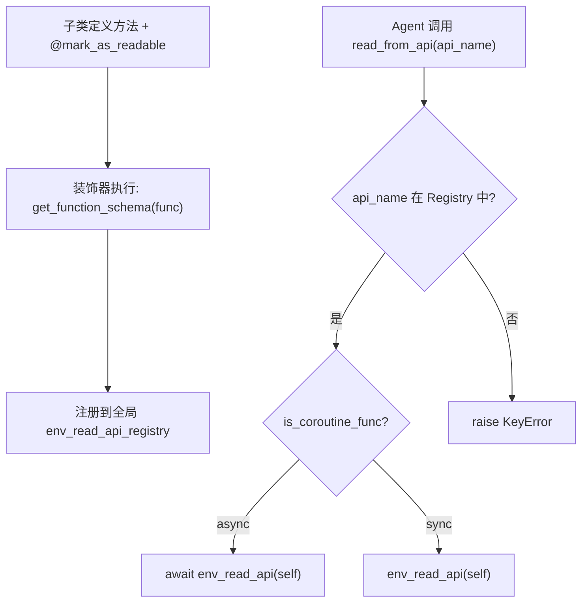
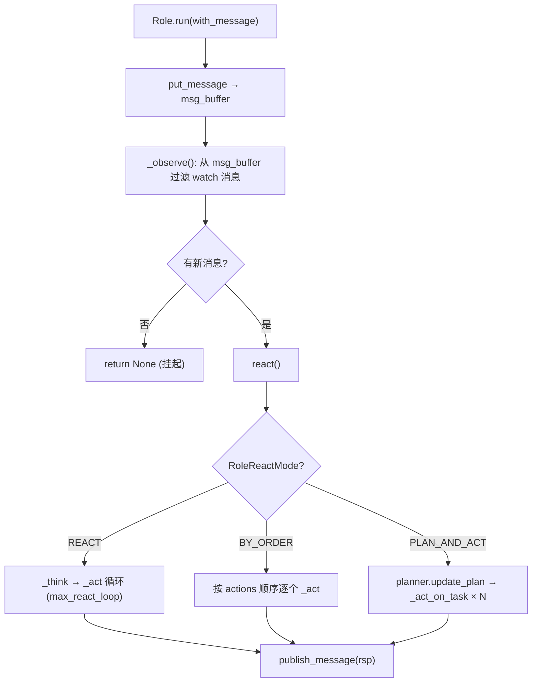
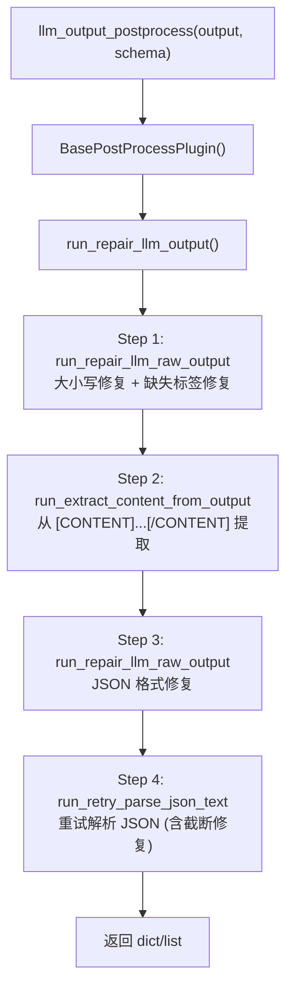

# PD-10.06 MetaGPT — 三层管道与装饰器注册表

> 文档编号：PD-10.06
> 来源：MetaGPT `metagpt/environment/base_env.py`, `metagpt/roles/role.py`, `metagpt/provider/postprocess/`
> GitHub：https://github.com/FoundationAgents/MetaGPT.git
> 问题域：PD-10 中间件管道 Middleware Pipeline
> 状态：可复用方案

---

## 第 1 章 问题与动机（≥ 30 行）

### 1.1 核心问题

在多 Agent 软件工程框架中，消息从用户需求到最终代码产出要经过多个横切关注点：
- **环境 I/O 管道**：Agent 与外部环境（游戏、Android、Minecraft）交互时，读写操作需要统一注册、按名查找、支持同步/异步双模调用
- **角色处理管道**：每个 Role 的消息处理需要标准化的 `_observe → _think → _act` 三阶段管道，且不同 react 模式（ReAct / ByOrder / PlanAndAct）需要可切换
- **LLM 输出后处理管道**：LLM 返回的原始文本经常有格式错误（大小写不一致、JSON 不完整、缺少闭合标签），需要多步修复插件链

MetaGPT 的核心挑战是：如何在不修改业务逻辑的前提下，让这三层管道各自独立可扩展、可组合。

### 1.2 MetaGPT 的解法概述

1. **装饰器注册表模式**：`@mark_as_readable` / `@mark_as_writeable` 装饰器将 ExtEnv 子类的方法自动注册到全局 `ReadAPIRegistry` / `WriteAPIRegistry`，形成读写 API 管道（`metagpt/environment/base_env.py:41-50`）
2. **三阶段角色管道**：Role 的 `run()` 方法固定为 `_observe → react → publish_message` 管道，其中 `react()` 根据 `RoleReactMode` 分发到 `_react()` 或 `_plan_and_act()` 子管道（`metagpt/roles/role.py:530-554`）
3. **LLM 输出修复插件链**：`BasePostProcessPlugin.run()` 串联 4 步修复：大小写修复 → 内容提取 → JSON 格式修复 → 重试解析（`metagpt/provider/postprocess/base_postprocess_plugin.py:18-34`）
4. **装饰器错误隔离**：`role_raise_decorator` 包装 `Role.run()`，捕获异常后回滚最近观察的消息，实现错误恢复（`metagpt/utils/common.py:689-716`）
5. **ContextMixin 上下文注入**：通过 Mixin 模式为 Role/Action/Env 统一注入 context/config/llm，实现管道各阶段的上下文透传（`metagpt/context_mixin.py:17-101`）

### 1.3 设计思想

| 设计原则 | 具体实现 | 理由 | 替代方案 |
|----------|----------|------|----------|
| 装饰器即注册 | `@mark_as_readable` 自动注册到全局 Registry | 零侵入，子类只需加装饰器 | 显式 `register()` 调用 |
| 读写分离 | ReadAPIRegistry / WriteAPIRegistry 独立 | 语义清晰，可独立查询 | 单一 Registry + tag |
| 管道阶段固定 | observe → think → act 三阶段不可跳过 | 保证消息处理一致性 | 自由组合 |
| 模式可切换 | RoleReactMode 枚举切换 react 策略 | 同一 Role 类支持多种执行模式 | 继承不同 Role 子类 |
| 插件链可覆写 | BasePostProcessPlugin 每步方法可被子类重写 | 不同 LLM 模型需要不同修复策略 | 配置文件驱动 |

---

## 第 2 章 源码实现分析（≥ 60 行，核心章节）

### 2.1 架构概览

MetaGPT 的中间件管道分为三个独立层次，各自解决不同的横切关注点：

```
┌─────────────────────────────────────────────────────────────┐
│                    Layer 1: Environment I/O Pipeline         │
│  @mark_as_readable ──→ ReadAPIRegistry (全局单例)            │
│  @mark_as_writeable ──→ WriteAPIRegistry (全局单例)          │
│  ExtEnv.read_from_api() / write_thru_api() 按名分发          │
├─────────────────────────────────────────────────────────────┤
│                    Layer 2: Role Processing Pipeline          │
│  run() → _observe() → react() → publish_message()           │
│         ┌─ REACT: _think ↔ _act (循环)                       │
│  react ─┤  BY_ORDER: _act(Action1) → _act(Action2) → ...    │
│         └─ PLAN_AND_ACT: plan → _act_on_task × N            │
├─────────────────────────────────────────────────────────────┤
│                    Layer 3: LLM Output Postprocess Pipeline   │
│  repair_case_sensitivity → extract_content → repair_json     │
│  → retry_parse_json_text (4 步串行修复链)                     │
└─────────────────────────────────────────────────────────────┘
```

### 2.2 核心实现

#### 2.2.1 装饰器注册表 — Environment I/O 管道



对应源码 `metagpt/environment/base_env.py:37-50`：

```python
env_write_api_registry = WriteAPIRegistry()
env_read_api_registry = ReadAPIRegistry()

def mark_as_readable(func):
    """mark functionn as a readable one in ExtEnv, it observes something from ExtEnv"""
    env_read_api_registry[func.__name__] = get_function_schema(func)
    return func

def mark_as_writeable(func):
    """mark functionn as a writeable one in ExtEnv, it does something to ExtEnv"""
    env_write_api_registry[func.__name__] = get_function_schema(func)
    return func
```

Registry 的核心数据结构 `metagpt/environment/api/env_api.py:18-48`：

```python
class EnvAPIRegistry(BaseModel):
    """the registry to store environment w&r api/interface"""
    registry: dict[str, Callable] = Field(default=dict(), exclude=True)

    def get(self, api_name: str):
        if api_name not in self.registry:
            raise KeyError(f"api_name: {api_name} not found")
        return self.registry.get(api_name)

    def __setitem__(self, api_name: str, func: Callable):
        self.registry[api_name] = func

    def get_apis(self, as_str=True) -> dict[str, dict[str, Union[dict, Any, str]]]:
        """return func schema without func instance"""
        apis = dict()
        for func_name, func_schema in self.registry.items():
            new_func_schema = dict()
            for key, value in func_schema.items():
                if key == "func":
                    continue
                new_func_schema[key] = str(value) if as_str else value
            apis[func_name] = new_func_schema
        return apis
```

实际使用示例 — WerewolfExtEnv 中的装饰器注册 `metagpt/environment/werewolf/werewolf_ext_env.py:224-233`：

```python
@mark_as_readable
def curr_step_instruction(self) -> dict:
    step_idx = self.step_idx % len(STEP_INSTRUCTIONS)
    instruction = STEP_INSTRUCTIONS[step_idx]
    self.step_idx += 1
    return instruction

@mark_as_writeable
def progress_step(self):
    self.step_idx += 1
```


#### 2.2.2 Role 三阶段处理管道



对应源码 `metagpt/roles/role.py:530-554`：

```python
@role_raise_decorator
async def run(self, with_message=None) -> Message | None:
    """Observe, and think and act based on the results of the observation"""
    if with_message:
        msg = None
        if isinstance(with_message, str):
            msg = Message(content=with_message)
        elif isinstance(with_message, Message):
            msg = with_message
        elif isinstance(with_message, list):
            msg = Message(content="\n".join(with_message))
        if not msg.cause_by:
            msg.cause_by = UserRequirement
        self.put_message(msg)
    if not await self._observe():
        # If there is no new information, suspend and wait
        logger.debug(f"{self._setting}: no news. waiting.")
        return

    rsp = await self.react()

    # Reset the next action to be taken.
    self.set_todo(None)
    # Send the response message to the Environment object
    self.publish_message(rsp)
    return rsp
```

`_observe` 的消息过滤机制 `metagpt/roles/role.py:399-427`：

```python
async def _observe(self) -> int:
    """Prepare new messages for processing from the message buffer."""
    news = []
    if self.recovered and self.latest_observed_msg:
        news = self.rc.memory.find_news(observed=[self.latest_observed_msg], k=10)
    if not news:
        news = self.rc.msg_buffer.pop_all()
    old_messages = [] if not self.enable_memory else self.rc.memory.get()
    # Filter in messages of interest.
    self.rc.news = [
        n for n in news if (n.cause_by in self.rc.watch or self.name in n.send_to)
        and n not in old_messages
    ]
    if self.observe_all_msg_from_buffer:
        self.rc.memory.add_batch(news)
    else:
        self.rc.memory.add_batch(self.rc.news)
    self.latest_observed_msg = self.rc.news[-1] if self.rc.news else None
    return len(self.rc.news)
```

#### 2.2.3 LLM 输出后处理插件链



对应源码 `metagpt/provider/postprocess/base_postprocess_plugin.py:18-34`：

```python
def run_repair_llm_output(self, output: str, schema: dict,
                          req_key: str = "[/CONTENT]") -> Union[dict, list]:
    """
    repair steps
        1. repair the case sensitive problem using the schema's fields
        2. extract the content from the req_key pair
        3. repair the invalid json text in the content
        4. parse the json text and repair it according to the exception
    """
    output_class_fields = list(schema["properties"].keys())
    content = self.run_repair_llm_raw_output(output, req_keys=output_class_fields + [req_key])
    content = self.run_extract_content_from_output(content, right_key=req_key)
    content = self.run_repair_llm_raw_output(content, req_keys=[None], repair_type=RepairType.JSON)
    parsed_data = self.run_retry_parse_json_text(content)
    return parsed_data
```

### 2.3 实现细节

**装饰器错误隔离** — `role_raise_decorator` (`metagpt/utils/common.py:689-716`)：

```python
def role_raise_decorator(func):
    async def wrapper(self, *args, **kwargs):
        try:
            return await func(self, *args, **kwargs)
        except KeyboardInterrupt as kbi:
            logger.error(f"KeyboardInterrupt: {kbi} occurs, start to serialize")
            if self.latest_observed_msg:
                self.rc.memory.delete(self.latest_observed_msg)
            raise Exception(format_trackback_info(limit=None))
        except Exception as e:
            if self.latest_observed_msg:
                # remove role newest observed msg to make it observed again
                self.rc.memory.delete(self.latest_observed_msg)
            if isinstance(e, RetryError):
                last_error = e.last_attempt._exception
                name = any_to_str(last_error)
                if re.match(r"^openai\.", name) or re.match(r"^httpx\.", name):
                    raise last_error
            raise Exception(format_trackback_info(limit=None)) from e
    return wrapper
```

关键设计点：
- 异常时回滚 `latest_observed_msg`，使消息可被重新观察，实现自动重试
- 对 OpenAI/httpx 异常做特殊处理，直接抛出原始异常而非包装
- 装饰器不修改 `run()` 的签名和返回值，纯粹的 AOP 横切

**ContextMixin 上下文透传** — 管道各阶段共享 context (`metagpt/context_mixin.py:17-65`)：

```python
class ContextMixin(BaseModel):
    """Mixin class for context and config"""
    private_context: Optional[Context] = Field(default=None, exclude=True)
    private_config: Optional[Config] = Field(default=None, exclude=True)
    private_llm: Optional[BaseLLM] = Field(default=None, exclude=True)

    def set_context(self, context: Context, override=True):
        self.set("private_context", context, override)

    @property
    def context(self) -> Context:
        if self.private_context:
            return self.private_context
        return Context()

    @property
    def llm(self) -> BaseLLM:
        if not self.private_llm:
            self.private_llm = self.context.llm_with_cost_manager_from_llm_config(
                self.config.llm
            )
        return self.private_llm
```

**数据流总结**：

```
User Message
  → Environment.publish_message() [路由到订阅者]
    → Role.put_message() [放入 msg_buffer]
      → Role._observe() [过滤 watch 消息]
        → Role._think() [LLM 选择 Action 或按序]
          → Role._act() [执行 Action.run()]
            → LLM 调用 → llm_output_postprocess() [4 步修复]
          → Role.publish_message() [结果广播]
```


---

## 第 3 章 迁移指南（≥ 40 行）

### 3.1 迁移清单

**阶段 1：装饰器注册表（1-2 天）**
- [ ] 实现 `APIRegistry` 基类（dict 存储 + `get_function_schema` 提取签名）
- [ ] 实现 `@register_read` / `@register_write` 装饰器
- [ ] 实现 `read_from_api(name)` / `write_thru_api(name)` 分发器，支持 sync/async 双模

**阶段 2：角色处理管道（2-3 天）**
- [ ] 定义 `BaseRole` 抽象类，固定 `run → _observe → react → publish` 管道
- [ ] 实现 `RoleReactMode` 枚举和对应的 `_react` / `_plan_and_act` 策略
- [ ] 实现 `MessageQueue` 消息缓冲 + `_watch` 过滤机制
- [ ] 实现 `role_raise_decorator` 错误隔离装饰器

**阶段 3：LLM 输出后处理（1 天）**
- [ ] 实现 `BasePostProcessPlugin` 4 步修复链
- [ ] 实现 `llm_output_postprocess` 入口函数（按 model_name 选择插件）

### 3.2 适配代码模板

#### 装饰器注册表模板

```python
"""可直接复用的装饰器注册表实现"""
import inspect
from typing import Any, Callable, Union
from pydantic import BaseModel, Field


def get_function_schema(func: Callable) -> dict[str, Any]:
    """提取函数签名为 schema"""
    sig = inspect.signature(func)
    params = {name: p.annotation for name, p in sig.parameters.items()}
    return {
        "input_params": params,
        "return_type": sig.return_annotation,
        "func_desc": func.__doc__,
        "func": func,
    }


class APIRegistry(BaseModel):
    """通用 API 注册表"""
    registry: dict[str, dict] = Field(default_factory=dict)

    def register(self, func: Callable) -> Callable:
        """装饰器：注册函数到 registry"""
        self.registry[func.__name__] = get_function_schema(func)
        return func

    def get(self, api_name: str) -> dict:
        if api_name not in self.registry:
            raise KeyError(f"API '{api_name}' not found in registry")
        return self.registry[api_name]

    def get_func(self, api_name: str) -> Callable:
        return self.get(api_name)["func"]

    def list_apis(self) -> list[str]:
        return list(self.registry.keys())


# 使用示例
read_registry = APIRegistry()
write_registry = APIRegistry()

# 装饰器工厂
def mark_as_readable(func):
    read_registry.registry[func.__name__] = get_function_schema(func)
    return func

def mark_as_writeable(func):
    write_registry.registry[func.__name__] = get_function_schema(func)
    return func
```

#### 角色管道模板

```python
"""可直接复用的三阶段角色管道"""
import asyncio
from abc import ABC, abstractmethod
from enum import Enum
from typing import Optional


class ReactMode(str, Enum):
    REACT = "react"
    BY_ORDER = "by_order"
    PLAN_AND_ACT = "plan_and_act"


def error_isolation_decorator(func):
    """错误隔离装饰器：异常时回滚最近消息"""
    async def wrapper(self, *args, **kwargs):
        try:
            return await func(self, *args, **kwargs)
        except Exception as e:
            if hasattr(self, 'latest_observed_msg') and self.latest_observed_msg:
                self.memory.delete(self.latest_observed_msg)
            raise
    return wrapper


class BaseRole(ABC):
    def __init__(self, react_mode: ReactMode = ReactMode.REACT,
                 max_react_loop: int = 1):
        self.react_mode = react_mode
        self.max_react_loop = max_react_loop
        self.msg_buffer = []
        self.memory = []
        self.watch_actions = set()
        self.latest_observed_msg = None

    @error_isolation_decorator
    async def run(self, message=None):
        """固定三阶段管道：observe → react → publish"""
        if message:
            self.msg_buffer.append(message)
        if not await self._observe():
            return None
        rsp = await self.react()
        self.publish_message(rsp)
        return rsp

    async def _observe(self) -> int:
        """从 buffer 过滤感兴趣的消息"""
        news = [m for m in self.msg_buffer
                if m.cause_by in self.watch_actions]
        self.msg_buffer.clear()
        self.memory.extend(news)
        self.latest_observed_msg = news[-1] if news else None
        return len(news)

    async def react(self):
        if self.react_mode == ReactMode.REACT:
            return await self._react()
        elif self.react_mode == ReactMode.BY_ORDER:
            return await self._by_order()
        elif self.react_mode == ReactMode.PLAN_AND_ACT:
            return await self._plan_and_act()

    async def _react(self):
        for _ in range(self.max_react_loop):
            if not await self._think():
                break
            rsp = await self._act()
        return rsp

    @abstractmethod
    async def _think(self) -> bool: ...
    @abstractmethod
    async def _act(self): ...
    @abstractmethod
    def publish_message(self, msg): ...
```

### 3.3 适用场景

| 场景 | 适用度 | 说明 |
|------|--------|------|
| 多 Agent 软件工程框架 | ⭐⭐⭐ | MetaGPT 的核心场景，Role 管道天然适配 |
| 游戏/仿真环境 Agent | ⭐⭐⭐ | ExtEnv 装饰器注册表专为此设计 |
| LLM 输出格式修复 | ⭐⭐⭐ | 4 步修复链对开源模型尤其有效 |
| 单 Agent 简单任务 | ⭐ | 三层管道过重，直接调用即可 |
| 实时流式处理 | ⭐⭐ | 管道是批处理模式，需改造支持流式 |

---

## 第 4 章 测试用例（≥ 20 行）

```python
import pytest
from unittest.mock import AsyncMock, MagicMock
from typing import Any, Callable, Union
from pydantic import BaseModel, Field


# ---- 测试装饰器注册表 ----

class EnvAPIRegistry(BaseModel):
    registry: dict[str, dict] = Field(default_factory=dict)
    def __setitem__(self, name: str, schema: dict):
        self.registry[name] = schema
    def get(self, api_name: str):
        return self.registry.get(api_name)
    def __len__(self):
        return len(self.registry)


class TestDecoratorRegistry:
    def setup_method(self):
        self.read_reg = EnvAPIRegistry()
        self.write_reg = EnvAPIRegistry()

    def _mark_readable(self, func):
        self.read_reg[func.__name__] = {"func": func, "desc": func.__doc__}
        return func

    def _mark_writeable(self, func):
        self.write_reg[func.__name__] = {"func": func, "desc": func.__doc__}
        return func

    def test_decorator_registers_function(self):
        @self._mark_readable
        def get_state(self) -> dict:
            """Get current state"""
            return {"alive": True}

        assert len(self.read_reg) == 1
        assert self.read_reg.get("get_state")["func"] is get_state

    def test_read_write_separation(self):
        @self._mark_readable
        def observe(self): pass

        @self._mark_writeable
        def act(self): pass

        assert len(self.read_reg) == 1
        assert len(self.write_reg) == 1
        assert self.read_reg.get("observe") is not None
        assert self.write_reg.get("act") is not None

    def test_registry_key_error(self):
        assert self.read_reg.get("nonexistent") is None


# ---- 测试 LLM 输出后处理链 ----

class TestPostProcessPipeline:
    def test_case_sensitivity_repair(self):
        """模拟大小写修复"""
        output = '{"original requirements": "build a game"}'
        expected_key = "Original Requirements"
        # 简化的大小写修复逻辑
        for key in [expected_key]:
            output = output.replace(key.lower(), key)
        assert expected_key.lower() in output.lower()

    def test_content_extraction(self):
        """模拟 [CONTENT]...[/CONTENT] 提取"""
        import re
        raw = 'Some prefix [CONTENT]{"key": "value"}[/CONTENT] suffix'
        pattern = r'\[CONTENT\](.*?)\[/CONTENT\]'
        match = re.search(pattern, raw, re.DOTALL)
        assert match is not None
        assert match.group(1) == '{"key": "value"}'

    def test_json_repair_truncated(self):
        """模拟截断 JSON 修复"""
        import json
        truncated = '{"key": "value", "items": [1, 2, 3'
        # 简单修复：补全括号
        repaired = truncated + "]}"
        parsed = json.loads(repaired)
        assert parsed["key"] == "value"
        assert parsed["items"] == [1, 2, 3]


# ---- 测试角色管道 ----

class TestRolePipeline:
    @pytest.mark.asyncio
    async def test_observe_filters_by_watch(self):
        """_observe 只保留 watch 列表中的消息"""
        class MockMsg:
            def __init__(self, cause_by, send_to=""):
                self.cause_by = cause_by
                self.send_to = send_to

        watch = {"WriteCode", "WritePRD"}
        buffer = [
            MockMsg(cause_by="WriteCode"),
            MockMsg(cause_by="RunTest"),
            MockMsg(cause_by="WritePRD"),
        ]
        filtered = [m for m in buffer if m.cause_by in watch]
        assert len(filtered) == 2

    @pytest.mark.asyncio
    async def test_error_isolation_rollback(self):
        """role_raise_decorator 异常时回滚消息"""
        class MockRole:
            def __init__(self):
                self.latest_observed_msg = "msg1"
                self.memory = ["msg0", "msg1"]

        role = MockRole()
        # 模拟异常后回滚
        if role.latest_observed_msg:
            role.memory.remove(role.latest_observed_msg)
        assert "msg1" not in role.memory
        assert len(role.memory) == 1
```


---

## 第 5 章 跨域关联

| 关联域 | 关系类型 | 说明 |
|--------|----------|------|
| PD-02 多 Agent 编排 | 协同 | Environment.run() 并行执行所有 Role，Role 管道是编排的执行单元 |
| PD-03 容错与重试 | 依赖 | role_raise_decorator 提供管道级错误隔离，异常时回滚消息实现自动重试 |
| PD-04 工具系统 | 协同 | Action 是管道中 _act 阶段的执行单元，Action.run() 可调用外部工具 |
| PD-06 记忆持久化 | 依赖 | _observe 阶段从 Memory 读取历史消息，_act 阶段写入新消息到 Memory |
| PD-01 上下文管理 | 协同 | ContextMixin 为管道各阶段注入共享 context，Role._get_prefix() 构建系统提示 |
| PD-11 可观测性 | 协同 | ContextMixin 注入 cost_manager，管道各阶段的 LLM 调用自动计量 |

---

## 第 6 章 来源文件索引

| 文件 | 行范围 | 关键实现 |
|------|--------|----------|
| `metagpt/environment/base_env.py` | L37-L50 | 全局 Registry 单例 + 装饰器定义 |
| `metagpt/environment/base_env.py` | L53-L122 | ExtEnv 基类：read_from_api / write_thru_api 分发 |
| `metagpt/environment/base_env.py` | L124-L248 | Environment：角色管理 + publish_message 路由 |
| `metagpt/environment/api/env_api.py` | L18-L60 | EnvAPIRegistry / ReadAPIRegistry / WriteAPIRegistry |
| `metagpt/roles/role.py` | L82-L123 | RoleReactMode 枚举 + RoleContext 运行时上下文 |
| `metagpt/roles/role.py` | L340-L379 | _think()：LLM 选择 Action 或按序切换 |
| `metagpt/roles/role.py` | L381-L397 | _act()：执行 Action 并写入 Memory |
| `metagpt/roles/role.py` | L399-L427 | _observe()：消息过滤 + watch 机制 |
| `metagpt/roles/role.py` | L454-L470 | _react()：think-act 循环 |
| `metagpt/roles/role.py` | L472-L496 | _plan_and_act()：计划驱动执行 |
| `metagpt/roles/role.py` | L529-L554 | run()：三阶段管道入口 |
| `metagpt/provider/postprocess/base_postprocess_plugin.py` | L15-L69 | BasePostProcessPlugin 4 步修复链 |
| `metagpt/provider/postprocess/llm_output_postprocess.py` | L10-L20 | llm_output_postprocess 入口 |
| `metagpt/utils/common.py` | L354-L359 | get_function_schema 签名提取 |
| `metagpt/utils/common.py` | L689-L716 | role_raise_decorator 错误隔离 |
| `metagpt/context_mixin.py` | L17-L101 | ContextMixin 上下文注入 |
| `metagpt/actions/action.py` | L29-L120 | Action 基类：管道 _act 阶段的执行单元 |
| `metagpt/environment/werewolf/werewolf_ext_env.py` | L224-L233 | 装饰器实际使用示例 |

---

## 第 7 章 横向对比维度

```json comparison_data
{
  "project": "MetaGPT",
  "dimensions": {
    "中间件基类": "无统一基类，三层各自独立：EnvAPIRegistry / Role / BasePostProcessPlugin",
    "钩子点": "Role 管道 3 点（observe/think/act）+ Env 读写 2 点 + LLM 后处理 4 步",
    "中间件数量": "Role 管道固定 3 阶段，LLM 后处理固定 4 步，Env API 按装饰器动态注册",
    "条件激活": "RoleReactMode 枚举切换 react 策略，_watch 过滤消息类型",
    "状态管理": "RoleContext 集中管理 state/todo/memory/news，Pydantic BaseModel 序列化",
    "执行模型": "全异步 asyncio，Environment.run() 用 gather 并行执行所有 Role",
    "同步热路径": "ExtEnv 通过 is_coroutine_func 判断，支持 sync/async 双模调用",
    "错误隔离": "role_raise_decorator 捕获异常回滚 latest_observed_msg，消息可重新观察",
    "交互桥接": "Environment.publish_message 按 send_to 路由，Role.put_message 放入私有 buffer",
    "装饰器包装": "@mark_as_readable/@mark_as_writeable 注册到全局 Registry，零侵入"
  }
}
```

### 域元数据补充

```json domain_metadata
{
  "solution_summary": "MetaGPT 用装饰器注册表（@mark_as_readable/@mark_as_writeable）+ Role 三阶段管道（observe→think→act）+ LLM 输出 4 步修复插件链构建三层独立中间件体系",
  "description": "装饰器驱动的读写 API 注册与多模式角色处理管道的分层组合",
  "sub_problems": [
    "读写 API 分离注册：同一环境的读操作和写操作如何用独立注册表管理",
    "多 react 模式切换：同一 Role 类如何在 ReAct/ByOrder/PlanAndAct 间动态切换",
    "LLM 输出多步修复：大小写/标签/JSON/解析四步串行修复的插件可覆写设计",
    "消息回滚重试：管道异常时如何回滚已观察消息使其可被重新处理"
  ],
  "best_practices": [
    "装饰器注册零侵入：子类方法加 @mark_as_readable 即自动注册，无需显式调用 register()",
    "管道阶段固定顺序：observe→think→act 三阶段不可跳过，保证消息处理一致性",
    "异常回滚消息：role_raise_decorator 在异常时删除 latest_observed_msg，使消息可被重新观察",
    "sync/async 双模分发：ExtEnv 通过 is_coroutine_func 判断后选择 await 或直接调用"
  ]
}
```
