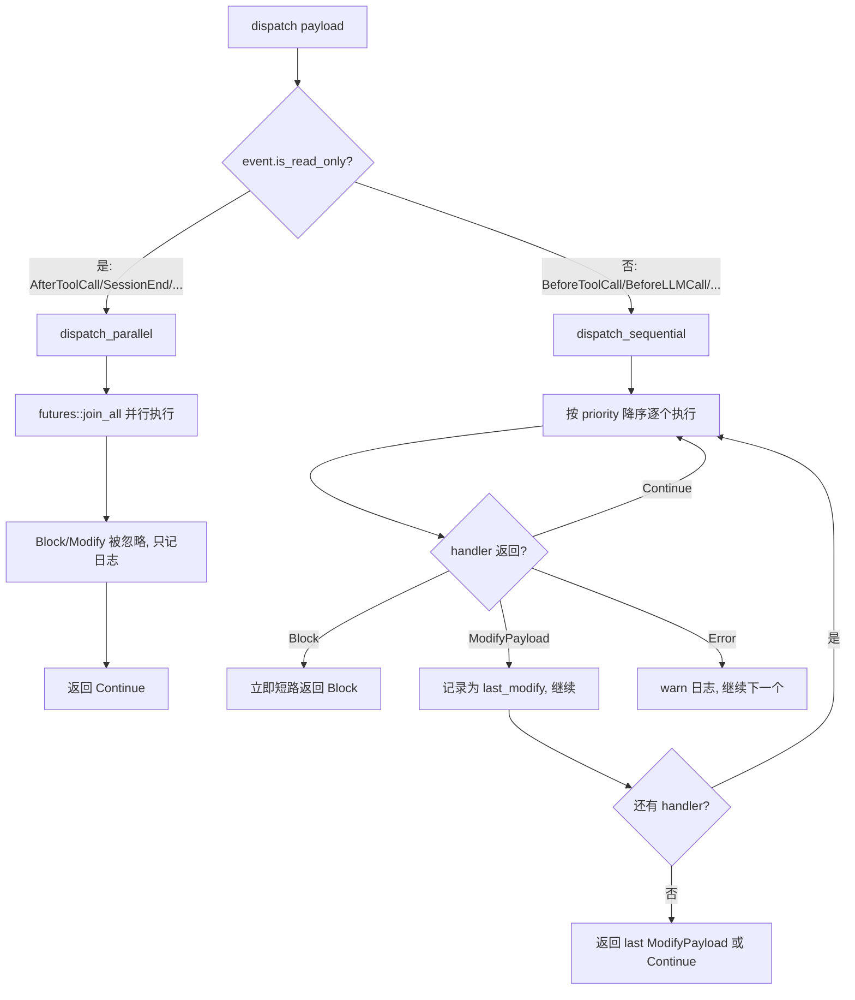
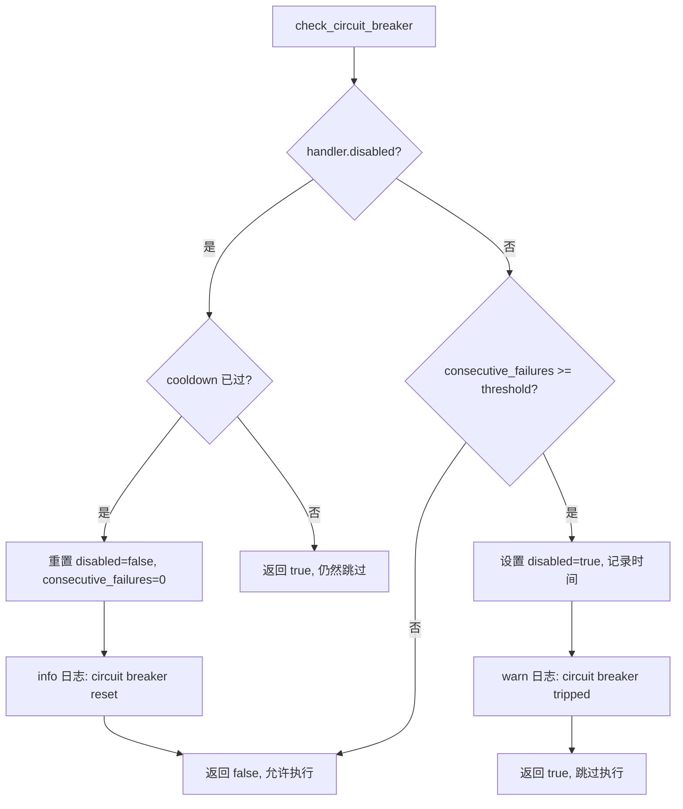
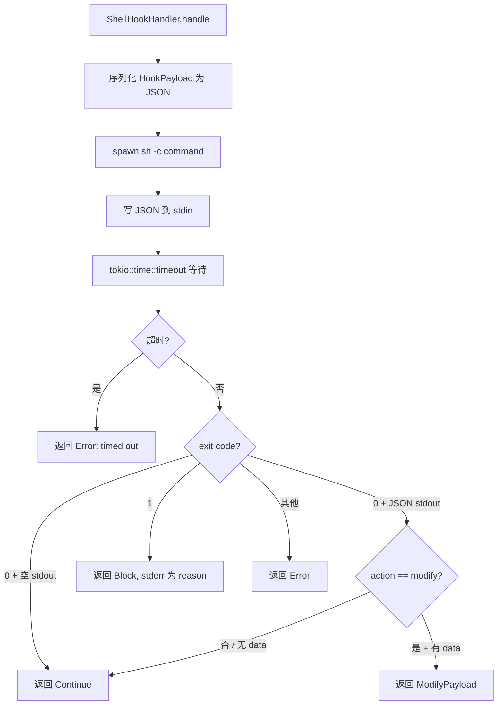

# PD-10.XX Moltis — 17 事件 HookRegistry 读写分流与熔断器

> 文档编号：PD-10.XX
> 来源：Moltis `crates/common/src/hooks.rs` `crates/plugins/src/shell_hook.rs`
> GitHub：https://github.com/moltis-org/moltis.git
> 问题域：PD-10 中间件管道 Middleware Pipeline
> 状态：可复用方案

---

## 第 1 章 问题与动机

### 1.1 核心问题

Agent 系统的生命周期中存在大量横切关注点：审计日志、安全拦截、payload 修改、外部脚本集成等。这些逻辑如果硬编码在主流程中，会导致：

1. **耦合膨胀** — 每新增一个横切需求就要修改 agent runner、gateway、session 等核心代码
2. **可靠性风险** — 一个有 bug 的审计插件不应该拖垮整个 LLM 调用链
3. **性能浪费** — 只读的通知类事件（如 SessionEnd）不需要串行等待每个 handler
4. **扩展性瓶颈** — 用户想通过外部 shell 脚本扩展行为，但缺乏标准化的 stdin/stdout 协议

Moltis 需要一个既能拦截修改（BeforeToolCall 修改参数），又能安全旁观（AfterToolCall 记录日志），还能自动隔离故障 handler 的统一 hook 系统。

### 1.2 Moltis 的解法概述

Moltis 实现了一个 **17 事件、读写分流、带熔断器的 HookRegistry**：

1. **17 种生命周期事件** — 从 `BeforeAgentStart` 到 `GatewayStop`，覆盖 Agent、LLM、Tool、Message、Session、Gateway 六大生命周期阶段（`crates/common/src/hooks.rs:29-47`）
2. **读写分流调度** — 读事件（AfterToolCall、SessionEnd 等）并行 `join_all` 执行，写事件（BeforeToolCall、BeforeLLMCall 等）串行执行并支持 Block 短路（`crates/common/src/hooks.rs:78-92`）
3. **三种 HookAction** — `Continue`（放行）、`ModifyPayload`（修改数据）、`Block`（拦截并返回原因），写事件中 Block 立即短路，ModifyPayload 取最后一个（`crates/common/src/hooks.rs:212-220`）
4. **熔断器自动隔离** — 连续失败 N 次后自动禁用 handler，冷却期后自动恢复（`crates/common/src/hooks.rs:262-306`）
5. **Shell Hook 外部扩展** — 通过 stdin JSON + exit code 协议调用外部脚本，TOML 配置驱动（`crates/plugins/src/shell_hook.rs:89-197`）

### 1.3 设计思想

| 设计原则 | 具体实现 | 理由 | 替代方案 |
|----------|----------|------|----------|
| 读写分离 | `is_read_only()` 区分事件类型，读事件并行、写事件串行 | 读事件是通知性质，不影响主流程；写事件需要顺序保证 | 全部串行（简单但慢）/ 全部并行（无法保证 Block 语义） |
| 错误非致命 | handler 失败只 warn 日志，不中断 dispatch 链 | 一个审计 hook 崩溃不应阻止 tool 执行 | 错误冒泡（会导致级联故障） |
| 熔断器模式 | 连续失败 ≥ threshold 自动禁用，cooldown 后自动恢复 | 防止持续失败的 handler 拖慢每次 dispatch | 手动禁用（运维负担大）/ 无保护（性能风险） |
| 优先级排序 | `priority()` 降序排列，高优先级先执行 | 安全拦截 hook 必须在审计 hook 之前运行 | FIFO 注册顺序（无法控制执行顺序） |
| 类型化 Payload | 每个事件有独立的 `HookPayload` 变体，携带事件特定字段 | 编译期保证 payload 结构正确，避免运行时 JSON 解析错误 | 通用 `HashMap<String, Value>`（类型不安全） |
| Dry-run 模式 | `dry_run` 标志使 Block/Modify 只记录不生效 | 调试新 hook 时不影响生产流程 | 无（直接上线有风险） |

---

## 第 2 章 源码实现分析

### 2.1 架构概览

Moltis 的 hook 系统分布在三个 crate 中，形成清晰的依赖层次：

```
┌─────────────────────────────────────────────────────────────┐
│                    moltis-gateway                           │
│  discover_and_build_hooks() → Arc<HookRegistry>             │
│  GatewayState.hook_registry: Option<Arc<HookRegistry>>      │
├─────────────────────────────────────────────────────────────┤
│                    moltis-agents                            │
│  runner.rs: dispatch BeforeLLMCall/AfterLLMCall/            │
│             BeforeToolCall/AfterToolCall                    │
├─────────────────────────────────────────────────────────────┤
│                    moltis-plugins                           │
│  ShellHookHandler (外部脚本)                                │
│  bundled/ (BootMdHook, CommandLoggerHook, SessionMemoryHook)│
│  hook_metadata.rs (HOOK.md TOML 解析)                       │
│  hook_discovery.rs (文件系统发现)                            │
├─────────────────────────────────────────────────────────────┤
│                    moltis-common                            │
│  HookEvent (17 variants) + HookPayload (tagged enum)       │
│  HookAction (Continue/ModifyPayload/Block)                  │
│  HookHandler trait + HookRegistry + HookStats              │
└─────────────────────────────────────────────────────────────┘
```

核心设计：`moltis-common` 定义 trait 和类型，`moltis-agents` 只依赖 common（不依赖 plugins），`moltis-plugins` 提供具体实现，`moltis-gateway` 负责组装和注册。

### 2.2 核心实现

#### 2.2.1 读写分流调度



对应源码 `crates/common/src/hooks.rs:457-471`：

```rust
pub async fn dispatch(&self, payload: &HookPayload) -> Result<HookAction> {
    let event = payload.event();
    let handlers = match self.handlers.get(&event) {
        Some(h) if !h.is_empty() => h,
        _ => return Ok(HookAction::Continue),
    };

    debug!(event = %event, count = handlers.len(), "dispatching hook event");

    if event.is_read_only() {
        self.dispatch_parallel(event, payload, handlers).await
    } else {
        self.dispatch_sequential(event, payload, handlers).await
    }
}
```

读写分类定义在 `crates/common/src/hooks.rs:78-92`：

```rust
pub fn is_read_only(&self) -> bool {
    matches!(
        self,
        Self::AgentEnd
            | Self::AfterToolCall
            | Self::MessageReceived
            | Self::MessageSent
            | Self::AfterCompaction
            | Self::SessionStart
            | Self::SessionEnd
            | Self::GatewayStart
            | Self::GatewayStop
            | Self::Command
    )
}
```

设计要点：10 个读事件 vs 7 个写事件。所有 `Before*` 事件都是写事件（可拦截/修改），所有 `After*` 和生命周期通知事件都是读事件（只通知）。`AfterLLMCall` 是例外——虽然名为 After，但被归为写事件，因为 hook 可能需要修改 LLM 返回的 tool_calls。

#### 2.2.2 熔断器与健康统计



对应源码 `crates/common/src/hooks.rs:262-306`（HookStats）和 `crates/common/src/hooks.rs:405-447`（check_circuit_breaker）：

```rust
pub struct HookStats {
    pub call_count: AtomicU64,
    pub failure_count: AtomicU64,
    pub consecutive_failures: AtomicU64,
    pub total_latency_us: AtomicU64,
    pub disabled: AtomicBool,
    pub disabled_at: std::sync::Mutex<Option<Instant>>,
}
```

每个 handler 注册时创建独立的 `HookStats`，通过 `Arc` 共享。`HandlerEntry` 将 handler 和 stats 绑定在一起（`crates/common/src/hooks.rs:316-319`）。熔断器默认阈值 3 次连续失败，冷却期 60 秒，可通过 `with_circuit_breaker()` 自定义。


#### 2.2.3 Shell Hook 外部脚本协议



对应源码 `crates/plugins/src/shell_hook.rs:89-197`：

```rust
async fn handle(&self, _event: HookEvent, payload: &HookPayload) -> HookResult<HookAction> {
    let payload_json = serde_json::to_string(payload).map_err(|source| {
        HookError::message(format!("failed to serialize hook payload: {source}"))
    })?;

    let mut cmd = Command::new("sh");
    cmd.arg("-c")
        .arg(&self.command)
        .envs(&self.env)
        .stdin(std::process::Stdio::piped())
        .stdout(std::process::Stdio::piped())
        .stderr(std::process::Stdio::piped());

    // ... spawn + write stdin + timeout wait ...

    if exit_code == 1 {
        let reason = match stderr.is_empty() {
            true => format!("hook '{}' blocked the action", self.hook_name),
            false => stderr.trim().to_string(),
        };
        return Ok(HookAction::Block(reason));
    }
    // ... parse stdout JSON for modify ...
}
```

协议约定：exit 0 = 放行/修改，exit 1 = 拦截，其他 = 错误。stdout 的 JSON 格式为 `{"action": "modify", "data": {...}}`。这个协议简洁且不依赖 jq 等外部工具——hook 脚本只需要能输出 JSON 即可。

#### 2.2.4 HOOK.md 元数据与资格检查

Hook 发现通过文件系统扫描 `HOOK.md` 文件实现（`crates/plugins/src/hook_metadata.rs:77-117`）。TOML frontmatter 声明 hook 的名称、事件订阅、命令、超时、优先级和运行要求：

```toml
+++
name = "audit"
description = "Audit all tool calls"
events = ["BeforeToolCall", "AfterToolCall"]
command = "./handler.sh"
timeout = 5
priority = 10

[requires]
os = ["darwin", "linux"]
bins = ["jq"]
env = ["SLACK_WEBHOOK_URL"]
+++
```

`HookRequirements` 支持三种资格检查（`crates/plugins/src/hook_metadata.rs:29-39`）：OS 匹配、二进制依赖、环境变量。不满足条件的 hook 被标记为 ineligible 但仍出现在 UI 列表中。

### 2.3 实现细节

**注册与优先级排序**：`register()` 方法将 handler 按其 `events()` 声明分发到 `HashMap<HookEvent, Vec<HandlerEntry>>` 中，每次插入后按 `priority()` 降序排序（`crates/common/src/hooks.rs:359-372`）。高优先级 handler 先执行，确保安全拦截在审计日志之前。

**同步热路径**：`dispatch_sync()` 方法（`crates/common/src/hooks.rs:574-627`）为 `ToolResultPersist` 等热路径事件提供同步调度。`HookHandler` trait 的 `handle_sync()` 默认实现通过 `tokio::task::block_in_place` 桥接异步 handler（`crates/common/src/hooks.rs:243-256`），原生 hook 可覆写为零开销同步实现。

**Gateway 级组装**：`discover_and_build_hooks()` 在 gateway 启动时执行（`crates/gateway/src/server.rs:5116-5261`），扫描文件系统发现 shell hook，注册 3 个内置 hook（BootMdHook、CommandLoggerHook、SessionMemoryHook），最终将 `HookRegistry` 包装为 `Arc` 存入 `GatewayState`，通过 `.with_hooks()` 传递给各 service。

**Agent Runner 集成**：`runner.rs` 在 LLM 调用前后（`crates/agents/src/runner.rs:848-871`）和工具调用前后（`crates/agents/src/runner.rs:1094-1117`）分别 dispatch hook。BeforeToolCall 的 `ModifyPayload` 会直接替换工具参数（`runner.rs:1110-1112`：`args = v`），实现运行时参数注入。

---

## 第 3 章 迁移指南

### 3.1 迁移清单

**阶段 1：核心类型（1 个文件）**
- [ ] 定义 `HookEvent` 枚举，包含项目需要的生命周期事件
- [ ] 定义 `HookPayload` tagged enum，每个事件携带类型化字段
- [ ] 定义 `HookAction` 枚举：Continue / ModifyPayload / Block
- [ ] 定义 `HookHandler` trait：name + events + priority + handle

**阶段 2：Registry 实现（1 个文件）**
- [ ] 实现 `HookRegistry`：HashMap<Event, Vec<HandlerEntry>> 结构
- [ ] 实现 `register()` 方法，按 priority 降序排序
- [ ] 实现 `dispatch()` 方法，区分读写事件
- [ ] 实现 `HookStats` 和熔断器逻辑

**阶段 3：Shell Hook（1 个文件）**
- [ ] 实现 `ShellHookHandler`：spawn 子进程 + stdin JSON + exit code 协议
- [ ] 实现 HOOK.md 解析器（TOML frontmatter）
- [ ] 实现文件系统发现器

**阶段 4：集成**
- [ ] 在 agent runner 的 LLM/Tool 调用前后插入 dispatch 调用
- [ ] 在 gateway 启动时组装 HookRegistry
- [ ] 实现内置 hook（日志、审计等）

### 3.2 适配代码模板

以下是 Rust 版本的最小可运行 HookRegistry 模板：

```rust
use std::{collections::HashMap, sync::Arc, time::{Duration, Instant}};
use std::sync::atomic::{AtomicBool, AtomicU64, Ordering};
use async_trait::async_trait;
use serde_json::Value;

// ── 事件与动作 ──
#[derive(Debug, Clone, Copy, PartialEq, Eq, Hash)]
pub enum HookEvent {
    BeforeToolCall,
    AfterToolCall,
    BeforeLLMCall,
    AfterLLMCall,
    SessionStart,
    SessionEnd,
}

impl HookEvent {
    pub fn is_read_only(&self) -> bool {
        matches!(self, Self::AfterToolCall | Self::AfterLLMCall | Self::SessionStart | Self::SessionEnd)
    }
}

#[derive(Debug, Default)]
pub enum HookAction {
    #[default]
    Continue,
    ModifyPayload(Value),
    Block(String),
}

// ── Handler trait ──
#[async_trait]
pub trait HookHandler: Send + Sync {
    fn name(&self) -> &str;
    fn events(&self) -> &[HookEvent];
    fn priority(&self) -> i32 { 0 }
    async fn handle(&self, event: HookEvent, payload: &Value) -> anyhow::Result<HookAction>;
}

// ── 熔断器统计 ──
pub struct HookStats {
    pub consecutive_failures: AtomicU64,
    pub disabled: AtomicBool,
    pub disabled_at: std::sync::Mutex<Option<Instant>>,
}

impl HookStats {
    pub fn new() -> Self {
        Self {
            consecutive_failures: AtomicU64::new(0),
            disabled: AtomicBool::new(false),
            disabled_at: std::sync::Mutex::new(None),
        }
    }
}

// ── Registry ──
struct HandlerEntry {
    handler: Arc<dyn HookHandler>,
    stats: Arc<HookStats>,
}

pub struct HookRegistry {
    handlers: HashMap<HookEvent, Vec<HandlerEntry>>,
    circuit_breaker_threshold: u64,
    circuit_breaker_cooldown: Duration,
}

impl HookRegistry {
    pub fn new() -> Self {
        Self {
            handlers: HashMap::new(),
            circuit_breaker_threshold: 3,
            circuit_breaker_cooldown: Duration::from_secs(60),
        }
    }

    pub fn register(&mut self, handler: Arc<dyn HookHandler>) {
        let stats = Arc::new(HookStats::new());
        for &event in handler.events() {
            let entry = HandlerEntry {
                handler: Arc::clone(&handler),
                stats: Arc::clone(&stats),
            };
            let handlers = self.handlers.entry(event).or_default();
            handlers.push(entry);
            handlers.sort_by_key(|h| std::cmp::Reverse(h.handler.priority()));
        }
    }

    pub async fn dispatch(&self, event: HookEvent, payload: &Value) -> anyhow::Result<HookAction> {
        let handlers = match self.handlers.get(&event) {
            Some(h) if !h.is_empty() => h,
            _ => return Ok(HookAction::Continue),
        };

        if event.is_read_only() {
            // 并行执行，忽略 Block/Modify
            let futures: Vec<_> = handlers.iter()
                .filter(|e| !e.stats.disabled.load(Ordering::Relaxed))
                .map(|e| e.handler.handle(event, payload))
                .collect();
            let _ = futures::future::join_all(futures).await;
            Ok(HookAction::Continue)
        } else {
            // 串行执行，Block 短路
            let mut last_modify = None;
            for entry in handlers {
                if entry.stats.disabled.load(Ordering::Relaxed) { continue; }
                match entry.handler.handle(event, payload).await {
                    Ok(HookAction::Block(reason)) => return Ok(HookAction::Block(reason)),
                    Ok(HookAction::ModifyPayload(v)) => { last_modify = Some(v); },
                    Ok(HookAction::Continue) => {
                        entry.stats.consecutive_failures.store(0, Ordering::Relaxed);
                    },
                    Err(_) => {
                        let fails = entry.stats.consecutive_failures.fetch_add(1, Ordering::Relaxed) + 1;
                        if fails >= self.circuit_breaker_threshold {
                            entry.stats.disabled.store(true, Ordering::Relaxed);
                        }
                    },
                }
            }
            Ok(last_modify.map(HookAction::ModifyPayload).unwrap_or(HookAction::Continue))
        }
    }
}
```

### 3.3 适用场景

| 场景 | 适用度 | 说明 |
|------|--------|------|
| Agent 系统需要安全拦截（阻止危险工具调用） | ⭐⭐⭐ | BeforeToolCall + Block 短路是核心用例 |
| 需要审计日志但不能影响主流程性能 | ⭐⭐⭐ | 读事件并行 + 错误非致命完美匹配 |
| 用户需要通过外部脚本扩展 Agent 行为 | ⭐⭐⭐ | Shell Hook 的 stdin/stdout/exit-code 协议简洁通用 |
| 需要运行时修改 LLM/Tool 参数 | ⭐⭐ | ModifyPayload 支持，但 last-wins 策略需注意多 hook 冲突 |
| 需要复杂的中间件链状态传递 | ⭐ | Moltis 的 hook 间无共享状态，不适合需要上下文传递的场景 |
| 需要条件激活/动态启停中间件 | ⭐⭐ | 熔断器自动禁用 + disabled hooks 列表支持，但无运行时条件表达式 |

---

## 第 4 章 测试用例

基于 Moltis 真实测试模式（`crates/plugins/src/hooks.rs:136-261`），以下是可直接运行的测试框架：

```rust
#[cfg(test)]
mod tests {
    use super::*;
    use std::sync::Arc;

    // ── 测试用 Handler ──

    struct PassthroughHandler {
        subscribed: Vec<HookEvent>,
    }

    #[async_trait]
    impl HookHandler for PassthroughHandler {
        fn name(&self) -> &str { "passthrough" }
        fn events(&self) -> &[HookEvent] { &self.subscribed }
        async fn handle(&self, _: HookEvent, _: &Value) -> anyhow::Result<HookAction> {
            Ok(HookAction::Continue)
        }
    }

    struct BlockingHandler {
        reason: String,
        subscribed: Vec<HookEvent>,
    }

    #[async_trait]
    impl HookHandler for BlockingHandler {
        fn name(&self) -> &str { "blocker" }
        fn events(&self) -> &[HookEvent] { &self.subscribed }
        async fn handle(&self, _: HookEvent, _: &Value) -> anyhow::Result<HookAction> {
            Ok(HookAction::Block(self.reason.clone()))
        }
    }

    struct FailingHandler {
        subscribed: Vec<HookEvent>,
    }

    #[async_trait]
    impl HookHandler for FailingHandler {
        fn name(&self) -> &str { "failer" }
        fn events(&self) -> &[HookEvent] { &self.subscribed }
        async fn handle(&self, _: HookEvent, _: &Value) -> anyhow::Result<HookAction> {
            Err(anyhow::anyhow!("handler failed"))
        }
    }

    // ── 正常路径 ──

    #[tokio::test]
    async fn empty_registry_returns_continue() {
        let registry = HookRegistry::new();
        let result = registry.dispatch(HookEvent::BeforeToolCall, &serde_json::json!({})).await.unwrap();
        assert!(matches!(result, HookAction::Continue));
    }

    #[tokio::test]
    async fn block_short_circuits_sequential() {
        let mut registry = HookRegistry::new();
        registry.register(Arc::new(BlockingHandler {
            reason: "dangerous".into(),
            subscribed: vec![HookEvent::BeforeToolCall],
        }));
        registry.register(Arc::new(PassthroughHandler {
            subscribed: vec![HookEvent::BeforeToolCall],
        }));
        let result = registry.dispatch(HookEvent::BeforeToolCall, &serde_json::json!({})).await.unwrap();
        assert!(matches!(result, HookAction::Block(r) if r == "dangerous"));
    }

    // ── 读事件忽略 Block ──

    #[tokio::test]
    async fn read_only_event_ignores_block() {
        let mut registry = HookRegistry::new();
        registry.register(Arc::new(BlockingHandler {
            reason: "should be ignored".into(),
            subscribed: vec![HookEvent::SessionStart],
        }));
        let result = registry.dispatch(HookEvent::SessionStart, &serde_json::json!({})).await.unwrap();
        assert!(matches!(result, HookAction::Continue));
    }

    // ── 熔断器 ──

    #[tokio::test]
    async fn circuit_breaker_disables_after_threshold() {
        let mut registry = HookRegistry::new();
        // threshold = 3 by default
        registry.register(Arc::new(FailingHandler {
            subscribed: vec![HookEvent::BeforeToolCall],
        }));
        let payload = serde_json::json!({});
        // 3 次失败触发熔断
        for _ in 0..4 {
            let _ = registry.dispatch(HookEvent::BeforeToolCall, &payload).await;
        }
        // 此后 handler 被跳过，dispatch 直接返回 Continue
        let result = registry.dispatch(HookEvent::BeforeToolCall, &payload).await.unwrap();
        assert!(matches!(result, HookAction::Continue));
    }
}
```


---

## 第 5 章 跨域关联

| 关联域 | 关系类型 | 说明 |
|--------|----------|------|
| PD-03 容错与重试 | 协同 | 熔断器（HookStats + circuit breaker）是 PD-03 容错模式在中间件层的具体应用。连续失败自动禁用 + 冷却恢复与指数退避重试互补 |
| PD-04 工具系统 | 依赖 | BeforeToolCall/AfterToolCall hook 直接嵌入工具执行链，ModifyPayload 可修改工具参数，Block 可拦截工具调用 |
| PD-11 可观测性 | 协同 | HookStats 提供 call_count/failure_count/avg_latency 指标，CommandLoggerHook 将 Command 事件写入 JSONL 审计日志 |
| PD-01 上下文管理 | 协同 | BeforeCompaction/AfterCompaction hook 允许在上下文压缩前后注入自定义逻辑（如备份原始消息） |
| PD-06 记忆持久化 | 协同 | SessionMemoryHook 在 SessionStart/SessionEnd 时自动保存对话到记忆系统，是 PD-06 的触发机制 |
| PD-09 Human-in-the-Loop | 协同 | BeforeToolCall 的 Block action 可实现人工审批拦截，shell hook 可调用外部审批服务 |

---

## 第 6 章 来源文件索引

| 文件 | 行范围 | 关键实现 |
|------|--------|----------|
| `crates/common/src/hooks.rs` | L29-47 | HookEvent 枚举（17 种生命周期事件） |
| `crates/common/src/hooks.rs` | L78-92 | `is_read_only()` 读写事件分类 |
| `crates/common/src/hooks.rs` | L98-206 | HookPayload tagged enum（17 种类型化载荷） |
| `crates/common/src/hooks.rs` | L210-220 | HookAction 枚举（Continue/ModifyPayload/Block） |
| `crates/common/src/hooks.rs` | L224-257 | HookHandler trait（含 handle_sync 同步桥接） |
| `crates/common/src/hooks.rs` | L262-306 | HookStats 熔断器统计（原子计数器） |
| `crates/common/src/hooks.rs` | L324-355 | HookRegistry 结构体与构造器 |
| `crates/common/src/hooks.rs` | L357-372 | register() 方法（priority 降序排序） |
| `crates/common/src/hooks.rs` | L405-447 | check_circuit_breaker() 熔断器检查与恢复 |
| `crates/common/src/hooks.rs` | L457-471 | dispatch() 读写分流入口 |
| `crates/common/src/hooks.rs` | L475-518 | dispatch_parallel() 并行调度（读事件） |
| `crates/common/src/hooks.rs` | L521-571 | dispatch_sequential() 串行调度（写事件） |
| `crates/common/src/hooks.rs` | L574-627 | dispatch_sync() 同步热路径调度 |
| `crates/plugins/src/hooks.rs` | L15-28 | ShellHookConfig TOML 配置结构 |
| `crates/plugins/src/shell_hook.rs` | L35-42 | ShellHookHandler 结构体 |
| `crates/plugins/src/shell_hook.rs` | L89-197 | Shell hook handle() 实现（spawn + stdin + exit code） |
| `crates/plugins/src/hook_metadata.rs` | L42-60 | HookMetadata 结构体（HOOK.md frontmatter） |
| `crates/plugins/src/hook_metadata.rs` | L77-117 | parse_hook_md() TOML frontmatter 解析 |
| `crates/plugins/src/bundled/command_logger.rs` | L13-117 | CommandLoggerHook（JSONL 审计日志，含 handle_sync） |
| `crates/gateway/src/server.rs` | L5116-5261 | discover_and_build_hooks() 组装与注册 |
| `crates/agents/src/runner.rs` | L848-871 | BeforeLLMCall dispatch 集成点 |
| `crates/agents/src/runner.rs` | L1094-1117 | BeforeToolCall dispatch 集成点（含 ModifyPayload 参数替换） |
| `crates/agents/src/runner.rs` | L1136-1146 | AfterToolCall dispatch 集成点 |

---

## 第 7 章 横向对比维度

```json comparison_data
{
  "project": "Moltis",
  "dimensions": {
    "中间件基类": "HookHandler async trait + handle_sync 同步桥接",
    "钩子点": "17 种生命周期事件覆盖 Agent/LLM/Tool/Message/Session/Gateway",
    "中间件数量": "3 内置 + 无限 shell hook（文件系统发现）",
    "条件激活": "HookRequirements 资格检查（OS/bins/env）+ disabled 列表",
    "状态管理": "无共享状态，每个 handler 独立 HookStats 原子计数器",
    "执行模型": "读事件 join_all 并行，写事件按 priority 串行，Block 短路",
    "同步热路径": "dispatch_sync + handle_sync 默认 block_in_place 桥接",
    "错误隔离": "handler 错误 warn 日志不中断 + 熔断器自动禁用",
    "数据传递": "HookPayload tagged enum 类型化载荷，ModifyPayload 替换 Value",
    "超时保护": "ShellHookHandler tokio::time::timeout 可配置超时",
    "外部管理器集成": "HOOK.md 文件系统发现 + TOML frontmatter 元数据",
    "可观测性": "HookStats 原子计数器（call/failure/latency）+ tracing 日志",
    "装饰器包装": "无装饰器，通过 dispatch 调用点显式集成",
    "通知路由": "读事件并行通知所有 handler，无按严重度分发",
    "双向序列化": "HookPayload serde tagged enum 支持 JSON 序列化/反序列化往返"
  }
}
```

### 域元数据补充

```json domain_metadata
{
  "solution_summary": "Moltis 用 Rust async trait + 17 事件 HookRegistry 实现读写分流调度（读并行/写串行 Block 短路），配合 AtomicU64 熔断器和 Shell Hook stdin/exit-code 协议扩展外部脚本",
  "description": "Rust 类型系统驱动的 hook 管道，编译期保证 payload 结构正确性",
  "sub_problems": [
    "熔断器冷却恢复：自动禁用的 handler 何时重新启用的时间窗口策略",
    "Shell Hook stdin 写入容错：子进程不读 stdin 时 BrokenPipe 的静默处理",
    "HOOK.md 资格检查：OS/二进制依赖/环境变量三维资格校验与 UI 展示",
    "内置 hook vs 外部 hook 注册顺序：编译期 Rust hook 与运行时 shell hook 的优先级协调"
  ],
  "best_practices": [
    "读写事件静态分类：编译期 is_read_only() 确定调度策略，避免运行时判断开销",
    "熔断器用原子操作实现：AtomicU64/AtomicBool 无锁统计，不引入 Mutex 竞争",
    "Shell Hook 退出码语义固定：0=放行 1=拦截 其他=错误，脚本作者无需学习复杂协议",
    "Dry-run 模式：新 hook 上线前可在生产环境验证行为而不影响主流程"
  ]
}
```

