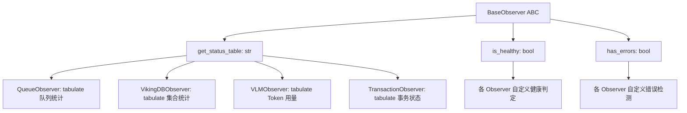
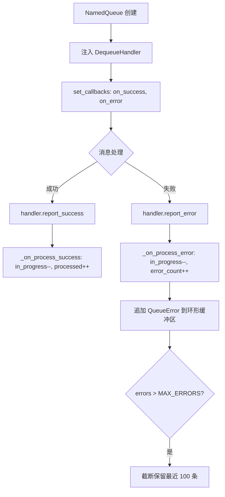
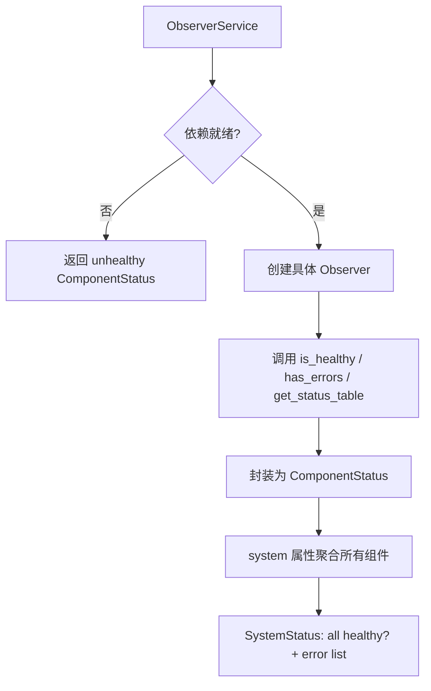

# PD-10.OV OpenViking — Observer 模式四组件存储监控管道

> 文档编号：PD-10.OV
> 来源：OpenViking `openviking/storage/observers/`
> GitHub：https://github.com/volcengine/OpenViking.git
> 问题域：PD-10 中间件管道 Middleware Pipeline
> 状态：可复用方案

---

## 第 1 章 问题与动机

### 1.1 核心问题

OpenViking 是一个多组件存储系统，包含队列处理（QueueFS）、向量数据库（VikingDB）、大语言模型调用（VLM）和事务管理（Transaction）四大子系统。每个子系统有独立的健康状态、错误计数和运行指标，需要一个统一的可观测性管道来：

1. **统一健康检查接口** — 不同子系统的健康判定逻辑各异（队列看 error_count、VikingDB 做 health_check RPC、VLM 始终健康、事务看 FAIL 状态），需要归一化为 `is_healthy() / has_errors()` 二元接口
2. **多层消费** — 同一套状态数据需要同时服务 CLI 命令行（`observer queue`）、HTTP API（`/api/v1/observer/system`）和内部服务（`DebugService.is_healthy()`）
3. **组件解耦** — Observer 不应持有被观测对象的实现细节，只依赖其公开接口

### 1.2 OpenViking 的解法概述

OpenViking 采用经典 Observer 模式构建四组件监控管道：

1. **BaseObserver 抽象基类** — 定义 `get_status_table()` / `is_healthy()` / `has_errors()` 三方法契约（`base_observer.py:12-48`）
2. **四个具体 Observer** — QueueObserver、VikingDBObserver、VLMObserver、TransactionObserver，每个包装一个子系统管理器实例
3. **ObserverService 聚合层** — 将四个 Observer 聚合为 `ComponentStatus` 数据类，提供 `system` 属性返回全局 `SystemStatus`（`debug_service.py:56-177`）
4. **双通道暴露** — CLI 通过 Typer 命令组（`observer_app`）、HTTP 通过 FastAPI Router（`/api/v1/observer/*`）同时暴露
5. **回调驱动的队列状态追踪** — NamedQueue 通过 `set_callbacks()` 注入 `on_success/on_error` 回调到 DequeueHandler，实现处理结果自动回流（`named_queue.py:65-82`）

### 1.3 设计思想

| 设计原则 | 具体实现 | 理由 | 替代方案 |
|----------|----------|------|----------|
| 接口归一化 | BaseObserver ABC 定义 3 个抽象方法 | 不同子系统健康判定逻辑差异大，统一接口屏蔽差异 | 每个子系统自行暴露 REST 端点 |
| 组合优于继承 | Observer 持有 Manager 引用而非继承 Manager | Observer 职责是"观测"，不应混入业务逻辑 | Observer 继承 Manager 并覆写方法 |
| 懒实例化 | ObserverService 每次属性访问时 new Observer | 避免 Observer 持有过期引用，始终读取最新状态 | 启动时创建 Observer 单例 |
| 回调注入 | DequeueHandlerBase.set_callbacks() | Handler 不需要知道 Queue 的计数逻辑，通过回调解耦 | Handler 直接操作 Queue 内部计数器 |
| 同步/异步双模 | get_status_table() 同步 + get_status_table_async() 异步 | CLI 场景同步调用，HTTP 场景异步调用 | 只提供异步版本，同步场景用 run_async 包装 |

---

## 第 2 章 源码实现分析

### 2.1 架构概览

OpenViking 的 Observer 管道分为三层：底层子系统管理器 → 中层 Observer 适配 → 上层聚合与暴露。

```
┌─────────────────────────────────────────────────────────────────┐
│                    消费层 (CLI / HTTP / Internal)                │
│  observer_app (Typer)    router (FastAPI)    DebugService       │
└──────────┬───────────────────┬──────────────────┬───────────────┘
           │                   │                  │
           ▼                   ▼                  ▼
┌─────────────────────────────────────────────────────────────────┐
│                    ObserverService 聚合层                        │
│  queue → ComponentStatus    vikingdb → ComponentStatus          │
│  vlm   → ComponentStatus    transaction → ComponentStatus      │
│                    system → SystemStatus                        │
└──────────┬───────────────────┬──────────────────┬───────────────┘
           │                   │                  │
           ▼                   ▼                  ▼
┌──────────────┐  ┌──────────────┐  ┌──────────────┐  ┌──────────────┐
│QueueObserver │  │VikingDB      │  │VLMObserver   │  │Transaction   │
│              │  │Observer      │  │              │  │Observer      │
│is_healthy()  │  │is_healthy()  │  │is_healthy()  │  │is_healthy()  │
│has_errors()  │  │has_errors()  │  │has_errors()  │  │has_errors()  │
│get_status()  │  │get_status()  │  │get_status()  │  │get_status()  │
└──────┬───────┘  └──────┬───────┘  └──────┬───────┘  └──────┬───────┘
       │                 │                 │                 │
       ▼                 ▼                 ▼                 ▼
┌──────────────┐  ┌──────────────┐  ┌──────────────┐  ┌──────────────┐
│QueueManager  │  │VikingDB      │  │VLMBase       │  │Transaction   │
│(Singleton)   │  │Manager       │  │              │  │Manager       │
└──────────────┘  └──────────────┘  └──────────────┘  └──────────────┘
```

### 2.2 核心实现

#### 2.2.1 BaseObserver 抽象基类



对应源码 `openviking/storage/observers/base_observer.py:12-48`：

```python
class BaseObserver(abc.ABC):
    """Abstract base class for storage system observers."""

    @abc.abstractmethod
    def get_status_table(self) -> str:
        """Format status information as a string."""
        pass

    @abc.abstractmethod
    def is_healthy(self) -> bool:
        """Check if the observed system is healthy."""
        pass

    @abc.abstractmethod
    def has_errors(self) -> bool:
        """Check if the observed system has any errors."""
        pass
```

三个方法的职责划分清晰：`get_status_table()` 负责人类可读的格式化输出（用 tabulate 库），`is_healthy()` 和 `has_errors()` 提供布尔判定供程序消费。

#### 2.2.2 回调驱动的队列状态追踪



对应源码 `openviking/storage/queuefs/named_queue.py:59-90`：

```python
class DequeueHandlerBase(abc.ABC):
    """Dequeue handler base class, supports callback mechanism."""

    _success_callback: Optional[Callable[[], None]] = None
    _error_callback: Optional[Callable[[str, Optional[Dict[str, Any]]], None]] = None

    def set_callbacks(
        self,
        on_success: Callable[[], None],
        on_error: Callable[[str, Optional[Dict[str, Any]]], None],
    ) -> None:
        self._success_callback = on_success
        self._error_callback = on_error

    def report_success(self) -> None:
        if self._success_callback:
            self._success_callback()

    def report_error(self, error_msg: str, data: Optional[Dict[str, Any]] = None) -> None:
        if self._error_callback:
            self._error_callback(error_msg, data)

    @abc.abstractmethod
    async def on_dequeue(self, data: Optional[Dict[str, Any]]) -> Optional[Dict[str, Any]]:
        pass
```

NamedQueue 在构造时自动注入回调（`named_queue.py:119-124`）：

```python
if self._dequeue_handler:
    self._dequeue_handler.set_callbacks(
        on_success=self._on_process_success,
        on_error=self._on_process_error,
    )
```

#### 2.2.3 ObserverService 聚合层



对应源码 `openviking/service/debug_service.py:56-170`：

```python
class ObserverService:
    def __init__(self, vikingdb=None, config=None):
        self._vikingdb = vikingdb
        self._config = config

    @property
    def queue(self) -> ComponentStatus:
        try:
            qm = get_queue_manager()
        except Exception:
            return ComponentStatus(name="queue", is_healthy=False, has_errors=True, status="Not initialized")
        observer = QueueObserver(qm)
        return ComponentStatus(
            name="queue",
            is_healthy=observer.is_healthy(),
            has_errors=observer.has_errors(),
            status=observer.get_status_table(),
        )

    @property
    def system(self) -> SystemStatus:
        components = {
            "queue": self.queue, "vikingdb": self.vikingdb,
            "vlm": self.vlm, "transaction": self.transaction,
        }
        errors = [f"{c.name} has errors" for c in components.values() if c.has_errors]
        return SystemStatus(
            is_healthy=all(c.is_healthy for c in components.values()),
            components=components, errors=errors,
        )
```

关键设计：每次访问 `queue` 属性都会 `new QueueObserver(qm)`，确保读取最新状态，不缓存过期数据。

### 2.3 实现细节

**TransactionObserver 的超时检测**（`transaction_observer.py:175-194`）：

TransactionObserver 提供 `get_hanging_transactions(timeout_threshold=300)` 方法，检测运行超过阈值的事务。这是一个被动查询接口，不主动触发告警，由上层消费者决定如何处理。

**QueueObserver 的 DAG 统计穿透**（`queue_observer.py:107-114`）：

QueueObserver 通过 `_get_semantic_dag_stats()` 方法穿透到 SemanticQueue 的 DequeueHandler，获取 DAG 执行器的节点统计（pending/in_progress/done），将其作为虚拟队列行展示在状态表中。这种穿透设计打破了 Observer 的纯粹性，但提供了更完整的系统视图。

**VLMObserver 的"永远健康"策略**（`vlm_observer.py:96-116`）：

VLMObserver 的 `is_healthy()` 始终返回 True，`has_errors()` 始终返回 False。因为 Token 用量追踪本身不存在"不健康"状态——它只是一个计数器。这是对 BaseObserver 接口的务实适配。

**线程安全的状态计数**（`named_queue.py:112-150`）：

NamedQueue 使用 `threading.Lock` 保护 `_in_progress`、`_processed`、`_error_count` 三个计数器，因为 QueueManager 的 worker 线程和主线程可能并发访问。错误记录使用环形缓冲区（`MAX_ERRORS=100`），防止内存泄漏。

---

## 第 3 章 迁移指南

### 3.1 迁移清单

**阶段 1：定义 Observer 基类**
- [ ] 创建 `BaseObserver` ABC，定义 `get_status_table()` / `is_healthy()` / `has_errors()` 三方法
- [ ] 选择状态格式化库（推荐 `tabulate` 或 `rich`）

**阶段 2：实现具体 Observer**
- [ ] 为每个需要监控的子系统创建 Observer 子类
- [ ] 每个 Observer 持有对应 Manager 的引用（组合模式）
- [ ] 实现各自的健康判定逻辑

**阶段 3：实现回调驱动的状态追踪**
- [ ] 定义 Handler 基类，包含 `set_callbacks()` 和 `report_success()` / `report_error()` 方法
- [ ] 在队列/管道创建时自动注入回调
- [ ] 使用线程锁保护共享计数器

**阶段 4：聚合与暴露**
- [ ] 创建 ObserverService 聚合层，统一返回 `ComponentStatus` / `SystemStatus`
- [ ] 通过 CLI 和 HTTP 双通道暴露

### 3.2 适配代码模板

以下模板可直接复用，实现一个最小化的 Observer 管道：

```python
"""Minimal Observer Pipeline — 可直接复用的代码模板"""
import abc
import threading
from dataclasses import dataclass
from typing import Any, Callable, Dict, List, Optional


# ---- Layer 1: Observer 基类 ----

class BaseObserver(abc.ABC):
    @abc.abstractmethod
    def get_status_table(self) -> str: ...

    @abc.abstractmethod
    def is_healthy(self) -> bool: ...

    @abc.abstractmethod
    def has_errors(self) -> bool: ...


# ---- Layer 2: 回调驱动的 Handler 基类 ----

class HandlerBase(abc.ABC):
    _on_success: Optional[Callable[[], None]] = None
    _on_error: Optional[Callable[[str], None]] = None

    def set_callbacks(self, on_success: Callable, on_error: Callable) -> None:
        self._on_success = on_success
        self._on_error = on_error

    def report_success(self) -> None:
        if self._on_success:
            self._on_success()

    def report_error(self, msg: str) -> None:
        if self._on_error:
            self._on_error(msg)

    @abc.abstractmethod
    async def handle(self, data: Dict[str, Any]) -> None: ...


# ---- Layer 3: 带状态追踪的队列 ----

class TrackedQueue:
    MAX_ERRORS = 100

    def __init__(self, name: str, handler: Optional[HandlerBase] = None):
        self.name = name
        self._handler = handler
        self._lock = threading.Lock()
        self._in_progress = 0
        self._processed = 0
        self._error_count = 0
        self._errors: List[str] = []

        if handler:
            handler.set_callbacks(
                on_success=self._on_success,
                on_error=self._on_error,
            )

    def _on_success(self) -> None:
        with self._lock:
            self._in_progress -= 1
            self._processed += 1

    def _on_error(self, msg: str) -> None:
        with self._lock:
            self._in_progress -= 1
            self._error_count += 1
            self._errors.append(msg)
            if len(self._errors) > self.MAX_ERRORS:
                self._errors = self._errors[-self.MAX_ERRORS:]

    @property
    def status(self) -> Dict[str, int]:
        with self._lock:
            return {
                "in_progress": self._in_progress,
                "processed": self._processed,
                "error_count": self._error_count,
            }


# ---- Layer 4: 聚合层 ----

@dataclass
class ComponentStatus:
    name: str
    is_healthy: bool
    has_errors: bool
    status: str

@dataclass
class SystemStatus:
    is_healthy: bool
    components: Dict[str, ComponentStatus]
    errors: List[str]


class ObserverService:
    def __init__(self, observers: Dict[str, BaseObserver]):
        self._observers = observers

    def get_component(self, name: str) -> ComponentStatus:
        obs = self._observers[name]
        return ComponentStatus(
            name=name,
            is_healthy=obs.is_healthy(),
            has_errors=obs.has_errors(),
            status=obs.get_status_table(),
        )

    def get_system(self) -> SystemStatus:
        components = {name: self.get_component(name) for name in self._observers}
        errors = [f"{c.name} has errors" for c in components.values() if c.has_errors]
        return SystemStatus(
            is_healthy=all(c.is_healthy for c in components.values()),
            components=components,
            errors=errors,
        )
```

### 3.3 适用场景

| 场景 | 适用度 | 说明 |
|------|--------|------|
| 多子系统存储平台 | ⭐⭐⭐ | 完美匹配：多个异构子系统需要统一健康检查 |
| Agent 编排系统 | ⭐⭐⭐ | 每个 Agent/Tool 可作为被观测组件 |
| 微服务网关 | ⭐⭐ | 适合聚合下游服务健康状态，但缺少主动推送能力 |
| 实时流处理 | ⭐ | Observer 是拉模式，不适合高频事件流场景 |
| 单体应用 | ⭐ | 过度设计，直接用日志即可 |

---

## 第 4 章 测试用例

```python
"""基于 OpenViking Observer 真实接口的测试用例"""
import pytest
import threading
from unittest.mock import MagicMock, AsyncMock, patch
from dataclasses import dataclass
from typing import Dict, Optional, Any


# ---- 测试 BaseObserver 契约 ----

class TestBaseObserverContract:
    """验证 Observer 子类必须实现所有抽象方法"""

    def test_cannot_instantiate_base(self):
        """BaseObserver 不能直接实例化"""
        import abc

        class BaseObserver(abc.ABC):
            @abc.abstractmethod
            def get_status_table(self) -> str: ...
            @abc.abstractmethod
            def is_healthy(self) -> bool: ...
            @abc.abstractmethod
            def has_errors(self) -> bool: ...

        with pytest.raises(TypeError):
            BaseObserver()

    def test_concrete_observer_must_implement_all(self):
        """缺少任一方法的子类不能实例化"""
        import abc

        class BaseObserver(abc.ABC):
            @abc.abstractmethod
            def get_status_table(self) -> str: ...
            @abc.abstractmethod
            def is_healthy(self) -> bool: ...
            @abc.abstractmethod
            def has_errors(self) -> bool: ...

        class PartialObserver(BaseObserver):
            def get_status_table(self) -> str:
                return "ok"
            # 缺少 is_healthy 和 has_errors

        with pytest.raises(TypeError):
            PartialObserver()


# ---- 测试回调驱动的状态追踪 ----

class TestCallbackDrivenTracking:
    """验证 Handler 回调正确更新 Queue 计数器"""

    def test_success_callback_updates_counters(self):
        """成功回调：in_progress-1, processed+1"""
        lock = threading.Lock()
        state = {"in_progress": 1, "processed": 0}

        def on_success():
            with lock:
                state["in_progress"] -= 1
                state["processed"] += 1

        on_success()
        assert state["in_progress"] == 0
        assert state["processed"] == 1

    def test_error_callback_with_ring_buffer(self):
        """错误回调：环形缓冲区截断到 MAX_ERRORS"""
        MAX_ERRORS = 100
        errors = []

        for i in range(150):
            errors.append(f"error-{i}")
            if len(errors) > MAX_ERRORS:
                errors = errors[-MAX_ERRORS:]

        assert len(errors) == 100
        assert errors[0] == "error-50"
        assert errors[-1] == "error-149"

    def test_thread_safety_of_counters(self):
        """多线程并发更新计数器不丢失"""
        lock = threading.Lock()
        counter = {"value": 0}

        def increment():
            for _ in range(1000):
                with lock:
                    counter["value"] += 1

        threads = [threading.Thread(target=increment) for _ in range(10)]
        for t in threads:
            t.start()
        for t in threads:
            t.join()

        assert counter["value"] == 10000


# ---- 测试 ObserverService 聚合 ----

class TestObserverServiceAggregation:
    """验证 SystemStatus 聚合逻辑"""

    def test_all_healthy(self):
        """所有组件健康 → 系统健康"""
        components = {
            "queue": MagicMock(is_healthy=True, has_errors=False, name="queue"),
            "vlm": MagicMock(is_healthy=True, has_errors=False, name="vlm"),
        }
        is_healthy = all(c.is_healthy for c in components.values())
        assert is_healthy is True

    def test_one_unhealthy_makes_system_unhealthy(self):
        """任一组件不健康 → 系统不健康"""
        components = {
            "queue": MagicMock(is_healthy=True, has_errors=False, name="queue"),
            "vlm": MagicMock(is_healthy=False, has_errors=True, name="vlm"),
        }
        is_healthy = all(c.is_healthy for c in components.values())
        errors = [c.name for c in components.values() if c.has_errors]
        assert is_healthy is False
        assert "vlm" in errors

    def test_vlm_always_healthy(self):
        """VLMObserver 始终返回 healthy（Token 追踪无健康状态）"""
        # 模拟 VLMObserver 行为
        assert True  # is_healthy() always True
        assert not False  # has_errors() always False


# ---- 测试 TransactionObserver 超时检测 ----

class TestTransactionObserverTimeout:
    """验证挂起事务检测"""

    def test_hanging_transaction_detection(self):
        """超过阈值的事务被检测到"""
        import time

        @dataclass
        class FakeTx:
            created_at: float
            status: str = "EXEC"
            locks: list = None
            def __post_init__(self):
                self.locks = self.locks or []

        transactions = {
            "tx-1": FakeTx(created_at=time.time() - 600),  # 10 min ago
            "tx-2": FakeTx(created_at=time.time() - 10),   # 10 sec ago
        }

        threshold = 300  # 5 min
        hanging = {
            tx_id: tx for tx_id, tx in transactions.items()
            if time.time() - tx.created_at > threshold
        }

        assert "tx-1" in hanging
        assert "tx-2" not in hanging
```

---

## 第 5 章 跨域关联

| 关联域 | 关系类型 | 说明 |
|--------|----------|------|
| PD-11 可观测性 | 强协同 | Observer 管道是可观测性的基础设施。QueueObserver 追踪 pending/in_progress/processed/errors 四维指标，VLMObserver 追踪 Token 用量（prompt/completion/total），TransactionObserver 追踪事务状态分布。这些数据可直接接入 Prometheus/Grafana |
| PD-06 记忆持久化 | 协同 | QueueManager 的 `wait_complete()` 方法依赖 Observer 的 `is_all_complete()` 判定，确保所有队列处理完成后才进行持久化操作 |
| PD-02 多 Agent 编排 | 协同 | SemanticDagExecutor 的 DAG 统计通过 QueueObserver 穿透暴露，编排层可据此判断语义处理进度 |
| PD-03 容错与重试 | 依赖 | TransactionObserver 的 `get_failed_transactions()` 和 `get_hanging_transactions()` 为容错层提供故障检测信号，但 OpenViking 当前未实现自动重试 |
| PD-07 质量检查 | 协同 | Observer 的 `system.is_healthy` 可作为质量门控的前置条件——系统不健康时拒绝新的处理请求 |

---

## 第 6 章 来源文件索引

| 文件 | 行范围 | 关键实现 |
|------|--------|----------|
| `openviking/storage/observers/base_observer.py` | L12-L48 | BaseObserver ABC：3 个抽象方法定义 |
| `openviking/storage/observers/queue_observer.py` | L20-L121 | QueueObserver：队列状态表格化 + DAG 统计穿透 |
| `openviking/storage/observers/vlm_observer.py` | L16-L117 | VLMObserver：Token 用量追踪，永远健康策略 |
| `openviking/storage/observers/vikingdb_observer.py` | L19-L133 | VikingDBObserver：集合状态 + health_check RPC |
| `openviking/storage/observers/transaction_observer.py` | L21-L223 | TransactionObserver：7 态状态机监控 + 超时检测 |
| `openviking/storage/queuefs/named_queue.py` | L46-L90 | EnqueueHookBase + DequeueHandlerBase：回调驱动接口 |
| `openviking/storage/queuefs/named_queue.py` | L92-L170 | NamedQueue：线程安全计数器 + 环形错误缓冲区 |
| `openviking/storage/queuefs/queue_manager.py` | L62-L379 | QueueManager 单例：worker 线程 + 并发信号量 |
| `openviking/service/debug_service.py` | L56-L177 | ObserverService 聚合层：懒实例化 + SystemStatus |
| `openviking/server/routers/observer.py` | L1-L93 | FastAPI Router：4 个组件端点 + system 聚合端点 |
| `openviking_cli/cli/commands/observer.py` | L1-L39 | Typer CLI：observer 命令组注册 |
| `openviking/storage/queuefs/semantic_processor.py` | L36-L222 | SemanticProcessor：DequeueHandlerBase 实现，report_success/error 调用 |
| `openviking/storage/transaction/transaction_record.py` | L16-L28 | TransactionStatus 7 态枚举：INIT→AQUIRE→EXEC→COMMIT/FAIL→RELEASING→RELEASED |
| `third_party/agfs/agfs-shell/agfs_shell/pipeline.py` | L12-L293 | StreamingPipeline：Queue-based 进程间流式管道 |

---

## 第 7 章 横向对比维度

```json comparison_data
{
  "project": "OpenViking",
  "dimensions": {
    "中间件基类": "BaseObserver ABC 定义 get_status_table/is_healthy/has_errors 三方法契约",
    "钩子点": "EnqueueHookBase.on_enqueue 入队前 + DequeueHandlerBase.on_dequeue 出队后",
    "中间件数量": "4 个 Observer（Queue/VikingDB/VLM/Transaction）+ 2 个 Handler 基类",
    "条件激活": "ObserverService 按依赖就绪状态决定是否创建 Observer，未就绪返回 unhealthy 占位",
    "状态管理": "NamedQueue 线程锁保护 in_progress/processed/error_count 三计数器",
    "执行模型": "拉模式：每次属性访问时 new Observer 读取最新状态，不缓存",
    "错误隔离": "每个 Observer 独立 try-except，单组件故障不影响其他组件状态查询",
    "数据传递": "回调注入：Handler.set_callbacks() 将 Queue 的计数方法注入 Handler",
    "可观测性": "tabulate 格式化表格 + ComponentStatus/SystemStatus 结构化数据双输出",
    "超时保护": "TransactionObserver.get_hanging_transactions(threshold=300s) 被动检测",
    "同步热路径": "同步 get_status_table() + 异步 get_status_table_async() 双模支持",
    "外部管理器集成": "Observer 持有 Manager 引用（组合模式），不继承不侵入",
    "通知路由": "CLI Typer 命令组 + FastAPI /api/v1/observer/* 双通道暴露",
    "环形错误缓冲": "QueueError 列表截断到 MAX_ERRORS=100，防止内存泄漏"
  }
}
```

### 域元数据补充

```json domain_metadata
{
  "solution_summary": "OpenViking 用 BaseObserver ABC + 4 个具体 Observer + ObserverService 聚合层构建拉模式四组件存储监控管道，通过回调注入实现 Handler→Queue 状态回流",
  "description": "拉模式 Observer 管道：每次查询时实例化 Observer 读取最新状态，适合低频健康检查场景",
  "sub_problems": [
    "Observer 穿透查询：Observer 需要穿透到 Handler 内部获取 DAG 统计等深层数据",
    "永远健康组件适配：部分子系统无健康状态概念时如何适配统一接口",
    "环形错误缓冲区容量：错误记录的保留数量与内存占用的平衡策略",
    "懒实例化 vs 缓存：每次 new Observer 的开销与缓存过期数据的风险权衡"
  ],
  "best_practices": [
    "Observer 每次查询时新建实例：避免缓存过期状态，始终读取最新数据",
    "回调注入解耦 Handler 与 Queue：Handler 通过 report_success/error 回调更新计数，不直接操作 Queue 内部状态",
    "环形缓冲区限制错误记录：MAX_ERRORS=100 截断防止内存泄漏，保留最近错误供诊断",
    "组合优于继承：Observer 持有 Manager 引用而非继承，职责清晰不侵入业务逻辑"
  ]
}
```
