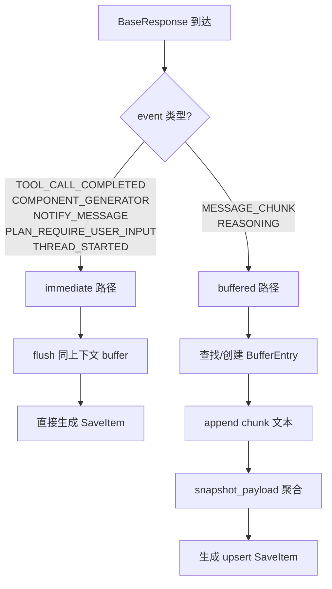
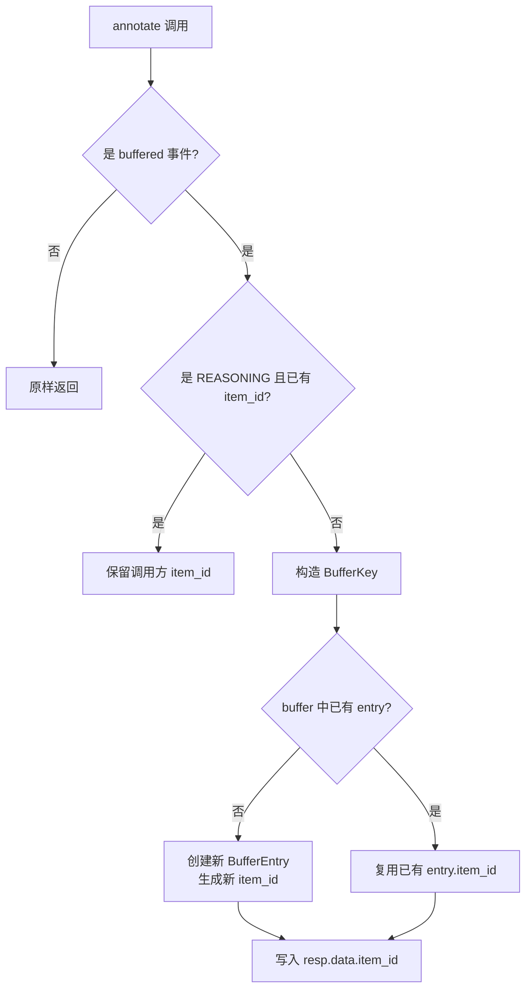
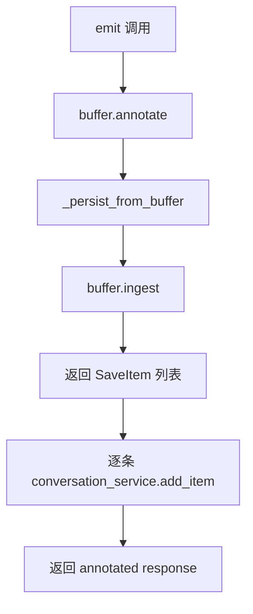

# PD-10.07 ValueCell — ResponseBuffer 流式中间件管道

> 文档编号：PD-10.07
> 来源：ValueCell `python/valuecell/core/event/buffer.py`, `service.py`, `router.py`, `factory.py`
> GitHub：https://github.com/ValueCell-ai/valuecell.git
> 问题域：PD-10 中间件管道 Middleware Pipeline
> 状态：可复用方案

---

## 第 1 章 问题与动机

### 1.1 核心问题

LLM Agent 的流式响应天然是碎片化的：一个完整段落被拆成几十个 token chunk 推送到前端。如果每个 chunk 都直接持久化为独立的 ConversationItem，会导致：

1. **存储膨胀**：一段 200 字的回复可能产生 30+ 条数据库记录
2. **前端渲染混乱**：重新加载对话历史时，每个 chunk 都是独立消息
3. **ID 不稳定**：流式过程中无法为"这段话"分配一个稳定标识符，前端无法做增量更新
4. **事件语义丢失**：工具调用完成、系统通知等"原子事件"和流式 chunk 混在一起，无法区分处理

ValueCell 面对的核心挑战是：如何在流式推送的同时，保证持久化层看到的是段落级聚合结果，且每个段落有稳定的 `item_id` 贯穿整个生命周期。

### 1.2 ValueCell 的解法概述

ValueCell 设计了一个三组件事件管道（ResponseBuffer + ResponseFactory + ResponseRouter），通过 EventResponseService 统一编排：

1. **双轨事件分类**：将所有事件分为 immediate（工具调用完成、通知、系统事件）和 buffered（消息 chunk、推理），两类事件走完全不同的处理路径（`buffer.py:95-105`）
2. **段落级聚合 + 稳定 ID**：BufferEntry 为每个逻辑段落维护一个 `item_id`，所有属于同一段落的 chunk 共享这个 ID，前端可做增量 upsert（`buffer.py:39-77`）
3. **annotate→ingest→flush 三阶段链**：annotate 打标签、ingest 聚合/直通、flush 强制清空，三个阶段解耦且可独立调用（`service.py:36-57`）
4. **工厂模式统一构造**：ResponseFactory 封装 15+ 种响应类型的构造逻辑，支持从持久化记录反向重建响应对象（`factory.py:72-640`）
5. **路由器模式匹配**：ResponseRouter 将 A2A 协议的 TaskStatusUpdateEvent 映射为内部 BaseResponse，并产生 SideEffect 指令（`router.py:61-169`）

### 1.3 设计思想

| 设计原则 | 具体实现 | 理由 | 替代方案 |
|----------|----------|------|----------|
| 双轨分流 | immediate 事件直通 + buffered 事件聚合 | 工具调用等原子事件不能被缓冲延迟 | 全部缓冲（延迟高）/ 全部直通（存储膨胀） |
| 稳定段落 ID | BufferEntry.item_id 在 chunk 间复用 | 前端需要稳定锚点做增量渲染 | 每个 chunk 独立 ID（无法关联） |
| 边界触发 flush | immediate 事件到达时自动 flush 同上下文的 buffer | 保证事件时序：段落内容先于工具调用结果 | 定时 flush（时序不确定） |
| 工厂 + 路由分离 | Factory 只管构造，Router 只管映射 | 单一职责，Router 可独立测试 | 合并为一个大类（难以测试） |
| SideEffect 指令 | Router 返回 SideEffect 而非直接操作 | 路由层不应有副作用，由编排层执行 | Router 直接修改 Task 状态（耦合） |

---

## 第 2 章 源码实现分析

### 2.1 架构概览

ValueCell 的事件管道由四个核心组件组成，通过 EventResponseService 串联：

```
┌─────────────────────────────────────────────────────────────────┐
│                    EventResponseService                         │
│                      (service.py:15)                            │
│                                                                 │
│  ┌──────────────┐  ┌────────────────┐  ┌──────────────────┐    │
│  │ ResponseFactory│  │ ResponseBuffer │  │ ConversationSvc  │    │
│  │  (factory.py) │  │  (buffer.py)   │  │  (persistence)   │    │
│  └──────┬───────┘  └───────┬────────┘  └────────┬─────────┘    │
│         │                  │                     │              │
│         │    annotate()    │    ingest()         │  add_item()  │
│         │  ──────────────→ │  ──────────────→    │              │
│         │                  │    flush_task()     │              │
│         │                  │  ──────────────→    │              │
│  ┌──────┴───────┐                                              │
│  │ResponseRouter │  handle_status_update()                     │
│  │  (router.py)  │  A2A event → BaseResponse + SideEffect     │
│  └──────────────┘                                              │
└─────────────────────────────────────────────────────────────────┘
```

数据流：

```
Agent 流式输出
    ↓
TaskExecutor 接收 A2A TaskStatusUpdateEvent
    ↓
ResponseRouter.handle_status_update()  →  RouteResult(responses, side_effects)
    ↓
ResponseFactory 构造 BaseResponse
    ↓
EventResponseService.emit(response)
    ├→ ResponseBuffer.annotate()   [打稳定 item_id]
    ├→ ResponseBuffer.ingest()     [聚合或直通]
    └→ ConversationService.add_item()  [持久化 SaveItem]
    ↓
前端 SSE 接收
```

### 2.2 核心实现

#### 2.2.1 双轨事件分类与 BufferEntry 聚合



对应源码 `python/valuecell/core/event/buffer.py:79-216`：

```python
class ResponseBuffer:
    def __init__(self):
        self._buffers: Dict[BufferKey, BufferEntry] = {}
        self._immediate_events = {
            StreamResponseEvent.TOOL_CALL_COMPLETED,
            CommonResponseEvent.COMPONENT_GENERATOR,
            NotifyResponseEvent.MESSAGE,
            SystemResponseEvent.PLAN_REQUIRE_USER_INPUT,
            SystemResponseEvent.THREAD_STARTED,
        }
        self._buffered_events = {
            StreamResponseEvent.MESSAGE_CHUNK,
            StreamResponseEvent.REASONING,
        }

    def ingest(self, resp: BaseResponse) -> List[SaveItem]:
        data: UnifiedResponseData = resp.data
        ev = resp.event
        ctx = (data.conversation_id, data.thread_id, data.task_id)
        out: List[SaveItem] = []

        if ev in self._immediate_events:
            # 边界触发：先 flush 同上下文的 buffered 内容
            conv_id, th_id, tk_id = ctx
            keys_to_flush = self._collect_task_keys(conv_id, th_id, tk_id)
            out.extend(self._finalize_keys(keys_to_flush))
            out.append(self._make_save_item_from_response(resp))
            return out

        if ev in self._buffered_events:
            key: BufferKey = (*ctx, ev)
            entry = self._buffers.get(key)
            if not entry:
                entry = BufferEntry(role=data.role, agent_name=data.agent_name)
                self._buffers[key] = entry
            # 提取文本并追加
            text = self._extract_text(payload)
            if text:
                entry.append(text)
                snap = entry.snapshot_payload()
                if snap is not None:
                    out.append(self._make_save_item(
                        event=ev, data=data, payload=snap, item_id=entry.item_id
                    ))
            return out
        return out  # 未知事件忽略
```

关键设计点：
- **BufferKey** 是 `(conversation_id, thread_id, task_id, event)` 四元组（`buffer.py:36`），同一对话的消息 chunk 和推理 chunk 分别聚合
- **边界触发 flush**：immediate 事件到达时，先把同上下文的 buffered 内容全部 finalize（`buffer.py:168-171`），保证时序正确
- **snapshot 而非 drain**：`snapshot_payload()` 不清空 parts，每次 ingest 都返回完整聚合内容做 upsert（`buffer.py:68-76`）

#### 2.2.2 annotate 阶段：稳定 ID 注入



对应源码 `python/valuecell/core/event/buffer.py:107-143`：

```python
def annotate(self, resp: BaseResponse) -> BaseResponse:
    data: UnifiedResponseData = resp.data
    ev = resp.event
    if ev in self._buffered_events:
        # REASONING 事件信任调用方的 item_id
        if ev == StreamResponseEvent.REASONING and data.item_id:
            return resp
        key: BufferKey = (
            data.conversation_id, data.thread_id, data.task_id, ev,
        )
        entry = self._buffers.get(key)
        if not entry:
            entry = BufferEntry(role=data.role, agent_name=data.agent_name)
            self._buffers[key] = entry
        # 用 buffer 的稳定 ID 覆盖响应的 item_id
        data.item_id = entry.item_id
        resp.data = data
    return resp
```

这里有一个精妙的区分：REASONING 事件的 `item_id` 由编排层（orchestrator）预设，用于关联 `reasoning_started` / `reasoning` / `reasoning_completed` 三个阶段；而 MESSAGE_CHUNK 始终使用 buffer 分配的段落 ID。

#### 2.2.3 EventResponseService：三阶段编排



对应源码 `python/valuecell/core/event/service.py:15-80`：

```python
class EventResponseService:
    def __init__(self, conversation_service, response_factory=None, response_buffer=None):
        self._conversation_service = conversation_service
        self._factory = response_factory or ResponseFactory()
        self._buffer = response_buffer or ResponseBuffer()

    async def emit(self, response: BaseResponse) -> BaseResponse:
        annotated = self._buffer.annotate(response)
        await self._persist_from_buffer(annotated)
        return annotated

    async def flush_task_response(self, conversation_id, thread_id, task_id):
        items = self._buffer.flush_task(conversation_id, thread_id, task_id)
        await self._persist_items(items)

    async def _persist_from_buffer(self, response: BaseResponse):
        items = self._buffer.ingest(response)
        await self._persist_items(items)

    async def _persist_items(self, items: list[SaveItem]):
        for item in items:
            await self._conversation_service.add_item(
                role=item.role, event=item.event,
                conversation_id=item.conversation_id,
                thread_id=item.thread_id, task_id=item.task_id,
                payload=item.payload, item_id=item.item_id,
                agent_name=item.agent_name, metadata=item.metadata,
            )
```

### 2.3 实现细节

#### ResponseRouter 的 SideEffect 模式

Router 不直接修改 Task 状态，而是返回 `SideEffect` 指令让编排层执行（`router.py:18-58`）：

```python
class SideEffectKind(Enum):
    FAIL_TASK = "fail_task"

@dataclass
class RouteResult:
    responses: List[BaseResponse]
    done: bool = False
    side_effects: List[SideEffect] = None
```

当 A2A 远程 Agent 报告 `TaskState.failed` 时，Router 返回 `SideEffect(kind=FAIL_TASK, reason=err_msg)`（`router.py:75-91`），编排层收到后执行实际的 Task 状态变更。这种"指令返回"模式让 Router 保持纯函数特性，易于测试。

#### ResponseFactory 的双向转换

Factory 不仅能构造响应，还能从持久化的 ConversationItem 反向重建 BaseResponse（`factory.py:73-197`）。它遍历 5 种事件枚举类尝试反序列化，处理了字符串形式的枚举值（历史数据兼容）。这使得对话历史加载时能复用完全相同的类型系统。

#### EventPredicates 谓词集中化

所有事件类型判断集中在 `EventPredicates` 类（`responses.py:220-299`），提供 `is_tool_call`、`is_reasoning`、`is_message` 等静态方法。Router 和其他消费者通过谓词而非直接比较枚举值来分类事件，新增事件类型时只需修改谓词定义。

---

## 第 3 章 迁移指南

### 3.1 迁移清单

**阶段 1：事件类型定义**
- [ ] 定义事件枚举（StreamEvent、SystemEvent、NotifyEvent），区分 immediate 和 buffered
- [ ] 定义 UnifiedResponseData 统一数据信封（conversation_id + thread_id + task_id + payload + item_id）
- [ ] 定义 BaseResponse 抽象基类和各子类型

**阶段 2：Buffer 核心**
- [ ] 实现 BufferEntry（parts 列表 + stable item_id + snapshot_payload）
- [ ] 实现 ResponseBuffer（annotate / ingest / flush_task 三方法）
- [ ] 定义 BufferKey 四元组和 SaveItem 数据类

**阶段 3：Factory + Router**
- [ ] 实现 ResponseFactory（每种事件类型一个构造方法 + from_conversation_item 反序列化）
- [ ] 实现 ResponseRouter（A2A 事件 → BaseResponse + SideEffect 映射）
- [ ] 实现 EventPredicates 谓词类

**阶段 4：Service 编排**
- [ ] 实现 EventResponseService（emit → annotate → ingest → persist 链）
- [ ] 集成 ConversationService 持久化层
- [ ] 在 TaskExecutor 中调用 emit / flush_task_response

### 3.2 适配代码模板

以下是一个精简版的 ResponseBuffer 实现，可直接用于任何流式 Agent 系统：

```python
import time
from dataclasses import dataclass, field
from enum import Enum
from typing import Dict, List, Optional, Tuple
from uuid import uuid4


class EventKind(Enum):
    MESSAGE_CHUNK = "message_chunk"
    REASONING = "reasoning"
    TOOL_CALL_COMPLETED = "tool_call_completed"
    NOTIFY = "notify"


# 配置：哪些事件走缓冲，哪些直通
BUFFERED_EVENTS = {EventKind.MESSAGE_CHUNK, EventKind.REASONING}
IMMEDIATE_EVENTS = {EventKind.TOOL_CALL_COMPLETED, EventKind.NOTIFY}

BufferKey = Tuple[str, str, EventKind]  # (conversation_id, task_id, event)


@dataclass
class BufferEntry:
    item_id: str = field(default_factory=lambda: f"item-{uuid4().hex[:12]}")
    parts: List[str] = field(default_factory=list)
    last_updated: float = field(default_factory=time.monotonic)

    def append(self, text: str):
        self.parts.append(text)
        self.last_updated = time.monotonic()

    def snapshot(self) -> Optional[str]:
        return "".join(self.parts) if self.parts else None


@dataclass
class SaveItem:
    item_id: str
    event: EventKind
    conversation_id: str
    task_id: str
    content: str


class StreamBuffer:
    """精简版 ResponseBuffer，支持 annotate→ingest→flush 三阶段。"""

    def __init__(self):
        self._buffers: Dict[BufferKey, BufferEntry] = {}

    def annotate(self, conversation_id: str, task_id: str,
                 event: EventKind) -> Optional[str]:
        """为 buffered 事件返回稳定的段落 item_id。"""
        if event not in BUFFERED_EVENTS:
            return None
        key = (conversation_id, task_id, event)
        if key not in self._buffers:
            self._buffers[key] = BufferEntry()
        return self._buffers[key].item_id

    def ingest(self, conversation_id: str, task_id: str,
               event: EventKind, content: str) -> List[SaveItem]:
        """处理事件，返回需要持久化的 SaveItem 列表。"""
        out: List[SaveItem] = []

        if event in IMMEDIATE_EVENTS:
            # 边界触发：先 flush 同上下文的 buffer
            out.extend(self._flush_context(conversation_id, task_id))
            out.append(SaveItem(
                item_id=f"item-{uuid4().hex[:12]}",
                event=event, conversation_id=conversation_id,
                task_id=task_id, content=content,
            ))
            return out

        if event in BUFFERED_EVENTS:
            key = (conversation_id, task_id, event)
            entry = self._buffers.setdefault(key, BufferEntry())
            entry.append(content)
            snap = entry.snapshot()
            if snap:
                out.append(SaveItem(
                    item_id=entry.item_id, event=event,
                    conversation_id=conversation_id,
                    task_id=task_id, content=snap,
                ))
        return out

    def flush(self, conversation_id: str, task_id: str) -> List[SaveItem]:
        """强制清空指定上下文的所有 buffer。"""
        return self._flush_context(conversation_id, task_id)

    def _flush_context(self, conv_id: str, task_id: str) -> List[SaveItem]:
        out: List[SaveItem] = []
        keys = [k for k in self._buffers
                if k[0] == conv_id and k[1] == task_id]
        for key in keys:
            entry = self._buffers.pop(key)
            snap = entry.snapshot()
            if snap:
                out.append(SaveItem(
                    item_id=entry.item_id, event=key[2],
                    conversation_id=conv_id, task_id=task_id, content=snap,
                ))
        return out
```

### 3.3 适用场景

| 场景 | 适用度 | 说明 |
|------|--------|------|
| LLM 流式对话 + 持久化 | ⭐⭐⭐ | 核心场景：chunk 聚合 + 稳定 ID |
| 多 Agent 并行流式输出 | ⭐⭐⭐ | BufferKey 含 task_id，天然隔离 |
| 纯前端流式渲染（无持久化） | ⭐⭐ | 只需 annotate 阶段分配稳定 ID |
| 批量非流式 Agent | ⭐ | 无 chunk 聚合需求，直接持久化即可 |
| 需要 chunk 级回放的场景 | ⭐ | 本方案聚合后丢失 chunk 粒度 |

---

## 第 4 章 测试用例

```python
import pytest
from unittest.mock import MagicMock
from typing import List


class TestBufferEntry:
    """测试 BufferEntry 的 chunk 聚合和 snapshot 行为。"""

    def test_empty_snapshot_returns_none(self):
        entry = BufferEntry()
        assert entry.snapshot() is None

    def test_append_and_snapshot(self):
        entry = BufferEntry()
        entry.append("Hello ")
        entry.append("World")
        assert entry.snapshot() == "Hello World"

    def test_stable_item_id_across_appends(self):
        entry = BufferEntry()
        original_id = entry.item_id
        entry.append("chunk1")
        entry.append("chunk2")
        assert entry.item_id == original_id

    def test_last_updated_advances(self):
        entry = BufferEntry()
        t0 = entry.last_updated
        entry.append("text")
        assert entry.last_updated >= t0


class TestStreamBuffer:
    """测试 StreamBuffer 的双轨分流和边界触发。"""

    def setup_method(self):
        self.buffer = StreamBuffer()
        self.conv = "conv-1"
        self.task = "task-1"

    def test_buffered_event_aggregates(self):
        items = self.buffer.ingest(
            self.conv, self.task, EventKind.MESSAGE_CHUNK, "Hello ")
        assert len(items) == 1
        assert items[0].content == "Hello "

        items = self.buffer.ingest(
            self.conv, self.task, EventKind.MESSAGE_CHUNK, "World")
        assert len(items) == 1
        assert items[0].content == "Hello World"
        # 同一个 item_id
        assert items[0].item_id == self.buffer._buffers[
            (self.conv, self.task, EventKind.MESSAGE_CHUNK)].item_id

    def test_immediate_event_flushes_buffer(self):
        self.buffer.ingest(
            self.conv, self.task, EventKind.MESSAGE_CHUNK, "partial")
        items = self.buffer.ingest(
            self.conv, self.task, EventKind.TOOL_CALL_COMPLETED, "tool result")
        # 应该有 2 个 SaveItem：flush 的段落 + immediate 事件
        assert len(items) == 2
        assert items[0].event == EventKind.MESSAGE_CHUNK
        assert items[0].content == "partial"
        assert items[1].event == EventKind.TOOL_CALL_COMPLETED

    def test_annotate_returns_stable_id(self):
        id1 = self.buffer.annotate(self.conv, self.task, EventKind.MESSAGE_CHUNK)
        id2 = self.buffer.annotate(self.conv, self.task, EventKind.MESSAGE_CHUNK)
        assert id1 == id2
        assert id1 is not None

    def test_annotate_returns_none_for_immediate(self):
        result = self.buffer.annotate(
            self.conv, self.task, EventKind.TOOL_CALL_COMPLETED)
        assert result is None

    def test_flush_clears_buffer(self):
        self.buffer.ingest(
            self.conv, self.task, EventKind.MESSAGE_CHUNK, "buffered")
        items = self.buffer.flush(self.conv, self.task)
        assert len(items) == 1
        assert items[0].content == "buffered"
        # buffer 已清空
        assert len(self.buffer._buffers) == 0

    def test_different_tasks_isolated(self):
        self.buffer.ingest(self.conv, "task-A", EventKind.MESSAGE_CHUNK, "A")
        self.buffer.ingest(self.conv, "task-B", EventKind.MESSAGE_CHUNK, "B")
        items = self.buffer.flush(self.conv, "task-A")
        assert len(items) == 1
        assert items[0].content == "A"
        # task-B 的 buffer 不受影响
        assert (self.conv, "task-B", EventKind.MESSAGE_CHUNK) in self.buffer._buffers
```

---

## 第 5 章 跨域关联

| 关联域 | 关系类型 | 说明 |
|--------|----------|------|
| PD-01 上下文管理 | 协同 | BufferEntry 的段落聚合本质上是上下文压缩的一种形式——将 N 个 chunk 压缩为 1 个段落 |
| PD-02 多 Agent 编排 | 依赖 | EventResponseService 被 TaskExecutor 调用，TaskExecutor 是多 Agent 编排的执行单元；BufferKey 含 task_id 实现多 Agent 流式隔离 |
| PD-03 容错与重试 | 协同 | ResponseRouter 的 SideEffect(FAIL_TASK) 机制是容错链的一环；flush_task 在任务失败时也会被调用，确保已缓冲内容不丢失 |
| PD-04 工具系统 | 协同 | TOOL_CALL_COMPLETED 作为 immediate 事件触发 buffer flush，工具调用结果的持久化依赖本管道 |
| PD-06 记忆持久化 | 依赖 | 管道的最终输出 SaveItem 通过 ConversationService.add_item 持久化，是记忆系统的写入入口 |
| PD-11 可观测性 | 协同 | SaveItem 携带 item_id、agent_name、metadata，为可观测性提供结构化追踪数据 |

---

## 第 6 章 来源文件索引

| 文件 | 行范围 | 关键实现 |
|------|--------|----------|
| `python/valuecell/core/event/buffer.py` | L1-325 | ResponseBuffer 核心：BufferEntry、annotate、ingest、flush_task、SaveItem |
| `python/valuecell/core/event/factory.py` | L1-640 | ResponseFactory：15+ 种响应构造方法、from_conversation_item 反序列化 |
| `python/valuecell/core/event/router.py` | L1-170 | ResponseRouter：handle_status_update、SideEffect、RouteResult |
| `python/valuecell/core/event/service.py` | L1-81 | EventResponseService：emit、emit_many、flush_task_response 编排 |
| `python/valuecell/core/agent/responses.py` | L220-306 | EventPredicates：is_tool_call、is_reasoning、is_message 谓词 |
| `python/valuecell/core/agent/responses.py` | L16-139 | _StreamResponseNamespace / _NotifyResponseNamespace 工厂命名空间 |
| `python/valuecell/core/types.py` | L38-78 | 事件枚举定义：SystemResponseEvent、StreamResponseEvent、NotifyResponseEvent |
| `python/valuecell/core/types.py` | L284-319 | UnifiedResponseData、BaseResponse 数据信封 |
| `python/valuecell/core/types.py` | L130-147 | BaseResponseDataPayload、ComponentGeneratorResponseDataPayload |

---

## 第 7 章 横向对比维度

```json comparison_data
{
  "project": "ValueCell",
  "dimensions": {
    "中间件基类": "无基类继承，ResponseBuffer 单类封装 annotate/ingest/flush 三阶段",
    "钩子点": "annotate（ID 注入）→ ingest（聚合/直通）→ flush（强制清空）三阶段链",
    "中间件数量": "4 组件：Buffer + Factory + Router + Service，非传统中间件链",
    "条件激活": "事件枚举集合判断：_immediate_events 和 _buffered_events 两个 set",
    "状态管理": "Dict[BufferKey, BufferEntry] 内存字典，BufferKey 四元组隔离",
    "执行模型": "async emit 串行处理，ingest 内部同步聚合",
    "同步热路径": "annotate + ingest 同步执行，persist 异步 await",
    "错误隔离": "Router 返回 SideEffect 指令而非直接操作，编排层决定是否执行",
    "数据传递": "SaveItem dataclass 作为 Buffer→Persistence 的传输对象",
    "通知路由": "NotifyResponseEvent.MESSAGE 作为 immediate 事件直通持久化",
    "可观测性": "SaveItem 携带 item_id + agent_name + metadata 结构化追踪",
    "双向序列化": "Factory.from_conversation_item 支持持久化记录反向重建 BaseResponse"
  }
}
```

### 域元数据补充

```json domain_metadata
{
  "solution_summary": "ValueCell 用 ResponseBuffer 双轨分流（immediate 直通 + buffered 聚合）实现流式 chunk 段落级聚合，通过 annotate→ingest→flush 三阶段链保证稳定 item_id 和事件时序",
  "description": "流式响应的 chunk 聚合与段落级持久化策略",
  "sub_problems": [
    "段落 ID 稳定性：流式 chunk 如何共享同一个 item_id 贯穿整个段落生命周期",
    "边界触发 flush：immediate 事件到达时如何自动清空同上下文的 buffered 内容保证时序",
    "双向序列化：持久化记录如何反向重建为内存中的类型化响应对象",
    "SideEffect 指令模式：路由层如何通过返回指令而非直接操作来保持纯函数特性"
  ],
  "best_practices": [
    "snapshot 而非 drain：每次 ingest 返回完整聚合内容做 upsert，不清空 buffer，支持增量更新",
    "REASONING 事件信任调用方 item_id：编排层预设的关联 ID 优先于 buffer 分配的段落 ID",
    "BufferKey 四元组隔离：conversation_id + thread_id + task_id + event 确保多 Agent 多事件类型互不干扰",
    "Factory 双向转换：构造方法和 from_conversation_item 共用同一套类型系统，消除序列化/反序列化不一致"
  ]
}
```
