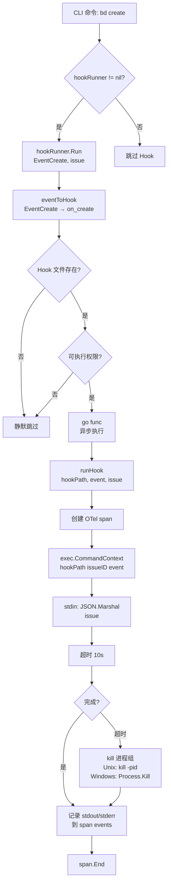
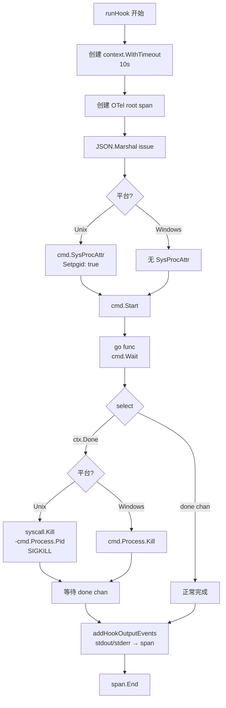
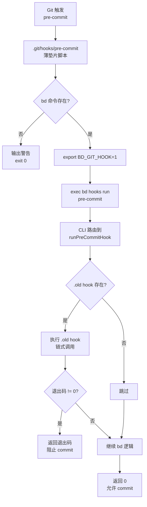
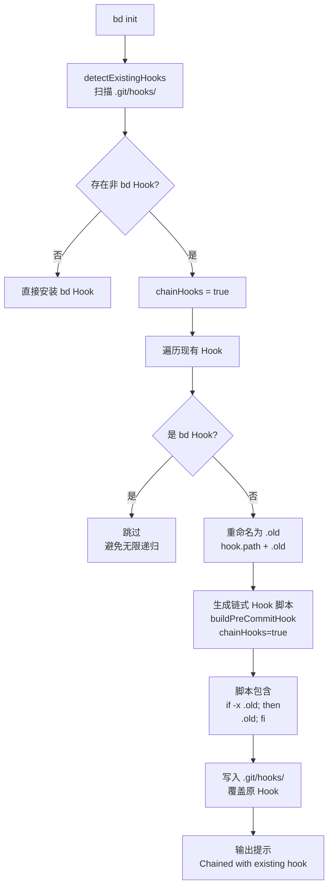
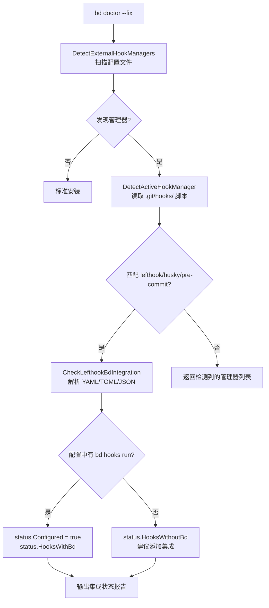

# PD-10.01 beads — 双层Hook系统与外部管理器链式集成

> 文档编号：PD-10.01
> 来源：beads `internal/hooks/hooks.go`, `cmd/bd/hooks.go`, `cmd/bd/init_git_hooks.go`
> GitHub：https://github.com/steveyegge/beads.git
> 问题域：PD-10 中间件管道 Middleware Pipeline
> 状态：可复用方案

---

## 第 1 章 问题与动机（≥ 30 行）

### 1.1 核心问题

Agent 工程系统需要在关键生命周期事件（创建、更新、关闭）时触发扩展逻辑，同时需要与 Git 工作流深度集成。核心挑战包括：

1. **双重 Hook 需求**：既需要应用层 Hook（issue 生命周期事件），又需要 Git Hook（pre-commit/post-merge）
2. **版本同步问题**：Git Hook 是静态脚本，CLI 工具升级后 Hook 逻辑可能过时
3. **外部工具冲突**：用户可能已安装 lefthook/husky/pre-commit 等 Hook 管理器，直接覆盖会破坏现有工作流
4. **跨平台进程管理**：Hook 脚本可能产生子进程，超时时需要可靠终止整个进程树（Unix 进程组 vs Windows 单进程）
5. **可观测性缺失**：Hook 执行失败时难以追踪，缺少结构化日志和追踪

### 1.2 beads 的解法概述

beads 通过**双层 Hook 架构 + 外部管理器链式集成**解决上述问题：

1. **应用层 Hook Runner**（`internal/hooks/hooks.go:28-95`）：异步执行 `.beads/hooks/` 下的可执行脚本，支持 `on_create`/`on_update`/`on_close` 三个生命周期事件，通过 stdin 传递 Issue JSON 数据
2. **Git Hook 薄垫片模式**（`cmd/bd/templates/hooks/pre-commit:1-21`）：Git Hook 脚本仅包含 `exec bd hooks run <hook-name>` 委托调用，实际逻辑在 CLI 二进制中，升级 CLI 自动更新 Hook 行为
3. **外部管理器链式集成**（`cmd/bd/init_git_hooks.go:145-159`）：检测到 lefthook/husky/pre-commit 时，自动将现有 Hook 重命名为 `.old`，在 bd Hook 中先调用 `.old` 再执行 bd 逻辑
4. **跨平台进程组管理**（`internal/hooks/hooks_unix.go:70`）：Unix 使用 `Setpgid` 创建进程组，超时时 `kill(-pid)` 终止整个进程树；Windows 使用 `cmd.Process.Kill()` 终止主进程
5. **OpenTelemetry 集成**（`internal/hooks/hooks_otel.go:12-25`）：每次 Hook 执行创建 root span，记录 stdout/stderr 为 span events，支持分布式追踪

### 1.3 设计思想

| 设计原则 | 具体实现 | 理由 | 替代方案 |
|----------|----------|------|----------|
| 薄垫片委托模式 | Git Hook 脚本仅 20 行，`exec bd hooks run` 委托给 CLI | 升级 CLI 自动更新 Hook 逻辑，无需手动重装 Hook | 内联脚本（lefthook/husky 模式）需要每次升级重装 Hook |
| 异步 fire-and-forget | 应用层 Hook 默认 `go func()` 异步执行，不阻塞主流程 | Hook 失败不应阻止 issue 创建/更新，保证系统可用性 | 同步执行会因 Hook 超时导致用户操作失败 |
| 链式集成而非覆盖 | 检测到外部管理器时自动 `--chain` 模式，保留现有 Hook | 尊重用户现有工作流，避免破坏 pre-commit/lefthook 配置 | 直接覆盖会导致用户丢失现有 Hook（如 linter/formatter） |
| 进程组超时终止 | Unix 用 `Setpgid` + `kill(-pid)`，确保子进程也被终止 | Hook 脚本可能启动后台进程（如 `sleep 60 &`），单进程 kill 无法清理 | 仅 kill 主进程会导致僵尸进程和测试挂起 |
| 双模 API（同步/异步） | 提供 `Run()` 和 `RunSync()` 两个接口 | 生产环境用异步，测试环境用同步验证 Hook 执行结果 | 仅异步接口无法在测试中验证 Hook 行为 |

---

## 第 2 章 源码实现分析（≥ 60 行，核心章节）

### 2.1 架构概览

beads 的 Hook 系统分为三层：

```
┌─────────────────────────────────────────────────────────────┐
│                     应用层 Hook Runner                        │
│  internal/hooks/hooks.go:28-95                              │
│  ┌──────────┐  ┌──────────┐  ┌──────────┐                  │
│  │on_create │  │on_update │  │on_close  │  可执行脚本       │
│  └────┬─────┘  └────┬─────┘  └────┬─────┘                  │
│       │             │             │                          │
│       └─────────────┴─────────────┘                          │
│                     │                                        │
│              Runner.Run(event, issue)                        │
│              异步执行 + JSON stdin                            │
└─────────────────────────────────────────────────────────────┘
                      ↑
                      │ 触发点
┌─────────────────────────────────────────────────────────────┐
│              CLI 命令层（create/update/close）                │
│  cmd/bd/create.go:736, update.go:419, close.go:132         │
│  hookRunner.Run(hooks.EventCreate, issue)                  │
└─────────────────────────────────────────────────────────────┘
                      ↑
                      │ 用户操作
┌─────────────────────────────────────────────────────────────┐
│                   Git Hook 薄垫片层                          │
│  .git/hooks/pre-commit → exec bd hooks run pre-commit      │
│  cmd/bd/templates/hooks/pre-commit:20                      │
│  ┌──────────┐  ┌───────────┐  ┌──────────┐                │
│  │pre-commit│  │post-merge │  │pre-push  │  薄垫片脚本     │
│  └────┬─────┘  └─────┬─────┘  └────┬─────┘                │
│       │              │              │                        │
│       └──────────────┴──────────────┘                        │
│                      │                                       │
│              bd hooks run <hook-name>                        │
│              委托给 CLI 二进制                                │
└─────────────────────────────────────────────────────────────┘
                      ↑
                      │ Git 事件
┌─────────────────────────────────────────────────────────────┐
│              外部 Hook 管理器链式集成                         │
│  cmd/bd/init_git_hooks.go:145-159                          │
│  检测 lefthook/husky/pre-commit → 重命名为 .old → 链式调用  │
│  ┌──────────────┐                                           │
│  │ .old hook    │ → bd hook → bd hooks run                 │
│  │ (lefthook等) │                                           │
│  └──────────────┘                                           │
└─────────────────────────────────────────────────────────────┘
```

关键组件关系：
- **Runner**（`internal/hooks/hooks.go:28`）：Hook 执行引擎，管理 `.beads/hooks/` 目录下的脚本
- **薄垫片脚本**（`cmd/bd/templates/hooks/*`）：Git Hook 入口，仅 20 行，委托给 `bd hooks run`
- **hooks run 命令**（`cmd/bd/hooks.go:750-788`）：CLI 子命令，路由到具体 Hook 实现函数
- **链式集成逻辑**（`cmd/bd/init_git_hooks.go:145-159`）：安装时检测外部管理器，自动配置链式调用

### 2.2 核心实现

#### 2.2.1 应用层 Hook Runner 异步执行



对应源码 `internal/hooks/hooks.go:47-72`：

```go
// Run executes a hook if it exists.
// Runs asynchronously - returns immediately, hook runs in background.
func (r *Runner) Run(event string, issue *types.Issue) {
	hookName := eventToHook(event)
	if hookName == "" {
		return
	}

	hookPath := filepath.Join(r.hooksDir, hookName)

	// Check if hook exists and is executable
	info, err := os.Stat(hookPath)
	if err != nil || info.IsDir() {
		return // Hook doesn't exist, skip silently
	}

	// Check if executable (Unix)
	if info.Mode()&0111 == 0 {
		return // Not executable, skip
	}

	// Run asynchronously (ignore error as this is fire-and-forget)
	go func() {
		_ = r.runHook(hookPath, event, issue) // Best effort: hook failures should not block the triggering operation
	}()
}
```

**设计要点**：
- **静默跳过**：Hook 不存在或不可执行时直接返回，不报错，避免阻塞主流程
- **异步执行**：`go func()` 启动 goroutine，`Run()` 立即返回，不等待 Hook 完成
- **错误忽略**：`_ = r.runHook()` 忽略返回值，Hook 失败不影响 issue 创建/更新
- **权限检查**：`info.Mode()&0111` 检查可执行位，防止执行非脚本文件

#### 2.2.2 跨平台进程组超时终止



对应源码 `internal/hooks/hooks_unix.go:22-99`（Unix 版本）：

```go
// runHook executes the hook and enforces a timeout, killing the process group
// on expiration to ensure descendant processes are terminated.
func (r *Runner) runHook(hookPath, event string, issue *types.Issue) (retErr error) {
	ctx, cancel := context.WithTimeout(context.Background(), r.timeout)
	defer cancel()

	// Hooks are fire-and-forget so they have no parent span; we create a root span
	// to track execution time and errors for observability.
	tracer := otel.Tracer("github.com/steveyegge/beads/hooks")
	ctx, span := tracer.Start(ctx, "hook.exec",
		trace.WithAttributes(
			attribute.String("hook.event", event),
			attribute.String("hook.path", hookPath),
			attribute.String("bd.issue_id", issue.ID),
		),
	)
	defer func() {
		if retErr != nil {
			span.RecordError(retErr)
			span.SetStatus(codes.Error, retErr.Error())
		}
		span.End()
	}()

	// Prepare JSON data for stdin
	issueJSON, err := json.Marshal(issue)
	if err != nil {
		return err
	}

	// Create command: hook_script <issue_id> <event_type>
	// #nosec G204 -- hookPath is from controlled .beads/hooks directory
	cmd := exec.CommandContext(ctx, hookPath, issue.ID, event)
	cmd.Stdin = bytes.NewReader(issueJSON)

	// Capture output for debugging (but don't block on it)
	var stdout, stderr bytes.Buffer
	cmd.Stdout = &stdout
	cmd.Stderr = &stderr

	// Start the hook so we can manage its process group and kill children on timeout.
	//
	// Rationale: scripts may spawn child processes (backgrounded or otherwise).
	// If we only kill the immediate process, descendants may survive and keep
	// the test (or caller) blocked — this was exposed by TestRunSync_Timeout and
	// validated by TestRunSync_KillsDescendants. Creating a process group (Setpgid)
	// and sending a negative PID to syscall.Kill ensures the entire group
	// (parent + children) are killed reliably on timeout.
	cmd.SysProcAttr = &syscall.SysProcAttr{Setpgid: true}

	if err := cmd.Start(); err != nil {
		return err
	}

	done := make(chan error, 1)
	go func() {
		done <- cmd.Wait()
	}()

	select {
	case <-ctx.Done():
		if cmd.Process != nil {
			if err := syscall.Kill(-cmd.Process.Pid, syscall.SIGKILL); err != nil && !errors.Is(err, syscall.ESRCH) {
				return fmt.Errorf("kill process group: %w", err)
			}
		}
		// Wait for process to exit after the kill attempt
		<-done
		addHookOutputEvents(span, &stdout, &stderr)
		return ctx.Err()
	case err := <-done:
		addHookOutputEvents(span, &stdout, &stderr)
		if err != nil {
			return err
		}
		return nil
	}
}
```

**设计要点**：
- **进程组创建**：`Setpgid: true` 使子进程成为新进程组的 leader，所有后代进程继承同一 PGID
- **负 PID 终止**：`syscall.Kill(-cmd.Process.Pid, SIGKILL)` 向整个进程组发送信号，包括所有子进程
- **ESRCH 容错**：进程可能已退出，`errors.Is(err, syscall.ESRCH)` 忽略"进程不存在"错误
- **Windows 降级**：Windows 无进程组概念，仅 kill 主进程，子进程可能存活（`internal/hooks/hooks_windows.go:68-70`）

#### 2.2.3 Git Hook 薄垫片委托模式



对应源码 `cmd/bd/templates/hooks/pre-commit:1-21`（薄垫片脚本）：

```sh
#!/usr/bin/env sh
# bd-shim v2
# bd-hooks-version: 0.56.1
#
# bd (beads) pre-commit hook — thin shim
#
# Delegates to 'bd hooks run pre-commit' which contains the actual hook
# logic. This pattern ensures hook behavior is always in sync with the
# installed bd version — no manual updates needed.

# Check if bd is available
if ! command -v bd >/dev/null 2>&1; then
    echo "Warning: bd command not found in PATH, skipping pre-commit hook" >&2
    echo "  Install bd: brew install beads" >&2
    echo "  Or add bd to your PATH" >&2
    exit 0
fi

export BD_GIT_HOOK=1
exec bd hooks run pre-commit "$@"
```

对应源码 `cmd/bd/hooks.go:525-533`（CLI 实现）：

```go
// runPreCommitHook runs chained hooks before commit.
// Returns 0 on success (or if not applicable).
func runPreCommitHook() int {
	// Run chained hook first (if exists)
	if exitCode := runChainedHook("pre-commit", nil); exitCode != 0 {
		return exitCode
	}
	return 0
}
```

**设计要点**：
- **版本标记**：`# bd-shim v2` 和 `# bd-hooks-version: 0.56.1` 用于检测 Hook 是否过时（`cmd/bd/hooks.go:106-148`）
- **exec 替换**：`exec bd hooks run` 替换当前 shell 进程，避免额外进程层级
- **环境变量标记**：`BD_GIT_HOOK=1` 标识当前在 Git Hook 上下文中，CLI 可据此调整行为
- **降级处理**：`bd` 命令不存在时输出警告但 `exit 0`，不阻止 Git 操作


#### 2.2.4 外部 Hook 管理器链式集成



对应源码 `cmd/bd/init_git_hooks.go:145-159`：

```go
// Default to chaining with existing hooks (no prompting)
chainHooks := hasExistingHooks
if chainHooks {
	// Chain mode - rename existing hooks to .old so they can be called
	for _, hook := range existingHooks {
		if hook.exists && !hook.isBdHook {
			oldPath := hook.path + ".old"
			if err := os.Rename(hook.path, oldPath); err != nil {
				fmt.Fprintf(os.Stderr, "%s Failed to chain with existing %s hook: %v\n", ui.RenderWarn("⚠"), hook.name, err)
				fmt.Fprintf(os.Stderr, "You can resolve this with: %s\n", ui.RenderAccent("bd doctor --fix"))
				continue
			}
			fmt.Printf("  Chained with existing %s hook\n", hook.name)
		}
	}
}
```

对应源码 `cmd/bd/init_git_hooks.go:206-223`（链式 Hook 脚本生成）：

```go
func buildPreCommitHook(chainHooks bool, existingHooks []hookInfo) string {
	if chainHooks {
		// Find existing pre-commit hook (already renamed to .old by caller)
		var existingPreCommit string
		for _, hook := range existingHooks {
			if hook.name == "pre-commit" && hook.exists && !hook.isBdHook {
				existingPreCommit = hook.path + ".old"
				break
			}
		}

		return `#!/bin/sh
# bd-hooks-version: ` + Version + `
#
# bd (beads) pre-commit hook (chained)
#
# This hook chains bd functionality with your existing pre-commit hook.

# Run existing hook first
if [ -x "` + existingPreCommit + `" ]; then
    "` + existingPreCommit + `" "$@"
    EXIT_CODE=$?
    if [ $EXIT_CODE -ne 0 ]; then
        exit $EXIT_CODE
    fi
fi

` + preCommitHookBody()
	}
	// ... 非链式模式代码
}
```

**设计要点**：
- **自动检测**：`detectExistingHooks()` 扫描 `.git/hooks/` 目录，检查 Hook 是否包含 `bd (beads)` 标记（`cmd/bd/init_git_hooks.go:108`）
- **避免递归**：检测到 `.old` 是 bd Hook 时跳过执行，防止 `bd hooks install --chain` 多次运行导致无限递归（`cmd/bd/hooks.go:498-504`）
- **退出码传递**：链式 Hook 先执行 `.old`，如果退出码非 0 则立即返回，阻止后续 bd 逻辑和 Git 操作
- **错误容错**：重命名失败时输出警告但继续安装，建议用户运行 `bd doctor --fix` 修复

#### 2.2.5 外部管理器检测与集成



对应源码 `cmd/bd/doctor/fix/hooks.go:164-228`（lefthook 集成检查）：

```go
// CheckLefthookBdIntegration parses lefthook config (YAML, TOML, or JSON) and checks if bd hooks are integrated.
// See https://lefthook.dev/configuration/ for supported config file locations.
func CheckLefthookBdIntegration(path string) *HookIntegrationStatus {
	// Find first existing config file
	var configPath string
	for _, name := range lefthookConfigFiles {
		p := filepath.Join(path, name)
		if _, err := os.Stat(p); err == nil {
			configPath = p
			break
		}
	}
	if configPath == "" {
		return nil
	}

	content, err := os.ReadFile(configPath) // #nosec G304 - path is validated
	if err != nil {
		return nil
	}

	// Parse config based on extension
	var config map[string]interface{}
	ext := filepath.Ext(configPath)
	switch ext {
	case ".toml":
		if _, err := toml.Decode(string(content), &config); err != nil {
			return nil
		}
	case ".json":
		if err := json.Unmarshal(content, &config); err != nil {
			return nil
		}
	default: // .yml, .yaml
		if err := yaml.Unmarshal(content, &config); err != nil {
			return nil
		}
	}

	status := &HookIntegrationStatus{
		Manager:    "lefthook",
		Configured: false,
	}

	// Check each recommended hook
	for _, hookName := range recommendedBdHooks {
		hookSection, ok := config[hookName]
		if !ok {
			// Hook not configured at all in lefthook
			status.HooksNotInConfig = append(status.HooksNotInConfig, hookName)
			continue
		}

		// Walk to commands.*.run to check for bd hooks run
		if hasBdInCommands(hookSection) {
			status.HooksWithBd = append(status.HooksWithBd, hookName)
			status.Configured = true
		} else {
			// Hook is in config but has no bd integration
			status.HooksWithoutBd = append(status.HooksWithoutBd, hookName)
		}
	}

	return status
}
```

**设计要点**：
- **多格式支持**：lefthook 支持 YAML/TOML/JSON 三种配置格式，根据扩展名选择解析器（`cmd/bd/doctor/fix/hooks.go:186-200`）
- **优先级检测**：先用 `DetectActiveHookManager()` 读取实际 Hook 脚本内容，确定哪个管理器真正生效（`cmd/bd/doctor/fix/hooks.go:108-155`）
- **正则匹配**：用 `bdHookPattern = regexp.MustCompile(\bbd\s+hooks\s+run\b)` 检测配置中是否包含 bd 集成（`cmd/bd/doctor/fix/hooks.go:89`）
- **双语法支持**：lefthook v1.10.0+ 支持 `jobs` 数组语法，旧版本用 `commands` 映射语法，两者都检查（`cmd/bd/doctor/fix/hooks.go:234-263`）

### 2.3 实现细节

#### 2.3.1 OpenTelemetry 追踪集成

每次 Hook 执行创建独立的 root span（因为 Hook 是 fire-and-forget，无父 span），记录关键属性和输出：

```go
// internal/hooks/hooks_unix.go:28-43
tracer := otel.Tracer("github.com/steveyegge/beads/hooks")
ctx, span := tracer.Start(ctx, "hook.exec",
	trace.WithAttributes(
		attribute.String("hook.event", event),
		attribute.String("hook.path", hookPath),
		attribute.String("bd.issue_id", issue.ID),
	),
)
defer func() {
	if retErr != nil {
		span.RecordError(retErr)
		span.SetStatus(codes.Error, retErr.Error())
	}
	span.End()
}()
```

stdout/stderr 作为 span events 记录（`internal/hooks/hooks_otel.go:12-25`）：

```go
func addHookOutputEvents(span trace.Span, stdout, stderr *bytes.Buffer) {
	if n := stdout.Len(); n > 0 {
		span.AddEvent("hook.stdout", trace.WithAttributes(
			attribute.String("output", truncateOutput(stdout.String())),
			attribute.Int("bytes", n),
		))
	}
	if n := stderr.Len(); n > 0 {
		span.AddEvent("hook.stderr", trace.WithAttributes(
			attribute.String("output", truncateOutput(stderr.String())),
			attribute.Int("bytes", n),
		))
	}
}
```

输出截断到 1024 字节，避免 span 属性过大（`internal/hooks/hooks.go:115-122`）。

#### 2.3.2 Hook 版本管理

薄垫片脚本包含版本标记，CLI 可检测 Hook 是否过时：

```go
// cmd/bd/hooks.go:106-148
func getHookVersion(path string) (hookVersionInfo, error) {
	file, err := os.Open(path)
	if err != nil {
		return hookVersionInfo{}, err
	}
	defer file.Close()

	scanner := bufio.NewScanner(file)
	// Read first few lines looking for version marker or bd hook marker
	lineCount := 0
	var content strings.Builder
	for scanner.Scan() && lineCount < 15 {
		line := scanner.Text()
		content.WriteString(line)
		content.WriteString("\n")
		// Check for thin shim marker first
		if strings.HasPrefix(line, shimVersionPrefix) {
			version := strings.TrimSpace(strings.TrimPrefix(line, shimVersionPrefix))
			return hookVersionInfo{Version: version, IsShim: true, IsBdHook: true}, nil
		}
		// Check for legacy version marker
		if strings.HasPrefix(line, hookVersionPrefix) {
			version := strings.TrimSpace(strings.TrimPrefix(line, hookVersionPrefix))
			return hookVersionInfo{Version: version, IsShim: false, IsBdHook: true}, nil
		}
		lineCount++
	}

	// Check if it's an inline bd hook (from bd init) - GH#1120
	// These don't have version markers but have "# bd (beads)" comment
	if strings.Contains(content.String(), inlineHookMarker) {
		return hookVersionInfo{IsBdHook: true}, nil
	}

	// No version found and not a bd hook
	return hookVersionInfo{}, nil
}
```

**版本标记类型**：
- **薄垫片**：`# bd-shim v2`（版本无关，永不过时）
- **内联 Hook**：`# bd-hooks-version: 0.56.1`（版本相关，需要检查）
- **无标记**：`# bd (beads)`（旧版本，视为过时）

#### 2.3.3 Git Worktree 支持

Hook 安装到 common git dir（`git rev-parse --git-common-dir`），所有 worktree 共享同一套 Hook：

```go
// internal/git/git.go (推断)
func GetGitHooksDir() (string, error) {
	cmd := exec.Command("git", "rev-parse", "--git-common-dir")
	output, err := cmd.Output()
	if err != nil {
		return "", err
	}
	gitCommonDir := strings.TrimSpace(string(output))
	return filepath.Join(gitCommonDir, "hooks"), nil
}
```

这确保在 worktree 中运行 `bd hooks install` 时，Hook 安装到主仓库的 `.git/hooks/`，而非 worktree 的 `.git/worktrees/<name>/hooks/`。

---

## 第 3 章 迁移指南（≥ 40 行）

### 3.1 迁移清单

将 beads 的双层 Hook 系统迁移到自己的 Agent 项目，需要以下步骤：

#### 阶段 1：应用层 Hook Runner（1-2 天）

- [ ] 定义生命周期事件常量（如 `EventCreate`/`EventUpdate`/`EventClose`）
- [ ] 创建 `Runner` 结构体，包含 `hooksDir` 和 `timeout` 字段
- [ ] 实现 `Run(event, data)` 异步接口和 `RunSync(event, data)` 同步接口
- [ ] 实现 `eventToHook(event)` 映射函数（事件名 → Hook 文件名）
- [ ] 实现 `HookExists(event)` 检查函数
- [ ] 在关键业务逻辑点插入 `hookRunner.Run()` 调用
- [ ] 编写单元测试（正常执行、超时、不存在、不可执行、异步执行）

#### 阶段 2：跨平台进程管理（2-3 天）

- [ ] 创建 `hooks_unix.go` 和 `hooks_windows.go` 平台特定实现
- [ ] Unix 版本：使用 `syscall.SysProcAttr{Setpgid: true}` 创建进程组
- [ ] Unix 版本：超时时用 `syscall.Kill(-pid, syscall.SIGKILL)` 终止进程组
- [ ] Windows 版本：超时时用 `cmd.Process.Kill()` 终止主进程
- [ ] 实现 `context.WithTimeout` 超时控制
- [ ] 实现 `select` 多路复用等待完成或超时
- [ ] 编写跨平台测试（超时终止、子进程清理）

#### 阶段 3：Git Hook 薄垫片（1 天）

- [ ] 创建 `templates/hooks/` 目录，存放薄垫片脚本模板
- [ ] 编写 `pre-commit`/`post-merge`/`pre-push` 薄垫片脚本（20 行左右）
- [ ] 脚本包含版本标记（`# tool-shim v2`）和委托调用（`exec tool hooks run <hook-name>`）
- [ ] 实现 `hooks install` 子命令，将薄垫片写入 `.git/hooks/`
- [ ] 实现 `hooks run <hook-name>` 子命令，路由到具体 Hook 实现函数
- [ ] 实现 `hooks list` 子命令，显示 Hook 安装状态

#### 阶段 4：外部管理器链式集成（2-3 天）

- [ ] 实现 `detectExistingHooks()` 扫描 `.git/hooks/` 目录
- [ ] 实现 `isBdHook()` 检测函数（检查脚本是否包含工具标记）
- [ ] 实现链式安装逻辑：重命名现有 Hook 为 `.old`，生成包含链式调用的新 Hook
- [ ] 实现 `runChainedHook()` 函数，执行 `.old` Hook 并传递退出码
- [ ] 实现外部管理器检测（lefthook/husky/pre-commit 配置文件扫描）
- [ ] 实现 `--chain` 标志，自动启用链式模式
- [ ] 编写集成测试（与 lefthook/husky 共存）

#### 阶段 5：可观测性集成（1-2 天）

- [ ] 集成 OpenTelemetry SDK
- [ ] 在 `runHook()` 中创建 root span，记录事件类型、Hook 路径、数据 ID
- [ ] 实现 `addHookOutputEvents()` 函数，将 stdout/stderr 记录为 span events
- [ ] 实现输出截断逻辑（如 1024 字节），避免 span 过大
- [ ] 在 Hook 失败时调用 `span.RecordError()` 和 `span.SetStatus(codes.Error)`
- [ ] 配置 OTLP exporter，将追踪数据发送到后端（Jaeger/Tempo）

### 3.2 适配代码模板

#### 模板 1：应用层 Hook Runner 核心结构

```go
package hooks

import (
	"context"
	"os"
	"path/filepath"
	"time"
)

// Event types
const (
	EventCreate = "create"
	EventUpdate = "update"
	EventDelete = "delete"
)

// Hook file names
const (
	HookOnCreate = "on_create"
	HookOnUpdate = "on_update"
	HookOnDelete = "on_delete"
)

// Runner handles hook execution
type Runner struct {
	hooksDir string
	timeout  time.Duration
}

// NewRunner creates a new hook runner.
func NewRunner(hooksDir string) *Runner {
	return &Runner{
		hooksDir: hooksDir,
		timeout:  10 * time.Second,
	}
}

// Run executes a hook asynchronously (fire-and-forget).
func (r *Runner) Run(event string, data interface{}) {
	hookName := eventToHook(event)
	if hookName == "" {
		return
	}

	hookPath := filepath.Join(r.hooksDir, hookName)

	// Check if hook exists and is executable
	info, err := os.Stat(hookPath)
	if err != nil || info.IsDir() {
		return // Hook doesn't exist, skip silently
	}

	if info.Mode()&0111 == 0 {
		return // Not executable, skip
	}

	// Run asynchronously
	go func() {
		_ = r.runHook(hookPath, event, data)
	}()
}

// RunSync executes a hook synchronously and returns any error.
func (r *Runner) RunSync(event string, data interface{}) error {
	hookName := eventToHook(event)
	if hookName == "" {
		return nil
	}

	hookPath := filepath.Join(r.hooksDir, hookName)

	info, err := os.Stat(hookPath)
	if err != nil || info.IsDir() {
		return nil
	}

	if info.Mode()&0111 == 0 {
		return nil
	}

	return r.runHook(hookPath, event, data)
}

func eventToHook(event string) string {
	switch event {
	case EventCreate:
		return HookOnCreate
	case EventUpdate:
		return HookOnUpdate
	case EventDelete:
		return HookOnDelete
	default:
		return ""
	}
}
```

#### 模板 2：Unix 进程组超时终止

```go
//go:build unix

package hooks

import (
	"bytes"
	"context"
	"encoding/json"
	"errors"
	"fmt"
	"os/exec"
	"syscall"
)

func (r *Runner) runHook(hookPath, event string, data interface{}) error {
	ctx, cancel := context.WithTimeout(context.Background(), r.timeout)
	defer cancel()

	// Marshal data to JSON for stdin
	dataJSON, err := json.Marshal(data)
	if err != nil {
		return err
	}

	// Create command: hook_script <event_type>
	cmd := exec.CommandContext(ctx, hookPath, event)
	cmd.Stdin = bytes.NewReader(dataJSON)

	var stdout, stderr bytes.Buffer
	cmd.Stdout = &stdout
	cmd.Stderr = &stderr

	// Create process group for reliable cleanup
	cmd.SysProcAttr = &syscall.SysProcAttr{Setpgid: true}

	if err := cmd.Start(); err != nil {
		return err
	}

	done := make(chan error, 1)
	go func() {
		done <- cmd.Wait()
	}()

	select {
	case <-ctx.Done():
		// Timeout: kill entire process group
		if cmd.Process != nil {
			if err := syscall.Kill(-cmd.Process.Pid, syscall.SIGKILL); err != nil && !errors.Is(err, syscall.ESRCH) {
				return fmt.Errorf("kill process group: %w", err)
			}
		}
		<-done // Wait for process to exit
		return ctx.Err()
	case err := <-done:
		return err
	}
}
```

#### 模板 3：Git Hook 薄垫片脚本

```sh
#!/usr/bin/env sh
# tool-shim v2
# tool-hooks-version: 1.0.0
#
# Tool pre-commit hook — thin shim
#
# Delegates to 'tool hooks run pre-commit' which contains the actual hook
# logic. This pattern ensures hook behavior is always in sync with the
# installed tool version.

# Check if tool is available
if ! command -v tool >/dev/null 2>&1; then
    echo "Warning: tool command not found in PATH, skipping pre-commit hook" >&2
    exit 0
fi

export TOOL_GIT_HOOK=1
exec tool hooks run pre-commit "$@"
```

#### 模板 4：链式 Hook 安装逻辑

```go
func installHooksWithChaining(hooksDir string, hookScripts map[string]string) error {
	// Detect existing hooks
	existingHooks := detectExistingHooks(hooksDir)

	hasExistingHooks := false
	for _, hook := range existingHooks {
		if hook.exists && !hook.isToolHook {
			hasExistingHooks = true
			break
		}
	}

	// Chain with existing hooks if found
	if hasExistingHooks {
		for _, hook := range existingHooks {
			if hook.exists && !hook.isToolHook {
				oldPath := hook.path + ".old"
				if err := os.Rename(hook.path, oldPath); err != nil {
					fmt.Fprintf(os.Stderr, "Warning: failed to chain with existing %s hook: %v\n", hook.name, err)
					continue
				}
				fmt.Printf("  Chained with existing %s hook\n", hook.name)
			}
		}
	}

	// Write new hooks (with chaining logic if needed)
	for hookName, hookContent := range hookScripts {
		hookPath := filepath.Join(hooksDir, hookName)

		// If chaining, prepend .old hook execution
		if hasExistingHooks {
			oldPath := hookPath + ".old"
			hookContent = buildChainedHook(hookName, oldPath, hookContent)
		}

		if err := os.WriteFile(hookPath, []byte(hookContent), 0755); err != nil {
			return fmt.Errorf("failed to write %s: %w", hookName, err)
		}
	}

	return nil
}

func buildChainedHook(hookName, oldPath, originalContent string) string {
	return fmt.Sprintf(`#!/bin/sh
# tool-hooks-version: 1.0.0
#
# Tool %s hook (chained)

# Run existing hook first
if [ -x "%s" ]; then
    "%s" "$@"
    EXIT_CODE=$?
    if [ $EXIT_CODE -ne 0 ]; then
        exit $EXIT_CODE
    fi
fi

%s
`, hookName, oldPath, oldPath, originalContent)
}
```

### 3.3 适用场景

| 场景 | 适用度 | 说明 |
|------|--------|------|
| CLI 工具需要 Git 集成 | ⭐⭐⭐ | 薄垫片模式确保 Hook 逻辑与 CLI 版本同步，无需手动重装 |
| 多租户 SaaS 平台 | ⭐⭐ | 应用层 Hook 可用于租户级扩展，但需要沙箱隔离（beads 未实现） |
| 需要与 lefthook/husky 共存 | ⭐⭐⭐ | 链式集成模式完美解决外部管理器冲突问题 |
| 长时间运行的 Hook 脚本 | ⭐⭐⭐ | 进程组超时终止确保子进程可靠清理，避免僵尸进程 |
| 需要追踪 Hook 执行 | ⭐⭐⭐ | OpenTelemetry 集成提供结构化追踪，stdout/stderr 作为 span events |
| 纯 Web 应用（无 Git） | ⭐ | 仅应用层 Hook 有用，Git Hook 部分不适用 |
| 需要同步阻塞的 Hook | ⭐⭐ | 提供 `RunSync()` 接口，但默认异步设计更适合高可用场景 |

---

## 第 4 章 测试用例（≥ 20 行）

基于 beads 的真实测试用例（`internal/hooks/hooks_test.go`），以下是可直接运行的测试代码：

```go
package hooks_test

import (
	"os"
	"path/filepath"
	"testing"
	"time"

	"your-project/hooks"
	"your-project/types"
)

// TestRunSync_Success 验证 Hook 正常执行并接收正确参数
func TestRunSync_Success(t *testing.T) {
	tmpDir := t.TempDir()
	hookPath := filepath.Join(tmpDir, hooks.HookOnCreate)
	outputFile := filepath.Join(tmpDir, "output.txt")

	// Create a hook that writes arguments to a file
	hookScript := `#!/bin/sh
echo "$1 $2" > ` + outputFile
	if err := os.WriteFile(hookPath, []byte(hookScript), 0755); err != nil {
		t.Fatalf("Failed to create hook file: %v", err)
	}

	runner := hooks.NewRunner(tmpDir)
	data := &types.Data{ID: "test-123", Title: "Test Item"}

	err := runner.RunSync(hooks.EventCreate, data)
	if err != nil {
		t.Errorf("RunSync returned error: %v", err)
	}

	// Verify the hook ran and received correct arguments
	output, err := os.ReadFile(outputFile)
	if err != nil {
		t.Fatalf("Failed to read output file: %v", err)
	}

	expected := "test-123 create\n"
	if string(output) != expected {
		t.Errorf("Hook output = %q, want %q", string(output), expected)
	}
}

// TestRunSync_ReceivesJSON 验证 Hook 通过 stdin 接收 JSON 数据
func TestRunSync_ReceivesJSON(t *testing.T) {
	tmpDir := t.TempDir()
	hookPath := filepath.Join(tmpDir, hooks.HookOnCreate)
	outputFile := filepath.Join(tmpDir, "stdin.txt")

	// Create a hook that captures stdin
	hookScript := `#!/bin/sh
cat > ` + outputFile
	if err := os.WriteFile(hookPath, []byte(hookScript), 0755); err != nil {
		t.Fatalf("Failed to create hook file: %v", err)
	}

	runner := hooks.NewRunner(tmpDir)
	data := &types.Data{
		ID:    "test-123",
		Title: "Test Item",
		Owner: "alice",
	}

	err := runner.RunSync(hooks.EventCreate, data)
	if err != nil {
		t.Errorf("RunSync returned error: %v", err)
	}

	// Verify JSON was passed to stdin
	output, err := os.ReadFile(outputFile)
	if err != nil {
		t.Fatalf("Failed to read output file: %v", err)
	}

	if len(output) == 0 {
		t.Error("Hook did not receive JSON input")
	}
	if output[0] != '{' {
		t.Errorf("Hook input doesn't look like JSON: %s", string(output))
	}
}

// TestRunSync_Timeout 验证超时保护机制
func TestRunSync_Timeout(t *testing.T) {
	if testing.Short() {
		t.Skip("Skipping timeout test in short mode")
	}

	tmpDir := t.TempDir()
	hookPath := filepath.Join(tmpDir, hooks.HookOnCreate)

	// Create a hook that sleeps for longer than timeout
	hookScript := `#!/bin/sh
sleep 60`
	if err := os.WriteFile(hookPath, []byte(hookScript), 0755); err != nil {
		t.Fatalf("Failed to create hook file: %v", err)
	}

	runner := &hooks.Runner{
		HooksDir: tmpDir,
		Timeout:  500 * time.Millisecond, // Short timeout
	}
	data := &types.Data{ID: "test-123", Title: "Test"}

	start := time.Now()
	err := runner.RunSync(hooks.EventCreate, data)
	elapsed := time.Since(start)

	if err == nil {
		t.Error("RunSync should have returned error for timeout")
	}

	// Should have returned within timeout + some buffer
	if elapsed > 5*time.Second {
		t.Errorf("RunSync took too long: %v", elapsed)
	}
}

// TestRun_Async 验证异步执行不阻塞
func TestRun_Async(t *testing.T) {
	tmpDir := t.TempDir()
	hookPath := filepath.Join(tmpDir, hooks.HookOnUpdate)
	outputFile := filepath.Join(tmpDir, "async_output.txt")

	// Create a hook that writes to a file
	hookScript := "#!/bin/sh\n" +
		"echo \"async\" > \"" + outputFile + "\"\n"
	if err := os.WriteFile(hookPath, []byte(hookScript), 0755); err != nil {
		t.Fatalf("Failed to create hook file: %v", err)
	}

	runner := hooks.NewRunner(tmpDir)
	data := &types.Data{ID: "test-123", Title: "Test"}

	// Run should return immediately
	runner.Run(hooks.EventUpdate, data)

	// Wait for the async hook to complete with retries
	var output []byte
	var err error
	deadline := time.Now().Add(3 * time.Second)
	for time.Now().Before(deadline) {
		output, err = os.ReadFile(outputFile)
		if err == nil {
			break
		}
		time.Sleep(50 * time.Millisecond)
	}

	if err != nil {
		t.Fatalf("Failed to read output file after retries: %v", err)
	}

	expected := "async\n"
	if string(output) != expected {
		t.Errorf("Hook output = %q, want %q", string(output), expected)
	}
}

// TestHookExists 验证 Hook 存在性检查
func TestHookExists(t *testing.T) {
	tmpDir := t.TempDir()
	hookPath := filepath.Join(tmpDir, hooks.HookOnCreate)

	runner := hooks.NewRunner(tmpDir)

	// Hook doesn't exist yet
	if runner.HookExists(hooks.EventCreate) {
		t.Error("HookExists returned true for non-existent hook")
	}

	// Create an executable file
	if err := os.WriteFile(hookPath, []byte("#!/bin/sh\necho test"), 0755); err != nil {
		t.Fatalf("Failed to create hook file: %v", err)
	}

	// Hook should now exist
	if !runner.HookExists(hooks.EventCreate) {
		t.Error("HookExists returned false for executable hook")
	}
}

// TestRunSync_HookFailure 验证 Hook 失败时的错误处理
func TestRunSync_HookFailure(t *testing.T) {
	tmpDir := t.TempDir()
	hookPath := filepath.Join(tmpDir, hooks.HookOnUpdate)

	// Create a hook that exits with error
	hookScript := `#!/bin/sh
exit 1`
	if err := os.WriteFile(hookPath, []byte(hookScript), 0755); err != nil {
		t.Fatalf("Failed to create hook file: %v", err)
	}

	runner := hooks.NewRunner(tmpDir)
	data := &types.Data{ID: "test-123", Title: "Test"}

	err := runner.RunSync(hooks.EventUpdate, data)
	if err == nil {
		t.Error("RunSync should have returned error for failed hook")
	}
}
```

---

## 第 5 章 跨域关联

| 关联域 | 关系类型 | 说明 |
|--------|----------|------|
| PD-03 容错与重试 | 协同 | Hook 超时保护是容错机制的一部分，10s 超时后强制终止进程组 |
| PD-04 工具系统 | 依赖 | 应用层 Hook 本质是可执行脚本工具，通过 stdin/stdout 与主程序交互 |
| PD-05 沙箱隔离 | 互补 | beads Hook 未实现沙箱隔离，可结合 PD-05 方案限制 Hook 脚本权限 |
| PD-11 可观测性 | 协同 | OpenTelemetry 集成提供 Hook 执行追踪，stdout/stderr 作为 span events |
| PD-09 Human-in-the-Loop | 互斥 | Hook 是自动化扩展点，不涉及人工交互；若需要人工审批应在 Hook 外实现 |

---

## 第 6 章 来源文件索引

| 文件 | 行范围 | 关键实现 |
|------|--------|----------|
| `internal/hooks/hooks.go` | L28-L95 | Runner 结构体、Run/RunSync 接口、eventToHook 映射 |
| `internal/hooks/hooks_unix.go` | L22-L99 | Unix 进程组超时终止、Setpgid + kill(-pid) |
| `internal/hooks/hooks_windows.go` | L19-L78 | Windows 超时终止、Process.Kill() |
| `internal/hooks/hooks_otel.go` | L12-L25 | OpenTelemetry span events、stdout/stderr 记录 |
| `cmd/bd/hooks.go` | L18-L37 | 薄垫片脚本嵌入、getEmbeddedHooks() |
| `cmd/bd/hooks.go` | L106-L148 | Hook 版本检测、getHookVersion() |
| `cmd/bd/hooks.go` | L477-L523 | 链式 Hook 执行、runChainedHook() |
| `cmd/bd/hooks.go` | L750-L788 | hooks run 命令路由、runPreCommitHook() |
| `cmd/bd/templates/hooks/pre-commit` | L1-L21 | Git Hook 薄垫片脚本模板 |
| `cmd/bd/init_git_hooks.go` | L91-L118 | 现有 Hook 检测、detectExistingHooks() |
| `cmd/bd/init_git_hooks.go` | L145-L159 | 链式安装逻辑、重命名为 .old |
| `cmd/bd/init_git_hooks.go` | L194-L234 | 链式 Hook 脚本生成、buildPreCommitHook() |
| `cmd/bd/doctor/fix/hooks.go` | L54-L76 | 外部管理器检测、DetectExternalHookManagers() |
| `cmd/bd/doctor/fix/hooks.go` | L108-L155 | 活跃管理器检测、DetectActiveHookManager() |
| `cmd/bd/doctor/fix/hooks.go` | L164-L228 | lefthook 集成检查、CheckLefthookBdIntegration() |
| `cmd/bd/create.go` | L735-L737 | 创建事件触发点、hookRunner.Run(EventCreate) |
| `cmd/bd/update.go` | L418-L420 | 更新事件触发点、hookRunner.Run(EventUpdate) |
| `cmd/bd/close.go` | L131-L133 | 关闭事件触发点、hookRunner.Run(EventClose) |
| `cmd/bd/main.go` | L586-L590 | Hook Runner 初始化、hooks.NewRunner() |

---

## 第 7 章 横向对比维度

```json comparison_data
{
  "project": "beads",
  "dimensions": {
    "钩子点": "应用层 3 个（on_create/on_update/on_close）+ Git 层 5 个（pre-commit/post-merge/pre-push/post-checkout/prepare-commit-msg）",
    "执行模型": "应用层异步 fire-and-forget，Git 层同步阻塞",
    "超时保护": "10s 超时 + Unix 进程组终止（kill -pid）+ Windows 单进程终止",
    "外部管理器集成": "自动检测 lefthook/husky/pre-commit，链式调用 .old hook",
    "版本同步": "薄垫片委托模式（exec tool hooks run），升级 CLI 自动更新 Hook 逻辑",
    "可观测性": "OpenTelemetry root span + stdout/stderr 作为 span events",
    "数据传递": "stdin JSON + 命令行参数（ID + event）",
    "错误隔离": "应用层 Hook 失败不阻塞主流程，Git Hook 失败阻止 Git 操作"
  }
}
```

### 域元数据补充

```json domain_metadata
{
  "solution_summary": "beads 用双层 Hook 架构（应用层异步 + Git 层薄垫片）+ 外部管理器链式集成（.old 重命名）+ 跨平台进程组超时终止（Unix kill -pid / Windows Process.Kill）实现版本同步的扩展系统",
  "description": "通过薄垫片委托模式解决 Git Hook 版本同步问题，通过链式集成解决外部管理器冲突",
  "sub_problems": [
    "薄垫片版本同步：Git Hook 脚本仅 20 行委托调用，升级 CLI 自动更新 Hook 逻辑",
    "外部管理器冲突：检测 lefthook/husky/pre-commit 后自动重命名为 .old 并链式调用",
    "跨平台进程清理：Unix 用 Setpgid + kill(-pid) 终止进程组，Windows 用 Process.Kill 终止主进程",
    "双层 Hook 协同：应用层 Hook 异步扩展业务逻辑，Git Hook 同步保证工作流一致性",
    "Hook 版本检测：通过脚本头部标记（# tool-shim v2）判断 Hook 是否过时"
  ],
  "best_practices": [
    "薄垫片优于内联脚本：Git Hook 仅包含委托调用，实际逻辑在 CLI 二进制中，升级无需重装 Hook",
    "链式集成优于覆盖：检测到外部管理器时自动 --chain 模式，保留用户现有工作流",
    "进程组终止必须用负 PID：Unix 下 kill(-pid) 确保子进程也被终止，避免僵尸进程",
    "应用层 Hook 必须异步：fire-and-forget 模式确保 Hook 失败不阻塞主流程，保证系统可用性",
    "Git Hook 必须同步：pre-commit/pre-push 需要阻塞 Git 操作，通过退出码控制是否继续"
  ]
}
```

