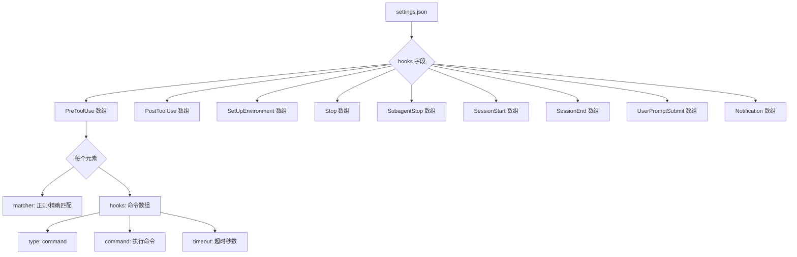
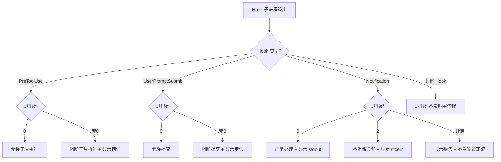

# PD-10.NN iflow-cli — 9 种 Hook 生命周期管道与 matcher 正则路由

> 文档编号：PD-10.NN
> 来源：iflow-cli `docs_en/examples/hooks.md`
> GitHub：https://github.com/iflow-ai/iflow-cli.git
> 问题域：PD-10 中间件管道 Middleware Pipeline
> 状态：可复用方案

---

## 第 1 章 问题与动机

### 1.1 核心问题

CLI 型 AI Agent 的生命周期中存在大量横切关注点：工具调用前需要安全校验、会话启动时需要注入环境上下文、用户输入需要内容过滤、通知需要路由到不同渠道。这些需求如果硬编码在主流程中，会导致核心逻辑与扩展逻辑耦合，难以维护和定制。

问题的本质是：**如何在不修改 Agent 核心代码的前提下，让用户通过声明式配置注入任意数量的横切逻辑？**

传统中间件管道（如 Express/Koa）面向 HTTP 请求-响应模型，而 AI Agent 的生命周期更复杂——涉及工具调用、子代理、会话压缩、通知等多种事件类型。需要一种更细粒度的事件驱动 Hook 系统。

### 1.2 iflow-cli 的解法概述

iflow-cli 实现了一套完整的 9 种 Hook 类型生命周期管道系统：

1. **9 种 Hook 类型覆盖完整生命周期** — PreToolUse/PostToolUse（工具拦截）、SetUpEnvironment（环境增强）、Stop/SubagentStop（进程终止）、SessionStart/SessionEnd（会话管理）、UserPromptSubmit（输入过滤）、Notification（通知处理），见 `docs_en/examples/hooks.md:23-273`
2. **matcher 正则路由** — 支持精确匹配、通配符、正则表达式、MCP 工具前缀匹配四种模式，自动检测正则特殊字符决定匹配策略，见 `docs_en/examples/hooks.md:409-428`
3. **分层配置合并** — 用户级 `~/.iflow/settings.json` + 项目级 `.iflow/settings.json` + 系统级三层配置，高层补充低层，见 `docs_en/examples/hooks.md:276-286`
4. **退出码语义映射** — 不同 Hook 类型对退出码有不同语义：PreToolUse 非零阻断执行、Notification 退出码 2 仅显示 stderr 不阻断、其他 Hook 退出码不影响主流程，见 `docs_en/examples/hooks.md:794-807`
5. **并行执行 + 超时保护** — 匹配的 Hook 命令并行执行，每个 Hook 可配置独立超时，超时不中断主流程，见 `docs_en/examples/hooks.md:756-813`

### 1.3 设计思想

| 设计原则 | 具体实现 | 理由 | 替代方案 |
|----------|----------|------|----------|
| 事件驱动而非管道串联 | 9 种独立 Hook 类型，每种绑定特定生命周期事件 | Agent 生命周期比 HTTP 复杂，不同事件需要不同的拦截语义（阻断 vs 旁路） | Express 式 next() 链式管道 |
| 声明式配置而非代码注册 | JSON settings.json 声明 Hook，无需编写注册代码 | 降低用户门槛，非开发者也能配置 Hook | 代码级 plugin.register() API |
| 外部进程隔离 | Hook 以 shell command 子进程执行，通过 stdin/env/exitcode 通信 | Hook 崩溃不影响主进程，支持任意语言编写 Hook | 进程内插件加载 |
| 退出码语义分层 | 不同 Hook 类型对退出码赋予不同含义 | PreToolUse 需要阻断能力，Notification 需要旁路能力，Stop 不需要控制流 | 统一退出码语义 |
| 环境变量传参 | 通过 IFLOW_TOOL_NAME 等环境变量传递上下文 | 跨语言兼容，bash/python/node 都能读取 | stdin JSON 传参（也支持） |

---

## 第 2 章 源码实现分析

### 2.1 架构概览

iflow-cli 的 Hook 系统是一个事件驱动的外部进程管道，核心架构如下：

```
┌─────────────────────────────────────────────────────────────────┐
│                    iFlow CLI 主进程                              │
│                                                                  │
│  ┌──────────┐   ┌──────────┐   ┌──────────┐   ┌──────────┐    │
│  │ Session  │──→│  Tool    │──→│  Model   │──→│ Notify   │    │
│  │ Start    │   │  Call    │   │ Response │   │          │    │
│  └────┬─────┘   └──┬───┬──┘   └──────────┘   └────┬─────┘    │
│       │            │   │                           │           │
│  ┌────▼─────┐  ┌──▼───┘  ┌──▼──┐            ┌────▼─────┐    │
│  │SetUp     │  │Pre   Post│     │            │Notifi-   │    │
│  │Environ-  │  │Tool  Tool│     │            │cation    │    │
│  │ment Hook │  │Use   Use │     │            │Hook      │    │
│  └────┬─────┘  │Hook  Hook│     │            └────┬─────┘    │
│       │        └──┬───┬──┘     │                  │           │
└───────┼───────────┼───┼────────┼──────────────────┼───────────┘
        │           │   │        │                   │
        ▼           ▼   ▼        ▼                   ▼
   ┌─────────────────────────────────────────────────────┐
   │              外部 Hook 子进程（并行执行）              │
   │                                                      │
   │  ┌──────────┐  ┌──────────┐  ┌──────────┐          │
   │  │ python3  │  │ bash     │  │ node     │          │
   │  │ script.py│  │ hook.sh  │  │ hook.js  │          │
   │  └──────────┘  └──────────┘  └──────────┘          │
   │                                                      │
   │  通信方式: env vars + stdin JSON + stdout + exitcode │
   └──────────────────────────────────────────────────────┘
```

9 种 Hook 类型按生命周期阶段分布：

```
Session Lifecycle:
  SessionStart ──→ SetUpEnvironment ──→ [用户交互循环] ──→ SessionEnd ──→ Stop

Tool Call Lifecycle (在用户交互循环内):
  UserPromptSubmit ──→ [LLM 推理] ──→ PreToolUse ──→ [工具执行] ──→ PostToolUse

SubAgent Lifecycle:
  [SubAgent 执行] ──→ SubagentStop

Notification (任意时刻):
  [事件触发] ──→ Notification
```

### 2.2 核心实现

#### 2.2.1 Hook 配置数据结构



对应配置结构 `docs_en/examples/hooks.md:290-393`：

```json
{
  "hooks": {
    "PreToolUse": [
      {
        "matcher": "Edit|MultiEdit|Write",
        "hooks": [
          {
            "type": "command",
            "command": "python3 file_protection.py",
            "timeout": 10
          }
        ]
      }
    ],
    "SetUpEnvironment": [
      {
        "hooks": [
          {
            "type": "command",
            "command": "python3 git_status.py",
            "timeout": 10
          }
        ]
      }
    ],
    "UserPromptSubmit": [
      {
        "matcher": ".*sensitive.*",
        "hooks": [
          {
            "type": "command",
            "command": "python3 content_filter.py",
            "timeout": 5
          }
        ]
      }
    ]
  }
}
```

#### 2.2.2 matcher 正则路由引擎

```mermaid
graph TD
    A[Hook 触发事件] --> B{检查 matcher 字段}
    B -->|无 matcher 或 *| C[匹配所有]
    B -->|有 matcher| D{包含正则特殊字符?}
    D -->|是: 含 |\\^$.*+?等| E[正则匹配模式]
    D -->|否| F[精确匹配模式]
    E --> G{regex.test 工具名}
    F --> H{toolName === matcher}
    G -->|匹配| I[执行 Hook 命令]
    G -->|不匹配| J[跳过]
    H -->|匹配| I
    H -->|不匹配| K{检查工具别名}
    K -->|别名匹配| I
    K -->|不匹配| J
    E -->|正则无效| F
```

matcher 支持的匹配模式 `docs_en/examples/hooks.md:413-419`：

```
| 匹配模式     | 语法示例                | 说明                    |
|-------------|------------------------|------------------------|
| 通配符匹配   | "*" 或 ""              | 匹配所有工具（默认行为）  |
| 精确匹配     | "Edit"                 | 仅匹配名为 Edit 的工具   |
| 正则表达式   | "Edit\\|MultiEdit"     | 匹配多个工具名           |
| 模式匹配     | ".*_file"              | 匹配以 _file 结尾的工具  |
| MCP 工具匹配 | "mcp__.*"              | 匹配所有 MCP 工具        |
| MCP 服务匹配 | "mcp__github__.*"      | 匹配特定 MCP 服务器的工具 |
```

关键规则：大小写敏感、自动识别正则特殊字符、无效正则回退到精确匹配、同时检查工具名和别名。

#### 2.2.3 退出码语义映射



对应实现 `docs_en/examples/hooks.md:794-807`：

```python
# 伪代码：退出码语义映射逻辑
def handle_hook_result(hook_type: str, exit_code: int, stdout: str, stderr: str):
    if hook_type == "PreToolUse":
        if exit_code != 0:
            block_tool_execution(stderr)  # 阻断工具
            return
    elif hook_type == "UserPromptSubmit":
        if exit_code != 0:
            block_prompt_submission(stderr)  # 阻断提交
            return
    elif hook_type == "Notification":
        if exit_code == 0:
            display_stdout(stdout)
        elif exit_code == 2:
            display_stderr_only(stderr)  # 特殊：不阻断通知
        else:
            display_warning(stderr)
    else:
        # Stop, SubagentStop, SessionStart, SessionEnd, SetUpEnvironment
        if exit_code != 0:
            log_warning(stderr)  # 仅记录，不影响主流程
    display_stdout(stdout)
```

### 2.3 实现细节

#### 环境变量传参体系

iflow-cli 通过环境变量向 Hook 子进程传递上下文，分为通用变量和 Hook 类型专用变量 `docs_en/examples/hooks.md:769-790`：

| 变量名 | 适用 Hook | 说明 |
|--------|----------|------|
| `IFLOW_SESSION_ID` | 所有 | 当前会话 ID |
| `IFLOW_TRANSCRIPT_PATH` | 所有 | 会话记录文件路径 |
| `IFLOW_CWD` | 所有 | 当前工作目录 |
| `IFLOW_HOOK_EVENT_NAME` | 所有 | 触发的 Hook 事件名 |
| `IFLOW_TOOL_NAME` | Pre/PostToolUse | 当前工具名 |
| `IFLOW_TOOL_ARGS` | Pre/PostToolUse | 工具参数 JSON |
| `IFLOW_TOOL_ALIASES` | Pre/PostToolUse | 工具别名数组 JSON |
| `IFLOW_SESSION_SOURCE` | SessionStart | 会话启动源（startup/resume/clear/compress） |
| `IFLOW_USER_PROMPT` | UserPromptSubmit | 用户原始 prompt |
| `IFLOW_NOTIFICATION_MESSAGE` | Notification | 通知消息内容 |

#### 分层配置合并策略

配置优先级从高到低 `docs_en/configuration/settings.md:12-19`：

1. 命令行参数（最高）
2. IFLOW_ 前缀环境变量
3. 系统级配置 `/etc/iflow-cli/settings.json`
4. 项目级配置 `.iflow/settings.json`
5. 用户级配置 `~/.iflow/settings.json`
6. 应用默认值（最低）

Hook 配置遵循"高层补充低层"的合并规则：项目级 Hook 配置补充（而非覆盖）用户级配置。


---

## 第 3 章 迁移指南

### 3.1 迁移清单

将 iflow-cli 的 Hook 管道系统迁移到自己的 CLI Agent 项目，分三个阶段：

**阶段 1：核心 Hook 引擎（1-2 天）**
- [ ] 定义 Hook 类型枚举（至少 PreToolUse/PostToolUse/SessionStart/SessionEnd）
- [ ] 实现 JSON 配置加载与校验
- [ ] 实现 matcher 正则路由引擎
- [ ] 实现子进程 spawn + 环境变量注入
- [ ] 实现退出码语义映射

**阶段 2：生命周期集成（1 天）**
- [ ] 在工具调用前后插入 PreToolUse/PostToolUse 触发点
- [ ] 在会话启动/结束时插入 SessionStart/SessionEnd 触发点
- [ ] 在用户输入处理前插入 UserPromptSubmit 触发点
- [ ] 实现并行执行 + 超时保护

**阶段 3：高级特性（可选）**
- [ ] 分层配置合并（用户级 + 项目级 + 系统级）
- [ ] Notification Hook 与通知渠道集成
- [ ] SubagentStop Hook 与子代理生命周期集成
- [ ] SetUpEnvironment Hook 与上下文注入集成

### 3.2 适配代码模板

以下是一个可直接运行的 Python 实现，覆盖 Hook 引擎核心逻辑：

```python
import json
import os
import re
import subprocess
import asyncio
from enum import Enum
from dataclasses import dataclass, field
from typing import Optional
from pathlib import Path


class HookType(Enum):
    PRE_TOOL_USE = "PreToolUse"
    POST_TOOL_USE = "PostToolUse"
    SETUP_ENVIRONMENT = "SetUpEnvironment"
    STOP = "Stop"
    SUBAGENT_STOP = "SubagentStop"
    SESSION_START = "SessionStart"
    SESSION_END = "SessionEnd"
    USER_PROMPT_SUBMIT = "UserPromptSubmit"
    NOTIFICATION = "Notification"


# Hook 类型是否支持 matcher
MATCHER_SUPPORTED = {
    HookType.PRE_TOOL_USE, HookType.POST_TOOL_USE,
    HookType.SESSION_START, HookType.USER_PROMPT_SUBMIT,
    HookType.NOTIFICATION,
}

# Hook 类型是否可阻断主流程
BLOCKABLE_HOOKS = {HookType.PRE_TOOL_USE, HookType.USER_PROMPT_SUBMIT}

# 正则特殊字符检测
REGEX_CHARS = set(r"|\\^$.*+?()[]{}") 


@dataclass
class HookCommand:
    type: str  # "command"
    command: str
    timeout: Optional[int] = None


@dataclass
class HookConfig:
    hooks: list[HookCommand] = field(default_factory=list)
    matcher: Optional[str] = None


@dataclass
class HookResult:
    exit_code: int
    stdout: str
    stderr: str
    timed_out: bool = False


def is_regex_pattern(pattern: str) -> bool:
    """检测 matcher 是否包含正则特殊字符"""
    return any(c in REGEX_CHARS for c in pattern)


def matches(pattern: Optional[str], target: str, aliases: list[str] = None) -> bool:
    """matcher 路由引擎：支持通配符/精确/正则三种模式"""
    if pattern is None or pattern == "" or pattern == "*":
        return True
    
    if is_regex_pattern(pattern):
        try:
            regex = re.compile(pattern)
            if regex.search(target):
                return True
            for alias in (aliases or []):
                if regex.search(alias):
                    return True
            return False
        except re.error:
            pass  # 无效正则回退到精确匹配
    
    # 精确匹配：检查工具名和别名
    if target == pattern:
        return True
    return pattern in (aliases or [])


async def execute_hook(cmd: HookCommand, env: dict) -> HookResult:
    """执行单个 Hook 命令（子进程隔离）"""
    full_env = {**os.environ, **env}
    try:
        proc = await asyncio.create_subprocess_shell(
            cmd.command,
            stdout=asyncio.subprocess.PIPE,
            stderr=asyncio.subprocess.PIPE,
            env=full_env,
        )
        stdout, stderr = await asyncio.wait_for(
            proc.communicate(),
            timeout=cmd.timeout,
        )
        return HookResult(
            exit_code=proc.returncode or 0,
            stdout=stdout.decode(),
            stderr=stderr.decode(),
        )
    except asyncio.TimeoutError:
        proc.kill()
        return HookResult(exit_code=-1, stdout="", stderr="Hook timed out", timed_out=True)
    except Exception as e:
        return HookResult(exit_code=-1, stdout="", stderr=str(e))


async def run_hooks(
    hook_type: HookType,
    configs: list[HookConfig],
    match_target: str = "",
    aliases: list[str] = None,
    extra_env: dict = None,
) -> list[HookResult]:
    """并行执行所有匹配的 Hook"""
    env = {
        "IFLOW_HOOK_EVENT_NAME": hook_type.value,
        **(extra_env or {}),
    }
    
    tasks = []
    for config in configs:
        if hook_type in MATCHER_SUPPORTED:
            if not matches(config.matcher, match_target, aliases):
                continue
        for cmd in config.hooks:
            tasks.append(execute_hook(cmd, env))
    
    if not tasks:
        return []
    return await asyncio.gather(*tasks)


def handle_results(hook_type: HookType, results: list[HookResult]) -> bool:
    """处理 Hook 结果，返回 True 表示允许继续，False 表示阻断"""
    for r in results:
        if r.stdout.strip():
            print(r.stdout.strip())
        
        if hook_type in BLOCKABLE_HOOKS and r.exit_code != 0:
            if r.stderr.strip():
                print(f"[BLOCKED] {r.stderr.strip()}")
            return False  # 阻断
        
        if hook_type == HookType.NOTIFICATION:
            if r.exit_code == 2:
                if r.stderr.strip():
                    print(r.stderr.strip())  # 仅显示 stderr，不阻断
            elif r.exit_code != 0:
                print(f"[WARNING] Hook warning: {r.stderr.strip()}")
        
        if r.timed_out:
            print(f"[WARNING] Hook timed out")
    
    return True  # 允许继续
```

### 3.3 适用场景

| 场景 | 适用度 | 说明 |
|------|--------|------|
| CLI 型 AI Agent（类 Claude Code/Cursor） | ⭐⭐⭐ | 完美匹配：9 种 Hook 覆盖 Agent 全生命周期 |
| IDE 插件型 Agent | ⭐⭐⭐ | 适用：工具拦截和环境增强是 IDE 插件的核心需求 |
| Web API 型 Agent | ⭐⭐ | 部分适用：可复用 matcher 路由和退出码语义，但子进程模型需改为进程内调用 |
| 批处理/无交互 Agent | ⭐ | 有限适用：UserPromptSubmit 和 Notification Hook 无意义 |
| 多租户 SaaS Agent | ⭐⭐ | 需扩展：配置层级需增加租户级，安全隔离需加强 |

---

## 第 4 章 测试用例

```python
import pytest
import asyncio
from unittest.mock import AsyncMock, patch


class TestMatcherEngine:
    """测试 matcher 正则路由引擎"""
    
    def test_wildcard_matches_all(self):
        assert matches(None, "Edit") is True
        assert matches("", "Edit") is True
        assert matches("*", "Edit") is True
    
    def test_exact_match(self):
        assert matches("Edit", "Edit") is True
        assert matches("Edit", "Write") is False
    
    def test_regex_match_pipe(self):
        assert matches("Edit|MultiEdit|Write", "Edit") is True
        assert matches("Edit|MultiEdit|Write", "Read") is False
    
    def test_regex_match_pattern(self):
        assert matches(".*_file", "write_file") is True
        assert matches(".*_file", "Edit") is False
    
    def test_mcp_prefix_match(self):
        assert matches("mcp__.*", "mcp__github__create_pr") is True
        assert matches("mcp__github__.*", "mcp__github__create_pr") is True
        assert matches("mcp__github__.*", "mcp__slack__send") is False
    
    def test_alias_match(self):
        assert matches("Edit", "replace", aliases=["Edit", "edit"]) is True
        assert matches("bash", "run_shell_command", aliases=["shell", "bash"]) is True
    
    def test_invalid_regex_fallback(self):
        # 无效正则回退到精确匹配
        assert matches("[invalid", "[invalid") is True
        assert matches("[invalid", "other") is False
    
    def test_case_sensitive(self):
        assert matches("Edit", "edit") is False
        assert matches("edit", "Edit") is False


class TestExitCodeSemantics:
    """测试退出码语义映射"""
    
    def test_pre_tool_use_blocks_on_nonzero(self):
        results = [HookResult(exit_code=2, stdout="", stderr="Blocked")]
        assert handle_results(HookType.PRE_TOOL_USE, results) is False
    
    def test_pre_tool_use_allows_on_zero(self):
        results = [HookResult(exit_code=0, stdout="OK", stderr="")]
        assert handle_results(HookType.PRE_TOOL_USE, results) is True
    
    def test_notification_code2_no_block(self):
        results = [HookResult(exit_code=2, stdout="", stderr="Info")]
        assert handle_results(HookType.NOTIFICATION, results) is True
    
    def test_stop_hook_never_blocks(self):
        results = [HookResult(exit_code=1, stdout="", stderr="Error")]
        assert handle_results(HookType.STOP, results) is True
    
    def test_user_prompt_blocks_on_nonzero(self):
        results = [HookResult(exit_code=1, stdout="", stderr="Sensitive content")]
        assert handle_results(HookType.USER_PROMPT_SUBMIT, results) is False


class TestHookExecution:
    """测试 Hook 并行执行"""
    
    @pytest.mark.asyncio
    async def test_parallel_execution(self):
        configs = [
            HookConfig(hooks=[HookCommand(type="command", command="echo hook1")]),
            HookConfig(hooks=[HookCommand(type="command", command="echo hook2")]),
        ]
        results = await run_hooks(HookType.STOP, configs)
        assert len(results) == 2
        assert all(r.exit_code == 0 for r in results)
    
    @pytest.mark.asyncio
    async def test_timeout_protection(self):
        configs = [
            HookConfig(hooks=[HookCommand(type="command", command="sleep 10", timeout=1)]),
        ]
        results = await run_hooks(HookType.STOP, configs)
        assert len(results) == 1
        assert results[0].timed_out is True
    
    @pytest.mark.asyncio
    async def test_matcher_filtering(self):
        configs = [
            HookConfig(matcher="Edit", hooks=[HookCommand(type="command", command="echo matched")]),
            HookConfig(matcher="Write", hooks=[HookCommand(type="command", command="echo skipped")]),
        ]
        results = await run_hooks(
            HookType.PRE_TOOL_USE, configs,
            match_target="Edit",
        )
        assert len(results) == 1  # 只有 Edit matcher 匹配
```


---

## 第 5 章 跨域关联

| 关联域 | 关系类型 | 说明 |
|--------|----------|------|
| PD-04 工具系统 | 强依赖 | PreToolUse/PostToolUse Hook 直接拦截工具调用，matcher 路由依赖工具名和别名体系。工具注册表提供 `IFLOW_TOOL_NAME`/`IFLOW_TOOL_ALIASES` 等元数据 |
| PD-01 上下文管理 | 协同 | SetUpEnvironment Hook 在会话启动时注入额外上下文（如 Git 状态），增强 LLM 的项目感知能力。SessionStart 的 `compress` matcher 可在上下文压缩时触发特定逻辑 |
| PD-02 多 Agent 编排 | 协同 | SubagentStop Hook 在子代理结束时触发，可用于收集子代理执行结果、清理资源。iflow-cli 的 Sub Agent 系统通过 Task 工具调用子代理，Hook 提供生命周期回调 |
| PD-09 Human-in-the-Loop | 协同 | UserPromptSubmit Hook 在用户输入到达 LLM 之前拦截，可实现内容过滤、敏感信息检测。退出码非零阻断提交，实现人机交互的安全门控 |
| PD-11 可观测性 | 协同 | Hook 系统本身是可观测性的扩展点：PostToolUse 可记录工具执行统计，SessionEnd 可生成会话摘要报告，Notification Hook 可将事件路由到外部监控系统 |
| PD-03 容错与重试 | 互补 | Hook 子进程的超时保护和错误隔离是容错设计的一部分。Hook 崩溃不影响主流程，超时自动终止，体现了"Hook 失败不应成为 Agent 失败"的原则 |
| PD-05 沙箱隔离 | 互补 | iflow-cli 支持 Docker 沙箱模式（`"sandbox": "docker"`），Hook 在沙箱内执行时受到额外的文件系统和网络隔离 |

---

## 第 6 章 来源文件索引

| 文件 | 行范围 | 关键实现 |
|------|--------|----------|
| `docs_en/examples/hooks.md` | L1-L1015 | Hook 系统完整文档：9 种 Hook 类型定义、配置格式、执行机制、安全考虑 |
| `docs_en/examples/hooks.md` | L23-L273 | 9 种 Hook 类型详细定义与配置示例 |
| `docs_en/examples/hooks.md` | L276-L393 | 分层配置体系与完整配置格式 |
| `docs_en/examples/hooks.md` | L396-L460 | Hook 配置字段说明、matcher 匹配模式表、Hook 类型与 matcher 支持矩阵 |
| `docs_en/examples/hooks.md` | L462-L705 | 6 个复杂配置示例（文件保护、代码格式化、会话管理、内容过滤、通知处理、Git 环境增强） |
| `docs_en/examples/hooks.md` | L756-L813 | 执行机制：并行执行流程、环境变量、退出码语义、超时处理 |
| `docs_en/examples/hooks.md` | L815-L966 | 高级特性：条件执行、参数传递、输出处理、配置校验、调试技巧 |
| `docs_en/examples/hooks.md` | L968-L1015 | 安全考虑与最佳实践 |
| `docs_en/configuration/settings.md` | L1-L644 | 分层配置系统：优先级体系、环境变量命名规范、settings.json 完整字段说明 |
| `docs_en/examples/subagent.md` | L1-L416 | Sub Agent 系统：SubagentStop Hook 的触发上下文 |
| `docs_cn/examples/hooks.md` | L1-L100+ | 中文版 Hook 文档（与英文版内容一致） |
| `IFLOW.md` | L1-L91 | 项目概览：Node.js 架构、MCP 集成、Slash 命令体系 |

---

## 第 7 章 横向对比维度

> **重要：** 本章用于自动填充 Butcher Wiki 的横向对比表。

```json comparison_data
{
  "project": "iflow-cli",
  "dimensions": {
    "中间件基类": "无基类，纯 JSON 声明式配置 + 外部 shell command 子进程",
    "钩子点": "9 种：PreToolUse/PostToolUse/SetUpEnvironment/Stop/SubagentStop/SessionStart/SessionEnd/UserPromptSubmit/Notification",
    "中间件数量": "无上限，每种 Hook 类型支持数组配置多个 Hook",
    "条件激活": "matcher 正则路由：通配符/精确/正则/MCP前缀四种模式，自动检测正则字符",
    "状态管理": "无状态：Hook 间通过环境变量和 stdin JSON 传递上下文，无共享内存",
    "执行模型": "并行执行：同一事件的多个匹配 Hook 并行 spawn 子进程",
    "同步热路径": "PreToolUse/UserPromptSubmit 同步阻断：等待退出码决定是否继续",
    "错误隔离": "进程级隔离：Hook 以独立子进程执行，崩溃/超时不影响主进程",
    "数据传递": "双通道：环境变量（IFLOW_TOOL_NAME 等 10+ 变量）+ stdin JSON",
    "超时保护": "每个 Hook 独立 timeout 配置（秒级），超时自动终止不中断主流程",
    "通知路由": "Notification Hook + matcher 正则匹配通知内容，退出码 2 旁路显示",
    "外部管理器集成": "无外部 Hook 管理器冲突检测，纯 iflow 自有配置",
    "版本同步": "无版本检测机制，Hook 配置随 settings.json 版本控制",
    "可观测性": "IFLOW_DEBUG=1 启用详细日志，PostToolUse 可记录执行统计"
  }
}
```

### 域元数据补充

```json domain_metadata
{
  "solution_summary": "iflow-cli 用 9 种 Hook 类型覆盖 Agent 完整生命周期，通过 matcher 正则路由 + 外部子进程隔离 + 退出码语义分层实现声明式中间件管道",
  "description": "CLI Agent 的事件驱动 Hook 系统如何通过退出码语义分层实现阻断与旁路的精确控制",
  "sub_problems": [
    "matcher 自动正则检测：如何根据字符串内容自动判断使用精确匹配还是正则匹配",
    "Hook 类型与 matcher 支持矩阵：哪些 Hook 类型支持 matcher 过滤，哪些始终执行",
    "工具别名穿透匹配：matcher 需同时检查工具原名和所有别名的匹配策略",
    "Notification 退出码 2 旁路语义：不阻断通知显示但展示 stderr 的特殊处理",
    "会话启动源匹配：SessionStart Hook 按 startup/resume/clear/compress 四种源过滤"
  ],
  "best_practices": [
    "退出码语义按 Hook 类型分层：阻断型 Hook（PreToolUse/UserPromptSubmit）非零阻断，旁路型 Hook（Notification）退出码 2 仅显示 stderr，其他 Hook 退出码不影响主流程",
    "matcher 无效正则自动降级：正则编译失败时回退到精确匹配，避免配置错误导致 Hook 完全失效",
    "环境变量 + stdin 双通道传参：简单元数据用环境变量（跨语言兼容），复杂结构化数据用 stdin JSON"
  ]
}
```

