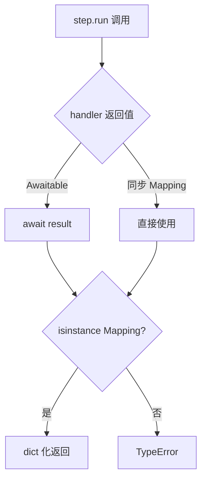
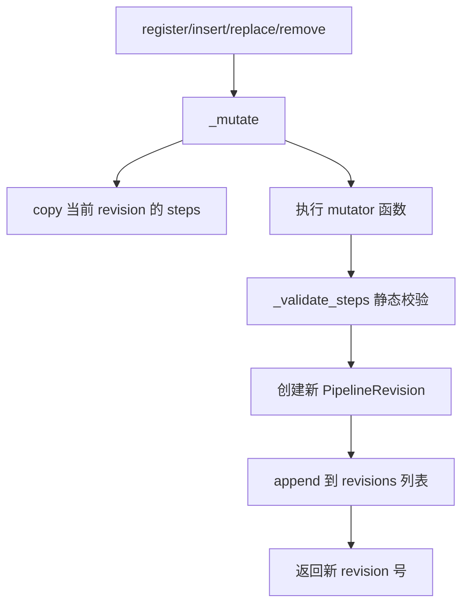
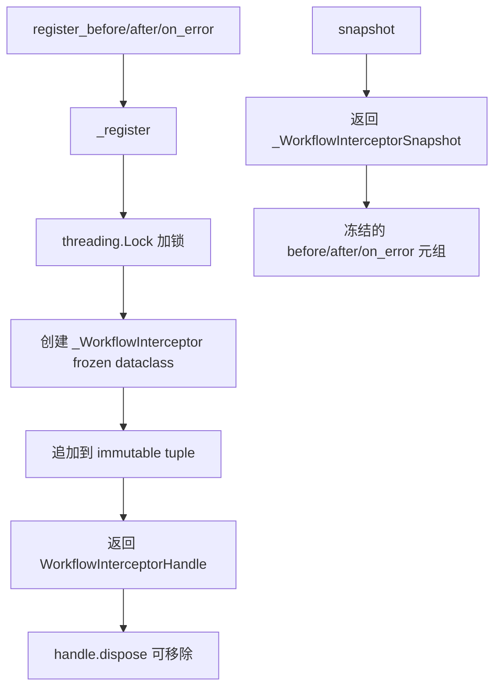

# PD-10.06 memU — WorkflowStep 拦截器管道与版本化 PipelineManager

> 文档编号：PD-10.06
> 来源：memU `src/memu/workflow/`
> GitHub：https://github.com/NevaMind-AI/memU.git
> 问题域：PD-10 中间件管道 Middleware Pipeline
> 状态：可复用方案

---

## 第 1 章 问题与动机（≥ 30 行）

### 1.1 核心问题

记忆系统（Memory Service）的核心操作——memorize、retrieve、CRUD——都是多步骤流程：先预处理资源，再提取记忆条目，再去重合并，再持久化索引，最后构建响应。这些步骤之间有严格的数据依赖（前一步的输出是后一步的输入），同时又需要横切关注点（日志、指标、错误处理）能统一注入到每个步骤的执行前后。

传统做法是把所有逻辑写在一个大函数里，或者用硬编码的 if-else 分支。这导致：
- 无法在运行时动态插入/替换/删除步骤（比如 A/B 测试不同的提取策略）
- 横切关注点散落在每个步骤内部，无法统一管理
- 步骤间的数据依赖隐式存在，难以在注册时静态校验
- 管道变更没有版本追踪，无法回溯或审计

### 1.2 memU 的解法概述

memU 设计了一套三层管道架构来解决上述问题：

1. **WorkflowStep 数据类**（`src/memu/workflow/step.py:17-48`）：每个步骤声明 `requires`/`produces` 状态键集合，运行时自动校验数据依赖，支持同步/异步 handler 透明调用
2. **PipelineManager 版本化注册中心**（`src/memu/workflow/pipeline.py:21-170`）：管道注册后每次变更（insert/replace/remove）自动创建新 revision，支持 `revision_token()` 全局版本指纹
3. **WorkflowInterceptorRegistry 拦截器注册表**（`src/memu/workflow/interceptor.py:56-166`）：before/after/on_error 三钩子点，线程安全注册，snapshot 快照隔离执行期间的注册变更
4. **WorkflowRunner 可插拔执行后端**（`src/memu/workflow/runner.py:13-81`）：Protocol 接口 + 工厂注册，默认 local 执行，预留 Temporal/Burr 等外部编排引擎扩展点
5. **双层拦截器体系**：Workflow 级拦截器（步骤粒度）+ LLM 级拦截器（API 调用粒度），两层独立注册、独立快照

### 1.3 设计思想

| 设计原则 | 具体实现 | 理由 | 替代方案 |
|----------|----------|------|----------|
| 声明式数据依赖 | `requires`/`produces` 集合 + 注册时静态校验 | 在管道注册阶段就能发现缺失依赖，而非运行时才报错 | 隐式约定（文档说明） |
| 不可变修订历史 | 每次 `_mutate` 创建新 `PipelineRevision`，旧版本保留 | 支持审计、回滚、版本指纹比对 | 原地修改（丢失历史） |
| 快照隔离 | `snapshot()` 返回当前拦截器元组的冻结副本 | 执行期间新注册的拦截器不影响正在运行的管道 | 直接引用（竞态风险） |
| 宽松默认 + 严格可选 | `strict=False` 时拦截器异常仅 log，`strict=True` 时传播 | 生产环境拦截器不应阻断主流程，测试时需要严格模式 | 全局统一策略 |
| 可插拔执行后端 | `WorkflowRunner` Protocol + `register_workflow_runner` 工厂 | 同一管道定义可在 local/Temporal/Burr 等不同后端执行 | 硬编码执行方式 |

---

## 第 2 章 源码实现分析（≥ 60 行，核心章节）

### 2.1 架构概览

```
┌─────────────────────────────────────────────────────────────────┐
│                      MemoryService                              │
│  ┌──────────────┐  ┌──────────────┐  ┌──────────────────────┐  │
│  │ PipelineManager│  │WorkflowRunner│  │InterceptorRegistry  │  │
│  │  (9 pipelines) │  │  (pluggable) │  │ (before/after/err)  │  │
│  └──────┬───────┘  └──────┬───────┘  └──────────┬───────────┘  │
│         │                  │                      │              │
│         │  build(name)     │  run(steps, state)   │  snapshot()  │
│         ▼                  ▼                      ▼              │
│  ┌─────────────────────────────────────────────────────────┐    │
│  │                    run_steps()                           │    │
│  │  for step in steps:                                     │    │
│  │    ① check requires ⊆ state.keys()                     │    │
│  │    ② run_before_interceptors(snapshot.before)           │    │
│  │    ③ step.run(state, context)  ← sync/async 透明       │    │
│  │    ④ run_after_interceptors(snapshot.after)             │    │
│  │    on error: run_on_error_interceptors + re-raise       │    │
│  └─────────────────────────────────────────────────────────┘    │
└─────────────────────────────────────────────────────────────────┘
```

memU 注册了 9 条命名管道：memorize、retrieve_rag、retrieve_llm、patch_create、patch_update、patch_delete、crud_list_memory_items、crud_list_memory_categories、crud_clear_memory。每条管道由 2-7 个 WorkflowStep 组成。

### 2.2 核心实现

#### 2.2.1 WorkflowStep：声明式步骤 + 同步/异步透明执行



对应源码 `src/memu/workflow/step.py:17-47`：
```python
@dataclass
class WorkflowStep:
    step_id: str
    role: str
    handler: WorkflowHandler
    description: str = ""
    requires: set[str] = field(default_factory=set)
    produces: set[str] = field(default_factory=set)
    capabilities: set[str] = field(default_factory=set)
    config: dict[str, Any] = field(default_factory=dict)

    async def run(self, state: WorkflowState, context: WorkflowContext) -> WorkflowState:
        result = self.handler(state, context)
        if inspect.isawaitable(result):
            result = await result
        if not isinstance(result, Mapping):
            msg = f"Workflow step '{self.step_id}' must return a mapping, got {type(result).__name__}"
            raise TypeError(msg)
        return dict(result)
```

关键设计：`requires`/`produces` 不仅是文档，还在 `PipelineManager._validate_steps()` 中做静态依赖链校验（`src/memu/workflow/pipeline.py:131-164`）。`capabilities` 声明步骤需要的能力（llm/vector/db/io/vision），在注册时校验是否可用。

#### 2.2.2 PipelineManager：版本化管道注册与变更



对应源码 `src/memu/workflow/pipeline.py:108-122`：
```python
def _mutate(self, name: str, mutator: Any) -> int:
    revision = self._current_revision(name)
    steps = [step.copy() for step in revision.steps]
    metadata = copy.deepcopy(revision.metadata)
    mutator(steps)
    self._validate_steps(steps, initial_state_keys=metadata.get("initial_state_keys"))
    new_revision = PipelineRevision(
        name=name,
        revision=revision.revision + 1,
        steps=steps,
        created_at=time.time(),
        metadata=metadata,
    )
    self._pipelines[name].append(new_revision)
    return new_revision.revision
```

每次变更都是 copy-on-write：先复制步骤列表，执行变更，校验通过后追加新 revision。`revision_token()` 方法（`pipeline.py:166-170`）生成全局版本指纹如 `memorize:v3|retrieve_rag:v1|...`，可用于缓存失效判断。


#### 2.2.3 WorkflowInterceptorRegistry：线程安全 + 快照隔离



对应源码 `src/memu/workflow/interceptor.py:56-166`：
```python
class WorkflowInterceptorRegistry:
    def __init__(self, *, strict: bool = False) -> None:
        self._before: tuple[_WorkflowInterceptor, ...] = ()
        self._after: tuple[_WorkflowInterceptor, ...] = ()
        self._on_error: tuple[_WorkflowInterceptor, ...] = ()
        self._lock = threading.Lock()
        self._seq = 0
        self._strict = strict

    def _register(self, kind: str, fn: Callable[..., Any], *, name: str | None) -> WorkflowInterceptorHandle:
        if not callable(fn):
            raise TypeError("Interceptor must be callable")
        with self._lock:
            self._seq += 1
            interceptor = _WorkflowInterceptor(interceptor_id=self._seq, fn=fn, name=name)
            if kind == "before":
                self._before = (*self._before, interceptor)
            elif kind == "after":
                self._after = (*self._after, interceptor)
            elif kind == "on_error":
                self._on_error = (*self._on_error, interceptor)
        return WorkflowInterceptorHandle(self, interceptor.interceptor_id)

    def snapshot(self) -> _WorkflowInterceptorSnapshot:
        return _WorkflowInterceptorSnapshot(self._before, self._after, self._on_error)
```

关键细节：
- 使用 **immutable tuple** 而非 list 存储拦截器，每次注册创建新 tuple（`(*self._before, interceptor)`），天然线程安全读取
- `snapshot()` 直接返回当前 tuple 引用，零拷贝开销
- `WorkflowInterceptorHandle.dispose()` 支持一次性移除，防止重复 dispose
- after 和 on_error 拦截器以 **逆序** 执行（`reversed(interceptors)`，`interceptor.py:188,201`），形成洋葱模型

#### 2.2.4 双层拦截器体系

memU 实现了两个独立的拦截器层：

| 层级 | 类 | 粒度 | 特性 |
|------|-----|------|------|
| Workflow 层 | `WorkflowInterceptorRegistry` | 每个 WorkflowStep 执行前后 | 无过滤、无优先级、注册序执行 |
| LLM 层 | `LLMInterceptorRegistry` | 每次 LLM API 调用前后 | 支持 priority 排序、`where` 过滤器（按 operation/step_id/provider/model 过滤） |

LLM 层拦截器（`src/memu/llm/wrapper.py:128-203`）比 Workflow 层更精细：支持 `priority` 排序（数值小优先）、`LLMCallFilter` 条件过滤、`LLMCallContext` 丰富上下文（profile/request_id/trace_id/operation/step_id/provider/model/tags）。

### 2.3 实现细节

#### 管道注册全景（9 条管道）

`MemoryService._register_pipelines()`（`src/memu/app/service.py:315-348`）注册了 9 条管道：

| 管道名 | 步骤数 | 关键步骤 |
|--------|--------|----------|
| memorize | 7 | ingest → preprocess → extract → dedupe → categorize → persist → response |
| retrieve_rag | 7 | route_intention → route_category → sufficiency → recall_items → sufficiency → recall_resources → build_context |
| retrieve_llm | 7 | 同上但用 LLM 排序替代向量检索 |
| patch_create | 3 | create_item → persist_index → response |
| patch_update | 3 | update_item → persist_index → response |
| patch_delete | 3 | delete_item → persist_index → response |
| crud_list_memory_items | 2 | list → response |
| crud_list_memory_categories | 2 | list → response |
| crud_clear_memory | 4 | clear_categories → clear_items → clear_resources → response |

#### 步骤级 LLM Profile 路由

每个步骤可通过 `config` 字段指定不同的 LLM profile（`src/memu/app/memorize.py:114`）：
```python
WorkflowStep(
    step_id="preprocess_multimodal",
    config={"chat_llm_profile": self.memorize_config.preprocess_llm_profile},
)
```

`MemoryService._llm_profile_from_context()`（`service.py:202-218`）从 step_context 中提取 profile 名，支持 `chat_llm_profile` 和 `embed_llm_profile` 两种独立配置，实现同一管道内不同步骤使用不同模型。

#### WorkflowRunner 可插拔后端

```python
# src/memu/workflow/runner.py:12-25
@runtime_checkable
class WorkflowRunner(Protocol):
    name: str
    async def run(self, workflow_name, steps, initial_state, context, interceptor_registry) -> WorkflowState: ...

# 工厂注册
_RUNNER_FACTORIES: dict[str, RunnerFactory] = {"local": LocalWorkflowRunner, "sync": LocalWorkflowRunner}

def register_workflow_runner(name: str, factory: RunnerFactory) -> None:
    _RUNNER_FACTORIES[key] = factory
```

`resolve_workflow_runner()`（`runner.py:61-81`）支持传入实例、名称字符串或 None（默认 local），外部编排引擎（Temporal、Burr）只需注册工厂即可接入。

---

## 第 3 章 迁移指南（≥ 40 行）

### 3.1 迁移清单

**阶段 1：核心管道框架（1-2 天）**
- [ ] 复制 `workflow/step.py`、`workflow/pipeline.py`、`workflow/interceptor.py`、`workflow/runner.py`
- [ ] 调整 `WorkflowState` 类型别名（memU 用 `dict[str, Any]`，可改为 TypedDict）
- [ ] 实现 `LocalWorkflowRunner`（直接调用 `run_steps`）

**阶段 2：管道定义（2-3 天）**
- [ ] 为业务操作定义 WorkflowStep 列表，声明 requires/produces
- [ ] 用 PipelineManager 注册管道，指定 initial_state_keys
- [ ] 实现 `_run_workflow` 入口方法

**阶段 3：拦截器集成（1 天）**
- [ ] 注册 before 拦截器（日志、指标）
- [ ] 注册 on_error 拦截器（错误上报）
- [ ] 决定 strict 模式策略

**阶段 4：高级特性（可选）**
- [ ] 实现 LLM 层拦截器（如需 API 调用级可观测性）
- [ ] 注册外部 WorkflowRunner（Temporal/Burr）
- [ ] 利用 revision_token 做缓存失效

### 3.2 适配代码模板

```python
"""可直接复用的管道框架模板"""
from __future__ import annotations
import inspect
import threading
import time
import copy
from collections.abc import Callable, Mapping
from dataclasses import dataclass, field
from typing import Any

WorkflowState = dict[str, Any]
WorkflowContext = Mapping[str, Any] | None
WorkflowHandler = Callable[[WorkflowState, WorkflowContext], Any]


@dataclass
class WorkflowStep:
    step_id: str
    role: str
    handler: WorkflowHandler
    requires: set[str] = field(default_factory=set)
    produces: set[str] = field(default_factory=set)
    config: dict[str, Any] = field(default_factory=dict)

    def copy(self) -> WorkflowStep:
        return WorkflowStep(
            step_id=self.step_id, role=self.role, handler=self.handler,
            requires=set(self.requires), produces=set(self.produces),
            config=dict(self.config),
        )

    async def run(self, state: WorkflowState, context: WorkflowContext) -> WorkflowState:
        result = self.handler(state, context)
        if inspect.isawaitable(result):
            result = await result
        return dict(result)


@dataclass(frozen=True)
class _Interceptor:
    id: int
    fn: Callable[..., Any]
    name: str | None


class InterceptorRegistry:
    def __init__(self, *, strict: bool = False) -> None:
        self._before: tuple[_Interceptor, ...] = ()
        self._after: tuple[_Interceptor, ...] = ()
        self._on_error: tuple[_Interceptor, ...] = ()
        self._lock = threading.Lock()
        self._seq = 0
        self.strict = strict

    def register_before(self, fn: Callable, *, name: str | None = None) -> int:
        return self._register("before", fn, name)

    def register_after(self, fn: Callable, *, name: str | None = None) -> int:
        return self._register("after", fn, name)

    def register_on_error(self, fn: Callable, *, name: str | None = None) -> int:
        return self._register("on_error", fn, name)

    def _register(self, kind: str, fn: Callable, name: str | None) -> int:
        with self._lock:
            self._seq += 1
            interceptor = _Interceptor(id=self._seq, fn=fn, name=name)
            attr = f"_{kind}"
            setattr(self, attr, (*getattr(self, attr), interceptor))
        return self._seq

    def snapshot(self) -> tuple:
        return self._before, self._after, self._on_error


@dataclass
class PipelineRevision:
    name: str
    revision: int
    steps: list[WorkflowStep]
    created_at: float


class PipelineManager:
    def __init__(self) -> None:
        self._pipelines: dict[str, list[PipelineRevision]] = {}

    def register(self, name: str, steps: list[WorkflowStep], *, initial_keys: set[str] | None = None) -> None:
        self._validate(steps, initial_keys or set())
        self._pipelines[name] = [PipelineRevision(name, 1, steps, time.time())]

    def build(self, name: str) -> list[WorkflowStep]:
        return [s.copy() for s in self._pipelines[name][-1].steps]

    def insert_after(self, name: str, target: str, step: WorkflowStep) -> int:
        return self._mutate(name, lambda steps: steps.insert(
            next(i for i, s in enumerate(steps) if s.step_id == target) + 1, step))

    def _mutate(self, name: str, mutator: Callable) -> int:
        rev = self._pipelines[name][-1]
        steps = [s.copy() for s in rev.steps]
        mutator(steps)
        new_rev = PipelineRevision(name, rev.revision + 1, steps, time.time())
        self._pipelines[name].append(new_rev)
        return new_rev.revision

    def _validate(self, steps: list[WorkflowStep], available: set[str]) -> None:
        for step in steps:
            missing = step.requires - available
            if missing:
                raise ValueError(f"Step '{step.step_id}' missing: {missing}")
            available.update(step.produces)
```

### 3.3 适用场景

| 场景 | 适用度 | 说明 |
|------|--------|------|
| 多步骤 LLM 处理管道 | ⭐⭐⭐ | 核心场景：ingest → extract → persist 等有序流程 |
| 需要运行时动态调整管道 | ⭐⭐⭐ | insert/replace/remove + 版本追踪 |
| 需要横切关注点注入 | ⭐⭐⭐ | before/after/on_error 拦截器 |
| 需要审计管道变更历史 | ⭐⭐ | PipelineRevision 保留完整历史 |
| 需要外部编排引擎 | ⭐⭐ | WorkflowRunner Protocol 预留扩展 |
| 高并发实时流处理 | ⭐ | 当前为串行执行，无并行步骤支持 |


---

## 第 4 章 测试用例（≥ 20 行）

```python
import pytest
from memu.workflow.step import WorkflowStep, run_steps
from memu.workflow.pipeline import PipelineManager
from memu.workflow.interceptor import WorkflowInterceptorRegistry


class TestWorkflowStep:
    @pytest.mark.asyncio
    async def test_sync_handler_transparent(self):
        """同步 handler 被 run() 透明处理"""
        def handler(state, ctx):
            return {"result": state["input"] * 2}

        step = WorkflowStep(step_id="double", role="compute", handler=handler,
                            requires={"input"}, produces={"result"})
        result = await step.run({"input": 5}, None)
        assert result == {"result": 10}

    @pytest.mark.asyncio
    async def test_async_handler_transparent(self):
        """异步 handler 被 run() 透明处理"""
        async def handler(state, ctx):
            return {"result": state["input"] + 1}

        step = WorkflowStep(step_id="inc", role="compute", handler=handler,
                            requires={"input"}, produces={"result"})
        result = await step.run({"input": 5}, None)
        assert result == {"result": 6}

    @pytest.mark.asyncio
    async def test_non_mapping_raises_type_error(self):
        """handler 返回非 Mapping 时抛 TypeError"""
        def handler(state, ctx):
            return "not a mapping"

        step = WorkflowStep(step_id="bad", role="compute", handler=handler)
        with pytest.raises(TypeError, match="must return a mapping"):
            await step.run({}, None)


class TestRunSteps:
    @pytest.mark.asyncio
    async def test_missing_requires_raises_key_error(self):
        """缺少 requires 键时抛 KeyError"""
        step = WorkflowStep(step_id="s1", role="r", handler=lambda s, c: s,
                            requires={"missing_key"})
        with pytest.raises(KeyError, match="missing required keys"):
            await run_steps("test", [step], {})

    @pytest.mark.asyncio
    async def test_interceptors_called_in_order(self):
        """before 正序、after 逆序执行"""
        log = []
        registry = WorkflowInterceptorRegistry(strict=True)
        registry.register_before(lambda ctx, state: log.append(f"before-{ctx.step_id}"))
        registry.register_after(lambda ctx, state: log.append(f"after-{ctx.step_id}"))

        steps = [
            WorkflowStep(step_id="a", role="r", handler=lambda s, c: s, produces={"x"}),
            WorkflowStep(step_id="b", role="r", handler=lambda s, c: s, requires={"x"}),
        ]
        await run_steps("test", steps, {"x": 1}, interceptor_registry=registry)
        assert log == ["before-a", "after-a", "before-b", "after-b"]

    @pytest.mark.asyncio
    async def test_on_error_called_on_exception(self):
        """步骤异常时 on_error 拦截器被调用"""
        errors = []
        registry = WorkflowInterceptorRegistry(strict=True)
        registry.register_on_error(lambda ctx, state, err: errors.append(str(err)))

        def failing_handler(state, ctx):
            raise ValueError("boom")

        steps = [WorkflowStep(step_id="fail", role="r", handler=failing_handler)]
        with pytest.raises(ValueError, match="boom"):
            await run_steps("test", steps, {}, interceptor_registry=registry)
        assert errors == ["boom"]


class TestPipelineManager:
    def test_register_and_build(self):
        """注册管道后 build 返回步骤副本"""
        pm = PipelineManager()
        steps = [WorkflowStep(step_id="s1", role="r", handler=lambda s, c: s, produces={"x"})]
        pm.register("test", steps, initial_state_keys=set())
        built = pm.build("test")
        assert len(built) == 1
        assert built[0].step_id == "s1"
        assert built[0] is not steps[0]  # 是副本

    def test_insert_after_creates_new_revision(self):
        """insert_after 创建新 revision"""
        pm = PipelineManager()
        pm.register("test", [
            WorkflowStep(step_id="a", role="r", handler=lambda s, c: s, produces={"x"}),
        ], initial_state_keys=set())
        rev = pm.insert_after("test", "a",
            WorkflowStep(step_id="b", role="r", handler=lambda s, c: s, requires={"x"}))
        assert rev == 2
        assert len(pm.build("test")) == 2

    def test_validate_rejects_missing_dependency(self):
        """注册时校验 requires 依赖链"""
        pm = PipelineManager()
        with pytest.raises(ValueError, match="missing state keys"):
            pm.register("test", [
                WorkflowStep(step_id="s1", role="r", handler=lambda s, c: s,
                             requires={"nonexistent"}),
            ], initial_state_keys=set())

    def test_revision_token(self):
        """revision_token 反映全局版本"""
        pm = PipelineManager()
        pm.register("a", [WorkflowStep(step_id="s", role="r", handler=lambda s, c: s)])
        pm.register("b", [WorkflowStep(step_id="s", role="r", handler=lambda s, c: s)])
        assert pm.revision_token() == "a:v1|b:v1"


class TestInterceptorRegistry:
    def test_dispose_removes_interceptor(self):
        """dispose 后拦截器从 snapshot 中消失"""
        registry = WorkflowInterceptorRegistry()
        handle = registry.register_before(lambda ctx, state: None)
        assert len(registry.snapshot().before) == 1
        handle.dispose()
        assert len(registry.snapshot().before) == 0

    def test_double_dispose_returns_false(self):
        """重复 dispose 返回 False"""
        registry = WorkflowInterceptorRegistry()
        handle = registry.register_before(lambda ctx, state: None)
        assert handle.dispose() is True
        assert handle.dispose() is False

    def test_strict_mode_propagates_exception(self):
        """strict 模式下拦截器异常传播"""
        registry = WorkflowInterceptorRegistry(strict=True)
        registry.register_before(lambda ctx, state: (_ for _ in ()).throw(RuntimeError("fail")))
        # strict=True 时异常会传播到 run_steps
```

---

## 第 5 章 跨域关联

| 关联域 | 关系类型 | 说明 |
|--------|----------|------|
| PD-01 上下文管理 | 协同 | memorize 管道的 preprocess_multimodal 步骤处理多模态资源预处理，与上下文窗口管理相关 |
| PD-04 工具系统 | 协同 | WorkflowStep 的 `capabilities` 声明（llm/vector/db/io/vision）类似工具能力注册 |
| PD-06 记忆持久化 | 依赖 | memorize/retrieve 管道的核心目的就是记忆的持久化和检索 |
| PD-08 搜索与检索 | 依赖 | retrieve_rag/retrieve_llm 管道实现了分层检索（category → item → resource） |
| PD-11 可观测性 | 协同 | LLM 层拦截器提供 API 调用级可观测性（request_id/trace_id/usage/latency） |

---

## 第 6 章 来源文件索引

| 文件 | 行范围 | 关键实现 |
|------|--------|----------|
| `src/memu/workflow/step.py` | L1-101 | WorkflowStep dataclass + run_steps 执行引擎 |
| `src/memu/workflow/pipeline.py` | L1-170 | PipelineManager + PipelineRevision 版本化管理 |
| `src/memu/workflow/interceptor.py` | L1-219 | WorkflowInterceptorRegistry + 三钩子执行函数 |
| `src/memu/workflow/runner.py` | L1-82 | WorkflowRunner Protocol + 工厂注册 |
| `src/memu/workflow/__init__.py` | L1-29 | 模块公开 API 导出 |
| `src/memu/app/service.py` | L49-427 | MemoryService 管道注册 + 拦截器暴露 + 运行入口 |
| `src/memu/app/memorize.py` | L97-166 | memorize 管道 7 步骤定义 |
| `src/memu/app/retrieve.py` | L106-210 | retrieve_rag 管道 7 步骤定义 |
| `src/memu/app/crud.py` | L100-185 | CRUD 管道定义（list/clear） |
| `src/memu/llm/wrapper.py` | L128-773 | LLMInterceptorRegistry + LLMClientWrapper 双层拦截 |

---

## 第 7 章 横向对比维度

```json comparison_data
{
  "project": "memU",
  "dimensions": {
    "中间件基类": "WorkflowStep dataclass，requires/produces 声明式依赖",
    "钩子点": "before/after/on_error 三钩子 + LLM 层独立三钩子",
    "中间件数量": "9 条命名管道，2-7 步骤/管道，共约 40 个步骤",
    "条件激活": "步骤级 capabilities 校验 + LLM 拦截器 where 过滤器",
    "状态管理": "dict[str, Any] 全局状态，步骤返回 dict 由框架合并",
    "执行模型": "串行步骤 + WorkflowRunner Protocol 可插拔后端",
    "错误隔离": "strict=False 时拦截器异常仅 log 不阻断主流程",
    "数据传递": "requires/produces 声明式依赖链 + 注册时静态校验",
    "可观测性": "LLM 层拦截器提供 request_id/trace_id/usage/latency",
    "版本同步": "PipelineRevision 不可变修订历史 + revision_token 全局指纹",
    "装饰器包装": "LLMClientWrapper __getattr__ 代理 + _invoke 统一拦截",
    "懒初始化策略": "LLM 客户端按 profile 懒创建并缓存"
  }
}
```

### 域元数据补充

```json domain_metadata
{
  "solution_summary": "memU 用 WorkflowStep requires/produces 声明式依赖 + PipelineManager 版本化修订 + 双层拦截器（Workflow 步骤级 + LLM API 调用级）实现 9 条命名管道的可插拔编排",
  "description": "管道步骤间的数据依赖可在注册时静态校验，变更操作自动创建不可变修订历史",
  "sub_problems": [
    "步骤依赖静态校验：注册时验证 requires/produces 链完整性避免运行时缺键",
    "管道版本化修订：每次 insert/replace/remove 创建新 revision 支持审计回溯",
    "步骤级 LLM Profile 路由：同一管道内不同步骤通过 config 使用不同模型",
    "可插拔执行后端：WorkflowRunner Protocol 支持 local/Temporal/Burr 等后端切换",
    "能力声明校验：步骤 capabilities 在注册时校验是否在可用能力集内"
  ],
  "best_practices": [
    "拦截器用 immutable tuple 存储，注册时创建新 tuple 实现无锁读取",
    "管道变更采用 copy-on-write：复制步骤列表 → 执行变更 → 校验 → 追加新 revision",
    "WorkflowInterceptorHandle 支持一次性 dispose，防止重复移除",
    "revision_token 生成全局版本指纹（name:vN|...），可用于缓存失效判断"
  ]
}
```
