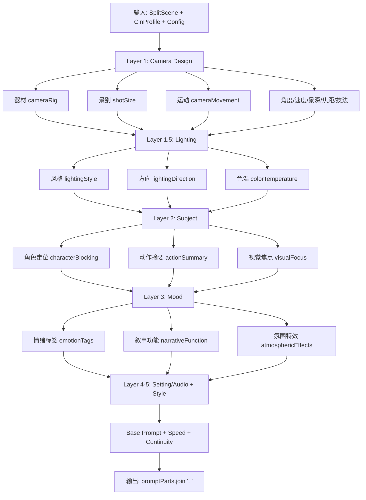
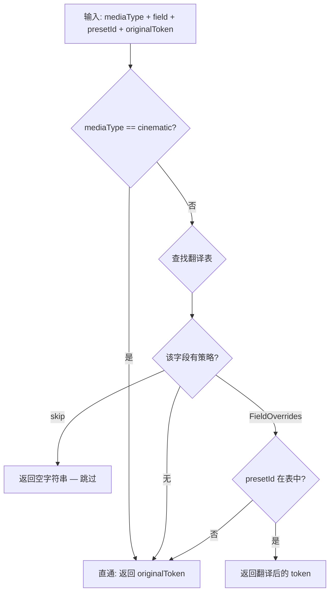

# PD-10.06 moyin-creator — 五层语义 Prompt 管道与媒介类型翻译

> 文档编号：PD-10.06
> 来源：moyin-creator `src/lib/generation/prompt-builder.ts`
> GitHub：https://github.com/MemeCalculate/moyin-creator.git
> 问题域：PD-10 中间件管道 Middleware Pipeline
> 状态：可复用方案

---

## 第 1 章 问题与动机

### 1.1 核心问题

视频生成 AI（如 Seedance 2.0）接受自然语言 prompt 作为输入，但一个高质量的视频 prompt 需要同时表达镜头运动、灯光设计、主体动作、情绪氛围、视觉风格等多个维度的信息。如果将这些维度碎片化地堆叠在一起，会导致**信号稀释**——AI 无法区分哪些指令优先级更高，最终生成的视频在关键维度上失控。

moyin-creator 面临的具体挑战：
1. **30+ 摄影控制字段**需要有序组装为一条 prompt，字段间有优先级关系
2. **4 种媒介类型**（cinematic/animation/stop-motion/graphic）对同一摄影参数有完全不同的语义表达
3. **摄影风格档案**提供项目级默认值，逐镜字段为空时需要回退到档案默认
4. **两级 prompt 构建器**并存：单镜头级（prompt-builder.ts）和组级多镜头叙事（sclass-prompt-builder.ts），需要保持一致性

### 1.2 moyin-creator 的解法概述

1. **5 层语义管道**（`prompt-builder.ts:8-14`）：Camera → Lighting → Subject → Mood → Style，每层有明确的语义边界和优先级
2. **媒介类型翻译层**（`media-type-tokens.ts:1-208`）：在管道的每个节点，根据 mediaType 将物理摄影 token 翻译为该媒介能驾驭的等效表达
3. **摄影档案回退**（`cinematography-profiles.ts:36-84`）：CinematographyProfile 提供 6 维默认值（灯光/焦点/器材/氛围/速度/角度），逐镜字段为空时自动回退
4. **组级 prompt 组装器**（`sclass-prompt-builder.ts:579-759`）：将多个单镜头 prompt 片段组装为多镜头叙事结构，附加角色引用、对白唇形同步、音频设计等横切关注点
5. **配额校验守卫**（`sclass-prompt-builder.ts:80-88`）：SEEDANCE_LIMITS 硬编码 API 限制（≤9图/≤3视频/≤3音频/≤5000字符），在管道末端拦截超限

### 1.3 设计思想

| 设计原则 | 具体实现 | 理由 | 替代方案 |
|----------|----------|------|----------|
| 语义分层优先级 | 5 层固定顺序：Camera > Lighting > Subject > Mood > Style | AI 模型对 prompt 前部内容赋予更高权重，镜头设计是视频生成最关键的控制维度 | 扁平拼接所有字段（信号稀释） |
| 翻译而非过滤 | media-type-tokens 将物理摄影词汇翻译为等效表达，而非简单跳过 | 动画风格仍需要"景深"概念，只是表达为"层次模糊"而非"光学 DOF" | 按媒介类型硬编码不同的 prompt 模板 |
| 回退链而非必填 | `scene.field \|\| cinProfile?.defaultField` 逐字段回退 | 用户只需设置一次摄影档案，30+ 字段自动获得合理默认值 | 要求用户填写所有字段 |
| 纯函数管道 | buildVideoPrompt 无副作用，输入 scene + profile + config 输出 string | 可独立测试，可在 UI 预览和实际生成中复用同一函数 | 有状态的 builder 类 |
| 配额前置校验 | collectAllRefs 在组装 prompt 前完成引用收集和配额检查 | 避免组装完 prompt 后才发现超限需要重新裁剪 | 后置校验 + 截断 |

---

## 第 2 章 源码实现分析

### 2.1 架构概览

moyin-creator 的 prompt 管道分为两个层级：**单镜头管道**和**组级管道**，通过共享的翻译层和摄影档案实现一致性。

```
┌─────────────────────────────────────────────────────────────────┐
│                    组级管道 (sclass-prompt-builder.ts)           │
│  ┌──────────┐  ┌──────────┐  ┌──────────┐  ┌───────────────┐  │
│  │ 引用收集  │→│ 镜头片段  │→│ 时间轴   │→│ 横切关注点    │  │
│  │collectAll│  │buildShot │  │ 计算     │  │角色/对白/音频 │  │
│  │Refs      │  │Segment   │  │          │  │/风格/配额     │  │
│  └──────────┘  └──────────┘  └──────────┘  └───────────────┘  │
└─────────────────────────────────────────────────────────────────┘
                              ↑ 复用
┌─────────────────────────────────────────────────────────────────┐
│              单镜头管道 (prompt-builder.ts)                      │
│  ┌─────────┐ ┌─────────┐ ┌─────────┐ ┌──────┐ ┌───────┐      │
│  │ Layer 1 │→│Layer 1.5│→│ Layer 2 │→│Lay 3 │→│Lay 4-5│      │
│  │ Camera  │ │Lighting │ │ Subject │ │ Mood │ │Set/Sty│      │
│  └────┬────┘ └────┬────┘ └────┬────┘ └──┬───┘ └───┬───┘      │
│       │           │           │          │         │           │
│       ▼           ▼           ▼          ▼         ▼           │
│  ┌─────────────────────────────────────────────────────┐       │
│  │         媒介类型翻译层 (media-type-tokens.ts)        │       │
│  │  cinematic → 直通  |  animation → 虚拟摄像机适配     │       │
│  │  stop-motion → 微缩实拍  |  graphic → 跳过物理参数   │       │
│  └─────────────────────────────────────────────────────┘       │
│                          ↑ 回退                                │
│  ┌─────────────────────────────────────────────────────┐       │
│  │       摄影风格档案 (cinematography-profiles.ts)       │       │
│  │  灯光 | 焦点 | 器材 | 氛围 | 速度 | 角度/焦距/技法   │       │
│  └─────────────────────────────────────────────────────┘       │
└─────────────────────────────────────────────────────────────────┘
```

### 2.2 核心实现

#### 2.2.1 五层语义管道 — buildVideoPrompt



对应源码 `src/lib/generation/prompt-builder.ts:112-350`：

```typescript
export function buildVideoPrompt(
  scene: SplitScene,
  cinProfile: CinematographyProfile | undefined,
  config: VideoPromptConfig = {},
): string {
  const promptParts: string[] = [];
  const mt = config.mediaType;

  // ---------- Layer 1: 镜头设计 (Camera Design) ----------
  const cameraDesignParts: string[] = [];

  // 1.0 器材类型 —— 逐镜优先，回退摄影档案
  const effectiveRig = scene.cameraRig || cinProfile?.defaultRig?.cameraRig;
  const rigToken = findPresetToken(CAMERA_RIG_PRESETS, effectiveRig, mt, 'cameraRig');
  if (rigToken) cameraDesignParts.push(rigToken);

  // ... 1.1-1.9 同样模式：scene.field || cinProfile?.default → findPresetToken → push

  // 组装 Layer 1
  if (cameraDesignParts.length > 0) {
    promptParts.push(`Camera: ${cameraDesignParts.join(', ')}`);
  }

  // ---------- Layer 1.5: Lighting ----------
  // ---------- Layer 2: Subject ----------
  // ---------- Layer 3: Mood ----------
  // ---------- Layer 4: Setting & Audio ----------
  // ---------- Layer 5: Style ----------

  return promptParts.join('. ');
}
```

每层的组装模式完全一致：收集该层所有有效 token → 用 `LayerName: token1, token2` 格式拼接 → push 到 promptParts。层间用 `. ` 分隔，形成自然语言句子结构。

#### 2.2.2 媒介类型翻译层 — translateToken



对应源码 `src/lib/generation/media-type-tokens.ts:185-208`：

```typescript
export function translateToken(
  mediaType: MediaType,
  field: CinematographyField,
  presetId: string,
  originalToken: string,
): string {
  // cinematic → 直通
  if (mediaType === 'cinematic') return originalToken;

  const table = TRANSLATION_TABLES[mediaType];
  if (!table) return originalToken;

  const strategy = table[field];

  // 该字段无特殊处理 → 沿用原始 token
  if (strategy === undefined) return originalToken;

  // 整体跳过
  if (strategy === 'skip') return '';

  // 查表替换
  const override = strategy[presetId];
  return override !== undefined ? override : originalToken;
}
```

翻译表的设计精妙之处在于三级降级策略：
- **字段级跳过**（`'skip'`）：graphic 媒介直接跳过 cameraRig/depthOfField 等物理参数
- **预设级替换**（`FieldOverrides`）：animation 的 `dolly` → `smooth tracking with parallax layers`
- **默认直通**：未在表中的预设 ID 沿用原始 token，兼容未来新增预设

### 2.3 实现细节

#### 摄影档案回退机制

`CinematographyProfile`（`cinematography-profiles.ts:36-84`）定义了 6 个维度的默认值：

| 维度 | 字段 | 示例（经典电影） |
|------|------|-----------------|
| 灯光 | style/direction/colorTemperature | natural / three-point / warm |
| 焦点 | depthOfField/focusTransition | medium / rack-between |
| 器材 | cameraRig/movementSpeed | dolly / slow |
| 氛围 | effects[]/intensity | [] / subtle |
| 速度 | playbackSpeed | normal |
| 角度 | angle/focalLength/technique | eye-level / 50mm / undefined |

prompt-builder 中每个字段都遵循 `scene.field || cinProfile?.defaultField` 的回退模式（`prompt-builder.ts:124-200`），共计 13 个字段使用此模式。

#### 组级 prompt 的多镜头叙事结构

`buildGroupPrompt`（`sclass-prompt-builder.ts:579-759`）在单镜头管道之上增加了组级关注点：

1. **引用收集与配额校验**：`collectAllRefs` 按优先级（格子图 > 首帧 > 角色 > 场景）收集 @Image 引用，硬限 9 张
2. **时间轴计算**：累加各镜头 duration，生成 `[0s-5s]` 时间标记
3. **对白唇形同步**：`extractDialogueSegments` 提取对白并生成 `[约Xs处] 角色：「台词」— 口型同步` 指令
4. **三级 prompt 优先级**：手动编辑 > AI 校准 > 自动拼接（`sclass-prompt-builder.ts:610-633`）

#### findPresetToken 的翻译桥接

`findPresetToken`（`prompt-builder.ts:78-89`）是管道中每个节点的统一入口：

```typescript
function findPresetToken<T extends { id: string; promptToken: string }>(
  presets: readonly T[],
  id: string | undefined,
  mediaType: MediaType | undefined,
  field: CinematographyField,
): string | undefined {
  if (!id) return undefined;
  const preset = presets.find(p => p.id === id);
  if (!preset?.promptToken) return undefined;
  const translated = translateToken(mediaType ?? 'cinematic', field, id, preset.promptToken);
  return translated || undefined; // 空字符串 → undefined（跳过）
}
```

这个函数将三个关注点串联：预设查找 → 媒介翻译 → 空值过滤。`mediaType ?? 'cinematic'` 确保未指定媒介时默认直通。


---

## 第 3 章 迁移指南

### 3.1 迁移清单

**阶段 1：定义语义层和字段映射**

- [ ] 确定你的 prompt 需要哪些语义层（不一定是 5 层，根据你的 AI 模型特性调整）
- [ ] 为每层定义字段列表和优先级顺序
- [ ] 定义预设数据结构（id + promptToken）

**阶段 2：实现翻译层**

- [ ] 定义你的"媒介类型"枚举（如果你的场景有多种输出模式）
- [ ] 为每种非默认媒介类型编写翻译表
- [ ] 实现 `translateToken` 函数（三级降级：skip / override / passthrough）

**阶段 3：实现回退链**

- [ ] 定义 Profile 数据结构，包含所有字段的默认值
- [ ] 在 prompt builder 中实现 `scene.field || profile?.defaultField` 回退模式
- [ ] 提供 Profile 预设库（至少 3-5 个常用配置）

**阶段 4：组装管道**

- [ ] 实现单条目 prompt builder（纯函数，输入数据 + profile + config，输出 string）
- [ ] 如需批量组装，实现组级 builder（引用收集 + 配额校验 + 横切关注点）

### 3.2 适配代码模板

以下是一个可直接复用的 TypeScript 语义管道框架：

```typescript
// ==================== 类型定义 ====================

type MediaType = 'default' | 'simplified' | 'verbose';

interface FieldPreset {
  id: string;
  promptToken: string;
}

type FieldStrategy = Record<string, string> | 'skip';
type TranslationTable = Partial<Record<string, FieldStrategy>>;

// ==================== 翻译层 ====================

const TRANSLATION_TABLES: Partial<Record<MediaType, TranslationTable>> = {
  simplified: {
    // 某些字段在简化模式下跳过
    technicalDetail: 'skip',
    // 某些字段翻译为简化表达
    cameraMovement: {
      'dolly-in': 'camera moves forward,',
      'crane-up': 'camera rises,',
    },
  },
};

function translateToken(
  mediaType: MediaType,
  field: string,
  presetId: string,
  originalToken: string,
): string {
  if (mediaType === 'default') return originalToken;
  const table = TRANSLATION_TABLES[mediaType];
  if (!table) return originalToken;
  const strategy = table[field];
  if (strategy === undefined) return originalToken;
  if (strategy === 'skip') return '';
  const override = strategy[presetId];
  return override !== undefined ? override : originalToken;
}

// ==================== 回退 + 查找 ====================

function findToken(
  presets: readonly FieldPreset[],
  id: string | undefined,
  mediaType: MediaType,
  field: string,
): string | undefined {
  if (!id) return undefined;
  const preset = presets.find(p => p.id === id);
  if (!preset?.promptToken) return undefined;
  const translated = translateToken(mediaType, field, id, preset.promptToken);
  return translated || undefined;
}

// ==================== 语义管道 ====================

interface LayerConfig {
  name: string;
  fields: Array<{
    presets: readonly FieldPreset[];
    getValue: (data: any, profile: any) => string | undefined;
    field: string;
  }>;
}

function buildPrompt(
  data: Record<string, any>,
  profile: Record<string, any> | undefined,
  layers: LayerConfig[],
  mediaType: MediaType = 'default',
): string {
  const parts: string[] = [];

  for (const layer of layers) {
    const tokens: string[] = [];
    for (const f of layer.fields) {
      const value = f.getValue(data, profile);
      const token = findToken(f.presets, value, mediaType, f.field);
      if (token) tokens.push(token);
    }
    if (tokens.length > 0) {
      parts.push(`${layer.name}: ${tokens.join(', ')}`);
    }
  }

  return parts.join('. ');
}
```

### 3.3 适用场景

| 场景 | 适用度 | 说明 |
|------|--------|------|
| 视频/图片生成 prompt 组装 | ⭐⭐⭐ | 核心场景，多维度摄影参数需要有序组装 |
| 多模态 AI 输入构建 | ⭐⭐⭐ | 任何需要将结构化数据转为自然语言 prompt 的场景 |
| 多风格/多模型适配 | ⭐⭐⭐ | 翻译层可适配不同 AI 模型对 prompt 格式的偏好 |
| 表单驱动的文本生成 | ⭐⭐ | 用户填写表单字段，系统组装为结构化文本 |
| 简单的单层 prompt | ⭐ | 如果只有 1-2 个维度，分层管道过度设计 |

---

## 第 4 章 测试用例

```typescript
import { describe, it, expect } from 'vitest';

// ==================== translateToken 测试 ====================

describe('translateToken', () => {
  it('cinematic 媒介直通原始 token', () => {
    const result = translateToken('cinematic', 'cameraRig', 'dolly', 'smooth dolly push-in,');
    expect(result).toBe('smooth dolly push-in,');
  });

  it('animation 媒介翻译 dolly 为 parallax', () => {
    const result = translateToken('animation', 'cameraRig', 'dolly', 'smooth dolly push-in,');
    expect(result).toBe('smooth tracking with parallax layers,');
  });

  it('graphic 媒介跳过物理摄影参数', () => {
    const result = translateToken('graphic', 'cameraRig', 'dolly', 'smooth dolly push-in,');
    expect(result).toBe('');
  });

  it('未知预设 ID 回退到原始 token', () => {
    const result = translateToken('animation', 'cameraRig', 'unknown-rig', 'original token,');
    expect(result).toBe('original token,');
  });

  it('无翻译表的字段直通', () => {
    // animation 表中没有 lightingStyle 的翻译
    const result = translateToken('animation', 'lightingStyle', 'high-key', 'bright even lighting,');
    expect(result).toBe('bright even lighting,');
  });
});

// ==================== findPresetToken 测试 ====================

describe('findPresetToken', () => {
  const MOCK_PRESETS = [
    { id: 'dolly', promptToken: 'smooth dolly push-in,' },
    { id: 'handheld', promptToken: 'handheld camera shake,' },
    { id: 'empty', promptToken: '' },
  ] as const;

  it('正常查找并翻译', () => {
    const result = findPresetToken(MOCK_PRESETS, 'dolly', 'cinematic', 'cameraRig');
    expect(result).toBe('smooth dolly push-in,');
  });

  it('id 为 undefined 返回 undefined', () => {
    const result = findPresetToken(MOCK_PRESETS, undefined, 'cinematic', 'cameraRig');
    expect(result).toBeUndefined();
  });

  it('空 promptToken 返回 undefined', () => {
    const result = findPresetToken(MOCK_PRESETS, 'empty', 'cinematic', 'cameraRig');
    expect(result).toBeUndefined();
  });

  it('graphic 跳过后返回 undefined', () => {
    const result = findPresetToken(MOCK_PRESETS, 'dolly', 'graphic', 'cameraRig');
    expect(result).toBeUndefined();
  });
});

// ==================== buildVideoPrompt 集成测试 ====================

describe('buildVideoPrompt', () => {
  const minimalScene = {
    cameraRig: 'dolly',
    shotSize: 'medium',
    actionSummary: 'character walks forward',
    emotionTags: ['tense'],
  } as any;

  it('无 profile 时仅使用 scene 字段', () => {
    const result = buildVideoPrompt(minimalScene, undefined, {});
    expect(result).toContain('Camera:');
    expect(result).toContain('Subject:');
  });

  it('scene 字段为空时回退到 profile', () => {
    const emptyScene = {} as any;
    const profile = {
      defaultRig: { cameraRig: 'tripod', movementSpeed: 'slow' },
      defaultLighting: { style: 'natural', direction: 'three-point', colorTemperature: 'warm' },
      defaultFocus: { depthOfField: 'medium', focusTransition: 'rack-between' },
      defaultAtmosphere: { effects: [], intensity: 'subtle' },
      defaultSpeed: { playbackSpeed: 'normal' },
    } as any;
    const result = buildVideoPrompt(emptyScene, profile, {});
    expect(result).toContain('Camera:');
  });

  it('graphic 媒介跳过物理摄影参数', () => {
    const result = buildVideoPrompt(minimalScene, undefined, { mediaType: 'graphic' });
    // graphic 模式下 cameraRig 被跳过
    expect(result).not.toContain('dolly');
  });
});

// ==================== collectAllRefs 配额测试 ====================

describe('collectAllRefs', () => {
  it('图片引用不超过 9 张', () => {
    const scenes = Array.from({ length: 15 }, (_, i) => ({
      id: i,
      imageDataUrl: `data:image/png;base64,${i}`,
      characterIds: [`char_${i}`],
    })) as any[];
    const group = { videoRefs: [], audioRefs: [] } as any;
    const chars = scenes.map((_, i) => ({
      id: `char_${i}`,
      views: [{ imageBase64: `data:${i}` }],
      name: `Char${i}`,
    })) as any[];

    const refs = collectAllRefs(group, scenes, chars, []);
    expect(refs.images.length).toBeLessThanOrEqual(9);
  });

  it('格子图模式下格子图占第一槽位', () => {
    const gridRef = { id: 'grid', type: 'image', tag: '@图片1', purpose: 'grid_image' } as any;
    const scenes = [{ id: 0, characterIds: ['c1'] }] as any[];
    const chars = [{ id: 'c1', views: [{ imageBase64: 'data:x' }], name: 'A' }] as any[];

    const refs = collectAllRefs({ videoRefs: [], audioRefs: [] } as any, scenes, chars, [], gridRef);
    expect(refs.images[0].id).toBe('grid');
  });
});
```


---

## 第 5 章 跨域关联

| 关联域 | 关系类型 | 说明 |
|--------|----------|------|
| PD-01 上下文管理 | 协同 | 5000 字符 prompt 限制本质是上下文窗口管理；组级 prompt 的三级优先级（手动 > AI校准 > 自动拼接）是上下文压缩的一种形式 |
| PD-04 工具系统 | 依赖 | prompt-builder 的输出直接作为视频生成 API 的输入参数；SEEDANCE_LIMITS 配额校验是工具调用前的参数验证 |
| PD-07 质量检查 | 协同 | 5 阶段分镜校准（shot-calibration-stages.ts）是 prompt 质量的前置保障；AI 校准后的 calibratedPrompt 优先级高于自动拼接 |
| PD-12 推理增强 | 协同 | 摄影档案的 promptGuidance 和 referenceFilms 注入 AI system prompt，引导 AI 理解目标摄影风格，属于推理增强的 few-shot 策略 |

---

## 第 6 章 来源文件索引

| 文件 | 行范围 | 关键实现 |
|------|--------|----------|
| `src/lib/generation/prompt-builder.ts` | L1-L351 | 五层语义管道核心：buildVideoPrompt + findPresetToken |
| `src/lib/generation/media-type-tokens.ts` | L1-L234 | 媒介类型翻译层：translateToken + 4 种翻译表 |
| `src/lib/constants/cinematography-profiles.ts` | L36-L467 | 摄影风格档案：CinematographyProfile 类型 + 13 个预设 |
| `src/lib/constants/visual-styles.ts` | L14-L21 | MediaType 类型定义 + StylePreset 结构 |
| `src/components/panels/sclass/sclass-prompt-builder.ts` | L1-L890 | 组级 prompt 构建：buildGroupPrompt + collectAllRefs + 配额校验 |
| `src/lib/script/shot-calibration-stages.ts` | L1-L100 | 5 阶段分镜校准：消费 media-type-tokens 的 getMediaTypeGuidance |

---

## 第 7 章 横向对比维度

> **重要：** 本章用于自动填充 Butcher Wiki 的横向对比表。
> 必须严格按以下 JSON 格式输出，放在 `comparison_data` 代码块中。

```json comparison_data
{
  "project": "moyin-creator",
  "dimensions": {
    "中间件基类": "无基类，纯函数管道：buildVideoPrompt 输入 scene+profile+config 输出 string",
    "钩子点": "5 层语义层（Camera/Lighting/Subject/Mood/Style）+ Base Prompt + Speed + Continuity",
    "中间件数量": "单镜头 5 层 + 组级 6 个横切关注点（引用/时间轴/对白/音频/风格/配额）",
    "条件激活": "findPresetToken 空值跳过 + translateToken skip 策略 + isValid 过滤无效值",
    "状态管理": "无状态纯函数，每次调用独立计算，无共享可变状态",
    "执行模型": "同步串行：5 层顺序拼接，组级 map+reduce 组装",
    "同步热路径": "全同步，buildVideoPrompt 和 buildGroupPrompt 均为同步纯函数",
    "数据传递": "promptParts 数组累积，层间无显式上下文对象，通过闭包共享 scene/profile/config",
    "错误隔离": "每层独立：单层所有字段为空时该层静默跳过，不影响其他层",
    "媒介类型翻译": "4 种媒介（cinematic/animation/stop-motion/graphic）的字段级翻译表，三级降级策略",
    "摄影档案回退": "13 个字段逐一 scene.field || cinProfile?.default 回退，6 维档案覆盖灯光/焦点/器材/氛围/速度/角度",
    "Prompt层级优先级": "组级三级：手动编辑 > AI校准 > 自动拼接；单镜头五层：Camera > Lighting > Subject > Mood > Style",
    "配额守卫": "SEEDANCE_LIMITS 硬编码（≤9图/≤3视频/≤3音频/≤12总/≤5000字符），引用收集时前置校验"
  }
}
```

### 域元数据补充

```json domain_metadata
{
  "solution_summary": "moyin-creator 用5层语义管道（Camera→Lighting→Subject→Mood→Style）逐层组装视频生成prompt，配合4种媒介类型翻译表和13字段摄影档案回退实现跨风格适配",
  "description": "prompt 组装场景下的语义分层管道，关注信号优先级和跨媒介翻译",
  "sub_problems": [
    "媒介类型翻译：同一摄影参数在不同媒介（真人/动画/定格/抽象）下的等效语义表达",
    "摄影档案回退链：项目级默认值与逐镜覆盖的多字段回退策略",
    "组级横切关注点注入：引用收集、时间轴、对白唇形同步等跨镜头关注点的组装位置",
    "API 配额前置校验：在 prompt 组装前完成资源引用的配额检查避免后置截断"
  ],
  "best_practices": [
    "纯函数管道无副作用：prompt builder 输入不可变数据输出字符串，可独立测试和复用",
    "翻译而非过滤：跨媒介适配时将物理摄影词汇翻译为等效表达，保留语义完整性",
    "三级降级策略：字段级 skip → 预设级 override → 默认直通，兼容未来新增预设"
  ]
}
```

