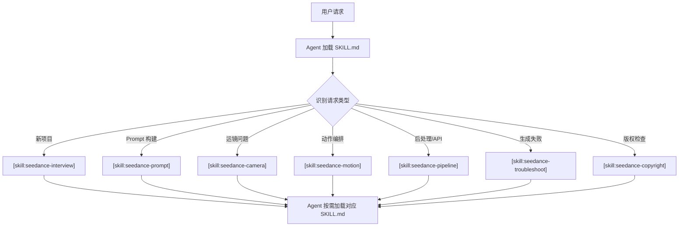
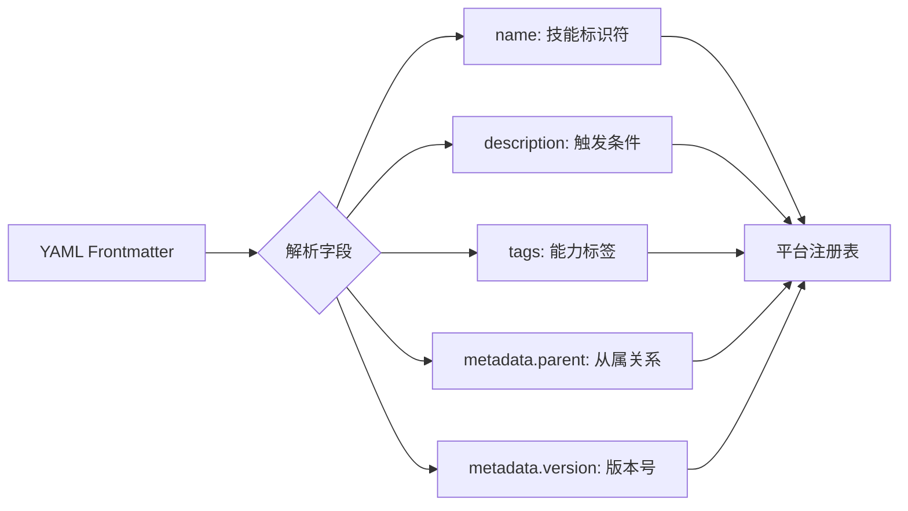
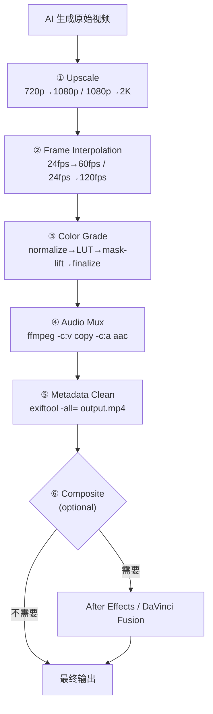

# PD-10.07 seedance-2.0 — Skill 路由与 6 阶段后处理管道

> 文档编号：PD-10.07
> 来源：seedance-2.0 `SKILL.md` `skills/seedance-pipeline/SKILL.md` `references/quick-ref.md`
> GitHub：https://github.com/Emily2040/seedance-2.0.git
> 问题域：PD-10 中间件管道 Middleware Pipeline
> 状态：可复用方案

---

## 第 1 章 问题与动机

### 1.1 核心问题

AI 视频生成工具链面临两个中间件管道问题：

1. **技能路由**：一个根入口如何将用户请求精准分发到 20 个专业子模块？当用户说"帮我做一个打斗场景"，系统需要同时激活 motion（动作编排）、vfx（特效物理）、audio（音效设计）、camera（运镜）四个子技能，而不是把所有知识一次性灌入上下文。
2. **后处理链**：AI 生成的原始视频需要经过多阶段后处理才能达到发布质量。这些阶段有严格的顺序依赖（先 Upscale 再调色，先帧插值再合成），且每个阶段可能使用不同的外部工具（Topaz、RIFE、DaVinci、FFmpeg）。

seedance-2.0 的独特之处在于：它不是一个代码项目，而是一个**纯 Markdown 技能系统**。它用 `[skill:xxx]` 语法实现了一套声明式的中间件路由，用 SKILL.md 文件作为"中间件注册表"，用 YAML frontmatter 作为元数据协议。这是一种完全不同于代码级中间件的管道设计范式。

### 1.2 seedance-2.0 的解法概述

1. **根技能路由器**：`SKILL.md`（81 行）作为唯一入口，通过 `[skill:seedance-xxx]` 语法声明 20 个子技能的路由关系（`SKILL.md:55-66`）
2. **三层技能分组**：Core Pipeline（12 个）→ Content Quality（2 个）→ Vocabulary（5 个）+ Examples（1 个），按职责域分层（`SKILL.md:55-65`）
3. **6 阶段后处理链**：Upscale → Frame Interpolation → Color Grade → Audio Mux → Metadata Clean → Composite，严格串行（`skills/seedance-pipeline/SKILL.md:78-104`）
4. **YAML frontmatter 元数据协议**：每个子技能通过 `metadata.parent: seedance-20` 声明从属关系，通过 `tags` 声明能力标签（`skills/seedance-pipeline/SKILL.md:1-9`）
5. **尾部路由表**：每个子技能末尾都有 `## Routing` 段，声明与其他技能的跨域路由关系（`skills/seedance-pipeline/SKILL.md:113-118`）

### 1.3 设计思想

| 设计原则 | 具体实现 | 理由 | 替代方案 |
|----------|----------|------|----------|
| 声明式路由 | `[skill:xxx]` 语法引用子技能 | Agent 按需加载，零 token 浪费 | 代码级 import/require |
| 单一入口 | 根 SKILL.md 仅 81 行，只做路由 | 减少首次加载的上下文开销 | 所有知识打包到一个大文件 |
| 关注点分离 | 20 个独立 SKILL.md 各管一个域 | 每个技能可独立测试和迭代 | 单体 prompt 文件 |
| 串行后处理 | 6 阶段固定顺序 | 视频后处理有物理依赖（先放大再调色） | 并行处理（会导致质量问题） |
| 元数据协议 | YAML frontmatter + parent 字段 | 支持 10+ 平台的统一安装和发现 | 自定义配置文件格式 |

---

## 第 2 章 源码实现分析

### 2.1 架构概览

seedance-2.0 的管道架构分为两层：**技能路由层**（Agent 读取哪个 SKILL.md）和**后处理执行层**（视频生成后的工具链）。

```
┌─────────────────────────────────────────────────────────┐
│                  seedance-20 (根路由器)                    │
│                    SKILL.md (81 行)                       │
│                                                          │
│  Core Pipeline ─────────────────────────────────────┐    │
│  │ interview → prompt → camera → motion → lighting  │    │
│  │ characters → style → vfx → audio → pipeline      │    │
│  │ recipes → troubleshoot                            │    │
│  └───────────────────────────────────────────────────┘    │
│  Content Quality ── copyright · antislop                  │
│  Vocabulary ──────── vocab-zh/ja/ko/es/ru                 │
│  Examples ────────── examples-zh                          │
└─────────────────────────────────────────────────────────┘
                          │
                          ▼ [skill:seedance-pipeline]
┌─────────────────────────────────────────────────────────┐
│              seedance-pipeline (后处理链)                  │
│                                                          │
│  ① Upscale ──→ ② Frame Interpolation ──→ ③ Color Grade  │
│       │                  │                      │        │
│       ▼                  ▼                      ▼        │
│  Topaz/ESRGAN      RIFE v4.x/DAIN       DaVinci/FFmpeg  │
│                                                          │
│  ④ Audio Mux ──→ ⑤ Metadata Clean ──→ ⑥ Composite       │
│       │                  │                      │        │
│       ▼                  ▼                      ▼        │
│    FFmpeg            exiftool           AE/DaVinci Fusion │
└─────────────────────────────────────────────────────────┘
```

### 2.2 核心实现

#### 2.2.1 根技能路由器



根技能的路由声明（`SKILL.md:55-66`）：

```markdown
## Skills

**Core pipeline**
[skill:seedance-interview] · [skill:seedance-prompt] · [skill:seedance-camera] ·
[skill:seedance-motion] · [skill:seedance-lighting] · [skill:seedance-characters] ·
[skill:seedance-style] · [skill:seedance-vfx] · [skill:seedance-audio] ·
[skill:seedance-pipeline] · [skill:seedance-recipes] · [skill:seedance-troubleshoot]

**Content quality**
[skill:seedance-copyright] · [skill:seedance-antislop]

**Vocabulary**
[skill:seedance-vocab-zh] · [skill:seedance-vocab-ja] · [skill:seedance-vocab-ko] ·
[skill:seedance-vocab-es] · [skill:seedance-vocab-ru]
```

这段声明实现了三个功能：
- **路由注册**：Agent 知道有哪些子技能可用
- **分组分类**：Core / Quality / Vocabulary 三层优先级
- **按需加载**：Agent 只加载匹配的子技能，不加载全部

#### 2.2.2 YAML Frontmatter 元数据协议



子技能的 YAML frontmatter（`skills/seedance-pipeline/SKILL.md:1-9`）：

```yaml
---
name: seedance-pipeline
description: 'Integrate Seedance 2.0 with ComfyUI nodes and post-processing
  chains covering upscale, frame interpolation, color grade, composite, and
  metadata cleanup. Use when building automated video pipelines, connecting
  Seedance to external tools, or finishing and delivering a generated video clip.'
license: MIT
user-invocable: true
tags: ["pipeline", "comfyui", "api", "firebase", "openclaw", "antigravity",
       "gemini-cli", "codex", "cursor", "windsurf", "opencode"]
metadata:
  version: "3.7.0"
  updated: "2026-02-26"
  parent: "seedance-20"
  author: "Emily (@iamemily2050)"
  repository: "https://github.com/Emily2040/seedance-2.0"
---
```

关键设计点：
- `description` 字段包含 "Use when..." 触发条件，Agent 据此判断是否加载
- `tags` 数组同时包含能力标签（pipeline, comfyui）和平台标签（openclaw, antigravity）
- `metadata.parent: seedance-20` 声明从属关系，平台据此构建技能树
- 10+ 平台的安装路径通过 `metadata` 中的平台块统一管理

#### 2.2.3 6 阶段后处理链



后处理链定义（`skills/seedance-pipeline/SKILL.md:78-104`）：

```markdown
## Post-Processing Chain

### 1 · Upscale
- Tool: Topaz Video AI · Real-ESRGAN · ffmpeg `scale=iw*2:ih*2`
- Target: 720p → 1080p (standard) · 1080p → 2K (premium)

### 2 · Frame Interpolation
- Tool: RIFE v4.x · DAIN
- Standard: 24 fps → 60 fps (smooth motion)
- Fight / fast action: 24 fps → 120 fps

### 3 · Color Grade
- Tools: DaVinci Resolve · FFmpeg LUT
- Workflow: normalize exposure → apply LUT → mask-lift shadows → finalize.
- LUT slots: Rec.709 (web) · Log-C (archive).

### 4 · Audio Mux
- Merge generated stereo audio with video:
  `ffmpeg -i video.mp4 -i audio.mp3 -c:v copy -c:a aac -shortest out.mp4`

### 5 · Metadata Clean
- Strip generation metadata before distribution: `exiftool -all= output.mp4`
- Rename: `{project}_{shot}_{take}_{date}.mp4`

### 6 · Composite (optional)
- Layer generated clips in After Effects / DaVinci Fusion.
- Match color temperature across cuts before export.
```

### 2.3 实现细节

#### 尾部路由表模式

每个子技能末尾都有一个 `## Routing` 段，形成技能间的跨域路由网络。这是一种去中心化的路由补充机制——当 Agent 已经在某个子技能内工作时，遇到超出当前技能范围的问题，可以通过尾部路由表跳转。

`skills/seedance-pipeline/SKILL.md:113-118`：
```markdown
## Routing

For prompt issues → [skill:seedance-prompt]
For camera/storyboard → [skill:seedance-camera]
For QA / errors → [skill:seedance-troubleshoot]
```

`skills/seedance-troubleshoot/SKILL.md:174-180`：
```markdown
## Routing

Prompt construction errors → [skill:seedance-prompt]
Camera / storyboard issues → [skill:seedance-camera]
API / post-processing → [skill:seedance-pipeline]
Character consistency → [skill:seedance-characters]
Audio issues → [skill:seedance-audio]
```

这形成了一个**双向路由图**：pipeline ↔ troubleshoot ↔ prompt ↔ camera，Agent 可以在技能间自由跳转而不需要回到根路由器。

#### ComfyUI 节点工作流

`skills/seedance-pipeline/SKILL.md:58-74` 定义了 ComfyUI 的节点连接拓扑：

```
[Load Image / Load Video] → [Seedance2 Sampler]
      ↓                           ↓
[CLIP Text Encode]          [Prompt Compiler]
      └────────────────────────→ ↓
                         [Video Output Node]
                                 ↓
                      [Frame Interpolation]
                                 ↓
                         [Upscale Node]
                                 ↓
                       [Color Grade Node]
                                 ↓
                        [Export / Mux Audio]
```

这是后处理链在 ComfyUI 中的节点化表达，每个节点对应后处理链的一个阶段。

#### 输出规格矩阵

`skills/seedance-pipeline/SKILL.md:105-112` 定义了三种输出规格：

| 用途 | 分辨率 | FPS | 容器 | 音频 |
|------|--------|-----|------|------|
| Web/社交 | 1080p | 30 | MP4 H.264 | AAC 192k stereo |
| 电影节 | 2K | 24 | MOV ProRes | PCM 48kHz |
| 归档 | 2K | 24 | MKV H.265 | FLAC stereo |

这决定了后处理链各阶段的参数选择——Web 输出走 H.264 + AAC 快速路径，电影节输出走 ProRes + PCM 高质量路径。
