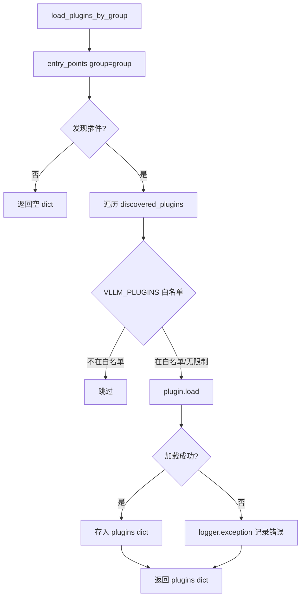
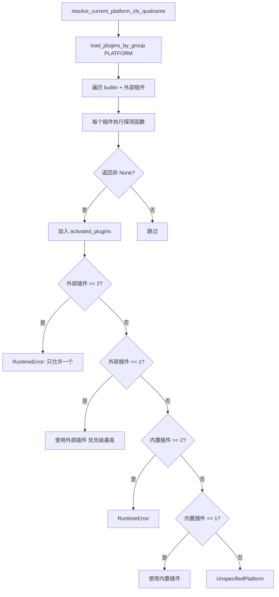

# PD-10.vLLM vLLM — entry_points 四类插件组动态加载管道

> 文档编号：PD-10.vLLM
> 来源：vLLM `vllm/plugins/__init__.py`, `vllm/v1/metrics/loggers.py`, `vllm/platforms/__init__.py`
> GitHub：https://github.com/vllm-project/vllm.git
> 问题域：PD-10 中间件管道 Middleware Pipeline
> 状态：可复用方案

---

## 第 1 章 问题与动机

### 1.1 核心问题

vLLM 是一个高性能 LLM 推理引擎，需要在不修改核心代码的前提下支持：
- **多硬件平台适配**：CUDA、ROCm、TPU、XPU、CPU 等不同硬件后端
- **自定义 I/O 处理**：不同模型可能需要特殊的输入预处理和输出后处理
- **可扩展的指标系统**：用户需要自定义统计日志（如接入自有监控系统）
- **通用功能注入**：如 LoRA 解析器等横切关注点的注册

传统做法是在核心代码中用 if-else 分支处理不同场景，但这会导致核心代码膨胀、耦合度高、第三方扩展困难。vLLM 选择了 Python 生态中成熟的 setuptools entry_points 机制，将扩展点标准化为四类插件组。

### 1.2 vLLM 的解法概述

1. **四类插件组分治**：`general_plugins`（全进程加载）、`platform_plugins`（平台检测）、`io_processor_plugins`（I/O 处理）、`stat_logger_plugins`（统计日志），每组有明确的加载时机和作用域（`vllm/plugins/__init__.py:14-22`）
2. **setuptools entry_points 动态发现**：通过 `importlib.metadata.entry_points()` 发现已安装的插件，无需硬编码导入路径（`vllm/plugins/__init__.py:28-66`）
3. **环境变量白名单过滤**：`VLLM_PLUGINS` 环境变量控制哪些插件被加载，实现运行时选择性激活（`vllm/plugins/__init__.py:32,56`）
4. **ABC 基类约束**：每类插件有明确的抽象基类（如 `StatLoggerBase`、`IOProcessor`），通过类型检查确保插件符合接口契约（`vllm/v1/metrics/loggers.py:40-64`）
5. **单次加载保护**：`plugins_loaded` 全局标志防止多进程环境下重复加载（`vllm/plugins/__init__.py:25-26`）

### 1.3 设计思想

| 设计原则 | 具体实现 | 理由 | 替代方案 |
|----------|----------|------|----------|
| 标准化扩展点 | setuptools entry_points 四组分类 | 利用 Python 包管理生态，pip install 即可注册插件 | 自定义配置文件扫描、目录约定扫描 |
| 进程级作用域隔离 | general 全进程、platform 懒加载、io/stat 仅 process0 | 不同插件的生命周期和加载时机不同，避免不必要的初始化开销 | 统一加载所有插件 |
| 白名单过滤 | VLLM_PLUGINS 环境变量 | 生产环境需要精确控制加载哪些插件，避免意外副作用 | 黑名单排除、配置文件 |
| 接口契约强制 | ABC 基类 + issubclass 检查 | 编译期（加载期）就发现不合规插件，而非运行时崩溃 | duck typing、Protocol |
| 幂等加载 | 全局 plugins_loaded 标志 | 多进程 fork 场景下同一插件可能被多次触发 | 每次检查已加载列表 |

---

## 第 2 章 源码实现分析

### 2.1 架构概览

vLLM 的插件系统采用四组 entry_points 分治架构，每组插件有独立的加载时机和消费者：

```
┌─────────────────────────────────────────────────────────────────┐
│                    pyproject.toml / setup.cfg                    │
│  [project.entry-points."vllm.general_plugins"]                  │
│  [project.entry-points."vllm.platform_plugins"]                 │
│  [project.entry-points."vllm.io_processor_plugins"]             │
│  [project.entry-points."vllm.stat_logger_plugins"]              │
└──────────────────────────┬──────────────────────────────────────┘
                           │ importlib.metadata.entry_points()
                           ▼
┌─────────────────────────────────────────────────────────────────┐
│              load_plugins_by_group(group)                        │
│  ┌─────────────┐  ┌──────────────┐  ┌────────────────────────┐ │
│  │ VLLM_PLUGINS│→ │ entry_points │→ │ plugin.load() + filter │ │
│  │ 白名单过滤   │  │ 动态发现      │  │ 异常隔离               │ │
│  └─────────────┘  └──────────────┘  └────────────────────────┘ │
└──────────────────────────┬──────────────────────────────────────┘
                           │
          ┌────────────────┼────────────────┬──────────────────┐
          ▼                ▼                ▼                  ▼
   general_plugins   platform_plugins  io_processor      stat_logger
   (全进程执行)       (懒加载单例)      (process0)        (process0)
   LoRA resolvers    CUDA/ROCm/TPU    pre/post处理       Prometheus
                     XPU/CPU                              自定义日志
```

### 2.2 核心实现

#### 2.2.1 插件发现与加载核心函数



对应源码 `vllm/plugins/__init__.py:28-66`：

```python
def load_plugins_by_group(group: str) -> dict[str, Callable[[], Any]]:
    """Load plugins registered under the given entry point group."""
    from importlib.metadata import entry_points

    allowed_plugins = envs.VLLM_PLUGINS

    discovered_plugins = entry_points(group=group)
    if len(discovered_plugins) == 0:
        logger.debug("No plugins for group %s found.", group)
        return {}

    # 非默认组用 INFO 级别日志，默认组用 DEBUG 避免噪音
    is_default_group = group == DEFAULT_PLUGINS_GROUP
    log_level = logger.debug if is_default_group else logger.info

    plugins = dict[str, Callable[[], Any]]()
    for plugin in discovered_plugins:
        if allowed_plugins is None or plugin.name in allowed_plugins:
            try:
                func = plugin.load()
                plugins[plugin.name] = func
            except Exception:
                logger.exception("Failed to load plugin %s", plugin.name)

    return plugins
```

关键设计：单个插件加载失败不影响其他插件（`try/except` 隔离），白名单为 `None` 时加载全部。

#### 2.2.2 平台插件的竞争选举机制



对应源码 `vllm/platforms/__init__.py:186-226`：

```python
def resolve_current_platform_cls_qualname() -> str:
    platform_plugins = load_plugins_by_group(PLATFORM_PLUGINS_GROUP)
    activated_plugins = []

    for name, func in chain(builtin_platform_plugins.items(),
                            platform_plugins.items()):
        try:
            assert callable(func)
            platform_cls_qualname = func()
            if platform_cls_qualname is not None:
                activated_plugins.append(name)
        except Exception:
            pass

    activated_oot_plugins = list(
        set(activated_plugins) & set(platform_plugins.keys()))

    if len(activated_oot_plugins) >= 2:
        raise RuntimeError(
            "Only one platform plugin can be activated, but got: "
            f"{activated_oot_plugins}")
    elif len(activated_oot_plugins) == 1:
        platform_cls_qualname = platform_plugins[activated_oot_plugins[0]]()
        logger.info("Platform plugin %s is activated",
                     activated_oot_plugins[0])
    elif len(activated_builtin_plugins) == 1:
        platform_cls_qualname = \
            builtin_platform_plugins[activated_builtin_plugins[0]]()
    else:
        platform_cls_qualname = \
            "vllm.platforms.interface.UnspecifiedPlatform"
    return platform_cls_qualname
```

关键设计：外部插件（out-of-tree）优先级高于内置插件，且最多只能激活一个。平台实例通过 `__getattr__` 懒加载为模块级单例（`vllm/platforms/__init__.py:236-255`）。

### 2.3 实现细节

#### StatLoggerManager 的多日志器扇出

`StatLoggerManager`（`vllm/v1/metrics/loggers.py:1242-1334`）是统计日志的中枢，它将 `record()` 和 `log()` 调用扇出到所有注册的日志器：

- **工厂模式双分支**：如果工厂类是 `AggregateStatLoggerBase` 的子类，直接实例化为全局日志器；否则用 `PerEngineStatLoggerAdapter` 包装为每引擎独立实例
- **Prometheus 默认保底**：即使没有自定义日志器，也会自动添加 `PrometheusStatLogger`（`vllm/v1/metrics/loggers.py:1301-1304`）
- **数据并行聚合**：`AggregatedLoggingStatLogger` 跨多个 DP 引擎聚合统计（`vllm/v1/metrics/loggers.py:281-347`）

#### IOProcessor 的模型驱动激活

IO 处理器插件的激活由模型配置驱动（`vllm/plugins/io_processors/__init__.py:14-68`）：
- 模型的 `hf_config` 中声明 `io_processor_plugin` 字段
- 加载所有已安装的 IO 处理器插件，但只激活模型指定的那一个
- 未安装所需插件时抛出明确错误，列出可用插件

#### general_plugins 的副作用执行模式

通用插件（如 LoRA 解析器）的加载模式是"加载即执行"（`vllm/plugins/__init__.py:69-82`）：
- `load_general_plugins()` 调用每个插件函数的返回值被忽略
- 插件通过副作用（如注册到全局 Registry）完成工作
- 在 EngineCore 初始化（`vllm/v1/engine/core.py:95-97`）和 Worker 初始化（`vllm/v1/worker/worker_base.py:246-248`）时各调用一次

---

## 第 3 章 迁移指南

### 3.1 迁移清单

**阶段 1：定义插件组和基类**
- [ ] 确定你的系统需要哪几类扩展点（如 platform、processor、logger）
- [ ] 为每类扩展点定义 ABC 基类，明确接口契约
- [ ] 在 `pyproject.toml` 中声明 entry_points 组名

**阶段 2：实现插件加载器**
- [ ] 实现 `load_plugins_by_group()` 通用加载函数
- [ ] 添加环境变量白名单过滤机制
- [ ] 添加单次加载保护（全局标志或 `functools.lru_cache`）
- [ ] 确保单个插件加载失败不影响其他插件

**阶段 3：集成到生命周期**
- [ ] 确定每类插件的加载时机（进程启动、引擎初始化、请求处理）
- [ ] 实现 Manager 类扇出调用模式（如 StatLoggerManager）
- [ ] 添加默认实现保底（如 Prometheus 默认日志器）

### 3.2 适配代码模板

以下是一个可直接复用的插件加载框架：

```python
"""plugin_loader.py — 通用 entry_points 插件加载器"""
import logging
from collections.abc import Callable
from importlib.metadata import entry_points
from typing import Any
from abc import ABC, abstractmethod

logger = logging.getLogger(__name__)

# 定义插件组
PROCESSOR_PLUGINS_GROUP = "myapp.processor_plugins"
LOGGER_PLUGINS_GROUP = "myapp.logger_plugins"

# 白名单环境变量
import os
ALLOWED_PLUGINS: list[str] | None = (
    os.environ["MYAPP_PLUGINS"].split(",")
    if "MYAPP_PLUGINS" in os.environ
    else None
)

_plugins_loaded = False


def load_plugins_by_group(group: str) -> dict[str, Callable[[], Any]]:
    """从 entry_points 加载指定组的插件，支持白名单过滤和错误隔离。"""
    discovered = entry_points(group=group)
    if not discovered:
        logger.debug("No plugins found for group %s", group)
        return {}

    plugins: dict[str, Callable[[], Any]] = {}
    for ep in discovered:
        if ALLOWED_PLUGINS is None or ep.name in ALLOWED_PLUGINS:
            try:
                plugins[ep.name] = ep.load()
            except Exception:
                logger.exception("Failed to load plugin %s", ep.name)
    return plugins


def load_general_plugins():
    """加载通用插件（副作用执行模式），保证只执行一次。"""
    global _plugins_loaded
    if _plugins_loaded:
        return
    _plugins_loaded = True
    for func in load_plugins_by_group("myapp.general_plugins").values():
        func()


# --- 插件基类示例 ---
class ProcessorBase(ABC):
    """处理器插件基类"""
    @abstractmethod
    def process(self, data: Any) -> Any: ...


class LoggerBase(ABC):
    """日志器插件基类"""
    @abstractmethod
    def record(self, metrics: dict) -> None: ...
    @abstractmethod
    def flush(self) -> None: ...


# --- Manager 扇出模式 ---
class LoggerManager:
    """将 record/flush 扇出到所有注册的日志器"""
    def __init__(self, custom_loggers: list[type[LoggerBase]] | None = None):
        self.loggers: list[LoggerBase] = []
        # 加载插件日志器
        for name, cls in load_plugins_by_group(LOGGER_PLUGINS_GROUP).items():
            if isinstance(cls, type) and issubclass(cls, LoggerBase):
                self.loggers.append(cls())
            else:
                logger.warning("Plugin %s is not a LoggerBase subclass", name)
        # 添加自定义日志器
        if custom_loggers:
            for cls in custom_loggers:
                self.loggers.append(cls())

    def record(self, metrics: dict) -> None:
        for lg in self.loggers:
            try:
                lg.record(metrics)
            except Exception:
                logger.exception("Logger %s failed to record", type(lg).__name__)

    def flush(self) -> None:
        for lg in self.loggers:
            try:
                lg.flush()
            except Exception:
                logger.exception("Logger %s failed to flush", type(lg).__name__)
```

对应的 `pyproject.toml` 配置：

```toml
[project.entry-points."myapp.general_plugins"]
my_resolver = "myapp.plugins.resolver:register_resolver"

[project.entry-points."myapp.logger_plugins"]
prometheus = "myapp.plugins.prom_logger:PrometheusLogger"

[project.entry-points."myapp.processor_plugins"]
custom_io = "myapp.plugins.custom_io:CustomProcessor"
```

### 3.3 适用场景

| 场景 | 适用度 | 说明 |
|------|--------|------|
| 多硬件/多平台适配 | ⭐⭐⭐ | 平台插件竞争选举模式非常适合硬件检测场景 |
| 可扩展的监控/日志系统 | ⭐⭐⭐ | StatLoggerManager 扇出模式可直接复用 |
| 第三方 pip 包扩展 | ⭐⭐⭐ | entry_points 是 Python 生态标准，pip install 即注册 |
| 模型特定的 I/O 处理 | ⭐⭐ | 适合模型驱动的条件激活场景 |
| 高频热路径中间件 | ⭐ | entry_points 加载有开销，不适合请求级动态加载 |
| 需要严格执行顺序的管道 | ⭐ | entry_points 不保证顺序，需额外排序机制 |

---

## 第 4 章 测试用例

```python
"""test_plugin_system.py — vLLM 插件系统核心行为测试"""
import pytest
from unittest.mock import patch, MagicMock
from collections.abc import Callable
from typing import Any


class TestLoadPluginsByGroup:
    """测试 load_plugins_by_group 核心函数"""

    def test_empty_group_returns_empty_dict(self):
        """无插件时返回空字典"""
        with patch("importlib.metadata.entry_points", return_value=[]):
            from vllm.plugins import load_plugins_by_group
            result = load_plugins_by_group("nonexistent.group")
            assert result == {}

    def test_whitelist_filters_plugins(self):
        """VLLM_PLUGINS 白名单过滤生效"""
        mock_ep1 = MagicMock()
        mock_ep1.name = "allowed_plugin"
        mock_ep1.load.return_value = lambda: None

        mock_ep2 = MagicMock()
        mock_ep2.name = "blocked_plugin"
        mock_ep2.load.return_value = lambda: None

        with patch("importlib.metadata.entry_points",
                   return_value=[mock_ep1, mock_ep2]):
            with patch("vllm.envs.VLLM_PLUGINS", ["allowed_plugin"]):
                from vllm.plugins import load_plugins_by_group
                result = load_plugins_by_group("test.group")
                assert "allowed_plugin" in result
                assert "blocked_plugin" not in result

    def test_failed_plugin_does_not_block_others(self):
        """单个插件加载失败不影响其他插件"""
        mock_good = MagicMock()
        mock_good.name = "good"
        mock_good.load.return_value = lambda: "ok"

        mock_bad = MagicMock()
        mock_bad.name = "bad"
        mock_bad.load.side_effect = ImportError("missing dep")

        with patch("importlib.metadata.entry_points",
                   return_value=[mock_bad, mock_good]):
            with patch("vllm.envs.VLLM_PLUGINS", None):
                from vllm.plugins import load_plugins_by_group
                result = load_plugins_by_group("test.group")
                assert "good" in result
                assert "bad" not in result


class TestStatLoggerPluginValidation:
    """测试 stat_logger 插件的类型检查"""

    def test_non_subclass_raises_type_error(self):
        """非 StatLoggerBase 子类触发 TypeError"""
        from vllm.v1.metrics.loggers import (
            StatLoggerBase,
            load_stat_logger_plugin_factories,
        )

        class NotALogger:
            pass

        with patch("vllm.v1.metrics.loggers.load_plugins_by_group",
                   return_value={"bad": NotALogger}):
            with pytest.raises(TypeError, match="must be a subclass"):
                load_stat_logger_plugin_factories()


class TestPlatformPluginElection:
    """测试平台插件竞争选举"""

    def test_multiple_oot_plugins_raises_error(self):
        """多个外部平台插件同时激活时报错"""
        from vllm.platforms import resolve_current_platform_cls_qualname

        def plugin_a():
            return "path.to.PlatformA"

        def plugin_b():
            return "path.to.PlatformB"

        with patch("vllm.platforms.load_plugins_by_group",
                   return_value={"a": plugin_a, "b": plugin_b}):
            with patch("vllm.platforms.builtin_platform_plugins", {}):
                with pytest.raises(RuntimeError,
                                   match="Only one platform plugin"):
                    resolve_current_platform_cls_qualname()

    def test_oot_plugin_overrides_builtin(self):
        """外部插件优先级高于内置插件"""
        from vllm.platforms import resolve_current_platform_cls_qualname

        def oot_plugin():
            return "custom.Platform"

        def builtin_plugin():
            return "vllm.platforms.cuda.CudaPlatform"

        with patch("vllm.platforms.load_plugins_by_group",
                   return_value={"custom": oot_plugin}):
            with patch("vllm.platforms.builtin_platform_plugins",
                       {"cuda": builtin_plugin}):
                result = resolve_current_platform_cls_qualname()
                assert result == "custom.Platform"


class TestGeneralPluginsIdempotent:
    """测试通用插件的幂等加载"""

    def test_load_only_once(self):
        """多次调用只执行一次"""
        import vllm.plugins as plugins_mod
        plugins_mod.plugins_loaded = False
        call_count = 0

        def counting_plugin():
            nonlocal call_count
            call_count += 1

        with patch.object(plugins_mod, "load_plugins_by_group",
                         return_value={"counter": counting_plugin}):
            plugins_mod.load_general_plugins()
            plugins_mod.load_general_plugins()
            assert call_count == 1
```

---

## 第 5 章 跨域关联

| 关联域 | 关系类型 | 说明 |
|--------|----------|------|
| PD-04 工具系统 | 协同 | 插件系统本质上是工具注册的一种形式，entry_points 可视为工具发现机制 |
| PD-11 可观测性 | 依赖 | StatLoggerManager 是可观测性的核心载体，Prometheus 指标通过插件管道注入 |
| PD-03 容错与重试 | 协同 | 插件加载的 try/except 隔离是容错设计的体现，单插件失败不影响系统启动 |
| PD-05 沙箱隔离 | 协同 | 四类插件组的进程级作用域隔离（全进程 vs process0）是一种轻量级隔离 |
| PD-02 多 Agent 编排 | 协同 | 多引擎数据并行场景下，StatLoggerManager 的 PerEngine/Aggregate 双模式与编排层协作 |

---

## 第 6 章 来源文件索引

| 文件 | 行范围 | 关键实现 |
|------|--------|----------|
| `vllm/plugins/__init__.py` | L1-83 | 四类插件组常量定义、load_plugins_by_group 核心函数、load_general_plugins 幂等加载 |
| `vllm/v1/metrics/loggers.py` | L40-64 | StatLoggerBase ABC 基类定义 |
| `vllm/v1/metrics/loggers.py` | L70-84 | load_stat_logger_plugin_factories 类型检查加载 |
| `vllm/v1/metrics/loggers.py` | L1242-1334 | StatLoggerManager 扇出管理器 |
| `vllm/v1/metrics/loggers.py` | L281-347 | AggregatedLoggingStatLogger 多引擎聚合 |
| `vllm/v1/metrics/loggers.py` | L349-387 | PerEngineStatLoggerAdapter 适配器模式 |
| `vllm/v1/metrics/loggers.py` | L389-1204 | PrometheusStatLogger 默认 Prometheus 实现 |
| `vllm/platforms/__init__.py` | L177-183 | builtin_platform_plugins 内置平台注册表 |
| `vllm/platforms/__init__.py` | L186-226 | resolve_current_platform_cls_qualname 竞争选举 |
| `vllm/platforms/__init__.py` | L236-255 | __getattr__ 懒加载平台单例 |
| `vllm/plugins/io_processors/__init__.py` | L14-68 | get_io_processor 模型驱动激活 |
| `vllm/plugins/io_processors/interface.py` | L18-123 | IOProcessor ABC 基类（pre/post_process 同步/异步双模） |
| `vllm/plugins/lora_resolvers/filesystem_resolver.py` | L49-62 | register_filesystem_resolver 副作用注册模式 |
| `vllm/v1/engine/core.py` | L95-97 | EngineCore 中 load_general_plugins 调用点 |
| `vllm/v1/worker/worker_base.py` | L246-248 | Worker 中 load_general_plugins 调用点 |
| `vllm/v1/engine/async_llm.py` | L123-124 | AsyncLLM 中 stat_logger 插件加载 |
| `pyproject.toml` | L45-47 | entry_points 声明（general_plugins 组） |

---

## 第 7 章 横向对比维度

> **重要：** 本章用于自动填充 Butcher Wiki 的横向对比表。

```json comparison_data
{
  "project": "vLLM",
  "dimensions": {
    "中间件基类": "四类 ABC 基类：StatLoggerBase/IOProcessor/Platform/Callable",
    "钩子点": "四组 entry_points：general/platform/io_processor/stat_logger",
    "中间件数量": "内置 2 个 general + 5 个 platform + 2 个 stat_logger",
    "条件激活": "VLLM_PLUGINS 环境变量白名单 + 模型 hf_config 驱动",
    "状态管理": "StatLoggerManager 扇出 + PerEngine/Aggregate 双模式",
    "执行模型": "加载期执行（general）+ 懒加载单例（platform）+ 请求级调用（stat）",
    "同步热路径": "record() 同步扇出，无异步开销",
    "错误隔离": "try/except 逐插件隔离，单插件失败不阻塞系统",
    "懒初始化策略": "__getattr__ 模块级懒加载平台单例",
    "外部管理器集成": "外部 entry_points 插件优先级高于内置插件",
    "可观测性": "Prometheus 默认保底 + 自定义 StatLogger 插件扩展",
    "数据传递": "SchedulerStats/IterationStats 结构化数据对象传递"
  }
}
```

### 域元数据补充

```json domain_metadata
{
  "solution_summary": "vLLM 用 setuptools entry_points 四组分治（general/platform/io_processor/stat_logger），配合 VLLM_PLUGINS 白名单和 ABC 类型检查实现插件管道",
  "description": "基于包管理生态的声明式插件发现与注册，无需修改核心代码即可扩展",
  "sub_problems": [
    "插件竞争选举：多个同类插件同时激活时的优先级仲裁策略",
    "进程级作用域：不同插件组在多进程架构中的加载时机和可见范围",
    "模型驱动激活：由模型配置而非全局配置决定哪个处理器插件被激活",
    "副作用注册模式：插件通过执行副作用（注册到全局 Registry）而非返回值生效"
  ],
  "best_practices": [
    "entry_points 插件必须设计为可多次加载（多进程 fork 场景），用全局标志保证幂等",
    "外部插件优先级高于内置插件，但同类外部插件最多只能激活一个",
    "Prometheus 等默认实现作为保底，即使无自定义插件也有基础可观测性",
    "插件基类用 ABC 强制接口契约，加载时 issubclass 检查而非运行时 duck typing"
  ]
}
```
