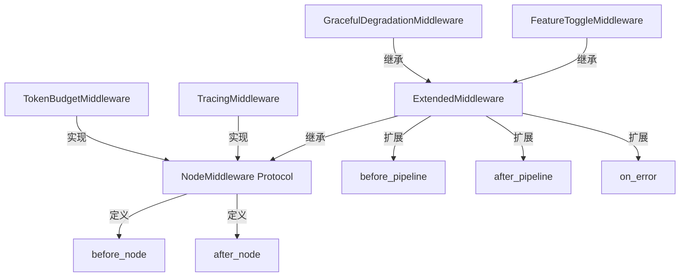
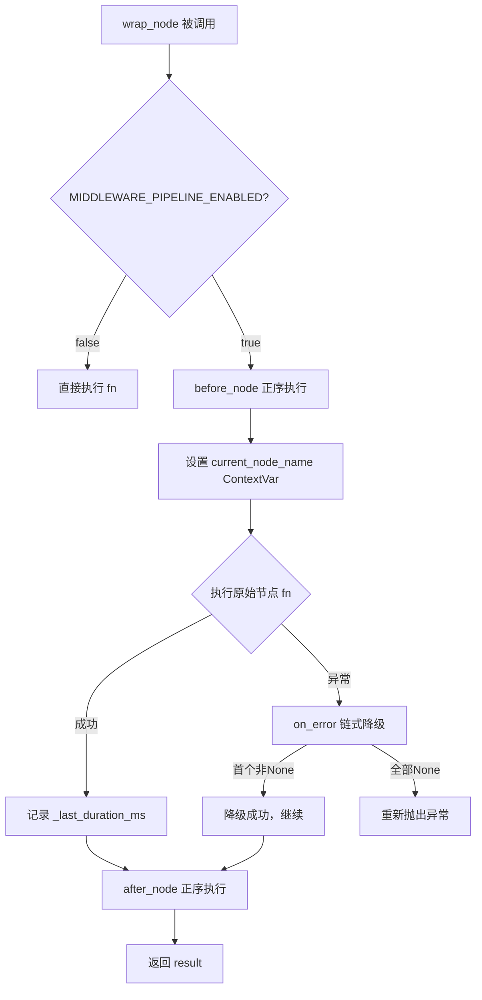
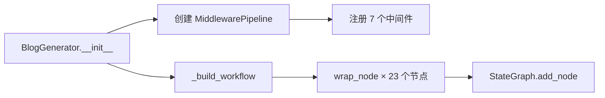

# PD-10.06 vibe-blog — MiddlewarePipeline 节点级中间件引擎

> 文档编号：PD-10.06
> 来源：vibe-blog `backend/services/blog_generator/middleware.py`
> GitHub：https://github.com/datawhalechina/vibe-blog.git
> 问题域：PD-10 中间件管道 Middleware Pipeline
> 状态：可复用方案

---

## 第 1 章 问题与动机

### 1.1 核心问题

LangGraph DAG 工作流中，每个节点（researcher、planner、writer、reviewer 等 23 个节点）都需要横切关注点：追踪、错误收集、Token 预算管理、上下文压缩、功能开关、优雅降级、状态合并、任务日志。如果在每个节点函数内部硬编码这些逻辑，会导致：

1. **代码膨胀**：每个节点函数混入大量非业务逻辑，可读性急剧下降
2. **修改扩散**：新增一个横切关注点需要修改所有 23 个节点
3. **测试困难**：横切逻辑与业务逻辑耦合，无法独立单元测试
4. **开关散落**：各节点各自实现 `_is_enabled()` 检查，风格不统一

### 1.2 vibe-blog 的解法概述

vibe-blog 实现了一个完整的节点级中间件管道引擎，核心设计：

1. **NodeMiddleware 协议**（`middleware.py:35-44`）：定义 `before_node` / `after_node` 双钩子协议，所有中间件必须实现
2. **ExtendedMiddleware 基类**（`middleware.py:47-71`）：扩展协议，增加 `before_pipeline` / `after_pipeline` / `on_error` 三个全局钩子
3. **MiddlewarePipeline 引擎**（`middleware.py:74-174`）：通过 `wrap_node()` 闭包透明包装节点函数，注入 before → execute → on_error → after 完整生命周期
4. **8 个内置中间件**：TracingMiddleware、TaskLogMiddleware、ReducerMiddleware、ErrorTrackingMiddleware、ContextManagementMiddleware、TokenBudgetMiddleware、ContextPrefetchMiddleware、FeatureToggleMiddleware + GracefulDegradationMiddleware
5. **环境变量全局开关**：每个中间件都有独立的 `XXX_ENABLED` 环境变量，`MIDDLEWARE_PIPELINE_ENABLED` 控制整个管道

### 1.3 设计思想

| 设计原则 | 具体实现 | 理由 | 替代方案 |
|----------|----------|------|----------|
| Protocol 协议而非抽象基类 | `@runtime_checkable class NodeMiddleware(Protocol)` | 鸭子类型兼容，不强制继承 | ABC 抽象基类（侵入性更强） |
| 闭包包装而非装饰器 | `wrap_node()` 返回闭包函数 | 与 LangGraph `add_node()` API 无缝集成 | Python 装饰器（需修改节点定义） |
| 状态补丁合并 | 中间件返回 `dict` 由引擎 `state.update(patch)` | 避免中间件直接修改 state 引发并发冲突 | 直接修改 state（不安全） |
| 环境变量双层开关 | 全局 `MIDDLEWARE_PIPELINE_ENABLED` + 每个中间件独立开关 | 生产环境可逐个禁用问题中间件 | 配置文件（部署不够灵活） |
| on_error 首胜策略 | 多个中间件的 `on_error` 中第一个返回非 None 的生效 | 避免多个降级策略冲突 | 全部执行后合并（复杂度高） |
| contextvars 节点追踪 | `current_node_name` ContextVar 在 wrap_node 中设置 | 异步安全，LLMService 可自动归因 token | 线程局部变量（不支持 asyncio） |

---

## 第 2 章 源码实现分析

### 2.1 架构概览

vibe-blog 的中间件管道架构分为三层：协议层、引擎层、实现层。

```
┌─────────────────────────────────────────────────────────────────┐
│                    BlogGenerator (generator.py)                  │
│  pipeline = MiddlewarePipeline(middlewares=[...])               │
│  workflow.add_node("researcher", pipeline.wrap_node("researcher", fn)) │
├─────────────────────────────────────────────────────────────────┤
│                    MiddlewarePipeline (引擎层)                   │
│  ┌──────────────┐  ┌──────────────┐  ┌──────────────┐          │
│  │run_before_   │  │  wrap_node() │  │run_after_    │          │
│  │pipeline()    │  │  闭包包装     │  │pipeline()    │          │
│  └──────────────┘  └──────────────┘  └──────────────┘          │
├─────────────────────────────────────────────────────────────────┤
│                    中间件实现层（8 个中间件）                      │
│  ┌─────────┐ ┌──────────┐ ┌─────────┐ ┌──────────────┐        │
│  │ Tracing │ │ TaskLog  │ │Reducer  │ │ErrorTracking │        │
│  └─────────┘ └──────────┘ └─────────┘ └──────────────┘        │
│  ┌──────────────┐ ┌────────────┐ ┌──────────┐ ┌────────────┐  │
│  │ContextMgmt   │ │TokenBudget │ │Prefetch  │ │FeatureToggle│  │
│  │(3-layer压缩) │ │(预算管理)   │ │(知识预取) │ │+Degradation │  │
│  └──────────────┘ └────────────┘ └──────────┘ └────────────┘  │
├─────────────────────────────────────────────────────────────────┤
│              NodeMiddleware Protocol / ExtendedMiddleware        │
│              before_node | after_node | on_error                │
│              before_pipeline | after_pipeline                   │
└─────────────────────────────────────────────────────────────────┘
```

### 2.2 核心实现

#### 2.2.1 NodeMiddleware 协议与 ExtendedMiddleware 基类



对应源码 `backend/services/blog_generator/middleware.py:34-71`：

```python
@runtime_checkable
class NodeMiddleware(Protocol):
    """节点中间件协议 — 所有中间件必须实现 before_node 和 after_node"""
    def before_node(self, state: Dict[str, Any], node_name: str) -> Optional[Dict[str, Any]]:
        ...
    def after_node(self, state: Dict[str, Any], node_name: str) -> Optional[Dict[str, Any]]:
        ...

class ExtendedMiddleware:
    """扩展中间件基类 — 支持全局钩子和错误处理"""
    def before_node(self, state, node_name): return None
    def after_node(self, state, node_name): return None
    def before_pipeline(self, state): return None
    def after_pipeline(self, state): return None
    def on_error(self, state, node_name, error): return None
```

关键设计：`NodeMiddleware` 用 `@runtime_checkable` 装饰，支持 `isinstance()` 检查但不强制继承。`ExtendedMiddleware` 提供全部钩子的默认空实现，子类只需覆盖关心的钩子。

#### 2.2.2 MiddlewarePipeline.wrap_node() 闭包引擎



对应源码 `backend/services/blog_generator/middleware.py:114-174`：

```python
def wrap_node(self, node_name: str, fn: Callable) -> Callable:
    middlewares = self.middlewares
    def wrapped(state: Dict[str, Any]) -> Dict[str, Any]:
        if os.getenv("MIDDLEWARE_PIPELINE_ENABLED", "true").lower() == "false":
            return fn(state)
        current_state = dict(state)
        # before 阶段：按注册顺序执行
        for mw in middlewares:
            try:
                patch = mw.before_node(current_state, node_name)
                if patch and isinstance(patch, dict):
                    current_state.update(patch)
            except Exception:
                logger.exception("Middleware %s.before_node failed", type(mw).__name__)
        # 执行原始节点（带 on_error 降级）
        start_time = time.time()
        token = current_node_name.set(node_name)
        try:
            result = fn(current_state)
        except Exception as e:
            for mw in middlewares:
                if hasattr(mw, "on_error"):
                    recovery = mw.on_error(current_state, node_name, e)
                    if recovery is not None:
                        current_state.update(recovery)
                        result = current_state
                        break
            else:
                raise
        finally:
            current_node_name.reset(token)
        # after 阶段
        for mw in middlewares:
            patch = mw.after_node(result, node_name)
            if patch and isinstance(patch, dict):
                result.update(patch)
        return result
    return wrapped
```

#### 2.2.3 管道组装与 23 节点包装



对应源码 `backend/services/blog_generator/generator.py:151-169`（管道组装）和 `generator.py:221-243`（节点包装）：

```python
# 管道组装（generator.py:151-169）
self.pipeline = MiddlewarePipeline(middlewares=[
    TracingMiddleware(),
    self._task_log_middleware,
    ReducerMiddleware(),
    ErrorTrackingMiddleware(),
    ContextManagementMiddleware(llm_service=llm_client, model_name=os.getenv("LLM_MODEL", "gpt-4o")),
    TokenBudgetMiddleware(compressor=getattr(self, '_context_compressor', None)),
    ContextPrefetchMiddleware(knowledge_service=knowledge_service),
])

# 节点包装（generator.py:221-243）
workflow.add_node("researcher", self.pipeline.wrap_node("researcher", self._researcher_node))
workflow.add_node("planner", self.pipeline.wrap_node("planner", self._planner_node))
workflow.add_node("writer", self.pipeline.wrap_node("writer", self._writer_node))
# ... 共 23 个节点全部通过 wrap_node 包装
```

### 2.3 实现细节

#### ReducerMiddleware 与 STATE_REDUCERS 注册表

ReducerMiddleware（`middleware.py:335-373`）解决并行节点写入同一字段的数据丢失问题。它在 `before_node` 中快照当前状态，在 `after_node` 中对比差异并用注册的 reducer 函数合并。

`schemas/reducers.py:69-78` 定义了 8 个字段的 reducer 注册表：

```python
STATE_REDUCERS: Dict[str, Callable] = {
    "search_results": merge_list_dedup,    # 去重合并
    "sections": merge_sections,            # 按 id 合并
    "images": merge_list_dedup,
    "code_blocks": merge_list_dedup,
    "section_images": merge_list_dedup,
    "key_concepts": merge_list_dedup,
    "reference_links": merge_list_dedup,
    "review_issues": merge_list_dedup,
}
```

#### ContextManagementMiddleware 三层压缩

`context_management_middleware.py:32-196` 实现三层递进压缩策略：

- **Layer 1**（usage ≥ 0.7）：SemanticCompressor embedding 筛选，快速低成本
- **Layer 2**（usage ≥ 0.9）：LLM 主动压缩（AgentFold 式），精准中成本
- **Layer 3**（usage ≥ 0.9 且有多上下文源）：全量摘要替换（ReSum 式），兜底高成本

每层失败自动降级到上一层，形成 L3 → L2 → L1 的降级链。

#### FeatureToggleMiddleware 声明式开关

`middleware.py:380-421` 通过 `TOGGLE_MAP` 字典声明式定义 7 个可选节点的双开关（环境变量 + StyleProfile 属性），在 `before_node` 中检查，不满足条件时设置 `_skip_node=True` 标记。

#### GracefulDegradationMiddleware 白名单降级

`middleware.py:428-457` 通过 `DEGRADABLE_NODES` 白名单定义 7 个可降级节点及其默认返回值，在 `on_error` 中检查节点是否在白名单中，是则返回默认值，否则继续抛出。

---

## 第 3 章 迁移指南

### 3.1 迁移清单

**阶段 1：核心引擎（1 个文件）**
- [ ] 复制 `NodeMiddleware` Protocol 和 `ExtendedMiddleware` 基类
- [ ] 复制 `MiddlewarePipeline` 类（含 `wrap_node`、`run_before_pipeline`、`run_after_pipeline`）
- [ ] 添加 `current_node_name` ContextVar（可选，用于 LLM 调用归因）

**阶段 2：基础中间件（按需选择）**
- [ ] TracingMiddleware — 如果需要分布式追踪
- [ ] ErrorTrackingMiddleware — 如果需要错误收集
- [ ] TaskLogMiddleware — 如果需要步骤级耗时日志
- [ ] ReducerMiddleware + STATE_REDUCERS — 如果有并行节点写入同一字段

**阶段 3：高级中间件（按需选择）**
- [ ] TokenBudgetMiddleware — 如果需要 Token 预算管理
- [ ] ContextManagementMiddleware — 如果需要上下文压缩（依赖 ContextGuard）
- [ ] FeatureToggleMiddleware — 如果有可选节点需要动态开关
- [ ] GracefulDegradationMiddleware — 如果有可降级节点

**阶段 4：集成**
- [ ] 在工作流构建器中用 `pipeline.wrap_node()` 包装所有节点
- [ ] 在工作流入口调用 `run_before_pipeline()`，出口调用 `run_after_pipeline()`

### 3.2 适配代码模板

以下是一个最小可运行的中间件管道模板，可直接复制到任何 LangGraph 项目：

```python
"""最小中间件管道 — 可直接复制使用"""
from __future__ import annotations
import logging
import os
import time
from typing import Any, Callable, Dict, List, Optional, Protocol, runtime_checkable

logger = logging.getLogger(__name__)


@runtime_checkable
class NodeMiddleware(Protocol):
    def before_node(self, state: Dict[str, Any], node_name: str) -> Optional[Dict[str, Any]]: ...
    def after_node(self, state: Dict[str, Any], node_name: str) -> Optional[Dict[str, Any]]: ...


class ExtendedMiddleware:
    def before_node(self, state, node_name): return None
    def after_node(self, state, node_name): return None
    def before_pipeline(self, state): return None
    def after_pipeline(self, state): return None
    def on_error(self, state, node_name, error): return None


class MiddlewarePipeline:
    def __init__(self, middlewares: Optional[List[Any]] = None):
        self.middlewares: List[Any] = middlewares or []

    def wrap_node(self, node_name: str, fn: Callable) -> Callable:
        middlewares = self.middlewares
        def wrapped(state: Dict[str, Any]) -> Dict[str, Any]:
            current_state = dict(state)
            for mw in middlewares:
                try:
                    patch = mw.before_node(current_state, node_name)
                    if patch and isinstance(patch, dict):
                        current_state.update(patch)
                except Exception:
                    logger.exception("before_node failed: %s", type(mw).__name__)
            start = time.time()
            try:
                result = fn(current_state)
            except Exception as e:
                for mw in middlewares:
                    if hasattr(mw, "on_error"):
                        try:
                            recovery = mw.on_error(current_state, node_name, e)
                            if recovery is not None:
                                return {**current_state, **recovery}
                        except Exception:
                            pass
                raise
            if isinstance(result, dict):
                result["_last_duration_ms"] = int((time.time() - start) * 1000)
            for mw in middlewares:
                try:
                    patch = mw.after_node(result, node_name)
                    if patch and isinstance(patch, dict):
                        result.update(patch)
                except Exception:
                    logger.exception("after_node failed: %s", type(mw).__name__)
            return result
        return wrapped

    def run_before_pipeline(self, state):
        for mw in self.middlewares:
            if hasattr(mw, "before_pipeline"):
                try:
                    patch = mw.before_pipeline(state)
                    if patch and isinstance(patch, dict):
                        state.update(patch)
                except Exception:
                    pass
        return state

    def run_after_pipeline(self, state):
        for mw in reversed(self.middlewares):
            if hasattr(mw, "after_pipeline"):
                try:
                    patch = mw.after_pipeline(state)
                    if patch and isinstance(patch, dict):
                        state.update(patch)
                except Exception:
                    pass
        return state


# 使用示例
class TimingMiddleware:
    """示例：记录每个节点耗时"""
    def before_node(self, state, node_name):
        return {"_node_start": time.time()}
    def after_node(self, state, node_name):
        start = state.get("_node_start", 0)
        if start:
            logger.info("[%s] took %dms", node_name, (time.time() - start) * 1000)
        return None


# 集成到 LangGraph
# pipeline = MiddlewarePipeline([TimingMiddleware()])
# workflow.add_node("researcher", pipeline.wrap_node("researcher", researcher_fn))
```

### 3.3 适用场景

| 场景 | 适用度 | 说明 |
|------|--------|------|
| LangGraph DAG 工作流 | ⭐⭐⭐ | 原生设计目标，wrap_node 与 add_node 无缝集成 |
| CrewAI / AutoGen 多 Agent | ⭐⭐ | 需适配各框架的节点执行入口 |
| 单 Agent 多步骤流程 | ⭐⭐⭐ | 每个步骤视为一个节点即可 |
| 纯函数管道（无 LLM） | ⭐⭐ | 可用但 on_error 降级价值较低 |
| 实时流式场景 | ⭐ | 当前实现是同步的，需改造为 async |

---

## 第 4 章 测试用例

基于 `tests/unit/test_middleware_pipeline.py` 的真实测试模式，以下是核心测试用例：

```python
"""中间件管道核心测试 — 基于 vibe-blog 真实测试模式"""
import time
import pytest


class RecordingMiddleware:
    """记录所有钩子调用顺序的测试辅助中间件"""
    def __init__(self, tag, log):
        self.tag = tag
        self.log = log
    def before_pipeline(self, state):
        self.log.append(f"{self.tag}.before_pipeline")
        return None
    def after_pipeline(self, state):
        self.log.append(f"{self.tag}.after_pipeline")
        return None
    def before_node(self, state, node_name):
        self.log.append(f"{self.tag}.before_node({node_name})")
        return None
    def after_node(self, state, node_name):
        self.log.append(f"{self.tag}.after_node({node_name})")
        return None


class TestMiddlewarePipeline:
    def test_full_lifecycle_order(self):
        """验证完整生命周期：before_pipeline → before_node → fn → after_node → after_pipeline"""
        log = []
        p = MiddlewarePipeline([RecordingMiddleware("MW", log)])
        state = p.run_before_pipeline({"topic": "test"})
        node = p.wrap_node("researcher", lambda s: s)
        state = node(state)
        state = p.run_after_pipeline(state)
        assert log == [
            "MW.before_pipeline",
            "MW.before_node(researcher)",
            "MW.after_node(researcher)",
            "MW.after_pipeline",
        ]

    def test_before_pipeline_forward_after_pipeline_reverse(self):
        """before_pipeline 正序执行，after_pipeline 逆序执行"""
        log = []
        p = MiddlewarePipeline([RecordingMiddleware("A", log), RecordingMiddleware("B", log)])
        p.run_before_pipeline({})
        assert log == ["A.before_pipeline", "B.before_pipeline"]
        log.clear()
        p.run_after_pipeline({})
        assert log == ["B.after_pipeline", "A.after_pipeline"]

    def test_state_patch_merge(self):
        """中间件返回 dict 被合并到 state"""
        class Injector:
            def before_node(self, state, node_name):
                return {"injected": True}
            def after_node(self, state, node_name):
                return None
        p = MiddlewarePipeline([Injector()])
        wrapped = p.wrap_node("test", lambda s: s)
        result = wrapped({"topic": "hello"})
        assert result["injected"] is True
        assert result["topic"] == "hello"

    def test_on_error_first_recovery_wins(self):
        """on_error 首胜策略：第一个返回非 None 的中间件生效"""
        class R1:
            def before_node(self, s, n): return None
            def after_node(self, s, n): return None
            def on_error(self, s, n, e): return {"by": "first"}
        class R2:
            def before_node(self, s, n): return None
            def after_node(self, s, n): return None
            def on_error(self, s, n, e): return {"by": "second"}
        p = MiddlewarePipeline([R1(), R2()])
        wrapped = p.wrap_node("x", lambda s: (_ for _ in ()).throw(RuntimeError()))
        assert wrapped({})["by"] == "first"

    def test_unhandled_error_propagates(self):
        """无中间件处理的异常继续抛出"""
        p = MiddlewarePipeline([])
        wrapped = p.wrap_node("x", lambda s: (_ for _ in ()).throw(ValueError("critical")))
        with pytest.raises(ValueError, match="critical"):
            wrapped({})

    def test_middleware_exception_isolated(self):
        """中间件自身异常不影响主流程"""
        class Crasher:
            def before_node(self, s, n): raise RuntimeError("boom")
            def after_node(self, s, n): return None
        p = MiddlewarePipeline([Crasher()])
        wrapped = p.wrap_node("test", lambda s: {**s, "ok": True})
        result = wrapped({"topic": "test"})
        assert result["ok"] is True

    def test_duration_tracking(self):
        """wrap_node 自动记录节点执行耗时"""
        p = MiddlewarePipeline([])
        wrapped = p.wrap_node("slow", lambda s: (time.sleep(0.05) or s))
        result = wrapped({})
        assert result.get("_last_duration_ms", 0) >= 40
```

---

## 第 5 章 跨域关联

| 关联域 | 关系类型 | 说明 |
|--------|----------|------|
| PD-01 上下文管理 | 协同 | ContextManagementMiddleware 三层压缩策略直接服务于上下文窗口管理，TokenBudgetMiddleware 在预算超 80% 时触发压缩 |
| PD-02 多 Agent 编排 | 依赖 | MiddlewarePipeline 依附于 LangGraph StateGraph 编排框架，wrap_node 是对 DAG 节点的透明增强 |
| PD-03 容错与重试 | 协同 | GracefulDegradationMiddleware 实现节点级优雅降级，on_error 钩子是容错的核心机制 |
| PD-04 工具系统 | 协同 | FeatureToggleMiddleware 通过 TOGGLE_MAP 声明式管理可选节点的开关，类似工具注册表模式 |
| PD-07 质量检查 | 协同 | ErrorTrackingMiddleware 收集节点错误到 error_history，为质量检查提供数据源 |
| PD-08 搜索与检索 | 协同 | ContextPrefetchMiddleware 在 researcher 节点前并行预取知识库文档，ReducerMiddleware 合并并行搜索结果 |
| PD-11 可观测性 | 协同 | TracingMiddleware 注入 trace_id，TaskLogMiddleware 记录步骤级耗时，两者共同构成可观测性基础 |

---

## 第 6 章 来源文件索引

| 文件 | 行范围 | 关键实现 |
|------|--------|----------|
| `backend/services/blog_generator/middleware.py` | L34-44 | NodeMiddleware Protocol 定义 |
| `backend/services/blog_generator/middleware.py` | L47-71 | ExtendedMiddleware 基类（5 个钩子） |
| `backend/services/blog_generator/middleware.py` | L74-174 | MiddlewarePipeline 引擎（wrap_node 闭包） |
| `backend/services/blog_generator/middleware.py` | L180-201 | TracingMiddleware（ContextVar 追踪） |
| `backend/services/blog_generator/middleware.py` | L206-223 | ErrorTrackingMiddleware（错误收集） |
| `backend/services/blog_generator/middleware.py` | L229-278 | TokenBudgetMiddleware（预算管理 + 压缩触发） |
| `backend/services/blog_generator/middleware.py` | L284-329 | ContextPrefetchMiddleware（知识预取） |
| `backend/services/blog_generator/middleware.py` | L335-373 | ReducerMiddleware（状态合并） |
| `backend/services/blog_generator/middleware.py` | L376-421 | FeatureToggleMiddleware（声明式开关） |
| `backend/services/blog_generator/middleware.py` | L424-457 | GracefulDegradationMiddleware（白名单降级） |
| `backend/services/blog_generator/middleware.py` | L463-492 | TaskLogMiddleware（步骤级耗时日志） |
| `backend/services/blog_generator/context_management_middleware.py` | L32-196 | ContextManagementMiddleware（三层压缩） |
| `backend/services/blog_generator/schemas/reducers.py` | L16-78 | STATE_REDUCERS 注册表 + merge 函数 |
| `backend/utils/context_guard.py` | L45-76 | estimate_tokens（tiktoken + 字符降级） |
| `backend/utils/context_guard.py` | L104-232 | ContextGuard（上下文守卫 + 智能裁剪） |
| `backend/services/blog_generator/generator.py` | L151-169 | 管道组装（7 个中间件注册顺序） |
| `backend/services/blog_generator/generator.py` | L221-243 | 23 个节点通过 wrap_node 包装 |
| `tests/unit/test_middleware_pipeline.py` | L1-235 | 完整单元测试（6 个测试类 20+ 用例） |

---

## 第 7 章 横向对比维度

```json comparison_data
{
  "project": "vibe-blog",
  "dimensions": {
    "中间件基类": "NodeMiddleware Protocol + ExtendedMiddleware 双层设计",
    "钩子点": "before/after_node + before/after_pipeline + on_error 共 5 个",
    "中间件数量": "8 个内置 + ContextManagementMiddleware 共 9 个",
    "条件激活": "每个中间件独立环境变量开关 + 全局 MIDDLEWARE_PIPELINE_ENABLED",
    "状态管理": "patch dict 返回由引擎 update 合并，ReducerMiddleware 处理并行冲突",
    "执行模型": "同步闭包包装，before 正序 / after_pipeline 逆序",
    "错误隔离": "中间件异常 try/except 隔离，不影响主流程和其他中间件",
    "成本预算控制": "TokenBudgetMiddleware 按节点权重分配预算，超 80% 触发压缩",
    "可观测性": "TracingMiddleware ContextVar + TaskLogMiddleware 步骤级耗时",
    "数据传递": "state dict 贯穿全链，中间件通过 _前缀字段传递元数据",
    "装饰器包装": "wrap_node 闭包而非 Python 装饰器，适配 LangGraph add_node API"
  }
}
```

### 域元数据补充

```json domain_metadata
{
  "solution_summary": "vibe-blog 用 NodeMiddleware Protocol + MiddlewarePipeline.wrap_node() 闭包透明包装 23 个 LangGraph 节点，内置 9 个中间件覆盖追踪/预算/压缩/降级/开关/合并",
  "description": "节点级闭包包装模式：中间件不修改节点代码，通过 wrap_node 闭包注入生命周期钩子",
  "sub_problems": [
    "节点预算权重分配：不同节点按角色分配 Token 预算比例的策略",
    "三层递进压缩：embedding筛选→LLM压缩→全量摘要的分层降级压缩",
    "并行节点状态合并：多节点并行写入同一字段时的 reducer 注册表模式",
    "声明式功能开关：环境变量+StyleProfile 双开关的 TOGGLE_MAP 声明式管理"
  ],
  "best_practices": [
    "Protocol 协议优于抽象基类：用 @runtime_checkable Protocol 定义中间件接口，不强制继承",
    "on_error 首胜策略：多个降级中间件中第一个返回非 None 的生效，避免冲突",
    "环境变量双层开关：全局开关 + 每个中间件独立开关，生产环境可逐个禁用",
    "闭包包装而非装饰器：wrap_node 返回闭包适配框架 API，不侵入节点定义"
  ]
}
```
