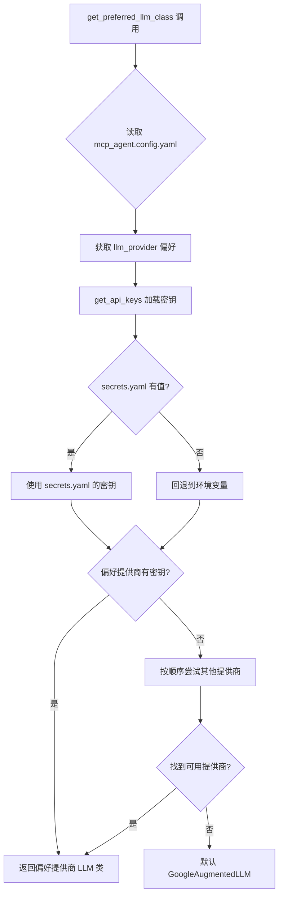
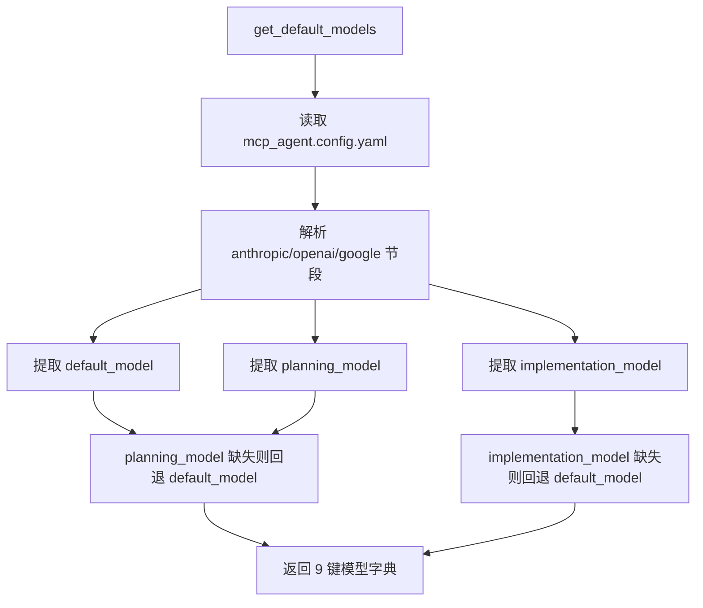
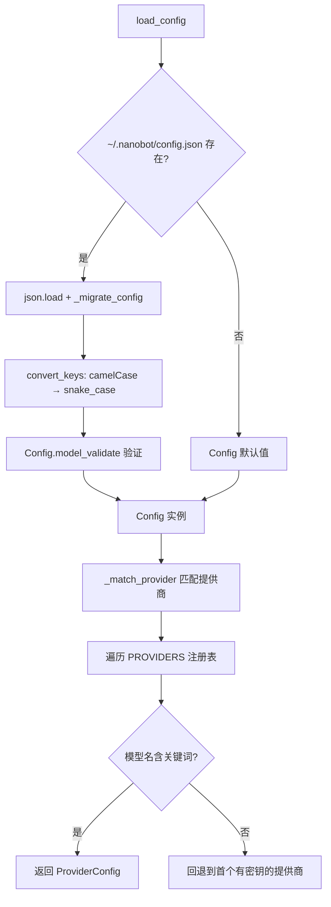

# PD-100.01 DeepCode — 双轨 YAML 配置驱动架构

> 文档编号：PD-100.01
> 来源：DeepCode `mcp_agent.config.yaml` `nanobot/nanobot/config/schema.py` `utils/llm_utils.py`
> GitHub：https://github.com/HKUDS/DeepCode.git
> 问题域：PD-100 配置驱动架构 Config-Driven Architecture
> 状态：可复用方案

---

## 第 1 章 问题与动机

### 1.1 核心问题

Agent 系统通常需要管理大量运行时参数：LLM 提供商选择、模型名称、token 限制、MCP 服务器定义、文档分段阈值、日志级别等。这些参数散落在代码各处会导致：

- 切换 LLM 提供商需要改代码，而非改配置
- 不同部署环境（开发/生产/CI）无法灵活切换参数
- API 密钥硬编码在代码中，存在安全风险
- 新增提供商需要修改多处代码，扩展性差

DeepCode 面临的特殊挑战是它同时包含两个独立子系统——MCP Agent 工作流引擎和 Nanobot 多通道聊天机器人——两者都需要配置管理，但配置格式、加载方式、验证策略完全不同。

### 1.2 DeepCode 的解法概述

DeepCode 采用**双轨配置架构**，两套独立的配置系统分别服务不同子系统：

1. **MCP Agent 轨**：YAML 配置 + 函数式工具加载（`mcp_agent.config.yaml` + `utils/llm_utils.py:13-438`），面向科研工作流，管理 LLM 提供商优先级、token 限制、MCP 服务器定义、文档分段策略
2. **Nanobot 轨**：JSON 配置 + Pydantic BaseSettings 验证（`nanobot/nanobot/config/schema.py:212-280` + `loader.py:22-44`），面向多通道聊天，管理 8 种消息通道、11 个 LLM 提供商、Agent 默认参数
3. **密钥分离**：`mcp_agent.secrets.yaml` 独立存放 API 密钥，配置文件优先于环境变量（`llm_utils.py:13-54`）
4. **Provider Registry**：冻结 dataclass 元组作为提供商注册表，模型名关键词自动匹配提供商（`nanobot/nanobot/providers/registry.py:19-56`）
5. **阶段特化模型**：同一提供商可为 planning 和 implementation 阶段配置不同模型（`llm_utils.py:214-293`）

### 1.3 设计思想

| 设计原则 | 具体实现 | 理由 | 替代方案 |
|----------|----------|------|----------|
| 配置与密钥分离 | config.yaml 放参数，secrets.yaml 放密钥 | 密钥文件可 gitignore，配置文件可提交 | 全部放环境变量（不直观） |
| 文件优先，环境变量兜底 | secrets.yaml > env vars 的优先级链 | 本地开发用文件，CI/CD 用环境变量 | 只用环境变量（无法管理复杂嵌套） |
| 双轨独立配置 | MCP Agent 用 YAML+函数，Nanobot 用 JSON+Pydantic | 两个子系统生命周期不同，解耦演进 | 统一配置系统（耦合过紧） |
| 注册表驱动提供商匹配 | ProviderSpec 冻结 dataclass + 关键词匹配 | 新增提供商只需加一条注册表记录 | if-else 链（难维护） |
| 阶段特化模型选择 | planning_model / implementation_model 分开配置 | 规划用强模型，实现用快模型，平衡成本 | 全局统一模型（浪费或不足） |

---

## 第 2 章 源码实现分析

### 2.1 架构概览

DeepCode 的配置系统由两条独立管线组成，分别服务 MCP Agent 工作流和 Nanobot 聊天系统：

```
┌─────────────────────────────────────────────────────────────────┐
│                    DeepCode 双轨配置架构                         │
├─────────────────────────┬───────────────────────────────────────┤
│   MCP Agent 轨          │   Nanobot 轨                          │
│                         │                                       │
│ mcp_agent.config.yaml   │ ~/.nanobot/config.json                │
│ mcp_agent.secrets.yaml  │ (camelCase ↔ snake_case 自动转换)      │
│         │               │         │                             │
│    yaml.safe_load()     │   json.load() + _migrate_config()     │
│         │               │         │                             │
│  llm_utils.py 函数集     │   Config(BaseSettings) Pydantic 验证  │
│  ├─ get_api_keys()      │   ├─ agents: AgentsConfig             │
│  ├─ get_preferred_llm() │   ├─ channels: ChannelsConfig (8种)   │
│  ├─ get_default_models()│   ├─ providers: ProvidersConfig (11个) │
│  ├─ get_token_limits()  │   ├─ gateway: GatewayConfig           │
│  └─ get_doc_seg_config()│   └─ tools: ToolsConfig               │
│         │               │         │                             │
│  agent_orchestration_   │   _match_provider() 关键词匹配         │
│  engine.py 消费配置      │   ProviderRegistry 注册表驱动          │
└─────────────────────────┴───────────────────────────────────────┘
```

### 2.2 核心实现

#### 2.2.1 MCP Agent 轨：密钥加载与提供商选择



对应源码 `utils/llm_utils.py:13-54`（密钥加载核心）：

```python
def get_api_keys(secrets_path: str = "mcp_agent.secrets.yaml") -> Dict[str, str]:
    """
    Get API keys from secrets file, with environment variables as fallback.
    Priority: secrets file > environment variables
    """
    secrets = {}
    if os.path.exists(secrets_path):
        with open(secrets_path, "r", encoding="utf-8") as f:
            secrets = yaml.safe_load(f) or {}

    # Config file takes priority, env vars are fallback only
    return {
        "google": (
            secrets.get("google", {}).get("api_key", "")
            or os.environ.get("GOOGLE_API_KEY")
            or os.environ.get("GEMINI_API_KEY")
            or ""
        ).strip(),
        "anthropic": (
            secrets.get("anthropic", {}).get("api_key", "")
            or os.environ.get("ANTHROPIC_API_KEY")
            or ""
        ).strip(),
        "openai": (
            secrets.get("openai", {}).get("api_key", "")
            or os.environ.get("OPENAI_API_KEY")
            or ""
        ).strip(),
    }
```

提供商选择逻辑 `utils/llm_utils.py:109-171`（懒加载 + 优先级回退）：

```python
def get_preferred_llm_class(config_path: str = "mcp_agent.secrets.yaml") -> Type[Any]:
    """
    Select the LLM class based on user preference and API key availability.
    Priority: 1. config preference  2. verify key exists  3. fallback
    """
    try:
        keys = get_api_keys(config_path)
        # Read user preference from main config
        secrets_dir = os.path.dirname(os.path.abspath(config_path))
        main_config_path = os.path.join(secrets_dir, "mcp_agent.config.yaml")
        preferred_provider = None
        if os.path.exists(main_config_path):
            with open(main_config_path, "r", encoding="utf-8") as f:
                main_config = yaml.safe_load(f)
                preferred_provider = main_config.get("llm_provider", "").strip().lower()

        provider_keys = {
            "anthropic": (anthropic_key, "AnthropicAugmentedLLM"),
            "google": (google_key, "GoogleAugmentedLLM"),
            "openai": (openai_key, "OpenAIAugmentedLLM"),
        }
        # Try user's preferred provider first
        if preferred_provider and preferred_provider in provider_keys:
            api_key, class_name = provider_keys[preferred_provider]
            if api_key:
                return _get_llm_class(preferred_provider)
        # Fallback: try providers in order of availability
        for provider, (api_key, class_name) in provider_keys.items():
            if api_key:
                return _get_llm_class(provider)
        return _get_llm_class("google")  # ultimate fallback
    except Exception as e:
        return _get_llm_class("google")
```

#### 2.2.2 阶段特化模型配置



对应源码 `utils/llm_utils.py:214-293`：

```python
def get_default_models(config_path: str = "mcp_agent.config.yaml"):
    """Get default models from configuration file."""
    if os.path.exists(config_path):
        with open(config_path, "r", encoding="utf-8") as f:
            config = yaml.safe_load(f)
        # Handle null values in config sections
        google_config = config.get("google") or {}
        google_model = google_config.get("default_model", "gemini-2.0-flash")
        # Phase-specific models (fall back to default if not specified)
        google_planning = google_config.get("planning_model", google_model)
        google_implementation = google_config.get("implementation_model", google_model)
        return {
            "google": google_model,
            "google_planning": google_planning,
            "google_implementation": google_implementation,
            # ... anthropic, openai 同理
        }
```

#### 2.2.3 Nanobot 轨：Pydantic BaseSettings + Provider Registry



对应源码 `nanobot/nanobot/config/schema.py:212-280`（根配置类）：

```python
class Config(BaseSettings):
    """Root configuration for nanobot."""
    agents: AgentsConfig = Field(default_factory=AgentsConfig)
    channels: ChannelsConfig = Field(default_factory=ChannelsConfig)
    providers: ProvidersConfig = Field(default_factory=ProvidersConfig)
    gateway: GatewayConfig = Field(default_factory=GatewayConfig)
    tools: ToolsConfig = Field(default_factory=ToolsConfig)

    def _match_provider(self, model: str | None = None) -> tuple:
        """Match provider config and its registry name."""
        from nanobot.providers.registry import PROVIDERS
        model_lower = (model or self.agents.defaults.model).lower()
        # Match by keyword (order follows PROVIDERS registry)
        for spec in PROVIDERS:
            p = getattr(self.providers, spec.name, None)
            if p and any(kw in model_lower for kw in spec.keywords) and p.api_key:
                return p, spec.name
        # Fallback: gateways first, then others
        for spec in PROVIDERS:
            p = getattr(self.providers, spec.name, None)
            if p and p.api_key:
                return p, spec.name
        return None, None

    class Config:
        env_prefix = "NANOBOT_"
        env_nested_delimiter = "__"
```

Provider Registry `nanobot/nanobot/providers/registry.py:19-56`（冻结 dataclass 元数据）：

```python
@dataclass(frozen=True)
class ProviderSpec:
    """One LLM provider's metadata."""
    name: str                          # config field name, e.g. "dashscope"
    keywords: tuple[str, ...]          # model-name keywords for matching
    env_key: str                       # LiteLLM env var
    display_name: str = ""
    litellm_prefix: str = ""           # model prefix for LiteLLM routing
    skip_prefixes: tuple[str, ...] = ()
    is_gateway: bool = False           # routes any model (OpenRouter, AiHubMix)
    is_local: bool = False             # local deployment (vLLM)
    detect_by_key_prefix: str = ""     # match api_key prefix, e.g. "sk-or-"
    detect_by_base_keyword: str = ""   # match substring in api_base URL
    default_api_base: str = ""
    strip_model_prefix: bool = False
    model_overrides: tuple[tuple[str, dict], ...] = ()
```

### 2.3 实现细节

**配置迁移机制**：Nanobot 的 `loader.py:66-73` 包含 `_migrate_config()` 函数，处理配置格式变更（如 `tools.exec.restrictToWorkspace` 迁移到 `tools.restrictToWorkspace`），确保旧配置文件向前兼容。

**camelCase ↔ snake_case 自动转换**：JSON 配置文件使用 camelCase（前端友好），Python 代码使用 snake_case（PEP 8），`loader.py:76-107` 的 `convert_keys()` / `convert_to_camel()` 在加载和保存时自动转换。

**Gateway 自动检测**：`registry.py:284-312` 的 `find_gateway()` 通过 API key 前缀（如 `sk-or-` 识别 OpenRouter）和 api_base URL 关键词（如 `aihubmix`）自动检测网关提供商，无需用户显式指定。

**文档分段自适应**：`llm_utils.py:296-403` 根据配置中的 `document_segmentation.enabled` 和 `size_threshold_chars` 动态决定是否启用文档分段，并据此切换 MCP 服务器和 prompt 版本。


---

## 第 3 章 迁移指南

### 3.1 迁移清单

**阶段 1：基础配置加载（1 个文件）**
- [ ] 创建 YAML 配置文件，定义 LLM 提供商、模型、token 限制
- [ ] 实现 `get_api_keys()` 函数：secrets 文件优先，环境变量兜底
- [ ] 实现 `get_preferred_llm_class()` 函数：偏好 → 可用 → 默认 三级回退

**阶段 2：Provider Registry（2 个文件）**
- [ ] 定义 `ProviderSpec` 冻结 dataclass，包含 name/keywords/env_key/litellm_prefix
- [ ] 创建 PROVIDERS 元组注册表，按优先级排列（网关优先）
- [ ] 实现 `find_by_model()` / `find_gateway()` 查找函数

**阶段 3：Pydantic 配置验证（可选，适合复杂系统）**
- [ ] 用 Pydantic BaseSettings 定义根配置类
- [ ] 设置 `env_prefix` 和 `env_nested_delimiter` 支持环境变量覆盖
- [ ] 实现 camelCase ↔ snake_case 自动转换（如需 JSON 配置）

**阶段 4：阶段特化模型（可选）**
- [ ] 在配置中为每个提供商添加 `planning_model` / `implementation_model`
- [ ] 实现 `get_default_models()` 函数，缺失时回退到 `default_model`

### 3.2 适配代码模板

#### 最小可用版本：YAML 配置 + 密钥分离 + 提供商选择

```python
"""config_loader.py — 可直接复用的配置加载模块"""
import os
from pathlib import Path
from typing import Any, Dict, Tuple
import yaml


def load_secrets(secrets_path: str = "secrets.yaml") -> Dict[str, str]:
    """加载 API 密钥，secrets 文件优先，环境变量兜底。"""
    secrets = {}
    if os.path.exists(secrets_path):
        with open(secrets_path, "r", encoding="utf-8") as f:
            secrets = yaml.safe_load(f) or {}

    return {
        "openai": (
            secrets.get("openai", {}).get("api_key", "")
            or os.environ.get("OPENAI_API_KEY", "")
        ).strip(),
        "anthropic": (
            secrets.get("anthropic", {}).get("api_key", "")
            or os.environ.get("ANTHROPIC_API_KEY", "")
        ).strip(),
        "google": (
            secrets.get("google", {}).get("api_key", "")
            or os.environ.get("GOOGLE_API_KEY", "")
        ).strip(),
    }


def load_config(config_path: str = "config.yaml") -> Dict[str, Any]:
    """加载主配置文件。"""
    if os.path.exists(config_path):
        with open(config_path, "r", encoding="utf-8") as f:
            return yaml.safe_load(f) or {}
    return {}


def get_preferred_provider(
    config_path: str = "config.yaml",
    secrets_path: str = "secrets.yaml",
) -> Tuple[str, str]:
    """返回 (provider_name, api_key)，三级回退：偏好 → 可用 → 默认。"""
    config = load_config(config_path)
    keys = load_secrets(secrets_path)
    preferred = config.get("llm_provider", "").strip().lower()

    # 1. 尝试用户偏好
    if preferred and preferred in keys and keys[preferred]:
        return preferred, keys[preferred]

    # 2. 按顺序找第一个有密钥的
    for provider, key in keys.items():
        if key:
            return provider, key

    # 3. 默认
    return "openai", ""


def get_phase_models(config_path: str = "config.yaml") -> Dict[str, str]:
    """获取阶段特化模型配置，缺失时回退到 default_model。"""
    config = load_config(config_path)
    result = {}
    for provider in ("openai", "anthropic", "google"):
        section = config.get(provider) or {}
        default = section.get("default_model", "")
        result[f"{provider}_planning"] = section.get("planning_model", default)
        result[f"{provider}_implementation"] = section.get("implementation_model", default)
    return result
```

#### Provider Registry 模板

```python
"""provider_registry.py — 可直接复用的提供商注册表"""
from dataclasses import dataclass


@dataclass(frozen=True)
class ProviderSpec:
    name: str
    keywords: tuple[str, ...]
    env_key: str
    litellm_prefix: str = ""
    is_gateway: bool = False
    default_api_base: str = ""


PROVIDERS: tuple[ProviderSpec, ...] = (
    ProviderSpec(
        name="openrouter", keywords=("openrouter",),
        env_key="OPENROUTER_API_KEY", litellm_prefix="openrouter",
        is_gateway=True, default_api_base="https://openrouter.ai/api/v1",
    ),
    ProviderSpec(
        name="anthropic", keywords=("anthropic", "claude"),
        env_key="ANTHROPIC_API_KEY",
    ),
    ProviderSpec(
        name="openai", keywords=("openai", "gpt"),
        env_key="OPENAI_API_KEY",
    ),
    ProviderSpec(
        name="google", keywords=("gemini",),
        env_key="GEMINI_API_KEY", litellm_prefix="gemini",
    ),
)


def find_by_model(model: str) -> ProviderSpec | None:
    model_lower = model.lower()
    for spec in PROVIDERS:
        if not spec.is_gateway and any(kw in model_lower for kw in spec.keywords):
            return spec
    return None
```

### 3.3 适用场景

| 场景 | 适用度 | 说明 |
|------|--------|------|
| 多 LLM 提供商切换 | ⭐⭐⭐ | 核心场景，配置一改即切换，无需改代码 |
| 科研工作流（规划+实现分阶段） | ⭐⭐⭐ | planning_model / implementation_model 分离，成本可控 |
| 多通道聊天机器人 | ⭐⭐⭐ | Pydantic 嵌套模型完美匹配 8 种通道的复杂配置 |
| 单一 LLM 的简单 Agent | ⭐ | 过度设计，直接用环境变量即可 |
| 需要运行时热加载配置 | ⭐⭐ | DeepCode 不支持热加载，需自行扩展 |

---

## 第 4 章 测试用例

```python
"""test_config_driven.py — 基于 DeepCode 真实函数签名的测试"""
import os
import tempfile
import pytest
import yaml


class TestGetApiKeys:
    """测试 get_api_keys() 的优先级链"""

    def test_secrets_file_priority(self, tmp_path):
        """secrets 文件优先于环境变量"""
        secrets_file = tmp_path / "secrets.yaml"
        secrets_file.write_text(yaml.dump({
            "openai": {"api_key": "sk-from-file"},
            "anthropic": {"api_key": ""},
        }))
        os.environ["OPENAI_API_KEY"] = "sk-from-env"
        os.environ["ANTHROPIC_API_KEY"] = "ak-from-env"

        from utils.llm_utils import get_api_keys
        keys = get_api_keys(str(secrets_file))

        assert keys["openai"] == "sk-from-file"      # 文件优先
        assert keys["anthropic"] == "ak-from-env"     # 文件为空，回退环境变量

        del os.environ["OPENAI_API_KEY"]
        del os.environ["ANTHROPIC_API_KEY"]

    def test_missing_secrets_file(self):
        """secrets 文件不存在时回退到环境变量"""
        os.environ["GOOGLE_API_KEY"] = "gk-test"
        from utils.llm_utils import get_api_keys
        keys = get_api_keys("/nonexistent/path.yaml")
        assert keys["google"] == "gk-test"
        del os.environ["GOOGLE_API_KEY"]

    def test_no_keys_returns_empty(self):
        """无任何密钥时返回空字符串"""
        for var in ("OPENAI_API_KEY", "ANTHROPIC_API_KEY", "GOOGLE_API_KEY", "GEMINI_API_KEY"):
            os.environ.pop(var, None)
        from utils.llm_utils import get_api_keys
        keys = get_api_keys("/nonexistent/path.yaml")
        assert all(v == "" for v in keys.values())


class TestGetDefaultModels:
    """测试阶段特化模型配置"""

    def test_phase_specific_models(self, tmp_path):
        """planning_model 和 implementation_model 独立配置"""
        config_file = tmp_path / "config.yaml"
        config_file.write_text(yaml.dump({
            "google": {
                "default_model": "gemini-2.0-flash",
                "planning_model": "gemini-3-pro-preview",
                "implementation_model": "gemini-2.5-flash",
            }
        }))
        from utils.llm_utils import get_default_models
        models = get_default_models(str(config_file))
        assert models["google"] == "gemini-2.0-flash"
        assert models["google_planning"] == "gemini-3-pro-preview"
        assert models["google_implementation"] == "gemini-2.5-flash"

    def test_fallback_to_default(self, tmp_path):
        """缺少 planning_model 时回退到 default_model"""
        config_file = tmp_path / "config.yaml"
        config_file.write_text(yaml.dump({
            "google": {"default_model": "gemini-2.0-flash"}
        }))
        from utils.llm_utils import get_default_models
        models = get_default_models(str(config_file))
        assert models["google_planning"] == "gemini-2.0-flash"
        assert models["google_implementation"] == "gemini-2.0-flash"


class TestProviderRegistry:
    """测试 ProviderSpec 注册表匹配"""

    def test_find_by_model_keyword(self):
        """模型名关键词匹配提供商"""
        from nanobot.providers.registry import find_by_model
        spec = find_by_model("claude-sonnet-4-20250514")
        assert spec is not None
        assert spec.name == "anthropic"

    def test_gateway_skipped_in_model_match(self):
        """find_by_model 跳过网关提供商"""
        from nanobot.providers.registry import find_by_model
        spec = find_by_model("openrouter/claude-3")
        # openrouter 是 gateway，不会被 find_by_model 匹配
        assert spec is None or spec.name != "openrouter"

    def test_find_gateway_by_key_prefix(self):
        """API key 前缀自动检测网关"""
        from nanobot.providers.registry import find_gateway
        spec = find_gateway(api_key="sk-or-v1-abc123")
        assert spec is not None
        assert spec.name == "openrouter"


class TestDocumentSegmentation:
    """测试文档分段配置"""

    def test_segmentation_disabled(self, tmp_path):
        """配置禁用分段时返回 False"""
        config_file = tmp_path / "config.yaml"
        config_file.write_text(yaml.dump({
            "document_segmentation": {"enabled": False}
        }))
        from utils.llm_utils import should_use_document_segmentation
        should, reason = should_use_document_segmentation("x" * 100000, str(config_file))
        assert should is False
        assert "disabled" in reason

    def test_segmentation_by_threshold(self, tmp_path):
        """文档超过阈值时启用分段"""
        config_file = tmp_path / "config.yaml"
        config_file.write_text(yaml.dump({
            "document_segmentation": {"enabled": True, "size_threshold_chars": 1000}
        }))
        from utils.llm_utils import should_use_document_segmentation
        should, reason = should_use_document_segmentation("x" * 2000, str(config_file))
        assert should is True
        assert "exceeds" in reason
```


---

## 第 5 章 跨域关联

| 关联域 | 关系类型 | 说明 |
|--------|----------|------|
| PD-01 上下文管理 | 协同 | `get_token_limits()` 从配置读取 base_max_tokens / retry_max_tokens，直接影响上下文窗口管理策略 |
| PD-03 容错与重试 | 协同 | token 限制的 base/retry 双值设计本身就是容错策略的一部分——首次失败后用更小的 token 限制重试 |
| PD-04 工具系统 | 依赖 | MCP 服务器定义（10 个 server）全部在 `mcp_agent.config.yaml` 中声明，工具系统完全依赖配置驱动 |
| PD-09 Human-in-the-Loop | 协同 | `planning_mode: traditional` 配置项控制是否启用人工审批流程 |
| PD-11 可观测性 | 协同 | 日志级别、输出路径、传输方式（console/file）均通过 `logger` 配置节管理 |
| PD-69 多 LLM 提供商 | 强依赖 | Provider Registry 和 `get_preferred_llm_class()` 是多提供商适配的核心，配置驱动是其基础设施 |

---

## 第 6 章 来源文件索引

| 文件 | 行范围 | 关键实现 |
|------|--------|----------|
| `utils/llm_utils.py` | L13-L54 | `get_api_keys()` 密钥加载，secrets 文件优先于环境变量 |
| `utils/llm_utils.py` | L109-L171 | `get_preferred_llm_class()` 三级回退提供商选择 |
| `utils/llm_utils.py` | L174-L211 | `get_token_limits()` token 限制配置读取 |
| `utils/llm_utils.py` | L214-L293 | `get_default_models()` 阶段特化模型配置 |
| `utils/llm_utils.py` | L296-L403 | 文档分段配置与自适应 Agent 配置 |
| `nanobot/nanobot/config/schema.py` | L9-L211 | 8 种通道 + 11 个提供商的 Pydantic 嵌套模型定义 |
| `nanobot/nanobot/config/schema.py` | L212-L280 | `Config(BaseSettings)` 根配置类 + `_match_provider()` |
| `nanobot/nanobot/config/loader.py` | L22-L44 | `load_config()` JSON 加载 + 迁移 + Pydantic 验证 |
| `nanobot/nanobot/config/loader.py` | L66-L107 | 配置迁移 + camelCase ↔ snake_case 转换 |
| `nanobot/nanobot/providers/registry.py` | L19-L56 | `ProviderSpec` 冻结 dataclass 定义 |
| `nanobot/nanobot/providers/registry.py` | L63-L264 | PROVIDERS 注册表（11 个提供商元数据） |
| `nanobot/nanobot/providers/registry.py` | L272-L320 | `find_by_model()` / `find_gateway()` / `find_by_name()` 查找函数 |
| `mcp_agent.config.yaml` | L1-L135 | 主配置文件：MCP 服务器、LLM 提供商、模型、分段策略 |
| `mcp_agent.secrets.yaml.example` | L1-L23 | 密钥配置模板 |

---

## 第 7 章 横向对比维度

```json comparison_data
{
  "project": "DeepCode",
  "dimensions": {
    "配置格式": "双轨：MCP Agent 用 YAML，Nanobot 用 JSON + Pydantic BaseSettings",
    "密钥管理": "secrets.yaml 独立文件，优先于环境变量，支持 3 提供商",
    "提供商匹配": "ProviderSpec 冻结 dataclass 注册表，关键词 + key 前缀 + URL 三重匹配",
    "阶段特化": "planning_model / implementation_model 分开配置，缺失回退 default_model",
    "配置验证": "Nanobot 轨用 Pydantic BaseSettings，MCP Agent 轨无验证直接 yaml.safe_load",
    "配置迁移": "_migrate_config() 处理格式变更，camelCase ↔ snake_case 自动转换",
    "提供商数量": "MCP Agent 轨 3 个，Nanobot 轨 11 个（含 2 网关 + 1 本地部署）"
  }
}
```

### 域元数据补充

```json domain_metadata
{
  "solution_summary": "DeepCode 采用双轨配置架构：MCP Agent 轨用 YAML + 函数式工具加载管理 LLM/MCP 服务器，Nanobot 轨用 JSON + Pydantic BaseSettings + ProviderSpec 冻结注册表管理 11 个提供商和 8 种消息通道",
  "description": "双系统共存时的配置隔离与提供商注册表驱动匹配",
  "sub_problems": [
    "双子系统配置隔离与独立演进",
    "提供商注册表设计与关键词自动匹配",
    "阶段特化模型选择（规划 vs 实现）",
    "配置格式迁移与向前兼容"
  ],
  "best_practices": [
    "用冻结 dataclass 元组作为提供商注册表，新增提供商只需加一条记录",
    "API key 前缀和 URL 关键词自动检测网关提供商",
    "planning_model / implementation_model 分离，平衡成本与质量"
  ]
}
```

