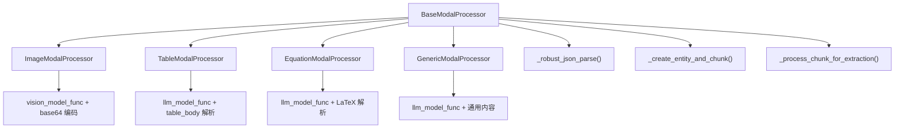
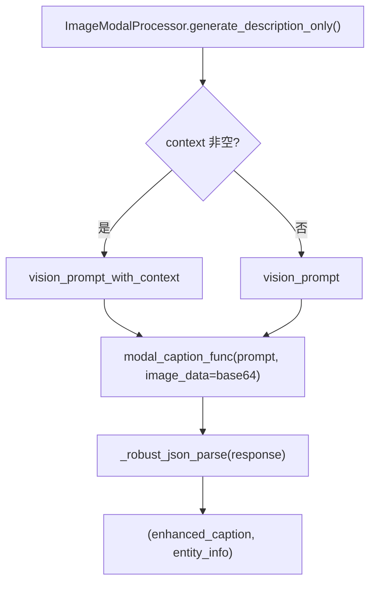
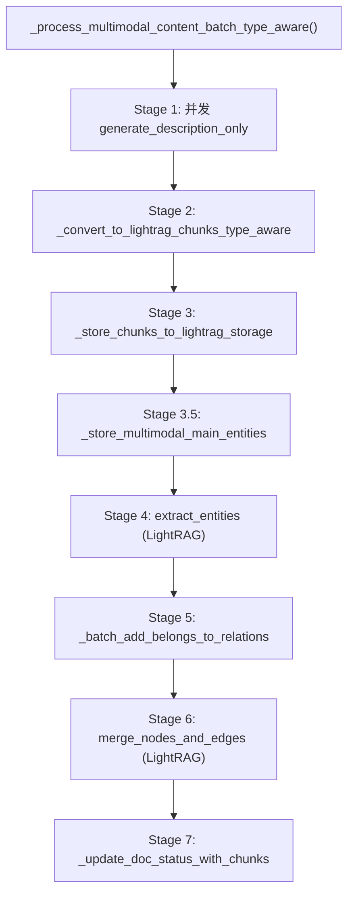

# PD-101.01 RAG-Anything — 四模态专用处理器 + 上下文感知知识图谱注入

> 文档编号：PD-101.01
> 来源：RAG-Anything `raganything/modalprocessors.py`, `raganything/prompt.py`, `raganything/processor.py`
> GitHub：https://github.com/HKUDS/RAG-Anything.git
> 问题域：PD-101 多模态内容处理 Multimodal Content Processing
> 状态：可复用方案

---

## 第 1 章 问题与动机

### 1.1 核心问题

RAG 系统处理 PDF、论文、技术文档时，文档中大量非文本内容（图片、表格、公式）被传统 RAG 管道忽略或仅以文件路径形式存储，导致：

1. **信息丢失**：图表中的关键数据、公式的语义含义无法被检索
2. **知识图谱断裂**：非文本实体无法参与实体关系抽取，图谱覆盖不完整
3. **检索质量下降**：用户查询涉及图表内容时，系统无法返回相关结果
4. **上下文割裂**：孤立处理多模态内容，丢失其在文档中的上下文语境

### 1.2 RAG-Anything 的解法概述

RAG-Anything 基于 LightRAG 构建了一套完整的多模态内容处理管道，核心设计：

1. **四种专用模态处理器**（`modalprocessors.py:796-1570`）：Image / Table / Equation / Generic，每种处理器针对特定模态优化 prompt 和解析逻辑
2. **上下文感知的 ContextExtractor**（`modalprocessors.py:49-358`）：处理多模态内容时自动提取周围页面/chunk 的文本上下文，注入到 LLM prompt 中
3. **LLM 驱动的结构化描述生成**（`prompt.py:32-273`）：每种模态都有带/不带上下文的双版本 prompt 模板，输出统一的 `{detailed_description, entity_info}` JSON 结构
4. **知识图谱深度集成**（`modalprocessors.py:465-793`）：多模态内容不仅生成向量 chunk，还创建实体节点、抽取关系、建立 `belongs_to` 边，完整融入知识图谱
5. **两阶段批量处理**（`processor.py:703-879`）：Stage 1 并发生成描述，Stage 2 批量实体抽取与合并，利用 asyncio.Semaphore 控制并发

### 1.3 设计思想

| 设计原则 | 具体实现 | 理由 | 替代方案 |
|----------|----------|------|----------|
| 模态专用化 | 4 个独立处理器类，各自实现 `process_multimodal_content` 和 `generate_description_only` | 不同模态的输入格式、prompt 策略、解析逻辑差异大，统一处理会降低质量 | 单一通用处理器 + 类型判断分支 |
| 上下文注入 | ContextExtractor 按页面/chunk 窗口提取周围文本，注入到 prompt 中 | 孤立分析图表会丢失语境（如"表 3 展示了..."的前文说明） | 不提供上下文，仅用 caption |
| 结构化 JSON 输出 | prompt 要求 LLM 返回 `{detailed_description, entity_info}` 固定结构 | 统一下游解析逻辑，entity_info 直接用于知识图谱节点创建 | 自由文本描述 + 后处理抽取 |
| 知识图谱融合 | 多模态 chunk 参与 extract_entities + merge_nodes_and_edges + belongs_to 关系 | 让图表实体与文本实体在同一图谱中关联，支持跨模态检索 | 仅存向量库，不建图谱关系 |
| 鲁棒 JSON 解析 | 4 策略渐进式解析：直接解析 → 清理 → 引号修复 → 正则提取 | LLM 输出的 JSON 经常有格式问题（thinking 标签、转义错误等） | 单次 json.loads，失败即降级 |

---

## 第 2 章 源码实现分析

### 2.1 架构概览

RAG-Anything 的多模态处理架构采用 Mixin + 策略模式，核心组件关系：

```
┌─────────────────────────────────────────────────────────────────┐
│                      RAGAnything (dataclass)                     │
│              QueryMixin + ProcessorMixin + BatchMixin            │
├─────────────────────────────────────────────────────────────────┤
│  _initialize_processors()                                       │
│    ├── ImageModalProcessor  ← vision_model_func                 │
│    ├── TableModalProcessor  ← llm_model_func                    │
│    ├── EquationModalProcessor ← llm_model_func                  │
│    └── GenericModalProcessor  ← llm_model_func (fallback)       │
│                                                                  │
│  ContextExtractor (shared)                                       │
│    ├── page mode: 按 page_idx 窗口提取                           │
│    ├── chunk mode: 按 index 窗口提取                              │
│    └── _truncate_context(): tokenizer 精确截断                    │
│                                                                  │
│  process_document_complete()                                     │
│    ├── parse_document() → content_list                           │
│    ├── separate_content() → text + multimodal_items              │
│    ├── insert_text_content() → LightRAG.ainsert()               │
│    └── _process_multimodal_content()                             │
│         ├── Stage 1: 并发 generate_description_only()            │
│         ├── Stage 2: _convert_to_lightrag_chunks()               │
│         ├── Stage 3: _store_chunks_to_lightrag_storage()         │
│         ├── Stage 4: extract_entities() (LightRAG)               │
│         ├── Stage 5: _batch_add_belongs_to_relations()           │
│         ├── Stage 6: merge_nodes_and_edges() (LightRAG)          │
│         └── Stage 7: _update_doc_status_with_chunks()            │
└─────────────────────────────────────────────────────────────────┘
```

### 2.2 核心实现

#### 2.2.1 BaseModalProcessor 与继承体系



对应源码 `raganything/modalprocessors.py:360-405`：

```python
class BaseModalProcessor:
    """Base class for modal processors"""

    def __init__(
        self,
        lightrag: LightRAG,
        modal_caption_func,
        context_extractor: ContextExtractor = None,
    ):
        self.lightrag = lightrag
        self.modal_caption_func = modal_caption_func

        # Use LightRAG's storage instances
        self.text_chunks_db = lightrag.text_chunks
        self.chunks_vdb = lightrag.chunks_vdb
        self.entities_vdb = lightrag.entities_vdb
        self.relationships_vdb = lightrag.relationships_vdb
        self.knowledge_graph_inst = lightrag.chunk_entity_relation_graph

        # Use LightRAG's configuration and functions
        self.embedding_func = lightrag.embedding_func
        self.llm_model_func = lightrag.llm_model_func
        self.global_config = asdict(lightrag)
        self.hashing_kv = lightrag.llm_response_cache
        self.tokenizer = lightrag.tokenizer

        # Initialize context extractor with tokenizer if not provided
        if context_extractor is None:
            self.context_extractor = ContextExtractor(tokenizer=self.tokenizer)
        else:
            self.context_extractor = context_extractor
```

关键设计：BaseModalProcessor 直接持有 LightRAG 的全部存储引用（text_chunks、chunks_vdb、entities_vdb、relationships_vdb、knowledge_graph），使得多模态内容可以直接写入与文本内容相同的存储层。

#### 2.2.2 上下文感知的 ContextExtractor

```mermaid
graph TD
    A["extract_context(content_source, item_info)"] --> B{content_format?}
    B -->|minerU| C["_extract_from_content_list()"]
    B -->|text_chunks| D["_extract_from_text_chunks()"]
    B -->|auto| E{type(content_source)?}
    E -->|list| C
    E -->|dict| F["_extract_from_dict_source()"]
    E -->|str| G["_extract_from_text_source()"]
    C --> H{context_mode?}
    H -->|page| I["_extract_page_context()"]
    H -->|chunk| J["_extract_chunk_context()"]
    I --> K["_truncate_context()"]
    J --> K
```

对应源码 `raganything/modalprocessors.py:133-171`：

```python
def _extract_page_context(
    self, content_list: List[Dict], current_item_info: Dict
) -> str:
    current_page = current_item_info.get("page_idx", 0)
    window_size = self.config.context_window

    start_page = max(0, current_page - window_size)
    end_page = current_page + window_size + 1

    context_texts = []

    for item in content_list:
        item_page = item.get("page_idx", 0)
        item_type = item.get("type", "")

        if (
            start_page <= item_page < end_page
            and item_type in self.config.filter_content_types
        ):
            text_content = self._extract_text_from_item(item)
            if text_content and text_content.strip():
                if item_page != current_page:
                    context_texts.append(f"[Page {item_page}] {text_content}")
                else:
                    context_texts.append(text_content)

    context = "\n".join(context_texts)
    return self._truncate_context(context)
```

ContextExtractor 的核心是**滑动窗口**机制：以当前多模态元素的 page_idx 为中心，向前后各扩展 `context_window` 页，收集窗口内的文本内容。截断策略优先在句子边界（`.`）或换行符处截断，避免语义断裂。

#### 2.2.3 双版本 Prompt 模板系统



对应源码 `raganything/prompt.py:32-89`，每种模态都有两个版本的 prompt：

- **无上下文版本**（`vision_prompt`）：仅基于图片本身分析
- **有上下文版本**（`vision_prompt_with_context`）：注入 `{context}` 占位符，包含周围页面的文本

两个版本输出相同的 JSON 结构：
```json
{
    "detailed_description": "...",
    "entity_info": {
        "entity_name": "...",
        "entity_type": "image|table|equation",
        "summary": "..."
    }
}
```

#### 2.2.4 七阶段批量处理管道



对应源码 `raganything/processor.py:703-879`，这是整个多模态处理的核心管道。Stage 1 使用 `asyncio.Semaphore` 控制并发度（默认 `max_parallel_insert=2`），Stage 4-6 复用 LightRAG 的标准实体抽取和合并流程。

#### 2.2.5 鲁棒 JSON 解析（4 策略渐进）

对应源码 `raganything/modalprocessors.py:547-688`：

```python
def _robust_json_parse(self, response: str) -> dict:
    # Strategy 1: Try direct parsing first
    for json_candidate in self._extract_all_json_candidates(response):
        result = self._try_parse_json(json_candidate)
        if result:
            return result

    # Strategy 2: Try with basic cleanup
    for json_candidate in self._extract_all_json_candidates(response):
        cleaned = self._basic_json_cleanup(json_candidate)
        result = self._try_parse_json(cleaned)
        if result:
            return result

    # Strategy 3: Try progressive quote fixing
    for json_candidate in self._extract_all_json_candidates(response):
        fixed = self._progressive_quote_fix(json_candidate)
        result = self._try_parse_json(fixed)
        if result:
            return result

    # Strategy 4: Fallback to regex field extraction
    return self._extract_fields_with_regex(response)
```

特别值得注意的是 `_extract_all_json_candidates` 会先清除 `<think>` / `<thinking>` 标签（兼容 qwen2.5-think、deepseek-r1 等推理模型），然后用三种方法提取 JSON 候选：代码块匹配、花括号平衡、简单正则。

### 2.3 实现细节

**内容分离策略**（`utils.py:13-56`）：`separate_content()` 将 MinerU 解析结果按 `type` 字段分为纯文本和多模态两组。文本走 LightRAG 标准 `ainsert()` 管道，多模态走专用处理器管道，最终在同一知识图谱中汇合。

**实体命名规则**（`modalprocessors.py:1011-1013`）：实体名自动追加类型后缀，如 `"Performance Comparison (table)"`，避免不同模态的同名实体冲突。

**belongs_to 关系注入**（`processor.py:1202-1264`）：Stage 5 为每个多模态 chunk 中抽取的子实体创建指向主模态实体的 `belongs_to` 边（权重 10.0），确保图谱中的层级关系。

**VLM 增强查询**（`query.py:303-370`）：查询时自动检测检索上下文中的图片路径，编码为 base64 注入 VLM 消息，实现端到端的多模态问答。包含路径安全校验（`validate_image_file` + 目录白名单 + symlink 阻断）。


---

## 第 3 章 迁移指南

### 3.1 迁移清单

**阶段 1：基础模态处理器（1-2 天）**
- [ ] 定义 `BaseModalProcessor` 抽象基类，持有 LLM 函数和存储引用
- [ ] 实现 `ImageModalProcessor`，集成 vision model 调用 + base64 编码
- [ ] 实现 `TableModalProcessor`，解析 table_body / table_caption
- [ ] 实现 `EquationModalProcessor`，解析 LaTeX 文本
- [ ] 实现 `GenericModalProcessor` 作为兜底处理器
- [ ] 为每种处理器编写双版本 prompt 模板（带/不带上下文）

**阶段 2：上下文提取器（0.5 天）**
- [ ] 实现 `ContextExtractor`，支持 page 和 chunk 两种窗口模式
- [ ] 实现 tokenizer 精确截断（优先句子边界）
- [ ] 将 ContextExtractor 注入到所有处理器中

**阶段 3：知识图谱集成（1 天）**
- [ ] 实现 `_create_entity_and_chunk()`：创建 chunk + 实体节点 + 向量索引
- [ ] 实现 `_process_chunk_for_extraction()`：调用 LLM 抽取实体关系
- [ ] 实现 `belongs_to` 关系注入逻辑
- [ ] 实现鲁棒 JSON 解析（4 策略渐进）

**阶段 4：批量处理管道（0.5 天）**
- [ ] 实现 `separate_content()` 文本/多模态分离
- [ ] 实现七阶段批量处理管道（并发描述生成 → 实体抽取 → 合并）
- [ ] 集成 asyncio.Semaphore 并发控制

### 3.2 适配代码模板

以下是一个可直接复用的最小化多模态处理器框架：

```python
"""Minimal multimodal processor framework inspired by RAG-Anything"""

import json
import re
from abc import ABC, abstractmethod
from dataclasses import dataclass, field
from typing import Any, Dict, List, Tuple, Optional, Callable


@dataclass
class ContextConfig:
    """Context extraction configuration"""
    context_window: int = 1
    context_mode: str = "page"  # "page" or "chunk"
    max_context_tokens: int = 2000
    filter_content_types: List[str] = field(default_factory=lambda: ["text"])


class ContextExtractor:
    """Extract surrounding text context for multimodal items"""

    def __init__(self, config: ContextConfig = None, tokenizer=None):
        self.config = config or ContextConfig()
        self.tokenizer = tokenizer

    def extract_context(
        self, content_list: List[Dict], current_item: Dict
    ) -> str:
        current_page = current_item.get("page_idx", 0)
        window = self.config.context_window
        start, end = max(0, current_page - window), current_page + window + 1

        texts = []
        for item in content_list:
            page = item.get("page_idx", 0)
            if start <= page < end and item.get("type") in self.config.filter_content_types:
                text = item.get("text", "")
                if text.strip():
                    prefix = f"[Page {page}] " if page != current_page else ""
                    texts.append(f"{prefix}{text}")

        context = "\n".join(texts)
        if self.tokenizer and len(self.tokenizer.encode(context)) > self.config.max_context_tokens:
            tokens = self.tokenizer.encode(context)[:self.config.max_context_tokens]
            context = self.tokenizer.decode(tokens)
        return context


class BaseModalProcessor(ABC):
    """Base class for all modal processors"""

    def __init__(
        self,
        llm_func: Callable,
        context_extractor: ContextExtractor = None,
    ):
        self.llm_func = llm_func
        self.context_extractor = context_extractor or ContextExtractor()
        self.content_source: Optional[List[Dict]] = None

    def set_content_source(self, content_list: List[Dict]):
        self.content_source = content_list

    @abstractmethod
    async def generate_description(
        self, content: Dict, item_info: Dict
    ) -> Tuple[str, Dict[str, Any]]:
        """Generate description and entity info for modal content"""
        ...

    def _get_context(self, item_info: Dict) -> str:
        if not self.content_source:
            return ""
        return self.context_extractor.extract_context(self.content_source, item_info)

    def _robust_json_parse(self, response: str) -> dict:
        """4-strategy progressive JSON parsing"""
        # Strategy 1: Direct parse from code blocks or braces
        cleaned = re.sub(r"<think>.*?</think>", "", response, flags=re.DOTALL)
        for pattern in [
            r"```(?:json)?\s*(\{.*?\})\s*```",
            r"(\{[^{}]*(?:\{[^{}]*\}[^{}]*)*\})",
        ]:
            for match in re.finditer(pattern, cleaned, re.DOTALL):
                try:
                    return json.loads(match.group(1) if "```" in pattern else match.group(0))
                except json.JSONDecodeError:
                    continue

        # Strategy 2: Cleanup smart quotes and trailing commas
        cleaned = cleaned.replace('\u201c', '"').replace('\u201d', '"')
        cleaned = re.sub(r",(\s*[}\]])", r"\1", cleaned)
        for match in re.finditer(r"\{.*\}", cleaned, re.DOTALL):
            try:
                return json.loads(match.group(0))
            except json.JSONDecodeError:
                continue

        # Strategy 3: Regex field extraction fallback
        desc = re.search(r'"detailed_description":\s*"(.*?)"', response, re.DOTALL)
        name = re.search(r'"entity_name":\s*"(.*?)"', response)
        return {
            "detailed_description": desc.group(1) if desc else response[:200],
            "entity_info": {
                "entity_name": name.group(1) if name else "unknown_entity",
                "entity_type": "unknown",
                "summary": response[:100],
            },
        }


class ImageProcessor(BaseModalProcessor):
    """Image content processor with vision model support"""

    async def generate_description(
        self, content: Dict, item_info: Dict
    ) -> Tuple[str, Dict[str, Any]]:
        context = self._get_context(item_info)
        image_path = content.get("img_path", "")
        captions = content.get("image_caption", [])

        prompt = f"""Analyze this image and return JSON:
{{"detailed_description": "...", "entity_info": {{"entity_name": "...", "entity_type": "image", "summary": "..."}}}}
Image: {image_path}, Captions: {captions}"""
        if context:
            prompt = f"Context:\n{context}\n\n{prompt}"

        response = await self.llm_func(prompt, image_data=self._encode(image_path))
        parsed = self._robust_json_parse(response)
        return parsed["detailed_description"], parsed["entity_info"]


# Usage: register processors by type
def create_processors(llm_func, vision_func, ctx_extractor):
    return {
        "image": ImageProcessor(vision_func or llm_func, ctx_extractor),
        # Add TableProcessor, EquationProcessor, GenericProcessor similarly
    }
```

### 3.3 适用场景

| 场景 | 适用度 | 说明 |
|------|--------|------|
| 学术论文 RAG | ⭐⭐⭐ | 论文中大量图表、公式，四模态处理器完美匹配 |
| 技术文档知识库 | ⭐⭐⭐ | 架构图、配置表、API 示例都能被结构化处理 |
| 财务报表分析 | ⭐⭐⭐ | 表格处理器 + 上下文注入可精确解析财务数据 |
| 纯文本 RAG | ⭐ | 无多模态内容时，处理器不会被触发，无额外收益 |
| 实时流式处理 | ⭐⭐ | 批量管道设计偏向离线处理，流式需改造 Stage 1 |
| 大规模文档库 | ⭐⭐ | 并发控制 Semaphore 可调，但 LLM 调用成本是瓶颈 |

---

## 第 4 章 测试用例

```python
"""Tests for RAG-Anything multimodal processing components"""

import pytest
import json
from unittest.mock import AsyncMock, MagicMock, patch
from dataclasses import asdict


# ---- ContextExtractor Tests ----

class TestContextExtractor:
    """Test context extraction for multimodal items"""

    def setup_method(self):
        """Set up test fixtures"""
        self.content_list = [
            {"type": "text", "text": "Introduction to neural networks.", "page_idx": 0},
            {"type": "text", "text": "Figure 1 shows the architecture.", "page_idx": 1},
            {"type": "image", "img_path": "/tmp/fig1.png", "page_idx": 1},
            {"type": "text", "text": "Table 1 presents the results.", "page_idx": 2},
            {"type": "table", "table_body": "| A | B |", "page_idx": 2},
            {"type": "text", "text": "Conclusion and future work.", "page_idx": 3},
        ]

    def test_page_context_window_1(self):
        """Context window=1 should include adjacent pages"""
        from raganything.modalprocessors import ContextExtractor, ContextConfig
        config = ContextConfig(context_window=1, context_mode="page")
        extractor = ContextExtractor(config=config)

        # Image on page 1, should get text from pages 0-2
        context = extractor.extract_context(
            self.content_list,
            {"page_idx": 1, "type": "image"},
            content_format="minerU",
        )
        assert "Introduction to neural networks" in context
        assert "Figure 1 shows" in context
        assert "Table 1 presents" in context
        # Page 3 should NOT be included (window=1, current=1, range=0-2)
        assert "Conclusion" not in context

    def test_empty_content_source(self):
        """Empty content source should return empty string"""
        from raganything.modalprocessors import ContextExtractor
        extractor = ContextExtractor()
        result = extractor.extract_context([], {"page_idx": 0})
        assert result == ""

    def test_truncation_respects_max_tokens(self):
        """Context should be truncated to max_context_tokens"""
        from raganything.modalprocessors import ContextExtractor, ContextConfig
        config = ContextConfig(max_context_tokens=20)  # Very small limit
        extractor = ContextExtractor(config=config)

        long_content = [
            {"type": "text", "text": "A" * 1000, "page_idx": 0},
        ]
        context = extractor.extract_context(
            long_content, {"page_idx": 0}, content_format="minerU"
        )
        assert len(context) <= 25  # Some tolerance for truncation boundary


# ---- Robust JSON Parsing Tests ----

class TestRobustJsonParse:
    """Test the 4-strategy progressive JSON parser"""

    def setup_method(self):
        """Create a minimal processor for testing"""
        from raganything.modalprocessors import GenericModalProcessor
        mock_lightrag = MagicMock()
        mock_lightrag.text_chunks = MagicMock()
        mock_lightrag.chunks_vdb = MagicMock()
        mock_lightrag.entities_vdb = MagicMock()
        mock_lightrag.relationships_vdb = MagicMock()
        mock_lightrag.chunk_entity_relation_graph = MagicMock()
        mock_lightrag.embedding_func = MagicMock()
        mock_lightrag.llm_model_func = MagicMock()
        mock_lightrag.llm_response_cache = MagicMock()
        mock_lightrag.tokenizer = MagicMock()
        self.processor = GenericModalProcessor(
            lightrag=mock_lightrag,
            modal_caption_func=AsyncMock(),
        )

    def test_clean_json(self):
        """Strategy 1: Direct parsing of clean JSON"""
        response = '{"detailed_description": "A chart", "entity_info": {"entity_name": "Chart1", "entity_type": "image", "summary": "A bar chart"}}'
        result = self.processor._robust_json_parse(response)
        assert result["detailed_description"] == "A chart"
        assert result["entity_info"]["entity_name"] == "Chart1"

    def test_json_in_code_block(self):
        """Strategy 1: JSON wrapped in markdown code block"""
        response = '```json\n{"detailed_description": "test", "entity_info": {"entity_name": "E1", "entity_type": "table", "summary": "s"}}\n```'
        result = self.processor._robust_json_parse(response)
        assert result["detailed_description"] == "test"

    def test_json_with_thinking_tags(self):
        """Should strip <think> tags before parsing"""
        response = '<think>Let me analyze...</think>{"detailed_description": "result", "entity_info": {"entity_name": "E", "entity_type": "eq", "summary": "s"}}'
        result = self.processor._robust_json_parse(response)
        assert result["detailed_description"] == "result"

    def test_fallback_to_regex(self):
        """Strategy 4: Regex extraction when JSON is malformed"""
        response = 'Some text "detailed_description": "extracted desc" more text "entity_name": "MyEntity"'
        result = self.processor._robust_json_parse(response)
        assert "extracted desc" in result.get("detailed_description", "")


# ---- Content Separation Tests ----

class TestSeparateContent:
    """Test text/multimodal content separation"""

    def test_separate_mixed_content(self):
        from raganything.utils import separate_content
        content = [
            {"type": "text", "text": "Hello world"},
            {"type": "image", "img_path": "/tmp/img.png"},
            {"type": "text", "text": "More text"},
            {"type": "table", "table_body": "| A | B |"},
            {"type": "equation", "text": "E=mc^2"},
        ]
        text, multimodal = separate_content(content)
        assert "Hello world" in text
        assert "More text" in text
        assert len(multimodal) == 3
        assert multimodal[0]["type"] == "image"
        assert multimodal[1]["type"] == "table"
        assert multimodal[2]["type"] == "equation"

    def test_empty_content(self):
        from raganything.utils import separate_content
        text, multimodal = separate_content([])
        assert text == ""
        assert multimodal == []

    def test_text_only(self):
        from raganything.utils import separate_content
        content = [
            {"type": "text", "text": "Only text here"},
        ]
        text, multimodal = separate_content(content)
        assert "Only text here" in text
        assert len(multimodal) == 0


# ---- Processor Type Routing Tests ----

class TestProcessorRouting:
    """Test correct processor selection by content type"""

    def test_get_processor_for_known_types(self):
        from raganything.utils import get_processor_for_type
        processors = {
            "image": "ImageProc",
            "table": "TableProc",
            "equation": "EqProc",
            "generic": "GenericProc",
        }
        assert get_processor_for_type(processors, "image") == "ImageProc"
        assert get_processor_for_type(processors, "table") == "TableProc"
        assert get_processor_for_type(processors, "equation") == "EqProc"

    def test_unknown_type_falls_back_to_generic(self):
        from raganything.utils import get_processor_for_type
        processors = {"generic": "GenericProc"}
        assert get_processor_for_type(processors, "audio") == "GenericProc"
        assert get_processor_for_type(processors, "video") == "GenericProc"
```


---

## 第 5 章 跨域关联

| 关联域 | 关系类型 | 说明 |
|--------|----------|------|
| PD-01 上下文管理 | 协同 | ContextExtractor 的滑动窗口 + tokenizer 截断本质上是上下文窗口管理的子问题，max_context_tokens 控制注入到 prompt 的上下文量 |
| PD-03 容错与重试 | 协同 | `_robust_json_parse` 的 4 策略渐进解析是容错设计的典型实践；每个处理器的 `generate_description_only` 都有 try/except + fallback_entity 降级 |
| PD-04 工具系统 | 依赖 | 多模态处理器本质上是一种"工具"——接收特定类型输入，调用 LLM，返回结构化输出。处理器注册表 `modal_processors` 类似工具注册表 |
| PD-06 记忆持久化 | 协同 | 多模态 chunk 和实体通过 LightRAG 的 text_chunks_db、chunks_vdb、entities_vdb、knowledge_graph_inst 持久化，与文本内容共享存储层 |
| PD-08 搜索与检索 | 协同 | 多模态内容转化为向量 chunk + 知识图谱节点后，可通过 LightRAG 的 mix/hybrid/local/global 模式检索；VLM 增强查询进一步支持图片级检索 |
| PD-11 可观测性 | 协同 | 七阶段管道中每个阶段都有 logger.info 进度日志，Stage 1 的并发进度按 10% 粒度汇报 |
| PD-104 知识图谱构建 | 依赖 | 多模态处理器的 Stage 4-6 直接复用 LightRAG 的 `extract_entities` + `merge_nodes_and_edges`，belongs_to 关系是知识图谱构建的扩展 |

---

## 第 6 章 来源文件索引

| 文件 | 行范围 | 关键实现 |
|------|--------|----------|
| `raganything/modalprocessors.py` | L33-47 | ContextConfig 数据类定义 |
| `raganything/modalprocessors.py` | L49-358 | ContextExtractor 完整实现（页面/chunk 窗口、截断） |
| `raganything/modalprocessors.py` | L360-793 | BaseModalProcessor 基类（存储引用、实体创建、鲁棒 JSON 解析） |
| `raganything/modalprocessors.py` | L796-1030 | ImageModalProcessor（base64 编码、vision model 调用） |
| `raganything/modalprocessors.py` | L1032-1224 | TableModalProcessor（table_body/caption 解析） |
| `raganything/modalprocessors.py` | L1226-1408 | EquationModalProcessor（LaTeX 文本解析） |
| `raganything/modalprocessors.py` | L1410-1570 | GenericModalProcessor（通用兜底处理器） |
| `raganything/prompt.py` | L12-29 | 系统 prompt 定义（5 种角色） |
| `raganything/prompt.py` | L32-89 | 图片分析 prompt（带/不带上下文双版本） |
| `raganything/prompt.py` | L100-161 | 表格分析 prompt（带/不带上下文双版本） |
| `raganything/prompt.py` | L163-221 | 公式分析 prompt（带/不带上下文双版本） |
| `raganything/prompt.py` | L223-273 | 通用分析 prompt（带/不带上下文双版本） |
| `raganything/prompt.py` | L275-301 | 模态 chunk 模板（image/table/equation/generic） |
| `raganything/utils.py` | L13-56 | separate_content() 文本/多模态分离 |
| `raganything/utils.py` | L59-76 | encode_image_to_base64() 图片编码 |
| `raganything/utils.py` | L78-143 | validate_image_file() 图片安全校验（扩展名、大小、symlink） |
| `raganything/utils.py` | L228-278 | get_processor_for_type() 处理器路由 + get_processor_supports() |
| `raganything/processor.py` | L455-546 | _process_multimodal_content() 入口（状态检查 + 批量/个体分发） |
| `raganything/processor.py` | L703-879 | _process_multimodal_content_batch_type_aware() 七阶段批量管道 |
| `raganything/processor.py` | L880-1001 | _convert_to_lightrag_chunks + _apply_chunk_template |
| `raganything/processor.py` | L1020-1171 | _store_multimodal_main_entities + full_entities 集成 |
| `raganything/processor.py` | L1202-1264 | _batch_add_belongs_to_relations（belongs_to 边注入） |
| `raganything/raganything.py` | L49-50 | RAGAnything 主类（Mixin 组合） |
| `raganything/raganything.py` | L177-219 | _initialize_processors()（按配置创建 4 种处理器） |
| `raganything/raganything.py` | L493-519 | set_content_source_for_context()（为所有处理器设置上下文源） |
| `raganything/query.py` | L163-301 | aquery_with_multimodal()（多模态查询 + 缓存） |
| `raganything/query.py` | L303-370 | aquery_vlm_enhanced()（VLM 增强查询 + 图片路径安全校验） |
| `raganything/query.py` | L539-656 | _process_image_paths_for_vlm()（base64 编码 + 目录白名单） |
| `raganything/config.py` | L76-104 | 上下文提取配置项（context_window/mode/max_tokens 等） |

---

## 第 7 章 横向对比维度

```json comparison_data
{
  "project": "RAG-Anything",
  "dimensions": {
    "模态覆盖": "Image/Table/Equation/Generic 四种专用处理器 + 通用兜底",
    "上下文注入": "ContextExtractor 滑动窗口（page/chunk 模式）+ tokenizer 精确截断",
    "输出格式": "统一 JSON 结构 {detailed_description, entity_info}，4 策略鲁棒解析",
    "知识图谱集成": "多模态 chunk 参与实体抽取 + belongs_to 关系注入，与文本共享图谱",
    "批量处理": "七阶段管道：并发描述生成 → 实体抽取 → 合并，Semaphore 并发控制",
    "查询增强": "VLM 增强查询：检索上下文中图片自动 base64 编码注入 vision model"
  }
}
```

### 域元数据补充

```json domain_metadata
{
  "solution_summary": "RAG-Anything 用四种专用模态处理器（Image/Table/Equation/Generic）+ ContextExtractor 滑动窗口上下文注入 + 七阶段批量管道，将多模态内容转化为知识图谱节点和向量 chunk",
  "description": "多模态内容如何深度融入知识图谱而非仅存向量库",
  "sub_problems": [
    "LLM 输出 JSON 格式不稳定的鲁棒解析",
    "多模态 chunk 与文本 chunk 的统一存储与检索",
    "VLM 增强查询中的图片路径安全校验"
  ],
  "best_practices": [
    "为每种模态提供带/不带上下文的双版本 prompt 模板",
    "多模态实体通过 belongs_to 边与子实体建立图谱层级关系",
    "采用渐进式 4 策略 JSON 解析兼容各种 LLM 输出格式"
  ]
}
```
