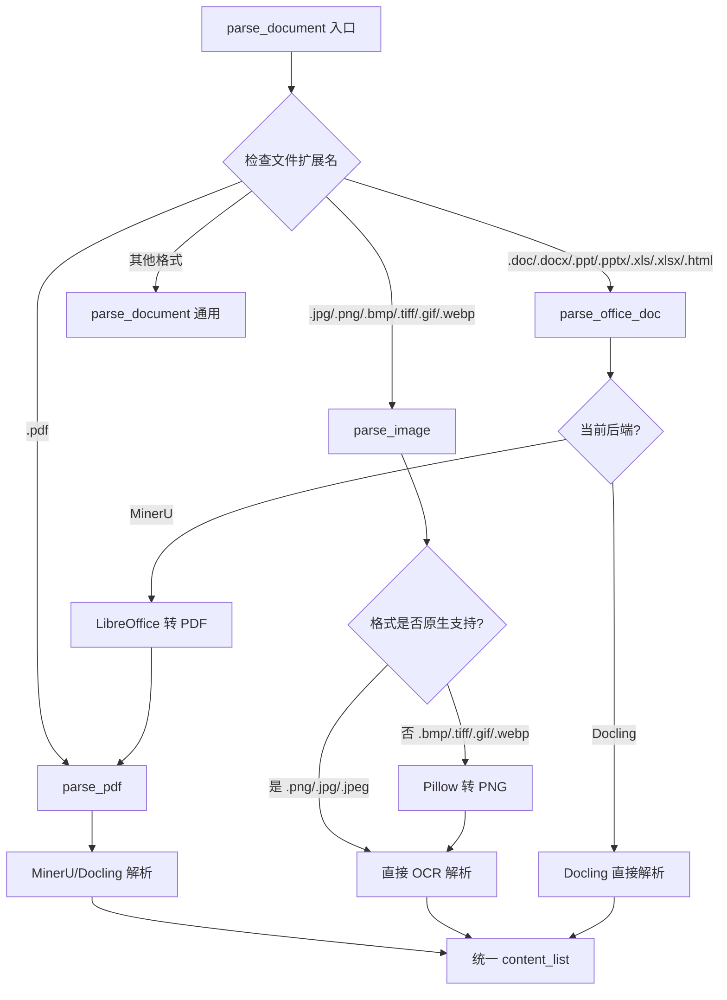
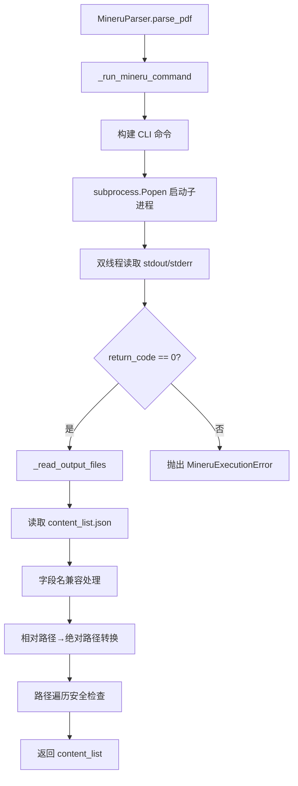
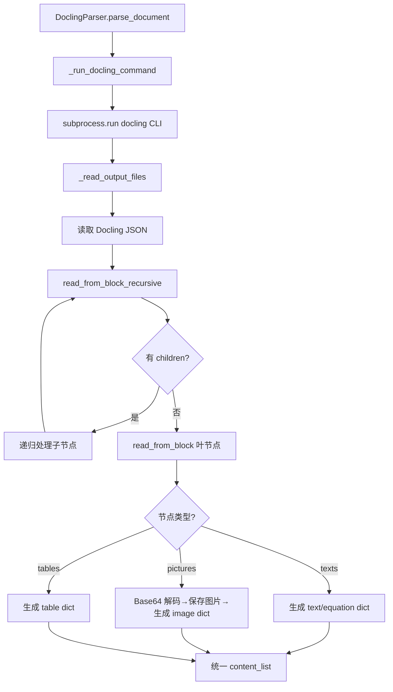
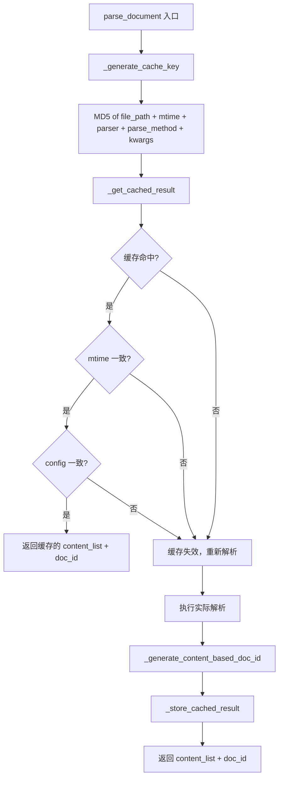

# PD-102.01 RAG-Anything — 双后端多格式文档解析管线

> 文档编号：PD-102.01
> 来源：RAG-Anything `raganything/parser.py` `raganything/processor.py` `raganything/config.py`
> GitHub：https://github.com/HKUDS/RAG-Anything.git
> 问题域：PD-102 文档解析管线 Document Parsing Pipeline
> 状态：可复用方案

---

## 第 1 章 问题与动机

### 1.1 核心问题

多模态 RAG 系统需要处理多种文档格式（PDF、图片、Office、HTML、纯文本），每种格式的解析方式截然不同。核心挑战包括：

1. **格式碎片化**：PDF 需要版面分析 + OCR，图片需要格式转换 + OCR，Office 文档需要先转 PDF，HTML 需要结构化提取。没有单一工具能覆盖所有格式。
2. **解析后端差异**：MinerU 擅长 PDF/图片的版面分析和公式识别，Docling 擅长 Office 和 HTML 的结构化提取。不同场景需要不同后端。
3. **输出标准化**：不同解析后端的输出格式不同（MinerU 输出 content_list JSON，Docling 输出嵌套 JSON），下游多模态处理需要统一的数据结构。
4. **多模态内容分离**：解析结果中混合了文本、图片、表格、公式等不同类型的内容，需要按类型分离后路由到对应的处理器。
5. **解析缓存**：文档解析是计算密集型操作（尤其是 OCR），相同文件重复解析浪费资源。

### 1.2 RAG-Anything 的解法概述

RAG-Anything 实现了一套完整的多格式文档解析管线，核心设计：

1. **双后端策略模式**：通过 `config.parser` 配置在 MinerU 和 Docling 之间切换，`Parser` 基类定义统一接口（`parse_pdf`、`parse_image`、`parse_document`），两个子类各自实现（`raganything/parser.py:572`、`raganything/parser.py:1288`）
2. **扩展名路由分发**：`ProcessorMixin.parse_document()` 根据文件扩展名自动路由到 `parse_pdf`、`parse_image`、`parse_office_doc` 或 `parse_document` 通用方法（`raganything/processor.py:332-411`）
3. **自动格式转换链**：不支持的格式通过转换链处理——Office→PDF（LibreOffice）、非标图片→PNG（Pillow）、文本→PDF（ReportLab），然后再交给解析后端（`raganything/parser.py:66-200`、`raganything/parser.py:1037-1089`）
4. **统一 content_list 输出**：所有解析后端最终输出统一的 `List[Dict[str, Any]]` 结构，每个 dict 包含 `type`（text/image/table/equation）和对应字段（`raganything/utils.py:13-56`）
5. **基于内容哈希的缓存**：通过文件路径 + 修改时间 + 解析配置生成 MD5 缓存键，避免重复解析（`raganything/processor.py:44-92`）

### 1.3 设计思想

| 设计原则 | 具体实现 | 理由 | 替代方案 |
|----------|----------|------|----------|
| 策略模式 | `Parser` 基类 + `MineruParser`/`DoclingParser` 子类 | 不同后端能力互补，用户按场景选择 | 单一后端（灵活性差） |
| 扩展名路由 | `parse_document()` 中 `ext` 分支判断 | 文件类型决定解析策略，简单直接 | MIME 类型检测（更准确但更复杂） |
| 转换链路 | Office→PDF→MinerU、BMP→PNG→MinerU | 复用已有解析能力，避免为每种格式写解析器 | 每种格式独立解析器（代码膨胀） |
| Mixin 组合 | `ProcessorMixin` 混入 `RAGAnything` 主类 | 解析逻辑与查询逻辑解耦，各自独立演进 | 单一大类（职责不清） |
| 内容哈希缓存 | MD5(file_path + mtime + config) 作为缓存键 | 文件或配置变化自动失效，无需手动清理 | 基于文件名缓存（配置变化不感知） |

---

## 第 2 章 源码实现分析

### 2.1 架构概览

RAG-Anything 的文档解析管线采用三层架构：配置层、路由层、解析层。

```
┌─────────────────────────────────────────────────────────────────┐
│                    RAGAnything (主类)                             │
│  ┌──────────────┐  ┌──────────────────┐  ┌──────────────────┐   │
│  │  QueryMixin  │  │  ProcessorMixin  │  │   BatchMixin     │   │
│  │  (查询逻辑)   │  │  (解析+处理逻辑)  │  │  (批量处理逻辑)   │   │
│  └──────────────┘  └───────┬──────────┘  └──────────────────┘   │
│                            │                                     │
│  ┌─────────────────────────┼─────────────────────────────────┐  │
│  │           RAGAnythingConfig (配置层)                        │  │
│  │  parser: "mineru"|"docling"                                │  │
│  │  parse_method: "auto"|"ocr"|"txt"                          │  │
│  │  supported_file_extensions: [".pdf",".jpg",...]            │  │
│  └─────────────────────────┼─────────────────────────────────┘  │
└────────────────────────────┼─────────────────────────────────────┘
                             │
              ┌──────────────┴──────────────┐
              │    parse_document() 路由层    │
              │  根据 ext 分发到对应方法       │
              └──────┬───────────┬───────────┘
                     │           │
         ┌───────────┴──┐  ┌────┴──────────┐
         │ MineruParser │  │ DoclingParser  │
         │  (解析层)     │  │  (解析层)      │
         ├──────────────┤  ├───────────────┤
         │ parse_pdf    │  │ parse_pdf     │
         │ parse_image  │  │ parse_office  │
         │ parse_office │  │ parse_html    │
         │ parse_text   │  │ parse_document│
         └──────────────┘  └───────────────┘
              │                    │
              └────────┬───────────┘
                       ▼
              统一 content_list 输出
              [{"type":"text","text":"..."},
               {"type":"image","img_path":"..."},
               {"type":"table","table_body":"..."},
               {"type":"equation","text":"..."}]
                       │
                       ▼
              separate_content() 分离
              ├── text_content → LightRAG.ainsert()
              └── multimodal_items → ModalProcessors
```

### 2.2 核心实现

#### 2.2.1 扩展名路由与解析分发



对应源码 `raganything/processor.py:280-411`：

```python
async def parse_document(
    self,
    file_path: str,
    output_dir: str = None,
    parse_method: str = None,
    display_stats: bool = None,
    **kwargs,
) -> tuple[List[Dict[str, Any]], str]:
    # ...
    ext = file_path.suffix.lower()
    try:
        doc_parser = (
            DoclingParser() if self.config.parser == "docling" else MineruParser()
        )
        if ext in [".pdf"]:
            content_list = await asyncio.to_thread(
                doc_parser.parse_pdf,
                pdf_path=file_path, output_dir=output_dir,
                method=parse_method, **kwargs,
            )
        elif ext in [".jpg", ".jpeg", ".png", ".bmp", ".tiff", ".tif", ".gif", ".webp"]:
            if hasattr(doc_parser, "parse_image"):
                content_list = await asyncio.to_thread(
                    doc_parser.parse_image,
                    image_path=file_path, output_dir=output_dir, **kwargs,
                )
            else:
                # Fallback to MinerU for image parsing
                content_list = MineruParser().parse_image(
                    image_path=file_path, output_dir=output_dir, **kwargs
                )
        elif ext in [".doc", ".docx", ".ppt", ".pptx", ".xls", ".xlsx",
                     ".html", ".htm", ".xhtml"]:
            content_list = await asyncio.to_thread(
                doc_parser.parse_office_doc,
                doc_path=file_path, output_dir=output_dir, **kwargs,
            )
        else:
            content_list = await asyncio.to_thread(
                doc_parser.parse_document,
                file_path=file_path, method=parse_method,
                output_dir=output_dir, **kwargs,
            )
    except MineruExecutionError as e:
        self.logger.error(f"Mineru command failed: {e}")
        raise
```

关键设计点：
- 使用 `asyncio.to_thread()` 将同步的解析操作放到线程池执行，不阻塞事件循环
- 图片解析有 fallback 机制：如果当前后端不支持 `parse_image`，自动回退到 MinerU
- 所有路径最终汇聚到统一的 `content_list` 输出

#### 2.2.2 MinerU 解析后端 — 子进程调用与输出解析



对应源码 `raganything/parser.py:591-788`：

```python
@classmethod
def _run_mineru_command(cls, input_path, output_dir, method="auto",
                        lang=None, backend=None, start_page=None,
                        end_page=None, formula=True, table=True,
                        device=None, source=None, vlm_url=None) -> None:
    cmd = ["mineru", "-p", str(input_path), "-o", str(output_dir), "-m", method]
    if backend:
        cmd.extend(["-b", backend])
    # ... 其他参数构建

    process = subprocess.Popen(cmd, **subprocess_kwargs)

    # 双线程实时读取输出
    stdout_thread = threading.Thread(
        target=enqueue_output, args=(process.stdout, stdout_queue, "STDOUT"))
    stderr_thread = threading.Thread(
        target=enqueue_output, args=(process.stderr, stderr_queue, "STDERR"))
    stdout_thread.daemon = True
    stderr_thread.daemon = True
    stdout_thread.start()
    stderr_thread.start()

    # 实时处理输出
    while process.poll() is None:
        try:
            while True:
                prefix, line = stdout_queue.get_nowait()
                output_lines.append(line)
                cls.logger.info(f"[MinerU] {line}")
        except Empty:
            pass
        time.sleep(0.1)

    if return_code != 0 or error_lines:
        raise MineruExecutionError(return_code, error_lines)
```

关键设计点：
- 使用 `subprocess.Popen` + 双线程 Queue 实现实时日志流式输出，而非 `subprocess.run` 阻塞等待
- 自定义 `MineruExecutionError` 异常类携带 `return_code` 和 `error_msg`，上层可精确处理
- `_read_output_files()` 中包含路径遍历安全检查（`raganything/parser.py:896-901`）：`is_relative_to(resolved_base)` 防止恶意路径

#### 2.2.3 Docling 解析后端 — 递归 JSON 结构转换



对应源码 `raganything/parser.py:1512-1608`：

```python
def read_from_block_recursive(self, block, type, output_dir, cnt, num, docling_content):
    content_list = []
    if not block.get("children"):
        cnt += 1
        content_list.append(self.read_from_block(block, type, output_dir, cnt, num))
    else:
        if type not in ["groups", "body"]:
            cnt += 1
            content_list.append(self.read_from_block(block, type, output_dir, cnt, num))
        members = block["children"]
        for member in members:
            cnt += 1
            member_tag = member["$ref"]
            member_type = member_tag.split("/")[1]
            member_num = member_tag.split("/")[2]
            member_block = docling_content[member_type][int(member_num)]
            content_list.extend(
                self.read_from_block_recursive(
                    member_block, member_type, output_dir, cnt, member_num, docling_content
                )
            )
    return content_list
```

关键设计点：
- Docling 输出的 JSON 使用 `$ref` 引用（类似 JSON Schema），需要递归解引用
- 图片内容以 Base64 URI 嵌入 JSON，解析时解码并保存为独立文件，路径转为绝对路径
- `page_idx` 通过 `cnt // 10` 估算，因为 Docling 不直接提供页码信息

#### 2.2.4 解析缓存机制



对应源码 `raganything/processor.py:44-92`：

```python
def _generate_cache_key(self, file_path: Path, parse_method: str = None, **kwargs) -> str:
    mtime = file_path.stat().st_mtime
    config_dict = {
        "file_path": str(file_path.absolute()),
        "mtime": mtime,
        "parser": self.config.parser,
        "parse_method": parse_method or self.config.parse_method,
    }
    relevant_kwargs = {
        k: v for k, v in kwargs.items()
        if k in ["lang", "device", "start_page", "end_page",
                  "formula", "table", "backend", "source"]
    }
    config_dict.update(relevant_kwargs)
    config_str = json.dumps(config_dict, sort_keys=True)
    cache_key = hashlib.md5(config_str.encode()).hexdigest()
    return cache_key
```

### 2.3 实现细节

**内容分离与多模态路由**（`raganything/utils.py:13-56`）：

`separate_content()` 函数将统一的 `content_list` 按 `type` 字段分为纯文本和多模态两组。文本内容用 `\n\n` 拼接后送入 LightRAG 的文本处理管线，多模态内容按类型路由到对应的 `ModalProcessor`（image→`ImageModalProcessor`、table→`TableModalProcessor`、equation→`EquationModalProcessor`、其他→`GenericModalProcessor`）。

**MinerU 字段名兼容处理**（`raganything/parser.py:862-877`）：

MinerU 1.x 使用 `img_caption`/`img_footnote`，2.0 改为 `image_caption`/`image_footnote`。`_read_output_files()` 中做了双向别名映射，确保无论哪个版本的输出都能被下游正确消费。

**完整处理流水线**（`raganything/processor.py:1441-1529`）：

`process_document_complete()` 是端到端入口：解析→分离→文本插入→多模态处理→标记完成。多模态处理采用 7 阶段管线：并发描述生成→转换为 LightRAG chunks→存储→实体提取→添加 belongs_to 关系→批量合并→更新文档状态。


---

## 第 3 章 迁移指南

### 3.1 迁移清单

**阶段 1：基础解析层（1-2 天）**

- [ ] 安装解析后端：`pip install 'mineru[core]'` 或 `pip install docling`
- [ ] 安装格式转换依赖：LibreOffice（Office→PDF）、Pillow（图片格式转换）、ReportLab（文本→PDF）
- [ ] 复制 `Parser` 基类和 `MineruParser`/`DoclingParser` 子类
- [ ] 实现 `_run_mineru_command()` 子进程调用逻辑
- [ ] 实现 `_read_output_files()` 输出解析逻辑

**阶段 2：路由与转换层（1 天）**

- [ ] 实现扩展名路由分发逻辑（`parse_document()` 中的 ext 分支）
- [ ] 实现 Office→PDF 转换链（`convert_office_to_pdf()`）
- [ ] 实现非标图片→PNG 转换（`parse_image()` 中的 Pillow 转换）
- [ ] 实现文本→PDF 转换（`convert_text_to_pdf()`）

**阶段 3：缓存与集成层（1 天）**

- [ ] 实现解析缓存（`_generate_cache_key()` + `_get_cached_result()` + `_store_cached_result()`）
- [ ] 实现内容分离（`separate_content()`）
- [ ] 集成到主处理流水线

### 3.2 适配代码模板

以下是一个可直接复用的最小化文档解析管线实现：

```python
"""
可复用的多格式文档解析管线模板
基于 RAG-Anything 的双后端策略模式
"""

import json
import hashlib
import subprocess
import asyncio
from abc import ABC, abstractmethod
from pathlib import Path
from typing import Dict, List, Any, Optional, Tuple
from dataclasses import dataclass


@dataclass
class ParserConfig:
    """解析器配置"""
    parser: str = "mineru"          # "mineru" | "docling"
    parse_method: str = "auto"      # "auto" | "ocr" | "txt"
    output_dir: str = "./output"
    cache_enabled: bool = True


class BaseParser(ABC):
    """解析器基类 — 定义统一接口"""

    OFFICE_FORMATS = {".doc", ".docx", ".ppt", ".pptx", ".xls", ".xlsx"}
    IMAGE_FORMATS = {".png", ".jpeg", ".jpg", ".bmp", ".tiff", ".tif", ".gif", ".webp"}

    @abstractmethod
    def parse_pdf(self, pdf_path: Path, output_dir: str, **kwargs) -> List[Dict[str, Any]]:
        ...

    @abstractmethod
    def parse_image(self, image_path: Path, output_dir: str, **kwargs) -> List[Dict[str, Any]]:
        ...

    def parse_document(self, file_path: Path, output_dir: str, **kwargs) -> List[Dict[str, Any]]:
        """扩展名路由分发"""
        ext = file_path.suffix.lower()
        if ext == ".pdf":
            return self.parse_pdf(file_path, output_dir, **kwargs)
        elif ext in self.IMAGE_FORMATS:
            return self.parse_image(file_path, output_dir, **kwargs)
        elif ext in self.OFFICE_FORMATS:
            pdf_path = self._convert_office_to_pdf(file_path, output_dir)
            return self.parse_pdf(pdf_path, output_dir, **kwargs)
        else:
            raise ValueError(f"Unsupported format: {ext}")

    @staticmethod
    def _convert_office_to_pdf(doc_path: Path, output_dir: str) -> Path:
        """Office→PDF 转换（需要 LibreOffice）"""
        out = Path(output_dir)
        out.mkdir(parents=True, exist_ok=True)
        subprocess.run(
            ["libreoffice", "--headless", "--convert-to", "pdf",
             "--outdir", str(out), str(doc_path)],
            capture_output=True, text=True, timeout=60, check=True,
        )
        return out / f"{doc_path.stem}.pdf"


def separate_content(content_list: List[Dict[str, Any]]) -> Tuple[str, List[Dict[str, Any]]]:
    """将 content_list 分离为纯文本和多模态内容"""
    text_parts, multimodal_items = [], []
    for item in content_list:
        if item.get("type") == "text":
            text = item.get("text", "").strip()
            if text:
                text_parts.append(text)
        else:
            multimodal_items.append(item)
    return "\n\n".join(text_parts), multimodal_items


def generate_cache_key(file_path: Path, parser: str, parse_method: str, **kwargs) -> str:
    """基于文件+配置生成缓存键"""
    config_dict = {
        "file_path": str(file_path.absolute()),
        "mtime": file_path.stat().st_mtime,
        "parser": parser,
        "parse_method": parse_method,
    }
    config_dict.update({k: v for k, v in kwargs.items()
                        if k in ["lang", "device", "start_page", "end_page"]})
    return hashlib.md5(json.dumps(config_dict, sort_keys=True).encode()).hexdigest()


async def parse_document_async(
    file_path: str,
    config: ParserConfig,
    cache: Optional[Dict] = None,
    **kwargs,
) -> Tuple[List[Dict[str, Any]], str]:
    """异步文档解析入口（带缓存）"""
    path = Path(file_path)
    if not path.exists():
        raise FileNotFoundError(f"File not found: {file_path}")

    # 检查缓存
    cache_key = generate_cache_key(path, config.parser, config.parse_method, **kwargs)
    if config.cache_enabled and cache and cache_key in cache:
        return cache[cache_key]

    # 选择解析后端并执行
    # parser = DoclingParser() if config.parser == "docling" else MineruParser()
    # content_list = await asyncio.to_thread(
    #     parser.parse_document, path, config.output_dir, **kwargs
    # )

    # 存入缓存
    # if config.cache_enabled and cache is not None:
    #     cache[cache_key] = (content_list, doc_id)

    # return content_list, doc_id
    pass  # 替换为实际实现
```

### 3.3 适用场景

| 场景 | 适用度 | 说明 |
|------|--------|------|
| 多模态 RAG 系统 | ⭐⭐⭐ | 核心场景，PDF/图片/Office 混合文档库 |
| 学术论文解析 | ⭐⭐⭐ | PDF 含公式、表格、图片，MinerU 的版面分析能力强 |
| 企业文档管理 | ⭐⭐⭐ | Office 文档为主，Docling 直接解析无需转换 |
| 纯文本知识库 | ⭐⭐ | 杀鸡用牛刀，直接文本分块即可 |
| 实时文档流处理 | ⭐ | 解析延迟较高（MinerU OCR 单文件数十秒），不适合实时场景 |

---

## 第 4 章 测试用例

```python
"""
基于 RAG-Anything 真实函数签名的测试用例
测试文档解析管线的核心功能
"""

import pytest
import json
import hashlib
import tempfile
from pathlib import Path
from unittest.mock import MagicMock, patch, AsyncMock
from typing import Dict, List, Any


# ============================================================
# 测试 1：扩展名路由分发
# ============================================================
class TestExtensionRouting:
    """测试 parse_document 的扩展名路由逻辑"""

    def test_pdf_routes_to_parse_pdf(self):
        """PDF 文件应路由到 parse_pdf"""
        from raganything.parser import MineruParser
        parser = MineruParser()
        with patch.object(parser, 'parse_pdf', return_value=[{"type": "text", "text": "hello"}]) as mock:
            result = parser.parse_document(Path("/tmp/test.pdf"), output_dir="/tmp/out")
            mock.assert_called_once()
            assert result[0]["type"] == "text"

    def test_image_routes_to_parse_image(self):
        """图片文件应路由到 parse_image"""
        from raganything.parser import MineruParser
        parser = MineruParser()
        with patch.object(parser, 'parse_image', return_value=[{"type": "image", "img_path": "/tmp/img.png"}]) as mock:
            with patch.object(Path, 'exists', return_value=True):
                result = parser.parse_document(Path("/tmp/test.png"), output_dir="/tmp/out")
                mock.assert_called_once()

    def test_office_routes_to_parse_office_doc(self):
        """Office 文件应路由到 parse_office_doc"""
        from raganything.parser import MineruParser
        parser = MineruParser()
        with patch.object(parser, 'parse_office_doc', return_value=[{"type": "text", "text": "doc content"}]) as mock:
            with patch.object(Path, 'exists', return_value=True):
                result = parser.parse_document(Path("/tmp/test.docx"), output_dir="/tmp/out")
                mock.assert_called_once()

    def test_unsupported_format_falls_back_to_pdf(self):
        """不支持的格式应尝试作为 PDF 解析"""
        from raganything.parser import MineruParser
        parser = MineruParser()
        with patch.object(parser, 'parse_pdf', return_value=[]) as mock:
            with patch.object(Path, 'exists', return_value=True):
                parser.parse_document(Path("/tmp/test.xyz"), output_dir="/tmp/out")
                mock.assert_called_once()


# ============================================================
# 测试 2：内容分离
# ============================================================
class TestSeparateContent:
    """测试 separate_content 的内容分离逻辑"""

    def test_text_only(self):
        """纯文本内容应全部归入 text_content"""
        from raganything.utils import separate_content
        content_list = [
            {"type": "text", "text": "Hello world"},
            {"type": "text", "text": "Second paragraph"},
        ]
        text, multimodal = separate_content(content_list)
        assert "Hello world" in text
        assert "Second paragraph" in text
        assert len(multimodal) == 0

    def test_mixed_content(self):
        """混合内容应正确分离"""
        from raganything.utils import separate_content
        content_list = [
            {"type": "text", "text": "Introduction"},
            {"type": "image", "img_path": "/tmp/fig1.png"},
            {"type": "text", "text": "Discussion"},
            {"type": "table", "table_body": "| A | B |"},
            {"type": "equation", "text": "E=mc^2"},
        ]
        text, multimodal = separate_content(content_list)
        assert "Introduction" in text
        assert "Discussion" in text
        assert len(multimodal) == 3
        assert multimodal[0]["type"] == "image"
        assert multimodal[1]["type"] == "table"
        assert multimodal[2]["type"] == "equation"

    def test_empty_text_filtered(self):
        """空文本应被过滤"""
        from raganything.utils import separate_content
        content_list = [
            {"type": "text", "text": ""},
            {"type": "text", "text": "   "},
            {"type": "text", "text": "Valid text"},
        ]
        text, multimodal = separate_content(content_list)
        assert text == "Valid text"


# ============================================================
# 测试 3：缓存键生成
# ============================================================
class TestCacheKeyGeneration:
    """测试缓存键生成逻辑"""

    def test_same_file_same_config_same_key(self):
        """相同文件+相同配置应生成相同缓存键"""
        with tempfile.NamedTemporaryFile(suffix=".pdf", delete=False) as f:
            f.write(b"test content")
            path = Path(f.name)

        config1 = {
            "file_path": str(path.absolute()),
            "mtime": path.stat().st_mtime,
            "parser": "mineru",
            "parse_method": "auto",
        }
        config2 = dict(config1)  # 相同配置
        key1 = hashlib.md5(json.dumps(config1, sort_keys=True).encode()).hexdigest()
        key2 = hashlib.md5(json.dumps(config2, sort_keys=True).encode()).hexdigest()
        assert key1 == key2
        path.unlink()

    def test_different_parser_different_key(self):
        """不同解析器应生成不同缓存键"""
        with tempfile.NamedTemporaryFile(suffix=".pdf", delete=False) as f:
            f.write(b"test content")
            path = Path(f.name)

        base = {
            "file_path": str(path.absolute()),
            "mtime": path.stat().st_mtime,
            "parse_method": "auto",
        }
        key1 = hashlib.md5(json.dumps({**base, "parser": "mineru"}, sort_keys=True).encode()).hexdigest()
        key2 = hashlib.md5(json.dumps({**base, "parser": "docling"}, sort_keys=True).encode()).hexdigest()
        assert key1 != key2
        path.unlink()


# ============================================================
# 测试 4：格式转换降级
# ============================================================
class TestFormatConversion:
    """测试图片格式转换降级逻辑"""

    def test_native_format_no_conversion(self):
        """原生支持的格式不应触发转换"""
        mineru_supported = {".png", ".jpeg", ".jpg"}
        for ext in mineru_supported:
            assert ext in mineru_supported  # 直接支持，无需转换

    def test_non_native_format_needs_conversion(self):
        """非原生格式应触发 Pillow 转换"""
        mineru_supported = {".png", ".jpeg", ".jpg"}
        non_native = {".bmp", ".tiff", ".tif", ".gif", ".webp"}
        for ext in non_native:
            assert ext not in mineru_supported  # 需要转换为 PNG
```


---

## 第 5 章 跨域关联

| 关联域 | 关系类型 | 说明 |
|--------|----------|------|
| PD-101 多模态内容处理 | 协同 | 文档解析管线输出的 multimodal_items 直接送入多模态处理器（ImageModalProcessor 等），两者通过 content_list 数据结构耦合 |
| PD-103 批量并发处理 | 协同 | BatchMixin 调用 parse_document 实现批量文件处理，通过 max_concurrent_files 控制并发度 |
| PD-105 配置管理 | 依赖 | RAGAnythingConfig 统一管理解析器选择、解析方法、输出目录等配置，支持环境变量覆盖 |
| PD-03 容错与重试 | 协同 | MineruExecutionError 自定义异常携带 return_code 和 error_msg，上层可据此决定重试策略；图片解析有 fallback 到 MinerU 的降级机制 |
| PD-100 配置驱动架构 | 协同 | 解析后端选择通过 config.parser 配置驱动，无需修改代码即可切换 MinerU/Docling |

---

## 第 6 章 来源文件索引

| 文件 | 行范围 | 关键实现 |
|------|--------|----------|
| `raganything/parser.py` | L46-L64 | `Parser` 基类定义，格式常量 |
| `raganything/parser.py` | L66-L200 | `convert_office_to_pdf()` Office→PDF 转换 |
| `raganything/parser.py` | L206-L436 | `convert_text_to_pdf()` 文本→PDF 转换 |
| `raganything/parser.py` | L572-L590 | `MineruParser` 类定义 |
| `raganything/parser.py` | L591-L788 | `_run_mineru_command()` 子进程调用与实时日志 |
| `raganything/parser.py` | L794-L909 | `_read_output_files()` 输出解析与路径安全检查 |
| `raganything/parser.py` | L911-L982 | `MineruParser.parse_pdf()` PDF 解析 |
| `raganything/parser.py` | L983-L1131 | `MineruParser.parse_image()` 图片解析与格式转换 |
| `raganything/parser.py` | L1133-L1168 | `MineruParser.parse_office_doc()` Office 文档解析 |
| `raganything/parser.py` | L1204-L1253 | `MineruParser.parse_document()` 扩展名路由 |
| `raganything/parser.py` | L1288-L1302 | `DoclingParser` 类定义 |
| `raganything/parser.py` | L1401-L1460 | `DoclingParser._run_docling_command()` Docling CLI 调用 |
| `raganything/parser.py` | L1462-L1510 | `DoclingParser._read_output_files()` Docling 输出解析 |
| `raganything/parser.py` | L1512-L1548 | `read_from_block_recursive()` 递归 JSON 结构转换 |
| `raganything/parser.py` | L1550-L1608 | `read_from_block()` 叶节点类型映射 |
| `raganything/processor.py` | L26-L27 | `ProcessorMixin` 类定义 |
| `raganything/processor.py` | L44-L92 | `_generate_cache_key()` 缓存键生成 |
| `raganything/processor.py` | L94-L131 | `_generate_content_based_doc_id()` 内容哈希 ID |
| `raganything/processor.py` | L133-L210 | `_get_cached_result()` 缓存读取与验证 |
| `raganything/processor.py` | L212-L278 | `_store_cached_result()` 缓存存储 |
| `raganything/processor.py` | L280-L453 | `parse_document()` 核心路由与解析入口 |
| `raganything/processor.py` | L1441-L1529 | `process_document_complete()` 端到端处理流水线 |
| `raganything/config.py` | L13-L153 | `RAGAnythingConfig` 配置类定义 |
| `raganything/utils.py` | L13-L56 | `separate_content()` 内容分离 |
| `raganything/utils.py` | L228-L248 | `get_processor_for_type()` 处理器路由 |
| `raganything/base.py` | L1-L12 | `DocStatus` 文档状态枚举 |
| `raganything/raganything.py` | L50-L51 | `RAGAnything` 主类定义（Mixin 组合） |
| `raganything/raganything.py` | L177-L219 | `_initialize_processors()` 多模态处理器初始化 |
| `raganything/prompt.py` | L275-L300 | 多模态 chunk 模板（image_chunk/table_chunk/equation_chunk/generic_chunk） |

---

## 第 7 章 横向对比维度

```json comparison_data
{
  "project": "RAG-Anything",
  "dimensions": {
    "解析后端": "MinerU + Docling 双后端策略模式，config.parser 一键切换",
    "格式覆盖": "PDF/图片(8种)/Office(6种)/HTML/文本，共 18+ 种格式",
    "格式转换": "三条转换链：Office→PDF(LibreOffice)、非标图片→PNG(Pillow)、文本→PDF(ReportLab)",
    "输出标准化": "统一 content_list 结构，type 字段区分 text/image/table/equation",
    "缓存机制": "MD5(file_path+mtime+parser+method+kwargs) 内容哈希缓存，配置变化自动失效",
    "安全防护": "路径遍历检查 is_relative_to()、符号链接阻断、文件大小限制"
  }
}
```

### 域元数据补充

```json domain_metadata
{
  "solution_summary": "RAG-Anything 用 MinerU+Docling 双后端策略模式实现 18+ 格式文档解析，通过 Office→PDF→MinerU 转换链和统一 content_list 输出结构，支持解析缓存与路径安全检查",
  "description": "文档解析管线需要处理解析后端差异、格式转换链路和输出标准化问题",
  "sub_problems": [
    "解析结果缓存与失效策略",
    "子进程实时日志流式输出",
    "解析后端版本兼容（字段名映射）",
    "路径遍历安全防护"
  ],
  "best_practices": [
    "用 asyncio.to_thread 将同步解析放入线程池避免阻塞事件循环",
    "用 Mixin 模式将解析逻辑与查询逻辑解耦",
    "用双线程 Queue 实现子进程实时日志输出而非阻塞等待"
  ]
}
```

