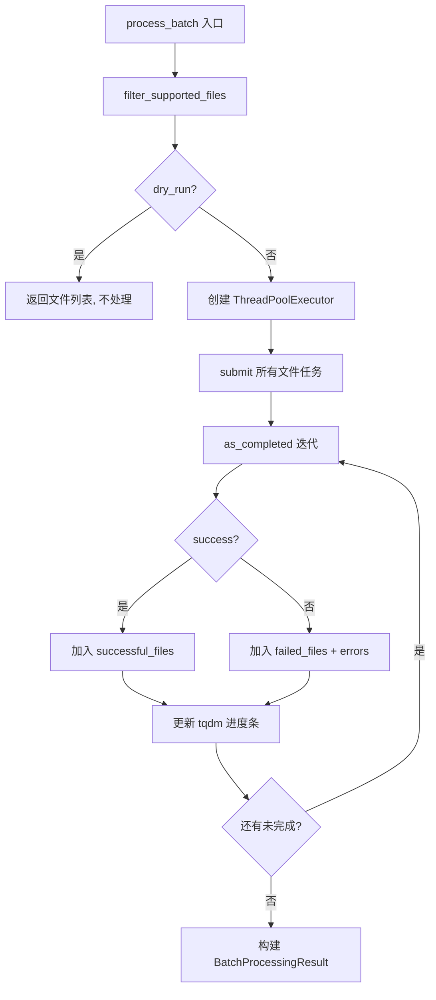
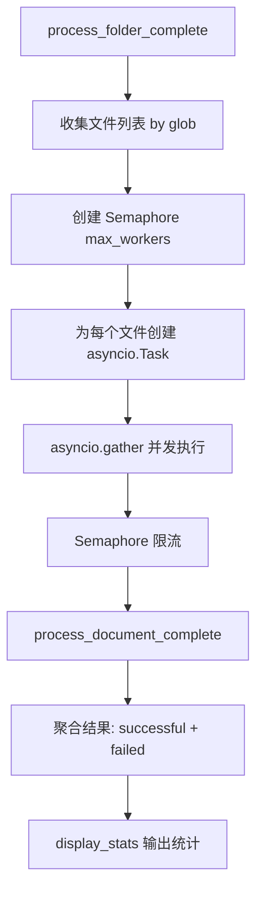
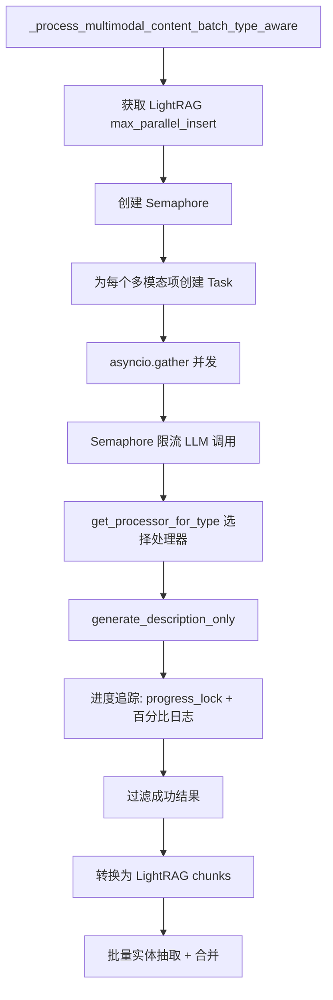

# PD-103.02 RAG-Anything — 双层并发批处理系统

> 文档编号：PD-103.02
> 来源：RAG-Anything `raganything/batch.py` `raganything/batch_parser.py` `raganything/processor.py`
> GitHub：https://github.com/HKUDS/RAG-Anything.git
> 问题域：PD-103 批量并发处理 Batch & Concurrent Processing
> 状态：可复用方案

---

## 第 1 章 问题与动机

### 1.1 核心问题

多模态 RAG 系统需要批量处理大量异构文档（PDF、图片、Office、HTML 等），每个文档的解析和 RAG 入库是 I/O 密集型操作。单线程串行处理效率极低，但无限制并发又会耗尽内存和 API 配额。核心挑战在于：

1. **文档解析是 CPU/IO 混合型任务** — PDF OCR 是 CPU 密集型，而 LLM 调用是 IO 密集型，需要不同的并发策略
2. **异构文件类型需要统一调度** — 文件夹中混合了 PDF、图片、Office 文档，需要自动过滤和分发
3. **部分失败不应阻塞整体** — 100 个文件中 3 个解析失败，不应影响其余 97 个的处理
4. **多模态内容需要二次并发** — 文档解析后，图片/表格/公式等多模态内容还需要并发调用 LLM 生成描述

### 1.2 RAG-Anything 的解法概述

RAG-Anything 实现了一个**双层并发架构**，将批处理分为两个独立的并发层：

1. **外层：文件级并发** — `BatchParser` 使用 `ThreadPoolExecutor` 并行解析多个文档（`batch_parser.py:280`），`BatchMixin.process_folder_complete` 使用 `asyncio.Semaphore` 控制异步文件处理并发度（`batch.py:102`）
2. **内层：多模态内容级并发** — `ProcessorMixin._process_multimodal_content_batch_type_aware` 使用 `asyncio.Semaphore` 控制单文档内多模态项的并发 LLM 调用（`processor.py:729`）
3. **结构化结果聚合** — `BatchProcessingResult` dataclass 提供成功率、耗时、错误映射等统计（`batch_parser.py:22-50`）
4. **配置驱动** — 所有并发参数（`max_concurrent_files`、`max_workers`）通过 `RAGAnythingConfig` 统一管理，支持环境变量覆盖（`config.py:56-73`）
5. **Mixin 分层** — 批处理逻辑通过 `BatchMixin` 混入主类，与解析逻辑（`ProcessorMixin`）和查询逻辑（`QueryMixin`）正交组合（`raganything.py:50`）

### 1.3 设计思想

| 设计原则 | 具体实现 | 理由 | 替代方案 |
|----------|----------|------|----------|
| 双层并发分离 | 外层 ThreadPoolExecutor/Semaphore 管文件，内层 Semaphore 管多模态 | 文件解析是同步阻塞的（OCR），多模态处理是异步的（LLM API），需要不同并发原语 | 单层 asyncio 全异步（但 OCR 库不支持 async） |
| 配置驱动并发度 | `max_concurrent_files` 默认 1，通过环境变量 `MAX_CONCURRENT_FILES` 覆盖 | 不同硬件资源差异大，需要用户可调 | 硬编码并发数（不灵活） |
| 结构化结果而非异常 | `BatchProcessingResult` 聚合成功/失败列表 + 错误映射 | 批处理中部分失败是常态，不应用异常中断整体 | 抛出第一个异常（丢失其他结果） |
| Mixin 组合 | `BatchMixin` 独立于 `ProcessorMixin`，通过类型提示声明依赖 | 批处理是可选能力，不应污染核心处理逻辑 | 继承链（耦合度高） |
| 同步/异步双入口 | `process_batch` (同步) + `process_batch_async` (异步) | 兼容同步脚本和异步 Web 服务两种调用场景 | 只提供异步（强制调用者用 asyncio） |

---

## 第 2 章 源码实现分析

### 2.1 架构概览

RAG-Anything 的批处理系统由三个核心模块组成，通过 Mixin 模式组合到主类 `RAGAnything` 中：

```
┌─────────────────────────────────────────────────────────────┐
│                    RAGAnything (主类)                         │
│         继承: QueryMixin + ProcessorMixin + BatchMixin       │
├─────────────────────────────────────────────────────────────┤
│                                                             │
│  ┌──────────────┐   ┌───────────────┐   ┌───────────────┐  │
│  │  BatchMixin   │   │ ProcessorMixin │   │  QueryMixin   │  │
│  │  (batch.py)   │   │ (processor.py) │   │  (query.py)   │  │
│  │              │   │               │   │               │  │
│  │ • folder_    │   │ • parse_doc   │   │ • query       │  │
│  │   complete   │   │ • multimodal  │   │ • search      │  │
│  │ • batch_sync │   │   _batch      │   │               │  │
│  │ • batch_async│   │ • type_aware  │   │               │  │
│  └──────┬───────┘   └───────┬───────┘   └───────────────┘  │
│         │                   │                               │
│         ▼                   ▼                               │
│  ┌──────────────┐   ┌───────────────┐                      │
│  │ BatchParser   │   │ asyncio       │                      │
│  │(batch_parser) │   │ .Semaphore    │                      │
│  │              │   │ (内层并发)     │                      │
│  │ ThreadPool   │   │               │                      │
│  │ Executor     │   │ LLM 调用      │                      │
│  │ (外层并发)    │   │ 并发控制      │                      │
│  └──────────────┘   └───────────────┘                      │
│                                                             │
│  ┌──────────────────────────────────────────────────────┐   │
│  │           RAGAnythingConfig (config.py)               │   │
│  │  max_concurrent_files | supported_file_extensions     │   │
│  │  recursive_folder_processing | parser_output_dir      │   │
│  └──────────────────────────────────────────────────────┘   │
└─────────────────────────────────────────────────────────────┘
```

### 2.2 核心实现

#### 2.2.1 外层并发：BatchParser 的 ThreadPoolExecutor



对应源码 `raganything/batch_parser.py:205-339`：

```python
def process_batch(
    self,
    file_paths: List[str],
    output_dir: str,
    parse_method: str = "auto",
    recursive: bool = True,
    dry_run: bool = False,
    **kwargs,
) -> BatchProcessingResult:
    start_time = time.time()
    supported_files = self.filter_supported_files(file_paths, recursive)

    if dry_run:
        return BatchProcessingResult(
            successful_files=supported_files, failed_files=[],
            total_files=len(supported_files), processing_time=0.0,
            errors={}, output_dir=output_dir, dry_run=True,
        )

    successful_files, failed_files, errors = [], [], {}
    pbar = tqdm(total=len(supported_files), desc=f"Processing files ({self.parser_type})", unit="file") if self.show_progress else None

    try:
        with ThreadPoolExecutor(max_workers=self.max_workers) as executor:
            future_to_file = {
                executor.submit(self.process_single_file, fp, output_dir, parse_method, **kwargs): fp
                for fp in supported_files
            }
            for future in as_completed(future_to_file, timeout=self.timeout_per_file):
                success, file_path, error_msg = future.result()
                if success:
                    successful_files.append(file_path)
                else:
                    failed_files.append(file_path)
                    errors[file_path] = error_msg
                if pbar: pbar.update(1)
    except Exception as e:
        for future in future_to_file:
            if not future.done():
                file_path = future_to_file[future]
                failed_files.append(file_path)
                errors[file_path] = f"Processing interrupted: {str(e)}"
    finally:
        if pbar: pbar.close()

    return BatchProcessingResult(
        successful_files=successful_files, failed_files=failed_files,
        total_files=len(supported_files), processing_time=time.time() - start_time,
        errors=errors, output_dir=output_dir,
    )
```

#### 2.2.2 外层并发：BatchMixin 的 asyncio.Semaphore



对应源码 `raganything/batch.py:34-168`：

```python
async def process_folder_complete(
    self, folder_path: str, output_dir: str = None,
    parse_method: str = None, max_workers: int = None, ...
):
    if max_workers is None:
        max_workers = self.config.max_concurrent_files

    # 收集文件
    files_to_process = []
    for file_ext in file_extensions:
        pattern = f"**/*{file_ext}" if recursive else f"*{file_ext}"
        files_to_process.extend(folder_path_obj.glob(pattern))

    # Semaphore 控制并发
    semaphore = asyncio.Semaphore(max_workers)

    async def process_single_file(file_path: Path):
        async with semaphore:
            try:
                await self.process_document_complete(str(file_path), ...)
                return True, str(file_path), None
            except Exception as e:
                return False, str(file_path), str(e)

    tasks = [asyncio.create_task(process_single_file(fp)) for fp in files_to_process]
    results = await asyncio.gather(*tasks, return_exceptions=True)
```

#### 2.2.3 内层并发：多模态内容的 Semaphore 控制



对应源码 `raganything/processor.py:703-844`：

```python
async def _process_multimodal_content_batch_type_aware(
    self, multimodal_items: List[Dict[str, Any]], file_path: str, doc_id: str
):
    # 使用 LightRAG 的并发控制参数
    semaphore = asyncio.Semaphore(getattr(self.lightrag, "max_parallel_insert", 2))
    total_items = len(multimodal_items)
    completed_count = 0
    progress_lock = asyncio.Lock()

    async def process_single_item_with_correct_processor(item, index, file_path):
        nonlocal completed_count
        async with semaphore:
            content_type = item.get("type", "unknown")
            processor = get_processor_for_type(self.modal_processors, content_type)
            description, entity_info = await processor.generate_description_only(
                modal_content=item, content_type=content_type, ...
            )
            # 进度追踪
            async with progress_lock:
                completed_count += 1
                if completed_count % max(1, total_items // 10) == 0:
                    self.logger.info(f"Progress: {completed_count}/{total_items} ({(completed_count/total_items)*100:.1f}%)")
            return {...}

    tasks = [asyncio.create_task(process_single_item_with_correct_processor(item, i, file_path))
             for i, item in enumerate(multimodal_items)]
    results = await asyncio.gather(*tasks, return_exceptions=True)
```

### 2.3 实现细节

**BatchProcessingResult 结构化结果** (`batch_parser.py:22-50`)：

```python
@dataclass
class BatchProcessingResult:
    successful_files: List[str]
    failed_files: List[str]
    total_files: int
    processing_time: float
    errors: Dict[str, str]  # file_path -> error_message
    output_dir: str
    dry_run: bool = False

    @property
    def success_rate(self) -> float:
        if self.total_files == 0: return 0.0
        return (len(self.successful_files) / self.total_files) * 100
```

**配置驱动的并发参数** (`config.py:56-73`)：

- `max_concurrent_files`: 默认 1，通过 `MAX_CONCURRENT_FILES` 环境变量覆盖
- `supported_file_extensions`: 支持 16 种文件格式，通过逗号分隔的环境变量配置
- `recursive_folder_processing`: 默认 `True`，递归扫描子目录

**文件过滤机制** (`batch_parser.py:112-158`)：解析器通过 `OFFICE_FORMATS | IMAGE_FORMATS | TEXT_FORMATS | {".pdf"}` 集合运算动态获取支持的扩展名，`filter_supported_files` 同时处理文件路径和目录路径，目录支持递归/非递归两种模式。

**两阶段 RAG 批处理** (`batch.py:302-405`)：`process_documents_with_rag_batch` 先用 `BatchParser` 并行解析所有文档，再逐个调用 `process_document_complete` 入库 RAG，实现解析和入库的解耦。


---

## 第 3 章 迁移指南

### 3.1 迁移清单

**阶段 1：基础批处理框架**
- [ ] 定义 `BatchProcessingResult` dataclass（成功/失败列表、错误映射、成功率计算）
- [ ] 实现文件过滤器（支持扩展名白名单、目录递归扫描）
- [ ] 实现 `ThreadPoolExecutor` 同步批处理（适用于 CPU 密集型解析）
- [ ] 集成 tqdm 进度条

**阶段 2：异步并发层**
- [ ] 实现 `asyncio.Semaphore` 异步批处理（适用于 IO 密集型 LLM 调用）
- [ ] 添加 `asyncio.Lock` 保护的进度追踪
- [ ] 实现 `asyncio.gather` + `return_exceptions=True` 的错误隔离

**阶段 3：配置与集成**
- [ ] 将并发参数抽取到配置类，支持环境变量覆盖
- [ ] 通过 Mixin 模式将批处理能力混入主类
- [ ] 添加 dry-run 模式和 CLI 入口

### 3.2 适配代码模板

```python
"""可直接复用的双层并发批处理框架"""
import asyncio
import time
import logging
from concurrent.futures import ThreadPoolExecutor, as_completed
from dataclasses import dataclass, field
from pathlib import Path
from typing import Dict, List, Optional, Tuple, Callable, Any

from tqdm import tqdm


@dataclass
class BatchResult:
    """结构化批处理结果"""
    successful: List[str] = field(default_factory=list)
    failed: List[str] = field(default_factory=list)
    errors: Dict[str, str] = field(default_factory=dict)
    total: int = 0
    elapsed: float = 0.0

    @property
    def success_rate(self) -> float:
        return (len(self.successful) / self.total * 100) if self.total else 0.0

    def summary(self) -> str:
        return (f"Total: {self.total} | OK: {len(self.successful)} "
                f"({self.success_rate:.1f}%) | Failed: {len(self.failed)} | "
                f"Time: {self.elapsed:.1f}s")


class BatchProcessor:
    """外层：ThreadPoolExecutor 同步并行处理"""

    def __init__(
        self,
        process_fn: Callable[[str], Any],
        max_workers: int = 4,
        timeout_per_item: int = 300,
        show_progress: bool = True,
    ):
        self.process_fn = process_fn
        self.max_workers = max_workers
        self.timeout_per_item = timeout_per_item
        self.show_progress = show_progress
        self.logger = logging.getLogger(__name__)

    def run(self, items: List[str], dry_run: bool = False) -> BatchResult:
        start = time.time()
        result = BatchResult(total=len(items))

        if dry_run:
            result.successful = list(items)
            return result

        pbar = tqdm(total=len(items), unit="item") if self.show_progress else None

        try:
            with ThreadPoolExecutor(max_workers=self.max_workers) as executor:
                futures = {executor.submit(self.process_fn, item): item for item in items}
                for future in as_completed(futures, timeout=self.timeout_per_item):
                    item = futures[future]
                    try:
                        future.result()
                        result.successful.append(item)
                    except Exception as e:
                        result.failed.append(item)
                        result.errors[item] = str(e)
                    if pbar:
                        pbar.update(1)
        except Exception as e:
            # 标记未完成的任务为失败
            for f, item in futures.items():
                if not f.done():
                    result.failed.append(item)
                    result.errors[item] = f"Interrupted: {e}"
        finally:
            if pbar:
                pbar.close()

        result.elapsed = time.time() - start
        return result


class AsyncBatchProcessor:
    """内层：asyncio.Semaphore 异步并发处理"""

    def __init__(
        self,
        process_fn: Callable,  # async callable
        max_concurrency: int = 2,
    ):
        self.process_fn = process_fn
        self.max_concurrency = max_concurrency
        self.logger = logging.getLogger(__name__)

    async def run(self, items: List[Any]) -> BatchResult:
        start = time.time()
        semaphore = asyncio.Semaphore(self.max_concurrency)
        result = BatchResult(total=len(items))
        progress_lock = asyncio.Lock()
        completed = 0

        async def _process(item):
            nonlocal completed
            async with semaphore:
                try:
                    await self.process_fn(item)
                    result.successful.append(str(item))
                except Exception as e:
                    result.failed.append(str(item))
                    result.errors[str(item)] = str(e)
                finally:
                    async with progress_lock:
                        completed += 1
                        if completed % max(1, len(items) // 10) == 0:
                            self.logger.info(f"Progress: {completed}/{len(items)}")

        tasks = [asyncio.create_task(_process(item)) for item in items]
        await asyncio.gather(*tasks, return_exceptions=True)
        result.elapsed = time.time() - start
        return result


# --- 使用示例 ---
# 外层：同步并行解析文档
# processor = BatchProcessor(process_fn=parse_document, max_workers=4)
# result = processor.run(file_paths)
#
# 内层：异步并发调用 LLM
# async_processor = AsyncBatchProcessor(process_fn=call_llm, max_concurrency=3)
# result = await async_processor.run(multimodal_items)
```

### 3.3 适用场景

| 场景 | 适用度 | 说明 |
|------|--------|------|
| 多文档 RAG 入库 | ⭐⭐⭐ | 核心场景，文件解析 + LLM 入库双层并发 |
| 批量 PDF OCR 处理 | ⭐⭐⭐ | ThreadPoolExecutor 适合 CPU 密集型 OCR |
| 批量 LLM API 调用 | ⭐⭐⭐ | asyncio.Semaphore 适合 IO 密集型 API 调用 |
| 实时流式处理 | ⭐ | 批处理模式不适合实时场景，需改用队列 |
| 分布式多机处理 | ⭐ | 当前是单机方案，分布式需引入 Celery/Ray |

---

## 第 4 章 测试用例

```python
"""基于 RAG-Anything 真实函数签名的测试用例"""
import asyncio
import pytest
import time
from unittest.mock import MagicMock, patch, AsyncMock
from dataclasses import dataclass
from pathlib import Path
from typing import List, Dict


# --- BatchProcessingResult 测试 ---

@dataclass
class BatchProcessingResult:
    successful_files: List[str]
    failed_files: List[str]
    total_files: int
    processing_time: float
    errors: Dict[str, str]
    output_dir: str
    dry_run: bool = False

    @property
    def success_rate(self) -> float:
        if self.total_files == 0:
            return 0.0
        return (len(self.successful_files) / self.total_files) * 100


class TestBatchProcessingResult:
    def test_success_rate_all_success(self):
        result = BatchProcessingResult(
            successful_files=["a.pdf", "b.pdf", "c.pdf"],
            failed_files=[], total_files=3,
            processing_time=10.0, errors={}, output_dir="/out",
        )
        assert result.success_rate == 100.0

    def test_success_rate_partial_failure(self):
        result = BatchProcessingResult(
            successful_files=["a.pdf"],
            failed_files=["b.pdf", "c.pdf"], total_files=3,
            processing_time=5.0,
            errors={"b.pdf": "parse error", "c.pdf": "timeout"},
            output_dir="/out",
        )
        assert abs(result.success_rate - 33.3) < 0.1

    def test_success_rate_empty(self):
        result = BatchProcessingResult(
            successful_files=[], failed_files=[], total_files=0,
            processing_time=0.0, errors={}, output_dir="/out",
        )
        assert result.success_rate == 0.0

    def test_dry_run_flag(self):
        result = BatchProcessingResult(
            successful_files=["a.pdf"], failed_files=[],
            total_files=1, processing_time=0.0, errors={},
            output_dir="/out", dry_run=True,
        )
        assert result.dry_run is True


# --- Semaphore 并发控制测试 ---

class TestSemaphoreConcurrency:
    @pytest.mark.asyncio
    async def test_semaphore_limits_concurrency(self):
        """验证 Semaphore 确实限制了并发数"""
        max_concurrent = 2
        semaphore = asyncio.Semaphore(max_concurrent)
        active_count = 0
        max_observed = 0
        lock = asyncio.Lock()

        async def task(i):
            nonlocal active_count, max_observed
            async with semaphore:
                async with lock:
                    active_count += 1
                    max_observed = max(max_observed, active_count)
                await asyncio.sleep(0.05)
                async with lock:
                    active_count -= 1

        tasks = [asyncio.create_task(task(i)) for i in range(10)]
        await asyncio.gather(*tasks)
        assert max_observed <= max_concurrent

    @pytest.mark.asyncio
    async def test_gather_isolates_exceptions(self):
        """验证 gather(return_exceptions=True) 隔离单个任务异常"""
        async def ok_task():
            return "ok"

        async def fail_task():
            raise ValueError("boom")

        results = await asyncio.gather(
            ok_task(), fail_task(), ok_task(),
            return_exceptions=True,
        )
        assert results[0] == "ok"
        assert isinstance(results[1], ValueError)
        assert results[2] == "ok"


# --- 文件过滤测试 ---

class TestFileFiltering:
    def test_filter_by_extension(self, tmp_path):
        (tmp_path / "doc.pdf").touch()
        (tmp_path / "img.png").touch()
        (tmp_path / "data.csv").touch()  # 不支持的格式

        supported = {".pdf", ".png"}
        files = [
            str(f) for f in tmp_path.iterdir()
            if f.suffix.lower() in supported
        ]
        assert len(files) == 2
        assert any("doc.pdf" in f for f in files)
        assert any("img.png" in f for f in files)

    def test_recursive_directory_scan(self, tmp_path):
        sub = tmp_path / "subdir"
        sub.mkdir()
        (tmp_path / "a.pdf").touch()
        (sub / "b.pdf").touch()

        files = list(tmp_path.rglob("*.pdf"))
        assert len(files) == 2

    def test_non_recursive_scan(self, tmp_path):
        sub = tmp_path / "subdir"
        sub.mkdir()
        (tmp_path / "a.pdf").touch()
        (sub / "b.pdf").touch()

        files = list(tmp_path.glob("*.pdf"))
        assert len(files) == 1  # 只有顶层的 a.pdf


# --- 降级行为测试 ---

class TestDegradation:
    def test_dry_run_returns_without_processing(self):
        result = BatchProcessingResult(
            successful_files=["a.pdf", "b.pdf"],
            failed_files=[], total_files=2,
            processing_time=0.0, errors={},
            output_dir="/out", dry_run=True,
        )
        assert result.processing_time == 0.0
        assert result.dry_run is True
        assert len(result.successful_files) == 2

    @pytest.mark.asyncio
    async def test_partial_failure_continues(self):
        """模拟部分失败场景，验证其他任务不受影响"""
        results = []

        async def process(item):
            if item == "bad":
                raise RuntimeError("parse failed")
            results.append(item)

        semaphore = asyncio.Semaphore(2)
        items = ["good1", "bad", "good2"]

        async def wrapped(item):
            async with semaphore:
                try:
                    await process(item)
                    return True, item, None
                except Exception as e:
                    return False, item, str(e)

        tasks = [asyncio.create_task(wrapped(i)) for i in items]
        outcomes = await asyncio.gather(*tasks)

        successes = [o for o in outcomes if o[0]]
        failures = [o for o in outcomes if not o[0]]
        assert len(successes) == 2
        assert len(failures) == 1
```


---

## 第 5 章 跨域关联

| 关联域 | 关系类型 | 说明 |
|--------|----------|------|
| PD-03 容错与重试 | 协同 | `BatchProcessingResult` 的错误聚合机制是容错的一种形式；`asyncio.gather(return_exceptions=True)` 实现了任务级错误隔离，失败任务不阻塞其他任务 |
| PD-11 可观测性 | 协同 | tqdm 进度条和 `progress_lock` 百分比日志提供了批处理的可观测性；`BatchProcessingResult.summary()` 输出结构化统计 |
| PD-01 上下文管理 | 依赖 | 多模态内容的内层并发处理依赖 `ContextExtractor` 提供上下文窗口，每个并发任务需要访问文档的上下文信息 |
| PD-04 工具系统 | 协同 | `get_processor_for_type` 根据内容类型动态选择处理器（Image/Table/Equation/Generic），是工具分发模式在批处理中的应用 |
| PD-10 中间件管道 | 协同 | 多模态批处理的 7 阶段流水线（描述生成 → chunk 转换 → 存储 → 实体抽取 → 关系添加 → 合并 → 状态更新）本质上是一个中间件管道 |

---

## 第 6 章 来源文件索引

| 文件 | 行范围 | 关键实现 |
|------|--------|----------|
| `raganything/batch_parser.py` | L22-L50 | `BatchProcessingResult` dataclass：结构化结果、成功率计算、摘要输出 |
| `raganything/batch_parser.py` | L53-L101 | `BatchParser.__init__`：解析器选择、max_workers 配置、安装检查 |
| `raganything/batch_parser.py` | L112-L158 | `filter_supported_files`：扩展名过滤、递归/非递归目录扫描 |
| `raganything/batch_parser.py` | L160-L203 | `process_single_file`：单文件处理、per-file 输出目录、异常捕获 |
| `raganything/batch_parser.py` | L205-L339 | `process_batch`：ThreadPoolExecutor 并行、tqdm 进度、中断处理 |
| `raganything/batch_parser.py` | L341-L375 | `process_batch_async`：异步包装，run_in_executor 桥接 |
| `raganything/batch.py` | L19-L28 | `BatchMixin` 类型提示：声明对 config 和 process_document_complete 的依赖 |
| `raganything/batch.py` | L34-L168 | `process_folder_complete`：asyncio.Semaphore 并发、glob 文件收集、结果聚合 |
| `raganything/batch.py` | L174-L224 | `process_documents_batch`：同步批处理入口，委托给 BatchParser |
| `raganything/batch.py` | L302-L405 | `process_documents_with_rag_batch`：两阶段批处理（解析 + RAG 入库） |
| `raganything/processor.py` | L703-L844 | `_process_multimodal_content_batch_type_aware`：内层 Semaphore 并发、类型感知处理器分发、进度追踪 |
| `raganything/processor.py` | L729 | `asyncio.Semaphore(max_parallel_insert)`：内层并发度取自 LightRAG 配置 |
| `raganything/config.py` | L56-L73 | 批处理配置：max_concurrent_files、supported_file_extensions、recursive_folder_processing |
| `raganything/raganything.py` | L50 | `RAGAnything(QueryMixin, ProcessorMixin, BatchMixin)`：Mixin 组合 |

---

## 第 7 章 横向对比维度

```json comparison_data
{
  "project": "RAG-Anything",
  "dimensions": {
    "并发模型": "双层架构：外层 ThreadPoolExecutor 管文件解析，内层 asyncio.Semaphore 管 LLM 调用",
    "进度追踪": "tqdm 进度条 + asyncio.Lock 保护的百分比日志（每 10% 输出一次）",
    "错误处理": "BatchProcessingResult 聚合成功/失败列表 + errors 字典，gather(return_exceptions=True) 隔离异常",
    "配置方式": "RAGAnythingConfig dataclass + 环境变量覆盖，max_concurrent_files 默认 1",
    "文件过滤": "16 种扩展名白名单 + 递归/非递归目录扫描，集合运算动态获取支持格式",
    "两阶段解耦": "先 BatchParser 并行解析，再逐个 process_document_complete 入库 RAG"
  }
}
```

### 域元数据补充

```json domain_metadata
{
  "solution_summary": "RAG-Anything 用双层并发架构（外层 ThreadPoolExecutor 并行解析文档 + 内层 asyncio.Semaphore 并发 LLM 调用）实现多模态文档批处理，BatchProcessingResult 聚合结构化结果",
  "description": "多模态文档批处理中解析层与 LLM 调用层需要不同并发原语的分层控制问题",
  "sub_problems": [
    "CPU 密集型解析与 IO 密集型 LLM 调用的异构并发策略选择",
    "两阶段批处理中解析与入库的解耦协调"
  ],
  "best_practices": [
    "外层用 ThreadPoolExecutor 处理同步阻塞的 OCR 解析，内层用 asyncio.Semaphore 处理异步 LLM 调用",
    "通过 Mixin 模式将批处理能力正交组合到主类，避免继承链耦合"
  ]
}
```

