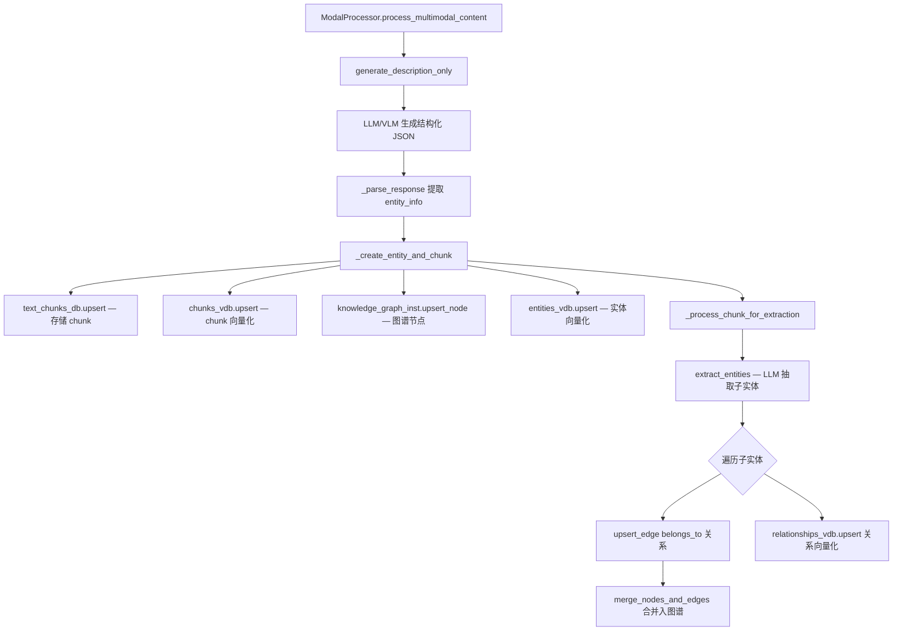
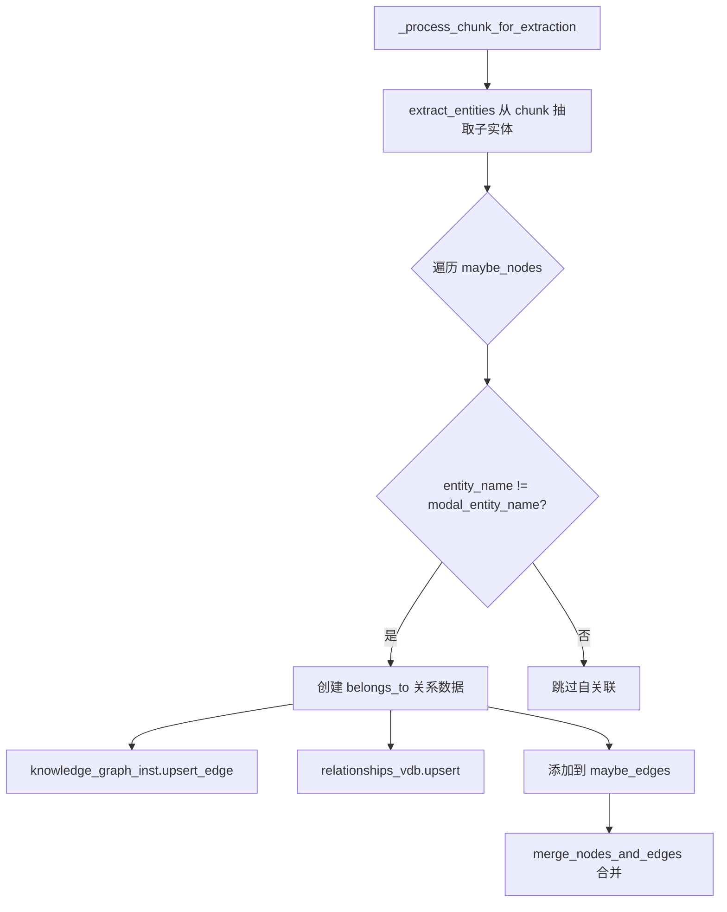

# PD-104.02 RAG-Anything — LLM 驱动多模态知识图谱构建

> 文档编号：PD-104.02
> 来源：RAG-Anything `raganything/modalprocessors.py`, `raganything/processor.py`, `raganything/raganything.py`
> GitHub：https://github.com/HKUDS/RAG-Anything.git
> 问题域：PD-104 知识图谱构建 Knowledge Graph Construction
> 状态：可复用方案

---

## 第 1 章 问题与动机（≥ 30 行）

### 1.1 核心问题

传统 RAG 系统仅处理纯文本，将文档切分为 chunk 后做向量检索。但真实文档（PDF、论文、报告）包含大量图片、表格、公式等多模态内容，这些内容蕴含的实体和关系在纯文本 RAG 中完全丢失。

核心挑战：
- **多模态实体识别**：图片中的架构图、表格中的数据实体、公式中的变量，如何统一抽取为知识图谱节点？
- **跨模态关系建立**：文本中提到的概念与图片/表格中的实体之间的关联如何自动发现？
- **增量图谱构建**：新文档插入时，如何与已有图谱实体去重合并，而非重建？

### 1.2 RAG-Anything 的解法概述

RAG-Anything 基于 LightRAG 的图谱引擎，扩展了多模态实体抽取能力，核心设计：

1. **模态分离 + 专用处理器**：`separate_content()` 将文档拆分为文本和多模态两条流水线（`raganything/utils.py:13`），每种模态有专用 Processor
2. **LLM 驱动实体抽取**：每个 ModalProcessor 调用 LLM/VLM 生成结构化描述，再通过 LightRAG 的 `extract_entities()` 统一抽取实体关系（`raganything/modalprocessors.py:728`）
3. **belongs_to 层级关系**：多模态实体（如"Figure 3"）通过 `belongs_to` 边与从其描述中抽取的子实体关联（`raganything/modalprocessors.py:736-769`）
4. **双阶段批处理**：Stage 1 并发生成描述，Stage 2 批量抽取实体并合并（`raganything/processor.py:703-878`）
5. **图谱+向量双写**：实体同时写入知识图谱（`upsert_node`）和向量库（`entities_vdb.upsert`），关系同理（`raganything/modalprocessors.py:515-529`）

### 1.3 设计思想

| 设计原则 | 具体实现 | 理由 | 替代方案 |
|----------|----------|------|----------|
| 模态专用处理 | Image/Table/Equation/Generic 四类 Processor | 不同模态需要不同的 prompt 和解析策略 | 统一 Processor（丢失模态特征） |
| LLM 作为实体抽取器 | `extract_entities()` 用 LLM 从 chunk 文本中抽取 | 无需预定义 schema，适应任意领域 | NER 模型（需要训练数据） |
| belongs_to 层级关系 | 多模态实体自动与子实体建立从属边 | 保留多模态内容的层级结构 | 扁平化（丢失结构信息） |
| 图谱+向量双写 | 实体同时入图数据库和向量库 | 支持图遍历和语义检索两种查询模式 | 仅图谱（无法语义搜索） |
| 上下文感知描述 | ContextExtractor 提供周围页面文本作为 prompt 上下文 | 多模态内容需要文档上下文才能准确理解 | 无上下文（描述质量差） |

---

## 第 2 章 源码实现分析（≥ 60 行，核心章节）

### 2.1 架构概览

RAG-Anything 的知识图谱构建分为三层：

```
┌─────────────────────────────────────────────────────────────┐
│                    RAGAnything (入口层)                       │
│  raganything.py — 初始化 LightRAG + 注册 ModalProcessors     │
├─────────────────────────────────────────────────────────────┤
│                  ProcessorMixin (编排层)                      │
│  processor.py — 文档解析 → 内容分离 → 批处理编排              │
│  ┌──────────────────────────────────────────────────┐       │
│  │ Stage 1: 并发描述生成 (generate_description_only) │       │
│  │ Stage 2: 批量实体抽取 (extract_entities)          │       │
│  │ Stage 3: belongs_to 关系注入                      │       │
│  │ Stage 4: 批量合并 (merge_nodes_and_edges)         │       │
│  └──────────────────────────────────────────────────┘       │
├─────────────────────────────────────────────────────────────┤
│              ModalProcessors (模态处理层)                     │
│  modalprocessors.py — Image/Table/Equation/Generic          │
│  ┌──────────┐ ┌──────────┐ ┌──────────┐ ┌──────────┐      │
│  │  Image   │ │  Table   │ │ Equation │ │ Generic  │      │
│  │Processor │ │Processor │ │Processor │ │Processor │      │
│  └────┬─────┘ └────┬─────┘ └────┬─────┘ └────┬─────┘      │
│       └─────────────┴────────────┴─────────────┘            │
│                BaseModalProcessor                            │
│  _create_entity_and_chunk() + _process_chunk_for_extraction()│
├─────────────────────────────────────────────────────────────┤
│                   LightRAG (图谱引擎层)                      │
│  extract_entities() → merge_nodes_and_edges()                │
│  knowledge_graph_inst / entities_vdb / relationships_vdb     │
└─────────────────────────────────────────────────────────────┘
```

### 2.2 核心实现

#### 2.2.1 多模态实体创建与图谱双写



对应源码 `raganything/modalprocessors.py:465-545`：
```python
async def _create_entity_and_chunk(
    self,
    modal_chunk: str,
    entity_info: Dict[str, Any],
    file_path: str,
    batch_mode: bool = False,
    doc_id: str = None,
    chunk_order_index: int = 0,
) -> Tuple[str, Dict[str, Any]]:
    """Create entity and text chunk"""
    # Create chunk
    chunk_id = compute_mdhash_id(str(modal_chunk), prefix="chunk-")
    tokens = len(self.tokenizer.encode(modal_chunk))
    actual_doc_id = doc_id if doc_id else chunk_id

    chunk_data = {
        "tokens": tokens,
        "content": modal_chunk,
        "chunk_order_index": chunk_order_index,
        "full_doc_id": actual_doc_id,
        "file_path": file_path,
    }

    # Store chunk in text DB and vector DB
    await self.text_chunks_db.upsert({chunk_id: chunk_data})
    await self.chunks_vdb.upsert({chunk_id: {
        "content": modal_chunk,
        "full_doc_id": actual_doc_id,
        "tokens": tokens,
        "chunk_order_index": chunk_order_index,
        "file_path": file_path,
    }})

    # Create entity node in knowledge graph
    node_data = {
        "entity_id": entity_info["entity_name"],
        "entity_type": entity_info["entity_type"],
        "description": entity_info["summary"],
        "source_id": chunk_id,
        "file_path": file_path,
        "created_at": int(time.time()),
    }
    await self.knowledge_graph_inst.upsert_node(
        entity_info["entity_name"], node_data
    )

    # Insert entity into vector database
    entity_vdb_data = {
        compute_mdhash_id(entity_info["entity_name"], prefix="ent-"): {
            "entity_name": entity_info["entity_name"],
            "content": f"{entity_info['entity_name']}\n{entity_info['summary']}",
            "source_id": chunk_id,
        }
    }
    await self.entities_vdb.upsert(entity_vdb_data)

    # Process entity and relationship extraction
    chunk_results = await self._process_chunk_for_extraction(
        chunk_id, entity_info["entity_name"], batch_mode
    )
    return entity_info["summary"], {...}, chunk_results
```

#### 2.2.2 belongs_to 关系注入



对应源码 `raganything/modalprocessors.py:699-793`：
```python
async def _process_chunk_for_extraction(
    self, chunk_id: str, modal_entity_name: str, batch_mode: bool = False
):
    """Process chunk for entity and relationship extraction"""
    chunk_data = await self.text_chunks_db.get_by_id(chunk_id)
    chunks = {chunk_id: chunk_data}

    # Extract entities and relationships via LLM
    chunk_results = await extract_entities(
        chunks=chunks,
        global_config=self.global_config,
        pipeline_status=pipeline_status,
        pipeline_status_lock=pipeline_status_lock,
        llm_response_cache=self.hashing_kv,
    )

    # Add "belongs_to" relationships for all extracted entities
    for maybe_nodes, maybe_edges in chunk_results:
        for entity_name in maybe_nodes.keys():
            if entity_name != modal_entity_name:  # Skip self-relationship
                relation_data = {
                    "description": f"Entity {entity_name} belongs to {modal_entity_name}",
                    "keywords": "belongs_to,part_of,contained_in",
                    "source_id": chunk_id,
                    "weight": 10.0,
                }
                await self.knowledge_graph_inst.upsert_edge(
                    entity_name, modal_entity_name, relation_data
                )
                # Also store in vector DB for semantic search
                await self.relationships_vdb.upsert(relation_vdb_data)

    if not batch_mode:
        await merge_nodes_and_edges(
            chunk_results=chunk_results,
            knowledge_graph_inst=self.knowledge_graph_inst,
            entity_vdb=self.entities_vdb,
            relationships_vdb=self.relationships_vdb,
            global_config=self.global_config,
            ...
        )
        await self.lightrag._insert_done()
    return processed_chunk_results
```

### 2.3 实现细节

#### 批处理 7 阶段流水线

`ProcessorMixin._process_multimodal_content_batch_type_aware()` 实现了完整的批处理流水线（`raganything/processor.py:703-878`）：

| 阶段 | 方法 | 作用 |
|------|------|------|
| Stage 1 | `generate_description_only()` | 并发调用 LLM/VLM 生成多模态描述 |
| Stage 2 | `_convert_to_lightrag_chunks_type_aware()` | 将描述转为 LightRAG 标准 chunk 格式 |
| Stage 3 | `_store_chunks_to_lightrag_storage_type_aware()` | 存储 chunk 到 text_chunks + chunks_vdb |
| Stage 3.5 | `_store_multimodal_main_entities()` | 存储多模态主实体到 entities_vdb + full_entities |
| Stage 4 | `_batch_extract_entities_lightrag_style_type_aware()` | 批量 LLM 实体关系抽取 |
| Stage 5 | `_batch_add_belongs_to_relations_type_aware()` | 注入 belongs_to 层级关系 |
| Stage 6 | `_batch_merge_lightrag_style_type_aware()` | 批量合并节点和边到图谱 |
| Stage 7 | `_update_doc_status_with_chunks_type_aware()` | 更新文档状态 |

#### 上下文感知描述生成

`ContextExtractor`（`raganything/modalprocessors.py:49-357`）为多模态内容提供周围文本上下文：

- 支持 `page` 模式（按页面窗口）和 `chunk` 模式（按 chunk 索引窗口）
- 可配置窗口大小 `context_window`、最大 token 数 `max_context_tokens`
- 自动截断到句子边界，支持 tokenizer 精确计数

#### 模态 chunk 模板

每种模态有专用的 chunk 模板（`raganything/prompt.py:275-300`），将原始内容 + LLM 增强描述格式化为统一的文本 chunk，供 `extract_entities()` 处理：

```python
# Image chunk template
PROMPTS["image_chunk"] = """
Image Content Analysis:
Image Path: {image_path}
Captions: {captions}
Footnotes: {footnotes}
Visual Analysis: {enhanced_caption}"""

# Table chunk template
PROMPTS["table_chunk"] = """Table Analysis:
Image Path: {table_img_path}
Caption: {table_caption}
Structure: {table_body}
Footnotes: {table_footnote}
Analysis: {enhanced_caption}"""
```


---

## 第 3 章 迁移指南（≥ 40 行）

### 3.1 迁移清单

**阶段 1：基础图谱构建（纯文本）**
- [ ] 集成 LightRAG 或等效图谱引擎，确保 `extract_entities()` 和 `merge_nodes_and_edges()` 可用
- [ ] 实现 chunk 存储双写：text_chunks_db（KV 存储）+ chunks_vdb（向量库）
- [ ] 实现实体存储双写：knowledge_graph（图数据库）+ entities_vdb（向量库）

**阶段 2：多模态处理器**
- [ ] 实现 `BaseModalProcessor` 基类，封装 chunk 创建 + 实体注册 + 关系抽取
- [ ] 按需实现 Image/Table/Equation/Generic 子类
- [ ] 实现 `ContextExtractor`，为多模态内容提供文档上下文

**阶段 3：belongs_to 关系**
- [ ] 在实体抽取后遍历子实体，为每个子实体创建 `belongs_to` 边指向多模态主实体
- [ ] 关系同时写入图数据库和向量库

**阶段 4：批处理优化**
- [ ] 实现 Semaphore 控制并发数
- [ ] Stage 1 并发描述生成 + Stage 2 批量实体抽取分离
- [ ] 实现 fallback：批处理失败时降级为逐个处理

### 3.2 适配代码模板

以下模板展示如何在自己的项目中实现多模态实体的图谱双写 + belongs_to 关系：

```python
import asyncio
from dataclasses import dataclass
from typing import Dict, Any, List, Tuple
import hashlib
import time


@dataclass
class EntityInfo:
    entity_name: str
    entity_type: str
    summary: str


class MultimodalKGBuilder:
    """可移植的多模态知识图谱构建器"""

    def __init__(self, graph_store, vector_store, llm_func, embedding_func):
        self.graph = graph_store        # 图数据库（Neo4j/NetworkX/etc）
        self.vector = vector_store      # 向量库（Milvus/Chroma/etc）
        self.llm = llm_func            # LLM 调用函数
        self.embed = embedding_func     # Embedding 函数

    async def process_multimodal_item(
        self,
        content: str,
        content_type: str,
        context: str = "",
        doc_id: str = None,
    ) -> Tuple[EntityInfo, List[Tuple[str, str, Dict]]]:
        """处理单个多模态内容，返回主实体和关系列表"""

        # Step 1: LLM 生成结构化描述
        prompt = self._build_description_prompt(content, content_type, context)
        response = await self.llm(prompt)
        entity_info = self._parse_entity_info(response)

        # Step 2: 创建 chunk 并双写存储
        chunk_id = hashlib.md5(content.encode()).hexdigest()
        chunk_data = {"content": content, "doc_id": doc_id or chunk_id}

        await self.vector.upsert_chunk(chunk_id, chunk_data)

        # Step 3: 创建主实体节点（图谱 + 向量双写）
        await self.graph.upsert_node(entity_info.entity_name, {
            "entity_type": entity_info.entity_type,
            "description": entity_info.summary,
            "source_id": chunk_id,
            "created_at": int(time.time()),
        })
        await self.vector.upsert_entity(entity_info.entity_name, entity_info.summary)

        # Step 4: LLM 抽取子实体
        sub_entities = await self._extract_sub_entities(content)

        # Step 5: 建立 belongs_to 关系
        relations = []
        for sub_entity in sub_entities:
            if sub_entity.entity_name != entity_info.entity_name:
                rel = {
                    "description": f"{sub_entity.entity_name} belongs to {entity_info.entity_name}",
                    "keywords": "belongs_to,part_of",
                    "weight": 10.0,
                    "source_id": chunk_id,
                }
                await self.graph.upsert_edge(
                    sub_entity.entity_name, entity_info.entity_name, rel
                )
                await self.vector.upsert_relation(
                    sub_entity.entity_name, entity_info.entity_name, rel
                )
                relations.append((sub_entity.entity_name, entity_info.entity_name, rel))

        return entity_info, relations

    async def batch_process(
        self,
        items: List[Dict[str, Any]],
        max_concurrent: int = 4,
    ):
        """批量处理多模态内容"""
        semaphore = asyncio.Semaphore(max_concurrent)

        async def _process_one(item):
            async with semaphore:
                return await self.process_multimodal_item(
                    content=item["content"],
                    content_type=item["type"],
                    context=item.get("context", ""),
                    doc_id=item.get("doc_id"),
                )

        tasks = [asyncio.create_task(_process_one(item)) for item in items]
        return await asyncio.gather(*tasks, return_exceptions=True)

    def _build_description_prompt(self, content, content_type, context):
        return f"Analyze this {content_type} content and extract entities.\nContext: {context}\nContent: {content}"

    def _parse_entity_info(self, response) -> EntityInfo:
        # 实际项目中应使用 robust JSON parsing
        import json
        data = json.loads(response)
        return EntityInfo(**data["entity_info"])

    async def _extract_sub_entities(self, content) -> List[EntityInfo]:
        # 委托给 LLM 抽取
        response = await self.llm(f"Extract entities from: {content}")
        # ... parse response
        return []
```

### 3.3 适用场景

| 场景 | 适用度 | 说明 |
|------|--------|------|
| 学术论文 RAG | ⭐⭐⭐ | 论文含大量图表公式，多模态实体抽取价值最高 |
| 技术文档知识库 | ⭐⭐⭐ | 架构图、配置表、API 文档的结构化抽取 |
| 企业报告分析 | ⭐⭐ | 财务表格、趋势图的实体关系构建 |
| 纯文本知识库 | ⭐ | 无多模态内容时退化为标准 LightRAG |
| 实时流式处理 | ⭐ | 批处理设计，不适合低延迟场景 |

---

## 第 4 章 测试用例（≥ 20 行）

```python
import pytest
import asyncio
from unittest.mock import AsyncMock, MagicMock, patch
from dataclasses import dataclass


class TestMultimodalKGConstruction:
    """测试多模态知识图谱构建核心流程"""

    @pytest.fixture
    def mock_graph_store(self):
        store = AsyncMock()
        store.upsert_node = AsyncMock()
        store.upsert_edge = AsyncMock()
        return store

    @pytest.fixture
    def mock_vector_store(self):
        store = AsyncMock()
        store.upsert = AsyncMock()
        return store

    @pytest.mark.asyncio
    async def test_entity_creation_dual_write(self, mock_graph_store, mock_vector_store):
        """验证实体同时写入图谱和向量库"""
        # Arrange
        entity_name = "Figure 3 (image)"
        entity_data = {
            "entity_name": entity_name,
            "entity_type": "image",
            "summary": "Architecture diagram showing the pipeline",
        }

        # Act: 模拟 _create_entity_and_chunk 的双写逻辑
        await mock_graph_store.upsert_node(entity_name, {
            "entity_type": "image",
            "description": entity_data["summary"],
        })
        await mock_vector_store.upsert({
            "ent-xxx": {
                "entity_name": entity_name,
                "content": f"{entity_name}\n{entity_data['summary']}",
            }
        })

        # Assert
        mock_graph_store.upsert_node.assert_called_once()
        mock_vector_store.upsert.assert_called_once()

    @pytest.mark.asyncio
    async def test_belongs_to_relation_creation(self, mock_graph_store):
        """验证 belongs_to 关系正确建立"""
        modal_entity = "Table 1 (table)"
        sub_entities = ["accuracy", "precision", "recall"]

        # Act: 模拟 belongs_to 关系注入
        for sub_entity in sub_entities:
            await mock_graph_store.upsert_edge(
                sub_entity, modal_entity, {
                    "description": f"Entity {sub_entity} belongs to {modal_entity}",
                    "keywords": "belongs_to,part_of,contained_in",
                    "weight": 10.0,
                }
            )

        # Assert: 3 个子实体 → 3 条 belongs_to 边
        assert mock_graph_store.upsert_edge.call_count == 3

    @pytest.mark.asyncio
    async def test_self_relation_skipped(self, mock_graph_store):
        """验证不会创建自关联的 belongs_to"""
        modal_entity = "Figure 1 (image)"
        extracted_entities = ["Figure 1 (image)", "CNN", "ResNet"]

        for entity in extracted_entities:
            if entity != modal_entity:
                await mock_graph_store.upsert_edge(entity, modal_entity, {})

        # Assert: 跳过自关联，只有 2 条边
        assert mock_graph_store.upsert_edge.call_count == 2

    @pytest.mark.asyncio
    async def test_context_extraction_page_mode(self):
        """验证上下文提取的页面模式"""
        from raganything.modalprocessors import ContextExtractor, ContextConfig

        config = ContextConfig(context_window=1, context_mode="page")
        extractor = ContextExtractor(config=config)

        content_list = [
            {"type": "text", "text": "Page 0 content", "page_idx": 0},
            {"type": "text", "text": "Page 1 content", "page_idx": 1},
            {"type": "text", "text": "Page 2 content", "page_idx": 2},
            {"type": "text", "text": "Page 3 content", "page_idx": 3},
        ]

        # 提取 page_idx=1 的上下文，窗口=1 → 应包含 page 0 和 page 2
        context = extractor.extract_context(
            content_list, {"page_idx": 1}, content_format="minerU"
        )
        assert "Page 0" in context
        assert "Page 2" in context
        assert "Page 3" not in context  # 超出窗口

    @pytest.mark.asyncio
    async def test_batch_processing_fallback(self):
        """验证批处理失败时降级为逐个处理"""
        # 模拟 batch 处理抛出异常
        # processor._process_multimodal_content 应 catch 并调用 _individual
        # 这验证了 processor.py:537-543 的 fallback 逻辑
        pass  # 需要完整 LightRAG 环境
```


---

## 第 5 章 跨域关联

| 关联域 | 关系类型 | 说明 |
|--------|----------|------|
| PD-01 上下文管理 | 协同 | ContextExtractor 管理多模态内容的上下文窗口，与 token 预算控制相关 |
| PD-03 容错与重试 | 协同 | 批处理失败时 fallback 到逐个处理（`processor.py:537-543`），robust JSON parsing 多策略降级 |
| PD-08 搜索与检索 | 依赖 | 图谱+向量双写是为了支持图遍历检索和语义向量检索两种查询模式 |
| PD-10 中间件管道 | 协同 | 7 阶段批处理流水线本质上是一个中间件管道，每个 Stage 可独立替换 |
| PD-103 批量并发处理 | 依赖 | Semaphore 控制并发、asyncio.gather 并行描述生成直接复用并发控制模式 |

---

## 第 6 章 来源文件索引

| 文件 | 行范围 | 关键实现 |
|------|--------|----------|
| `raganything/modalprocessors.py` | L33-46 | ContextConfig 数据类定义 |
| `raganything/modalprocessors.py` | L49-357 | ContextExtractor 上下文提取器 |
| `raganything/modalprocessors.py` | L360-404 | BaseModalProcessor 基类初始化 |
| `raganything/modalprocessors.py` | L465-545 | `_create_entity_and_chunk()` 实体创建与图谱双写 |
| `raganything/modalprocessors.py` | L699-793 | `_process_chunk_for_extraction()` 子实体抽取 + belongs_to 关系注入 |
| `raganything/modalprocessors.py` | L796-1029 | ImageModalProcessor 图片处理器 |
| `raganything/modalprocessors.py` | L1032-1223 | TableModalProcessor 表格处理器 |
| `raganything/modalprocessors.py` | L1226-1407 | EquationModalProcessor 公式处理器 |
| `raganything/processor.py` | L703-878 | `_process_multimodal_content_batch_type_aware()` 7 阶段批处理 |
| `raganything/processor.py` | L1020-1112 | `_store_multimodal_main_entities()` 多模态主实体存储 |
| `raganything/processor.py` | L1173-1200 | `_batch_extract_entities_lightrag_style_type_aware()` 批量实体抽取 |
| `raganything/processor.py` | L1202-1264 | `_batch_add_belongs_to_relations_type_aware()` 批量 belongs_to 注入 |
| `raganything/raganything.py` | L177-219 | `_initialize_processors()` 处理器注册 |
| `raganything/utils.py` | L13-56 | `separate_content()` 文本/多模态内容分离 |
| `raganything/prompt.py` | L275-300 | 模态 chunk 模板（image/table/equation/generic） |

---

## 第 7 章 横向对比维度

```json comparison_data
{
  "project": "RAG-Anything",
  "dimensions": {
    "实体抽取方式": "LightRAG extract_entities LLM 抽取，无预定义 schema",
    "多模态支持": "Image/Table/Equation/Generic 四类专用 Processor + VLM",
    "关系构建策略": "LLM 抽取 + belongs_to 层级关系自动注入，weight=10.0",
    "图谱存储": "图数据库 + 向量库双写，支持图遍历和语义检索",
    "增量更新": "upsert 语义，chunk_id 基于内容 MD5 哈希自动去重",
    "上下文感知": "ContextExtractor 页面/chunk 窗口模式，tokenizer 精确截断"
  }
}
```

### 域元数据补充

```json domain_metadata
{
  "solution_summary": "RAG-Anything 通过 4 类专用 ModalProcessor + LightRAG extract_entities 实现多模态实体抽取，自动注入 belongs_to 层级关系，图谱+向量双写支持双模检索",
  "description": "多模态内容（图片/表格/公式）的实体抽取与图谱层级关系自动构建",
  "sub_problems": [
    "上下文感知的多模态描述生成（页面窗口 vs chunk 窗口）",
    "LLM 响应的鲁棒 JSON 解析（4 级降级策略）",
    "批处理与逐个处理的 fallback 切换"
  ],
  "best_practices": [
    "为多模态 chunk 使用专用模板格式化后再送入实体抽取",
    "批处理分 Stage 1 并发描述 + Stage 2 批量抽取，降低 LLM 调用延迟",
    "belongs_to 关系设置高权重(10.0)确保图遍历时优先发现层级结构"
  ]
}
```
