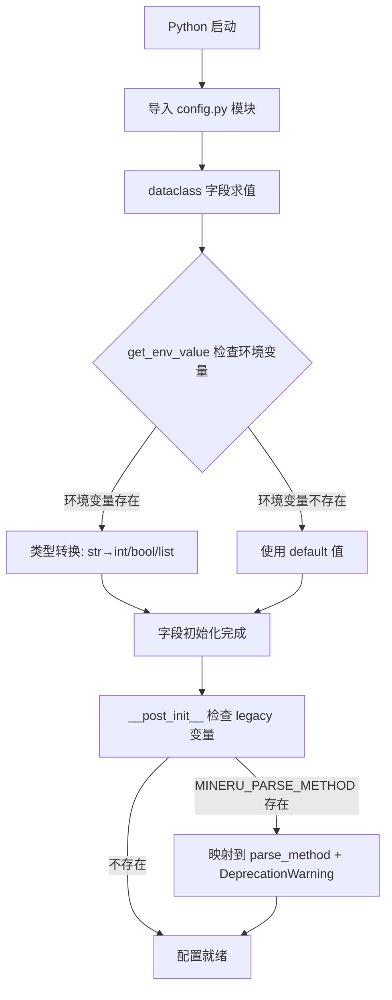
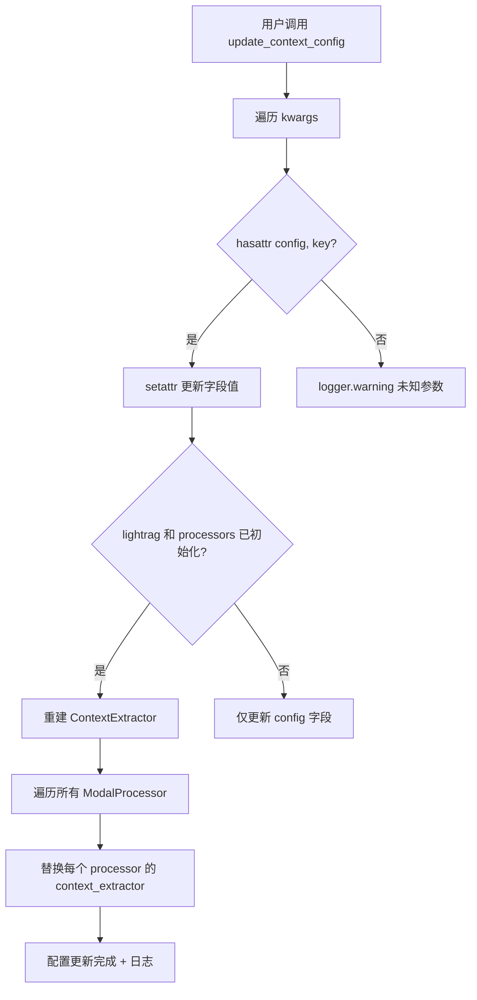

# PD-105.01 RAG-Anything — 环境变量驱动 Dataclass 配置系统

> 文档编号：PD-105.01
> 来源：RAG-Anything `raganything/config.py`, `raganything/raganything.py`
> GitHub：https://github.com/HKUDS/RAG-Anything.git
> 问题域：PD-105 配置管理 Configuration Management
> 状态：可复用方案

---

## 第 1 章 问题与动机

### 1.1 核心问题

多模态 RAG 系统涉及文档解析器选择、多模态处理开关、批处理并发度、上下文窗口参数、路径策略等十余个维度的配置。这些配置需要满足：

1. **环境感知**：同一份代码在开发/测试/生产环境中使用不同参数，不改代码
2. **零配置启动**：所有配置项都有合理默认值，`RAGAnythingConfig()` 即可开箱即用
3. **运行时可调**：处理不同文档时可能需要动态调整上下文窗口、并发度等参数
4. **向后兼容**：重命名配置项时不能破坏已有用户的环境变量设置
5. **类型安全**：环境变量是字符串，但配置项需要 int/bool/list 等类型

传统做法（dict/JSON/YAML）缺乏类型提示和 IDE 补全，纯 Pydantic 方案又引入额外依赖。RAG-Anything 选择了 Python 标准库 `dataclass` + LightRAG 的 `get_env_value` 工具函数，实现了轻量但完整的配置管理。

### 1.2 RAG-Anything 的解法概述

1. **单 dataclass 集中定义**：`RAGAnythingConfig` 用 `@dataclass` 定义 18 个配置字段，按功能分 6 组（目录/解析/多模态/批处理/上下文/路径），每个字段都有 docstring（`config.py:13-108`）
2. **环境变量即配置源**：每个字段的 `default` 调用 `get_env_value("ENV_KEY", default, type)`，实现环境变量 → 类型转换 → 默认值三级回退（`config.py:18-108`）
3. **运行时动态更新**：`update_config(**kwargs)` 和 `update_context_config(**kwargs)` 支持运行时修改配置并级联刷新处理器（`raganything.py:222-551`）
4. **Legacy 兼容层**：`__post_init__` 检测旧环境变量名 `MINERU_PARSE_METHOD`，自动映射到新名 `PARSE_METHOD` 并发出 `DeprecationWarning`（`config.py:111-123`）
5. **配置自省**：`get_config_info()` 返回结构化配置快照，按分组组织，过滤敏感信息（`raganything.py:437-491`）

### 1.3 设计思想

| 设计原则 | 具体实现 | 理由 | 替代方案 |
|----------|----------|------|----------|
| 零依赖配置 | `@dataclass` + `get_env_value` | 不引入 Pydantic/dynaconf 等外部依赖 | Pydantic BaseSettings |
| 环境变量优先 | `field(default=get_env_value(...))` | 12-Factor App 原则，容器化友好 | .env 文件 / YAML |
| 分组注释 | `# Directory Configuration` 等分隔注释 | 18 个字段需要逻辑分组提高可读性 | 嵌套 dataclass |
| 向后兼容 | `@property` + `DeprecationWarning` | 平滑迁移，不破坏已有用户 | 直接删除旧字段 |
| 运行时可变 | `setattr` 动态更新 + 处理器级联刷新 | 不同文档可能需要不同配置 | 重新实例化 |
| 配置透传 | `lightrag_kwargs: Dict` 透传下游参数 | 不需要为 LightRAG 的每个参数建字段 | 全量映射 |

---

## 第 2 章 源码实现分析

### 2.1 架构概览

RAG-Anything 的配置系统由三层组成：

```
┌─────────────────────────────────────────────────────────┐
│                    环境变量层                              │
│  WORKING_DIR, PARSER, ENABLE_IMAGE_PROCESSING, ...      │
│  MINERU_PARSE_METHOD (legacy)                           │
└──────────────────────┬──────────────────────────────────┘
                       │ get_env_value(key, default, type)
                       ▼
┌─────────────────────────────────────────────────────────┐
│              RAGAnythingConfig (@dataclass)              │
│  ┌──────────┐ ┌──────────┐ ┌───────────┐ ┌──────────┐  │
│  │ 目录配置  │ │ 解析配置  │ │ 多模态配置 │ │ 批处理配置│  │
│  │working_dir│ │parser    │ │enable_img │ │max_conc  │  │
│  │output_dir │ │method    │ │enable_tbl │ │extensions│  │
│  └──────────┘ └──────────┘ └───────────┘ └──────────┘  │
│  ┌──────────────┐ ┌──────────┐                          │
│  │ 上下文提取配置 │ │ 路径配置  │                          │
│  │context_window│ │use_full  │                          │
│  │context_mode  │ │_path     │                          │
│  └──────────────┘ └──────────┘                          │
└──────────────────────┬──────────────────────────────────┘
                       │ self.config
                       ▼
┌─────────────────────────────────────────────────────────┐
│              RAGAnything (主类 + 3 Mixin)                 │
│  ┌────────────┐ ┌──────────────┐ ┌───────────────┐      │
│  │ProcessorMix│ │  BatchMixin  │ │  QueryMixin   │      │
│  │config.parser│ │config.max_  │ │               │      │
│  │config.path │ │concurrent   │ │               │      │
│  └────────────┘ └──────────────┘ └───────────────┘      │
│         │                │                               │
│         ▼                ▼                               │
│  ┌─────────────────────────────────────┐                │
│  │  ContextConfig → ContextExtractor   │                │
│  │  → ModalProcessors (image/table/eq) │                │
│  └─────────────────────────────────────┘                │
└─────────────────────────────────────────────────────────┘
```

### 2.2 核心实现

#### 2.2.1 环境变量驱动的 Dataclass 定义



对应源码 `raganything/config.py:12-123`：

```python
@dataclass
class RAGAnythingConfig:
    """Configuration class for RAGAnything with environment variable support"""

    # Directory Configuration
    working_dir: str = field(default=get_env_value("WORKING_DIR", "./rag_storage", str))

    # Parser Configuration
    parse_method: str = field(default=get_env_value("PARSE_METHOD", "auto", str))
    parser_output_dir: str = field(default=get_env_value("OUTPUT_DIR", "./output", str))
    parser: str = field(default=get_env_value("PARSER", "mineru", str))
    display_content_stats: bool = field(
        default=get_env_value("DISPLAY_CONTENT_STATS", True, bool)
    )

    # Multimodal Processing Configuration
    enable_image_processing: bool = field(
        default=get_env_value("ENABLE_IMAGE_PROCESSING", True, bool)
    )
    enable_table_processing: bool = field(
        default=get_env_value("ENABLE_TABLE_PROCESSING", True, bool)
    )
    enable_equation_processing: bool = field(
        default=get_env_value("ENABLE_EQUATION_PROCESSING", True, bool)
    )

    # Batch Processing — List 类型用 default_factory + lambda
    supported_file_extensions: List[str] = field(
        default_factory=lambda: get_env_value(
            "SUPPORTED_FILE_EXTENSIONS",
            ".pdf,.jpg,.jpeg,.png,.bmp,.tiff,.tif,.gif,.webp,.doc,.docx,.ppt,.pptx,.xls,.xlsx,.txt,.md",
            str,
        ).split(",")
    )

    def __post_init__(self):
        """Legacy 环境变量向后兼容"""
        legacy_parse_method = get_env_value("MINERU_PARSE_METHOD", None, str)
        if legacy_parse_method and not get_env_value("PARSE_METHOD", None, str):
            self.parse_method = legacy_parse_method
            import warnings
            warnings.warn(
                "MINERU_PARSE_METHOD is deprecated. Use PARSE_METHOD instead.",
                DeprecationWarning, stacklevel=2,
            )
```

关键设计点：
- `field(default=get_env_value(...))` 在模块导入时求值，环境变量在类定义时就被读取
- `List[str]` 类型使用 `default_factory=lambda` 延迟求值，避免可变默认值陷阱
- `__post_init__` 处理 legacy 变量映射，仅在新变量未设置时生效

#### 2.2.2 运行时配置更新与级联刷新



对应源码 `raganything/raganything.py:521-551`：

```python
def update_context_config(self, **context_kwargs):
    """Update context extraction configuration"""
    # 1. 更新 config 字段
    for key, value in context_kwargs.items():
        if hasattr(self.config, key):
            setattr(self.config, key, value)
            self.logger.debug(f"Updated context config: {key} = {value}")
        else:
            self.logger.warning(f"Unknown context config parameter: {key}")

    # 2. 级联刷新：重建 ContextExtractor 并注入所有处理器
    if self.lightrag and self.modal_processors:
        try:
            self.context_extractor = self._create_context_extractor()
            for processor_name, processor in self.modal_processors.items():
                processor.context_extractor = self.context_extractor
            self.logger.info("Context configuration updated and applied to all processors")
        except Exception as e:
            self.logger.error(f"Failed to update context configuration: {e}")
```

关键设计点：
- `update_config` 是通用更新（`raganything.py:222-229`），`update_context_config` 是上下文专用更新，后者额外触发处理器级联刷新
- 使用 `hasattr` 做字段存在性检查，未知参数只 warning 不报错，保持宽容性
- 级联刷新通过重建 `ContextExtractor` 实例并替换所有处理器的引用实现

### 2.3 实现细节

#### 配置到处理器的桥接：ContextConfig

`RAGAnythingConfig` 包含上下文相关的 6 个字段，但 `ContextExtractor` 需要的是独立的 `ContextConfig` 对象。桥接通过 `_create_context_config()` 实现（`raganything.py:154-163`）：

```python
def _create_context_config(self) -> ContextConfig:
    return ContextConfig(
        context_window=self.config.context_window,
        context_mode=self.config.context_mode,
        max_context_tokens=self.config.max_context_tokens,
        include_headers=self.config.include_headers,
        include_captions=self.config.include_captions,
        filter_content_types=self.config.context_filter_content_types,
    )
```

这种"大 Config → 小 Config"的映射模式避免了将整个 `RAGAnythingConfig` 暴露给下游组件，实现了关注点分离。

#### 配置自省与安全过滤

`get_config_info()` 返回结构化配置快照（`raganything.py:437-491`），按 6 个分组组织。对 `lightrag_kwargs` 中的敏感数据（callable 对象、模型密钥参数）做了过滤：

```python
safe_kwargs = {
    k: v for k, v in self.lightrag_kwargs.items()
    if not callable(v)
    and k not in ["llm_model_kwargs", "vector_db_storage_cls_kwargs"]
}
```

#### Mixin 中的配置消费模式

三个 Mixin 通过 `self.config` 访问配置，使用 TYPE_CHECKING 避免循环导入（`batch.py:15-23`）：

```python
if TYPE_CHECKING:
    from .config import RAGAnythingConfig

class BatchMixin:
    config: "RAGAnythingConfig"  # 类型提示，运行时由 RAGAnything 提供
```

`BatchMixin.process_folder_complete` 展示了典型的"参数优先 → 配置兜底"模式（`batch.py:60-71`）：

```python
if output_dir is None:
    output_dir = self.config.parser_output_dir
if parse_method is None:
    parse_method = self.config.parse_method
if max_workers is None:
    max_workers = self.config.max_concurrent_files
```

---

## 第 3 章 迁移指南

### 3.1 迁移清单

**阶段 1：基础配置类（1 个文件）**

- [ ] 创建 `config.py`，定义 `@dataclass` 配置类
- [ ] 实现 `get_env_value(key, default, type)` 工具函数（或从 lightrag 复用）
- [ ] 为每个字段添加 `field(default=get_env_value(...))` 环境变量绑定
- [ ] 按功能分组添加注释分隔符

**阶段 2：运行时更新（主类集成）**

- [ ] 在主类中添加 `update_config(**kwargs)` 通用更新方法
- [ ] 如有下游组件依赖配置，实现级联刷新逻辑
- [ ] 添加 `get_config_info()` 配置自省方法

**阶段 3：向后兼容（可选）**

- [ ] 在 `__post_init__` 中添加 legacy 环境变量检测和映射
- [ ] 用 `@property` + `DeprecationWarning` 包装已废弃字段

### 3.2 适配代码模板

#### 通用 get_env_value 实现

```python
import os
from typing import TypeVar, Type

T = TypeVar("T")

def get_env_value(key: str, default: T, type_: Type[T] = str) -> T:
    """从环境变量读取值，支持类型转换"""
    raw = os.environ.get(key)
    if raw is None:
        return default
    if default is None and raw == "":
        return None
    if type_ is bool:
        return raw.lower() in ("true", "1", "yes")
    if type_ is int:
        return int(raw)
    if type_ is float:
        return float(raw)
    return raw
```

#### 可复用的配置基类模板

```python
from dataclasses import dataclass, field
from typing import List

@dataclass
class AppConfig:
    """应用配置 — 环境变量驱动 + 合理默认值"""

    # === 核心配置 ===
    working_dir: str = field(
        default=get_env_value("APP_WORKING_DIR", "./data", str)
    )
    """工作目录"""

    debug: bool = field(
        default=get_env_value("APP_DEBUG", False, bool)
    )
    """调试模式"""

    # === 处理配置 ===
    max_workers: int = field(
        default=get_env_value("APP_MAX_WORKERS", 4, int)
    )
    """最大并发数"""

    # === List 类型用 default_factory ===
    allowed_extensions: List[str] = field(
        default_factory=lambda: get_env_value(
            "APP_EXTENSIONS", ".pdf,.docx,.txt", str
        ).split(",")
    )
    """支持的文件扩展名"""

    def __post_init__(self):
        """Legacy 兼容 + 校验"""
        # Legacy 环境变量映射
        legacy = get_env_value("OLD_WORKING_DIR", None, str)
        if legacy and not get_env_value("APP_WORKING_DIR", None, str):
            self.working_dir = legacy
            import warnings
            warnings.warn(
                "OLD_WORKING_DIR is deprecated, use APP_WORKING_DIR",
                DeprecationWarning, stacklevel=2,
            )

    def update(self, **kwargs):
        """运行时更新配置"""
        for key, value in kwargs.items():
            if hasattr(self, key):
                setattr(self, key, value)
            else:
                raise ValueError(f"Unknown config: {key}")

    def to_dict(self) -> dict:
        """配置快照（过滤敏感信息）"""
        from dataclasses import asdict
        return asdict(self)
```

#### 级联刷新模板

```python
class Pipeline:
    def __init__(self, config: AppConfig = None):
        self.config = config or AppConfig()
        self._processors = {}

    def update_config(self, **kwargs):
        """更新配置并级联刷新下游组件"""
        self.config.update(**kwargs)
        # 级联刷新：重建受影响的组件
        if any(k.startswith("context_") for k in kwargs):
            self._rebuild_context_extractor()

    def _rebuild_context_extractor(self):
        for proc in self._processors.values():
            proc.context = self._create_context(self.config)
```

### 3.3 适用场景

| 场景 | 适用度 | 说明 |
|------|--------|------|
| 多模态处理管道 | ⭐⭐⭐ | 配置项多（解析/处理/批处理/上下文），分组管理价值大 |
| 容器化部署 | ⭐⭐⭐ | 环境变量驱动，天然适配 Docker/K8s |
| CLI 工具 | ⭐⭐⭐ | 零配置启动 + 环境变量覆盖，用户体验好 |
| 需要热更新的服务 | ⭐⭐ | `update_config` 支持运行时修改，但无持久化 |
| 多租户 SaaS | ⭐ | 单 dataclass 不支持租户级隔离，需扩展 |
| 配置项 < 5 个的小工具 | ⭐ | 过度设计，直接用函数参数更简单 |

---

## 第 4 章 测试用例

```python
import os
import warnings
import pytest
from unittest.mock import patch


class TestRAGAnythingConfig:
    """基于 raganything/config.py 真实签名的测试"""

    def test_default_values(self):
        """所有字段都有合理默认值，零配置可用"""
        # 清除可能干扰的环境变量
        env_keys = ["WORKING_DIR", "PARSER", "PARSE_METHOD", "MAX_CONCURRENT_FILES"]
        with patch.dict(os.environ, {}, clear=True):
            config = RAGAnythingConfig()
            assert config.working_dir == "./rag_storage"
            assert config.parser == "mineru"
            assert config.parse_method == "auto"
            assert config.max_concurrent_files == 1
            assert config.enable_image_processing is True
            assert config.context_window == 1
            assert config.use_full_path is False

    def test_env_override(self):
        """环境变量覆盖默认值"""
        with patch.dict(os.environ, {
            "WORKING_DIR": "/custom/path",
            "PARSER": "docling",
            "MAX_CONCURRENT_FILES": "8",
            "ENABLE_IMAGE_PROCESSING": "false",
        }):
            config = RAGAnythingConfig()
            assert config.working_dir == "/custom/path"
            assert config.parser == "docling"
            assert config.max_concurrent_files == 8
            assert config.enable_image_processing is False

    def test_list_field_from_env(self):
        """List 类型字段从逗号分隔字符串解析"""
        with patch.dict(os.environ, {
            "SUPPORTED_FILE_EXTENSIONS": ".pdf,.docx,.txt",
        }):
            config = RAGAnythingConfig()
            assert config.supported_file_extensions == [".pdf", ".docx", ".txt"]

    def test_legacy_env_compat(self):
        """Legacy 环境变量 MINERU_PARSE_METHOD 向后兼容"""
        with patch.dict(os.environ, {
            "MINERU_PARSE_METHOD": "ocr",
        }, clear=True):
            with warnings.catch_warnings(record=True) as w:
                warnings.simplefilter("always")
                config = RAGAnythingConfig()
                assert config.parse_method == "ocr"
                assert len(w) == 1
                assert "deprecated" in str(w[0].message).lower()

    def test_legacy_not_override_new(self):
        """新环境变量优先于 legacy"""
        with patch.dict(os.environ, {
            "PARSE_METHOD": "txt",
            "MINERU_PARSE_METHOD": "ocr",
        }):
            config = RAGAnythingConfig()
            assert config.parse_method == "txt"  # 新变量优先

    def test_deprecated_property(self):
        """废弃属性 mineru_parse_method 发出警告"""
        config = RAGAnythingConfig()
        with warnings.catch_warnings(record=True) as w:
            warnings.simplefilter("always")
            _ = config.mineru_parse_method
            assert len(w) == 1
            assert issubclass(w[0].category, DeprecationWarning)


class TestUpdateConfig:
    """基于 raganything/raganything.py:222-229 的运行时更新测试"""

    def test_update_known_field(self):
        """更新已知字段成功"""
        config = RAGAnythingConfig()
        # 模拟 RAGAnything.update_config 的逻辑
        for key, value in {"max_concurrent_files": 16, "parser": "docling"}.items():
            if hasattr(config, key):
                setattr(config, key, value)
        assert config.max_concurrent_files == 16
        assert config.parser == "docling"

    def test_update_unknown_field_no_crash(self):
        """更新未知字段不崩溃（只 warning）"""
        config = RAGAnythingConfig()
        unknown_key = "nonexistent_field"
        assert not hasattr(config, unknown_key)
        # RAGAnything.update_config 对未知字段只 warning，不 raise


class TestConfigInfo:
    """基于 raganything/raganything.py:437-491 的配置自省测试"""

    def test_config_info_structure(self):
        """get_config_info 返回分组结构"""
        # 验证返回的 dict 包含所有预期分组
        expected_groups = [
            "directory", "parsing", "multimodal_processing",
            "context_extraction", "batch_processing",
        ]
        # 实际测试需要完整 RAGAnything 实例，这里验证分组设计
        config = RAGAnythingConfig()
        assert hasattr(config, "working_dir")  # directory
        assert hasattr(config, "parser")  # parsing
        assert hasattr(config, "enable_image_processing")  # multimodal
        assert hasattr(config, "context_window")  # context
        assert hasattr(config, "max_concurrent_files")  # batch
```

---

## 第 5 章 跨域关联

| 关联域 | 关系类型 | 说明 |
|--------|----------|------|
| PD-101 多模态内容处理 | 协同 | `enable_image/table/equation_processing` 三个布尔开关控制多模态处理器的注册，配置变更通过 `_initialize_processors` 级联到处理器实例 |
| PD-102 文档解析管道 | 协同 | `parser`（mineru/docling）和 `parse_method`（auto/ocr/txt）决定解析管道的行为，`parser_output_dir` 控制解析输出路径 |
| PD-103 批处理并发控制 | 依赖 | `max_concurrent_files`、`supported_file_extensions`、`recursive_folder_processing` 三个配置项直接驱动 BatchMixin 的并发策略 |
| PD-104 知识图谱构建 | 协同 | `lightrag_kwargs` 透传 LightRAG 的图谱构建参数（top_k, chunk_token_size 等），配置层不直接管理但提供透传通道 |

---

## 第 6 章 来源文件索引

| 文件 | 行范围 | 关键实现 |
|------|--------|----------|
| `raganything/config.py` | L1-L153 | RAGAnythingConfig dataclass 完整定义，18 个字段 + legacy 兼容 |
| `raganything/config.py` | L12-L108 | 6 组配置字段定义，每个字段绑定 get_env_value |
| `raganything/config.py` | L111-L123 | `__post_init__` legacy 环境变量映射 |
| `raganything/config.py` | L125-L152 | `mineru_parse_method` deprecated property |
| `raganything/raganything.py` | L49-L98 | RAGAnything 主类定义，config 字段声明 |
| `raganything/raganything.py` | L99-L134 | `__post_init__` 配置消费：解析器选择、目录创建、日志输出 |
| `raganything/raganything.py` | L154-L163 | `_create_context_config` 大 Config → 小 Config 桥接 |
| `raganything/raganything.py` | L222-L229 | `update_config` 通用运行时更新 |
| `raganything/raganything.py` | L437-L491 | `get_config_info` 配置自省与安全过滤 |
| `raganything/raganything.py` | L521-L551 | `update_context_config` 级联刷新 |
| `raganything/modalprocessors.py` | L33-L46 | ContextConfig dataclass 定义 |
| `raganything/batch.py` | L15-L23 | TYPE_CHECKING 导入 + Mixin 类型提示 |
| `raganything/batch.py` | L60-L71 | 参数优先 → 配置兜底模式 |
| `raganything/processor.py` | L29-L42 | ProcessorMixin 中 config.use_full_path 消费 |

---

## 第 7 章 横向对比维度

```json comparison_data
{
  "project": "RAG-Anything",
  "dimensions": {
    "配置载体": "单 @dataclass，18 字段按 6 组注释分隔",
    "环境变量集成": "get_env_value(key, default, type) 模块导入时求值",
    "运行时更新": "update_config + update_context_config 级联刷新处理器",
    "向后兼容": "__post_init__ legacy 检测 + @property DeprecationWarning",
    "配置透传": "lightrag_kwargs: Dict 透传下游 LightRAG 全量参数",
    "配置自省": "get_config_info() 分组结构化输出，过滤 callable 和敏感字段"
  }
}
```

### 域元数据补充

```json domain_metadata
{
  "solution_summary": "RAG-Anything 用单 @dataclass + get_env_value 实现 18 字段 6 分组环境变量驱动配置，支持 update_context_config 级联刷新处理器和 legacy 变量向后兼容",
  "description": "配置到下游组件的桥接映射与级联刷新机制",
  "sub_problems": [
    "大 Config 到小 Config 的桥接映射",
    "配置自省与敏感信息过滤"
  ],
  "best_practices": [
    "用 _create_context_config 实现大 Config → 小 Config 关注点分离",
    "get_config_info 过滤 callable 和敏感 kwargs 后输出配置快照",
    "Mixin 用 TYPE_CHECKING 导入配置类避免循环依赖"
  ]
}
```
