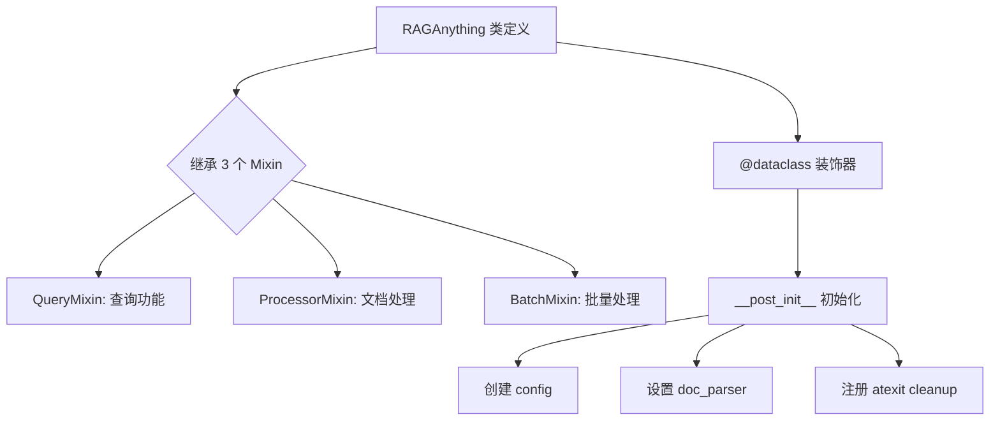
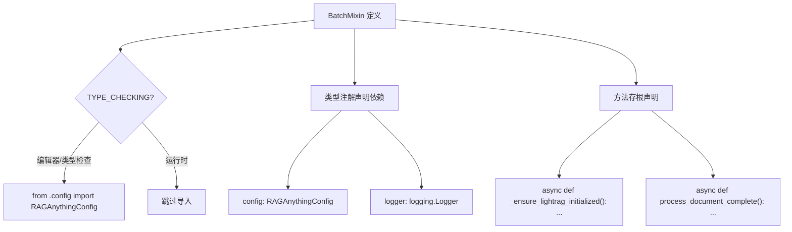
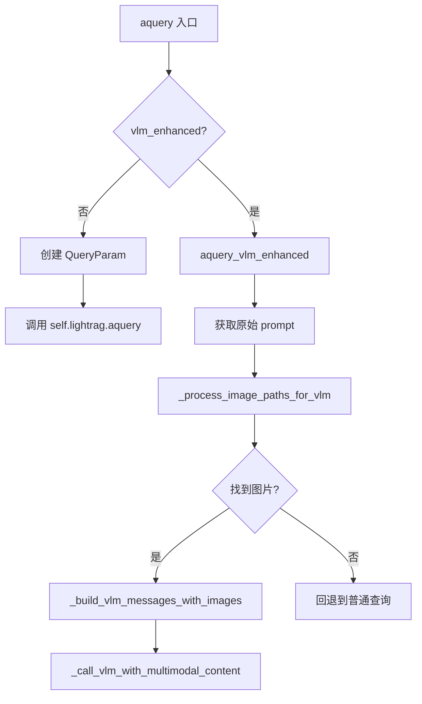

# PD-106.01 RAG-Anything — Mixin 多继承组合架构

> 文档编号：PD-106.01
> 来源：RAG-Anything `raganything/raganything.py`, `raganything/query.py`, `raganything/processor.py`, `raganything/batch.py`
> GitHub：https://github.com/HKUDS/RAG-Anything.git
> 问题域：PD-106 Mixin 架构模式 Mixin Architecture Pattern
> 状态：可复用方案

---

## 第 1 章 问题与动机

### 1.1 核心问题

当一个系统需要同时处理文档解析、多模态查询、批量处理等多个功能域时，如果将所有逻辑堆积在单一类中，会导致：

1. **文件膨胀**：单文件数千行，难以导航和维护
2. **职责耦合**：查询逻辑与文档处理逻辑交织，修改一处影响全局
3. **协作冲突**：多人同时修改同一文件，Git 冲突频繁
4. **测试困难**：无法独立测试某一功能域，必须初始化整个系统

RAG-Anything 面临的正是这个问题——它需要在一个 `RAGAnything` 类上同时提供查询（Query）、文档处理（Processor）、批量处理（Batch）三大功能域，总代码量超过 2500 行。

### 1.2 RAG-Anything 的解法概述

RAG-Anything 采用 Python Mixin 多继承组合模式，将核心类拆分为三个独立模块：

1. **QueryMixin** (`raganything/query.py:22`) — 封装所有查询相关方法，包括纯文本查询、多模态查询、VLM 增强查询，共 ~800 行
2. **ProcessorMixin** (`raganything/processor.py:26`) — 封装文档解析、多模态内容处理、缓存管理、实体提取等，共 ~1860 行
3. **BatchMixin** (`raganything/batch.py:19`) — 封装批量文件处理、文件夹遍历、并发控制，共 ~300 行
4. **RAGAnything** (`raganything/raganything.py:50`) — 作为 `@dataclass` 主类，通过 `class RAGAnything(QueryMixin, ProcessorMixin, BatchMixin)` 多继承组合所有功能
5. **TYPE_CHECKING 依赖声明** (`raganything/batch.py:15-16`) — Mixin 通过 `if TYPE_CHECKING` 导入主类类型，声明跨 Mixin 依赖接口

### 1.3 设计思想

| 设计原则 | 具体实现 | 理由 | 替代方案 |
|----------|----------|------|----------|
| 单一职责 | 每个 Mixin 只负责一个功能域（查询/处理/批量） | 降低认知负荷，每个文件聚焦一个关注点 | 单文件巨类（2500+ 行） |
| 组合优于继承 | 主类通过多继承组合 Mixin，而非深层继承链 | 扁平结构，避免菱形继承问题 | 委托模式（需要大量转发方法） |
| 接口契约 | BatchMixin 用 TYPE_CHECKING + 类型注解声明依赖 | 运行时零开销，IDE 类型检查完整 | ABC 抽象基类（运行时开销） |
| 共享状态透明 | 所有 Mixin 通过 `self.lightrag`、`self.config`、`self.logger` 访问共享状态 | 简单直接，无需依赖注入框架 | 显式传参（方法签名膨胀） |
| dataclass 主类 | RAGAnything 用 `@dataclass` 定义字段，`__post_init__` 初始化 | 声明式字段定义，自动生成 `__init__` | 手写 `__init__`（样板代码多） |

---

## 第 2 章 源码实现分析

### 2.1 架构概览

RAG-Anything 的 Mixin 架构呈扁平三叉结构，主类通过多继承一次性组合所有功能：

```
┌─────────────────────────────────────────────────────────┐
│                  RAGAnything (@dataclass)                │
│  raganything/raganything.py:50                           │
│                                                         │
│  字段: lightrag, llm_model_func, vision_model_func,     │
│        embedding_func, config, lightrag_kwargs           │
│  内部状态: modal_processors, context_extractor,          │
│           parse_cache                                    │
│  自有方法: __post_init__, close, _initialize_processors, │
│           _ensure_lightrag_initialized, ...              │
├─────────┬──────────────────┬────────────────────────────┤
│         │                  │                            │
│  ┌──────▼──────┐  ┌───────▼───────┐  ┌────────────────▼┐
│  │ QueryMixin  │  │ProcessorMixin │  │   BatchMixin    │
│  │ query.py:22 │  │processor.py:26│  │  batch.py:19    │
│  │             │  │               │  │                 │
│  │ aquery()    │  │parse_document │  │process_folder   │
│  │ aquery_with │  │process_doc    │  │process_batch    │
│  │ _multimodal │  │_complete()    │  │process_docs     │
│  │ aquery_vlm  │  │_process_multi │  │_with_rag_batch  │
│  │ _enhanced() │  │modal_content()│  │                 │
│  │ query()     │  │insert_content │  │filter_supported │
│  │ query_with  │  │_list()        │  │_files()         │
│  │ _multimodal │  │               │  │                 │
│  └─────────────┘  └───────────────┘  └─────────────────┘
│                                                         │
│  共享状态: self.lightrag, self.config, self.logger,      │
│           self.modal_processors, self.parse_cache        │
└─────────────────────────────────────────────────────────┘
```

### 2.2 核心实现

#### 2.2.1 主类多继承声明



对应源码 `raganything/raganything.py:49-133`：

```python
@dataclass
class RAGAnything(QueryMixin, ProcessorMixin, BatchMixin):
    """Multimodal Document Processing Pipeline"""

    # Core Components
    lightrag: Optional[LightRAG] = field(default=None)
    llm_model_func: Optional[Callable] = field(default=None)
    vision_model_func: Optional[Callable] = field(default=None)
    embedding_func: Optional[Callable] = field(default=None)
    config: Optional[RAGAnythingConfig] = field(default=None)
    lightrag_kwargs: Dict[str, Any] = field(default_factory=dict)

    # Internal State (init=False)
    modal_processors: Dict[str, Any] = field(default_factory=dict, init=False)
    context_extractor: Optional[ContextExtractor] = field(default=None, init=False)
    parse_cache: Optional[Any] = field(default=None, init=False)

    def __post_init__(self):
        if self.config is None:
            self.config = RAGAnythingConfig()
        self.working_dir = self.config.working_dir
        self.logger = logger
        self.doc_parser = (
            DoclingParser() if self.config.parser == "docling" else MineruParser()
        )
        atexit.register(self.close)
```

关键设计点：
- `@dataclass` 自动生成 `__init__`，字段声明即构造参数（`raganything/raganything.py:49`）
- `init=False` 的字段（如 `modal_processors`）不暴露给用户，仅内部使用（`raganything/raganything.py:87-97`）
- `__post_init__` 负责所有初始化逻辑，包括配置创建、解析器选择、资源清理注册（`raganything/raganything.py:99-133`）

#### 2.2.2 BatchMixin 的 TYPE_CHECKING 依赖声明



对应源码 `raganything/batch.py:10-28`：

```python
from typing import List, Dict, Any, Optional, TYPE_CHECKING

if TYPE_CHECKING:
    from .config import RAGAnythingConfig


class BatchMixin:
    """BatchMixin class containing batch processing functionality"""

    # Type hints for mixin attributes (available when mixed into RAGAnything)
    config: "RAGAnythingConfig"
    logger: logging.Logger

    # Type hints for methods from other mixins
    async def _ensure_lightrag_initialized(self) -> None: ...
    async def process_document_complete(self, file_path: str, **kwargs) -> None: ...
```

这是 RAG-Anything Mixin 架构中最精妙的设计：
- `TYPE_CHECKING` 块仅在类型检查时执行，运行时零开销（`raganything/batch.py:15-16`）
- 类属性注解 `config: "RAGAnythingConfig"` 声明了 Mixin 对主类字段的依赖（`raganything/batch.py:23`）
- 方法存根 `async def _ensure_lightrag_initialized(self) -> None: ...` 声明了对其他 Mixin 方法的依赖（`raganything/batch.py:27`）
- 这种模式让 IDE 能提供完整的自动补全和类型检查，同时不引入运行时循环导入

#### 2.2.3 QueryMixin 的独立查询封装



对应源码 `raganything/query.py:100-161`：

```python
class QueryMixin:
    """QueryMixin class containing query functionality for RAGAnything"""

    async def aquery(
        self, query: str, mode: str = "mix",
        system_prompt: str | None = None, **kwargs
    ) -> str:
        if self.lightrag is None:
            raise ValueError("No LightRAG instance available.")

        vlm_enhanced = kwargs.pop("vlm_enhanced", None)
        if vlm_enhanced is None:
            vlm_enhanced = (
                hasattr(self, "vision_model_func")
                and self.vision_model_func is not None
            )

        if vlm_enhanced and self.vision_model_func:
            return await self.aquery_vlm_enhanced(
                query, mode=mode, system_prompt=system_prompt, **kwargs
            )

        query_param = QueryParam(mode=mode, **kwargs)
        result = await self.lightrag.aquery(
            query, param=query_param, system_prompt=system_prompt
        )
        return result
```

QueryMixin 直接通过 `self.lightrag`、`self.vision_model_func` 访问主类状态，无需任何参数传递或依赖注入。这种"隐式共享"是 Mixin 模式的核心特征——所有 Mixin 共享同一个 `self` 实例。

### 2.3 实现细节

**Mixin 间调用链**：BatchMixin 的 `process_folder_complete` 方法调用了 ProcessorMixin 的 `process_document_complete`（`raganything/batch.py:115`），而 ProcessorMixin 的 `process_document_complete` 又调用了主类的 `_ensure_lightrag_initialized`（`raganything/processor.py:1467`）。这种跨 Mixin 调用完全透明，因为运行时它们都是同一个对象的方法。

**共享状态一致性**：所有 Mixin 通过 `self.config` 访问配置（如 `self.config.parser_output_dir`、`self.config.max_concurrent_files`），通过 `self.lightrag` 访问 RAG 引擎，通过 `self.logger` 记录日志。状态的初始化集中在主类的 `__post_init__` 和 `_ensure_lightrag_initialized` 中，确保所有 Mixin 看到的状态一致。

**初始化顺序**：`@dataclass` 的 `__post_init__` 在所有字段赋值后执行，此时 Mixin 的方法已经可用。延迟初始化模式（`_ensure_lightrag_initialized`）确保 LightRAG 实例在首次使用时才创建，避免构造时的重量级操作。

---

## 第 3 章 迁移指南

### 3.1 迁移清单

将 Mixin 组合模式迁移到自己的项目，分三个阶段：

**阶段一：拆分现有巨类**
- [ ] 识别现有类中的功能域边界（如查询、处理、批量）
- [ ] 为每个功能域创建独立的 Mixin 文件
- [ ] 将方法按功能域移动到对应 Mixin
- [ ] 在主类中添加多继承声明

**阶段二：建立依赖契约**
- [ ] 在每个 Mixin 中用 `TYPE_CHECKING` 导入主类/配置类型
- [ ] 用类属性注解声明对共享状态的依赖
- [ ] 用方法存根声明对其他 Mixin 方法的依赖
- [ ] 确保 IDE 类型检查通过

**阶段三：验证与优化**
- [ ] 运行全量测试，确保行为不变
- [ ] 检查循环导入问题
- [ ] 验证 `mypy` / `pyright` 类型检查通过
- [ ] 为每个 Mixin 编写独立单元测试

### 3.2 适配代码模板

以下是一个可直接复用的 Mixin 架构模板：

```python
# === config.py ===
from dataclasses import dataclass, field

@dataclass
class AppConfig:
    """应用配置，所有 Mixin 共享"""
    working_dir: str = "./data"
    max_workers: int = 4
    enable_cache: bool = True


# === query_mixin.py ===
import logging
from typing import TYPE_CHECKING

if TYPE_CHECKING:
    from .config import AppConfig

class QueryMixin:
    """查询功能 Mixin"""
    
    # 声明依赖的共享状态
    config: "AppConfig"
    logger: logging.Logger
    engine: object  # 主类提供的核心引擎
    
    # 声明依赖的其他 Mixin 方法
    async def _ensure_initialized(self) -> None: ...
    
    async def query(self, text: str, mode: str = "default") -> str:
        """纯文本查询"""
        await self._ensure_initialized()
        # 直接通过 self 访问共享状态
        result = await self.engine.search(text, mode=mode)
        self.logger.info(f"Query completed: {text[:50]}...")
        return result


# === processor_mixin.py ===
import logging
from typing import Dict, Any, List, TYPE_CHECKING

if TYPE_CHECKING:
    from .config import AppConfig

class ProcessorMixin:
    """文档处理 Mixin"""
    
    config: "AppConfig"
    logger: logging.Logger
    engine: object
    
    async def _ensure_initialized(self) -> None: ...
    
    async def process_document(self, file_path: str) -> Dict[str, Any]:
        """处理单个文档"""
        await self._ensure_initialized()
        self.logger.info(f"Processing: {file_path}")
        # 处理逻辑...
        return {"status": "success", "file": file_path}


# === batch_mixin.py ===
import asyncio
import logging
from typing import List, Dict, Any, TYPE_CHECKING

if TYPE_CHECKING:
    from .config import AppConfig

class BatchMixin:
    """批量处理 Mixin"""
    
    config: "AppConfig"
    logger: logging.Logger
    
    # 声明依赖 ProcessorMixin 的方法
    async def process_document(self, file_path: str) -> Dict[str, Any]: ...
    
    async def process_batch(self, file_paths: List[str]) -> List[Dict[str, Any]]:
        """批量处理文档"""
        semaphore = asyncio.Semaphore(self.config.max_workers)
        
        async def _process_one(path: str):
            async with semaphore:
                return await self.process_document(path)
        
        tasks = [asyncio.create_task(_process_one(p)) for p in file_paths]
        return await asyncio.gather(*tasks, return_exceptions=True)


# === app.py (主类) ===
from dataclasses import dataclass, field
from typing import Optional
from .config import AppConfig
from .query_mixin import QueryMixin
from .processor_mixin import ProcessorMixin
from .batch_mixin import BatchMixin

@dataclass
class MyApp(QueryMixin, ProcessorMixin, BatchMixin):
    """主类：通过多继承组合所有 Mixin"""
    
    config: Optional[AppConfig] = field(default=None)
    engine: Optional[object] = field(default=None)
    
    _initialized: bool = field(default=False, init=False)
    
    def __post_init__(self):
        import logging
        if self.config is None:
            self.config = AppConfig()
        self.logger = logging.getLogger(self.__class__.__name__)
    
    async def _ensure_initialized(self):
        """延迟初始化，所有 Mixin 共享"""
        if self._initialized:
            return
        # 初始化核心引擎...
        self._initialized = True
        self.logger.info("App initialized")
```

### 3.3 适用场景

| 场景 | 适用度 | 说明 |
|------|--------|------|
| 单类 1000+ 行需要拆分 | ⭐⭐⭐ | Mixin 是最低成本的拆分方案 |
| 功能域之间有共享状态 | ⭐⭐⭐ | Mixin 天然共享 self，无需依赖注入 |
| 需要保持单一入口 API | ⭐⭐⭐ | 用户只看到主类，Mixin 是内部实现细节 |
| 功能域之间完全独立 | ⭐⭐ | 可以用，但委托模式可能更清晰 |
| 需要运行时动态组合功能 | ⭐ | Mixin 是编译时组合，不支持动态插拔 |
| 多层继承链已经很深 | ⭐ | 再加 Mixin 会让 MRO 更复杂，考虑重构 |

---

## 第 4 章 测试用例

```python
"""
测试 Mixin 组合架构的核心行为
基于 RAG-Anything 的真实函数签名
"""
import asyncio
import logging
from dataclasses import dataclass, field
from typing import Optional, Dict, Any, List, TYPE_CHECKING
import pytest


# === 模拟 Mixin 结构 ===

if TYPE_CHECKING:
    pass


class MockQueryMixin:
    """模拟 QueryMixin"""
    config: Any
    logger: logging.Logger
    engine: Any
    
    async def _ensure_initialized(self) -> None: ...
    
    async def aquery(self, query: str, mode: str = "mix") -> str:
        await self._ensure_initialized()
        return f"result:{query}:{mode}"


class MockProcessorMixin:
    """模拟 ProcessorMixin"""
    config: Any
    logger: logging.Logger
    engine: Any
    
    async def _ensure_initialized(self) -> None: ...
    
    async def process_document(self, file_path: str) -> Dict[str, Any]:
        await self._ensure_initialized()
        return {"status": "success", "file": file_path}


class MockBatchMixin:
    """模拟 BatchMixin"""
    config: Any
    logger: logging.Logger
    
    async def process_document(self, file_path: str) -> Dict[str, Any]: ...
    
    async def process_batch(self, paths: List[str]) -> List[Dict]:
        results = []
        for p in paths:
            results.append(await self.process_document(p))
        return results


@dataclass
class MockConfig:
    working_dir: str = "./test"
    max_workers: int = 2


@dataclass
class MockApp(MockQueryMixin, MockProcessorMixin, MockBatchMixin):
    config: Optional[MockConfig] = field(default=None)
    engine: Optional[Any] = field(default=None)
    _initialized: bool = field(default=False, init=False)
    
    def __post_init__(self):
        if self.config is None:
            self.config = MockConfig()
        self.logger = logging.getLogger("test")
    
    async def _ensure_initialized(self):
        self._initialized = True


class TestMixinComposition:
    """测试 Mixin 组合的核心行为"""
    
    def test_mro_order(self):
        """验证 MRO 顺序：主类 > QueryMixin > ProcessorMixin > BatchMixin"""
        mro = [cls.__name__ for cls in MockApp.__mro__]
        assert mro.index("MockApp") < mro.index("MockQueryMixin")
        assert mro.index("MockQueryMixin") < mro.index("MockProcessorMixin")
        assert mro.index("MockProcessorMixin") < mro.index("MockBatchMixin")
    
    def test_shared_state_access(self):
        """验证所有 Mixin 共享同一个 config 实例"""
        app = MockApp()
        # 所有 Mixin 方法通过 self.config 访问同一个对象
        assert app.config.working_dir == "./test"
        assert app.config.max_workers == 2
    
    @pytest.mark.asyncio
    async def test_query_mixin_method(self):
        """验证 QueryMixin 方法可通过主类调用"""
        app = MockApp()
        result = await app.aquery("test query", mode="local")
        assert result == "result:test query:local"
        assert app._initialized is True
    
    @pytest.mark.asyncio
    async def test_cross_mixin_call(self):
        """验证 BatchMixin 可调用 ProcessorMixin 的方法"""
        app = MockApp()
        results = await app.process_batch(["a.pdf", "b.pdf"])
        assert len(results) == 2
        assert results[0]["file"] == "a.pdf"
        assert results[1]["file"] == "b.pdf"
    
    @pytest.mark.asyncio
    async def test_lazy_initialization(self):
        """验证延迟初始化模式"""
        app = MockApp()
        assert app._initialized is False
        await app.aquery("trigger init")
        assert app._initialized is True
    
    def test_dataclass_field_defaults(self):
        """验证 dataclass 字段默认值"""
        app = MockApp()
        assert app.engine is None
        assert app.config is not None  # __post_init__ 创建默认值
    
    def test_config_override(self):
        """验证配置可在构造时覆盖"""
        custom_config = MockConfig(working_dir="/custom", max_workers=8)
        app = MockApp(config=custom_config)
        assert app.config.working_dir == "/custom"
        assert app.config.max_workers == 8


class TestEdgeCases:
    """测试边界情况"""
    
    def test_isinstance_check(self):
        """验证 isinstance 对所有 Mixin 都返回 True"""
        app = MockApp()
        assert isinstance(app, MockQueryMixin)
        assert isinstance(app, MockProcessorMixin)
        assert isinstance(app, MockBatchMixin)
    
    def test_method_resolution(self):
        """验证方法解析不会冲突"""
        app = MockApp()
        # _ensure_initialized 在多个 Mixin 中有存根，
        # 但主类的实现优先（MRO）
        assert hasattr(app, "_ensure_initialized")
        assert hasattr(app, "aquery")
        assert hasattr(app, "process_document")
        assert hasattr(app, "process_batch")
    
    @pytest.mark.asyncio
    async def test_degradation_without_engine(self):
        """验证引擎未初始化时的降级行为"""
        app = MockApp()
        # 即使 engine 为 None，_ensure_initialized 仍可执行
        await app._ensure_initialized()
        assert app._initialized is True
```

---

## 第 5 章 跨域关联

| 关联域 | 关系类型 | 说明 |
|--------|----------|------|
| PD-01 上下文管理 | 协同 | QueryMixin 中的 VLM 增强查询需要管理多模态上下文窗口，`_process_image_paths_for_vlm` 处理图片路径替换和 base64 编码 |
| PD-03 容错与重试 | 协同 | ProcessorMixin 的 `_process_multimodal_content` 实现了批量处理失败后回退到逐个处理的降级策略（`raganything/processor.py:537-543`） |
| PD-04 工具系统 | 依赖 | 每个 Mixin 依赖 LightRAG 提供的存储、向量数据库、知识图谱等工具组件，通过 `self.lightrag` 统一访问 |
| PD-10 中间件管道 | 协同 | ProcessorMixin 的文档处理流程（解析→分离→文本插入→多模态处理）本质上是一个管道，Mixin 拆分让管道的每个阶段可独立演进 |
| PD-78 并发控制 | 协同 | BatchMixin 使用 `asyncio.Semaphore` 控制并发文件处理数量（`raganything/batch.py:102`），ProcessorMixin 也用信号量控制多模态处理并发 |

---

## 第 6 章 来源文件索引

| 文件 | 行范围 | 关键实现 |
|------|--------|----------|
| `raganything/raganything.py` | L49-L133 | RAGAnything 主类定义、@dataclass 字段声明、__post_init__ 初始化 |
| `raganything/raganything.py` | L177-L219 | _initialize_processors 多模态处理器初始化 |
| `raganything/raganything.py` | L231-L369 | _ensure_lightrag_initialized 延迟初始化逻辑 |
| `raganything/query.py` | L22-L161 | QueryMixin 类定义、aquery 纯文本查询、VLM 增强查询分发 |
| `raganything/query.py` | L163-L301 | aquery_with_multimodal 多模态查询、缓存管理 |
| `raganything/query.py` | L303-L370 | aquery_vlm_enhanced VLM 增强查询实现 |
| `raganything/query.py` | L539-L656 | _process_image_paths_for_vlm 图片路径处理与安全校验 |
| `raganything/processor.py` | L26-L453 | ProcessorMixin 类定义、文档解析、缓存管理 |
| `raganything/processor.py` | L455-L546 | _process_multimodal_content 多模态内容处理入口（含降级策略） |
| `raganything/processor.py` | L703-L879 | _process_multimodal_content_batch_type_aware 类型感知批量处理 |
| `raganything/processor.py` | L1441-L1529 | process_document_complete 完整文档处理工作流 |
| `raganything/batch.py` | L10-L28 | BatchMixin TYPE_CHECKING 依赖声明、类型注解、方法存根 |
| `raganything/batch.py` | L34-L169 | process_folder_complete 文件夹批量处理（Semaphore 并发控制） |
| `raganything/batch.py` | L174-L224 | process_documents_batch 新版批量处理（BatchParser 集成） |
| `raganything/batch.py` | L302-L405 | process_documents_with_rag_batch 批量解析+RAG 插入组合流程 |
| `raganything/config.py` | L13-L153 | RAGAnythingConfig dataclass 配置定义 |
| `raganything/base.py` | L1-L13 | DocStatus 枚举定义 |
| `raganything/__init__.py` | L1-L8 | 包导出：RAGAnything + RAGAnythingConfig |

---

## 第 7 章 横向对比维度

```json comparison_data
{
  "project": "RAG-Anything",
  "dimensions": {
    "组合方式": "Python 多继承 Mixin + @dataclass，3 个 Mixin 扁平组合",
    "依赖声明": "TYPE_CHECKING 条件导入 + 类属性注解 + 方法存根",
    "共享状态": "隐式共享 self（config/lightrag/logger），无依赖注入",
    "初始化策略": "@dataclass __post_init__ + 延迟初始化 _ensure_lightrag_initialized",
    "模块粒度": "按功能域拆分：Query(800行)/Processor(1860行)/Batch(300行)"
  }
}
```

### 域元数据补充

```json domain_metadata
{
  "solution_summary": "RAG-Anything 用 @dataclass + 3 个 Mixin 多继承组合，通过 TYPE_CHECKING 声明跨模块依赖，实现 2500+ 行代码的功能域拆分",
  "description": "Python 多继承 Mixin 与 dataclass 结合的大型类拆分实践",
  "sub_problems": [
    "延迟初始化与 Mixin 方法的执行前置条件保证",
    "dataclass 字段与 Mixin 隐式依赖的协调"
  ],
  "best_practices": [
    "用方法存根（def method(): ...）声明跨 Mixin 方法依赖",
    "主类用 @dataclass 声明字段，Mixin 只定义方法不定义字段",
    "延迟初始化方法集中在主类，Mixin 通过 await self._ensure_initialized() 调用"
  ]
}
```
