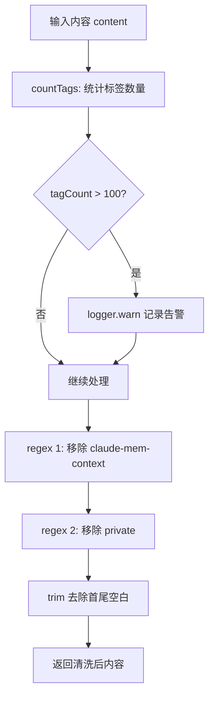
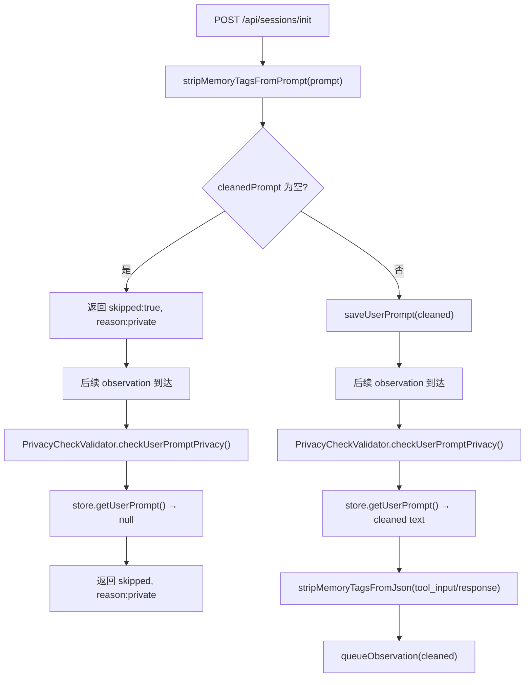
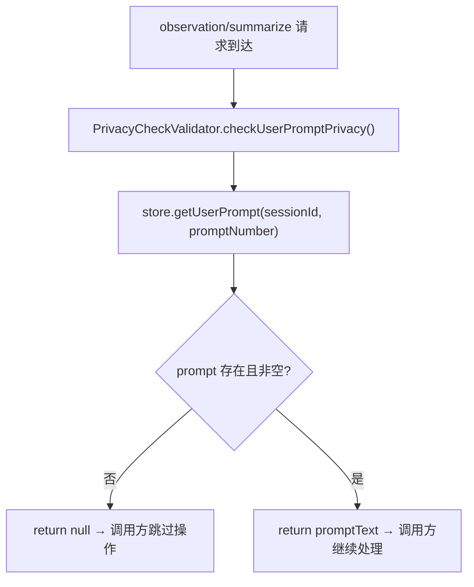

# PD-108.01 claude-mem — 双标签隐私控制系统

> 文档编号：PD-108.01
> 来源：claude-mem `src/utils/tag-stripping.ts` `src/services/worker/validation/PrivacyCheckValidator.ts`
> GitHub：https://github.com/thedotmack/claude-mem.git
> 问题域：PD-108 隐私控制 Privacy Control
> 状态：可复用方案

---

## 第 1 章 问题与动机

### 1.1 核心问题

AI 记忆系统（如 Claude Code 的 hook 插件）会自动记录用户的 prompt 和工具调用结果。但用户有时会在 prompt 中包含敏感信息（密码、API Key、个人数据），这些内容不应被持久化到记忆数据库中。

同时，记忆系统自身会向 Claude 注入上下文（历史观察摘要），这些注入内容如果被再次存储，会形成**递归存储循环**——系统注入的上下文被当作新内容再次记录，导致数据膨胀和语义污染。

核心挑战：
1. **用户隐私**：用户需要一种简单的方式标记"这段内容不要记住"
2. **系统防递归**：系统注入的上下文不能被当作新内容再次存储
3. **性能安全**：标签解析不能成为 ReDoS 攻击向量
4. **架构位置**：隐私过滤应该在数据流的哪个层级执行？

### 1.2 claude-mem 的解法概述

claude-mem 实现了一套**双标签隐私系统**，在 hook 层边缘处理：

1. **`<private>` 标签**：用户级手动隐私标记，用户在 prompt 中用 `<private>...</private>` 包裹敏感内容，该内容在进入存储前被剥离（`src/utils/tag-stripping.ts:51`）
2. **`<claude-mem-context>` 标签**：系统级防递归标记，系统注入的上下文自动包裹此标签，防止被再次存储（`src/utils/tag-stripping.ts:50`）
3. **边缘处理模式**：标签剥离在 HTTP 路由层（SessionRoutes）执行，而非存储层，保持 worker 服务简单（`src/services/worker/http/routes/SessionRoutes.ts:740`）
4. **ReDoS 防护**：限制单次内容最多处理 100 个标签，防止正则表达式拒绝服务（`src/utils/tag-stripping.ts:21`）
5. **全链路隐私传播**：如果 prompt 被完全剥离为空字符串，后续的 observation 和 summarize 操作也会被跳过（`PrivacyCheckValidator.ts:30`）

### 1.3 设计思想

| 设计原则 | 具体实现 | 理由 | 替代方案 |
|----------|----------|------|----------|
| 边缘过滤 | 在 SessionRoutes HTTP 层剥离标签，而非 SQLite 存储层 | 保持 worker 服务简单，遵循单向数据流 | 在 DB trigger 中过滤（增加 DB 复杂度） |
| 双标签分离 | `<private>` 用户控制 + `<claude-mem-context>` 系统控制 | 职责分离：用户隐私 vs 系统防递归是不同关注点 | 单一 `<no-store>` 标签（无法区分来源） |
| 全链路传播 | prompt 为空 → observation/summarize 全部跳过 | 避免"prompt 私密但工具调用被记录"的信息泄漏 | 仅跳过 prompt 存储（工具调用可能泄漏上下文） |
| 防御性正则 | MAX_TAG_COUNT=100 + 非贪婪匹配 `[\s\S]*?` | 防止恶意构造的大量标签导致 ReDoS | 不做限制（生产环境风险） |
| 优雅降级 | 超限时仍处理但记录告警 | 不因安全检查阻断正常功能 | 直接拒绝处理（影响用户体验） |

---

## 第 2 章 源码实现分析

### 2.1 架构概览

claude-mem 的隐私控制贯穿整个 hook → worker → storage 数据流：

```
┌──────────────────────────────────────────────────────────────────┐
│                    Claude Code Hook 层                           │
│                                                                  │
│  UserPromptSubmit ──→ session-init.ts ──→ POST /api/sessions/init│
│  PostToolUse ──────→ observation.ts ──→ POST /api/sessions/obs   │
│  Stop ─────────────→ summarize.ts ──→ POST /api/sessions/summ    │
└──────────────────────────────────┬───────────────────────────────┘
                                   │ HTTP
┌──────────────────────────────────▼───────────────────────────────┐
│                    SessionRoutes (边缘过滤层)                     │
│                                                                  │
│  handleSessionInit:                                              │
│    ├─ stripMemoryTagsFromPrompt(prompt)  ← 标签剥离 #1          │
│    ├─ 空检查 → skipped: true             ← 全私密跳过           │
│    └─ saveUserPrompt(cleaned)            ← 存储已清洗内容       │
│                                                                  │
│  handleObservation:                                              │
│    ├─ PrivacyCheckValidator.check()      ← 回查 prompt 隐私状态 │
│    ├─ stripMemoryTagsFromJson(input)     ← 标签剥离 #2          │
│    ├─ stripMemoryTagsFromJson(response)  ← 标签剥离 #3          │
│    └─ queueObservation(cleaned)          ← 存储已清洗内容       │
│                                                                  │
│  handleSummarize:                                                │
│    ├─ PrivacyCheckValidator.check()      ← 回查 prompt 隐私状态 │
│    └─ queueSummarize(message)            ← 存储摘要             │
└──────────────────────────────────┬───────────────────────────────┘
                                   │
┌──────────────────────────────────▼───────────────────────────────┐
│                    SQLite 存储层                                  │
│  user_prompts: 只存储已清洗的 prompt_text                        │
│  observations: 只存储已清洗的 tool_input/tool_response           │
│  session_summaries: 仅在 prompt 非私密时生成                     │
└──────────────────────────────────────────────────────────────────┘
```

### 2.2 核心实现

#### 2.2.1 标签剥离引擎



对应源码 `src/utils/tag-stripping.ts:37-53`：

```typescript
function stripTagsInternal(content: string): string {
  // ReDoS protection: limit tag count before regex processing
  const tagCount = countTags(content);
  if (tagCount > MAX_TAG_COUNT) {
    logger.warn('SYSTEM', 'tag count exceeds limit', undefined, {
      tagCount,
      maxAllowed: MAX_TAG_COUNT,
      contentLength: content.length
    });
    // Still process but log the anomaly
  }

  return content
    .replace(/<claude-mem-context>[\s\S]*?<\/claude-mem-context>/g, '')
    .replace(/<private>[\s\S]*?<\/private>/g, '')
    .trim();
}
```

关键设计点：
- **非贪婪匹配** `[\s\S]*?`：匹配最近的闭合标签，避免跨标签吞噬内容
- **先系统标签后用户标签**：`claude-mem-context` 先于 `private` 处理，顺序无实际影响但语义清晰
- **超限仍处理**：`MAX_TAG_COUNT` 超限时只告警不阻断，优雅降级

#### 2.2.2 全链路隐私传播



对应源码 `src/services/worker/http/routes/SessionRoutes.ts:739-760`：

```typescript
// Step 3: Strip privacy tags from prompt
const cleanedPrompt = stripMemoryTagsFromPrompt(prompt);

// Step 4: Check if prompt is entirely private
if (!cleanedPrompt || cleanedPrompt.trim() === '') {
  logger.debug('HOOK', 'Session init - prompt entirely private', {
    sessionId: sessionDbId,
    promptNumber,
    originalLength: prompt.length
  });

  res.json({
    sessionDbId,
    promptNumber,
    skipped: true,
    reason: 'private'
  });
  return;
}

// Step 5: Save cleaned user prompt
store.saveUserPrompt(contentSessionId, promptNumber, cleanedPrompt);
```

#### 2.2.3 PrivacyCheckValidator 集中校验



对应源码 `src/services/worker/validation/PrivacyCheckValidator.ts:20-40`：

```typescript
static checkUserPromptPrivacy(
  store: SessionStore,
  contentSessionId: string,
  promptNumber: number,
  operationType: 'observation' | 'summarize',
  sessionDbId: number,
  additionalContext?: Record<string, any>
): string | null {
  const userPrompt = store.getUserPrompt(contentSessionId, promptNumber);

  if (!userPrompt || userPrompt.trim() === '') {
    logger.debug('HOOK', `Skipping ${operationType} - user prompt was entirely private`, {
      sessionId: sessionDbId,
      promptNumber,
      ...additionalContext
    });
    return null;
  }

  return userPrompt;
}
```

### 2.3 实现细节

**数据存储层**（`src/services/sqlite/SessionStore.ts:1468-1496`）：

`user_prompts` 表只存储已清洗的 prompt，这意味着隐私过滤是**不可逆的**——一旦标签被剥离，原始内容不会出现在任何持久化存储中。

```typescript
// 存储（只接收已清洗内容）
saveUserPrompt(contentSessionId: string, promptNumber: number, promptText: string): number {
  const stmt = this.db.prepare(`
    INSERT INTO user_prompts
    (content_session_id, prompt_number, prompt_text, created_at, created_at_epoch)
    VALUES (?, ?, ?, ?, ?)
  `);
  const result = stmt.run(contentSessionId, promptNumber, promptText, now.toISOString(), nowEpoch);
  return result.lastInsertRowid as number;
}

// 检索（用于后续隐私校验）
getUserPrompt(contentSessionId: string, promptNumber: number): string | null {
  const stmt = this.db.prepare(`
    SELECT prompt_text FROM user_prompts
    WHERE content_session_id = ? AND prompt_number = ? LIMIT 1
  `);
  const result = stmt.get(contentSessionId, promptNumber) as { prompt_text: string } | undefined;
  return result?.prompt_text ?? null;
}
```

**Hook 层优雅降级**（`src/cli/handlers/session-init.ts:82-88`）：

当 worker 返回 `skipped: true, reason: 'private'` 时，hook 层不会阻断用户操作，只是静默跳过记忆存储：

```typescript
if (initResult.skipped && initResult.reason === 'private') {
  logger.info('HOOK', `INIT_COMPLETE | sessionDbId=${sessionDbId} | promptNumber=${promptNumber} | skipped=true | reason=private`);
  return { continue: true, suppressOutput: true };
}
```

---

## 第 3 章 迁移指南

### 3.1 迁移清单

**阶段 1：标签剥离引擎（核心，1 个文件）**

- [ ] 创建 `tag-stripping.ts`（或对应语言的等价实现）
- [ ] 定义双标签：用户级 `<private>` + 系统级自定义标签（如 `<your-app-context>`）
- [ ] 实现 `stripTagsInternal()` 函数，含 ReDoS 防护
- [ ] 导出 `stripFromPrompt()` 和 `stripFromJson()` 两个入口函数
- [ ] 编写单元测试覆盖：基本剥离、多标签、全私密、ReDoS

**阶段 2：边缘过滤集成（2-3 个文件）**

- [ ] 在数据流入口（API 路由 / hook handler）调用标签剥离
- [ ] 实现"全私密跳过"逻辑：剥离后为空 → 跳过后续所有操作
- [ ] 确保存储层只接收已清洗内容

**阶段 3：全链路隐私传播（1 个文件）**

- [ ] 创建 `PrivacyCheckValidator`（或等价的集中校验器）
- [ ] 在所有下游操作（observation、summarize 等）前调用校验器
- [ ] 校验器通过查询已存储的 prompt 状态判断是否跳过

### 3.2 适配代码模板

#### 标签剥离引擎（TypeScript）

```typescript
// privacy/tag-stripper.ts — 可直接复用的标签剥离模块

const MAX_TAG_COUNT = 100;

interface TagConfig {
  userTag: string;      // 用户级隐私标签名，如 "private"
  systemTag: string;    // 系统级防递归标签名，如 "app-context"
}

const DEFAULT_CONFIG: TagConfig = {
  userTag: 'private',
  systemTag: 'app-context',
};

function countTags(content: string, config: TagConfig): number {
  const userCount = (content.match(new RegExp(`<${config.userTag}>`, 'g')) || []).length;
  const sysCount = (content.match(new RegExp(`<${config.systemTag}>`, 'g')) || []).length;
  return userCount + sysCount;
}

function stripTagsInternal(content: string, config: TagConfig = DEFAULT_CONFIG): string {
  const tagCount = countTags(content, config);
  if (tagCount > MAX_TAG_COUNT) {
    console.warn(`[Privacy] Tag count ${tagCount} exceeds limit ${MAX_TAG_COUNT}`);
  }

  return content
    .replace(new RegExp(`<${config.systemTag}>[\\s\\S]*?<\\/${config.systemTag}>`, 'g'), '')
    .replace(new RegExp(`<${config.userTag}>[\\s\\S]*?<\\/${config.userTag}>`, 'g'), '')
    .trim();
}

export function stripFromPrompt(content: string, config?: TagConfig): string {
  return stripTagsInternal(content, config);
}

export function stripFromJson(content: string, config?: TagConfig): string {
  return stripTagsInternal(content, config);
}

/**
 * 检查内容是否完全私密（剥离后为空）
 */
export function isEntirelyPrivate(content: string, config?: TagConfig): boolean {
  const cleaned = stripTagsInternal(content, config);
  return !cleaned || cleaned.trim() === '';
}
```

#### 隐私校验器（TypeScript）

```typescript
// privacy/privacy-validator.ts — 集中式隐私校验

interface PromptStore {
  getPrompt(sessionId: string, promptNumber: number): string | null;
}

export class PrivacyValidator {
  static check(
    store: PromptStore,
    sessionId: string,
    promptNumber: number,
    operation: string
  ): string | null {
    const prompt = store.getPrompt(sessionId, promptNumber);

    if (!prompt || prompt.trim() === '') {
      console.debug(`[Privacy] Skipping ${operation} — prompt was entirely private`);
      return null;
    }

    return prompt;
  }
}
```

#### 边缘过滤集成示例（Express 路由）

```typescript
// routes/session.ts — 在 API 路由层集成隐私过滤

import { stripFromPrompt, stripFromJson, isEntirelyPrivate } from '../privacy/tag-stripper';
import { PrivacyValidator } from '../privacy/privacy-validator';

app.post('/api/sessions/init', (req, res) => {
  const { sessionId, prompt } = req.body;

  // 边缘过滤：在入口剥离标签
  const cleanedPrompt = stripFromPrompt(prompt);

  // 全私密跳过
  if (!cleanedPrompt || cleanedPrompt.trim() === '') {
    return res.json({ skipped: true, reason: 'private' });
  }

  // 只存储已清洗内容
  store.savePrompt(sessionId, cleanedPrompt);
  res.json({ status: 'ok' });
});

app.post('/api/sessions/observations', (req, res) => {
  const { sessionId, promptNumber, toolInput, toolResponse } = req.body;

  // 全链路隐私传播：检查原始 prompt 是否私密
  const prompt = PrivacyValidator.check(store, sessionId, promptNumber, 'observation');
  if (!prompt) {
    return res.json({ skipped: true, reason: 'private' });
  }

  // 工具数据也要剥离标签
  const cleanedInput = stripFromJson(JSON.stringify(toolInput));
  const cleanedResponse = stripFromJson(JSON.stringify(toolResponse));

  store.saveObservation(sessionId, cleanedInput, cleanedResponse);
  res.json({ status: 'ok' });
});
```

### 3.3 适用场景

| 场景 | 适用度 | 说明 |
|------|--------|------|
| AI 记忆/上下文持久化插件 | ⭐⭐⭐ | 完美匹配：用户 prompt 含敏感信息 + 系统注入上下文需防递归 |
| LLM 对话日志系统 | ⭐⭐⭐ | 用户可标记不想被记录的对话片段 |
| RAG 系统的文档预处理 | ⭐⭐ | 可用于剥离文档中的敏感标注，但标签协议需与文档作者约定 |
| 实时聊天系统 | ⭐⭐ | 可用于"阅后即焚"类功能，但需额外的 UI 支持 |
| 批量数据处理管道 | ⭐ | 标签方案更适合交互式场景，批量场景建议用字段级加密 |

---

## 第 4 章 测试用例

基于 claude-mem 的真实测试套件（`tests/utils/tag-stripping.test.ts`），以下是可直接运行的测试代码：

```typescript
import { describe, it, expect } from 'bun:test';
// 替换为你的实际导入路径
import { stripFromPrompt, stripFromJson, isEntirelyPrivate } from '../privacy/tag-stripper';

describe('TagStripper', () => {
  describe('基本标签剥离', () => {
    it('应剥离 <private> 标签并保留周围内容', () => {
      const input = 'public content <private>secret stuff</private> more public';
      expect(stripFromPrompt(input)).toBe('public content  more public');
    });

    it('应剥离系统标签', () => {
      const input = 'public <app-context>injected context</app-context> end';
      expect(stripFromPrompt(input)).toBe('public  end');
    });

    it('应同时剥离两种标签', () => {
      const input = '<private>secret</private> public <app-context>ctx</app-context> end';
      expect(stripFromPrompt(input)).toBe('public  end');
    });
  });

  describe('全私密检测', () => {
    it('全部内容被标签包裹时返回空字符串', () => {
      expect(stripFromPrompt('<private>all private</private>')).toBe('');
    });

    it('isEntirelyPrivate 应返回 true', () => {
      expect(isEntirelyPrivate('<private>all private</private>')).toBe(true);
    });

    it('部分私密时 isEntirelyPrivate 应返回 false', () => {
      expect(isEntirelyPrivate('<private>secret</private> public part')).toBe(false);
    });
  });

  describe('多行内容', () => {
    it('应剥离跨行的标签内容', () => {
      const input = `public
<private>
multi
line
secret
</private>
end`;
      expect(stripFromPrompt(input)).toBe('public\n\nend');
    });
  });

  describe('ReDoS 防护', () => {
    it('大量标签应在 1 秒内完成处理', () => {
      let content = '';
      for (let i = 0; i < 150; i++) {
        content += `<private>secret${i}</private> text${i} `;
      }
      const start = Date.now();
      const result = stripFromPrompt(content);
      expect(Date.now() - start).toBeLessThan(1000);
      expect(result).not.toContain('<private>');
    });

    it('超长标签内容不应导致回溯', () => {
      const content = '<private>' + 'x'.repeat(10000) + '</private> keep this';
      const start = Date.now();
      expect(stripFromPrompt(content)).toBe('keep this');
      expect(Date.now() - start).toBeLessThan(1000);
    });
  });

  describe('JSON 内容剥离', () => {
    it('应从序列化 JSON 中剥离标签', () => {
      const json = JSON.stringify({ content: '<private>secret</private> public' });
      const result = stripFromJson(json);
      expect(JSON.parse(result).content).toBe(' public');
    });
  });
});

describe('PrivacyValidator', () => {
  const mockStore = {
    getPrompt: (sessionId: string, promptNumber: number) => {
      if (sessionId === 'private-session') return null;
      if (sessionId === 'empty-session') return '';
      return 'normal prompt text';
    }
  };

  it('prompt 不存在时返回 null', () => {
    expect(PrivacyValidator.check(mockStore, 'private-session', 1, 'observation')).toBeNull();
  });

  it('prompt 为空时返回 null', () => {
    expect(PrivacyValidator.check(mockStore, 'empty-session', 1, 'summarize')).toBeNull();
  });

  it('正常 prompt 返回文本', () => {
    expect(PrivacyValidator.check(mockStore, 'normal-session', 1, 'observation')).toBe('normal prompt text');
  });
});
```

---

## 第 5 章 跨域关联

| 关联域 | 关系类型 | 说明 |
|--------|----------|------|
| PD-06 记忆持久化 | 强依赖 | 隐私控制直接决定哪些内容进入记忆存储。claude-mem 的 `saveUserPrompt` 只接收已清洗内容，隐私过滤是记忆持久化的前置守门员 |
| PD-01 上下文管理 | 协同 | `<claude-mem-context>` 标签的存在正是为了防止上下文注入内容被递归存储。上下文管理系统注入的内容必须被隐私系统识别并过滤 |
| PD-10 中间件管道 | 协同 | 标签剥离本质上是一个中间件——在数据流入口执行过滤。claude-mem 虽未使用显式中间件框架，但 SessionRoutes 的处理流程等价于管道模式 |
| PD-03 容错与重试 | 协同 | hook 层的优雅降级设计（worker 不可用时返回 exit code 0）与隐私控制的"不阻断用户"原则一致。隐私检查失败不应阻断正常工作流 |
| PD-11 可观测性 | 协同 | ReDoS 防护的 `logger.warn` 告警是可观测性的一部分。隐私过滤的跳过事件（`skipped: true, reason: private`）也应纳入监控 |

---

## 第 6 章 来源文件索引

| 文件 | 行范围 | 关键实现 |
|------|--------|----------|
| `src/utils/tag-stripping.ts` | L1-L74 | 双标签剥离引擎：`stripTagsInternal`、ReDoS 防护、`countTags` |
| `src/services/worker/validation/PrivacyCheckValidator.ts` | L10-L41 | 集中式隐私校验器：`checkUserPromptPrivacy` 静态方法 |
| `src/services/worker/http/routes/SessionRoutes.ts` | L538-L545 | observation 隐私检查入口 |
| `src/services/worker/http/routes/SessionRoutes.ts` | L550-L558 | tool_input/tool_response 标签剥离 |
| `src/services/worker/http/routes/SessionRoutes.ts` | L596-L632 | summarize 隐私检查入口 |
| `src/services/worker/http/routes/SessionRoutes.ts` | L739-L760 | session init 标签剥离 + 全私密跳过 |
| `src/services/sqlite/SessionStore.ts` | L1468-L1480 | `saveUserPrompt`：存储已清洗 prompt |
| `src/services/sqlite/SessionStore.ts` | L1486-L1496 | `getUserPrompt`：检索 prompt 用于隐私校验 |
| `src/cli/handlers/session-init.ts` | L82-L88 | hook 层处理 `skipped: private` 响应 |
| `src/cli/handlers/observation.ts` | L51-L70 | observation hook 发送数据到 worker |
| `src/hooks/hook-response.ts` | L1-L11 | 标准 hook 响应：`continue: true, suppressOutput: true` |
| `tests/utils/tag-stripping.test.ts` | L1-L280 | 完整测试套件：基本剥离、多标签、ReDoS、JSON、集成 |

---

## 第 7 章 横向对比维度

```json comparison_data
{
  "project": "claude-mem",
  "dimensions": {
    "隐私标记方式": "双标签系统：<private> 用户级 + <claude-mem-context> 系统级",
    "过滤执行位置": "HTTP 路由层边缘过滤，存储层只接收已清洗数据",
    "隐私传播范围": "全链路：prompt 私密 → observation/summarize 全部跳过",
    "安全防护": "ReDoS 防护 MAX_TAG_COUNT=100 + 非贪婪正则匹配",
    "降级策略": "超限仍处理但告警，隐私检查失败不阻断用户工作流"
  }
}
```

### 域元数据补充

```json domain_metadata
{
  "solution_summary": "claude-mem 用 <private>+<claude-mem-context> 双标签在 HTTP 路由层边缘剥离隐私内容，PrivacyCheckValidator 实现全链路隐私传播，含 ReDoS 防护",
  "description": "AI 记忆系统中用户敏感数据的标记、过滤与全链路传播控制",
  "sub_problems": [
    "全链路隐私传播（prompt 私密时下游操作级联跳过）",
    "隐私过滤的不可逆性保证（存储层无法还原原始内容）"
  ],
  "best_practices": [
    "双标签分离用户隐私与系统防递归两个不同关注点",
    "隐私检查失败时优雅降级，不阻断用户正常工作流"
  ]
}
```
