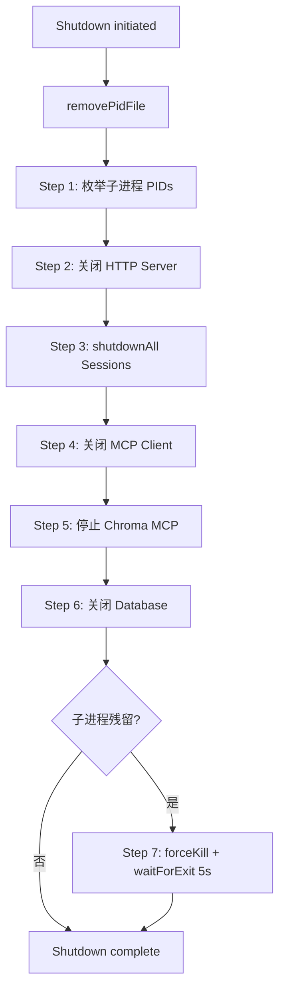
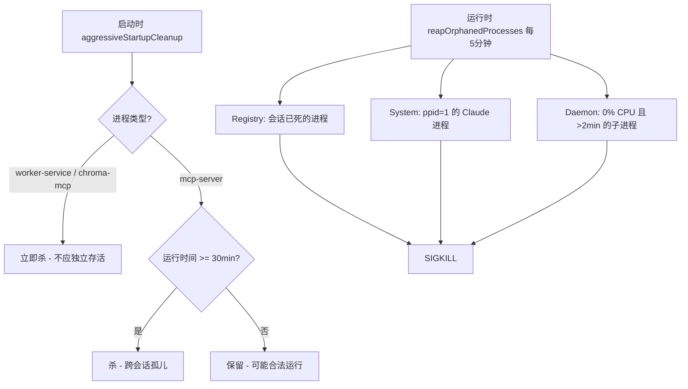
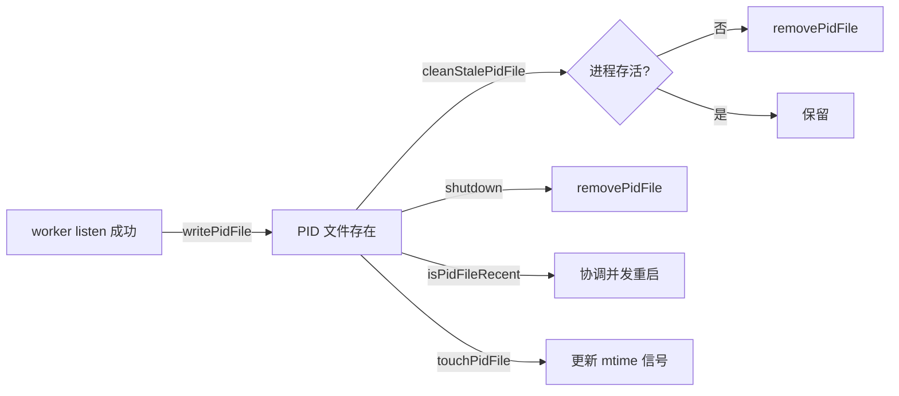

# PD-109.01 claude-mem — 守护进程全生命周期管理

> 文档编号：PD-109.01
> 来源：claude-mem `src/services/infrastructure/ProcessManager.ts` `src/services/infrastructure/GracefulShutdown.ts` `src/services/infrastructure/HealthMonitor.ts` `src/services/worker/ProcessRegistry.ts`
> GitHub：https://github.com/thedotmack/claude-mem.git
> 问题域：PD-109 进程生命周期管理 Process Lifecycle Management
> 状态：可复用方案

---

## 第 1 章 问题与动机

### 1.1 核心问题

长驻守护进程（daemon）在 Agent 系统中承担后台服务角色，但面临一系列生命周期难题：

1. **多实例冲突** — 多个 CLI 会话同时启动 worker，导致端口争抢和数据竞争
2. **僵尸进程泄漏** — SDK 子进程（如 Claude Code subprocess）不正确退出，累积到 155 个进程 / 51GB 内存（Issue #737）
3. **关闭顺序错误** — HTTP 连接、MCP 通道、数据库、子进程的关闭顺序不当导致数据丢失或端口残留
4. **跨平台差异** — Windows 的 socket 句柄继承、进程树终止、Bun 运行时兼容等问题
5. **版本热更新** — 插件更新后旧 worker 仍在运行，需要检测版本不匹配并自动重启

### 1.2 claude-mem 的解法概述

claude-mem 将进程管理从 2000 行的 `worker-service.ts` 单体中拆分为 4 个专职模块，形成完整的进程生命周期管理体系：

1. **PID 文件协调** — JSON 格式 PID 文件（含 pid/port/startedAt），worker 自己在 `listen()` 成功后写入，避免 spawner 写入的竞态（`ProcessManager.ts:133-136`）
2. **7 步有序关闭** — `performGracefulShutdown` 按 HTTP→Session→MCP→Chroma→DB→子进程→PID 的固定顺序关闭，先枚举子进程再逐步关闭服务（`GracefulShutdown.ts:57-105`）
3. **三层孤儿清理** — 启动时 aggressive cleanup（立即杀 worker/chroma 残留）+ 运行时 5 分钟 reaper（registry-based + ppid=1 orphan + idle daemon children）+ 关闭时 force kill（`ProcessManager.ts:448-571`, `ProcessRegistry.ts:293-317`）
4. **跨平台守护进程生成** — Unix 用 `setsid` 隔离终端信号，Windows 用 PowerShell `Start-Process -WindowStyle Hidden`，运行时自动解析 Bun 路径（`ProcessManager.ts:622-696`）
5. **版本匹配与重启协调** — 通过 PID 文件 mtime 协调并发重启，防止 100 个会话同时重启的"重启风暴"（`worker-service.ts:902-996`）

### 1.3 设计思想

| 设计原则 | 具体实现 | 理由 | 替代方案 |
|----------|----------|------|----------|
| Worker 自写 PID | `writePidFile` 在 `listen()` 后调用 | 避免 spawner 写入时 worker 尚未就绪的竞态；Windows 上 spawner PID 是 cmd.exe 无用 | spawner 写入（有竞态） |
| 先枚举后关闭 | Step 1 枚举子进程 → Step 2-6 关闭服务 → Step 7 杀残留 | 关闭服务过程中子进程可能已退出，先枚举确保不遗漏 | 关闭后再枚举（可能遗漏） |
| 双层孤儿策略 | aggressive（立即杀）+ age-gated（30 分钟阈值） | worker-service 和 chroma-mcp 不应独立存活；mcp-server 可能合法运行 | 统一阈值（误杀合法进程） |
| setsid 隔离 | Unix 守护进程用 `setsid` 创建新会话 | 防止 SIGHUP 从终端传播到 daemon，即使进程内 SIGHUP handler 失败也安全 | 仅 `detached: true`（不够隔离） |
| PID 文件 mtime 协调 | `isPidFileRecent` + `touchPidFile` | 多会话检测到版本不匹配时，通过 mtime 判断是否有其他会话正在重启 | 分布式锁（过重） |

---

## 第 2 章 源码实现分析

### 2.1 架构概览

claude-mem 的进程管理分为 4 个模块，各司其职：

```
┌─────────────────────────────────────────────────────────────────┐
│                    worker-service.ts (编排层)                     │
│  ensureWorkerStarted() → spawnDaemon() → waitForHealth()        │
│  registerSignalHandlers() → shutdown() → performGracefulShutdown│
├─────────────┬──────────────┬──────────────┬─────────────────────┤
│ ProcessMgr  │ GracefulShut │ HealthMonitor│ ProcessRegistry     │
│ PID 文件    │ 7 步关闭     │ 健康检查     │ 子进程追踪          │
│ 信号处理    │ 服务接口     │ 版本检测     │ 孤儿 reaper         │
│ 守护进程    │ Windows 适配 │ 端口监控     │ 池化等待            │
│ 孤儿清理    │              │ HTTP 关闭    │ PID 捕获 spawn      │
└─────────────┴──────────────┴──────────────┴─────────────────────┘
```

### 2.2 核心实现

#### 2.2.1 七步有序关闭



对应源码 `src/services/infrastructure/GracefulShutdown.ts:57-105`：

```typescript
export async function performGracefulShutdown(config: GracefulShutdownConfig): Promise<void> {
  logger.info('SYSTEM', 'Shutdown initiated');
  removePidFile();

  // STEP 1: Enumerate all child processes BEFORE we start closing things
  const childPids = await getChildProcesses(process.pid);
  logger.info('SYSTEM', 'Found child processes', { count: childPids.length, pids: childPids });

  // STEP 2: Close HTTP server first
  if (config.server) {
    await closeHttpServer(config.server);
  }
  // STEP 3: Shutdown active sessions
  await config.sessionManager.shutdownAll();
  // STEP 4: Close MCP client connection
  if (config.mcpClient) { await config.mcpClient.close(); }
  // STEP 5: Stop Chroma MCP connection
  if (config.chromaMcpManager) { await config.chromaMcpManager.stop(); }
  // STEP 6: Close database connection
  if (config.dbManager) { await config.dbManager.close(); }

  // STEP 7: Force kill any remaining child processes
  if (childPids.length > 0) {
    for (const pid of childPids) { await forceKillProcess(pid); }
    await waitForProcessesExit(childPids, 5000);
  }
}
```

关键设计：Step 1 在关闭任何服务之前枚举子进程，因为关闭 MCP/Session 可能导致子进程退出，之后再枚举就会遗漏仍在运行的进程。

#### 2.2.2 双层孤儿进程清理



对应源码 `src/services/infrastructure/ProcessManager.ts:448-536`（aggressive cleanup 核心逻辑）：

```typescript
export async function aggressiveStartupCleanup(): Promise<void> {
  const currentPid = process.pid;
  const pidsToKill: number[] = [];
  const allPatterns = [...AGGRESSIVE_CLEANUP_PATTERNS, ...AGE_GATED_CLEANUP_PATTERNS];
  // ... 平台分支 ...
  for (const line of lines) {
    const match = line.trim().match(/^(\d+)\s+(\S+)\s+(.*)$/);
    if (!match) continue;
    const pid = parseInt(match[1], 10);
    const etime = match[2];
    const command = match[3];
    if (!Number.isInteger(pid) || pid <= 0 || pid === currentPid) continue;

    const isAggressive = AGGRESSIVE_CLEANUP_PATTERNS.some(p => command.includes(p));
    if (isAggressive) {
      pidsToKill.push(pid); // 立即杀，无年龄检查
    } else {
      const ageMinutes = parseElapsedTime(etime);
      if (ageMinutes >= ORPHAN_MAX_AGE_MINUTES) {
        pidsToKill.push(pid); // 超过 30 分钟才杀
      }
    }
  }
}
```

### 2.3 实现细节

#### 跨平台守护进程生成

`spawnDaemon` 在 Unix 和 Windows 上采用完全不同的策略（`ProcessManager.ts:622-696`）：

- **Unix**: 优先使用 `/usr/bin/setsid` 创建新会话组，使 daemon 完全脱离终端。若 `setsid` 不可用（如 macOS），回退到 `spawn({ detached: true })`
- **Windows**: 使用 `PowerShell Start-Process -WindowStyle Hidden` 生成隐藏窗口进程，因为 Windows 的 `detached` 模式会弹出控制台窗口。同时自动解析 Bun 运行时路径（`resolveWorkerRuntimePath`），因为 `worker-service.cjs` 依赖 `bun:sqlite`

#### 信号处理与 SIGHUP 隔离

`createSignalHandler`（`ProcessManager.ts:785-808`）创建可复用的信号处理器，内置 re-entrancy 保护（`isShuttingDownRef`）。daemon 模式下 SIGHUP 被忽略（`worker-service.ts:282-284`），配合 `setsid` 形成双重保护。

#### PID 文件生命周期



PID 文件是 JSON 格式（`ProcessManager.ts:124-128`），包含 `pid`、`port`、`startedAt` 三个字段，比传统的纯 PID 文件携带更多诊断信息。`cleanStalePidFile`（`ProcessManager.ts:767-779`）在每次 `ensureWorkerStarted` 开头调用，用 `kill(pid, 0)` 检测进程是否存活，清理 WSL2 休眠、OOM kill 等非正常死亡留下的陈旧 PID 文件。

#### ProcessRegistry 子进程追踪

`ProcessRegistry`（`ProcessRegistry.ts:1-411`）解决 SDK 隐藏子进程 PID 的问题：

- `createPidCapturingSpawn`（L328-390）拦截 SDK 的 `spawn` 调用，捕获 PID 并注册到 Map
- `ensureProcessExit`（L136-173）在会话结束时验证子进程退出，超时后升级到 SIGKILL
- `startOrphanReaper`（L396-411）每 5 分钟运行一次，清理 registry 中会话已死但进程仍在的孤儿
- `waitForSlot`（L94-118）实现基于 Promise 的池化等待，避免轮询 CPU 开销

---

## 第 3 章 迁移指南

### 3.1 迁移清单

**阶段 1：PID 文件管理（1 个文件）**
- [ ] 创建 `PidManager` 模块，实现 `writePidFile`/`readPidFile`/`removePidFile`/`cleanStalePidFile`
- [ ] PID 文件使用 JSON 格式（pid + port + startedAt），存放在 `~/.your-app/worker.pid`
- [ ] 在 `server.listen()` 成功回调中写入 PID 文件（不在 spawner 中写）
- [ ] 在 shutdown 流程最开始调用 `removePidFile`

**阶段 2：有序关闭（1 个文件）**
- [ ] 定义 `ShutdownableService`/`CloseableClient`/`CloseableDatabase` 接口
- [ ] 实现 `performGracefulShutdown`，按依赖顺序关闭：HTTP → 业务会话 → 外部连接 → 数据库 → 子进程
- [ ] 关闭前先枚举子进程 PID 列表
- [ ] Windows 平台 HTTP 关闭前后各加 500ms 延迟

**阶段 3：孤儿清理（1 个文件）**
- [ ] 定义进程模式列表（哪些进程名需要清理）
- [ ] 实现 `aggressiveStartupCleanup`：启动时立即杀不应独立存活的进程
- [ ] 实现 `cleanupOrphanedProcesses`：age-gated 清理（默认 30 分钟阈值）
- [ ] 实现 `startOrphanReaper`：定时器每 5 分钟运行一次

**阶段 4：守护进程生成（集成到 PidManager）**
- [ ] Unix: `setsid` + `detached: true` + `unref()`
- [ ] Windows: `PowerShell Start-Process -WindowStyle Hidden`
- [ ] 实现 `isProcessAlive`（`kill(pid, 0)` + EPERM 处理）

### 3.2 适配代码模板

以下是可直接复用的 PID 文件管理 + 有序关闭模板（TypeScript/Node.js）：

```typescript
import { existsSync, writeFileSync, readFileSync, unlinkSync, mkdirSync } from 'fs';
import { spawn } from 'child_process';
import path from 'path';
import { homedir } from 'os';

// ---- PID 文件管理 ----
interface PidInfo { pid: number; port: number; startedAt: string; }

const DATA_DIR = path.join(homedir(), '.your-app');
const PID_FILE = path.join(DATA_DIR, 'worker.pid');

function writePidFile(info: PidInfo): void {
  mkdirSync(DATA_DIR, { recursive: true });
  writeFileSync(PID_FILE, JSON.stringify(info, null, 2));
}

function readPidFile(): PidInfo | null {
  if (!existsSync(PID_FILE)) return null;
  try { return JSON.parse(readFileSync(PID_FILE, 'utf-8')); }
  catch { return null; }
}

function removePidFile(): void {
  try { if (existsSync(PID_FILE)) unlinkSync(PID_FILE); } catch {}
}

function isProcessAlive(pid: number): boolean {
  if (pid <= 0) return false;
  try { process.kill(pid, 0); return true; }
  catch (e: any) { return e.code === 'EPERM'; }
}

function cleanStalePidFile(): void {
  const info = readPidFile();
  if (info && !isProcessAlive(info.pid)) removePidFile();
}

// ---- 有序关闭 ----
interface ShutdownConfig {
  server: import('http').Server | null;
  services: Array<{ name: string; close: () => Promise<void> }>;
}

async function performGracefulShutdown(config: ShutdownConfig): Promise<void> {
  removePidFile();

  // Step 1: 关闭 HTTP
  if (config.server) {
    config.server.closeAllConnections();
    await new Promise<void>((resolve, reject) => {
      config.server!.close(err => err ? reject(err) : resolve());
    });
  }

  // Step 2-N: 按顺序关闭服务
  for (const svc of config.services) {
    try { await svc.close(); }
    catch (e) { console.error(`Failed to close ${svc.name}:`, e); }
  }
}

// ---- 守护进程生成 ----
function spawnDaemon(scriptPath: string, port: number): number | undefined {
  const env = { ...process.env, WORKER_PORT: String(port) };

  if (process.platform === 'win32') {
    // Windows: PowerShell hidden process
    const psCmd = `Start-Process -FilePath '${process.execPath}' -ArgumentList '${scriptPath}','--daemon' -WindowStyle Hidden`;
    try {
      require('child_process').execSync(`powershell -NoProfile -Command "${psCmd}"`, { stdio: 'ignore', env });
      return 0;
    } catch { return undefined; }
  }

  // Unix: setsid for terminal isolation
  const setsidPath = '/usr/bin/setsid';
  const args = existsSync(setsidPath)
    ? [setsidPath, process.execPath, scriptPath, '--daemon']
    : [process.execPath, scriptPath, '--daemon'];
  const cmd = args.shift()!;

  const child = spawn(cmd, args, { detached: true, stdio: 'ignore', env });
  if (!child.pid) return undefined;
  child.unref();
  return child.pid;
}
```

### 3.3 适用场景

| 场景 | 适用度 | 说明 |
|------|--------|------|
| MCP 插件后台 worker | ⭐⭐⭐ | 完美匹配：长驻 daemon + 多会话共享 + 版本热更新 |
| Agent SDK 子进程管理 | ⭐⭐⭐ | ProcessRegistry 的 PID 捕获 spawn 模式直接可用 |
| CLI 工具后台服务 | ⭐⭐ | PID 文件 + 有序关闭适用，孤儿清理可简化 |
| 微服务进程编排 | ⭐ | 建议用 systemd/PM2 等成熟方案，本方案偏轻量 |
| 短生命周期脚本 | ⭐ | 过度设计，不需要 daemon 管理 |

---

## 第 4 章 测试用例

```typescript
import { describe, it, expect, vi, beforeEach, afterEach } from 'vitest';
import { existsSync, writeFileSync, readFileSync, unlinkSync, mkdirSync } from 'fs';
import path from 'path';
import os from 'os';

// 模拟 ProcessManager 核心函数
describe('PID File Management', () => {
  const testDir = path.join(os.tmpdir(), 'test-pid-' + Date.now());
  const pidFile = path.join(testDir, 'worker.pid');

  beforeEach(() => mkdirSync(testDir, { recursive: true }));
  afterEach(() => { try { unlinkSync(pidFile); } catch {} });

  it('should write and read PID file with JSON format', () => {
    const info = { pid: 12345, port: 37777, startedAt: new Date().toISOString() };
    writeFileSync(pidFile, JSON.stringify(info, null, 2));

    const read = JSON.parse(readFileSync(pidFile, 'utf-8'));
    expect(read.pid).toBe(12345);
    expect(read.port).toBe(37777);
    expect(read.startedAt).toBeDefined();
  });

  it('should return null for corrupted PID file', () => {
    writeFileSync(pidFile, 'not-json');
    let result: any = null;
    try { result = JSON.parse(readFileSync(pidFile, 'utf-8')); }
    catch { result = null; }
    expect(result).toBeNull();
  });

  it('should detect stale PID file when process is dead', () => {
    const info = { pid: 999999, port: 37777, startedAt: new Date().toISOString() };
    writeFileSync(pidFile, JSON.stringify(info));

    // PID 999999 almost certainly doesn't exist
    let alive = false;
    try { process.kill(999999, 0); alive = true; }
    catch { alive = false; }
    expect(alive).toBe(false);
  });
});

describe('parseElapsedTime', () => {
  // 从 ProcessManager.ts:271-300 提取的解析逻辑
  function parseElapsedTime(etime: string): number {
    if (!etime || etime.trim() === '') return -1;
    const cleaned = etime.trim();
    const dayMatch = cleaned.match(/^(\d+)-(\d+):(\d+):(\d+)$/);
    if (dayMatch) return parseInt(dayMatch[1]) * 24 * 60 + parseInt(dayMatch[2]) * 60 + parseInt(dayMatch[3]);
    const hourMatch = cleaned.match(/^(\d+):(\d+):(\d+)$/);
    if (hourMatch) return parseInt(hourMatch[1]) * 60 + parseInt(hourMatch[2]);
    const minMatch = cleaned.match(/^(\d+):(\d+)$/);
    if (minMatch) return parseInt(minMatch[1]);
    return -1;
  }

  it('should parse MM:SS format', () => {
    expect(parseElapsedTime('05:30')).toBe(5);
    expect(parseElapsedTime('45:00')).toBe(45);
  });

  it('should parse HH:MM:SS format', () => {
    expect(parseElapsedTime('02:30:00')).toBe(150);
  });

  it('should parse DD-HH:MM:SS format', () => {
    expect(parseElapsedTime('1-02:30:00')).toBe(1590); // 1*24*60 + 2*60 + 30
  });

  it('should return -1 for empty/invalid input', () => {
    expect(parseElapsedTime('')).toBe(-1);
    expect(parseElapsedTime('invalid')).toBe(-1);
  });
});

describe('Graceful Shutdown Order', () => {
  it('should close services in correct order', async () => {
    const order: string[] = [];
    const mockConfig = {
      server: {
        closeAllConnections: () => order.push('http-connections'),
        close: (cb: (err?: Error) => void) => { order.push('http-server'); cb(); }
      },
      services: [
        { name: 'sessions', close: async () => { order.push('sessions'); } },
        { name: 'mcp', close: async () => { order.push('mcp'); } },
        { name: 'database', close: async () => { order.push('database'); } },
      ]
    };

    // Simulate shutdown
    mockConfig.server.closeAllConnections();
    await new Promise<void>((resolve) => mockConfig.server.close(() => resolve()));
    for (const svc of mockConfig.services) await svc.close();

    expect(order).toEqual(['http-connections', 'http-server', 'sessions', 'mcp', 'database']);
  });
});

describe('Signal Handler', () => {
  it('should prevent re-entrant shutdown', async () => {
    let shutdownCount = 0;
    const isShuttingDownRef = { value: false };

    const handler = async (signal: string) => {
      if (isShuttingDownRef.value) return;
      isShuttingDownRef.value = true;
      shutdownCount++;
    };

    await handler('SIGTERM');
    await handler('SIGTERM'); // 第二次应被忽略
    expect(shutdownCount).toBe(1);
  });
});
```

---

## 第 5 章 跨域关联

| 关联域 | 关系类型 | 说明 |
|--------|----------|------|
| PD-03 容错与重试 | 协同 | `cleanStalePidFile` 处理 WSL2 休眠/OOM kill 等非正常死亡；`ensureWorkerStarted` 含健康检查重试逻辑 |
| PD-05 沙箱隔离 | 协同 | `setsid` 创建新会话组实现终端信号隔离；`ProcessRegistry.createPidCapturingSpawn` 通过 `cwd` 实现会话级文件隔离 |
| PD-11 可观测性 | 依赖 | 所有进程操作通过 `logger` 记录结构化日志（含 pid、ageMinutes、platform 等字段），支持事后诊断 |
| PD-04 工具系统 | 协同 | MCP Client 作为关闭序列的一环（Step 4），其生命周期由 GracefulShutdown 统一管理 |

---

## 第 6 章 来源文件索引

| 文件 | 行范围 | 关键实现 |
|------|--------|----------|
| `src/services/infrastructure/ProcessManager.ts` | L22-24 | PID 文件路径常量定义 |
| `src/services/infrastructure/ProcessManager.ts` | L27-34 | 孤儿进程模式列表 + 30 分钟阈值 |
| `src/services/infrastructure/ProcessManager.ts` | L133-165 | PID 文件读写删除 |
| `src/services/infrastructure/ProcessManager.ts` | L183-265 | 子进程枚举 + 强制杀 + 等待退出 |
| `src/services/infrastructure/ProcessManager.ts` | L271-300 | ps etime 格式解析器 |
| `src/services/infrastructure/ProcessManager.ts` | L312-429 | age-gated 孤儿清理（Unix + Windows） |
| `src/services/infrastructure/ProcessManager.ts` | L448-571 | aggressive 启动清理 |
| `src/services/infrastructure/ProcessManager.ts` | L622-696 | 跨平台守护进程生成（setsid / PowerShell） |
| `src/services/infrastructure/ProcessManager.ts` | L708-725 | isProcessAlive（kill-0 + EPERM） |
| `src/services/infrastructure/ProcessManager.ts` | L737-758 | PID 文件 mtime 协调（isPidFileRecent / touchPidFile） |
| `src/services/infrastructure/ProcessManager.ts` | L785-808 | 信号处理器工厂（re-entrancy 保护） |
| `src/services/infrastructure/GracefulShutdown.ts` | L20-48 | 可关闭服务接口定义 |
| `src/services/infrastructure/GracefulShutdown.ts` | L57-105 | 7 步有序关闭主流程 |
| `src/services/infrastructure/GracefulShutdown.ts` | L111-130 | Windows HTTP 关闭延迟 |
| `src/services/infrastructure/HealthMonitor.ts` | L20-86 | 端口检测 + 健康/就绪轮询 |
| `src/services/infrastructure/HealthMonitor.ts` | L93-114 | HTTP 关闭请求 |
| `src/services/infrastructure/HealthMonitor.ts` | L164-174 | 版本匹配检测 |
| `src/services/worker/ProcessRegistry.ts` | L25-33 | TrackedProcess 结构 + Map registry |
| `src/services/worker/ProcessRegistry.ts` | L136-173 | ensureProcessExit（SIGKILL 升级） |
| `src/services/worker/ProcessRegistry.ts` | L188-253 | killIdleDaemonChildren（0% CPU + >2min） |
| `src/services/worker/ProcessRegistry.ts` | L259-288 | killSystemOrphans（ppid=1） |
| `src/services/worker/ProcessRegistry.ts` | L293-317 | reapOrphanedProcesses（三层清理） |
| `src/services/worker/ProcessRegistry.ts` | L328-390 | PID 捕获 spawn 工厂 |
| `src/services/worker/ProcessRegistry.ts` | L396-411 | 孤儿 reaper 定时器 |
| `src/services/worker-service.ts` | L265-293 | 信号注册 + SIGHUP daemon 隔离 |
| `src/services/worker-service.ts` | L350-372 | start()：listen → writePidFile → background init |
| `src/services/worker-service.ts` | L847-867 | shutdown()：停 reaper → performGracefulShutdown |
| `src/services/worker-service.ts` | L902-996 | ensureWorkerStarted：PID 清理 → 版本检查 → spawn → 健康等待 |

---

## 第 7 章 横向对比维度

```json comparison_data
{
  "project": "claude-mem",
  "dimensions": {
    "PID 协调": "JSON PID 文件（pid+port+startedAt），worker 自写避免竞态，mtime 协调并发重启",
    "关闭策略": "7 步固定顺序：先枚举子进程，再 HTTP→Session→MCP→Chroma→DB→forceKill",
    "孤儿清理": "三层：启动 aggressive + 运行时 5min reaper（registry+ppid=1+idle daemon）+ 关闭 forceKill",
    "跨平台适配": "Unix setsid 隔离 + Windows PowerShell Hidden + Bun 运行时自动解析",
    "子进程追踪": "ProcessRegistry Map + PID 捕获 spawn + ensureProcessExit SIGKILL 升级",
    "版本热更新": "health API 版本检测 + PID mtime 防重启风暴 + httpShutdown → respawn"
  }
}
```

### 域元数据补充

```json domain_metadata
{
  "solution_summary": "claude-mem 用 JSON PID 文件 + 7 步有序关闭 + 三层孤儿清理（aggressive/age-gated/reaper）+ setsid 守护进程隔离实现完整进程生命周期管理",
  "description": "涵盖版本热更新协调、并发重启防风暴、子进程 PID 捕获追踪",
  "sub_problems": [
    "版本不匹配检测与自动重启",
    "并发会话重启风暴防护",
    "SDK 隐藏子进程 PID 捕获",
    "Windows zombie port 修复"
  ],
  "best_practices": [
    "PID 文件由 worker 在 listen 成功后自写，不由 spawner 写入",
    "区分 aggressive（立即杀）和 age-gated（阈值杀）两类孤儿清理策略",
    "用 PID 文件 mtime 协调多会话并发重启",
    "daemon 模式忽略 SIGHUP + setsid 双重终端隔离"
  ]
}
```
