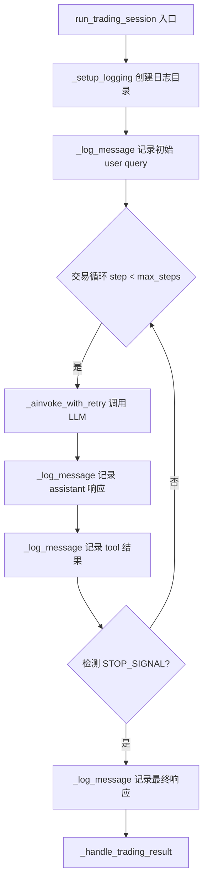
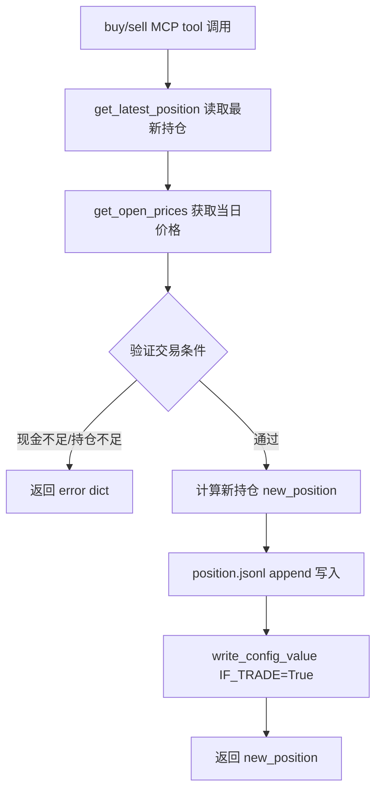

# PD-11.AI-Trader AI-Trader — JSONL 交易日志与金融绩效指标体系

> 文档编号：PD-11.AI-Trader
> 来源：AI-Trader `agent/base_agent/base_agent.py`, `tools/calculate_metrics.py`, `tools/plot_metrics.py`
> GitHub：https://github.com/HKUDS/AI-Trader.git
> 问题域：PD-11 可观测性 Observability & Cost Tracking
> 状态：可复用方案

---

## 第 1 章 问题与动机

### 1.1 核心问题

LLM 驱动的交易 Agent 在多日连续运行中面临三大可观测性挑战：

1. **对话过程不可追溯**：Agent 每日与 LLM 进行多轮对话做出交易决策，如果不记录完整对话链，事后无法复盘"为什么在某天买入了 NVDA"。
2. **持仓变化缺乏审计轨迹**：每次 buy/sell 操作改变持仓状态，需要一条不可篡改的追加式记录链来保证审计完整性。
3. **绩效评估需要标准化指标**：交易策略好不好，不能只看最终收益，需要 Sharpe/Sortino/MDD/Calmar 等金融标准指标，且需要支持多市场（美股/A股/加密货币）的年化参数差异。

AI-Trader 的解法是：**JSONL 追加式双轨日志（对话日志 + 持仓日志）+ 离线绩效指标计算管线 + Matplotlib 多 Agent 对比可视化**。

### 1.2 AI-Trader 的解法概述

1. **JSONL 对话日志**：`BaseAgent._log_message()` 在 `agent/base_agent/base_agent.py:413-421` 将每轮 Agent 对话以 JSONL 格式追加写入 `data/agent_data/{signature}/log/{date}/log.jsonl`，包含 signature 和 new_messages 字段。
2. **JSONL 持仓日志**：`tool_trade.py:206-221` 中 buy/sell 操作将每次交易以 `{date, id, this_action, positions}` 格式追加到 `position.jsonl`，id 单调递增保证操作序列完整。
3. **LangChain verbose/debug 模式**：`base_agent.py:334-341` 通过 `set_verbose(True)` 和 `set_debug(True)` 开启 LangChain 内部推理追踪，`StdOutCallbackHandler` 输出到 stdout。
4. **离线绩效计算**：`calculate_metrics.py:194-271` 从 position.jsonl 加载持仓序列，结合价格数据计算 CR/SR/Sharpe/Vol/MDD/Calmar/Win Rate 共 14 项指标，输出 `performance_metrics.json`。
5. **多 Agent 对比可视化**：`plot_metrics.py` 用 Matplotlib+Seaborn 生成 4 维滚动指标图（CR/SR/Vol/MDD），支持 6 个 Agent + 基准线（QQQ/SSE-50）对比。

### 1.3 设计思想

| 设计原则 | 具体实现 | 理由 | 替代方案 |
|----------|----------|------|----------|
| 追加式不可变日志 | JSONL append-only 写入 | 保证审计完整性，不会因覆盖丢失历史 | SQLite WAL（更重但支持查询） |
| 对话与持仓分离 | log.jsonl 记对话，position.jsonl 记持仓 | 关注点分离，持仓文件可独立用于绩效计算 | 单文件混合记录（耦合度高） |
| 离线批量计算 | calculate_metrics.py 独立脚本 | 不影响交易实时性，可反复重算 | 实时流式计算（复杂度高） |
| 多市场适配 | periods_per_year 参数化（252/365/252*6.5） | 美股/加密/小时级交易的年化参数不同 | 硬编码 252（只适用美股日线） |
| LangChain 原生追踪 | StdOutCallbackHandler + verbose/debug | 零额外依赖，利用框架内置能力 | Langfuse/LangSmith（功能强但需外部服务） |

---

## 第 2 章 源码实现分析

### 2.1 架构概览

```
┌─────────────────────────────────────────────────────────────┐
│                    AI-Trader 可观测性架构                      │
├─────────────────────────────────────────────────────────────┤
│                                                             │
│  ┌──────────────┐    ┌──────────────┐    ┌──────────────┐  │
│  │  BaseAgent   │───→│  _log_message │───→│ log.jsonl    │  │
│  │ 交易循环      │    │  对话日志写入  │    │ 对话追踪      │  │
│  └──────┬───────┘    └──────────────┘    └──────────────┘  │
│         │                                                   │
│         │ MCP tool call                                     │
│         ▼                                                   │
│  ┌──────────────┐    ┌──────────────┐    ┌──────────────┐  │
│  │  tool_trade   │───→│ position.jsonl│───→│ calculate_   │  │
│  │  buy/sell     │    │ 持仓追加日志  │    │ metrics.py   │  │
│  └──────────────┘    └──────────────┘    │ 离线绩效计算  │  │
│                                          └──────┬───────┘  │
│  ┌──────────────┐                               │          │
│  │ StdOutCallback│    ┌──────────────┐          ▼          │
│  │ Handler       │    │ plot_metrics  │  ┌──────────────┐  │
│  │ LangChain追踪 │    │ .py 可视化    │←─│ performance_ │  │
│  └──────────────┘    └──────────────┘  │ metrics.json │  │
│                                         └──────────────┘  │
└─────────────────────────────────────────────────────────────┘
```

### 2.2 核心实现

#### 2.2.1 JSONL 对话日志系统



对应源码 `agent/base_agent/base_agent.py:406-421`：

```python
def _setup_logging(self, today_date: str) -> str:
    """Set up log file path"""
    log_path = os.path.join(self.base_log_path, self.signature, "log", today_date)
    if not os.path.exists(log_path):
        os.makedirs(log_path)
    return os.path.join(log_path, "log.jsonl")

def _log_message(self, log_file: str, new_messages: List[Dict[str, str]]) -> None:
    """Log messages to log file"""
    log_entry = {
        "signature": self.signature,
        "new_messages": new_messages
    }
    with open(log_file, "a", encoding="utf-8") as f:
        f.write(json.dumps(log_entry, ensure_ascii=False) + "\n")
```

日志目录结构按 `{signature}/log/{date}/log.jsonl` 组织，每个交易日一个独立文件，天然支持按日期检索。每条 JSONL 记录包含 `signature`（Agent 标识）和 `new_messages`（本轮对话内容），追加写入保证不丢失。

#### 2.2.2 持仓追加式审计日志



对应源码 `agent_tools/tool_trade.py:206-221`：

```python
position_file_path = os.path.join(project_root, "data", log_path, signature,
                                   "position", "position.jsonl")
with open(position_file_path, "a") as f:
    print(
        f"Writing to position.jsonl: {json.dumps({'date': today_date, 'id': current_action_id + 1, 'this_action':{'action':'buy','symbol':symbol,'amount':amount},'positions': new_position})}"
    )
    f.write(
        json.dumps({
            "date": today_date,
            "id": current_action_id + 1,
            "this_action": {"action": "buy", "symbol": symbol, "amount": amount},
            "positions": new_position,
        }) + "\n"
    )
```

每条持仓记录包含 4 个关键字段：
- `date`：交易日期/时间戳
- `id`：单调递增操作序号，保证操作顺序可追溯
- `this_action`：本次操作详情（buy/sell/no_trade + symbol + amount）
- `positions`：操作后的完整持仓快照（全量而非增量，便于任意时点恢复）

文件锁机制 `_position_lock()` (`tool_trade.py:23-52`) 使用 `fcntl.flock(LOCK_EX)` 保证并行 Agent 场景下持仓更新的原子性。

#### 2.2.3 LangChain verbose/debug 追踪

对应源码 `agent/base_agent/base_agent.py:334-341` 和 `456-464`：

```python
# 初始化时开启全局 verbose/debug
if self.verbose:
    set_verbose(True)
    try:
        set_debug(True)
    except Exception:
        pass
    print("🔍 LangChain verbose mode enabled (with debug)")

# 交易会话中注入 StdOutCallbackHandler
if self.verbose and _ConsoleHandler is not None:
    handler = _ConsoleHandler()
    self.agent = self.agent.with_config({
        "callbacks": [handler],
        "tags": [self.signature, today_date],
        "run_name": f"{self.signature}-session"
    })
```

通过 `with_config` 注入 `tags` 和 `run_name`，为每个交易会话打上 Agent 签名和日期标签，便于在 LangChain 追踪系统中按维度筛选。`_ConsoleHandler` 的导入使用三层 try-except 兼容 LangChain 0.1/0.2+/core 三个版本的模块路径变化（`base_agent.py:24-33`）。

### 2.3 实现细节

#### 离线绩效指标计算管线

`tools/calculate_metrics.py:194-271` 实现了完整的金融绩效指标计算：

```python
def calculate_metrics(portfolio_df, periods_per_year=252, risk_free_rate=0.0):
    values = portfolio_df['total_value'].values
    returns = np.diff(values) / values[:-1]

    # 14 项指标
    cr = (values[-1] - values[0]) / values[0]                    # 累计收益率
    vol = np.std(returns) * np.sqrt(periods_per_year)             # 年化波动率
    sharpe = (excess_return / np.std(returns) * np.sqrt(periods_per_year))  # Sharpe
    # Sortino: 只用下行偏差
    negative_returns = returns[returns < 0]
    downside_std = np.std(negative_returns)
    sortino = excess_return / downside_std * np.sqrt(periods_per_year)
    # MDD: 最大回撤
    cumulative = np.cumprod(1 + returns)
    running_max = np.maximum.accumulate(cumulative)
    drawdown = (cumulative - running_max) / running_max
    mdd = np.min(drawdown)
```

多市场年化参数适配（`calculate_metrics.py:342-351`）：
- 美股日线：`periods_per_year = 252`
- 加密货币：`periods_per_year = 365`（全年无休）
- 美股小时级：`periods_per_year = 252 * 6.5`（每天 6.5 小时交易）

#### 多 Agent 滚动指标可视化

`tools/plot_metrics.py:52-128` 实现了 expanding window 滚动指标计算，避免早期数据点不稳定：

```python
def calculate_rolling_metrics(df, is_hourly=True):
    min_periods = 10 if is_hourly else 3  # 最小观测窗口
    for i in range(len(df)):
        if i < min_periods:
            sortino_ratios.append(np.nan)  # 数据不足时跳过
            continue
        # Sortino 上限裁剪防止极端值
        sortino = np.clip(sortino, -20, 20)
```

可视化支持 6 个 Agent（DeepSeek/MiniMax/Claude/GPT-5/Qwen3/Gemini）+ 基准线（QQQ/SSE-50/CD5 加密指数）的对比，每个 Agent 有独立配色（`plot_metrics.py:30-37`）。

#### 前端缓存预计算

`scripts/precompute_frontend_cache.py` 将所有 Agent 的持仓历史和资产价值序列预计算为 JSON 缓存文件，包含版本哈希（基于 position 文件 mtime）用于前端增量更新检测（`precompute_frontend_cache.py:23-47`）。


---

## 第 3 章 迁移指南

### 3.1 迁移清单

**阶段 1：JSONL 追加式日志（1-2 天）**
- [ ] 创建 `SessionLogger` 类，封装 JSONL 追加写入逻辑
- [ ] 定义日志目录结构：`{data_root}/{agent_id}/log/{date}/log.jsonl`
- [ ] 实现 `log_message(session_id, role, content)` 方法
- [ ] 在 Agent 主循环中插入日志调用点

**阶段 2：持仓/状态审计日志（1-2 天）**
- [ ] 定义状态快照 schema：`{timestamp, id, action, state}`
- [ ] 实现追加写入 + 文件锁（`fcntl.flock` 或跨平台替代）
- [ ] 实现 `get_latest_state()` 从 JSONL 尾部读取最新状态

**阶段 3：绩效指标计算（2-3 天）**
- [ ] 移植 `calculate_metrics()` 函数，适配自己的状态序列格式
- [ ] 根据业务场景选择合适的 `periods_per_year` 参数
- [ ] 输出 JSON 格式指标文件，供前端/报告消费

**阶段 4：可视化与对比（可选）**
- [ ] 移植 `calculate_rolling_metrics()` 滚动指标计算
- [ ] 实现多 Agent 对比图表生成

### 3.2 适配代码模板

#### JSONL 追加式日志器

```python
import json
import os
import fcntl
from datetime import datetime
from pathlib import Path
from typing import Any, Dict, List, Optional


class JSONLLogger:
    """JSONL 追加式日志器，适用于 Agent 对话和状态审计。
    
    移植自 AI-Trader BaseAgent._log_message 模式。
    """
    
    def __init__(self, base_dir: str, agent_id: str):
        self.base_dir = Path(base_dir)
        self.agent_id = agent_id
    
    def _get_log_path(self, session_date: str, log_type: str = "conversation") -> Path:
        """按日期和类型组织日志文件路径"""
        log_dir = self.base_dir / self.agent_id / log_type / session_date
        log_dir.mkdir(parents=True, exist_ok=True)
        return log_dir / f"{log_type}.jsonl"
    
    def log_conversation(self, session_date: str, role: str, content: str,
                         metadata: Optional[Dict] = None) -> None:
        """记录对话消息"""
        entry = {
            "timestamp": datetime.now().isoformat(),
            "agent_id": self.agent_id,
            "role": role,
            "content": content,
        }
        if metadata:
            entry["metadata"] = metadata
        
        log_path = self._get_log_path(session_date, "conversation")
        with open(log_path, "a", encoding="utf-8") as f:
            f.write(json.dumps(entry, ensure_ascii=False) + "\n")
    
    def log_state_change(self, session_date: str, action_id: int,
                         action: Dict[str, Any], state: Dict[str, Any]) -> None:
        """记录状态变更（带文件锁保证原子性）"""
        entry = {
            "date": session_date,
            "id": action_id,
            "action": action,
            "state": state,
        }
        
        log_path = self._get_log_path(session_date, "state")
        with open(log_path, "a", encoding="utf-8") as f:
            fcntl.flock(f.fileno(), fcntl.LOCK_EX)
            try:
                f.write(json.dumps(entry, ensure_ascii=False) + "\n")
            finally:
                fcntl.flock(f.fileno(), fcntl.LOCK_UN)
    
    def get_latest_state(self, log_type: str = "state") -> Optional[Dict]:
        """从 JSONL 文件读取最新状态记录"""
        state_dir = self.base_dir / self.agent_id / log_type
        if not state_dir.exists():
            return None
        
        # 找到最新日期目录
        date_dirs = sorted(state_dir.iterdir(), reverse=True)
        for date_dir in date_dirs:
            log_file = date_dir / f"{log_type}.jsonl"
            if log_file.exists():
                last_line = None
                with open(log_file, "r") as f:
                    for line in f:
                        if line.strip():
                            last_line = line
                if last_line:
                    return json.loads(last_line)
        return None
```

#### 绩效指标计算器（通用版）

```python
import numpy as np
from typing import Dict, List


def calculate_performance_metrics(
    values: List[float],
    periods_per_year: int = 252,
    risk_free_rate: float = 0.0,
) -> Dict[str, float]:
    """通用绩效指标计算，移植自 AI-Trader calculate_metrics。
    
    Args:
        values: 时间序列的资产价值列表
        periods_per_year: 年化周期数（日线=252, 加密=365, 小时=252*6.5）
        risk_free_rate: 年化无风险利率
    
    Returns:
        包含 CR/Sharpe/Sortino/Vol/MDD 等指标的字典
    """
    arr = np.array(values, dtype=float)
    returns = np.diff(arr) / arr[:-1]
    
    cr = (arr[-1] - arr[0]) / arr[0]
    vol = np.std(returns) * np.sqrt(periods_per_year) if len(returns) > 1 else 0.0
    
    excess = np.mean(returns) - (risk_free_rate / periods_per_year)
    sharpe = (excess / np.std(returns) * np.sqrt(periods_per_year)) if np.std(returns) > 0 else 0.0
    
    neg = returns[returns < 0]
    if len(neg) > 0:
        sortino = (excess / np.std(neg) * np.sqrt(periods_per_year)) if np.std(neg) > 0 else 0.0
    else:
        sortino = float('inf') if np.mean(returns) > 0 else 0.0
    
    cum = np.cumprod(1 + returns)
    running_max = np.maximum.accumulate(cum)
    mdd = np.min((cum - running_max) / running_max)
    
    return {
        "cumulative_return": float(cr),
        "sharpe_ratio": float(sharpe),
        "sortino_ratio": float(sortino),
        "volatility": float(vol),
        "max_drawdown": float(mdd),
        "win_rate": float(np.mean(returns > 0)),
        "total_periods": len(returns),
    }
```

### 3.3 适用场景

| 场景 | 适用度 | 说明 |
|------|--------|------|
| LLM 交易 Agent 对话审计 | ⭐⭐⭐ | 完美匹配，JSONL 按日期分文件天然适合交易日志 |
| 多 Agent 策略对比评估 | ⭐⭐⭐ | 14 项金融指标 + 滚动可视化直接可用 |
| 通用 Agent 对话日志 | ⭐⭐ | 日志格式通用，但缺少 token 计量和成本追踪 |
| 实时监控仪表盘 | ⭐ | 离线批量计算模式，不适合实时场景 |
| 高并发多 Agent 系统 | ⭐⭐ | fcntl 文件锁可用但性能有限，高并发建议换 SQLite |

---

## 第 4 章 测试用例

```python
import json
import os
import tempfile
import numpy as np
import pytest


class TestJSONLLogger:
    """测试 JSONL 追加式日志系统"""
    
    def test_conversation_log_append(self, tmp_path):
        """验证对话日志追加写入"""
        log_file = tmp_path / "agent1" / "conversation" / "2025-01-15" / "conversation.jsonl"
        log_file.parent.mkdir(parents=True)
        
        # 模拟 AI-Trader _log_message 行为
        entries = [
            {"signature": "gpt-5", "new_messages": [{"role": "user", "content": "Analyze positions"}]},
            {"signature": "gpt-5", "new_messages": [{"role": "assistant", "content": "Buy NVDA 10 shares"}]},
        ]
        
        for entry in entries:
            with open(log_file, "a", encoding="utf-8") as f:
                f.write(json.dumps(entry, ensure_ascii=False) + "\n")
        
        # 验证追加写入
        lines = log_file.read_text().strip().split("\n")
        assert len(lines) == 2
        assert json.loads(lines[0])["new_messages"][0]["role"] == "user"
        assert json.loads(lines[1])["new_messages"][0]["role"] == "assistant"
    
    def test_position_log_monotonic_id(self, tmp_path):
        """验证持仓日志 id 单调递增"""
        position_file = tmp_path / "position.jsonl"
        
        records = [
            {"date": "2025-01-15", "id": 0, "this_action": {"action": "no_trade"}, 
             "positions": {"CASH": 10000, "NVDA": 0}},
            {"date": "2025-01-15", "id": 1, "this_action": {"action": "buy", "symbol": "NVDA", "amount": 10},
             "positions": {"CASH": 8500, "NVDA": 10}},
            {"date": "2025-01-15", "id": 2, "this_action": {"action": "sell", "symbol": "NVDA", "amount": 5},
             "positions": {"CASH": 9250, "NVDA": 5}},
        ]
        
        for rec in records:
            with open(position_file, "a") as f:
                f.write(json.dumps(rec) + "\n")
        
        # 验证 id 单调递增
        ids = []
        with open(position_file) as f:
            for line in f:
                ids.append(json.loads(line)["id"])
        
        assert ids == sorted(ids)
        assert len(set(ids)) == len(ids)  # 无重复
    
    def test_position_snapshot_completeness(self, tmp_path):
        """验证每条持仓记录包含完整快照"""
        record = {
            "date": "2025-01-15", "id": 1,
            "this_action": {"action": "buy", "symbol": "AAPL", "amount": 5},
            "positions": {"CASH": 9000, "AAPL": 5, "NVDA": 10}
        }
        
        # 验证必要字段
        assert "date" in record
        assert "id" in record
        assert "this_action" in record
        assert "positions" in record
        assert "CASH" in record["positions"]


class TestPerformanceMetrics:
    """测试绩效指标计算"""
    
    def test_cumulative_return(self):
        """验证累计收益率计算"""
        values = [10000, 10500, 11000, 10800, 11500]
        returns_arr = np.diff(values) / np.array(values[:-1], dtype=float)
        cr = (values[-1] - values[0]) / values[0]
        assert abs(cr - 0.15) < 1e-10  # 15% 收益
    
    def test_max_drawdown(self):
        """验证最大回撤计算"""
        values = [10000, 12000, 9000, 11000]  # 峰值 12000 → 谷值 9000
        returns = np.diff(values) / np.array(values[:-1], dtype=float)
        cum = np.cumprod(1 + returns)
        running_max = np.maximum.accumulate(cum)
        drawdown = (cum - running_max) / running_max
        mdd = np.min(drawdown)
        assert abs(mdd - (-0.25)) < 1e-10  # 25% 回撤
    
    def test_zero_volatility(self):
        """验证零波动率场景（价格不变）"""
        values = [10000, 10000, 10000]
        returns = np.diff(values) / np.array(values[:-1], dtype=float)
        vol = np.std(returns) * np.sqrt(252)
        assert vol == 0.0
    
    def test_multi_market_annualization(self):
        """验证多市场年化参数差异"""
        # 相同日收益率，不同年化参数应产生不同年化波动率
        daily_returns = np.array([0.01, -0.005, 0.008, -0.003, 0.012])
        
        vol_stock = np.std(daily_returns) * np.sqrt(252)      # 美股
        vol_crypto = np.std(daily_returns) * np.sqrt(365)      # 加密
        vol_hourly = np.std(daily_returns) * np.sqrt(252 * 6.5)  # 小时级
        
        assert vol_crypto > vol_stock  # 365 > 252
        assert vol_hourly > vol_crypto  # 1638 > 365
    
    def test_sortino_no_negative_returns(self):
        """验证全正收益时 Sortino 处理"""
        values = [10000, 10100, 10200, 10300]
        returns = np.diff(values) / np.array(values[:-1], dtype=float)
        neg = returns[returns < 0]
        assert len(neg) == 0
        # AI-Trader 在此场景返回 inf（如果均值 > 0）
        mean_ret = np.mean(returns)
        assert mean_ret > 0
```


---

## 第 5 章 跨域关联

| 关联域 | 关系类型 | 说明 |
|--------|----------|------|
| PD-01 上下文管理 | 协同 | 对话日志记录了完整的上下文窗口内容，可用于分析上下文压缩策略的效果 |
| PD-03 容错与重试 | 依赖 | `_ainvoke_with_retry` 的重试日志（attempt 次数、错误详情）是可观测性的重要数据源 |
| PD-04 工具系统 | 协同 | MCP 工具调用（buy/sell）的结果通过 position.jsonl 记录，工具执行的 print 输出到 stdout |
| PD-06 记忆持久化 | 协同 | position.jsonl 既是审计日志也是持久化状态存储，`get_latest_position` 从中恢复最新状态 |
| PD-07 质量检查 | 依赖 | 绩效指标（Sharpe/MDD 等）是评估 Agent 交易质量的核心度量，quality gate 可基于这些指标设定阈值 |
| PD-09 Human-in-the-Loop | 协同 | 对话日志支持人类事后审查 Agent 决策过程，verbose 模式支持实时观察推理链 |

---

## 第 6 章 来源文件索引

| 文件 | 行范围 | 关键实现 |
|------|--------|----------|
| `agent/base_agent/base_agent.py` | L24-33 | StdOutCallbackHandler 三层兼容导入 |
| `agent/base_agent/base_agent.py` | L334-341 | LangChain verbose/debug 全局开关 |
| `agent/base_agent/base_agent.py` | L406-421 | `_setup_logging` + `_log_message` JSONL 对话日志 |
| `agent/base_agent/base_agent.py` | L437-519 | `run_trading_session` 交易循环中的日志插入点 |
| `agent/base_agent/base_agent.py` | L456-464 | StdOutCallbackHandler 注入 + tags/run_name 配置 |
| `agent/base_agent/base_agent_hour.py` | L42-128 | 小时级交易会话的日志记录（继承 + 增强） |
| `agent_tools/tool_trade.py` | L23-52 | `_position_lock` fcntl 文件锁实现 |
| `agent_tools/tool_trade.py` | L56-225 | `buy()` 函数含持仓日志写入 |
| `agent_tools/tool_trade.py` | L265-432 | `sell()` 函数含持仓日志写入 |
| `tools/calculate_metrics.py` | L20-26 | `load_position_data` JSONL 持仓加载 |
| `tools/calculate_metrics.py` | L146-191 | `calculate_portfolio_values` 持仓→资产价值序列 |
| `tools/calculate_metrics.py` | L194-271 | `calculate_metrics` 14 项金融绩效指标计算 |
| `tools/calculate_metrics.py` | L296-398 | CLI 入口：多市场检测 + 指标输出 + JSON/CSV 持久化 |
| `tools/plot_metrics.py` | L52-128 | `calculate_rolling_metrics` expanding window 滚动指标 |
| `tools/plot_metrics.py` | L199-256 | `plot_single_metric` 单指标大图生成 |
| `tools/plot_metrics.py` | L258-306 | `plot_market_metrics` 4 维组合图生成 |
| `tools/general_tools.py` | L50-69 | `get_config_value`/`write_config_value` 运行时配置读写 |
| `scripts/precompute_frontend_cache.py` | L23-47 | 版本哈希生成（基于 position 文件 mtime） |
| `scripts/precompute_frontend_cache.py` | L190-212 | 资产价值计算 + 缺失价格处理 |
| `main_parrallel.py` | L100-168 | 并行 Agent 运行时配置隔离（per-signature runtime_env） |

---

## 第 7 章 横向对比维度

> **重要：** 本章用于自动填充 Butcher Wiki 的横向对比表。
> 必须严格按以下 JSON 格式输出，放在 `comparison_data` 代码块中。

```json comparison_data
{
  "project": "AI-Trader",
  "dimensions": {
    "追踪方式": "LangChain StdOutCallbackHandler + verbose/debug 全局开关",
    "数据粒度": "每轮对话 + 每次交易操作（buy/sell/no_trade）",
    "持久化": "JSONL 双轨：对话日志按日期分文件 + 持仓日志追加式全量快照",
    "多提供商": "无多 LLM 提供商追踪，单一 OpenAI 兼容接口",
    "日志格式": "JSONL 追加式，对话含 signature+messages，持仓含 date+id+action+positions",
    "指标采集": "离线批量计算 14 项金融指标（CR/Sharpe/Sortino/Vol/MDD/Calmar/Win Rate 等）",
    "可视化": "Matplotlib+Seaborn 4 维滚动指标图，6 Agent + 基准线对比，PDF 输出",
    "成本追踪": "无 token/成本追踪，仅追踪交易层面的现金变化",
    "Agent 状态追踪": "position.jsonl 全量快照 + 单调递增 id 保证操作序列完整",
    "崩溃安全": "JSONL append-only + fcntl 文件锁保证并行写入原子性",
    "业务元数据注入": "LangChain with_config 注入 tags=[signature, date] 和 run_name",
    "Worker日志隔离": "并行模式下 per-signature 独立 runtime_env.json 配置文件",
    "延迟统计": "无延迟统计，仅通过 verbose 模式输出 LLM 调用过程",
    "金融绩效评估": "Sharpe/Sortino/MDD/Calmar/Win Rate 等标准金融指标，支持多市场年化参数"
  }
}
```

### 域元数据补充

```json domain_metadata
{
  "solution_summary": "AI-Trader 用 JSONL 双轨日志（对话+持仓全量快照）+ 离线 14 项金融绩效指标计算 + Matplotlib 多 Agent 滚动对比可视化实现交易 Agent 可观测性",
  "description": "交易类 Agent 需要金融级审计日志和标准化绩效指标来评估策略质量",
  "sub_problems": [
    "金融绩效指标年化参数适配：美股252/加密365/小时级1638的差异处理",
    "持仓全量快照 vs 增量记录：全量快照便于任意时点恢复但文件膨胀快",
    "多 Agent 滚动指标对比：expanding window 早期数据不稳定需设最小观测窗口",
    "前端缓存版本检测：基于 position 文件 mtime 哈希判断数据是否更新"
  ],
  "best_practices": [
    "持仓日志用全量快照而非增量：每条记录包含完整 positions，任意行可独立恢复状态",
    "操作 id 单调递增：保证操作序列可追溯，支持并发场景下的顺序判定",
    "fcntl 文件锁保护并行写入：多 Agent 共享 position.jsonl 时防止数据交错",
    "滚动指标设最小观测窗口：小时级 min_periods=10，日线 min_periods=3，避免早期极端值"
  ]
}
```

