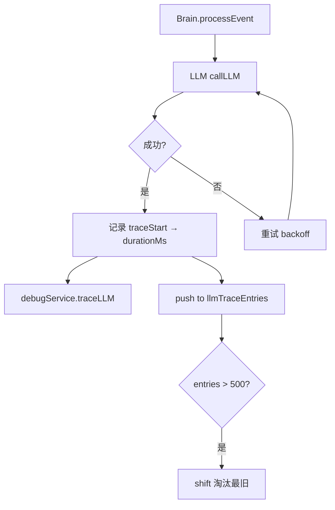
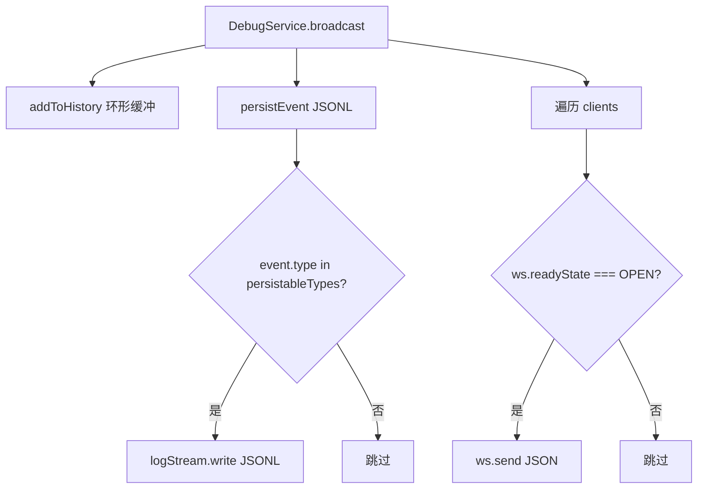

# PD-11.08 AIRI — WebSocket 实时调试与多层可观测性

> 文档编号：PD-11.08
> 来源：AIRI `services/minecraft/src/debug/`, `services/minecraft/src/cognitive/conscious/brain.ts`, `posthog.config.ts`
> GitHub：https://github.com/moeru-ai/airi.git
> 问题域：PD-11 可观测性 Observability & Cost Tracking
> 状态：可复用方案

---

## 第 1 章 问题与动机（≥ 30 行）

### 1.1 核心问题

AIRI 是一个多平台 AI 虚拟角色系统，其 Minecraft 服务中运行着一个完整的认知循环（Brain）——接收感知事件、调用 LLM 推理、通过 REPL 执行动作。这个循环的每一步都可能出错：LLM 返回空内容、REPL 执行失败、动作队列溢出、错误连续爆发。如果没有实时可观测性，开发者只能盲猜 Agent 的内部状态。

核心挑战：
- **认知循环不透明**：Brain 的事件队列、LLM 调用、REPL 执行、动作队列四个阶段互相嵌套，传统日志无法展示因果链
- **LLM 调用需要精确追踪**：每次调用的 token 用量、耗时、模型、重试次数都需要记录，用于成本分析和性能调优
- **多平台产品分析**：Web/Desktop/Mobile/Docs 四个前端平台需要统一的用户行为分析
- **调试面板需要实时性**：开发者需要在 Agent 运行时实时观察其内部状态，而不是事后分析日志

### 1.2 AIRI 的解法概述

1. **DebugService 单例 + WebSocket 实时推送**：所有可观测事件通过 `DebugService.getInstance()` 单例广播到 WebSocket 客户端，支持 12 种事件类型（`services/minecraft/src/debug/debug-service.ts:26-243`）
2. **LlmTraceEntry 结构化追踪**：每次 LLM 调用记录 turnId/model/usage/durationMs/estimatedTokens，存储在内存环形缓冲中（`services/minecraft/src/cognitive/conscious/brain.ts:92-113`）
3. **LlmLogEntry 六类日志**：turn_input/llm_attempt/repl_result/repl_error/scheduler/feedback 六种 kind 覆盖认知循环全阶段（`services/minecraft/src/cognitive/conscious/llm-log.ts:1-6`）
4. **JSONL 文件持久化**：DebugServer 将可持久化事件类型写入 session-*.jsonl 文件，支持 HTTP API 回放（`services/minecraft/src/debug/server.ts:345-360`）
5. **PostHog 多平台产品分析**：四个独立 project key 覆盖 Web/Desktop/Pocket/Docs，统一配置基类（`posthog.config.ts:1-29`）

### 1.3 设计思想

| 设计原则 | 具体实现 | 理由 | 替代方案 |
|----------|----------|------|----------|
| 单例广播 | DebugService.getInstance() 全局唯一 | 避免多实例竞争 WebSocket 端口，简化依赖注入 | 依赖注入容器管理 |
| 双轨存储 | 内存环形缓冲 + JSONL 文件 | 内存保实时性（WebSocket 推送），文件保持久化（事后分析） | 纯数据库存储 |
| 事件类型化 | 12 种 ServerEvent 联合类型 | TypeScript 编译期保证事件结构正确，避免运行时 schema 校验 | JSON Schema 运行时校验 |
| 认知循环内嵌追踪 | Brain 类直接调用 debugService 和 appendLlmLog | 零额外抽象层，追踪代码与业务代码同步演进 | 独立 Tracer 中间件 |
| 多平台分离 | 每个平台独立 PostHog project key | 数据隔离，避免跨平台事件污染分析结果 | 单 key + 平台标签过滤 |

---

## 第 2 章 源码实现分析（≥ 60 行，核心章节）

### 2.1 架构概览

AIRI 的可观测性分为两层：**运行时调试层**（Minecraft 服务内部）和**产品分析层**（前端 PostHog）。

```
┌─────────────────────────────────────────────────────────────────┐
│                    Minecraft Service (Node.js)                   │
│                                                                  │
│  ┌──────────┐    ┌──────────────┐    ┌───────────────────────┐  │
│  │  Brain    │───→│ DebugService │───→│    DebugServer        │  │
│  │          │    │  (Singleton)  │    │  ┌─────────────────┐  │  │
│  │ LlmTrace │    │              │    │  │ WebSocket Server │  │  │
│  │ LlmLog   │    │ 12 event     │    │  │ (broadcast)      │  │  │
│  │ BrainState│   │ types        │    │  ├─────────────────┤  │  │
│  └──────────┘    └──────────────┘    │  │ JSONL Persist   │  │  │
│                                       │  │ (session-*.jsonl)│  │  │
│  ┌──────────┐    ┌──────────────┐    │  ├─────────────────┤  │  │
│  │ EventBus │───→│ TracedEvent  │    │  │ Ring Buffer     │  │  │
│  │ (nanoid  │    │ (traceId +   │    │  │ (MAX_HISTORY=   │  │  │
│  │  traces) │    │  parentId)   │    │  │  1000)          │  │  │
│  └──────────┘    └──────────────┘    │  └─────────────────┘  │  │
│                                       └───────────────────────┘  │
│  ┌──────────────────────────────────────────────────────────┐   │
│  │ MCP REPL Server (port 3001)                               │   │
│  │ Resources: brain-state, brain-context, brain-history,     │   │
│  │            brain-logs                                      │   │
│  │ Tools: execute_repl, inject_chat, get_llm_trace, get_logs │   │
│  └──────────────────────────────────────────────────────────┘   │
└─────────────────────────────────────────────────────────────────┘

┌─────────────────────────────────────────────────────────────────┐
│                    Frontend (Vue/Pinia)                           │
│  ┌──────────────┐    ┌──────────────┐    ┌──────────────────┐   │
│  │ PostHog SDK  │    │ Analytics    │    │ useAnalytics()   │   │
│  │ 4 project    │    │ Store (Pinia)│    │ composable       │   │
│  │ keys         │    │ buildInfo    │    │ trackFirstMsg    │   │
│  └──────────────┘    └──────────────┘    └──────────────────┘   │
└─────────────────────────────────────────────────────────────────┘
```

### 2.2 核心实现

#### 2.2.1 LlmTraceEntry — LLM 调用追踪



对应源码 `services/minecraft/src/cognitive/conscious/brain.ts:1899-1947`：

```typescript
const traceStart = Date.now()

const llmResult = await this.deps.llmAgent.callLLM({
  messages,
})

this.debugService.traceLLM({
  route: 'brain',
  messages,
  content,
  reasoning,
  usage: llmResult.usage,
  model: config.openai.model,
  duration: Date.now() - traceStart,
})
// Store lightweight trace (no full messages clone to prevent O(turns²) memory)
const estimatedTokens = Math.ceil(messages.reduce((sum, m) => {
  const c = typeof m.content === 'string' ? m.content.length : 0
  return sum + c
}, 0) / 4)
this.llmTraceEntries.push({
  id: ++this.llmTraceIdCounter,
  turnId,
  timestamp: Date.now(),
  eventType: event.type,
  sourceType: event.source.type,
  sourceId: event.source.id,
  attempt,
  model: config.openai.model,
  messageCount: messages.length,
  estimatedTokens,
  content,
  reasoning,
  usage: llmResult.usage,
  durationMs: Date.now() - traceStart,
})
if (this.llmTraceEntries.length > 500) {
  this.llmTraceEntries.shift()
}
```

关键设计点：
- **O(turns²) 内存防护**：注释明确说明不再存储完整 messages 数组，改用 messageCount + estimatedTokens 做诊断（`brain.ts:101-102`）
- **Token 估算**：用 `content.length / 4` 做粗略估算，不依赖 tiktoken 库
- **环形缓冲**：500 条上限，超出后 shift 淘汰最旧条目

#### 2.2.2 DebugServer — WebSocket 广播 + JSONL 持久化



对应源码 `services/minecraft/src/debug/server.ts:132-148`：

```typescript
public broadcast(event: ServerEvent): void {
  // Add to history
  this.addToHistory(event)

  // Persist to disk
  this.persistEvent(event)

  // Send to all connected clients
  const message = this.createMessage(event)
  const data = JSON.stringify(message)

  for (const client of this.clients.values()) {
    if (client.ws.readyState === 1) { // WebSocket.OPEN
      client.ws.send(data)
    }
  }
}
```

持久化选择性写入（`server.ts:345-360`）：

```typescript
private persistEvent(event: ServerEvent): void {
  const persistableTypes: ServerEvent['type'][] = [
    'log', 'llm', 'blackboard', 'queue', 'trace', 'trace_batch', 'reflex'
  ]
  if (!persistableTypes.includes(event.type))
    return
  if (!this.logStream)
    return
  try {
    this.logStream.write(`${JSON.stringify(event)}\n`)
  }
  catch (err) {
    console.error('Failed to write to log file', err)
  }
}
```

### 2.3 实现细节

#### EventBus 分布式追踪

EventBus 使用 `AsyncLocalStorage` 实现自动 trace 上下文传播（`services/minecraft/src/cognitive/event-bus.ts:45-104`）：

- 每个事件自动分配 `nanoid(12)` 的 eventId 和 `nanoid(16)` 的 traceId
- 子事件通过 `emitChild` 继承父事件的 traceId，形成因果链
- `AsyncLocalStorage` 确保异步回调中的 trace 上下文不丢失
- 订阅者执行时自动注入 trace 上下文：`withTraceContext(event.traceId, event.id, () => sub.handler(event))`

#### LlmLogEntry 查询 DSL

`llm-log.ts` 提供了一个链式查询 API（`services/minecraft/src/cognitive/conscious/llm-log.ts:28-133`）：

```typescript
// 查询最近 5 条错误日志
llmLog.query().errors().latest(5).list()

// 查询特定 turn 的所有 LLM 尝试
llmLog.query().whereKind('llm_attempt').whereSource('system', 'executor').list()

// 按时间范围查询
llmLog.query().between(startTs, endTs).whereTag('feedback').count()
```

这个 DSL 不仅供调试面板使用，还通过 REPL 暴露给 LLM 自身——Agent 可以查询自己的操作历史来辅助决策。

#### MCP REPL Server — 外部调试接口

`McpReplServer`（`services/minecraft/src/debug/mcp-repl-server.ts:31-366`）在端口 3001 提供 MCP 协议接口：

- **Resources**：brain-state、brain-context、brain-history、brain-logs 四个只读资源
- **Tools**：execute_repl（执行代码）、inject_chat（注入聊天）、get_llm_trace（获取 LLM 追踪）、get_logs（获取日志）
- 支持 SSE 和 Streamable HTTP 两种 MCP 传输方式
- 外部 Agent（如 Claude）可以通过 MCP 协议实时观察和操控 Brain 状态

#### PostHog 多平台分析

`posthog.config.ts` 定义了四个独立的 project key（`posthog.config.ts:8-24`）：

- `POSTHOG_PROJECT_KEY_WEB` — Web 前端
- `POSTHOG_PROJECT_KEY_DESKTOP` — 桌面应用
- `POSTHOG_PROJECT_KEY_POCKET` — 移动端（暂复用 Web key）
- `POSTHOG_PROJECT_KEY_DOCS` — 文档站

`useAnalytics()` composable 封装了业务事件追踪（`packages/stage-ui/src/composables/use-analytics.ts:5-36`）：
- `trackProviderClick`：追踪 LLM 提供商选择
- `trackFirstMessage`：追踪首次消息发送时间（time_to_first_message_ms），用于衡量用户激活速度

`useSharedAnalyticsStore` 在初始化时注册构建元数据到 PostHog（`packages/stage-ui/src/stores/analytics/index.ts:24-29`）：
- app_version、app_commit、app_branch、app_build_time 四个维度

---

## 第 3 章 迁移指南（≥ 40 行）

### 3.1 迁移清单

**阶段 1：核心调试服务（1-2 天）**
- [ ] 创建 DebugServer 类：WebSocket 广播 + JSONL 持久化 + 环形缓冲
- [ ] 创建 DebugService 单例：封装事件发射 API
- [ ] 定义 ServerEvent 联合类型（至少包含 log/llm/brain_state）
- [ ] 实现 heartbeat 机制和客户端管理

**阶段 2：LLM 追踪集成（1 天）**
- [ ] 定义 LlmTraceEntry 接口（turnId/model/usage/durationMs）
- [ ] 在 LLM 调用前后记录 traceStart 和 durationMs
- [ ] 实现环形缓冲（建议 500 条上限）
- [ ] 提取 API 返回的 usage 数据（prompt_tokens/completion_tokens/total_tokens）

**阶段 3：结构化日志（1 天）**
- [ ] 定义 LlmLogEntry 接口和 kind 枚举
- [ ] 实现链式查询 DSL（whereKind/whereTag/latest/errors）
- [ ] 在认知循环各阶段插入 appendLlmLog 调用

**阶段 4：产品分析（可选）**
- [ ] 集成 PostHog SDK
- [ ] 按平台分配独立 project key
- [ ] 实现 useAnalytics composable 封装业务事件

### 3.2 适配代码模板

#### 最小可用的 DebugService + WebSocket 广播

```typescript
import { WebSocketServer, WebSocket } from 'ws'
import fs from 'node:fs'
import path from 'node:path'

interface ServerEvent {
  type: string
  payload: unknown
}

interface DebugMessage {
  id: string
  data: ServerEvent
  timestamp: number
}

class DebugServer {
  private wss: WebSocketServer | null = null
  private clients = new Map<string, WebSocket>()
  private history: ServerEvent[] = []
  private readonly MAX_HISTORY = 1000
  private logStream: fs.WriteStream | null = null
  private messageIdCounter = 0

  start(port = 3000): void {
    // JSONL 持久化
    const logsDir = path.join(process.cwd(), 'logs')
    fs.mkdirSync(logsDir, { recursive: true })
    const filename = `session-${new Date().toISOString().replace(/:/g, '-')}.jsonl`
    this.logStream = fs.createWriteStream(path.join(logsDir, filename), { flags: 'a' })

    this.wss = new WebSocketServer({ port })
    this.wss.on('connection', (ws) => {
      const id = `client-${Date.now()}-${Math.random().toString(36).slice(2, 9)}`
      this.clients.set(id, ws)
      // 新连接发送历史
      ws.send(JSON.stringify({ id: '0', data: { type: 'history', payload: this.history }, timestamp: Date.now() }))
      ws.on('close', () => this.clients.delete(id))
    })
  }

  broadcast(event: ServerEvent): void {
    this.history.push(event)
    if (this.history.length > this.MAX_HISTORY) this.history.shift()

    // JSONL 持久化
    this.logStream?.write(`${JSON.stringify(event)}\n`)

    const msg: DebugMessage = { id: `${++this.messageIdCounter}`, data: event, timestamp: Date.now() }
    const data = JSON.stringify(msg)
    for (const ws of this.clients.values()) {
      if (ws.readyState === WebSocket.OPEN) ws.send(data)
    }
  }

  stop(): void {
    for (const ws of this.clients.values()) ws.close()
    this.clients.clear()
    this.wss?.close()
    this.logStream?.end()
  }
}

// 单例
class DebugService {
  private static instance: DebugService
  private server = new DebugServer()

  static getInstance(): DebugService {
    if (!DebugService.instance) DebugService.instance = new DebugService()
    return DebugService.instance
  }

  start(port?: number): void { this.server.start(port) }
  stop(): void { this.server.stop() }

  traceLLM(trace: { model: string; usage?: { prompt_tokens?: number; completion_tokens?: number; total_tokens?: number }; duration: number }): void {
    this.server.broadcast({ type: 'llm', payload: { ...trace, timestamp: Date.now() } })
  }

  log(level: string, message: string, fields?: Record<string, unknown>): void {
    this.server.broadcast({ type: 'log', payload: { level, message, fields, timestamp: Date.now() } })
  }

  emitBrainState(state: { status: string; queueLength: number }): void {
    this.server.broadcast({ type: 'brain_state', payload: { ...state, timestamp: Date.now() } })
  }
}
```

#### LLM 追踪集成模板

```typescript
interface LlmTraceEntry {
  id: number
  turnId: number
  timestamp: number
  model: string
  messageCount: number
  estimatedTokens: number
  usage?: { prompt_tokens?: number; completion_tokens?: number; total_tokens?: number }
  durationMs: number
}

class LlmTracer {
  private entries: LlmTraceEntry[] = []
  private idCounter = 0
  private readonly MAX_ENTRIES = 500

  record(turnId: number, model: string, messages: Array<{ content: string }>, usage: any, durationMs: number): void {
    const estimatedTokens = Math.ceil(messages.reduce((sum, m) => sum + (m.content?.length ?? 0), 0) / 4)
    this.entries.push({
      id: ++this.idCounter, turnId, timestamp: Date.now(),
      model, messageCount: messages.length, estimatedTokens, usage, durationMs,
    })
    if (this.entries.length > this.MAX_ENTRIES) this.entries.shift()
  }

  getTrace(limit?: number, turnId?: number): LlmTraceEntry[] {
    let result = [...this.entries]
    if (turnId !== undefined) result = result.filter(e => e.turnId === turnId)
    if (limit) result = result.slice(-limit)
    return result
  }
}
```

### 3.3 适用场景

| 场景 | 适用度 | 说明 |
|------|--------|------|
| 游戏 AI Agent 调试 | ⭐⭐⭐ | 完美匹配：实时观察认知循环、动作队列、LLM 调用 |
| 聊天机器人开发 | ⭐⭐⭐ | LlmTraceEntry + LlmLog 可直接复用 |
| 多平台产品分析 | ⭐⭐ | PostHog 多 key 方案适合有多个前端的产品 |
| 高并发 API 服务 | ⭐ | WebSocket 广播不适合高并发，应改用 OTel + Grafana |
| 分布式多 Agent 系统 | ⭐⭐ | 单进程单例模式需要扩展为跨进程方案 |

---

## 第 4 章 测试用例（≥ 20 行）

```typescript
import { describe, it, expect, vi, beforeEach, afterEach } from 'vitest'

// 基于 AIRI 真实接口的测试用例

describe('LlmTraceEntry 环形缓冲', () => {
  let entries: Array<{ id: number; turnId: number; durationMs: number }>
  let idCounter: number
  const MAX_ENTRIES = 500

  beforeEach(() => {
    entries = []
    idCounter = 0
  })

  function pushTrace(turnId: number, durationMs: number) {
    entries.push({ id: ++idCounter, turnId, durationMs })
    if (entries.length > MAX_ENTRIES) entries.shift()
  }

  it('should maintain max 500 entries', () => {
    for (let i = 0; i < 600; i++) {
      pushTrace(i, Math.random() * 1000)
    }
    expect(entries.length).toBe(500)
    expect(entries[0].turnId).toBe(100) // 前 100 条被淘汰
  })

  it('should filter by turnId', () => {
    pushTrace(1, 100)
    pushTrace(1, 200)
    pushTrace(2, 300)
    const filtered = entries.filter(e => e.turnId === 1)
    expect(filtered.length).toBe(2)
  })
})

describe('DebugServer broadcast', () => {
  it('should persist only allowed event types', () => {
    const persistableTypes = ['log', 'llm', 'blackboard', 'queue', 'trace', 'trace_batch', 'reflex']
    expect(persistableTypes.includes('log')).toBe(true)
    expect(persistableTypes.includes('brain_state')).toBe(false) // brain_state 不持久化
    expect(persistableTypes.includes('conversation_update')).toBe(false)
  })

  it('should add to ring buffer with max 1000', () => {
    const history: unknown[] = []
    const MAX_HISTORY = 1000
    for (let i = 0; i < 1200; i++) {
      history.push({ type: 'log', payload: { i } })
      if (history.length > MAX_HISTORY) history.shift()
    }
    expect(history.length).toBe(1000)
  })
})

describe('LlmLogEntry 查询 DSL', () => {
  const entries = [
    { id: 1, turnId: 1, kind: 'turn_input', tags: ['input'], text: 'event' },
    { id: 2, turnId: 1, kind: 'llm_attempt', tags: ['llm', 'response'], text: 'ok' },
    { id: 3, turnId: 1, kind: 'repl_error', tags: ['repl', 'error'], text: 'SyntaxError' },
    { id: 4, turnId: 2, kind: 'feedback', tags: ['feedback', 'error'], text: 'action failed' },
  ]

  it('should filter by kind', () => {
    const result = entries.filter(e => e.kind === 'repl_error')
    expect(result.length).toBe(1)
    expect(result[0].text).toBe('SyntaxError')
  })

  it('should filter errors by tag', () => {
    const result = entries.filter(e => e.tags.includes('error'))
    expect(result.length).toBe(2)
  })

  it('should support latest N query', () => {
    const sorted = [...entries].sort((a, b) => b.id - a.id)
    const latest3 = sorted.slice(0, 3)
    expect(latest3[0].id).toBe(4)
    expect(latest3.length).toBe(3)
  })
})

describe('PostHog 多平台配置', () => {
  it('should have separate keys for each platform', () => {
    // 基于 posthog.config.ts 的真实结构
    const keys = {
      web: 'phc_pzjziJjrVZpa9SqnQqq0QEKvkmuCPH7GDTA6TbRTEf9',
      desktop: 'phc_rljw376z5gt6vXJlc3sTr7hFbXodciY9THEQXIRnW53',
      pocket: 'phc_pzjziJjrVZpa9SqnQqq0QEKvkmuCPH7GDTA6TbRTEf9', // 暂复用 web
      docs: 'phc_pzjziJjrVZpa9SqnQqq0QEKvkmuCPH7GDTA6TbRTEf9',   // 暂复用 web
    }
    expect(keys.web).not.toBe(keys.desktop) // web 和 desktop 已分离
  })

  it('should use US API host', () => {
    const config = { api_host: 'https://us.i.posthog.com', person_profiles: 'identified_only' }
    expect(config.api_host).toContain('posthog.com')
    expect(config.person_profiles).toBe('identified_only')
  })
})
```

---

## 第 5 章 跨域关联

| 关联域 | 关系类型 | 说明 |
|--------|----------|------|
| PD-01 上下文管理 | 协同 | Brain 的 LlmTraceEntry 记录 estimatedTokens 和 messageCount，为上下文窗口管理提供数据支撑；autoTrimActiveContext 触发时会写入 llmLog |
| PD-03 容错与重试 | 协同 | LLM 重试循环中每次 attempt 都记录到 llmLog（kind='llm_attempt'），错误连续爆发时 ErrorBurstGuard 的激活/清除也写入日志 |
| PD-04 工具系统 | 依赖 | MCP REPL Server 通过 MCP 协议暴露 get_llm_trace/get_logs 工具，外部 Agent 可查询 Brain 的可观测数据 |
| PD-09 Human-in-the-Loop | 协同 | DebugServer 支持 inject_event/execute_repl 等客户端命令，开发者可通过调试面板实时干预 Agent 行为 |
| PD-10 中间件管道 | 互斥 | AIRI 不使用中间件管道模式，而是在 Brain 类中直接内嵌追踪代码，减少抽象层但增加了耦合 |

---

## 第 6 章 来源文件索引

| 文件 | 行范围 | 关键实现 |
|------|--------|----------|
| `services/minecraft/src/debug/debug-service.ts` | L26-L243 | DebugService 单例，12 种事件发射方法 |
| `services/minecraft/src/debug/server.ts` | L48-L424 | DebugServer：WebSocket 广播、JSONL 持久化、环形缓冲、HTTP API |
| `services/minecraft/src/debug/types.ts` | L1-L298 | 12 种 ServerEvent 联合类型、ClientCommand 定义 |
| `services/minecraft/src/cognitive/conscious/brain.ts` | L92-L113 | LlmTraceEntry 接口定义 |
| `services/minecraft/src/cognitive/conscious/brain.ts` | L1140-L1167 | appendLlmLog 方法 + 1000 条环形缓冲 |
| `services/minecraft/src/cognitive/conscious/brain.ts` | L1899-L1947 | LLM 调用追踪：traceStart → durationMs → usage 记录 |
| `services/minecraft/src/cognitive/conscious/brain.ts` | L1728-L1757 | processQueue 中 emitBrainState idle/processing 状态切换 |
| `services/minecraft/src/cognitive/conscious/llm-log.ts` | L1-L134 | LlmLogEntry 类型 + 链式查询 DSL |
| `services/minecraft/src/cognitive/conscious/llm-agent.ts` | L26-L58 | LLMAgent：xsai generateText 调用，返回 usage |
| `services/minecraft/src/cognitive/event-bus.ts` | L1-L176 | EventBus：AsyncLocalStorage trace 传播、nanoid ID 生成 |
| `services/minecraft/src/debug/mcp-repl-server.ts` | L31-L366 | MCP REPL Server：4 资源 + 6 工具，SSE/Streamable HTTP 双传输 |
| `posthog.config.ts` | L1-L29 | PostHog 四平台 project key + 默认配置 |
| `packages/stage-ui/src/stores/analytics/index.ts` | L1-L45 | Pinia analytics store：buildInfo 注册到 PostHog |
| `packages/stage-ui/src/composables/use-analytics.ts` | L1-L36 | useAnalytics composable：trackProviderClick + trackFirstMessage |

---

## 第 7 章 横向对比维度

> **重要：** 本章用于自动填充 Butcher Wiki 的横向对比表。
> 必须严格按以下 JSON 格式输出，放在 `comparison_data` 代码块中。

```json comparison_data
{
  "project": "AIRI",
  "dimensions": {
    "追踪方式": "DebugService 单例 + WebSocket 实时广播 12 种事件类型",
    "数据粒度": "LlmTraceEntry 记录 turnId/model/usage/durationMs/estimatedTokens",
    "持久化": "JSONL 文件（session-*.jsonl）+ 内存环形缓冲 1000 条",
    "多提供商": "xsai SDK 统一接口，usage 从 API 返回值提取",
    "Agent 状态追踪": "BrainStateEvent 三态（idle/processing/waiting）+ 队列长度",
    "可视化": "WebSocket 调试面板 + MCP REPL Server 外部 Agent 接入",
    "日志格式": "LlmLogEntry 六种 kind + tags 标签 + 链式查询 DSL",
    "Span 传播": "EventBus AsyncLocalStorage 自动 traceId/parentId 传播",
    "渠道分层": "PostHog 四平台独立 project key（Web/Desktop/Pocket/Docs）",
    "版本追踪": "PostHog register app_version/commit/branch/build_time",
    "日志噪声过滤": "persistEvent 白名单 7 种类型，brain_state 等高频事件不持久化",
    "MCP 调试接口": "端口 3001 暴露 4 资源 6 工具，支持 SSE + Streamable HTTP"
  }
}
```

### 域元数据补充

```json domain_metadata
{
  "solution_summary": "AIRI 用 DebugService 单例 + WebSocket 广播 12 种事件类型实现认知循环实时可观测，LlmTraceEntry 环形缓冲追踪 LLM 调用，MCP REPL Server 支持外部 Agent 查询 Brain 状态",
  "description": "游戏 AI Agent 的认知循环调试需要实时性和因果链追踪",
  "sub_problems": [
    "MCP 协议暴露可观测数据：外部 Agent 通过 MCP 工具查询 LLM trace 和日志，实现跨进程调试",
    "认知循环六阶段日志分类：turn_input/llm_attempt/repl_result/repl_error/scheduler/feedback 覆盖完整决策链",
    "O(turns²) 内存防护：LLM trace 不存储完整 messages 数组，改用 messageCount + estimatedTokens 做诊断",
    "WebSocket 新连接历史回放：环形缓冲保留最近 1000 条事件，新客户端连接时一次性发送",
    "JSONL 持久化类型白名单：仅 7 种事件类型写入磁盘，高频状态事件（brain_state/conversation_update）不持久化避免 I/O 瓶颈"
  ],
  "best_practices": [
    "WebSocket 广播前检查 readyState：避免向已断开的客户端发送数据导致异常",
    "LLM trace 用 content.length/4 粗估 token 数：不依赖 tiktoken 库，适合轻量级场景",
    "JSONL 持久化白名单而非黑名单：新增事件类型默认不持久化，避免意外 I/O 膨胀",
    "MCP 协议暴露调试接口：比自定义 HTTP API 更标准化，外部 Agent 可直接接入"
  ]
}
```
