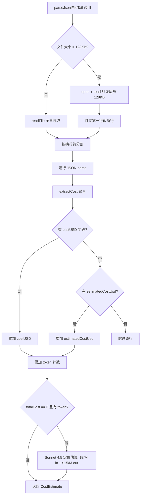
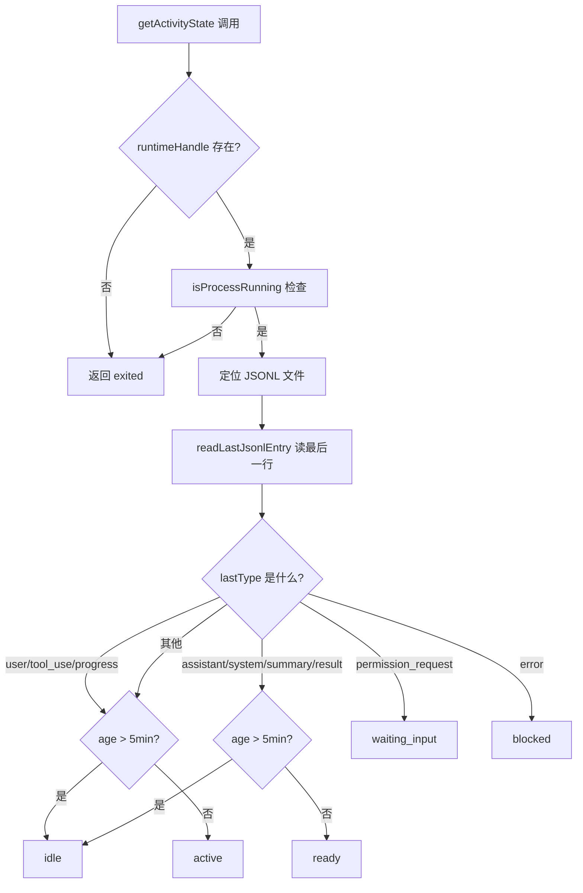

# PD-11.AO AgentOrchestrator — JSONL 会话日志可观测与注意力路由

> 文档编号：PD-11.AO
> 来源：AgentOrchestrator `packages/plugins/agent-claude-code/src/index.ts`
> GitHub：https://github.com/ComposioHQ/agent-orchestrator.git
> 问题域：PD-11 可观测性 Observability & Cost Tracking
> 状态：可复用方案

---

## 第 1 章 问题与动机（≥ 30 行）

### 1.1 核心问题

当一个人同时管理 10+ 个 AI Agent session 时，最稀缺的资源不是 GPU 也不是 token，而是**人类注意力**。Agent Orchestrator 面对的核心可观测性问题是：

1. **成本黑箱**：每个 Claude Code session 产生的 JSONL 日志可达 100MB+，里面散落着 `costUSD`、`inputTokens`、`outputTokens` 等字段，但没有统一的聚合视图。
2. **活跃度判断**：Agent 是在思考、等待输入、还是已经崩溃？需要从 JSONL 文件的最后一条记录类型 + 文件 mtime 推断。
3. **注意力路由**：10 个 session 中哪个最需要人类介入？PR 已 approved 等合并的优先级高于 Agent 还在 working 的。
4. **大文件性能**：100MB+ 的 JSONL 文件不能全量读取，需要只读尾部的高效策略。

### 1.2 AgentOrchestrator 的解法概述

1. **JSONL 尾部解析**：`parseJsonlFileTail()` 只读文件末尾 128KB，提取 cost/summary/activity（`packages/plugins/agent-claude-code/src/index.ts:264`）
2. **六态活跃度模型**：`active | ready | idle | waiting_input | blocked | exited`，从 JSONL 最后一条记录的 `type` 字段 + mtime 年龄推断（`packages/plugins/agent-claude-code/src/index.ts:682-702`）
3. **六级注意力路由**：`merge > respond > review > pending > working > done`，按人类行动紧迫度排序（`packages/web/src/lib/types.ts:162-233`）
4. **SSE 轮询推送**：5 秒间隔轮询 SessionManager，通过 SSE 推送 snapshot 到 Dashboard（`packages/web/src/app/api/events/route.ts:57`）
5. **TTL 缓存 + Rate Limit 自适应**：正常 5 分钟 TTL，GitHub API 限流时自动延长到 60 分钟（`packages/web/src/lib/cache.ts:24`，`packages/web/src/lib/serialize.ts:235`）

### 1.3 设计思想

| 设计原则 | 具体实现 | 理由 | 替代方案 |
|----------|----------|------|----------|
| 零侵入式采集 | 解析 Claude Code 自身的 JSONL 日志，不修改 Agent 代码 | Agent 是第三方工具，不能要求它改接口 | 自定义 Agent wrapper 注入遥测 |
| 尾部读取 | `parseJsonlFileTail(file, 128KB)` 只读末尾 | 100MB+ 文件全量读取会阻塞 Node.js 事件循环 | 流式逐行解析（内存友好但慢） |
| 注意力经济学 | 6 级 AttentionLevel 按 ROI 排序 | 人类注意力是最稀缺资源，merge 一键完成 ROI 最高 | 简单的 active/inactive 二分法 |
| 降级容错 | costUSD 优先，fallback 到 Sonnet 4.5 定价估算 | 不是所有 JSONL 条目都有 costUSD 字段 | 要求所有条目必须有 cost 字段 |
| 自适应缓存 | Rate limit 时 TTL 从 5min 延长到 60min | GitHub API 限流是小时级重置，频繁重试浪费配额 | 固定 TTL 不区分限流状态 |

---

## 第 2 章 源码实现分析（≥ 60 行，核心章节）

### 2.1 架构概览

Agent Orchestrator 的可观测性架构分为三层：数据采集层（JSONL 解析）、状态推断层（活跃度 + 成本）、展示层（Dashboard + CLI）。

```
┌─────────────────────────────────────────────────────────────────┐
│                     Web Dashboard (Next.js)                      │
│  ┌──────────┐  ┌──────────────┐  ┌───────────────────────────┐  │
│  │ Dashboard │  │ SessionCard  │  │ DynamicFavicon (健康色)    │  │
│  │ Kanban    │  │ AttentionZone│  │ green/yellow/red          │  │
│  └─────┬────┘  └──────┬───────┘  └───────────────────────────┘  │
│        │               │                                         │
│  ┌─────▼───────────────▼──────────────────────────────────────┐  │
│  │ SSE /api/events (5s 轮询) + serialize.ts (enrichment)     │  │
│  └─────┬──────────────────────────────────────────────────────┘  │
│        │                                                         │
│  ┌─────▼──────────────────────────────────────────────────────┐  │
│  │ TTLCache (5min 正常 / 60min 限流) + getAttentionLevel()   │  │
│  └────────────────────────────────────────────────────────────┘  │
├─────────────────────────────────────────────────────────────────┤
│                     Core Layer                                   │
│  ┌──────────────┐  ┌──────────────┐  ┌──────────────────────┐   │
│  │ SessionMgr   │  │ LifecycleMgr │  │ Agent Plugin         │   │
│  │ list()/get() │  │ poll loop    │  │ getActivityState()   │   │
│  │              │  │ state machine│  │ getSessionInfo()     │   │
│  └──────┬───────┘  └──────┬───────┘  └──────┬───────────────┘   │
│         │                  │                  │                   │
│  ┌──────▼──────────────────▼──────────────────▼───────────────┐  │
│  │ JSONL Files (~/.claude/projects/{path}/*.jsonl)            │  │
│  │ readLastJsonlEntry() — 4KB 反向读取                        │  │
│  │ parseJsonlFileTail() — 128KB 尾部解析                      │  │
│  └────────────────────────────────────────────────────────────┘  │
└─────────────────────────────────────────────────────────────────┘
```

### 2.2 核心实现

#### 2.2.1 JSONL 尾部解析与成本聚合



对应源码 `packages/plugins/agent-claude-code/src/index.ts:264-307`：

```typescript
async function parseJsonlFileTail(filePath: string, maxBytes = 131_072): Promise<JsonlLine[]> {
  let content: string;
  let offset: number;
  try {
    const { size = 0 } = await stat(filePath);
    offset = Math.max(0, size - maxBytes);
    if (offset === 0) {
      content = await readFile(filePath, "utf-8");
    } else {
      const handle = await open(filePath, "r");
      try {
        const length = size - offset;
        const buffer = Buffer.allocUnsafe(length);
        await handle.read(buffer, 0, length, offset);
        content = buffer.toString("utf-8");
      } finally {
        await handle.close();
      }
    }
  } catch {
    return [];
  }
  const firstNewline = content.indexOf("\n");
  const safeContent =
    offset > 0 && firstNewline >= 0 ? content.slice(firstNewline + 1) : content;
  const lines: JsonlLine[] = [];
  for (const line of safeContent.split("\n")) {
    const trimmed = line.trim();
    if (!trimmed) continue;
    try {
      const parsed: unknown = JSON.parse(trimmed);
      if (typeof parsed === "object" && parsed !== null && !Array.isArray(parsed)) {
        lines.push(parsed as JsonlLine);
      }
    } catch { /* Skip malformed lines */ }
  }
  return lines;
}
```

成本聚合逻辑 `packages/plugins/agent-claude-code/src/index.ts:339-383`：

```typescript
function extractCost(lines: JsonlLine[]): CostEstimate | undefined {
  let inputTokens = 0;
  let outputTokens = 0;
  let totalCost = 0;
  for (const line of lines) {
    if (typeof line.costUSD === "number") {
      totalCost += line.costUSD;
    } else if (typeof line.estimatedCostUsd === "number") {
      totalCost += line.estimatedCostUsd;
    }
    if (line.usage) {
      inputTokens += line.usage.input_tokens ?? 0;
      inputTokens += line.usage.cache_read_input_tokens ?? 0;
      inputTokens += line.usage.cache_creation_input_tokens ?? 0;
      outputTokens += line.usage.output_tokens ?? 0;
    } else {
      if (typeof line.inputTokens === "number") inputTokens += line.inputTokens;
      if (typeof line.outputTokens === "number") outputTokens += line.outputTokens;
    }
  }
  if (inputTokens === 0 && outputTokens === 0 && totalCost === 0) return undefined;
  if (totalCost === 0 && (inputTokens > 0 || outputTokens > 0)) {
    totalCost = (inputTokens / 1_000_000) * 3.0 + (outputTokens / 1_000_000) * 15.0;
  }
  return { inputTokens, outputTokens, estimatedCostUsd: totalCost };
}
```

#### 2.2.2 六态活跃度检测



对应源码 `packages/plugins/agent-claude-code/src/index.ts:646-703`：

```typescript
async getActivityState(
  session: Session,
  readyThresholdMs?: number,
): Promise<ActivityDetection | null> {
  const threshold = readyThresholdMs ?? DEFAULT_READY_THRESHOLD_MS; // 5 min
  const exitedAt = new Date();
  if (!session.runtimeHandle) return { state: "exited", timestamp: exitedAt };
  const running = await this.isProcessRunning(session.runtimeHandle);
  if (!running) return { state: "exited", timestamp: exitedAt };

  if (!session.workspacePath) return null;
  const projectPath = toClaudeProjectPath(session.workspacePath);
  const projectDir = join(homedir(), ".claude", "projects", projectPath);
  const sessionFile = await findLatestSessionFile(projectDir);
  if (!sessionFile) return null;

  const entry = await readLastJsonlEntry(sessionFile);
  if (!entry) return null;

  const ageMs = Date.now() - entry.modifiedAt.getTime();
  const timestamp = entry.modifiedAt;

  switch (entry.lastType) {
    case "user":
    case "tool_use":
    case "progress":
      return { state: ageMs > threshold ? "idle" : "active", timestamp };
    case "assistant":
    case "system":
    case "summary":
    case "result":
      return { state: ageMs > threshold ? "idle" : "ready", timestamp };
    case "permission_request":
      return { state: "waiting_input", timestamp };
    case "error":
      return { state: "blocked", timestamp };
    default:
      return { state: ageMs > threshold ? "idle" : "active", timestamp };
  }
}
```

### 2.3 实现细节

#### 反向读取最后一行（UTF-8 安全）

`readLastLine()` (`packages/core/src/utils.ts:39-81`) 以 4KB 为单位从文件末尾反向读取，关键技巧是将所有已读 chunk 拼接后再 `toString("utf-8")`，避免在多字节 UTF-8 字符的中间截断导致乱码。

#### 注意力路由的优先级设计

`getAttentionLevel()` (`packages/web/src/lib/types.ts:162-233`) 的判断顺序体现了"人类行动 ROI"思想：
- **merge**（最高）：PR approved + CI green，一键合并，ROI 最高
- **respond**：Agent 等待输入或崩溃，快速解锁后 Agent 继续工作
- **review**：CI 失败、changes requested，需要调查
- **pending**：等待外部（reviewer、CI），当前无法行动
- **working**：Agent 正在工作，不要打断
- **done**（最低）：已合并或终止，归档

#### 动态 Favicon 健康指示

`DynamicFavicon` (`packages/web/src/components/DynamicFavicon.tsx:12-24`) 将所有 session 的注意力级别聚合为三色健康状态：
- 🟢 green：所有 session 在 working/done/pending
- 🟡 yellow：有 session 需要 review 或 merge
- 🔴 red：有 session 在 respond 级别（Agent 崩溃或等待输入）

浏览器标签页的 favicon 颜色变化让用户无需打开 Dashboard 就能感知系统健康。

---

## 第 3 章 迁移指南（≥ 40 行）

### 3.1 迁移清单

**阶段 1：JSONL 尾部解析（1 个文件）**
- [ ] 实现 `readLastLine()` 反向读取函数（4KB chunk，UTF-8 安全）
- [ ] 实现 `parseJsonlFileTail()` 尾部解析（默认 128KB）
- [ ] 定义 `JsonlLine` 接口，适配目标 Agent 的 JSONL 格式

**阶段 2：成本聚合（1 个文件）**
- [ ] 实现 `extractCost()` 函数，支持 `costUSD` / `estimatedCostUsd` 双字段
- [ ] 实现 `usage` 结构体解析（input/output/cache_read/cache_creation 四种 token）
- [ ] 添加 fallback 定价估算（当无 costUSD 时按模型定价计算）

**阶段 3：活跃度检测（1 个文件）**
- [ ] 定义 `ActivityState` 六态枚举
- [ ] 实现 `getActivityState()` 基于 JSONL lastType + mtime 推断
- [ ] 配置 `readyThresholdMs`（默认 5 分钟）

**阶段 4：注意力路由（1 个文件）**
- [ ] 定义 `AttentionLevel` 六级枚举
- [ ] 实现 `getAttentionLevel()` 优先级判断链
- [ ] 集成到 Dashboard 的分组/排序逻辑

**阶段 5：SSE 推送（1 个 API route）**
- [ ] 实现 `/api/events` SSE endpoint
- [ ] 5 秒轮询 + 15 秒心跳
- [ ] 前端 EventSource 消费 snapshot 事件

### 3.2 适配代码模板

#### 通用 JSONL 尾部读取器（可直接复用）

```typescript
import { open, stat, readFile } from "node:fs/promises";

interface JsonlLine {
  type?: string;
  costUSD?: number;
  usage?: {
    input_tokens?: number;
    output_tokens?: number;
    cache_read_input_tokens?: number;
    cache_creation_input_tokens?: number;
  };
  inputTokens?: number;
  outputTokens?: number;
  estimatedCostUsd?: number;
}

/**
 * 只读 JSONL 文件尾部，避免全量加载 100MB+ 文件。
 * @param filePath JSONL 文件路径
 * @param maxBytes 最大读取字节数（默认 128KB）
 */
async function parseJsonlTail(filePath: string, maxBytes = 131_072): Promise<JsonlLine[]> {
  const { size } = await stat(filePath);
  const offset = Math.max(0, size - maxBytes);

  let content: string;
  if (offset === 0) {
    content = await readFile(filePath, "utf-8");
  } else {
    const handle = await open(filePath, "r");
    try {
      const buf = Buffer.allocUnsafe(size - offset);
      await handle.read(buf, 0, buf.length, offset);
      content = buf.toString("utf-8");
    } finally {
      await handle.close();
    }
  }

  // 跳过可能被截断的第一行
  const start = offset > 0 ? content.indexOf("\n") + 1 : 0;
  const lines: JsonlLine[] = [];
  for (const line of content.slice(start).split("\n")) {
    const trimmed = line.trim();
    if (!trimmed) continue;
    try {
      const obj = JSON.parse(trimmed);
      if (typeof obj === "object" && obj !== null && !Array.isArray(obj)) {
        lines.push(obj);
      }
    } catch { /* skip malformed */ }
  }
  return lines;
}
```

#### 注意力路由模板

```typescript
type AttentionLevel = "merge" | "respond" | "review" | "pending" | "working" | "done";

function getAttentionLevel(session: {
  status: string;
  activity: string | null;
  pr?: { state: string; mergeability: { mergeable: boolean }; ciStatus: string };
}): AttentionLevel {
  // 终态
  if (["merged", "killed", "done", "terminated"].includes(session.status)) return "done";
  // 可合并
  if (session.pr?.mergeability.mergeable) return "merge";
  // 等待人类
  if (session.activity === "waiting_input" || session.activity === "blocked") return "respond";
  if (session.activity === "exited") return "respond";
  // 需要调查
  if (session.pr?.ciStatus === "failing") return "review";
  // 等待外部
  if (session.status === "review_pending") return "pending";
  // 工作中
  return "working";
}
```

### 3.3 适用场景

| 场景 | 适用度 | 说明 |
|------|--------|------|
| 多 Agent 并行管理 Dashboard | ⭐⭐⭐ | 核心场景，注意力路由 + SSE 实时推送 |
| 单 Agent 成本追踪 | ⭐⭐⭐ | JSONL 尾部解析 + extractCost 直接可用 |
| Agent 健康监控 | ⭐⭐⭐ | 六态活跃度模型 + 进程存活检测 |
| CI/CD 集成 | ⭐⭐ | 需要额外集成 SCM 插件获取 CI 状态 |
| 团队级 Agent 管理 | ⭐⭐ | 当前是单用户设计，多用户需扩展 |
| 非 Claude Code Agent | ⭐ | JSONL 格式是 Claude Code 特有的，其他 Agent 需适配 |

---

## 第 4 章 测试用例（≥ 20 行）

```python
import pytest
import json
import tempfile
import os
from pathlib import Path
from datetime import datetime, timedelta


class TestParseJsonlTail:
    """测试 JSONL 尾部解析"""

    def test_small_file_reads_entirely(self, tmp_path):
        """小文件应全量读取"""
        f = tmp_path / "session.jsonl"
        lines = [
            json.dumps({"type": "user", "message": {"content": "hello"}}),
            json.dumps({"type": "assistant", "costUSD": 0.01, "inputTokens": 100, "outputTokens": 50}),
        ]
        f.write_text("\n".join(lines) + "\n")
        # 模拟 parseJsonlTail
        content = f.read_text()
        parsed = [json.loads(l) for l in content.strip().split("\n") if l.strip()]
        assert len(parsed) == 2
        assert parsed[1]["costUSD"] == 0.01

    def test_large_file_reads_tail_only(self, tmp_path):
        """大文件应只读尾部"""
        f = tmp_path / "large.jsonl"
        # 写入超过 128KB 的数据
        padding = [json.dumps({"type": "padding", "data": "x" * 200}) for _ in range(1000)]
        tail = json.dumps({"type": "summary", "summary": "final summary"})
        f.write_text("\n".join(padding) + "\n" + tail + "\n")
        # 只读最后 128KB
        size = f.stat().st_size
        offset = max(0, size - 131072)
        content = f.read_bytes()[offset:].decode("utf-8")
        # 跳过截断的第一行
        first_nl = content.index("\n")
        safe = content[first_nl + 1:]
        parsed = [json.loads(l) for l in safe.strip().split("\n") if l.strip()]
        assert parsed[-1]["type"] == "summary"
        assert parsed[-1]["summary"] == "final summary"

    def test_truncated_first_line_skipped(self, tmp_path):
        """从中间开始读取时，截断的第一行应被跳过"""
        f = tmp_path / "session.jsonl"
        f.write_text('{"type": "user"}\n{"type": "assistant"}\n')
        content = f.read_text()
        # 模拟从中间开始（offset > 0）
        partial = content[5:]  # 截断第一行
        first_nl = partial.index("\n")
        safe = partial[first_nl + 1:]
        parsed = [json.loads(l) for l in safe.strip().split("\n") if l.strip()]
        assert len(parsed) == 1
        assert parsed[0]["type"] == "assistant"


class TestExtractCost:
    """测试成本聚合"""

    def test_costUSD_preferred_over_estimated(self):
        """costUSD 优先于 estimatedCostUsd"""
        lines = [
            {"costUSD": 0.05, "estimatedCostUsd": 0.10},
            {"costUSD": 0.03},
        ]
        total = sum(l.get("costUSD", l.get("estimatedCostUsd", 0)) for l in lines)
        assert total == pytest.approx(0.08)

    def test_fallback_pricing_when_no_cost(self):
        """无 costUSD 时使用 Sonnet 4.5 定价估算"""
        lines = [{"inputTokens": 1_000_000, "outputTokens": 100_000}]
        input_t = sum(l.get("inputTokens", 0) for l in lines)
        output_t = sum(l.get("outputTokens", 0) for l in lines)
        estimated = (input_t / 1_000_000) * 3.0 + (output_t / 1_000_000) * 15.0
        assert estimated == pytest.approx(4.5)  # $3 + $1.5

    def test_usage_struct_with_cache_tokens(self):
        """usage 结构体应包含 cache_read 和 cache_creation"""
        lines = [{"usage": {
            "input_tokens": 500,
            "output_tokens": 200,
            "cache_read_input_tokens": 300,
            "cache_creation_input_tokens": 100,
        }}]
        u = lines[0]["usage"]
        total_in = u["input_tokens"] + u["cache_read_input_tokens"] + u["cache_creation_input_tokens"]
        assert total_in == 900
        assert u["output_tokens"] == 200


class TestActivityState:
    """测试活跃度推断"""

    def test_permission_request_is_waiting_input(self):
        """permission_request 类型应返回 waiting_input"""
        last_type = "permission_request"
        assert last_type == "permission_request"  # → waiting_input

    def test_error_is_blocked(self):
        """error 类型应返回 blocked"""
        last_type = "error"
        assert last_type == "error"  # → blocked

    def test_old_assistant_is_idle(self):
        """超过阈值的 assistant 类型应返回 idle"""
        threshold_ms = 300_000  # 5 min
        age_ms = 600_000  # 10 min
        assert age_ms > threshold_ms  # → idle

    def test_recent_tool_use_is_active(self):
        """阈值内的 tool_use 类型应返回 active"""
        threshold_ms = 300_000
        age_ms = 10_000  # 10 sec
        assert age_ms <= threshold_ms  # → active


class TestAttentionLevel:
    """测试注意力路由"""

    def test_mergeable_pr_is_merge_level(self):
        """可合并的 PR 应返回 merge 级别"""
        session = {"status": "approved", "activity": "ready", "pr": {"mergeability": {"mergeable": True}}}
        # merge 级别优先于 working
        assert session["pr"]["mergeability"]["mergeable"] is True

    def test_exited_agent_is_respond_level(self):
        """已退出的 Agent 应返回 respond 级别"""
        activity = "exited"
        assert activity == "exited"  # → respond

    def test_working_agent_is_working_level(self):
        """正在工作的 Agent 应返回 working 级别"""
        session = {"status": "working", "activity": "active"}
        assert session["activity"] == "active"  # → working
```

---

## 第 5 章 跨域关联

| 关联域 | 关系类型 | 说明 |
|--------|----------|------|
| PD-01 上下文管理 | 协同 | JSONL 尾部解析的 128KB 窗口本质上是一种上下文窗口管理策略 |
| PD-02 多 Agent 编排 | 依赖 | 注意力路由依赖 SessionManager 提供的多 session 列表 |
| PD-03 容错与重试 | 协同 | Rate limit 自适应缓存（5min→60min TTL）是一种容错降级策略 |
| PD-06 记忆持久化 | 协同 | JSONL 文件既是 Agent 的会话记忆，也是可观测性的数据源 |
| PD-07 质量检查 | 协同 | CI 状态追踪和 review decision 检测是质量检查的可观测性基础 |
| PD-09 Human-in-the-Loop | 依赖 | 注意力路由的 respond 级别直接触发 Human-in-the-Loop 流程 |

---

## 第 6 章 来源文件索引

| 文件 | 行范围 | 关键实现 |
|------|--------|----------|
| `packages/plugins/agent-claude-code/src/index.ts` | L233-L248 | JsonlLine 接口定义（cost/usage 字段） |
| `packages/plugins/agent-claude-code/src/index.ts` | L264-L307 | parseJsonlFileTail() 尾部解析 |
| `packages/plugins/agent-claude-code/src/index.ts` | L309-L336 | extractSummary() 摘要提取 |
| `packages/plugins/agent-claude-code/src/index.ts` | L339-L383 | extractCost() 成本聚合 |
| `packages/plugins/agent-claude-code/src/index.ts` | L459-L484 | classifyTerminalOutput() 终端输出分类 |
| `packages/plugins/agent-claude-code/src/index.ts` | L646-L703 | getActivityState() 六态活跃度检测 |
| `packages/plugins/agent-claude-code/src/index.ts` | L705-L730 | getSessionInfo() 会话信息聚合 |
| `packages/core/src/utils.ts` | L39-L81 | readLastLine() 反向读取（UTF-8 安全） |
| `packages/core/src/utils.ts` | L90-L110 | readLastJsonlEntry() 最后条目解析 |
| `packages/core/src/types.ts` | L44-L68 | ActivityState/ActivityDetection 类型定义 |
| `packages/core/src/types.ts` | L355-L370 | AgentSessionInfo/CostEstimate 类型定义 |
| `packages/web/src/lib/types.ts` | L48 | AttentionLevel 六级注意力类型 |
| `packages/web/src/lib/types.ts` | L130-L150 | SSESnapshotEvent/SSEActivityEvent 类型 |
| `packages/web/src/lib/types.ts` | L162-L233 | getAttentionLevel() 注意力路由算法 |
| `packages/web/src/app/api/events/route.ts` | L1-L103 | SSE endpoint（5s 轮询 + 15s 心跳） |
| `packages/web/src/lib/serialize.ts` | L43-L66 | sessionToDashboard() 序列化 |
| `packages/web/src/lib/serialize.ts` | L105-L253 | enrichSessionPR() PR 数据富化 + 缓存 |
| `packages/web/src/lib/cache.ts` | L19-L78 | TTLCache 通用缓存（自动过期 + 清理） |
| `packages/web/src/components/DynamicFavicon.tsx` | L12-L24 | computeHealth() 三色健康聚合 |
| `packages/web/src/components/Dashboard.tsx` | L26-L41 | Kanban 分组（按 AttentionLevel） |
| `packages/cli/src/commands/status.ts` | L43-L132 | CLI status 命令（表格输出 + JSON） |

---

## 第 7 章 横向对比维度

```json comparison_data
{
  "project": "AgentOrchestrator",
  "dimensions": {
    "追踪方式": "解析 Claude Code 原生 JSONL 日志，零侵入式采集",
    "数据粒度": "session 级聚合（input/output/cache_read/cache_creation 四种 token）",
    "持久化": "依赖 Agent 自身 JSONL 文件，无独立存储层",
    "多提供商": "仅适配 Claude Code，其他 Agent 需实现 Agent 接口",
    "日志格式": "JSONL（Claude Code 原生格式），每行一个 JSON 对象",
    "指标采集": "轮询式：5s 间隔读取 JSONL 文件 mtime + lastType",
    "可视化": "Next.js Web Dashboard + Kanban 分组 + 动态 Favicon 三色健康",
    "成本追踪": "costUSD 优先，fallback Sonnet 4.5 定价估算（$3/M in + $15/M out）",
    "卡死检测": "JSONL mtime 超过 readyThresholdMs(5min) 判定为 idle",
    "注意力路由": "六级 AttentionLevel：merge > respond > review > pending > working > done",
    "Agent 状态追踪": "六态模型：active/ready/idle/waiting_input/blocked/exited",
    "日志噪声过滤": "parseJsonlFileTail 只读尾部 128KB，天然过滤历史噪声",
    "进程级监控": "findClaudeProcess() 通过 tmux pane TTY + ps 匹配进程",
    "健康端点": "SSE /api/events 提供实时 snapshot，含 heartbeat 保活",
    "缓存统计": "TTLCache 5min 默认 TTL，rate limit 时自适应延长到 60min",
    "崩溃安全": "进程退出 → exited 状态 → respond 注意力级别 → 通知人类",
    "Span 传播": "无 OpenTelemetry，通过 JSONL entry type 隐式关联调用链"
  }
}
```

### 域元数据补充

```json domain_metadata
{
  "solution_summary": "AgentOrchestrator 通过解析 Claude Code 原生 JSONL 日志尾部 128KB 实现零侵入式成本聚合，六级 AttentionLevel 按人类行动 ROI 路由稀缺注意力到最需要介入的 session",
  "description": "多 Agent 并行场景下人类注意力的量化路由与优先级调度",
  "sub_problems": [
    "Favicon 动态健康指示：浏览器标签页颜色变化免开 Dashboard 感知系统状态",
    "JSONL 路径编码兼容：Agent 工具的路径编码规则变更会静默破坏日志定位",
    "终端输出模式分类：从 Agent 终端 buffer 最后几行推断 active/idle/waiting_input",
    "PR enrichment 并行容错：6 个 SCM API 调用 Promise.allSettled 部分失败仍可用"
  ],
  "best_practices": [
    "JSONL 尾部读取时跳过截断的第一行：offset > 0 时 slice(firstNewline + 1) 避免 JSON.parse 失败",
    "costUSD 和 estimatedCostUsd 互斥累加：同一行只取一个，避免双重计费",
    "Rate limit 时延长缓存 TTL 而非重试：GitHub API 限流是小时级重置，频繁重试浪费配额",
    "反向读取 Buffer 拼接后再 toString：避免在多字节 UTF-8 字符中间截断导致乱码"
  ]
}
```
