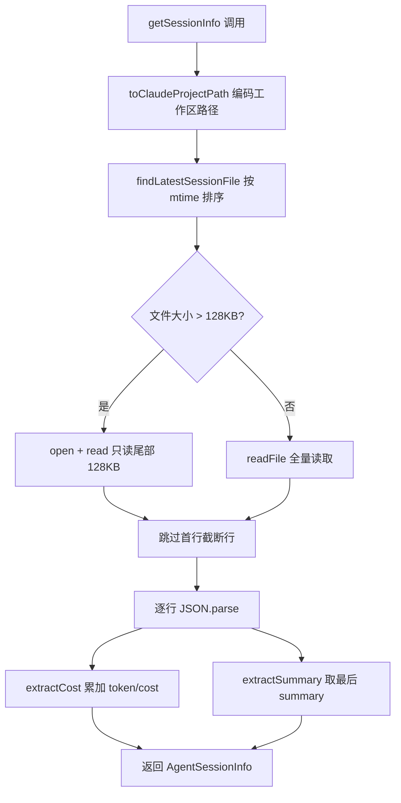
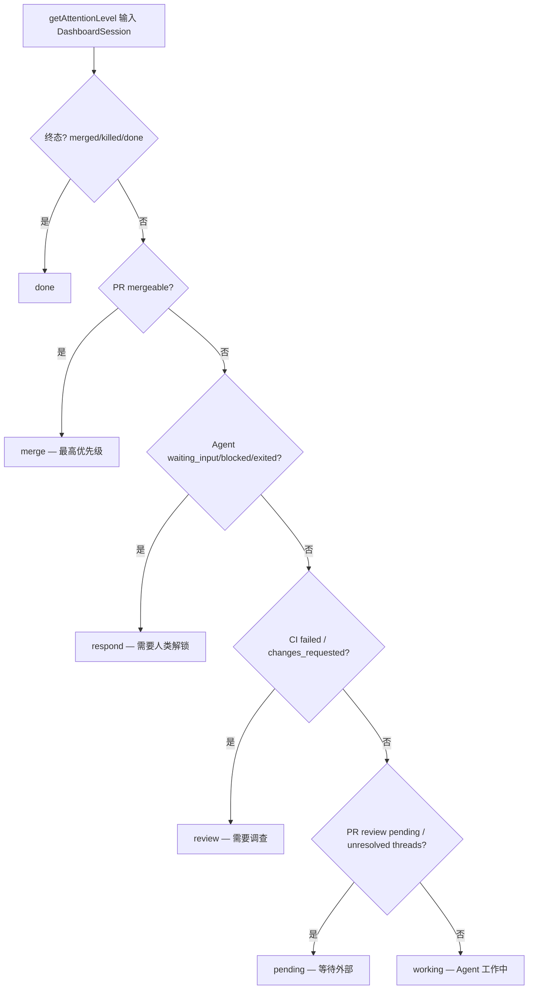

# PD-11.12 AgentOrchestrator — JSONL 解析 Token 追踪与注意力分级仪表盘

> 文档编号：PD-11.12
> 来源：AgentOrchestrator `packages/plugins/agent-claude-code/src/index.ts`
> GitHub：https://github.com/ComposioHQ/agent-orchestrator.git
> 问题域：PD-11 可观测性 Observability & Cost Tracking
> 状态：可复用方案

---

## 第 1 章 问题与动机

### 1.1 核心问题

当多个 AI Agent 并行工作时（每个 Agent 独立处理一个 issue/PR），运维者面临三个关键挑战：

1. **成本不可见**：每个 Agent session 消耗多少 token、花费多少美元，没有统一视图
2. **状态不可知**：Agent 是在思考、等待输入、还是已经卡死？需要实时感知
3. **注意力分散**：10+ 个并行 session，哪个最需要人类介入？缺乏优先级排序

传统做法是逐个 terminal 查看 Agent 输出，这在 2-3 个 session 时勉强可行，但 10+ session 时完全不可扩展。agent-orchestrator 的核心洞察是：**可观测性不只是日志和指标，更是人类注意力的路由系统**。

### 1.2 AgentOrchestrator 的解法概述

1. **JSONL 尾部解析**：从 Claude Code 的 `~/.claude/projects/` 目录读取 JSONL session 文件，只解析尾部 128KB 提取 token usage 和 cost（`packages/plugins/agent-claude-code/src/index.ts:264-307`）
2. **CostEstimate 聚合**：遍历 JSONL 行，累加 `costUSD`/`estimatedCostUsd` 和 `usage.input_tokens`/`output_tokens`，无直接成本时用 Sonnet 4.5 定价估算（`index.ts:339-383`）
3. **6 级注意力分级**：merge > respond > review > pending > working > done，基于 session 状态 + PR 状态 + CI 状态综合判定（`packages/web/src/lib/types.ts:162-233`）
4. **SSE 实时推送**：`/api/events` 端点每 5 秒轮询 SessionManager，推送 session 快照含 attentionLevel（`packages/web/src/app/api/events/route.ts:13-103`）
5. **TTL 缓存降压**：PR enrichment 数据用 5 分钟 TTL 缓存，rate limit 时自动延长到 60 分钟（`packages/web/src/lib/cache.ts:19-78`）

### 1.3 设计思想

| 设计原则 | 具体实现 | 理由 | 替代方案 |
|----------|----------|------|----------|
| 被动观测 | 读 Agent 的 JSONL 文件而非注入 SDK | 零侵入，不修改 Agent 代码 | OpenTelemetry SDK 注入（需改 Agent） |
| 尾部读取 | 只读文件末尾 128KB | JSONL 可达 100MB+，全量读取浪费 | 全量解析（慢）、SQLite 索引（重） |
| 注意力路由 | 6 级优先级而非简单 active/inactive | 人类注意力是稀缺资源，需精确路由 | 二值状态（太粗）、自由排序（太乱） |
| 乐观缓存 | rate limit 时缓存 60 分钟 | 避免反复触发 GitHub API 限流 | 无缓存（频繁 429）、固定 TTL（不灵活） |
| 估算兜底 | 无 costUSD 时用 Sonnet 定价估算 | 提供数量级信号优于完全无数据 | 不显示（信息缺失）、精确计费（需 API key） |

---

## 第 2 章 源码实现分析

### 2.1 架构概览

agent-orchestrator 的可观测性分为三层：数据采集层（Agent 插件）、数据聚合层（Web API）、展示层（Dashboard）。

```
┌─────────────────────────────────────────────────────────────┐
│                    Web Dashboard (React)                      │
│  ┌──────────┐ ┌──────────┐ ┌──────────┐ ┌──────────┐       │
│  │  merge    │ │ respond  │ │ review   │ │ working  │       │
│  │  zone     │ │ zone     │ │ zone     │ │ zone     │       │
│  └────┬─────┘ └────┬─────┘ └────┬─────┘ └────┬─────┘       │
│       └─────────────┴────────────┴─────────────┘             │
│                         ↑ SSE /api/events (5s poll)          │
├─────────────────────────┼───────────────────────────────────┤
│  Web API Layer          │                                    │
│  ┌──────────────────────┴──────────────────────┐            │
│  │ GET /api/sessions                            │            │
│  │   sessionToDashboard() → enrichMetadata()    │            │
│  │   → enrichPR() → computeStats()              │            │
│  │   TTLCache (PR: 5min, Issue: 5min)           │            │
│  └──────────────────────┬──────────────────────┘            │
│                         │ getSessionInfo()                   │
├─────────────────────────┼───────────────────────────────────┤
│  Agent Plugin Layer     │                                    │
│  ┌──────────────────────┴──────────────────────┐            │
│  │ agent-claude-code plugin                     │            │
│  │   parseJsonlFileTail(128KB)                  │            │
│  │   → extractCost() → extractSummary()         │            │
│  │   → getActivityState() via readLastJsonlEntry│            │
│  └──────────────────────┬──────────────────────┘            │
│                         │ fs.read()                          │
├─────────────────────────┼───────────────────────────────────┤
│  Data Source            │                                    │
│  ~/.claude/projects/{encoded-path}/*.jsonl                   │
└─────────────────────────────────────────────────────────────┘
```

### 2.2 核心实现

#### 2.2.1 JSONL 尾部解析与 Token/Cost 提取



对应源码 `packages/plugins/agent-claude-code/src/index.ts:264-383`：

```typescript
async function parseJsonlFileTail(filePath: string, maxBytes = 131_072): Promise<JsonlLine[]> {
  let content: string;
  let offset: number;
  try {
    const { size = 0 } = await stat(filePath);
    offset = Math.max(0, size - maxBytes);
    if (offset === 0) {
      content = await readFile(filePath, "utf-8");
    } else {
      // Large file — read only the tail via a file handle
      const handle = await open(filePath, "r");
      try {
        const length = size - offset;
        const buffer = Buffer.allocUnsafe(length);
        await handle.read(buffer, 0, length, offset);
        content = buffer.toString("utf-8");
      } finally {
        await handle.close();
      }
    }
  } catch {
    return [];
  }
  // Skip potentially truncated first line only when we started mid-file
  const firstNewline = content.indexOf("\n");
  const safeContent =
    offset > 0 && firstNewline >= 0 ? content.slice(firstNewline + 1) : content;
  const lines: JsonlLine[] = [];
  for (const line of safeContent.split("\n")) {
    const trimmed = line.trim();
    if (!trimmed) continue;
    try {
      const parsed: unknown = JSON.parse(trimmed);
      if (typeof parsed === "object" && parsed !== null && !Array.isArray(parsed)) {
        lines.push(parsed as JsonlLine);
      }
    } catch { /* Skip malformed lines */ }
  }
  return lines;
}
```

Cost 聚合逻辑 `index.ts:339-383`：

```typescript
function extractCost(lines: JsonlLine[]): CostEstimate | undefined {
  let inputTokens = 0;
  let outputTokens = 0;
  let totalCost = 0;

  for (const line of lines) {
    // Prefer costUSD; only use estimatedCostUsd as fallback to avoid double-counting
    if (typeof line.costUSD === "number") {
      totalCost += line.costUSD;
    } else if (typeof line.estimatedCostUsd === "number") {
      totalCost += line.estimatedCostUsd;
    }
    // Prefer structured usage object; fall back to flat fields
    if (line.usage) {
      inputTokens += line.usage.input_tokens ?? 0;
      inputTokens += line.usage.cache_read_input_tokens ?? 0;
      inputTokens += line.usage.cache_creation_input_tokens ?? 0;
      outputTokens += line.usage.output_tokens ?? 0;
    } else {
      if (typeof line.inputTokens === "number") inputTokens += line.inputTokens;
      if (typeof line.outputTokens === "number") outputTokens += line.outputTokens;
    }
  }

  if (inputTokens === 0 && outputTokens === 0 && totalCost === 0) return undefined;

  // Rough estimate when no direct cost — Sonnet 4.5 pricing as baseline
  if (totalCost === 0 && (inputTokens > 0 || outputTokens > 0)) {
    totalCost = (inputTokens / 1_000_000) * 3.0 + (outputTokens / 1_000_000) * 15.0;
  }

  return { inputTokens, outputTokens, estimatedCostUsd: totalCost };
}
```

#### 2.2.2 注意力分级系统



对应源码 `packages/web/src/lib/types.ts:162-233`：

```typescript
export function getAttentionLevel(session: DashboardSession): AttentionLevel {
  // Done: terminal states
  if (session.status === "merged" || session.status === "killed" ||
      session.status === "cleanup" || session.status === "done" ||
      session.status === "terminated") {
    return "done";
  }
  if (session.pr) {
    if (session.pr.state === "merged" || session.pr.state === "closed") return "done";
  }

  // Merge: PR is ready — one click to clear
  if (session.status === "mergeable" || session.status === "approved") return "merge";
  if (session.pr?.mergeability.mergeable) return "merge";

  // Respond: agent is waiting for human input
  if (session.activity === ACTIVITY_STATE.WAITING_INPUT ||
      session.activity === ACTIVITY_STATE.BLOCKED) return "respond";
  if (session.status === SESSION_STATUS.NEEDS_INPUT ||
      session.status === SESSION_STATUS.STUCK ||
      session.status === SESSION_STATUS.ERRORED) return "respond";
  if (session.activity === ACTIVITY_STATE.EXITED) return "respond";

  // Review: problems that need investigation
  if (session.status === "ci_failed" || session.status === "changes_requested") return "review";
  if (session.pr && !isPRRateLimited(session.pr)) {
    if (session.pr.ciStatus === CI_STATUS.FAILING) return "review";
    if (session.pr.reviewDecision === "changes_requested") return "review";
    if (!session.pr.mergeability.noConflicts) return "review";
  }

  // Pending: waiting on external (reviewer, CI)
  if (session.status === "review_pending") return "pending";
  if (session.pr && !isPRRateLimited(session.pr)) {
    if (!session.pr.isDraft && session.pr.unresolvedThreads > 0) return "pending";
    if (!session.pr.isDraft && (session.pr.reviewDecision === "pending" ||
        session.pr.reviewDecision === "none")) return "pending";
  }

  return "working";
}
```

### 2.3 实现细节

**活动状态检测双通道**：agent-orchestrator 用两种方式检测 Agent 活动状态：

1. **JSONL 类型推断**（`getActivityState`，`index.ts:646-702`）：读取 JSONL 最后一条记录的 `type` 字段，结合文件 mtime 判断。`user`/`tool_use`/`progress` 类型 + 未超时 = active；`assistant`/`summary`/`result` + 未超时 = ready；`permission_request` = waiting_input；`error` = blocked。
2. **终端输出模式匹配**（`classifyTerminalOutput`，`index.ts:459-484`）：作为降级方案，解析 tmux 终端输出。检测 `❯` 提示符 = idle，`Do you want to proceed?` = waiting_input，其余 = active。

**SSE 事件流设计**（`route.ts:13-103`）：
- 初始连接发送完整 snapshot（所有 session 的 id/status/activity/attentionLevel）
- 每 5 秒轮询 SessionManager 发送增量 snapshot
- 每 15 秒发送 heartbeat 保活
- 双 interval 清理：stream cancel 时清除两个 timer
- 错误隔离：service 不可用时发送空 snapshot，不断开连接

**CostEstimate 数据结构**（`packages/core/src/types.ts:366-370`）：

```typescript
export interface CostEstimate {
  inputTokens: number;
  outputTokens: number;
  estimatedCostUsd: number;
}
```

三字段设计：inputTokens 和 outputTokens 提供原始计量，estimatedCostUsd 提供成本估算。cache_read 和 cache_creation tokens 被合并到 inputTokens 中（简化展示，牺牲了缓存命中率可见性）。

---

## 第 3 章 迁移指南

### 3.1 迁移清单

**阶段 1：数据采集层（1-2 天）**
- [ ] 定义 `CostEstimate` 接口（inputTokens, outputTokens, estimatedCostUsd）
- [ ] 实现 JSONL 尾部解析器（支持大文件只读尾部）
- [ ] 实现 cost 聚合函数（支持 costUSD 和 usage 两种格式）
- [ ] 实现 summary 提取函数（优先取 summary 类型，降级到首条 user 消息）

**阶段 2：状态检测层（1-2 天）**
- [ ] 定义 `ActivityState` 枚举（active/ready/idle/waiting_input/blocked/exited）
- [ ] 实现 JSONL 类型到 ActivityState 的映射
- [ ] 实现 mtime 超时判定（默认 5 分钟 ready → idle）
- [ ] 可选：实现终端输出模式匹配作为降级方案

**阶段 3：注意力分级（1 天）**
- [ ] 定义 `AttentionLevel` 类型（merge/respond/review/pending/working/done）
- [ ] 实现 `getAttentionLevel()` 函数，按优先级链判定
- [ ] 集成 PR 状态（CI、review、mergeability）

**阶段 4：实时推送（1 天）**
- [ ] 实现 SSE 端点，定期轮询 session 状态
- [ ] 实现 TTL 缓存减少外部 API 调用
- [ ] 实现 rate limit 检测与缓存延长

### 3.2 适配代码模板

**JSONL 尾部解析器（可直接复用）：**

```typescript
import { open, stat, readFile } from "node:fs/promises";

interface UsageLine {
  costUSD?: number;
  estimatedCostUsd?: number;
  usage?: {
    input_tokens?: number;
    output_tokens?: number;
    cache_read_input_tokens?: number;
    cache_creation_input_tokens?: number;
  };
  inputTokens?: number;
  outputTokens?: number;
  type?: string;
}

interface CostEstimate {
  inputTokens: number;
  outputTokens: number;
  estimatedCostUsd: number;
}

/**
 * Parse only the tail of a JSONL file.
 * For files > maxBytes, reads only the last chunk via file handle.
 */
async function parseJsonlTail(
  filePath: string,
  maxBytes = 131_072,
): Promise<UsageLine[]> {
  let content: string;
  let offset: number;

  const { size } = await stat(filePath);
  offset = Math.max(0, size - maxBytes);

  if (offset === 0) {
    content = await readFile(filePath, "utf-8");
  } else {
    const handle = await open(filePath, "r");
    try {
      const buf = Buffer.allocUnsafe(size - offset);
      await handle.read(buf, 0, buf.length, offset);
      content = buf.toString("utf-8");
    } finally {
      await handle.close();
    }
  }

  // Skip truncated first line when reading mid-file
  const nl = content.indexOf("\n");
  const safe = offset > 0 && nl >= 0 ? content.slice(nl + 1) : content;

  return safe
    .split("\n")
    .filter((l) => l.trim())
    .map((l) => { try { return JSON.parse(l); } catch { return null; } })
    .filter((v): v is UsageLine => v !== null && typeof v === "object");
}

/**
 * Aggregate cost from parsed JSONL lines.
 * Handles both costUSD (direct) and usage (token-based) formats.
 */
function aggregateCost(
  lines: UsageLine[],
  pricing = { inputPer1M: 3.0, outputPer1M: 15.0 },
): CostEstimate {
  let inputTokens = 0, outputTokens = 0, totalCost = 0;

  for (const line of lines) {
    if (typeof line.costUSD === "number") totalCost += line.costUSD;
    else if (typeof line.estimatedCostUsd === "number") totalCost += line.estimatedCostUsd;

    if (line.usage) {
      inputTokens += (line.usage.input_tokens ?? 0)
        + (line.usage.cache_read_input_tokens ?? 0)
        + (line.usage.cache_creation_input_tokens ?? 0);
      outputTokens += line.usage.output_tokens ?? 0;
    } else {
      inputTokens += line.inputTokens ?? 0;
      outputTokens += line.outputTokens ?? 0;
    }
  }

  if (totalCost === 0 && (inputTokens > 0 || outputTokens > 0)) {
    totalCost = (inputTokens / 1e6) * pricing.inputPer1M
      + (outputTokens / 1e6) * pricing.outputPer1M;
  }

  return { inputTokens, outputTokens, estimatedCostUsd: totalCost };
}
```

**注意力分级函数（可直接复用）：**

```typescript
type AttentionLevel = "merge" | "respond" | "review" | "pending" | "working" | "done";

interface SessionSnapshot {
  status: string;
  activity: string | null;
  pr?: {
    state: string;
    ciStatus: string;
    reviewDecision: string;
    mergeability: { mergeable: boolean; noConflicts: boolean };
    isDraft: boolean;
    unresolvedThreads: number;
  };
}

function getAttentionLevel(s: SessionSnapshot): AttentionLevel {
  const terminalStatuses = new Set(["merged", "killed", "cleanup", "done", "terminated"]);
  if (terminalStatuses.has(s.status)) return "done";
  if (s.pr?.state === "merged" || s.pr?.state === "closed") return "done";

  if (s.status === "mergeable" || s.status === "approved") return "merge";
  if (s.pr?.mergeability.mergeable) return "merge";

  if (s.activity === "waiting_input" || s.activity === "blocked") return "respond";
  if (["needs_input", "stuck", "errored"].includes(s.status)) return "respond";
  if (s.activity === "exited") return "respond";

  if (s.status === "ci_failed" || s.status === "changes_requested") return "review";
  if (s.pr) {
    if (s.pr.ciStatus === "failing") return "review";
    if (s.pr.reviewDecision === "changes_requested") return "review";
    if (!s.pr.mergeability.noConflicts) return "review";
  }

  if (s.status === "review_pending") return "pending";
  if (s.pr && !s.pr.isDraft) {
    if (s.pr.unresolvedThreads > 0) return "pending";
    if (["pending", "none"].includes(s.pr.reviewDecision)) return "pending";
  }

  return "working";
}
```

### 3.3 适用场景

| 场景 | 适用度 | 说明 |
|------|--------|------|
| 多 Agent 并行编排 | ⭐⭐⭐ | 核心场景：10+ session 需要注意力路由 |
| 单 Agent 成本监控 | ⭐⭐ | JSONL 解析可用，但注意力分级意义不大 |
| 非 Claude Code Agent | ⭐⭐ | 需要适配不同 Agent 的日志格式 |
| 实时告警系统 | ⭐⭐ | SSE 提供基础，但缺少阈值告警机制 |
| 历史成本分析 | ⭐ | 只读尾部 128KB，不适合全量历史分析 |

---

## 第 4 章 测试用例

```python
import pytest
import json
import tempfile
import os
from pathlib import Path
from datetime import datetime, timedelta


class TestJsonlTailParsing:
    """Tests for JSONL tail parsing and cost extraction."""

    def _write_jsonl(self, lines: list[dict], path: str) -> None:
        with open(path, "w") as f:
            for line in lines:
                f.write(json.dumps(line) + "\n")

    def test_extract_cost_with_usage_object(self, tmp_path):
        """Cost extraction from structured usage object."""
        lines = [
            {"type": "assistant", "usage": {
                "input_tokens": 1000, "output_tokens": 500,
                "cache_read_input_tokens": 200, "cache_creation_input_tokens": 100
            }},
            {"type": "assistant", "usage": {
                "input_tokens": 800, "output_tokens": 300
            }},
        ]
        # Expected: input = 1000+200+100+800 = 2100, output = 500+300 = 800
        # Cost = (2100/1M)*3.0 + (800/1M)*15.0 = 0.0063 + 0.012 = 0.0183
        result = self._aggregate_cost(lines)
        assert result["inputTokens"] == 2100
        assert result["outputTokens"] == 800
        assert abs(result["estimatedCostUsd"] - 0.0183) < 0.001

    def test_extract_cost_with_direct_cost_usd(self, tmp_path):
        """Prefer costUSD over token-based estimation."""
        lines = [
            {"costUSD": 0.05, "usage": {"input_tokens": 1000, "output_tokens": 500}},
            {"costUSD": 0.03, "usage": {"input_tokens": 800, "output_tokens": 200}},
        ]
        result = self._aggregate_cost(lines)
        assert result["inputTokens"] == 1800 + 0  # no cache tokens
        assert abs(result["estimatedCostUsd"] - 0.08) < 0.001

    def test_extract_cost_no_double_counting(self, tmp_path):
        """costUSD and estimatedCostUsd should not double-count."""
        lines = [
            {"costUSD": 0.05, "estimatedCostUsd": 0.04},  # costUSD wins
        ]
        result = self._aggregate_cost(lines)
        assert abs(result["estimatedCostUsd"] - 0.05) < 0.001

    def test_extract_cost_empty_returns_none(self):
        """Empty lines should return no cost estimate."""
        result = self._aggregate_cost([])
        assert result is None

    def test_tail_parsing_skips_truncated_first_line(self, tmp_path):
        """When reading mid-file, first (truncated) line should be skipped."""
        path = str(tmp_path / "test.jsonl")
        # Write a file larger than our simulated maxBytes
        with open(path, "w") as f:
            for i in range(100):
                f.write(json.dumps({"type": "assistant", "index": i}) + "\n")
        # Simulate reading only last 200 bytes
        size = os.path.getsize(path)
        assert size > 200
        # The first line of the tail chunk will be truncated — parser should skip it

    def _aggregate_cost(self, lines: list[dict]) -> dict | None:
        """Python port of extractCost logic for testing."""
        input_tokens = 0
        output_tokens = 0
        total_cost = 0.0

        for line in lines:
            if "costUSD" in line and isinstance(line["costUSD"], (int, float)):
                total_cost += line["costUSD"]
            elif "estimatedCostUsd" in line and isinstance(line["estimatedCostUsd"], (int, float)):
                total_cost += line["estimatedCostUsd"]

            usage = line.get("usage")
            if usage and isinstance(usage, dict):
                input_tokens += usage.get("input_tokens", 0)
                input_tokens += usage.get("cache_read_input_tokens", 0)
                input_tokens += usage.get("cache_creation_input_tokens", 0)
                output_tokens += usage.get("output_tokens", 0)
            else:
                input_tokens += line.get("inputTokens", 0)
                output_tokens += line.get("outputTokens", 0)

        if input_tokens == 0 and output_tokens == 0 and total_cost == 0:
            return None

        if total_cost == 0 and (input_tokens > 0 or output_tokens > 0):
            total_cost = (input_tokens / 1_000_000) * 3.0 + (output_tokens / 1_000_000) * 15.0

        return {"inputTokens": input_tokens, "outputTokens": output_tokens, "estimatedCostUsd": total_cost}


class TestAttentionLevel:
    """Tests for the 6-level attention priority system."""

    def _make_session(self, **overrides) -> dict:
        base = {"status": "working", "activity": "active", "pr": None}
        base.update(overrides)
        return base

    def _make_pr(self, **overrides) -> dict:
        base = {
            "state": "open", "ciStatus": "passing", "reviewDecision": "none",
            "mergeability": {"mergeable": False, "noConflicts": True},
            "isDraft": False, "unresolvedThreads": 0,
        }
        base.update(overrides)
        return base

    def test_merged_session_is_done(self):
        s = self._make_session(status="merged")
        assert self._get_level(s) == "done"

    def test_mergeable_pr_is_merge(self):
        pr = self._make_pr(mergeability={"mergeable": True, "noConflicts": True})
        s = self._make_session(pr=pr)
        assert self._get_level(s) == "merge"

    def test_waiting_input_is_respond(self):
        s = self._make_session(activity="waiting_input")
        assert self._get_level(s) == "respond"

    def test_exited_agent_is_respond(self):
        s = self._make_session(activity="exited")
        assert self._get_level(s) == "respond"

    def test_ci_failed_is_review(self):
        s = self._make_session(status="ci_failed")
        assert self._get_level(s) == "review"

    def test_review_pending_is_pending(self):
        s = self._make_session(status="review_pending")
        assert self._get_level(s) == "pending"

    def test_active_agent_is_working(self):
        s = self._make_session(status="working", activity="active")
        assert self._get_level(s) == "working"

    def test_priority_order_merge_over_respond(self):
        """Merge should take priority even if agent is waiting_input."""
        pr = self._make_pr(mergeability={"mergeable": True, "noConflicts": True})
        s = self._make_session(status="approved", activity="waiting_input", pr=pr)
        assert self._get_level(s) == "merge"

    def _get_level(self, session: dict) -> str:
        """Python port of getAttentionLevel."""
        s = session
        terminal = {"merged", "killed", "cleanup", "done", "terminated"}
        if s["status"] in terminal:
            return "done"
        if s.get("pr") and s["pr"]["state"] in ("merged", "closed"):
            return "done"

        if s["status"] in ("mergeable", "approved"):
            return "merge"
        if s.get("pr") and s["pr"]["mergeability"]["mergeable"]:
            return "merge"

        if s["activity"] in ("waiting_input", "blocked"):
            return "respond"
        if s["status"] in ("needs_input", "stuck", "errored"):
            return "respond"
        if s["activity"] == "exited":
            return "respond"

        if s["status"] in ("ci_failed", "changes_requested"):
            return "review"
        if s.get("pr"):
            pr = s["pr"]
            if pr["ciStatus"] == "failing":
                return "review"
            if pr["reviewDecision"] == "changes_requested":
                return "review"
            if not pr["mergeability"]["noConflicts"]:
                return "review"

        if s["status"] == "review_pending":
            return "pending"
        if s.get("pr") and not s["pr"]["isDraft"]:
            pr = s["pr"]
            if pr["unresolvedThreads"] > 0:
                return "pending"
            if pr["reviewDecision"] in ("pending", "none"):
                return "pending"

        return "working"
```

---

## 第 5 章 跨域关联

| 关联域 | 关系类型 | 说明 |
|--------|----------|------|
| PD-02 多 Agent 编排 | 依赖 | 注意力分级依赖 SessionManager 提供的多 session 状态，编排层产生的 session 是可观测性的数据源 |
| PD-04 工具系统 | 协同 | Agent 插件（agent-claude-code）是工具系统的一个插件槽位，可观测性通过插件接口 `getSessionInfo()` 获取数据 |
| PD-09 Human-in-the-Loop | 协同 | 注意力分级的 "respond" 级别直接对应 HITL 场景——Agent 等待人类输入时触发最高优先级通知 |
| PD-10 中间件管道 | 协同 | SSE 事件流和 PR enrichment 管道是中间件模式的应用，enrichSessionsMetadata 编排多个异步 enricher |
| PD-130 SSE 实时仪表盘 | 重叠 | PD-130 聚焦 SSE 推送机制和 Dashboard UI，本文聚焦 token/cost 数据采集和注意力分级算法 |
| PD-129 双通道活动检测 | 重叠 | PD-129 聚焦 JSONL + 终端输出双通道活动检测，本文聚焦 cost 提取和注意力路由 |

---

## 第 6 章 来源文件索引

| 文件 | 行范围 | 关键实现 |
|------|--------|----------|
| `packages/plugins/agent-claude-code/src/index.ts` | L233-L248 | JsonlLine 接口定义（costUSD, usage, inputTokens 等字段） |
| `packages/plugins/agent-claude-code/src/index.ts` | L264-L307 | parseJsonlFileTail — 大文件尾部读取 |
| `packages/plugins/agent-claude-code/src/index.ts` | L310-L336 | extractSummary — 从 JSONL 提取 session 摘要 |
| `packages/plugins/agent-claude-code/src/index.ts` | L339-L383 | extractCost — token/cost 聚合，含 Sonnet 定价估算 |
| `packages/plugins/agent-claude-code/src/index.ts` | L459-L484 | classifyTerminalOutput — 终端输出活动检测 |
| `packages/plugins/agent-claude-code/src/index.ts` | L646-L702 | getActivityState — JSONL 类型到 ActivityState 映射 |
| `packages/plugins/agent-claude-code/src/index.ts` | L705-L729 | getSessionInfo — 组合 summary + cost 返回 AgentSessionInfo |
| `packages/core/src/types.ts` | L44-L61 | ActivityState 类型和常量定义 |
| `packages/core/src/types.ts` | L355-L370 | AgentSessionInfo 和 CostEstimate 接口 |
| `packages/core/src/utils.ts` | L39-L81 | readLastLine — 从文件末尾反向读取最后一行 |
| `packages/core/src/utils.ts` | L90-L110 | readLastJsonlEntry — 读取 JSONL 最后一条记录的 type 和 mtime |
| `packages/web/src/lib/types.ts` | L48 | AttentionLevel 类型定义 |
| `packages/web/src/lib/types.ts` | L58-L75 | DashboardSession 接口 |
| `packages/web/src/lib/types.ts` | L123-L128 | DashboardStats 接口 |
| `packages/web/src/lib/types.ts` | L162-L233 | getAttentionLevel — 6 级注意力分级算法 |
| `packages/web/src/lib/serialize.ts` | L43-L66 | sessionToDashboard — Session 到 DashboardSession 转换 |
| `packages/web/src/lib/serialize.ts` | L105-L253 | enrichSessionPR — PR 数据 enrichment 含 rate limit 处理 |
| `packages/web/src/lib/serialize.ts` | L338-L377 | enrichSessionsMetadata — 并行 enrichment 编排 |
| `packages/web/src/lib/serialize.ts` | L380-L388 | computeStats — Dashboard 统计聚合 |
| `packages/web/src/lib/cache.ts` | L19-L78 | TTLCache — 带自动清理的内存 TTL 缓存 |
| `packages/web/src/lib/cache.ts` | L84-L106 | PREnrichmentData 接口 |
| `packages/web/src/app/api/events/route.ts` | L13-L103 | SSE 事件流端点（5s 轮询 + 15s 心跳） |
| `packages/web/src/app/api/sessions/route.ts` | L16-L64 | GET /api/sessions — 含 enrichment 超时保护（meta 3s, PR 4s） |

---

## 第 7 章 横向对比维度

```json comparison_data
{
  "project": "AgentOrchestrator",
  "dimensions": {
    "追踪方式": "被动 JSONL 文件尾部解析，零侵入不修改 Agent",
    "数据粒度": "session 级 token/cost 聚合，不区分单次 LLM 调用",
    "持久化": "依赖 Claude Code 原生 JSONL，无独立持久化层",
    "多提供商": "仅 Claude Code 插件，但 Agent 接口可扩展",
    "日志格式": "读取 Claude Code JSONL，非自有日志格式",
    "指标采集": "轮询式采集（5s interval），非事件驱动",
    "可视化": "Web Dashboard Kanban 按注意力分级分列展示",
    "成本追踪": "costUSD 优先，无直接成本时 Sonnet 定价估算",
    "日志级别": "无日志级别，按 JSONL type 字段分类",
    "崩溃安全": "进程检测 + exited 状态自动归入 respond 级别",
    "卡死检测": "mtime 超时 5 分钟 ready→idle，exited 归入 respond",
    "缓存统计": "cache_read/cache_creation tokens 合并到 inputTokens，不单独统计命中率",
    "预算守卫": "无预算守卫，仅事后统计",
    "健康端点": "SSE heartbeat 15s 保活，无独立 health/readiness 端点",
    "注意力路由": "6 级优先级（merge>respond>review>pending>working>done）"
  }
}
```

### 域元数据补充

```json domain_metadata
{
  "solution_summary": "AgentOrchestrator 通过 JSONL 尾部 128KB 解析提取 token/cost，结合 16 态 session 状态机和 PR/CI 状态实现 6 级注意力分级，SSE 实时推送 Dashboard",
  "description": "多 Agent 并行场景下人类注意力的优先级路由与实时状态感知",
  "sub_problems": [
    "注意力分级：多 session 并行时按人类行动紧迫度排序，路由稀缺注意力",
    "JSONL 大文件尾部读取：100MB+ session 文件只读末尾 128KB 的高效策略",
    "PR enrichment 超时保护：外部 API 调用设 3-4s 超时，避免阻塞 Dashboard 渲染",
    "Rate limit 自适应缓存：API 限流时自动延长缓存 TTL 从 5 分钟到 60 分钟"
  ],
  "best_practices": [
    "被动观测优于主动注入：读 Agent 原生日志文件而非注入 SDK，零侵入零耦合",
    "注意力分级按 ROI 排序：merge（一键完成）> respond（快速解锁）> review（需调查），人类行动成本递增",
    "cost 字段优先级链：costUSD > estimatedCostUsd > token 估算，避免双重计数",
    "enrichment 超时隔离：metadata enrichment 3s + PR enrichment 4s 独立超时，互不阻塞"
  ]
}
```
