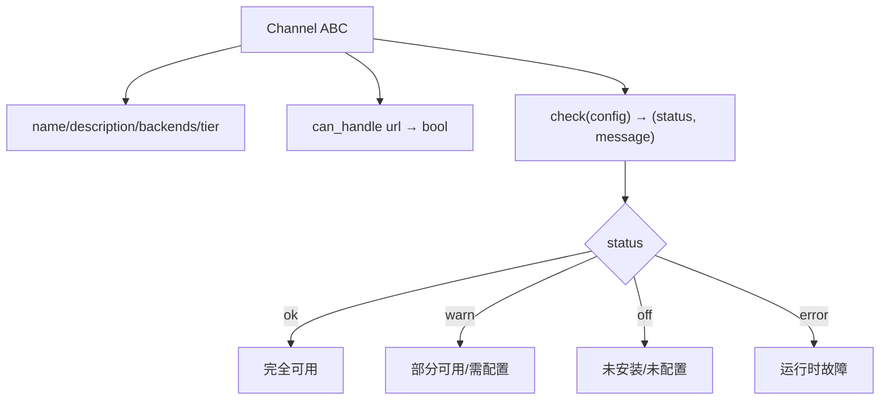
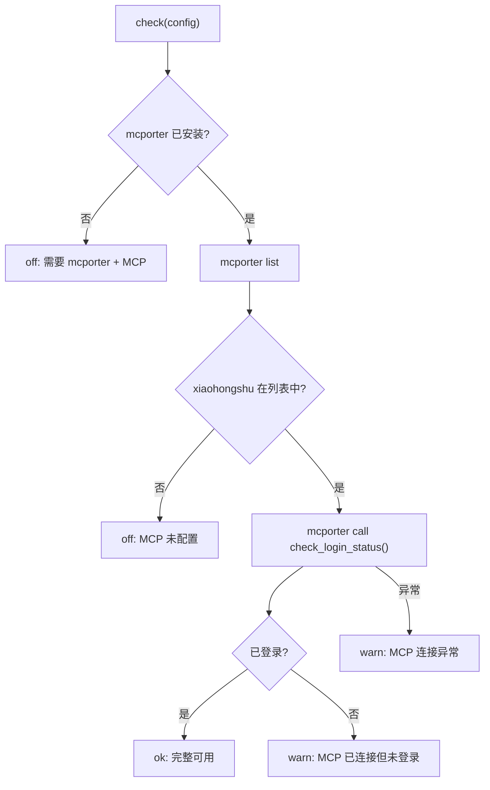
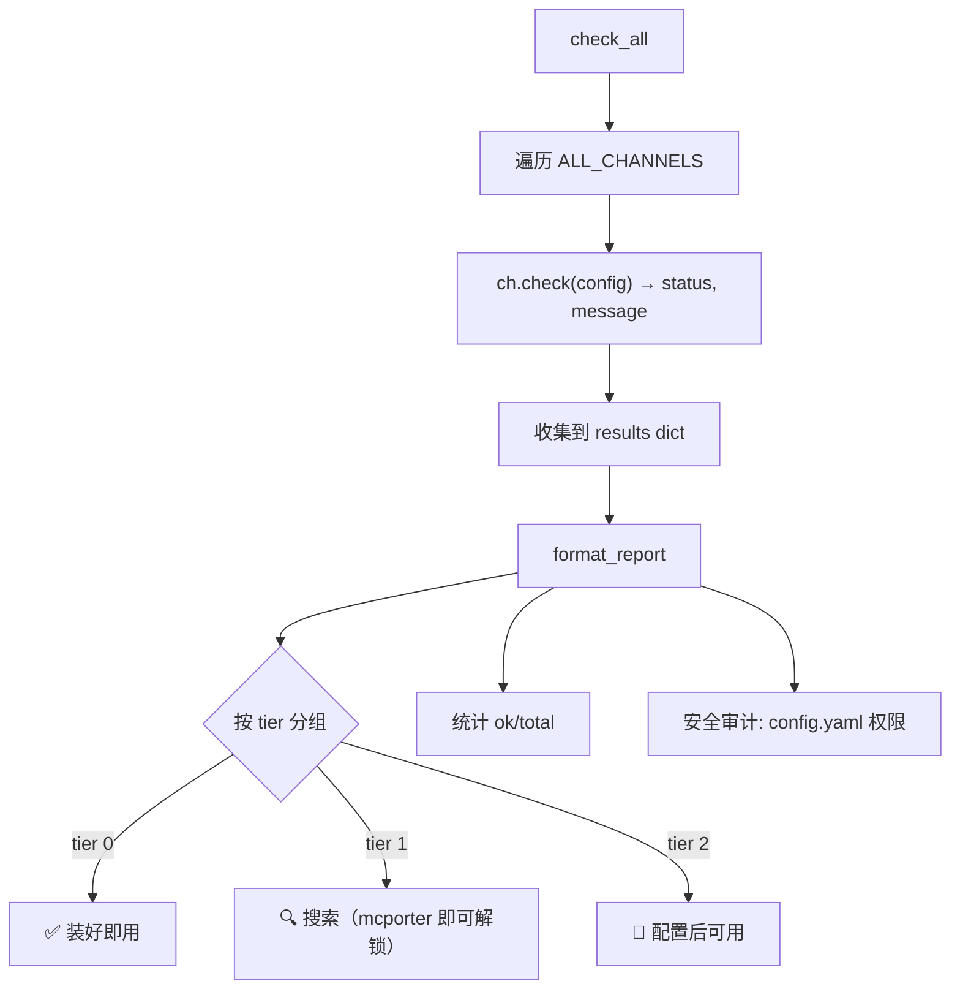

# PD-11.12 Agent Reach — Doctor 全渠道健康检查与分层诊断

> 文档编号：PD-11.12
> 来源：Agent Reach `agent_reach/doctor.py` `agent_reach/cli.py` `agent_reach/channels/base.py`
> GitHub：https://github.com/Panniantong/Agent-Reach.git
> 问题域：PD-11 可观测性 Observability & Cost Tracking
> 状态：可复用方案

---

## 第 1 章 问题与动机

### 1.1 核心问题

Agent 系统依赖大量外部工具和平台（CLI 工具、MCP 服务器、API 密钥、代理服务器等），这些依赖的可用性直接决定 Agent 的能力边界。传统做法是在运行时遇到错误才发现依赖缺失，导致：

- Agent 在执行任务中途失败，浪费 token 和时间
- 用户不知道哪些功能可用、哪些需要配置
- 多平台依赖的安装和配置状态难以一目了然
- 定时任务场景下无法静默监控，只能人工检查

Agent Reach 面对的是 12 个渠道（YouTube、Twitter、GitHub、Reddit、小红书等），每个渠道有不同的后端工具、不同的配置复杂度、不同的认证方式。需要一个统一的健康检查框架来管理这种复杂性。

### 1.2 Agent Reach 的解法概述

1. **去中心化自检**：每个 Channel 实现自己的 `check()` 方法，doctor 只负责聚合（`agent_reach/channels/base.py:31`）
2. **四态状态模型**：ok/warn/off/error 四种状态覆盖从完全可用到完全不可用的全谱（`agent_reach/channels/base.py:34`）
3. **三层 Tier 分级**：按配置复杂度分 tier 0/1/2，渐进式引导用户解锁能力（`agent_reach/doctor.py:36-70`）
4. **静默监控模式**：watch 命令正常时单行输出，异常时详细报告，适配 cron 场景（`agent_reach/cli.py:849-913`）
5. **安装后自动验证**：install 流程末尾自动调用 `check_all()` 形成闭环（`agent_reach/cli.py:214`）
6. **MCP 工具暴露**：通过 `get_status` MCP 工具让 Agent 可编程查询健康状态（`agent_reach/integrations/mcp_server.py:39-41`）

### 1.3 设计思想

| 设计原则 | 具体实现 | 理由 | 替代方案 |
|----------|----------|------|----------|
| 去中心化自检 | Channel.check() 各自实现 | 每个渠道的检查逻辑差异大（二进制检测/API 认证/MCP 连接），集中式会变成巨型 if-else | 集中式 HealthChecker 类 |
| 渐进式引导 | tier 0/1/2 分层展示 | 避免新用户被 12 个渠道的配置需求吓退，先展示零配置可用的 | 全部平铺展示 |
| 静默优先 | watch 命令仅异常时输出 | cron 场景下正常输出是噪声，只关心异常 | 始终输出完整报告 |
| 可操作的错误信息 | 每个 off/warn 状态附带安装命令 | 用户看到问题后能立即修复，不需要查文档 | 只报告状态码 |
| 配置文件权限审计 | doctor 检查 config.yaml 是否 world-readable | 配置含 API 密钥和 Cookie，权限过宽是安全风险 | 不检查权限 |

---

## 第 2 章 源码实现分析

### 2.1 架构概览

Agent Reach 的可观测性架构围绕 Channel 抽象基类构建，每个渠道是一个自检组件：

```
┌─────────────────────────────────────────────────────────┐
│                    CLI Layer (cli.py)                     │
│  doctor │ watch │ check-update │ install --verify         │
└────┬────────┬──────────┬──────────────┬──────────────────┘
     │        │          │              │
     ▼        ▼          ▼              ▼
┌─────────────────┐  ┌──────────┐  ┌──────────────────────┐
│  doctor.py      │  │ GitHub   │  │  MCP Server          │
│  check_all()    │  │ API      │  │  get_status tool     │
│  format_report()│  │ (版本)   │  │  (mcp_server.py)     │
└────┬────────────┘  └──────────┘  └──────────────────────┘
     │
     ▼  遍历 ALL_CHANNELS
┌─────────────────────────────────────────────────────────┐
│              Channel Registry (__init__.py)               │
│  12 个 Channel 实例：GitHub│Twitter│YouTube│Reddit│...    │
└────┬────────┬────────┬────────┬────────┬────────────────┘
     │        │        │        │        │
     ▼        ▼        ▼        ▼        ▼
┌────────┐┌────────┐┌────────┐┌────────┐┌────────┐
│ Tier 0 ││ Tier 0 ││ Tier 1 ││ Tier 1 ││ Tier 2 │
│ GitHub ││YouTube ││Twitter ││ Reddit ││小红书   │
│ gh CLI ││yt-dlp  ││bird CLI││Exa+API ││MCP srv │
│which() ││which() ││whoami  ││config  ││HTTP+RPC│
└────────┘└────────┘└────────┘└────────┘└────────┘
     │        │        │        │        │
     ▼        ▼        ▼        ▼        ▼
   (ok)     (ok)    (warn)    (warn)   (off)
```

### 2.2 核心实现

#### 2.2.1 Channel 抽象基类 — 自检接口定义



对应源码 `agent_reach/channels/base.py:18-37`：

```python
class Channel(ABC):
    """Base class for all channels."""

    name: str = ""                    # e.g. "youtube"
    description: str = ""             # e.g. "YouTube 视频和字幕"
    backends: List[str] = []          # e.g. ["yt-dlp"] — what upstream tool is used
    tier: int = 0                     # 0=zero-config, 1=needs free key, 2=needs setup

    @abstractmethod
    def can_handle(self, url: str) -> bool:
        """Check if this channel can handle this URL."""
        ...

    def check(self, config=None) -> Tuple[str, str]:
        """
        Check if this channel's upstream tool is available.
        Returns (status, message) where status is 'ok'/'warn'/'off'/'error'.
        """
        return "ok", f"{'、'.join(self.backends) if self.backends else '内置'}"
```

关键设计：`check()` 有默认实现返回 "ok"，零配置渠道（如 Web/RSS）无需覆写。

#### 2.2.2 三层递进式健康检查 — XiaoHongShu 示例



对应源码 `agent_reach/channels/xiaohongshu.py:20-50`：

```python
def check(self, config=None):
    if not shutil.which("mcporter"):
        return "off", (
            "需要 mcporter + xiaohongshu-mcp。安装步骤：\n"
            "  1. npm install -g mcporter\n"
            "  2. docker run -d --name xiaohongshu-mcp -p 18060:18060 xpzouying/xiaohongshu-mcp\n"
            "  3. mcporter config add xiaohongshu http://localhost:18060/mcp\n"
            "  详见 https://github.com/xpzouying/xiaohongshu-mcp"
        )
    try:
        r = subprocess.run(
            ["mcporter", "list"], capture_output=True, text=True, timeout=10
        )
        if "xiaohongshu" not in r.stdout:
            return "off", (
                "mcporter 已装但小红书 MCP 未配置。运行：\n"
                "  docker run -d --name xiaohongshu-mcp -p 18060:18060 xpzouying/xiaohongshu-mcp\n"
                "  mcporter config add xiaohongshu http://localhost:18060/mcp"
            )
    except Exception:
        return "off", "mcporter 连接异常"
    try:
        r = subprocess.run(
            ["mcporter", "call", "xiaohongshu.check_login_status()"],
            capture_output=True, text=True, timeout=10
        )
        if "已登录" in r.stdout or "logged" in r.stdout.lower():
            return "ok", "完整可用（阅读、搜索、发帖、评论、点赞）"
        return "warn", "MCP 已连接但未登录，需扫码登录"
    except Exception:
        return "warn", "MCP 连接异常，检查 xiaohongshu-mcp 服务是否在运行"
```

这是最复杂的检查模式：二进制存在 → 服务注册 → 认证状态，三层递进。

#### 2.2.3 Doctor 聚合与 Tier 分层报告



对应源码 `agent_reach/doctor.py:12-91`：

```python
def check_all(config: Config) -> Dict[str, dict]:
    """Check all channels and return status dict."""
    results = {}
    for ch in get_all_channels():
        status, message = ch.check(config)
        results[ch.name] = {
            "status": status,
            "name": ch.description,
            "message": message,
            "tier": ch.tier,
            "backends": ch.backends,
        }
    return results
```

`format_report()` 按 tier 分组输出，末尾附加安全审计（`doctor.py:77-89`）：

```python
# Security check: config file permissions
config_path = Config.CONFIG_DIR / "config.yaml"
if config_path.exists():
    mode = config_path.stat().st_mode
    if mode & (stat.S_IRGRP | stat.S_IROTH):
        lines.append("⚠️  安全提示：config.yaml 权限过宽（其他用户可读）")
        lines.append("   修复：chmod 600 ~/.agent-reach/config.yaml")
```

### 2.3 实现细节

#### watch 命令的静默监控设计

`_cmd_watch()` (`cli.py:849-913`) 是为 cron/定时任务设计的：

- 正常时输出单行：`👁️ Agent Reach: 全部正常 (11/12 渠道可用，v1.2.0 已是最新)`
- 异常时输出详细报告，包含每个问题渠道的状态和版本更新信息
- 同时检查渠道健康和版本更新，一次调用覆盖两个维度

#### Config 双源加载与敏感值脱敏

`Config.get()` (`config.py:61-70`) 实现 YAML 文件 + 环境变量双源：

```python
def get(self, key: str, default: Any = None) -> Any:
    if key in self.data:
        return self.data[key]
    env_val = os.environ.get(key.upper())
    if env_val:
        return env_val
    return default
```

`to_dict()` (`config.py:94-102`) 对含 key/token/password/proxy 的字段自动截断脱敏，防止日志泄露。

#### install 闭环验证

`_cmd_install()` (`cli.py:211-226`) 在安装完所有依赖后自动运行 `check_all()` 并输出报告，形成"安装→验证→引导修复"的闭环。


---

## 第 3 章 迁移指南

### 3.1 迁移清单

**阶段 1：基础框架（必须）**
- [ ] 定义 Component 抽象基类，含 `check()` → `(status, message)` 接口
- [ ] 实现 4 态状态模型：ok/warn/off/error
- [ ] 实现 tier 分级（0=零配置, 1=需免费密钥, 2=需复杂配置）
- [ ] 实现 `check_all()` 聚合函数
- [ ] 实现 `format_report()` 分层格式化输出

**阶段 2：CLI 集成（推荐）**
- [ ] 添加 `doctor` 命令：一键全量检查
- [ ] 添加 `watch` 命令：静默监控模式
- [ ] 在 `install` 流程末尾自动调用 doctor 验证

**阶段 3：高级特性（可选）**
- [ ] 配置文件权限审计
- [ ] 版本更新检测
- [ ] MCP 工具暴露（让 Agent 可编程查询状态）
- [ ] 敏感值脱敏输出

### 3.2 适配代码模板

以下模板可直接复用，实现一个通用的组件健康检查框架：

```python
"""通用组件健康检查框架 — 从 Agent Reach doctor 模式迁移"""

from abc import ABC, abstractmethod
from typing import Dict, List, Literal, Tuple
import shutil
import subprocess

Status = Literal["ok", "warn", "off", "error"]


class Component(ABC):
    """可检查的组件基类。"""
    name: str = ""
    description: str = ""
    tier: int = 0  # 0=零配置, 1=需密钥, 2=需复杂配置

    @abstractmethod
    def check(self, config: dict = None) -> Tuple[Status, str]:
        """返回 (状态, 人类可读消息)。消息应包含修复指引。"""
        ...


class BinaryComponent(Component):
    """检查某个 CLI 工具是否安装。"""
    binary: str = ""
    install_hint: str = ""

    def check(self, config=None) -> Tuple[Status, str]:
        if shutil.which(self.binary):
            return "ok", f"{self.binary} 已安装"
        return "off", f"{self.binary} 未安装。{self.install_hint}"


class ServiceComponent(Component):
    """检查某个服务是否可达。"""
    url: str = ""
    timeout: int = 5

    def check(self, config=None) -> Tuple[Status, str]:
        import requests
        try:
            resp = requests.get(self.url, timeout=self.timeout)
            if resp.status_code < 400:
                return "ok", f"服务可达 ({self.url})"
            return "warn", f"服务返回 {resp.status_code}"
        except Exception as e:
            return "off", f"服务不可达: {e}"


def check_all(components: List[Component], config: dict = None) -> Dict[str, dict]:
    """聚合所有组件的健康状态。"""
    results = {}
    for comp in components:
        status, message = comp.check(config)
        results[comp.name] = {
            "status": status,
            "name": comp.description,
            "message": message,
            "tier": comp.tier,
        }
    return results


def format_report(results: Dict[str, dict]) -> str:
    """按 tier 分层格式化输出。"""
    icons = {"ok": "✅", "warn": "⚠️", "off": "⬜", "error": "❌"}
    lines = ["健康检查报告", "=" * 40]

    for tier, label in [(0, "零配置"), (1, "需密钥"), (2, "需配置")]:
        tier_items = {k: v for k, v in results.items() if v["tier"] == tier}
        if not tier_items:
            continue
        lines.append(f"\n{label}：")
        for key, r in tier_items.items():
            icon = icons.get(r["status"], "?")
            lines.append(f"  {icon} {r['name']} — {r['message']}")

    ok = sum(1 for r in results.values() if r["status"] == "ok")
    lines.append(f"\n状态：{ok}/{len(results)} 个组件可用")
    return "\n".join(lines)


def watch(components: List[Component], config: dict = None, version: str = "") -> str:
    """静默监控：正常时单行，异常时详细报告。适配 cron。"""
    results = check_all(components, config)
    ok = sum(1 for r in results.values() if r["status"] == "ok")
    total = len(results)

    issues = []
    for key, r in results.items():
        if r["status"] in ("off", "error"):
            issues.append(f"❌ {r['name']}：{r['message']}")
        elif r["status"] == "warn":
            issues.append(f"⚠️ {r['name']}：{r['message']}")

    if not issues:
        return f"全部正常 ({ok}/{total} 组件可用，v{version})"

    lines = [f"监控报告 | {ok}/{total} 组件可用"]
    lines.extend(issues)
    return "\n".join(lines)
```

### 3.3 适用场景

| 场景 | 适用度 | 说明 |
|------|--------|------|
| 多外部依赖的 CLI 工具 | ⭐⭐⭐ | 完美匹配：多个后端工具 + 不同配置复杂度 |
| Agent 框架的能力检测 | ⭐⭐⭐ | Agent 启动前检测可用工具，避免运行时失败 |
| MCP 服务器集群监控 | ⭐⭐⭐ | 每个 MCP 服务器作为一个 Component |
| 微服务健康检查 | ⭐⭐ | 可用但缺少 HTTP 端点暴露，需自行扩展 |
| 单体应用内部诊断 | ⭐ | 过度设计，简单的 try-except 即可 |

---

## 第 4 章 测试用例

```python
"""基于 Agent Reach doctor 模式的测试用例。"""
import pytest
from unittest.mock import patch, MagicMock


# ── 测试 Channel 基类 ──

class TestChannelBase:
    def test_default_check_returns_ok(self):
        """基类默认 check() 返回 ok + 后端名称。"""
        from agent_reach.channels.base import Channel

        class DummyChannel(Channel):
            name = "dummy"
            backends = ["tool-a", "tool-b"]
            def can_handle(self, url): return False

        ch = DummyChannel()
        status, msg = ch.check()
        assert status == "ok"
        assert "tool-a" in msg and "tool-b" in msg

    def test_default_check_builtin(self):
        """无后端时显示'内置'。"""
        from agent_reach.channels.base import Channel

        class BuiltinChannel(Channel):
            name = "builtin"
            backends = []
            def can_handle(self, url): return False

        ch = BuiltinChannel()
        _, msg = ch.check()
        assert "内置" in msg


# ── 测试 Doctor 聚合 ──

class TestDoctor:
    @patch("agent_reach.doctor.get_all_channels")
    def test_check_all_collects_results(self, mock_channels):
        """check_all 聚合所有渠道状态。"""
        from agent_reach.doctor import check_all

        ch1 = MagicMock()
        ch1.name = "ch1"
        ch1.description = "Channel 1"
        ch1.tier = 0
        ch1.backends = ["tool1"]
        ch1.check.return_value = ("ok", "可用")

        ch2 = MagicMock()
        ch2.name = "ch2"
        ch2.description = "Channel 2"
        ch2.tier = 1
        ch2.backends = ["tool2"]
        ch2.check.return_value = ("off", "未安装")

        mock_channels.return_value = [ch1, ch2]
        results = check_all(MagicMock())

        assert results["ch1"]["status"] == "ok"
        assert results["ch2"]["status"] == "off"
        assert results["ch2"]["tier"] == 1

    @patch("agent_reach.doctor.get_all_channels")
    def test_format_report_tier_grouping(self, mock_channels):
        """format_report 按 tier 分组输出。"""
        from agent_reach.doctor import check_all, format_report

        ch = MagicMock()
        ch.name = "test"
        ch.description = "Test Channel"
        ch.tier = 0
        ch.backends = []
        ch.check.return_value = ("ok", "可用")
        mock_channels.return_value = [ch]

        results = check_all(MagicMock())
        report = format_report(results)
        assert "装好即用" in report
        assert "1/1" in report


# ── 测试 Watch 静默模式 ──

class TestWatch:
    @patch("agent_reach.cli.check_all")
    @patch("agent_reach.cli.requests")
    def test_watch_silent_when_all_ok(self, mock_req, mock_check):
        """全部正常时 watch 输出单行。"""
        mock_check.return_value = {
            "ch1": {"status": "ok", "name": "Ch1", "message": "ok"},
        }
        mock_req.get.return_value = MagicMock(status_code=404)
        # watch 应只输出一行包含"全部正常"


# ── 测试 Config 脱敏 ──

class TestConfigMasking:
    def test_to_dict_masks_sensitive(self):
        """to_dict 对含 key/token 的字段脱敏。"""
        from agent_reach.config import Config
        config = Config.__new__(Config)
        config.data = {
            "exa_api_key": "sk-1234567890abcdef",
            "normal_setting": "visible",
        }
        masked = config.to_dict()
        assert masked["exa_api_key"] == "sk-12345..."
        assert masked["normal_setting"] == "visible"


# ── 测试安全审计 ──

class TestSecurityAudit:
    @patch("agent_reach.doctor.get_all_channels")
    def test_report_warns_on_world_readable_config(self, mock_channels):
        """config.yaml 权限过宽时报告安全警告。"""
        mock_channels.return_value = []
        from agent_reach.doctor import format_report
        # format_report 内部检查 config.yaml 权限
        # 如果文件存在且 world-readable，应包含安全提示
        report = format_report({})
        # 具体断言取决于测试环境的文件权限
        assert isinstance(report, str)
```


---

## 第 5 章 跨域关联

| 关联域 | 关系类型 | 说明 |
|--------|----------|------|
| PD-04 工具系统 | 依赖 | doctor 检查的对象就是工具系统中注册的各个后端工具（gh/bird/yt-dlp/mcporter），工具注册表和健康检查共享 Channel 抽象 |
| PD-03 容错与重试 | 协同 | 每个 check() 调用都有 timeout 保护（5-15s），subprocess 异常被 try-except 捕获并降级为 warn/off 状态 |
| PD-09 Human-in-the-Loop | 协同 | doctor 报告中每个异常状态都附带修复命令，引导用户手动介入；watch 命令的异常报告也是 HITL 触发点 |
| PD-06 记忆持久化 | 协同 | Config 类将配置持久化到 YAML 文件，doctor 读取配置判断功能是否已配置；配置变更通过 save() 立即持久化 |
| PD-10 中间件管道 | 互补 | Agent Reach 没有中间件管道，doctor 是独立的诊断层；但 check_all() 的遍历模式可以扩展为管道式检查 |

---

## 第 6 章 来源文件索引

| 文件 | 行范围 | 关键实现 |
|------|--------|----------|
| `agent_reach/channels/base.py` | L18-L37 | Channel 抽象基类，定义 check() 接口和四态状态模型 |
| `agent_reach/doctor.py` | L12-L24 | check_all() 聚合函数，遍历所有渠道收集状态 |
| `agent_reach/doctor.py` | L27-L91 | format_report() 分层格式化 + 安全审计 |
| `agent_reach/cli.py` | L96-L101 | doctor/watch/check-update 命令路由 |
| `agent_reach/cli.py` | L683-L688 | _cmd_doctor() 入口 |
| `agent_reach/cli.py` | L792-L846 | _cmd_check_update() 版本检测 |
| `agent_reach/cli.py` | L849-L913 | _cmd_watch() 静默监控模式 |
| `agent_reach/cli.py` | L211-L226 | install 末尾自动验证闭环 |
| `agent_reach/cli.py` | L28-L33 | _configure_logging() loguru 静默控制 |
| `agent_reach/config.py` | L15-L102 | Config 类：YAML 持久化 + 环境变量双源 + 脱敏输出 |
| `agent_reach/config.py` | L22-L28 | FEATURE_REQUIREMENTS 功能→配置键映射 |
| `agent_reach/config.py` | L54-L59 | save() 自动设置 0o600 权限 |
| `agent_reach/channels/__init__.py` | L25-L38 | ALL_CHANNELS 注册表（12 个渠道实例） |
| `agent_reach/channels/github.py` | L19-L29 | GitHub 渠道：which + auth status 两步检查 |
| `agent_reach/channels/twitter.py` | L20-L38 | Twitter 渠道：which + whoami 认证检查 |
| `agent_reach/channels/xiaohongshu.py` | L20-L50 | 小红书渠道：三层递进检查（binary→注册→认证） |
| `agent_reach/integrations/mcp_server.py` | L27-L57 | MCP Server：get_status 工具暴露 |
| `agent_reach/core.py` | L23-L42 | AgentReach API 包装类 |

---

## 第 7 章 横向对比维度

```json comparison_data
{
  "project": "Agent Reach",
  "dimensions": {
    "追踪方式": "Channel.check() 去中心化自检，doctor 聚合遍历",
    "数据粒度": "渠道级四态（ok/warn/off/error）+ tier 分级",
    "持久化": "Config YAML 持久化配置状态，无运行时指标持久化",
    "多提供商": "12 渠道统一 Channel 接口，各自实现 check()",
    "日志格式": "loguru 默认静默，--verbose 开启 stderr INFO",
    "健康端点": "MCP get_status 工具 + CLI doctor 命令双入口",
    "版本追踪": "GitHub API 轮询 latest release + commit SHA",
    "安全审计": "config.yaml 权限检查 + 敏感值脱敏 to_dict()",
    "渠道分层": "tier 0/1/2 按配置复杂度分层展示",
    "Agent 状态追踪": "无 Agent 运行时状态，仅检查工具可用性",
    "日志噪声过滤": "watch 命令正常时单行输出，异常时详细报告",
    "可视化": "CLI emoji 文本报告，无 Dashboard/Web UI"
  }
}
```

### 域元数据补充

```json domain_metadata
{
  "solution_summary": "Agent Reach 通过 Channel 抽象基类实现 12 渠道去中心化自检，doctor 聚合 + tier 三层分级报告 + watch 静默监控 + MCP 工具暴露",
  "description": "CLI 工具的多外部依赖健康检查与渐进式引导框架",
  "sub_problems": [
    "MCP 服务器三层递进检查：binary 存在→服务注册→认证状态的逐步深入诊断",
    "install 闭环验证：安装流程末尾自动 doctor 确认实际效果",
    "环境自动检测适配：SSH/Docker/Cloud 指标加权判断 local vs server"
  ],
  "best_practices": [
    "check() 返回可操作的错误信息：每个 off/warn 状态附带具体安装命令，用户无需查文档",
    "Config 双源加载：YAML 文件优先 + 环境变量回退，适配容器和 CI 场景",
    "配置保存时自动 chmod 600：防止含密钥的配置文件被其他用户读取"
  ]
}
```

