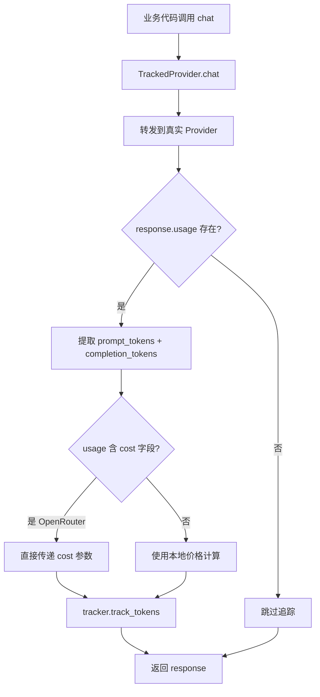
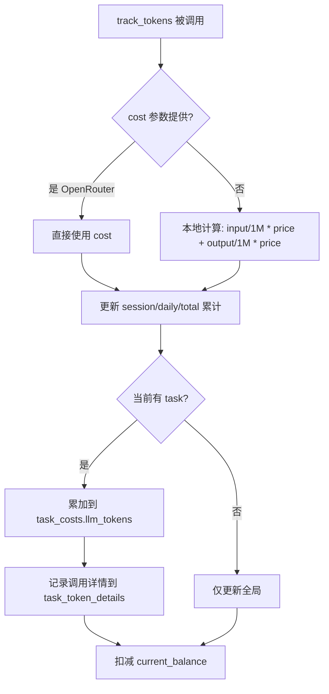
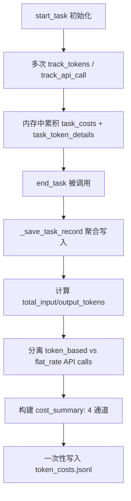

# PD-11.CW ClawWork — EconomicTracker 经济生存追踪与多通道成本归因

> 文档编号：PD-11.CW
> 来源：ClawWork `livebench/agent/economic_tracker.py`
> GitHub：https://github.com/HKUDS/ClawWork.git
> 问题域：PD-11 可观测性 Observability & Cost Tracking
> 状态：可复用方案

---

## 第 1 章 问题与动机

### 1.1 核心问题

在 Agent 经济生存模拟中，每个 Agent 拥有初始资金（如 $1000），通过完成工作任务赚取收入，同时每次 LLM 调用、搜索 API、OCR API 都会消耗余额。如果成本追踪不精确，Agent 可能在不知不觉中破产；如果收入评估不透明，无法判断哪些任务值得投入。

ClawWork 的核心挑战是：**在多提供商（OpenAI、OpenRouter）、多通道（LLM token、搜索 API、OCR API、flat-rate API）的复杂计费环境下，实现逐调用级别的成本追踪，并将成本与任务、日期、Agent 身份三个维度关联**。

### 1.2 ClawWork 的解法概述

1. **EconomicTracker 中心化追踪器**：单一类管理余额、token 成本、工作收入、交易利润四大经济指标，所有 LLM 调用和 API 调用都通过它记账（`economic_tracker.py:12-44`）
2. **TrackedProvider 透明包装器**：通过装饰器模式包装 nanobot 的 LLMProvider，在每次 `chat()` 调用后自动提取 usage 并记账，业务代码无需感知成本追踪的存在（`provider_wrapper.py:37-72`）
3. **CostCapturingLiteLLMProvider 子类**：继承 LiteLLMProvider 并覆写 `_parse_response`，从 OpenRouter 的 `response.usage.cost` 或 litellm 的 `_hidden_params["response_cost"]` 中捕获直报成本（`provider_wrapper.py:18-34`）
4. **四通道成本分离**：每个任务的成本按 `llm_tokens`、`search_api`、`ocr_api`、`other_api` 四个通道独立累计，支持 token 计费和 flat-rate 计费两种模式（`economic_tracker.py:133-138`）
5. **三层 JSONL 持久化**：`balance.jsonl`（日级余额快照）、`token_costs.jsonl`（任务级成本明细）、`task_completions.jsonl`（任务完成记录），三文件互补形成完整经济时间线（`economic_tracker.py:52-54`）

### 1.3 设计思想

| 设计原则 | 具体实现 | 理由 | 替代方案 |
|----------|----------|------|----------|
| 透明拦截 | TrackedProvider 包装 chat() | 业务代码零侵入，所有调用自动记账 | 手动在每个调用点插入追踪代码 |
| 直报成本优先 | OpenRouter cost 字段直接使用 | 避免本地定价表与实际计费不一致 | 维护 100+ 模型的本地定价表 |
| 任务级聚合 | 内存累积 → end_task() 一次写入 | 减少 I/O 次数，保证任务记录原子性 | 每次 API 调用立即写入文件 |
| 生存状态机 | thriving/stable/struggling/bankrupt 四态 | 简洁的健康指示，驱动 Agent 决策 | 连续数值无离散状态 |
| 评估门控 | 0.6 分阈值决定是否发放报酬 | 激励高质量输出，防止低质量刷量 | 线性比例支付 |

---

## 第 2 章 源码实现分析

### 2.1 架构概览

ClawWork 的可观测性体系由三层组成：数据采集层（TrackedProvider + track_response_tokens）、核心记账层（EconomicTracker）、展示层（FastAPI + React Dashboard）。

```
┌─────────────────────────────────────────────────────────────┐
│                    React Dashboard                          │
│  ┌──────────┐  ┌──────────────┐  ┌───────────────────────┐ │
│  │ Dashboard │  │ Leaderboard  │  │ WorkView (Quality)    │ │
│  │ AreaChart │  │ Rankings     │  │ QualityBadge 0.6 cliff│ │
│  └─────┬────┘  └──────┬───────┘  └───────────┬───────────┘ │
│        └───────────────┼──────────────────────┘             │
│                        │ REST + WebSocket                   │
├────────────────────────┼────────────────────────────────────┤
│              FastAPI Server (server.py)                      │
│  /api/agents/{sig}/economic  /api/leaderboard  /ws          │
│  watch_agent_files() → mtime polling → broadcast            │
├────────────────────────┼────────────────────────────────────┤
│            EconomicTracker (核心记账层)                       │
│  ┌──────────────┐  ┌──────────────┐  ┌──────────────────┐  │
│  │ track_tokens  │  │track_api_call│  │track_flat_api_call│  │
│  │ (LLM 调用)   │  │(token 计费)  │  │(flat-rate 计费)  │  │
│  └──────┬───────┘  └──────┬───────┘  └────────┬─────────┘  │
│         └─────────────────┼────────────────────┘            │
│                    ┌──────┴──────┐                           │
│                    │ 四通道累计   │                           │
│                    │ llm_tokens  │                           │
│                    │ search_api  │                           │
│                    │ ocr_api     │                           │
│                    │ other_api   │                           │
│                    └──────┬──────┘                           │
│                           │ end_task()                       │
│              ┌────────────┼────────────────┐                │
│              ▼            ▼                ▼                 │
│     balance.jsonl  token_costs.jsonl  task_completions.jsonl│
├─────────────────────────────────────────────────────────────┤
│              数据采集层 (Provider Wrappers)                   │
│  ┌─────────────────────┐  ┌──────────────────────────────┐  │
│  │ TrackedProvider      │  │ CostCapturingLiteLLMProvider │  │
│  │ 包装 nanobot chat()  │  │ 覆写 _parse_response         │  │
│  │ → track_tokens()     │  │ → usage["cost"] = OR cost    │  │
│  └─────────────────────┘  └──────────────────────────────┘  │
│  ┌─────────────────────────────────────────────────────────┐│
│  │ track_response_tokens() — LangChain 响应适配            ││
│  │ 优先 response_metadata["token_usage"] (raw API)         ││
│  │ 回退 usage_metadata (LangChain normalized)              ││
│  └─────────────────────────────────────────────────────────┘│
└─────────────────────────────────────────────────────────────┘
```

### 2.2 核心实现

#### 2.2.1 TrackedProvider 透明包装器



对应源码 `clawmode_integration/provider_wrapper.py:37-72`：

```python
class TrackedProvider:
    """Transparent wrapper that tracks token costs via EconomicTracker."""

    def __init__(self, provider: LLMProvider, tracker: Any) -> None:
        self._provider = provider
        self._tracker = tracker  # EconomicTracker

    async def chat(
        self,
        messages: list[dict[str, Any]],
        tools: list[dict[str, Any]] | None = None,
        model: str | None = None,
        max_tokens: int = 4096,
        temperature: float = 0.7,
    ) -> LLMResponse:
        response = await self._provider.chat(
            messages=messages, tools=tools, model=model,
            max_tokens=max_tokens, temperature=temperature,
        )
        # Feed usage into EconomicTracker
        if response.usage and self._tracker:
            self._tracker.track_tokens(
                response.usage["prompt_tokens"],
                response.usage["completion_tokens"],
                cost=response.usage.get("cost"),  # OpenRouter direct cost
            )
        return response

    def __getattr__(self, name: str) -> Any:
        return getattr(self._provider, name)
```

关键设计：`__getattr__` 代理使得 TrackedProvider 对外表现与原始 Provider 完全一致，任何非 `chat()` 的属性访问都透明转发。

#### 2.2.2 EconomicTracker 四通道成本追踪



对应源码 `livebench/agent/economic_tracker.py:158-201`：

```python
def track_tokens(self, input_tokens: int, output_tokens: int,
                 api_name: str = "agent", cost: Optional[float] = None) -> float:
    if cost is None:
        cost = (
            (input_tokens / 1_000_000.0) * self.input_token_price +
            (output_tokens / 1_000_000.0) * self.output_token_price
        )
    # Update session tracking
    self.session_input_tokens += input_tokens
    self.session_output_tokens += output_tokens
    self.session_cost += cost
    self.daily_cost += cost
    # Update task-level tracking
    if self.current_task_id:
        self.task_costs["llm_tokens"] += cost
        self.task_token_details["llm_calls"].append({
            "timestamp": datetime.now().isoformat(),
            "api_name": api_name,
            "input_tokens": input_tokens,
            "output_tokens": output_tokens,
            "cost": cost
        })
    # Update totals
    self.total_token_cost += cost
    self.current_balance -= cost
    return cost
```

#### 2.2.3 任务级聚合写入



对应源码 `livebench/agent/economic_tracker.py:288-356`：

```python
def _save_task_record(self) -> None:
    """Save consolidated task-level cost record (one line per task)"""
    if not self.current_task_id:
        return
    total_input_tokens = sum(call["input_tokens"]
                             for call in self.task_token_details.get("llm_calls", []))
    total_output_tokens = sum(call["output_tokens"]
                              for call in self.task_token_details.get("llm_calls", []))
    task_record = {
        "timestamp_end": datetime.now().isoformat(),
        "timestamp_start": self.task_start_time,
        "date": self.current_task_date or datetime.now().strftime("%Y-%m-%d"),
        "task_id": self.current_task_id,
        "llm_usage": {
            "total_calls": len(self.task_token_details.get("llm_calls", [])),
            "total_input_tokens": total_input_tokens,
            "total_output_tokens": total_output_tokens,
            "total_tokens": total_input_tokens + total_output_tokens,
            "total_cost": self.task_costs.get("llm_tokens", 0.0),
            "calls_detail": self.task_token_details.get("llm_calls", [])
        },
        "api_usage": { ... },
        "cost_summary": {
            "llm_tokens": self.task_costs.get("llm_tokens", 0.0),
            "search_api": self.task_costs.get("search_api", 0.0),
            "ocr_api": self.task_costs.get("ocr_api", 0.0),
            "other_api": self.task_costs.get("other_api", 0.0),
            "total_cost": sum(self.task_costs.values())
        },
        "balance_after": self.current_balance,
    }
    with open(self.token_costs_file, "a", encoding="utf-8") as f:
        f.write(json.dumps(task_record) + "\n")
```

### 2.3 实现细节

#### 三层 JSONL 数据模型

| 文件 | 粒度 | 写入时机 | 关键字段 |
|------|------|----------|----------|
| `balance.jsonl` | 日级 | `save_daily_state()` | balance, token_cost_delta, work_income_delta, survival_status, task_completion_time_seconds |
| `token_costs.jsonl` | 任务级 | `end_task()` / `_log_work_income()` | llm_usage, api_usage, cost_summary (4 通道), balance_after |
| `task_completions.jsonl` | 任务级 | `record_task_completion()` | task_id, wall_clock_seconds, evaluation_score, money_earned, attempt |

#### track_response_tokens 双源适配

`track_response_tokens()` 函数（`economic_tracker.py:842-876`）是 LangChain 响应到 EconomicTracker 的桥梁：

1. 优先从 `response.response_metadata["token_usage"]` 提取原始 API 返回的 token 数
2. 回退到 `response.usage_metadata`（LangChain 标准化后的数据）
3. 对 OpenRouter 提供商，额外提取 `raw["cost"]` 字段作为直报成本

#### 生存状态机

`get_survival_status()` 方法（`economic_tracker.py:524-538`）将连续的余额值映射为四个离散状态：

- `bankrupt`: balance ≤ 0
- `struggling`: balance < 100
- `stable`: balance < 500
- `thriving`: balance ≥ 500

这些状态通过 WebSocket 实时推送到前端 Dashboard，驱动 UI 颜色和 emoji 变化。

#### 评估门控与支付逻辑

`add_work_income()` 方法（`economic_tracker.py:358-395`）实现了 0.6 分阈值门控：

- evaluation_score ≥ 0.6 → 全额支付
- evaluation_score < 0.6 → 零支付，记录但不增加余额

前端 WorkView 中的 `QUALITY_CLIFF = 0.6` 常量（`WorkView.jsx:8`）与后端阈值保持一致。

#### WebSocket 实时推送

`server.py:747-804` 的 `watch_agent_files()` 后台任务每秒轮询 JSONL 文件的 mtime，检测到变化后通过 WebSocket broadcast 推送更新到所有连接的前端客户端。

#### LiveBenchLogger 四级 JSONL 日志

`logger.py:14-246` 实现了独立于 Python logging 模块的自定义日志系统：

- 四个级别文件：`errors.jsonl`、`warnings.jsonl`、`debug.jsonl`、`info.jsonl`
- 每条日志包含 timestamp、signature、level、message、context、exception（含 traceback）
- `terminal_print()` 同时输出到控制台和日期分片的 terminal log 文件

---

## 第 3 章 迁移指南

### 3.1 迁移清单

**阶段 1：核心记账器（1 个文件）**

- [ ] 创建 `EconomicTracker` 类，包含 `track_tokens()`、`track_api_call()`、`track_flat_api_call()` 三个入口
- [ ] 实现四通道成本分离：`llm_tokens`、`search_api`、`ocr_api`、`other_api`
- [ ] 实现 `start_task()` / `end_task()` 任务生命周期管理
- [ ] 实现 `_save_task_record()` 聚合写入 JSONL

**阶段 2：Provider 包装器（1 个文件）**

- [ ] 创建 `TrackedProvider` 包装类，拦截 `chat()` 调用
- [ ] 实现 `__getattr__` 透明代理
- [ ] 如果使用 OpenRouter，创建 `CostCapturingLiteLLMProvider` 子类捕获直报成本

**阶段 3：日志系统（1 个文件）**

- [ ] 创建四级 JSONL 日志器（error/warning/info/debug）
- [ ] 实现 `terminal_print()` 双输出（控制台 + 文件）
- [ ] 实现全局 logger 单例

**阶段 4：API 与可视化（2 个文件）**

- [ ] 创建 FastAPI 端点读取 JSONL 文件
- [ ] 实现 WebSocket + mtime 轮询实时推送
- [ ] 前端 Dashboard 展示余额曲线、成本分布、生存状态

### 3.2 适配代码模板

以下是一个可直接运行的最小化 EconomicTracker 实现：

```python
"""Minimal EconomicTracker — 可直接复用的成本追踪核心"""
import json
import os
from datetime import datetime
from typing import Dict, List, Optional, Any


class EconomicTracker:
    """四通道成本追踪 + 任务级聚合 + JSONL 持久化"""

    CHANNELS = ("llm_tokens", "search_api", "ocr_api", "other_api")
    SURVIVAL_THRESHOLDS = [(0, "bankrupt"), (100, "struggling"),
                           (500, "stable"), (float("inf"), "thriving")]

    def __init__(self, agent_id: str, initial_balance: float = 1000.0,
                 input_price_per_1m: float = 2.5, output_price_per_1m: float = 10.0,
                 data_dir: str = "./data"):
        self.agent_id = agent_id
        self.balance = initial_balance
        self.total_cost = 0.0
        self.total_income = 0.0
        self._input_price = input_price_per_1m
        self._output_price = output_price_per_1m

        # Task-level accumulator
        self._task_id: Optional[str] = None
        self._task_costs: Dict[str, float] = {}
        self._task_calls: List[Dict] = []

        # Persistence
        self._dir = os.path.join(data_dir, agent_id, "economic")
        os.makedirs(self._dir, exist_ok=True)
        self._balance_file = os.path.join(self._dir, "balance.jsonl")
        self._costs_file = os.path.join(self._dir, "token_costs.jsonl")

    def start_task(self, task_id: str) -> None:
        self._task_id = task_id
        self._task_costs = {ch: 0.0 for ch in self.CHANNELS}
        self._task_calls = []

    def track_tokens(self, input_tokens: int, output_tokens: int,
                     cost: Optional[float] = None, channel: str = "llm_tokens") -> float:
        if cost is None:
            cost = ((input_tokens / 1e6) * self._input_price +
                    (output_tokens / 1e6) * self._output_price)
        self.total_cost += cost
        self.balance -= cost
        if self._task_id:
            self._task_costs[channel] = self._task_costs.get(channel, 0.0) + cost
            self._task_calls.append({
                "ts": datetime.now().isoformat(), "in": input_tokens,
                "out": output_tokens, "cost": cost, "ch": channel
            })
        return cost

    def track_api_call(self, cost: float, channel: str = "other_api") -> float:
        self.total_cost += cost
        self.balance -= cost
        if self._task_id:
            self._task_costs[channel] = self._task_costs.get(channel, 0.0) + cost
        return cost

    def end_task(self) -> None:
        if not self._task_id:
            return
        record = {
            "task_id": self._task_id,
            "timestamp": datetime.now().isoformat(),
            "cost_summary": dict(self._task_costs),
            "total_cost": sum(self._task_costs.values()),
            "calls": self._task_calls,
            "balance_after": self.balance,
        }
        with open(self._costs_file, "a") as f:
            f.write(json.dumps(record) + "\n")
        self._task_id = None

    def get_survival_status(self) -> str:
        for threshold, status in self.SURVIVAL_THRESHOLDS:
            if self.balance < threshold:
                return status
        return "thriving"

    def save_daily(self, date: str, income: float = 0.0) -> None:
        self.balance += income
        self.total_income += income
        record = {
            "date": date, "balance": self.balance,
            "total_cost": self.total_cost, "total_income": self.total_income,
            "survival_status": self.get_survival_status(),
        }
        with open(self._balance_file, "a") as f:
            f.write(json.dumps(record) + "\n")
```

**TrackedProvider 包装器模板：**

```python
class TrackedProvider:
    """透明包装任意 LLM Provider，自动追踪成本"""

    def __init__(self, provider, tracker: EconomicTracker):
        self._provider = provider
        self._tracker = tracker

    async def chat(self, messages, **kwargs):
        response = await self._provider.chat(messages, **kwargs)
        if hasattr(response, "usage") and response.usage:
            self._tracker.track_tokens(
                response.usage.get("prompt_tokens", 0),
                response.usage.get("completion_tokens", 0),
                cost=response.usage.get("cost"),  # OpenRouter 直报
            )
        return response

    def __getattr__(self, name):
        return getattr(self._provider, name)
```

### 3.3 适用场景

| 场景 | 适用度 | 说明 |
|------|--------|------|
| Agent 经济模拟 | ⭐⭐⭐ | 完美匹配：余额管理 + 生存状态 + 评估门控 |
| 多 Agent 成本对比 | ⭐⭐⭐ | 每个 Agent 独立 EconomicTracker，JSONL 天然支持聚合 |
| 多提供商成本归一 | ⭐⭐⭐ | TrackedProvider + CostCapturing 双层适配 |
| 实时成本监控 | ⭐⭐ | WebSocket + mtime 轮询可用，但非事件驱动 |
| 高并发场景 | ⭐ | 单线程内存累积，不支持并发写入同一 JSONL |
| 分布式部署 | ⭐ | 文件系统持久化，不支持跨节点聚合 |

---

## 第 4 章 测试用例

```python
import json
import os
import tempfile
import pytest


class TestEconomicTracker:
    """基于 ClawWork EconomicTracker 真实接口的测试"""

    def setup_method(self):
        self.temp_dir = tempfile.mkdtemp()
        from economic_tracker import EconomicTracker
        self.tracker = EconomicTracker(
            signature="test-agent",
            initial_balance=1000.0,
            input_token_price=2.5,
            output_token_price=10.0,
            data_path=self.temp_dir,
            min_evaluation_threshold=0.6
        )
        self.tracker.initialize()

    def test_track_tokens_local_pricing(self):
        """测试本地价格计算：input 2.5$/1M + output 10$/1M"""
        self.tracker.start_task("task-001")
        cost = self.tracker.track_tokens(1_000_000, 500_000)
        # 1M input * 2.5 + 0.5M output * 10 = 2.5 + 5.0 = 7.5
        assert abs(cost - 7.5) < 0.001
        assert abs(self.tracker.current_balance - (1000.0 - 7.5)) < 0.001

    def test_track_tokens_openrouter_cost(self):
        """测试 OpenRouter 直报成本覆盖本地计算"""
        self.tracker.start_task("task-002")
        cost = self.tracker.track_tokens(1_000_000, 500_000, cost=3.14)
        assert abs(cost - 3.14) < 0.001  # 使用直报成本，非本地计算

    def test_four_channel_separation(self):
        """测试四通道成本分离"""
        self.tracker.start_task("task-003")
        self.tracker.track_tokens(100_000, 50_000)  # llm_tokens
        self.tracker.track_api_call(1000, 0.02, "JINA_Search")  # search_api
        self.tracker.track_api_call(500, 0.01, "OCR_Service")  # ocr_api
        self.tracker.track_flat_api_call(0.001, "Tavily_Search")  # search_api (flat)

        assert self.tracker.task_costs["llm_tokens"] > 0
        assert self.tracker.task_costs["search_api"] > 0
        assert self.tracker.task_costs["ocr_api"] > 0

    def test_task_record_written_on_end(self):
        """测试 end_task() 写入聚合记录"""
        self.tracker.start_task("task-004")
        self.tracker.track_tokens(50_000, 20_000)
        self.tracker.end_task()

        costs_file = os.path.join(self.temp_dir, "token_costs.jsonl")
        assert os.path.exists(costs_file)
        with open(costs_file) as f:
            record = json.loads(f.readline())
        assert record["task_id"] == "task-004"
        assert "cost_summary" in record
        assert "llm_usage" in record

    def test_evaluation_threshold_gate(self):
        """测试 0.6 评估门控"""
        self.tracker.start_task("task-005")
        # 低于阈值 → 零支付
        payment_low = self.tracker.add_work_income(50.0, "task-005", 0.45)
        assert payment_low == 0.0

        # 高于阈值 → 全额支付
        payment_high = self.tracker.add_work_income(50.0, "task-005", 0.85)
        assert payment_high == 50.0

    def test_survival_status_transitions(self):
        """测试生存状态机"""
        assert self.tracker.get_survival_status() == "thriving"  # 1000
        self.tracker.current_balance = 400
        assert self.tracker.get_survival_status() == "stable"
        self.tracker.current_balance = 50
        assert self.tracker.get_survival_status() == "struggling"
        self.tracker.current_balance = 0
        assert self.tracker.get_survival_status() == "bankrupt"

    def test_task_completion_idempotent_replace(self):
        """测试 record_task_completion 幂等替换"""
        self.tracker.start_task("task-006", date="2026-01-15")
        self.tracker.record_task_completion(
            task_id="task-006", work_submitted=True,
            wall_clock_seconds=120.5, evaluation_score=0.8,
            money_earned=30.0, attempt=1, date="2026-01-15"
        )
        # 第二次调用应替换而非追加
        self.tracker.record_task_completion(
            task_id="task-006", work_submitted=True,
            wall_clock_seconds=95.0, evaluation_score=0.9,
            money_earned=45.0, attempt=2, date="2026-01-15"
        )
        completions_file = os.path.join(self.temp_dir, "task_completions.jsonl")
        with open(completions_file) as f:
            lines = [l for l in f if l.strip()]
        assert len(lines) == 1  # 只有一条记录
        record = json.loads(lines[0])
        assert record["attempt"] == 2
        assert record["wall_clock_seconds"] == 95.0
```

---

## 第 5 章 跨域关联

| 关联域 | 关系类型 | 说明 |
|--------|----------|------|
| PD-01 上下文管理 | 协同 | token 用量直接影响上下文窗口消耗，EconomicTracker 的 session_input_tokens 可用于判断是否需要压缩上下文 |
| PD-02 多 Agent 编排 | 协同 | 每个 Agent 独立 EconomicTracker 实例，Leaderboard API 聚合所有 Agent 的经济数据进行排名 |
| PD-03 容错与重试 | 依赖 | `_ainvoke_with_retry()` 中每次重试都会产生额外 token 成本，EconomicTracker 自动累计；API 错误时 `session_api_error` 标记防止记录不完整的任务 |
| PD-06 记忆持久化 | 协同 | balance.jsonl / token_costs.jsonl / task_completions.jsonl 三文件构成经济记忆，支持跨 session 恢复（`_load_latest_state()`） |
| PD-07 质量检查 | 依赖 | 评估分数（0.0-1.0）直接决定支付门控（≥0.6 才发放），WorkEvaluator 的输出是 EconomicTracker 的输入 |
| PD-09 Human-in-the-Loop | 协同 | 前端 Dashboard 通过 WebSocket 实时展示经济状态，人类可以观察 Agent 的生存状况并决定是否干预 |

---

## 第 6 章 来源文件索引

| 文件 | 行范围 | 关键实现 |
|------|--------|----------|
| `livebench/agent/economic_tracker.py` | L12-L44 | EconomicTracker 类定义与初始化 |
| `livebench/agent/economic_tracker.py` | L117-L156 | start_task / end_task 任务生命周期 |
| `livebench/agent/economic_tracker.py` | L158-L201 | track_tokens 四通道成本追踪核心 |
| `livebench/agent/economic_tracker.py` | L203-L282 | track_api_call / track_flat_api_call 双计费模式 |
| `livebench/agent/economic_tracker.py` | L288-L356 | _save_task_record 聚合写入 |
| `livebench/agent/economic_tracker.py` | L358-L421 | add_work_income 评估门控支付 |
| `livebench/agent/economic_tracker.py` | L438-L513 | save_daily_state / _save_balance_record 日级快照 |
| `livebench/agent/economic_tracker.py` | L524-L538 | get_survival_status 四态状态机 |
| `livebench/agent/economic_tracker.py` | L577-L676 | get_cost_analytics 多维度成本分析 |
| `livebench/agent/economic_tracker.py` | L678-L732 | record_task_completion 幂等替换 |
| `livebench/agent/economic_tracker.py` | L842-L876 | track_response_tokens LangChain 适配 |
| `clawmode_integration/provider_wrapper.py` | L18-L34 | CostCapturingLiteLLMProvider OpenRouter 成本捕获 |
| `clawmode_integration/provider_wrapper.py` | L37-L72 | TrackedProvider 透明包装器 |
| `livebench/api/server.py` | L145-L153 | EconomicMetrics Pydantic 模型 |
| `livebench/api/server.py` | L464-L502 | /api/agents/{sig}/economic 端点 |
| `livebench/api/server.py` | L505-L608 | /api/leaderboard 多 Agent 排名 |
| `livebench/api/server.py` | L713-L733 | WebSocket 实时推送 |
| `livebench/api/server.py` | L747-L804 | watch_agent_files mtime 轮询 |
| `livebench/utils/logger.py` | L14-L135 | LiveBenchLogger 四级 JSONL 日志 |
| `livebench/utils/logger.py` | L160-L199 | setup_terminal_log / terminal_print 双输出 |
| `livebench/agent/live_agent.py` | L131-L137 | EconomicTracker 初始化 |
| `livebench/agent/live_agent.py` | L438-L450 | _track_tokens_from_response 委托 |
| `livebench/agent/live_agent.py` | L851-L862 | record_task_completion 调用点 |
| `livebench/agent/wrapup_workflow.py` | L234-L240 | WrapUp 中的 token 追踪 |
| `frontend/src/pages/Dashboard.jsx` | L107-L117 | wall-clock 时间聚合 |
| `frontend/src/pages/Dashboard.jsx` | L182-L233 | 7 个 MetricCard 展示 |
| `frontend/src/pages/WorkView.jsx` | L8 | QUALITY_CLIFF = 0.6 常量 |
| `frontend/src/pages/WorkView.jsx` | L47-L65 | QualityBadge 组件 |
| `scripts/derive_task_completions.py` | L1-L27 | 从历史日志重建 task_completions |
| `scripts/validate_economic_system.py` | L20-L37 | EconomicTracker 验证脚本 |

---

## 第 7 章 横向对比维度

> **重要：** 本章用于自动填充 Butcher Wiki 的横向对比表。

```json comparison_data
{
  "project": "ClawWork",
  "dimensions": {
    "追踪方式": "EconomicTracker 中心化记账 + TrackedProvider 透明拦截",
    "数据粒度": "逐调用级别，任务级聚合写入，日级余额快照",
    "持久化": "三层 JSONL：balance + token_costs + task_completions",
    "多提供商": "OpenRouter 直报成本优先，本地价格计算回退",
    "日志格式": "自定义四级 JSONL（error/warning/info/debug）",
    "可视化": "React Dashboard + Recharts 图表 + WebSocket 实时推送",
    "成本追踪": "四通道分离：llm_tokens/search_api/ocr_api/other_api",
    "预算守卫": "生存状态机四态 + is_bankrupt() 破产检测终止模拟",
    "Decorator 插桩": "TrackedProvider __getattr__ 代理 + CostCapturing 子类覆写",
    "JSONL大文件策略": "全量读取 readlines()，无尾部优化",
    "业务元数据注入": "task_id/date/attempt/wall_clock_seconds 关联到每条记录",
    "延迟统计": "wall_clock_seconds 端到端任务耗时，含 API 重试等待",
    "评估门控": "0.6 分阈值决定支付，前后端 QUALITY_CLIFF 常量一致",
    "经济模拟": "初始余额 + 收支平衡 + 生存状态驱动 Agent 决策"
  }
}
```

### 域元数据补充

```json domain_metadata
{
  "solution_summary": "ClawWork 用 EconomicTracker 四通道成本分离 + TrackedProvider 透明拦截 + 三层 JSONL 持久化实现 Agent 经济生存追踪",
  "description": "Agent 经济模拟中的收支平衡追踪与生存状态驱动决策",
  "sub_problems": [
    "评估门控支付：质量分数低于阈值时零支付，需前后端阈值常量一致",
    "任务级成本聚合：内存累积多次调用后一次性写入，保证记录原子性",
    "直报成本 vs 本地计算：OpenRouter 等提供商返回实际计费金额，应优先使用",
    "task_completions 幂等替换：重试场景下同一 task_id 的记录需原地替换而非追加",
    "经济状态恢复：跨 session 从 JSONL 末行恢复余额和累计值"
  ],
  "best_practices": [
    "Provider 包装器用 __getattr__ 代理非核心方法，保持接口透明",
    "三层 JSONL 分离关注点：日级快照查趋势、任务级明细查归因、完成记录查进度",
    "生存状态机将连续余额映射为离散状态，简化 Agent 决策和 UI 展示",
    "评估门控阈值在后端和前端用同名常量定义，防止不一致"
  ]
}
```
