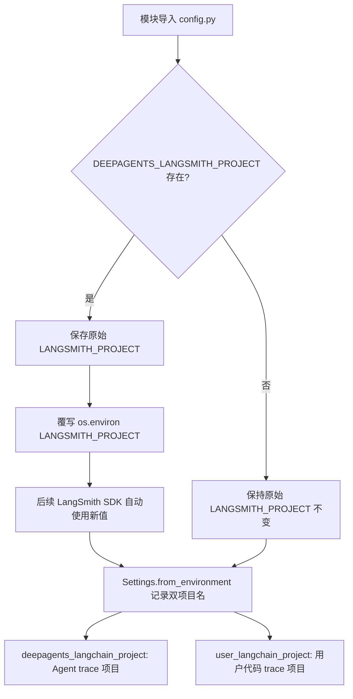
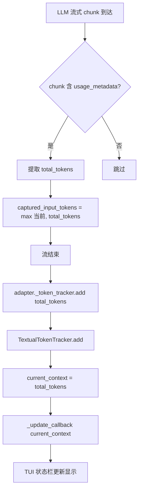

# PD-11.37 DeepAgents — LangSmith 全链路追踪与 TextualTokenTracker 实时计量

> 文档编号：PD-11.37
> 来源：DeepAgents `libs/cli/deepagents_cli/config.py`, `libs/cli/deepagents_cli/app.py`, `libs/harbor/deepagents_harbor/deepagents_wrapper.py`
> GitHub：https://github.com/langchain-ai/deepagents.git
> 问题域：PD-11 可观测性 Observability & Cost Tracking
> 状态：可复用方案

---

## 第 1 章 问题与动机（≥ 30 行）

### 1.1 核心问题

Agent 系统的可观测性面临三个层次的挑战：

1. **调用链追踪**：LLM 调用链路跨越 CLI 交互层、Agent 编排层、沙箱执行层，需要统一的 trace 上下文贯穿全链路，否则无法定位性能瓶颈和错误根因。
2. **Token 实时计量**：用户在交互式 CLI 中需要实时感知当前会话的 token 消耗量，以便在上下文窗口接近上限时主动压缩或切换线程。
3. **评估场景追踪**：Harbor 评估框架运行大量任务时，需要将每次 Agent 执行的 trace 关联到 LangSmith 实验和数据集，支持按任务维度的成本和质量分析。

DeepAgents 的特殊之处在于它是一个 **CLI-first** 的 Agent 框架，同时支持交互式 TUI（Textual）和非交互式批处理两种模式，可观测性方案必须同时覆盖这两种场景。

### 1.2 DeepAgents 的解法概述

1. **DEEPAGENTS_LANGSMITH_PROJECT 环境变量路由**：在模块导入时劫持 `LANGSMITH_PROJECT`，将 Agent trace 路由到独立项目，与用户代码的 trace 隔离（`config.py:29-35`）
2. **TextualTokenTracker 回调式计量**：轻量级 token 追踪器通过回调函数更新 TUI 状态栏，支持 hide/show 控制流式输出期间的显示（`app.py:174-209`）
3. **LangSmith 线程 URL 深链接**：自动构建 LangSmith 线程 URL，在 CLI 欢迎页和线程选择器中渲染为可点击超链接（`config.py:995-1061`）
4. **Harbor 评估 Trajectory 持久化**：评估场景下从 `AIMessage.usage_metadata` 精确提取 token 用量，写入 ATIF-v1.2 格式的 trajectory JSON（`deepagents_wrapper.py:286-397`）
5. **LangSmith 实验关联**：通过 `LANGSMITH_EXPERIMENT` 环境变量将 trace 关联到实验 session，支持 `reference_example_id` 精确匹配数据集样本（`deepagents_wrapper.py:252-278`）

### 1.3 设计思想

| 设计原则 | 具体实现 | 理由 | 替代方案 |
|----------|----------|------|----------|
| 环境变量劫持隔离 | 模块导入时覆写 `LANGSMITH_PROJECT`，保存原始值到 `_original_langsmith_project` | LangSmith SDK 在调用时读取环境变量，无法通过参数传递项目名 | 每次调用时手动传 `project_name` 参数（侵入性强） |
| 回调驱动 UI 更新 | `TextualTokenTracker` 通过 `update_callback` 和 `hide_callback` 解耦计量与渲染 | TUI 框架（Textual）的 widget 更新必须在主线程，回调模式天然适配 | 直接在 adapter 中操作 widget（耦合过紧） |
| 异步线程 URL 解析 | `asyncio.to_thread` + 2s 超时获取 LangSmith 项目 URL | 网络调用不能阻塞 TUI 事件循环，超时保证启动速度 | 同步阻塞获取（卡住 UI） |
| 确定性 Example ID | SHA-256(seed + instruction) → UUID 前 16 字节 | 相同指令在不同运行中映射到同一 LangSmith example，支持跨实验对比 | 随机 UUID（无法关联） |
| 双模式 token 提取 | 流式用 `usage_metadata.total_tokens` 取 max，评估用 `input_tokens + output_tokens` 累加 | 流式场景 token 数递增取最大值即可；评估场景需精确累加每步 | 统一用 tiktoken 估算（不准确） |

---

## 第 2 章 源码实现分析（≥ 60 行，核心章节）

### 2.1 架构概览

DeepAgents 的可观测性分为三层：

```
┌─────────────────────────────────────────────────────────────┐
│                    CLI 层 (deepagents_cli)                   │
│  ┌──────────────┐  ┌──────────────────┐  ┌───────────────┐  │
│  │ config.py    │  │ app.py           │  │ non_inter.py  │  │
│  │ ENV 劫持     │  │ TextualToken     │  │ 非交互模式    │  │
│  │ URL 构建     │  │ Tracker          │  │ Header 输出   │  │
│  │ 项目名解析   │  │ 流式 token 采集  │  │ 线程 URL 链接 │  │
│  └──────┬───────┘  └────────┬─────────┘  └───────┬───────┘  │
│         │                   │                     │          │
│         └───────────┬───────┴─────────────────────┘          │
│                     ▼                                        │
│  ┌──────────────────────────────────────────────────────┐    │
│  │ textual_adapter.py — 流式 chunk 处理 + token 采集    │    │
│  └──────────────────────────┬───────────────────────────┘    │
├─────────────────────────────┼────────────────────────────────┤
│                    Harbor 层 (deepagents_harbor)             │
│  ┌──────────────────────────┴───────────────────────────┐    │
│  │ deepagents_wrapper.py — Trajectory 持久化 + 实验关联  │    │
│  │ tracing.py — 确定性 Example ID 生成                   │    │
│  │ harbor_langsmith.py — 数据集/实验/反馈 CLI            │    │
│  └──────────────────────────────────────────────────────┘    │
├──────────────────────────────────────────────────────────────┤
│                    LangSmith 云端                             │
│  ┌──────────┐  ┌──────────┐  ┌──────────┐  ┌──────────┐    │
│  │ Projects │  │ Threads  │  │ Datasets │  │ Feedback │    │
│  └──────────┘  └──────────┘  └──────────┘  └──────────┘    │
└──────────────────────────────────────────────────────────────┘
```

### 2.2 核心实现

#### 2.2.1 DEEPAGENTS_LANGSMITH_PROJECT 环境变量路由



对应源码 `libs/cli/deepagents_cli/config.py:28-35`：

```python
# CRITICAL: Override LANGSMITH_PROJECT to route agent traces to separate project
# LangSmith reads LANGSMITH_PROJECT at invocation time, so we override it here
# and preserve the user's original value for shell commands
_deepagents_project = os.environ.get("DEEPAGENTS_LANGSMITH_PROJECT")
_original_langsmith_project = os.environ.get("LANGSMITH_PROJECT")
if _deepagents_project:
    # Override LANGSMITH_PROJECT for agent traces
    os.environ["LANGSMITH_PROJECT"] = _deepagents_project
```

`Settings` 数据类保存双项目名（`config.py:456-457`）：

```python
deepagents_langchain_project: str | None  # For deepagents agent tracing
user_langchain_project: str | None  # Original LANGSMITH_PROJECT for user code
```

#### 2.2.2 TextualTokenTracker 回调式计量



对应源码 `libs/cli/deepagents_cli/app.py:174-209`：

```python
class TextualTokenTracker:
    """Token tracker that updates the status bar."""

    def __init__(
        self,
        update_callback: Callable[[int], None],
        hide_callback: Callable[[], None] | None = None,
    ) -> None:
        """Initialize with callbacks to update the display."""
        self._update_callback = update_callback
        self._hide_callback = hide_callback
        self.current_context = 0

    def add(self, total_tokens: int, _output_tokens: int = 0) -> None:
        """Update token count from a response.
        Args:
            total_tokens: Total context tokens (input + output from usage_metadata)
            _output_tokens: Unused, kept for backwards compatibility
        """
        self.current_context = total_tokens
        self._update_callback(self.current_context)

    def reset(self) -> None:
        """Reset token count."""
        self.current_context = 0
        self._update_callback(0)

    def hide(self) -> None:
        """Hide the token display (e.g., during streaming)."""
        if self._hide_callback:
            self._hide_callback()

    def show(self) -> None:
        """Show the token display with current value (e.g., after interrupt)."""
        self._update_callback(self.current_context)
```

流式 token 采集在 `textual_adapter.py:462-481`：

```python
# Extract token usage (before content_blocks check - usage may be on any chunk)
if adapter._token_tracker and hasattr(message, "usage_metadata"):
    usage = message.usage_metadata
    if usage:
        total_toks = usage.get("total_tokens", 0)
        if total_toks:
            captured_input_tokens = max(captured_input_tokens, total_toks)
        else:
            input_toks = usage.get("input_tokens", 0)
            output_toks = usage.get("output_tokens", 0)
            if input_toks or output_toks:
                total = input_toks + output_toks
                captured_input_tokens = max(captured_input_tokens, total)
```

### 2.3 实现细节

#### LangSmith 线程 URL 构建与缓存

`config.py:966-1061` 实现了三层 URL 解析链：

1. `get_langsmith_project_name()` — 检查 API key + tracing 环境变量是否同时存在
2. `fetch_langsmith_project_url()` — 通过 LangSmith Client 获取项目 URL，模块级缓存避免重复网络请求
3. `build_langsmith_thread_url()` — 组合项目 URL + thread_id + UTM 参数

```python
# config.py:1040-1061
def build_langsmith_thread_url(thread_id: str) -> str | None:
    project_name = get_langsmith_project_name()
    if not project_name:
        return None
    project_url = fetch_langsmith_project_url(project_name)
    if not project_url:
        return None
    return f"{project_url.rstrip('/')}/t/{thread_id}?utm_source=deepagents-cli"
```

WelcomeBanner 使用 `asyncio.to_thread` + 2s 超时异步获取 URL（`widgets/welcome.py:62-75`）：

```python
async def _fetch_and_update(self) -> None:
    try:
        project_url = await asyncio.wait_for(
            asyncio.to_thread(fetch_langsmith_project_url, self._project_name),
            timeout=2.0,
        )
    except (TimeoutError, OSError):
        project_url = None
    if project_url:
        self._project_url = project_url
        self.update(self._build_banner(project_url))
```

#### Harbor 评估 Trajectory 持久化

`deepagents_wrapper.py:286-397` 从 LangGraph 消息流中精确提取 token 用量：

```python
# deepagents_wrapper.py:303-309
for msg in result["messages"]:
    if isinstance(msg, AIMessage):
        usage: UsageMetadata = msg.usage_metadata
        if usage:
            total_prompt_tokens += usage["input_tokens"]
            total_completion_tokens += usage["output_tokens"]
```

最终写入 ATIF-v1.2 格式的 trajectory JSON：

```python
metrics = FinalMetrics(
    total_prompt_tokens=total_prompt_tokens or None,
    total_completion_tokens=total_completion_tokens or None,
    total_steps=len(steps),
)
trajectory = Trajectory(
    schema_version="ATIF-v1.2",
    session_id=environment.session_id,
    agent=Agent(name=self.name(), version=self.version() or "unknown", ...),
    steps=steps,
    final_metrics=metrics,
)
```

#### 确定性 Example ID 生成

`libs/harbor/deepagents_harbor/tracing.py:7-32` 使用 SHA-256 + seed 生成确定性 UUID：

```python
def create_example_id_from_instruction(instruction: str, seed: int = 42) -> str:
    normalized = instruction.strip()
    seeded_data = seed.to_bytes(8, byteorder="big") + normalized.encode("utf-8")
    hash_bytes = hashlib.sha256(seeded_data).digest()
    example_uuid = uuid.UUID(bytes=hash_bytes[:16])
    return str(example_uuid)
```


---

## 第 3 章 迁移指南（≥ 40 行）

### 3.1 迁移清单

**阶段 1：环境变量路由（1 个文件）**

- [ ] 在项目入口模块顶部添加 `LANGSMITH_PROJECT` 劫持逻辑
- [ ] 定义 `YOUR_PROJECT_LANGSMITH_PROJECT` 环境变量
- [ ] 保存原始 `LANGSMITH_PROJECT` 到 `_original_langsmith_project`

**阶段 2：Token 实时计量（2 个文件）**

- [ ] 实现 `TokenTracker` 类（回调驱动，支持 add/reset/hide/show）
- [ ] 在流式 chunk 处理中提取 `usage_metadata`
- [ ] 将 tracker 注入 UI 层的状态栏更新回调

**阶段 3：LangSmith 深链接（1 个文件）**

- [ ] 实现 `fetch_langsmith_project_url()` 带模块级缓存
- [ ] 实现 `build_langsmith_thread_url()` 组合线程 URL
- [ ] 在 UI 中渲染可点击超链接（Rich Style link）

**阶段 4：评估 Trajectory 持久化（1 个文件）**

- [ ] 从 `AIMessage.usage_metadata` 累加 `input_tokens` + `output_tokens`
- [ ] 定义 `FinalMetrics` 数据结构
- [ ] 写入 JSON trajectory 文件

### 3.2 适配代码模板

#### 环境变量路由模板

```python
"""在项目入口模块顶部执行，劫持 LANGSMITH_PROJECT 环境变量。"""
import os

_MY_PROJECT = os.environ.get("MY_APP_LANGSMITH_PROJECT")
_ORIGINAL_PROJECT = os.environ.get("LANGSMITH_PROJECT")

if _MY_PROJECT:
    os.environ["LANGSMITH_PROJECT"] = _MY_PROJECT


def get_user_langsmith_project() -> str | None:
    """获取用户原始的 LANGSMITH_PROJECT（用于 shell 命令等场景）。"""
    return _ORIGINAL_PROJECT
```

#### Token Tracker 模板

```python
"""轻量级 token 追踪器，通过回调驱动 UI 更新。"""
from typing import Callable


class TokenTracker:
    def __init__(
        self,
        update_callback: Callable[[int], None],
        hide_callback: Callable[[], None] | None = None,
    ) -> None:
        self._update_callback = update_callback
        self._hide_callback = hide_callback
        self.current_context = 0

    def add(self, total_tokens: int) -> None:
        self.current_context = total_tokens
        self._update_callback(self.current_context)

    def reset(self) -> None:
        self.current_context = 0
        self._update_callback(0)

    def hide(self) -> None:
        if self._hide_callback:
            self._hide_callback()

    def show(self) -> None:
        self._update_callback(self.current_context)
```

#### 流式 Token 采集模板

```python
"""从 LangChain AIMessage 流式 chunk 中提取 token 用量。"""

captured_total = 0

async for chunk in agent.astream(input_data, stream_mode=["messages", "updates"]):
    namespace, mode, data = chunk
    if mode == "messages":
        message, metadata = data
        if hasattr(message, "usage_metadata") and message.usage_metadata:
            usage = message.usage_metadata
            total = usage.get("total_tokens", 0)
            if not total:
                total = usage.get("input_tokens", 0) + usage.get("output_tokens", 0)
            captured_total = max(captured_total, total)

# 流结束后更新 tracker
token_tracker.add(captured_total)
```

### 3.3 适用场景

| 场景 | 适用度 | 说明 |
|------|--------|------|
| CLI Agent 交互式 TUI | ⭐⭐⭐ | TextualTokenTracker 专为 Textual TUI 设计 |
| 非交互式批处理 | ⭐⭐⭐ | 非交互模式 header 输出 LangSmith 线程链接 |
| Harbor 评估框架 | ⭐⭐⭐ | Trajectory 持久化 + 实验关联完整覆盖 |
| Web 应用后端 | ⭐⭐ | 环境变量路由和 token 累加可复用，UI 部分需替换 |
| 多 Agent 并行系统 | ⭐ | 缺少 per-agent 成本归属，需扩展 |

---

## 第 4 章 测试用例（≥ 20 行）

```python
"""基于 DeepAgents 真实函数签名的测试用例。"""
import hashlib
import uuid
from unittest.mock import MagicMock


class TestTextualTokenTracker:
    """测试 TextualTokenTracker 的核心行为。"""

    def test_add_updates_context_and_calls_callback(self):
        called_with = []
        from deepagents_cli.app import TextualTokenTracker
        tracker = TextualTokenTracker(lambda x: called_with.append(x))
        tracker.add(1700)
        assert tracker.current_context == 1700
        assert called_with == [1700]

    def test_reset_clears_context(self):
        called_with = []
        from deepagents_cli.app import TextualTokenTracker
        tracker = TextualTokenTracker(lambda x: called_with.append(x))
        tracker.add(1500)
        called_with.clear()
        tracker.reset()
        assert tracker.current_context == 0
        assert called_with == [0]

    def test_hide_calls_hide_callback(self):
        hide_called = []
        from deepagents_cli.app import TextualTokenTracker
        tracker = TextualTokenTracker(
            lambda _: None, hide_callback=lambda: hide_called.append(True)
        )
        tracker.hide()
        assert hide_called == [True]

    def test_show_restores_current_value(self):
        called_with = []
        from deepagents_cli.app import TextualTokenTracker
        tracker = TextualTokenTracker(lambda x: called_with.append(x))
        tracker.add(1500)
        called_with.clear()
        tracker.show()
        assert called_with == [1500]


class TestDeterministicExampleId:
    """测试确定性 Example ID 生成。"""

    def test_same_instruction_same_id(self):
        def create_example_id(instruction: str, seed: int = 42) -> str:
            normalized = instruction.strip()
            seeded_data = seed.to_bytes(8, byteorder="big") + normalized.encode("utf-8")
            hash_bytes = hashlib.sha256(seeded_data).digest()
            return str(uuid.UUID(bytes=hash_bytes[:16]))

        id1 = create_example_id("Fix the bug in main.py")
        id2 = create_example_id("Fix the bug in main.py")
        assert id1 == id2

    def test_different_instruction_different_id(self):
        def create_example_id(instruction: str, seed: int = 42) -> str:
            normalized = instruction.strip()
            seeded_data = seed.to_bytes(8, byteorder="big") + normalized.encode("utf-8")
            hash_bytes = hashlib.sha256(seeded_data).digest()
            return str(uuid.UUID(bytes=hash_bytes[:16]))

        id1 = create_example_id("Fix the bug")
        id2 = create_example_id("Add a feature")
        assert id1 != id2

    def test_whitespace_normalization(self):
        def create_example_id(instruction: str, seed: int = 42) -> str:
            normalized = instruction.strip()
            seeded_data = seed.to_bytes(8, byteorder="big") + normalized.encode("utf-8")
            hash_bytes = hashlib.sha256(seeded_data).digest()
            return str(uuid.UUID(bytes=hash_bytes[:16]))

        id1 = create_example_id("  Fix the bug  ")
        id2 = create_example_id("Fix the bug")
        assert id1 == id2


class TestTokenExtractionFromUsageMetadata:
    """测试从 usage_metadata 提取 token 的逻辑。"""

    def test_total_tokens_preferred(self):
        usage = {"total_tokens": 1500, "input_tokens": 1000, "output_tokens": 500}
        total = usage.get("total_tokens", 0)
        assert total == 1500

    def test_fallback_to_input_plus_output(self):
        usage = {"input_tokens": 800, "output_tokens": 200}
        total = usage.get("total_tokens", 0)
        if not total:
            total = usage.get("input_tokens", 0) + usage.get("output_tokens", 0)
        assert total == 1000

    def test_max_accumulation_for_streaming(self):
        """流式场景下 token 数递增，取 max。"""
        captured = 0
        chunks = [500, 1000, 1500, 2000]
        for total in chunks:
            captured = max(captured, total)
        assert captured == 2000
```


---

## 第 5 章 跨域关联

| 关联域 | 关系类型 | 说明 |
|--------|----------|------|
| PD-01 上下文管理 | 协同 | TextualTokenTracker 的 `current_context` 值直接驱动 SummarizationMiddleware 的压缩触发判断 |
| PD-04 工具系统 | 依赖 | LangSmith trace 自动捕获工具调用的输入/输出/耗时，工具系统的结构化输出影响 trace 质量 |
| PD-05 沙箱隔离 | 协同 | Harbor 评估场景下 Trajectory 持久化需要沙箱环境提供 `session_id` 和 `trial_paths` |
| PD-07 质量检查 | 协同 | Harbor 的 `add_feedback` 命令将评估奖励写回 LangSmith trace，形成质量-追踪闭环 |
| PD-09 Human-in-the-Loop | 依赖 | 非交互模式的 HITL 决策（approve/reject）通过 LangSmith trace 记录，辅助分析人机交互模式 |

---

## 第 6 章 来源文件索引

| 文件 | 行范围 | 关键实现 |
|------|--------|----------|
| `libs/cli/deepagents_cli/config.py` | L28-35 | DEEPAGENTS_LANGSMITH_PROJECT 环境变量劫持 |
| `libs/cli/deepagents_cli/config.py` | L456-457 | Settings 双项目名字段定义 |
| `libs/cli/deepagents_cli/config.py` | L966-1061 | LangSmith 项目 URL 获取与线程 URL 构建 |
| `libs/cli/deepagents_cli/app.py` | L174-209 | TextualTokenTracker 类定义 |
| `libs/cli/deepagents_cli/textual_adapter.py` | L462-481 | 流式 chunk token 采集逻辑 |
| `libs/cli/deepagents_cli/non_interactive.py` | L486-521 | 非交互模式 header 构建与线程 URL 链接 |
| `libs/cli/deepagents_cli/widgets/welcome.py` | L26-148 | WelcomeBanner LangSmith 项目链接渲染 |
| `libs/cli/deepagents_cli/widgets/thread_selector.py` | L274-317 | 线程选择器 LangSmith URL 异步解析 |
| `libs/harbor/deepagents_harbor/deepagents_wrapper.py` | L104-123 | LangSmith 实验 instruction→example_id 映射构建 |
| `libs/harbor/deepagents_harbor/deepagents_wrapper.py` | L252-278 | LANGSMITH_EXPERIMENT trace 上下文包装 |
| `libs/harbor/deepagents_harbor/deepagents_wrapper.py` | L286-397 | Trajectory 持久化与 token 累加 |
| `libs/harbor/deepagents_harbor/tracing.py` | L7-32 | 确定性 Example ID 生成（SHA-256 + seed） |
| `libs/harbor/scripts/harbor_langsmith.py` | L36-501 | Harbor-LangSmith CLI（数据集/实验/反馈） |
| `libs/cli/tests/unit_tests/test_token_tracker.py` | L1-55 | TextualTokenTracker 单元测试 |

---

## 第 7 章 横向对比维度

> **重要：** 本章用于自动填充 Butcher Wiki 的横向对比表。
> 必须严格按以下 JSON 格式输出，放在 `comparison_data` 代码块中。

```json comparison_data
{
  "project": "DeepAgents",
  "dimensions": {
    "追踪方式": "LangSmith SDK 自动追踪 + 环境变量路由到独立项目",
    "数据粒度": "per-message usage_metadata 级别，区分 input/output tokens",
    "持久化": "ATIF-v1.2 JSON trajectory + LangSmith 云端",
    "多提供商": "仅 LangSmith，无多后端适配",
    "成本追踪": "token 累加但无定价表，不计算美元成本",
    "Agent 状态追踪": "Trajectory steps 记录 agent/user/tool 三类消息",
    "Span 传播": "LangSmith trace context 通过 RunnableConfig 传播",
    "评估门控": "Harbor reward feedback 写回 LangSmith trace",
    "Decorator 插桩": "无 Decorator，依赖 LangSmith SDK 自动插桩",
    "零开销路径": "无 LANGSMITH_API_KEY 时完全跳过追踪逻辑",
    "评估指标设计": "harbor_reward 单一 score 反馈，支持 dry-run 模式",
    "日志格式": "Python logging 标准模块，无结构化 JSON",
    "可视化": "LangSmith Web UI + CLI 内嵌可点击线程链接"
  }
}
```

### 域元数据补充

```json domain_metadata
{
  "solution_summary": "DeepAgents 通过 DEEPAGENTS_LANGSMITH_PROJECT 环境变量劫持实现 trace 项目隔离，TextualTokenTracker 回调驱动 TUI 实时 token 计量，Harbor 评估层 ATIF-v1.2 trajectory 持久化关联 LangSmith 实验",
  "description": "CLI-first Agent 框架的双模式（交互/批处理）可观测性集成",
  "sub_problems": [
    "环境变量劫持时机：模块导入时覆写 vs 运行时传参的 LangSmith SDK 兼容性",
    "确定性 Example ID：SHA-256 seed 方案在指令微调后 ID 变化导致实验关联断裂",
    "异步 URL 解析超时：LangSmith API 不可达时 2s 超时对 CLI 启动速度的影响",
    "流式 token max 累积：多轮对话中 total_tokens 递增取 max 的正确性依赖 API 行为"
  ],
  "best_practices": [
    "LangSmith 项目 URL 使用模块级缓存避免重复网络请求",
    "异步 URL 解析用 asyncio.to_thread + 超时保护不阻塞 TUI 事件循环",
    "评估场景用确定性 UUID 关联 instruction 到 LangSmith example 支持跨实验对比",
    "Harbor feedback 写入前检查已有 feedback 避免重复"
  ]
}
```
