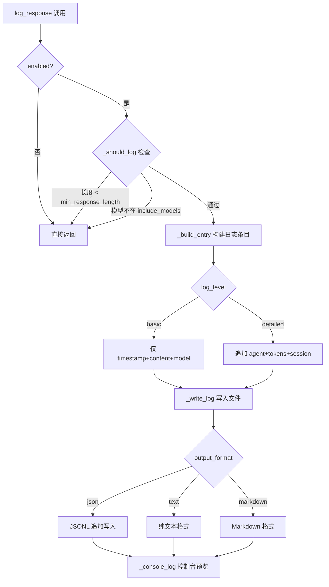
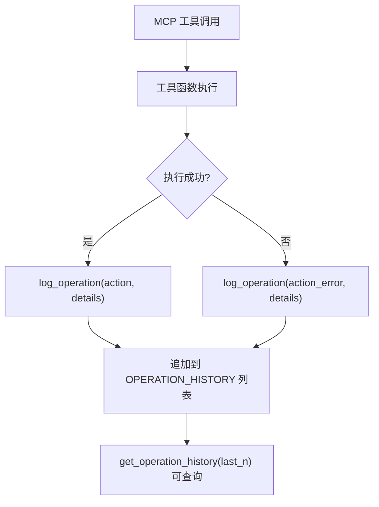

# PD-11.04 DeepCode — 三层可观测性与操作历史追踪

> 文档编号：PD-11.04
> 来源：DeepCode `utils/simple_llm_logger.py` `tools/code_implementation_server.py` `new_ui/backend/services/workflow_service.py`
> GitHub：https://github.com/HKUDS/DeepCode.git
> 问题域：PD-11 可观测性 Observability & Cost Tracking
> 状态：可复用方案

---

## 第 1 章 问题与动机（≥ 30 行）

### 1.1 核心问题

在论文到代码的自动化复现系统中，多 Agent 协作执行长时间工作流（研究分析 → 代码规划 → 代码实现），需要解决三个层次的可观测性问题：

1. **LLM 调用层**：每次 LLM 调用的响应内容需要持久化记录，便于事后分析模型输出质量、调试 prompt 效果。不同模型（Claude、GPT-4、o3-mini）的响应需要按模型过滤记录。
2. **工具操作层**：MCP Server 执行的每一次文件读写、代码执行、搜索操作都需要追踪，形成完整的操作时间线，用于审计和故障排查。
3. **工作流层**：多步骤工作流的整体进度需要实时推送给前端，支持用户感知当前执行阶段和百分比。

DeepCode 的特殊挑战在于：它是一个论文复现系统，单次工作流可能涉及数十次 LLM 调用和上百次工具操作，且工作流执行时间长（分钟级），用户需要实时了解进度。

### 1.2 DeepCode 的解法概述

DeepCode 采用三层独立的可观测性方案，各层职责清晰：

1. **SimpleLLMLogger**（`utils/simple_llm_logger.py:16`）：配置驱动的 LLM 响应日志器，支持 JSONL/Text/Markdown 三种输出格式，通过 YAML 配置控制日志级别、模型过滤和最小响应长度
2. **OPERATION_HISTORY**（`tools/code_implementation_server.py:52`）：全局列表追踪 MCP Server 所有工具操作，每条记录包含时间戳、动作类型和详情字典
3. **WorkflowTask + progress_callback**（`new_ui/backend/services/workflow_service.py:21-36`）：dataclass 状态机 + asyncio.Queue 广播模式，支持多订阅者实时接收进度更新
4. **DialogueLogger**（`utils/dialogue_logger.py:15`）：完整对话轮次记录器，按 paper_id 组织，记录 system/user/assistant 消息、工具调用和内存优化事件
5. **CodeImplementationAgent token 追踪**（`workflows/agents/code_implementation_agent.py:82-90`）：基于 tiktoken 的上下文 token 计数，用于触发内存优化摘要

### 1.3 设计思想

| 设计原则 | 具体实现 | 理由 | 替代方案 |
|----------|----------|------|----------|
| 配置驱动日志 | YAML 配置 `llm_logger` 节控制 enabled/log_level/include_models | 不同环境（开发/生产）需要不同日志粒度 | 硬编码日志级别 |
| 全局单例 + 便捷函数 | `get_llm_logger()` 懒加载单例 + `log_llm_response()` 一行调用 | 降低集成成本，任何模块一行代码即可记录 | 依赖注入 Logger 实例 |
| 内存操作历史 | `OPERATION_HISTORY` 全局列表，不持久化到磁盘 | MCP Server 生命周期内追踪即可，重启后历史无意义 | SQLite/文件持久化 |
| 多订阅者广播 | `asyncio.Queue` 列表 + `_broadcast()` 方法 | 支持多个 WebSocket 客户端同时监听同一任务 | 单 Queue + 锁 |
| Token 双轨触发 | tiktoken 精确计数为主，字符数估算为回退 | tiktoken 可能不可用，需要降级方案 | 仅用字符估算 |

---

## 第 2 章 源码实现分析（≥ 60 行，核心章节）

### 2.1 架构概览

DeepCode 的可观测性分为三个独立层，各层通过不同机制收集数据：

```
┌─────────────────────────────────────────────────────────────┐
│                    Frontend (Next.js)                        │
│                  WebSocket / SSE 订阅                        │
└──────────────────────┬──────────────────────────────────────┘
                       │ progress events
┌──────────────────────▼──────────────────────────────────────┐
│  Layer 3: WorkflowService (workflow_service.py)             │
│  WorkflowTask dataclass + asyncio.Queue broadcast           │
│  状态: pending → running → completed/error/cancelled        │
│  进度: 0-100% + message string                              │
└──────────────────────┬──────────────────────────────────────┘
                       │ progress_callback(percent, msg)
┌──────────────────────▼──────────────────────────────────────┐
│  Layer 2: MCP Server (code_implementation_server.py)        │
│  OPERATION_HISTORY 全局列表                                  │
│  log_operation(action, details) 每次工具调用记录              │
│  get_operation_history(last_n) 查询接口                      │
└──────────────────────┬──────────────────────────────────────┘
                       │ LLM responses
┌──────────────────────▼──────────────────────────────────────┐
│  Layer 1: SimpleLLMLogger (simple_llm_logger.py)            │
│  YAML 配置驱动 → JSONL/Text/Markdown 持久化                  │
│  模型过滤 + 最小长度过滤 + 日志级别(basic/detailed)           │
└─────────────────────────────────────────────────────────────┘
```

### 2.2 核心实现

#### 2.2.1 SimpleLLMLogger — 配置驱动的 LLM 日志



对应源码 `utils/simple_llm_logger.py:78-116`：

```python
def log_response(self, content: str, model: str = "", agent: str = "", **kwargs):
    """记录LLM响应 - 简化版本"""
    if not self.enabled:
        return
    # 检查是否应该记录
    if not self._should_log(content, model):
        return
    # 构建日志记录
    log_entry = self._build_entry(content, model, agent, kwargs)
    # 写入日志
    self._write_log(log_entry)
    # 控制台显示
    self._console_log(content, model, agent)

def _should_log(self, content: str, model: str) -> bool:
    """检查是否应该记录"""
    min_length = self.llm_config.get("min_response_length", 50)
    if len(content) < min_length:
        return False
    include_models = self.llm_config.get("include_models", [])
    if include_models and not any(m in model for m in include_models):
        return False
    return True
```

关键设计点：
- `_should_log` 实现双重过滤：最小响应长度（过滤短回复噪声）+ 模型白名单（只记录关注的模型）（`simple_llm_logger.py:104-116`）
- `_build_entry` 按 `log_level` 分级构建：`basic` 仅 3 字段，`detailed` 追加 token_usage 和 session_id（`simple_llm_logger.py:118-142`）
- `_write_log` 支持 3 种输出格式，JSONL 为默认（`simple_llm_logger.py:144-163`）

#### 2.2.2 OPERATION_HISTORY — MCP 工具操作追踪



对应源码 `tools/code_implementation_server.py:50-107`：

```python
# 全局变量：工作空间目录和操作历史
WORKSPACE_DIR = None
OPERATION_HISTORY = []
CURRENT_FILES = {}

def log_operation(action: str, details: Dict[str, Any]):
    """Log operation history"""
    OPERATION_HISTORY.append(
        {"timestamp": datetime.now().isoformat(), "action": action, "details": details}
    )

@mcp.tool()
async def get_operation_history(last_n: int = 10) -> str:
    """获取操作历史"""
    recent_history = (
        OPERATION_HISTORY[-last_n:] if last_n > 0 else OPERATION_HISTORY
    )
    result = {
        "status": "success",
        "total_operations": len(OPERATION_HISTORY),
        "returned_operations": len(recent_history),
        "workspace": str(WORKSPACE_DIR) if WORKSPACE_DIR else None,
        "history": recent_history,
    }
    return json.dumps(result, ensure_ascii=False, indent=2)
```

关键设计点：
- 每个工具函数内部调用 `log_operation`，成功和失败分别记录不同 action 后缀（如 `read_file` vs `read_file_error`）（`code_implementation_server.py:157-175`）
- `CURRENT_FILES` 字典追踪当前工作空间的文件状态（最后修改时间、大小、行数）（`code_implementation_server.py:437-441`）
- `get_operation_history` 作为 MCP 工具暴露，Agent 可以自省自己的操作历史（`code_implementation_server.py:1450-1481`）

### 2.3 实现细节

#### WorkflowTask 状态机与多订阅者广播

`WorkflowTask` 是一个 dataclass，定义了 6 种状态：`pending | running | waiting_for_input | completed | error | cancelled`（`workflow_service.py:25`）。

进度回调通过闭包捕获 task 引用，更新 task 状态后广播到所有订阅者队列：

```python
# workflow_service.py:117-142
async def _create_progress_callback(self, task_id: str) -> Callable[[int, str], None]:
    task = self._tasks.get(task_id)
    def callback(progress: int, message: str):
        if task:
            task.progress = progress
            task.message = message
        asyncio.create_task(self._broadcast(task_id, {
            "type": "progress",
            "task_id": task_id,
            "progress": progress,
            "message": message,
            "timestamp": datetime.utcnow().isoformat(),
        }))
    return callback
```

#### CodeImplementationAgent Token 追踪

Agent 使用 tiktoken 的 `o200k_base` 编码器精确计算上下文 token 数，当超过阈值（200K - 10K buffer = 190K）时触发内存优化摘要（`code_implementation_agent.py:82-101`）：

```python
self.max_context_tokens = 200000
self.token_buffer = 10000
self.summary_trigger_tokens = self.max_context_tokens - self.token_buffer

# tiktoken 精确计数，字符估算为回退
if not self.tokenizer:
    total_chars = sum(len(str(msg.get("content", ""))) for msg in messages)
    return total_chars // 4  # 1 token ≈ 4 chars 粗略估算
```

#### 工具循环检测

`CodeImplementationAgent` 追踪最近的工具调用序列，检测 Agent 是否陷入只读不写的分析循环（`code_implementation_agent.py:843-887`）。当检测到循环时，注入强制引导 prompt 要求 Agent 开始写代码。

---

## 第 3 章 迁移指南（≥ 40 行）

### 3.1 迁移清单

#### 阶段 1：LLM 日志层（1-2 天）

- [ ] 创建 YAML 配置文件，定义 `llm_logger` 节（enabled、log_level、include_models、min_response_length）
- [ ] 实现 `SimpleLLMLogger` 类，支持 JSONL 输出格式
- [ ] 添加全局单例 `get_llm_logger()` 和便捷函数 `log_llm_response()`
- [ ] 在 LLM 调用点集成一行日志记录

#### 阶段 2：操作历史层（0.5 天）

- [ ] 在工具服务层添加全局 `OPERATION_HISTORY` 列表
- [ ] 在每个工具函数中调用 `log_operation(action, details)`
- [ ] 暴露 `get_operation_history(last_n)` 查询接口

#### 阶段 3：工作流进度层（1 天）

- [ ] 定义 `WorkflowTask` dataclass（task_id、status、progress、message）
- [ ] 实现 `WorkflowService` 的 subscribe/broadcast 模式
- [ ] 创建 `progress_callback` 闭包工厂
- [ ] 在工作流关键节点调用 `progress_callback(percent, message)`

### 3.2 适配代码模板

#### 最小可用的 LLM 日志器

```python
import json
import os
from datetime import datetime
from pathlib import Path
from typing import Dict, Any, Optional

class LLMLogger:
    """配置驱动的 LLM 响应日志器（从 DeepCode SimpleLLMLogger 迁移）"""

    def __init__(self, config: Dict[str, Any]):
        self.enabled = config.get("enabled", True)
        self.log_level = config.get("log_level", "basic")
        self.min_response_length = config.get("min_response_length", 50)
        self.include_models = config.get("include_models", [])

        if self.enabled:
            log_dir = config.get("log_directory", "logs/llm")
            Path(log_dir).mkdir(parents=True, exist_ok=True)
            timestamp = datetime.now().strftime("%Y%m%d_%H%M%S")
            self.log_file = os.path.join(log_dir, f"llm_{timestamp}.jsonl")

    def log(self, content: str, model: str = "", agent: str = "",
            token_usage: Optional[Dict] = None):
        if not self.enabled:
            return
        if len(content) < self.min_response_length:
            return
        if self.include_models and not any(m in model for m in self.include_models):
            return

        entry = {
            "timestamp": datetime.now().isoformat(),
            "content": content,
            "model": model,
        }
        if self.log_level == "detailed":
            entry["agent"] = agent
            if token_usage:
                entry["tokens"] = token_usage

        with open(self.log_file, "a", encoding="utf-8") as f:
            f.write(json.dumps(entry, ensure_ascii=False) + "\n")

# 全局单例
_logger: Optional[LLMLogger] = None

def get_llm_logger(config: Optional[Dict] = None) -> LLMLogger:
    global _logger
    if _logger is None:
        _logger = LLMLogger(config or {"enabled": True})
    return _logger
```

#### 最小可用的操作历史追踪

```python
from datetime import datetime
from typing import Dict, Any, List

OPERATION_HISTORY: List[Dict[str, Any]] = []

def log_operation(action: str, details: Dict[str, Any]):
    """记录操作到全局历史（从 DeepCode log_operation 迁移）"""
    OPERATION_HISTORY.append({
        "timestamp": datetime.now().isoformat(),
        "action": action,
        "details": details,
    })

def get_recent_operations(last_n: int = 10) -> List[Dict]:
    return OPERATION_HISTORY[-last_n:] if last_n > 0 else OPERATION_HISTORY
```

### 3.3 适用场景

| 场景 | 适用度 | 说明 |
|------|--------|------|
| 长时间多 Agent 工作流 | ⭐⭐⭐ | 三层架构完美匹配，进度追踪尤其重要 |
| 单次 LLM 调用应用 | ⭐⭐ | 只需 Layer 1 LLM 日志即可 |
| MCP Server 开发 | ⭐⭐⭐ | OPERATION_HISTORY 模式直接复用 |
| 需要精确成本统计 | ⭐ | DeepCode 不追踪 token 成本，需自行扩展 |
| 需要分布式追踪 | ⭐ | 全局变量方案不适合多进程，需改用 Langfuse 等 |

---

## 第 4 章 测试用例（≥ 20 行）

```python
import json
import os
import tempfile
import pytest
from datetime import datetime
from unittest.mock import patch


class TestSimpleLLMLogger:
    """测试 LLM 日志记录器（基于 DeepCode simple_llm_logger.py 的真实接口）"""

    def setup_method(self):
        self.temp_dir = tempfile.mkdtemp()
        self.config = {
            "llm_logger": {
                "enabled": True,
                "output_format": "json",
                "log_level": "basic",
                "log_directory": self.temp_dir,
                "filename_pattern": "test_{timestamp}.jsonl",
                "include_models": ["claude-sonnet-4", "gpt-4"],
                "min_response_length": 50,
            }
        }

    def test_should_log_filters_short_responses(self):
        """短响应应被过滤"""
        # min_response_length = 50，短于此的不记录
        short_content = "OK"
        assert len(short_content) < 50

    def test_should_log_filters_by_model(self):
        """不在白名单的模型应被过滤"""
        include_models = ["claude-sonnet-4", "gpt-4"]
        model = "llama-3"
        assert not any(m in model for m in include_models)

    def test_build_entry_basic_level(self):
        """basic 级别只包含 3 个字段"""
        entry = {
            "timestamp": datetime.now().isoformat(),
            "content": "test response content that is long enough to pass filter",
            "model": "claude-sonnet-4",
        }
        assert "agent" not in entry
        assert "tokens" not in entry

    def test_build_entry_detailed_level(self):
        """detailed 级别包含额外字段"""
        entry = {
            "timestamp": datetime.now().isoformat(),
            "content": "test response",
            "model": "claude-sonnet-4",
            "agent": "TestAgent",
            "tokens": {"input": 100, "output": 50},
        }
        assert "agent" in entry
        assert "tokens" in entry

    def test_write_log_jsonl_format(self):
        """JSONL 格式每行一个 JSON 对象"""
        log_file = os.path.join(self.temp_dir, "test.jsonl")
        entry = {"timestamp": "2024-01-01T00:00:00", "content": "test", "model": "gpt-4"}
        with open(log_file, "a") as f:
            f.write(json.dumps(entry, ensure_ascii=False) + "\n")
        with open(log_file) as f:
            line = f.readline()
            parsed = json.loads(line)
            assert parsed["model"] == "gpt-4"


class TestOperationHistory:
    """测试操作历史追踪（基于 DeepCode code_implementation_server.py）"""

    def setup_method(self):
        self.history = []

    def _log_operation(self, action, details):
        self.history.append({
            "timestamp": datetime.now().isoformat(),
            "action": action,
            "details": details,
        })

    def test_log_operation_appends(self):
        """操作应追加到历史列表"""
        self._log_operation("read_file", {"file_path": "test.py"})
        assert len(self.history) == 1
        assert self.history[0]["action"] == "read_file"

    def test_log_operation_error_suffix(self):
        """错误操作使用 _error 后缀"""
        self._log_operation("read_file_error", {"error": "not found"})
        assert self.history[0]["action"].endswith("_error")

    def test_get_recent_operations(self):
        """获取最近 N 条操作"""
        for i in range(20):
            self._log_operation(f"op_{i}", {"index": i})
        recent = self.history[-10:]
        assert len(recent) == 10
        assert recent[0]["details"]["index"] == 10


class TestWorkflowTaskProgress:
    """测试工作流进度追踪（基于 DeepCode workflow_service.py）"""

    def test_task_initial_state(self):
        """任务初始状态为 pending"""
        task = {"task_id": "test-123", "status": "pending", "progress": 0}
        assert task["status"] == "pending"
        assert task["progress"] == 0

    def test_progress_callback_updates_task(self):
        """进度回调应更新 task 的 progress 和 message"""
        task = {"progress": 0, "message": ""}
        def callback(progress, message):
            task["progress"] = progress
            task["message"] = message
        callback(50, "Processing...")
        assert task["progress"] == 50
        assert task["message"] == "Processing..."

    def test_task_status_transitions(self):
        """任务状态转换：pending → running → completed"""
        task = {"status": "pending"}
        task["status"] = "running"
        assert task["status"] == "running"
        task["status"] = "completed"
        assert task["status"] == "completed"
```

---

## 第 5 章 跨域关联

| 关联域 | 关系类型 | 说明 |
|--------|----------|------|
| PD-01 上下文管理 | 协同 | CodeImplementationAgent 的 token 计数直接驱动上下文压缩决策（`code_implementation_agent.py:616-647`），token 超过 190K 触发 ConciseMemoryAgent 摘要 |
| PD-03 容错与重试 | 协同 | OPERATION_HISTORY 记录每次工具调用的成功/失败，为重试决策提供历史依据；工具循环检测（`code_implementation_agent.py:843-887`）是容错的一种形式 |
| PD-04 工具系统 | 依赖 | OPERATION_HISTORY 的 `log_operation` 嵌入在每个 MCP 工具函数内部，工具系统是操作追踪的数据源 |
| PD-06 记忆持久化 | 协同 | DialogueLogger 将完整对话轮次持久化为 Markdown 文件，是记忆持久化的一种实现；`implement_code_summary.md` 是代码摘要的持久化载体 |
| PD-09 Human-in-the-Loop | 协同 | WorkflowTask 的 `waiting_for_input` 状态和 `pending_interaction` 字段支持用户交互暂停，进度广播让用户知道何时需要介入 |

---

## 第 6 章 来源文件索引

| 文件 | 行范围 | 关键实现 |
|------|--------|----------|
| `utils/simple_llm_logger.py` | L16-L199 | SimpleLLMLogger 完整实现：配置加载、日志过滤、多格式输出、全局单例 |
| `tools/code_implementation_server.py` | L50-L107 | OPERATION_HISTORY 全局列表 + log_operation 函数 + get_operation_history MCP 工具 |
| `tools/code_implementation_server.py` | L1450-L1481 | get_operation_history 工具定义，支持 last_n 参数查询 |
| `new_ui/backend/services/workflow_service.py` | L21-L36 | WorkflowTask dataclass 定义（6 种状态 + 进度百分比） |
| `new_ui/backend/services/workflow_service.py` | L75-L142 | subscribe/broadcast 多订阅者模式 + progress_callback 闭包工厂 |
| `utils/dialogue_logger.py` | L15-L672 | DialogueLogger 完整实现：按 paper_id 组织、轮次追踪、内存优化日志 |
| `workflows/agents/code_implementation_agent.py` | L82-L101 | tiktoken 初始化 + token 阈值配置（200K max, 10K buffer） |
| `workflows/agents/code_implementation_agent.py` | L575-L647 | calculate_messages_token_count + should_trigger_summary_by_tokens |
| `workflows/agents/code_implementation_agent.py` | L843-L910 | 工具循环检测 + 分析循环引导 prompt |
| `workflows/agent_orchestration_engine.py` | L956-L1000 | progress_callback 在编排引擎中的调用点（5%→50%→85%→100%） |

---

## 第 7 章 横向对比维度

> **重要：** 本章用于自动填充 Butcher Wiki 的横向对比表。
> 必须严格按以下 JSON 格式输出，放在 `comparison_data` 代码块中。

```json comparison_data
{
  "project": "DeepCode",
  "dimensions": {
    "追踪方式": "三层独立追踪：LLM日志(JSONL) + 操作历史(内存列表) + 工作流进度(asyncio广播)",
    "数据粒度": "LLM响应级 + MCP工具调用级 + 工作流阶段级",
    "持久化": "LLM日志JSONL文件持久化，操作历史仅内存，对话日志Markdown持久化",
    "多提供商": "include_models白名单过滤，支持Claude/GPT-4/o3-mini",
    "日志格式": "JSONL(默认) / 纯文本 / Markdown 三种可配置格式",
    "指标采集": "token计数(tiktoken精确+字符估算回退)，无成本金额计算",
    "可视化": "WebSocket实时进度推送到前端，百分比+消息文本",
    "成本追踪": "无成本金额追踪，仅token计数用于上下文管理",
    "日志级别": "basic(3字段) / detailed(含token+session) 两级配置",
    "崩溃安全": "JSONL追加写入天然崩溃安全，操作历史随进程丢失",
    "延迟统计": "DialogueLogger记录每轮duration，无单次LLM延迟统计",
    "卡死检测": "工具循环检测：连续N次只读不写触发分析循环告警",
    "缓存统计": "无缓存统计",
    "Worker日志隔离": "单进程架构，无Worker隔离需求"
  }
}
```

### 域元数据补充

```json domain_metadata
{
  "solution_summary": "DeepCode 用三层独立追踪（SimpleLLMLogger JSONL + OPERATION_HISTORY 内存列表 + WorkflowTask asyncio 广播）覆盖 LLM 响应、工具操作和工作流进度",
  "description": "长时间多Agent工作流中，操作历史自省和工具循环检测是可观测性的重要补充",
  "sub_problems": [
    "操作历史自省：Agent 通过 MCP 工具查询自身操作历史，辅助决策",
    "工具循环检测：识别 Agent 陷入只读不写的分析死循环并注入引导 prompt",
    "对话轮次持久化：按 paper/session 组织完整对话记录，含内存优化事件",
    "Token 双轨计数：tiktoken 精确计数为主、字符估算为回退的降级策略"
  ],
  "best_practices": [
    "LLM 日志用 min_response_length 过滤短回复噪声：避免记录确认类短响应",
    "操作历史暴露为 MCP 工具：让 Agent 可以自省操作记录辅助决策",
    "进度回调用闭包工厂：捕获 task 引用，避免在工作流函数间传递状态",
    "JSONL 追加写入天然崩溃安全：进程中断不丢失已写入的日志行"
  ]
}
```
