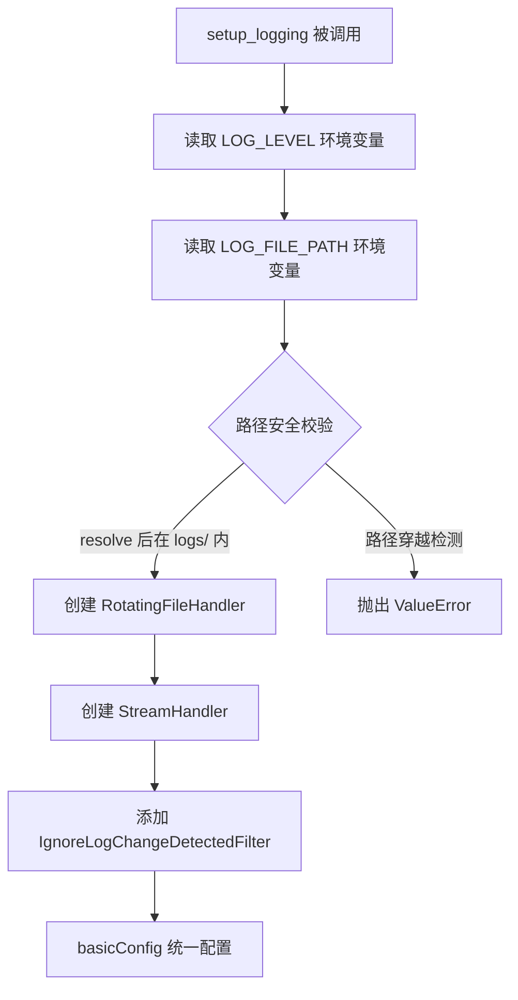
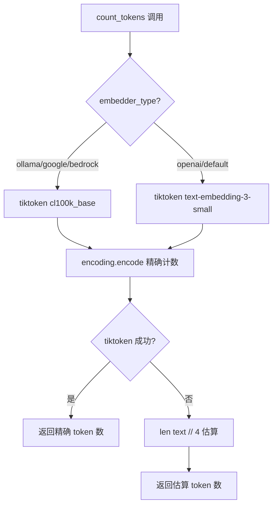

# PD-11.06 DeepWiki — 结构化日志与 RotatingFileHandler 可观测性

> 文档编号：PD-11.06
> 来源：DeepWiki `api/logging_config.py`, `api/config.py`, `api/rag.py`
> GitHub：https://github.com/AsyncFuncAI/deepwiki-open.git
> 问题域：PD-11 可观测性 Observability & Cost Tracking
> 状态：可复用方案

---

## 第 1 章 问题与动机

### 1.1 核心问题

RAG 服务在生产环境中面临三类可观测性挑战：

1. **日志管理**：多模块并发写日志时，日志文件无限增长导致磁盘耗尽；开发环境的文件变更检测日志淹没有效信息
2. **Token 计量**：多 LLM 提供商（Google、OpenAI、OpenRouter、Ollama、Bedrock、Azure、Dashscope）的 token 计数方式不统一，需要统一的计量入口
3. **请求级可观测**：WebSocket 长连接 + 流式响应场景下，需要追踪每个请求的 token 消耗、RAG 检索结果数量、embedding 验证状态

DeepWiki 作为一个将 Git 仓库转化为交互式 Wiki 的 RAG 应用，其可观测性方案的特点是：**轻量级、零外部依赖、环境变量驱动**。不引入 OTel/Prometheus 等重型框架，而是用 Python 标准库 `logging` + `RotatingFileHandler` 覆盖核心需求。

### 1.2 DeepWiki 的解法概述

1. **集中式日志配置**：`api/logging_config.py:12` 提供 `setup_logging()` 函数，所有模块统一调用，确保日志格式、级别、轮转策略一致
2. **路径安全校验**：`api/logging_config.py:39-42` 使用 `Path.resolve()` + 前缀检查防止 `LOG_FILE_PATH` 环境变量被利用进行目录穿越攻击
3. **噪音过滤器**：`api/logging_config.py:7-9` 自定义 `IgnoreLogChangeDetectedFilter` 过滤 watchfiles 的高频文件变更日志
4. **Token 双轨计数**：`api/data_pipeline.py:27-70` 使用 tiktoken 精确计数为主、字符数 ÷ 4 估算为回退
5. **健康端点**：`api/api.py:540-547` 提供 `/health` 端点返回服务状态和时间戳，适配 Docker 健康检查

### 1.3 设计思想

| 设计原则 | 具体实现 | 理由 | 替代方案 |
|----------|----------|------|----------|
| 零外部依赖 | 仅用 Python logging 标准库 | 降低部署复杂度，适合开源自部署场景 | OTel SDK + Grafana |
| 环境变量驱动 | LOG_LEVEL/LOG_FILE_PATH/LOG_MAX_SIZE/LOG_BACKUP_COUNT | 容器化部署时无需修改代码 | 配置文件 YAML/TOML |
| 防御性日志路径 | resolve() + startswith() 校验 | 防止恶意 LOG_FILE_PATH 写入系统目录 | chroot 隔离 |
| 噪音过滤 | 自定义 Filter 类过滤特定消息 | 开发模式下 watchfiles 每秒产生大量变更日志 | 调整 watchfiles 日志级别 |
| Token 降级计数 | tiktoken 失败时回退到字符估算 | 保证任何环境下都能返回 token 数 | 仅依赖 API 返回值 |

---

## 第 2 章 源码实现分析

### 2.1 架构概览

DeepWiki 的可观测性架构分为三层：日志基础设施层、请求追踪层、健康检查层。

```
┌─────────────────────────────────────────────────────────┐
│                    FastAPI Application                    │
│  ┌──────────┐  ┌──────────────┐  ┌───────────────────┐  │
│  │ api.py   │  │ websocket_   │  │ simple_chat.py    │  │
│  │ /health  │  │ wiki.py      │  │ /chat/completions │  │
│  │ /export  │  │ WebSocket    │  │ /stream           │  │
│  └────┬─────┘  └──────┬───────┘  └────────┬──────────┘  │
│       │               │                    │             │
│       └───────────────┼────────────────────┘             │
│                       ▼                                  │
│  ┌─────────────────────────────────────────────────┐     │
│  │         logging.getLogger(__name__)              │     │
│  │  logger.info / .warning / .error / .debug        │     │
│  └──────────────────────┬──────────────────────────┘     │
│                         ▼                                │
│  ┌─────────────────────────────────────────────────┐     │
│  │          logging_config.setup_logging()           │     │
│  │  ┌──────────────────┐  ┌─────────────────────┐  │     │
│  │  │ RotatingFile     │  │ StreamHandler        │  │     │
│  │  │ Handler          │  │ (console)            │  │     │
│  │  │ 10MB/5 backups   │  │                      │  │     │
│  │  └────────┬─────────┘  └──────────┬──────────┘  │     │
│  │           │  IgnoreLogChange       │             │     │
│  │           │  DetectedFilter        │             │     │
│  └───────────┼────────────────────────┼─────────────┘     │
│              ▼                        ▼                   │
│     logs/application.log          stdout/stderr           │
└─────────────────────────────────────────────────────────┘
```

### 2.2 核心实现

#### 2.2.1 集中式日志配置与路径安全



对应源码 `api/logging_config.py:12-85`：

```python
class IgnoreLogChangeDetectedFilter(logging.Filter):
    def filter(self, record: logging.LogRecord):
        return "Detected file change in" not in record.getMessage()


def setup_logging(format: str = None):
    base_dir = Path(__file__).parent
    log_dir = base_dir / "logs"
    log_dir.mkdir(parents=True, exist_ok=True)
    default_log_file = log_dir / "application.log"

    log_level_str = os.environ.get("LOG_LEVEL", "INFO").upper()
    log_level = getattr(logging, log_level_str, logging.INFO)

    log_file_path = Path(os.environ.get("LOG_FILE_PATH", str(default_log_file)))

    # 路径安全校验：防止目录穿越
    log_dir_resolved = log_dir.resolve()
    resolved_path = log_file_path.resolve()
    if not str(resolved_path).startswith(str(log_dir_resolved) + os.sep):
        raise ValueError(
            f"LOG_FILE_PATH '{log_file_path}' is outside the trusted log directory"
        )

    # 日志轮转配置
    try:
        max_mb = int(os.environ.get("LOG_MAX_SIZE", 10))
        max_bytes = max_mb * 1024 * 1024
    except (TypeError, ValueError):
        max_bytes = 10 * 1024 * 1024

    try:
        backup_count = int(os.environ.get("LOG_BACKUP_COUNT", 5))
    except ValueError:
        backup_count = 5

    log_format = format or (
        "%(asctime)s - %(levelname)s - %(name)s - "
        "%(filename)s:%(lineno)d - %(message)s"
    )

    file_handler = RotatingFileHandler(
        resolved_path, maxBytes=max_bytes,
        backupCount=backup_count, encoding="utf-8"
    )
    console_handler = logging.StreamHandler()

    formatter = logging.Formatter(log_format)
    file_handler.setFormatter(formatter)
    console_handler.setFormatter(formatter)

    file_handler.addFilter(IgnoreLogChangeDetectedFilter())
    console_handler.addFilter(IgnoreLogChangeDetectedFilter())

    logging.basicConfig(
        level=log_level,
        handlers=[file_handler, console_handler],
        force=True
    )
```

关键设计点：
- `force=True` 参数确保多次调用 `setup_logging()` 时覆盖而非追加 handler（`api/logging_config.py:77`）
- 日志格式包含 `%(filename)s:%(lineno)d`，生产环境可直接定位代码行（`api/logging_config.py:61`）
- 环境变量解析失败时均有 fallback 默认值（`api/logging_config.py:48-58`）

#### 2.2.2 Token 双轨计数



对应源码 `api/data_pipeline.py:27-70`：

```python
def count_tokens(text: str, embedder_type: str = None,
                 is_ollama_embedder: bool = None) -> int:
    try:
        if embedder_type is None and is_ollama_embedder is not None:
            embedder_type = 'ollama' if is_ollama_embedder else None

        if embedder_type is None:
            from api.config import get_embedder_type
            embedder_type = get_embedder_type()

        if embedder_type == 'ollama':
            encoding = tiktoken.get_encoding("cl100k_base")
        elif embedder_type == 'google':
            encoding = tiktoken.get_encoding("cl100k_base")
        elif embedder_type == 'bedrock':
            encoding = tiktoken.get_encoding("cl100k_base")
        else:
            encoding = tiktoken.encoding_for_model("text-embedding-3-small")

        return len(encoding.encode(text))
    except Exception as e:
        logger.warning(f"Error counting tokens with tiktoken: {e}")
        return len(text) // 4
```


### 2.3 实现细节

#### 多模块统一日志初始化

DeepWiki 的 7 个入口模块均在文件顶部调用 `setup_logging()`：

| 模块 | 文件:行 | 角色 |
|------|---------|------|
| main.py | `api/main.py:12` | Uvicorn 启动入口 |
| api.py | `api/api.py:16` | FastAPI 主应用 |
| websocket_wiki.py | `api/websocket_wiki.py:31` | WebSocket 处理 |
| simple_chat.py | `api/simple_chat.py:32` | HTTP 流式聊天 |
| bedrock_client.py | `api/bedrock_client.py:17` | AWS Bedrock 客户端 |
| dashscope_client.py | `api/dashscope_client.py:65` | 阿里云 Dashscope 客户端 |
| ollama_patch.py | `api/ollama_patch.py:14` | Ollama 适配层 |

`setup_logging()` 使用 `force=True` 参数，确保后调用的模块不会重复添加 handler。这是一个关键设计——Python logging 的 `basicConfig` 默认只在首次调用时生效，`force=True` 使其每次都重新配置。

#### 请求级 Token 追踪

在 `api/websocket_wiki.py:80-84` 和 `api/simple_chat.py:85-89`，每个请求都会记录 token 数量：

```python
tokens = count_tokens(last_message.content, request.provider == "ollama")
logger.info(f"Request size: {tokens} tokens")
if tokens > 8000:
    logger.warning(f"Request exceeds recommended token limit ({tokens} > 7500)")
    input_too_large = True
```

这实现了请求级的 token 可观测：每个请求的 token 消耗都被记录到日志中，超限时升级为 WARNING 级别。

#### Embedding 验证日志

`api/rag.py:251-343` 的 `_validate_and_filter_embeddings` 方法提供了详细的 embedding 质量日志：

- 统计各 embedding 尺寸的文档数量（`api/rag.py:289`）
- 记录目标 embedding 尺寸和匹配文档数（`api/rag.py:301`）
- 逐个记录被过滤文档的文件路径和尺寸不匹配原因（`api/rag.py:328`）
- 最终汇总有效/总文档比例（`api/rag.py:335`）

#### 健康检查端点

`api/api.py:540-547` 提供了一个简洁的健康检查端点：

```python
@app.get("/health")
async def health_check():
    """Health check endpoint for Docker and monitoring"""
    return {
        "status": "healthy",
        "timestamp": datetime.now().isoformat(),
        "service": "deepwiki-api"
    }
```

#### 开发模式日志隔离

`api/main.py:23-42` 在开发模式下 monkey-patch watchfiles，排除 `logs/` 目录避免日志文件变更触发热重载的无限循环：

```python
is_development = os.environ.get("NODE_ENV") != "production"
if is_development:
    import watchfiles
    current_dir = os.path.dirname(os.path.abspath(__file__))
    logs_dir = os.path.join(current_dir, "logs")

    original_watch = watchfiles.watch
    def patched_watch(*args, **kwargs):
        api_subdirs = []
        for item in os.listdir(current_dir):
            item_path = os.path.join(current_dir, item)
            if os.path.isdir(item_path) and item != "logs":
                api_subdirs.append(item_path)
            elif os.path.isfile(item_path) and item.endswith(".py"):
                api_subdirs.append(item_path)
        return original_watch(*api_subdirs, **kwargs)
    watchfiles.watch = patched_watch
```

---

## 第 3 章 迁移指南

### 3.1 迁移清单

**阶段 1：日志基础设施（必选）**

- [ ] 创建 `logging_config.py`，实现 `setup_logging()` 函数
- [ ] 配置 `RotatingFileHandler`（建议 10MB/5 备份）
- [ ] 添加路径安全校验（`resolve()` + `startswith()`）
- [ ] 在所有入口模块顶部调用 `setup_logging()`
- [ ] 设置环境变量：`LOG_LEVEL`, `LOG_FILE_PATH`, `LOG_MAX_SIZE`, `LOG_BACKUP_COUNT`

**阶段 2：噪音过滤（推荐）**

- [ ] 识别项目中的高频噪音日志源（如 watchfiles、healthcheck 探针）
- [ ] 为每种噪音创建自定义 `logging.Filter` 子类
- [ ] 将 Filter 添加到 file_handler 和 console_handler

**阶段 3：请求级追踪（推荐）**

- [ ] 在请求入口处记录 token 数量
- [ ] 设置 token 阈值告警（如 > 8000 tokens 记录 WARNING）
- [ ] 在 RAG 检索后记录检索文档数量

**阶段 4：健康检查（推荐）**

- [ ] 添加 `/health` 端点返回服务状态
- [ ] 在 Docker Compose / K8s 中配置 healthcheck 指向该端点

### 3.2 适配代码模板

以下是一个可直接复用的日志配置模块：

```python
"""logging_config.py — 可复用的日志配置模块"""
import logging
import os
from pathlib import Path
from logging.handlers import RotatingFileHandler
from typing import Optional, List


class MessageFilter(logging.Filter):
    """过滤包含指定关键词的日志消息"""
    def __init__(self, keywords: List[str]):
        super().__init__()
        self.keywords = keywords

    def filter(self, record: logging.LogRecord) -> bool:
        msg = record.getMessage()
        return not any(kw in msg for kw in self.keywords)


def setup_logging(
    app_name: str = "app",
    base_dir: Optional[Path] = None,
    noise_keywords: Optional[List[str]] = None,
):
    """
    配置结构化日志，支持环境变量覆盖。

    环境变量:
        LOG_LEVEL: 日志级别 (default: INFO)
        LOG_FILE_PATH: 日志文件路径 (default: {base_dir}/logs/{app_name}.log)
        LOG_MAX_SIZE: 单文件最大 MB (default: 10)
        LOG_BACKUP_COUNT: 保留备份数 (default: 5)
    """
    if base_dir is None:
        base_dir = Path(__file__).parent

    log_dir = base_dir / "logs"
    log_dir.mkdir(parents=True, exist_ok=True)

    # 日志级别
    level_str = os.environ.get("LOG_LEVEL", "INFO").upper()
    level = getattr(logging, level_str, logging.INFO)

    # 日志文件路径 + 安全校验
    default_path = log_dir / f"{app_name}.log"
    file_path = Path(os.environ.get("LOG_FILE_PATH", str(default_path)))
    resolved = file_path.resolve()
    if not str(resolved).startswith(str(log_dir.resolve()) + os.sep):
        raise ValueError(f"LOG_FILE_PATH outside trusted directory: {file_path}")
    resolved.parent.mkdir(parents=True, exist_ok=True)

    # 轮转参数
    max_bytes = int(os.environ.get("LOG_MAX_SIZE", 10)) * 1024 * 1024
    backup_count = int(os.environ.get("LOG_BACKUP_COUNT", 5))

    # 格式
    fmt = "%(asctime)s - %(levelname)s - %(name)s - %(filename)s:%(lineno)d - %(message)s"
    formatter = logging.Formatter(fmt)

    # Handler
    fh = RotatingFileHandler(resolved, maxBytes=max_bytes,
                             backupCount=backup_count, encoding="utf-8")
    ch = logging.StreamHandler()
    fh.setFormatter(formatter)
    ch.setFormatter(formatter)

    # 噪音过滤
    if noise_keywords:
        noise_filter = MessageFilter(noise_keywords)
        fh.addFilter(noise_filter)
        ch.addFilter(noise_filter)

    logging.basicConfig(level=level, handlers=[fh, ch], force=True)
```

### 3.3 适用场景

| 场景 | 适用度 | 说明 |
|------|--------|------|
| 开源自部署 RAG 应用 | ⭐⭐⭐ | 零外部依赖，环境变量驱动，完美适配 |
| 容器化微服务 | ⭐⭐⭐ | RotatingFileHandler + 环境变量 = 容器友好 |
| 需要精确成本追踪的 SaaS | ⭐ | 缺少按用户/按模型的成本归属，需额外开发 |
| 多 Worker 高并发部署 | ⭐⭐ | RotatingFileHandler 非进程安全，需改用 QueueHandler |
| 需要分布式追踪的系统 | ⭐ | 无 trace_id/span_id，无法跨服务关联 |

---

## 第 4 章 测试用例

```python
import logging
import os
import tempfile
from pathlib import Path
from unittest.mock import patch
import pytest


class TestSetupLogging:
    """测试日志配置模块"""

    def test_default_log_level_is_info(self, tmp_path):
        """默认日志级别应为 INFO"""
        from logging_config import setup_logging
        with patch.dict(os.environ, {}, clear=True):
            setup_logging(base_dir=tmp_path)
            root = logging.getLogger()
            assert root.level == logging.INFO

    def test_env_log_level_override(self, tmp_path):
        """LOG_LEVEL 环境变量应覆盖默认级别"""
        from logging_config import setup_logging
        with patch.dict(os.environ, {"LOG_LEVEL": "DEBUG"}):
            setup_logging(base_dir=tmp_path)
            root = logging.getLogger()
            assert root.level == logging.DEBUG

    def test_path_traversal_rejected(self, tmp_path):
        """路径穿越应被拒绝"""
        from logging_config import setup_logging
        with patch.dict(os.environ, {"LOG_FILE_PATH": "/etc/passwd"}):
            with pytest.raises(ValueError, match="outside trusted directory"):
                setup_logging(base_dir=tmp_path)

    def test_rotating_file_created(self, tmp_path):
        """日志文件应被创建"""
        from logging_config import setup_logging
        setup_logging(app_name="test", base_dir=tmp_path)
        log_file = tmp_path / "logs" / "test.log"
        logger = logging.getLogger("test_rotating")
        logger.info("test message")
        assert log_file.exists()

    def test_noise_filter_blocks_keywords(self, tmp_path):
        """噪音过滤器应阻止包含关键词的消息"""
        from logging_config import MessageFilter
        f = MessageFilter(["Detected file change in"])
        record = logging.LogRecord(
            name="test", level=logging.INFO, pathname="",
            lineno=0, msg="Detected file change in /foo/bar.py",
            args=(), exc_info=None
        )
        assert f.filter(record) is False

    def test_noise_filter_passes_normal(self, tmp_path):
        """噪音过滤器应放行正常消息"""
        from logging_config import MessageFilter
        f = MessageFilter(["Detected file change in"])
        record = logging.LogRecord(
            name="test", level=logging.INFO, pathname="",
            lineno=0, msg="Request size: 1500 tokens",
            args=(), exc_info=None
        )
        assert f.filter(record) is True


class TestCountTokens:
    """测试 Token 计数"""

    def test_openai_token_count(self):
        """OpenAI 编码应返回正整数"""
        from data_pipeline import count_tokens
        result = count_tokens("Hello, world!", embedder_type="openai")
        assert isinstance(result, int)
        assert result > 0

    def test_fallback_on_error(self):
        """tiktoken 失败时应回退到字符估算"""
        from data_pipeline import count_tokens
        with patch("tiktoken.get_encoding", side_effect=Exception("mock")):
            with patch("tiktoken.encoding_for_model", side_effect=Exception("mock")):
                result = count_tokens("Hello, world!", embedder_type="openai")
                assert result == len("Hello, world!") // 4

    def test_ollama_uses_cl100k(self):
        """Ollama 应使用 cl100k_base 编码"""
        import tiktoken
        from data_pipeline import count_tokens
        with patch("tiktoken.get_encoding") as mock_enc:
            mock_enc.return_value.encode.return_value = [1, 2, 3]
            result = count_tokens("test", embedder_type="ollama")
            mock_enc.assert_called_with("cl100k_base")
            assert result == 3
```


---

## 第 5 章 跨域关联

| 关联域 | 关系类型 | 说明 |
|--------|----------|------|
| PD-01 上下文管理 | 协同 | Token 计数（`count_tokens`）同时服务于可观测性（记录请求大小）和上下文管理（判断是否超限需要降级） |
| PD-03 容错与重试 | 协同 | Token 超限时的 fallback 重试（`websocket_wiki.py:720-900`）依赖日志记录降级过程，便于事后分析 |
| PD-04 工具系统 | 依赖 | 多 LLM 提供商客户端（OpenAI/Bedrock/Azure 等）的错误日志是可观测性的重要数据源 |
| PD-06 记忆持久化 | 协同 | `rag.py` 中 Memory 组件的操作日志（添加对话轮次成功/失败）提供记忆系统的可观测性 |
| PD-08 搜索与检索 | 协同 | Embedding 验证日志（`_validate_and_filter_embeddings`）是 RAG 检索质量的关键可观测指标 |

---

## 第 6 章 来源文件索引

| 文件 | 行范围 | 关键实现 |
|------|--------|----------|
| `api/logging_config.py` | L1-L85 | 完整日志配置：RotatingFileHandler + 路径安全 + 噪音过滤 |
| `api/config.py` | L69-L97 | 环境变量占位符替换 + 配置加载日志 |
| `api/data_pipeline.py` | L27-L70 | Token 双轨计数：tiktoken 精确 + 字符估算回退 |
| `api/rag.py` | L251-L343 | Embedding 验证与过滤日志 |
| `api/rag.py` | L59-L141 | Memory 组件操作日志（对话轮次管理） |
| `api/api.py` | L540-L547 | `/health` 健康检查端点 |
| `api/websocket_wiki.py` | L80-L84 | 请求级 token 计量与超限告警 |
| `api/websocket_wiki.py` | L719-L900 | Token 超限 fallback 重试日志链 |
| `api/main.py` | L12-L17 | 启动入口日志配置 + watchfiles 日志级别调整 |
| `api/main.py` | L23-L42 | 开发模式 watchfiles monkey-patch 排除 logs/ |
| `api/ollama_patch.py` | L71-L105 | Ollama embedding 处理进度日志 |

---

## 第 7 章 横向对比维度

> **重要：** 本章用于自动填充 Butcher Wiki 的横向对比表。
> 必须严格按以下 JSON 格式输出，放在 `comparison_data` 代码块中。

```json comparison_data
{
  "project": "DeepWiki",
  "dimensions": {
    "追踪方式": "Python logging 标准库，无分布式追踪",
    "数据粒度": "请求级 token 数 + embedding 验证统计",
    "持久化": "RotatingFileHandler 本地文件轮转",
    "多提供商": "7 家 LLM 提供商统一 logger 接口",
    "日志格式": "asctime-level-name-file:line-message 半结构化",
    "日志级别": "环境变量 LOG_LEVEL 动态配置",
    "日志噪声过滤": "自定义 Filter 类按消息内容过滤",
    "健康端点": "/health 返回 status+timestamp+service",
    "成本追踪": "仅 token 计数，无价格计算",
    "Worker日志隔离": "无隔离，RotatingFileHandler 非进程安全",
    "安全审计": "LOG_FILE_PATH 路径穿越防护",
    "零开销路径": "标准库零额外依赖，无 SDK 初始化开销",
    "进程级监控": "无进程级监控，仅应用级日志"
  }
}
```

### 域元数据补充

```json domain_metadata
{
  "solution_summary": "DeepWiki 用 Python logging + RotatingFileHandler 实现零依赖结构化日志，配合路径穿越防护和 watchfiles 噪音过滤，tiktoken 双轨 token 计数覆盖 7 家 LLM 提供商",
  "description": "开源自部署场景下零外部依赖的轻量级可观测性方案",
  "sub_problems": [
    "日志文件触发热重载循环：日志写入触发 watchfiles 检测导致无限重启",
    "多模块重复初始化 logging：多个入口模块各自调用 basicConfig 导致 handler 重复",
    "Embedding 尺寸不一致诊断：混合提供商时 embedding 维度不匹配需要详细日志定位"
  ],
  "best_practices": [
    "setup_logging 使用 force=True 防止多模块重复添加 handler",
    "日志路径用 Path.resolve() + startswith() 防目录穿越",
    "开发模式 monkey-patch watchfiles 排除 logs/ 目录避免热重载循环"
  ]
}
```
