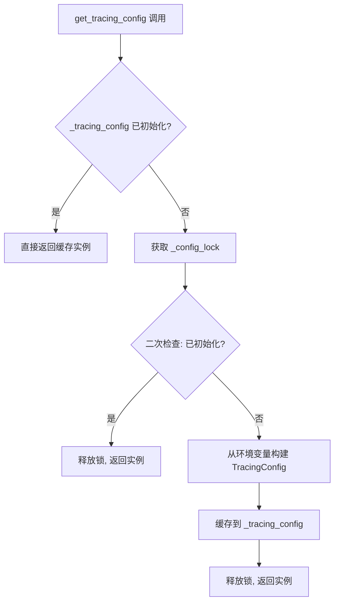
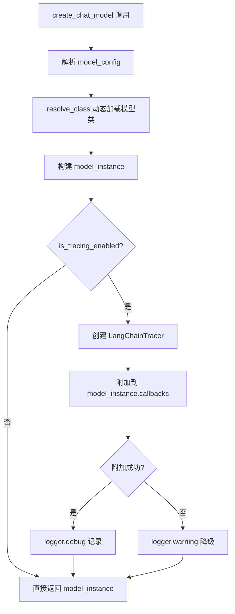
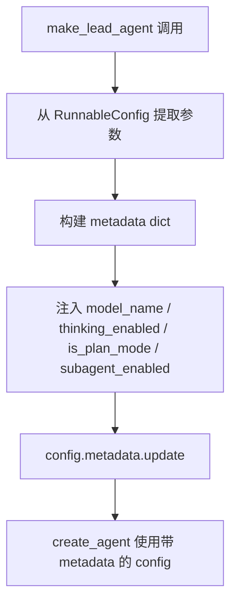

# PD-11.02 DeerFlow — LangSmith 追踪与 Token 预算守卫方案

> 文档编号：PD-11.02
> 来源：DeerFlow `backend/src/config/tracing_config.py`, `backend/src/models/factory.py`, `backend/src/agents/lead_agent/agent.py`
> GitHub：https://github.com/bytedance/deer-flow
> 问题域：PD-11 可观测性 Observability & Cost Tracking
> 状态：可复用方案

---

## 第 1 章 问题与动机（≥ 30 行）

### 1.1 核心问题

Agent 系统在生产环境中面临三个可观测性挑战：

1. **调用链不透明**：多轮对话 + 工具调用 + 子 Agent 委托形成复杂调用链，出问题时无法定位瓶颈
2. **Token 消耗不可控**：长对话场景下 token 累积增长，单次请求可能因上下文膨胀导致成本飙升
3. **子 Agent 执行黑盒**：并行子 Agent 的执行状态、耗时、成功率缺乏统一追踪手段

DeerFlow 的可观测性方案围绕两个核心能力展开：**LangSmith 分布式追踪**（外部可视化）和 **Token 预算守卫**（内部成本控制）。

### 1.2 DeerFlow 的解法概述

1. **TracingConfig 单例** — 线程安全的双重检查锁定模式，从环境变量读取 LangSmith 配置（`backend/src/config/tracing_config.py:26-43`）
2. **Model Factory 自动注入 Tracer** — 每个 `create_chat_model()` 调用自动附加 `LangChainTracer` 回调，无需业务代码感知（`backend/src/models/factory.py:43-57`）
3. **Run Metadata 标签** — `make_lead_agent` 在 RunnableConfig 中注入 `model_name`、`thinking_enabled`、`is_plan_mode` 等元数据，用于 LangSmith 中按维度筛选 trace（`backend/src/agents/lead_agent/agent.py:249-257`）
4. **SummarizationMiddleware Token 预算** — 当 token 累积达到阈值（默认 15564）时自动触发对话摘要压缩，保留最近 N 条消息（`config.example.yaml:228-268`）
5. **SubagentResult 分布式追踪** — 每个子 Agent 执行携带 `trace_id`，关联父子调用链，记录 5 态生命周期（`backend/src/subagents/executor.py:36-57`）

### 1.3 设计思想

| 设计原则 | 具体实现 | 理由 | 替代方案 |
|----------|----------|------|----------|
| 零侵入追踪 | Model Factory 层自动附加 Tracer 回调 | 业务代码无需修改，所有模型调用自动被追踪 | 手动在每个 Agent 中注入 Tracer（侵入性强） |
| 环境变量驱动 | TracingConfig 从 `LANGSMITH_*` 环境变量读取 | 开发/生产环境通过环境变量切换，无需改代码 | 配置文件硬编码（不灵活） |
| 预算守卫而非精确计量 | SummarizationMiddleware 按 token 阈值触发压缩 | 防止上下文膨胀导致的成本失控，比精确计费更实用 | 精确 token 计费系统（复杂度高） |
| 父子 trace 关联 | SubagentResult.trace_id 贯穿执行链 | 多 Agent 场景下可追踪完整调用链 | 独立日志无关联（难以排查） |
| 优雅降级 | Tracer 附加失败仅 warning 不阻断 | 追踪是辅助能力，不应影响核心功能 | 追踪失败抛异常（影响可用性） |

---

## 第 2 章 源码实现分析（≥ 60 行，核心章节）

### 2.1 架构概览

DeerFlow 的可观测性分为三层：配置层、注入层、执行追踪层。

```
┌─────────────────────────────────────────────────────────┐
│                    LangSmith Cloud                       │
│  (Trace 可视化 / Run 筛选 / 成本统计)                      │
└──────────────────────┬──────────────────────────────────┘
                       │ HTTPS (api.smith.langchain.com)
┌──────────────────────┴──────────────────────────────────┐
│                   注入层 (Model Factory)                  │
│  create_chat_model() → 自动附加 LangChainTracer 回调      │
│  make_lead_agent()   → 注入 run metadata 标签            │
└──────────┬───────────────────────────┬──────────────────┘
           │                           │
┌──────────┴──────────┐  ┌─────────────┴─────────────────┐
│   配置层             │  │   执行追踪层                    │
│  TracingConfig       │  │  SubagentResult (trace_id)    │
│  (环境变量单例)       │  │  SubagentStatus (5态生命周期)  │
│  SummarizationConfig │  │  MemoryUpdateQueue (队列监控)  │
│  (token 预算阈值)    │  │  SubagentLimitMiddleware      │
└─────────────────────┘  └───────────────────────────────┘
```

### 2.2 核心实现

#### 2.2.1 TracingConfig — 线程安全配置单例



对应源码 `backend/src/config/tracing_config.py:9-51`：

```python
class TracingConfig(BaseModel):
    """Configuration for LangSmith tracing."""
    enabled: bool = Field(...)
    api_key: str | None = Field(...)
    project: str = Field(...)
    endpoint: str = Field(...)

    @property
    def is_configured(self) -> bool:
        """Check if tracing is fully configured (enabled and has API key)."""
        return self.enabled and bool(self.api_key)

_tracing_config: TracingConfig | None = None

def get_tracing_config() -> TracingConfig:
    global _tracing_config
    if _tracing_config is not None:
        return _tracing_config
    with _config_lock:
        if _tracing_config is not None:  # Double-check after acquiring lock
            return _tracing_config
        _tracing_config = TracingConfig(
            enabled=os.environ.get("LANGSMITH_TRACING", "").lower() == "true",
            api_key=os.environ.get("LANGSMITH_API_KEY"),
            project=os.environ.get("LANGSMITH_PROJECT", "deer-flow"),
            endpoint=os.environ.get("LANGSMITH_ENDPOINT", "https://api.smith.langchain.com"),
        )
        return _tracing_config
```

关键设计点：
- **双重检查锁定**（`tracing_config.py:32-35`）：避免多线程竞争时重复初始化
- **Pydantic BaseModel**：类型安全 + 自动验证
- **`is_configured` 属性**（`tracing_config.py:18-20`）：同时检查 enabled 和 api_key，防止配置不完整时启用追踪

#### 2.2.2 Model Factory — 零侵入 Tracer 注入



对应源码 `backend/src/models/factory.py:9-58`：

```python
def create_chat_model(name: str | None = None, thinking_enabled: bool = False, **kwargs) -> BaseChatModel:
    config = get_app_config()
    if name is None:
        name = config.models[0].name
    model_config = config.get_model_config(name)
    if model_config is None:
        raise ValueError(f"Model {name} not found in config") from None
    model_class = resolve_class(model_config.use, BaseChatModel)
    model_settings_from_config = model_config.model_dump(
        exclude_none=True,
        exclude={"use", "name", "display_name", "description",
                 "supports_thinking", "when_thinking_enabled", "supports_vision"},
    )
    if thinking_enabled and model_config.when_thinking_enabled is not None:
        if not model_config.supports_thinking:
            raise ValueError(f"Model {name} does not support thinking.")
        model_settings_from_config.update(model_config.when_thinking_enabled)
    model_instance = model_class(**kwargs, **model_settings_from_config)

    if is_tracing_enabled():
        try:
            from langchain_core.tracers.langchain import LangChainTracer
            tracing_config = get_tracing_config()
            tracer = LangChainTracer(project_name=tracing_config.project)
            existing_callbacks = model_instance.callbacks or []
            model_instance.callbacks = [*existing_callbacks, tracer]
            logger.debug(f"LangSmith tracing attached to model '{name}' (project='{tracing_config.project}')")
        except Exception as e:
            logger.warning(f"Failed to attach LangSmith tracing to model '{name}': {e}")
    return model_instance
```

关键设计点：
- **延迟导入**（`factory.py:45`）：`LangChainTracer` 仅在追踪启用时导入，避免未安装 langsmith 时报错
- **回调追加而非覆盖**（`factory.py:51-52`）：保留已有 callbacks，追加 tracer
- **try/except 降级**（`factory.py:44-57`）：追踪附加失败不影响模型创建

#### 2.2.3 Run Metadata 注入



对应源码 `backend/src/agents/lead_agent/agent.py:238-265`：

```python
def make_lead_agent(config: RunnableConfig):
    thinking_enabled = config.get("configurable", {}).get("thinking_enabled", True)
    model_name = config.get("configurable", {}).get("model_name") or config.get("configurable", {}).get("model")
    is_plan_mode = config.get("configurable", {}).get("is_plan_mode", False)
    subagent_enabled = config.get("configurable", {}).get("subagent_enabled", False)

    # Inject run metadata for LangSmith trace tagging
    if "metadata" not in config:
        config["metadata"] = {}
    config["metadata"].update({
        "model_name": model_name or "default",
        "thinking_enabled": thinking_enabled,
        "is_plan_mode": is_plan_mode,
        "subagent_enabled": subagent_enabled,
    })

    return create_agent(
        model=create_chat_model(name=model_name, thinking_enabled=thinking_enabled),
        tools=get_available_tools(model_name=model_name, subagent_enabled=subagent_enabled),
        middleware=_build_middlewares(config),
        system_prompt=apply_prompt_template(...),
        state_schema=ThreadState,
    )
```

这些 metadata 在 LangSmith 中作为 run tags 出现，支持按 `model_name`、`thinking_enabled` 等维度筛选和聚合 trace。

### 2.3 实现细节

#### 2.3.1 SubagentResult 分布式追踪

子 Agent 执行器通过 `trace_id` 实现父子调用链关联（`backend/src/subagents/executor.py:36-57`）：

```python
@dataclass
class SubagentResult:
    task_id: str
    trace_id: str          # 分布式追踪 ID，关联父子 Agent
    status: SubagentStatus  # PENDING → RUNNING → COMPLETED/FAILED/TIMED_OUT
    result: str | None = None
    error: str | None = None
    started_at: datetime | None = None
    completed_at: datetime | None = None
    ai_messages: list[dict[str, Any]] | None = None
```

执行器日志格式统一使用 `[trace={trace_id}]` 前缀（`executor.py:161, 243, 270, 272, 280`），便于日志聚合：

```python
logger.info(f"[trace={self.trace_id}] SubagentExecutor initialized: {config.name} with {len(self.tools)} tools")
logger.info(f"[trace={self.trace_id}] Subagent {self.config.name} starting execution with max_turns={self.config.max_turns}")
logger.info(f"[trace={self.trace_id}] Subagent {self.config.name} captured AI message #{len(result.ai_messages)}")
```

#### 2.3.2 Token 预算守卫 — SummarizationConfig

`config.example.yaml:228-268` 定义了三种触发策略：

| 触发类型 | 示例值 | 含义 |
|----------|--------|------|
| `tokens` | 15564 | 累积 token 达到阈值时触发 |
| `messages` | 50 | 消息数达到阈值时触发 |
| `fraction` | 0.8 | 达到模型最大输入 token 的 80% 时触发 |

多个触发条件之间是 OR 逻辑——任一条件满足即触发摘要压缩。压缩后保留策略同样支持三种模式（`summarization_config.py:39-44`）。

#### 2.3.3 SubagentLimitMiddleware — 资源过载保护

`backend/src/agents/middlewares/subagent_limit_middleware.py:24-75` 在模型响应后截断多余的并行子 Agent 调用：

```python
class SubagentLimitMiddleware(AgentMiddleware[AgentState]):
    def __init__(self, max_concurrent: int = MAX_CONCURRENT_SUBAGENTS):
        self.max_concurrent = _clamp_subagent_limit(max_concurrent)  # 限制在 [2, 4]

    def after_model(self, state: AgentState, runtime: Runtime) -> dict | None:
        # 统计 task tool calls，超出 max_concurrent 的部分截断
        task_indices = [i for i, tc in enumerate(tool_calls) if tc.get("name") == "task"]
        if len(task_indices) <= self.max_concurrent:
            return None
        indices_to_drop = set(task_indices[self.max_concurrent:])
        logger.warning(f"Truncated {dropped_count} excess task tool call(s)")
```

#### 2.3.4 Gateway 健康检查

`backend/src/gateway/app.py:121-128` 提供 `/health` 端点：

```python
@app.get("/health", tags=["health"])
async def health_check() -> dict:
    return {"status": "healthy", "service": "deer-flow-gateway"}
```

#### 2.3.5 结构化日志配置

`backend/src/gateway/app.py:11-15` 配置全局日志格式：

```python
logging.basicConfig(
    level=logging.INFO,
    format="%(asctime)s - %(name)s - %(levelname)s - %(message)s",
    datefmt="%Y-%m-%d %H:%M:%S",
)
```

---

## 第 3 章 迁移指南（≥ 40 行）

### 3.1 迁移清单

**阶段 1：LangSmith 追踪集成（1-2 天）**

- [ ] 安装依赖：`pip install langsmith langchain-core`
- [ ] 创建 TracingConfig Pydantic 模型，从环境变量读取配置
- [ ] 在 Model Factory 中添加 Tracer 自动注入逻辑
- [ ] 设置环境变量：`LANGSMITH_TRACING=true`、`LANGSMITH_API_KEY`、`LANGSMITH_PROJECT`
- [ ] 验证 LangSmith Dashboard 中出现 trace 数据

**阶段 2：Run Metadata 标签（0.5 天）**

- [ ] 在 Agent 创建函数中注入 metadata（model_name、thinking_enabled 等）
- [ ] 在 LangSmith 中验证可按 metadata 筛选 trace

**阶段 3：Token 预算守卫（1-2 天）**

- [ ] 集成 SummarizationMiddleware 或实现等效的 token 阈值触发器
- [ ] 配置触发阈值和保留策略
- [ ] 测试长对话场景下的自动压缩行为

**阶段 4：子 Agent 追踪（1 天）**

- [ ] 为子 Agent 执行结果添加 trace_id 字段
- [ ] 统一日志格式为 `[trace={trace_id}]` 前缀
- [ ] 添加子 Agent 并发限制中间件

### 3.2 适配代码模板

#### 3.2.1 TracingConfig 模板（可直接复用）

```python
import os
import threading
from pydantic import BaseModel, Field

_config_lock = threading.Lock()
_tracing_config = None

class TracingConfig(BaseModel):
    """LangSmith 追踪配置，线程安全单例。"""
    enabled: bool = Field(...)
    api_key: str | None = Field(...)
    project: str = Field(...)
    endpoint: str = Field(default="https://api.smith.langchain.com")

    @property
    def is_configured(self) -> bool:
        return self.enabled and bool(self.api_key)

def get_tracing_config() -> TracingConfig:
    global _tracing_config
    if _tracing_config is not None:
        return _tracing_config
    with _config_lock:
        if _tracing_config is not None:
            return _tracing_config
        _tracing_config = TracingConfig(
            enabled=os.environ.get("LANGSMITH_TRACING", "").lower() == "true",
            api_key=os.environ.get("LANGSMITH_API_KEY"),
            project=os.environ.get("LANGSMITH_PROJECT", "my-project"),
            endpoint=os.environ.get("LANGSMITH_ENDPOINT", "https://api.smith.langchain.com"),
        )
        return _tracing_config

def is_tracing_enabled() -> bool:
    return get_tracing_config().is_configured
```

#### 3.2.2 Model Factory Tracer 注入模板

```python
from langchain.chat_models import BaseChatModel

def create_chat_model(name: str, **kwargs) -> BaseChatModel:
    model_instance = _build_model(name, **kwargs)  # 你的模型构建逻辑

    if is_tracing_enabled():
        try:
            from langchain_core.tracers.langchain import LangChainTracer
            tracer = LangChainTracer(project_name=get_tracing_config().project)
            existing = model_instance.callbacks or []
            model_instance.callbacks = [*existing, tracer]
        except Exception as e:
            import logging
            logging.warning(f"Tracer attach failed: {e}")

    return model_instance
```

#### 3.2.3 SubagentResult 追踪模板

```python
import uuid
from dataclasses import dataclass
from datetime import datetime
from enum import Enum

class TaskStatus(Enum):
    PENDING = "pending"
    RUNNING = "running"
    COMPLETED = "completed"
    FAILED = "failed"
    TIMED_OUT = "timed_out"

@dataclass
class TaskResult:
    task_id: str
    trace_id: str  # 父子关联
    status: TaskStatus
    result: str | None = None
    error: str | None = None
    started_at: datetime | None = None
    completed_at: datetime | None = None

    @staticmethod
    def create(parent_trace_id: str | None = None) -> "TaskResult":
        return TaskResult(
            task_id=str(uuid.uuid4())[:8],
            trace_id=parent_trace_id or str(uuid.uuid4())[:8],
            status=TaskStatus.PENDING,
        )
```

### 3.3 适用场景

| 场景 | 适用度 | 说明 |
|------|--------|------|
| LangChain/LangGraph 项目 | ⭐⭐⭐ | 原生支持 LangChainTracer，零改造 |
| 非 LangChain 的 Agent 框架 | ⭐⭐ | TracingConfig 可复用，Tracer 需替换为 OpenTelemetry 等 |
| 单 Agent 简单应用 | ⭐⭐ | 追踪有价值，但 SubagentResult 部分不需要 |
| 多 Agent 并行编排 | ⭐⭐⭐ | trace_id 关联 + 并发限制是核心价值 |
| 需要精确成本计费 | ⭐ | DeerFlow 方案侧重预算守卫，不做精确 token 计费 |

---

## 第 4 章 测试用例（≥ 20 行）

```python
import os
import threading
import pytest
from unittest.mock import MagicMock, patch

# ---- TracingConfig 测试 ----

class TestTracingConfig:
    def setup_method(self):
        """每个测试前重置单例。"""
        import src.config.tracing_config as tc
        tc._tracing_config = None

    def test_disabled_by_default(self):
        """未设置环境变量时追踪应禁用。"""
        with patch.dict(os.environ, {}, clear=True):
            from src.config.tracing_config import get_tracing_config
            config = get_tracing_config()
            assert config.enabled is False
            assert config.is_configured is False

    def test_enabled_with_api_key(self):
        """设置 LANGSMITH_TRACING=true 且有 API key 时应启用。"""
        env = {
            "LANGSMITH_TRACING": "true",
            "LANGSMITH_API_KEY": "lsv2_test_key",
            "LANGSMITH_PROJECT": "test-project",
        }
        with patch.dict(os.environ, env, clear=True):
            from src.config.tracing_config import get_tracing_config
            config = get_tracing_config()
            assert config.enabled is True
            assert config.is_configured is True
            assert config.project == "test-project"

    def test_enabled_without_api_key(self):
        """LANGSMITH_TRACING=true 但无 API key 时 is_configured 应为 False。"""
        env = {"LANGSMITH_TRACING": "true"}
        with patch.dict(os.environ, env, clear=True):
            from src.config.tracing_config import get_tracing_config
            config = get_tracing_config()
            assert config.enabled is True
            assert config.is_configured is False

    def test_thread_safety(self):
        """多线程并发调用应返回同一实例。"""
        env = {"LANGSMITH_TRACING": "true", "LANGSMITH_API_KEY": "key"}
        results = []
        with patch.dict(os.environ, env, clear=True):
            def get_config():
                from src.config.tracing_config import get_tracing_config
                results.append(id(get_tracing_config()))
            threads = [threading.Thread(target=get_config) for _ in range(10)]
            for t in threads:
                t.start()
            for t in threads:
                t.join()
            assert len(set(results)) == 1  # 所有线程拿到同一实例


# ---- Model Factory Tracer 注入测试 ----

class TestModelFactoryTracing:
    @patch("src.config.tracing_config.is_tracing_enabled", return_value=True)
    @patch("src.config.tracing_config.get_tracing_config")
    def test_tracer_attached_when_enabled(self, mock_config, mock_enabled):
        """追踪启用时应附加 LangChainTracer 回调。"""
        mock_config.return_value = MagicMock(project="test-proj")
        model = MagicMock()
        model.callbacks = None
        # 模拟 factory 逻辑
        from langchain_core.tracers.langchain import LangChainTracer
        tracer = LangChainTracer(project_name="test-proj")
        existing = model.callbacks or []
        model.callbacks = [*existing, tracer]
        assert len(model.callbacks) == 1
        assert isinstance(model.callbacks[0], LangChainTracer)

    @patch("src.config.tracing_config.is_tracing_enabled", return_value=False)
    def test_no_tracer_when_disabled(self, mock_enabled):
        """追踪禁用时不应附加回调。"""
        model = MagicMock()
        model.callbacks = None
        if not mock_enabled():
            pass  # 不附加
        assert model.callbacks is None


# ---- SubagentResult 追踪测试 ----

class TestSubagentTracing:
    def test_trace_id_propagation(self):
        """子 Agent 应继承父 trace_id。"""
        from src.subagents.executor import SubagentResult, SubagentStatus
        result = SubagentResult(
            task_id="task-001",
            trace_id="parent-trace-abc",
            status=SubagentStatus.PENDING,
        )
        assert result.trace_id == "parent-trace-abc"

    def test_status_lifecycle(self):
        """SubagentStatus 应包含 5 种状态。"""
        from src.subagents.executor import SubagentStatus
        statuses = [s.value for s in SubagentStatus]
        assert set(statuses) == {"pending", "running", "completed", "failed", "timed_out"}


# ---- SubagentLimitMiddleware 测试 ----

class TestSubagentLimitMiddleware:
    def test_clamp_to_valid_range(self):
        """并发限制应被钳制到 [2, 4] 范围。"""
        from src.agents.middlewares.subagent_limit_middleware import _clamp_subagent_limit
        assert _clamp_subagent_limit(1) == 2
        assert _clamp_subagent_limit(3) == 3
        assert _clamp_subagent_limit(10) == 4
```

---

## 第 5 章 跨域关联

| 关联域 | 关系类型 | 说明 |
|--------|----------|------|
| PD-01 上下文管理 | 协同 | SummarizationMiddleware 既是上下文压缩手段（PD-01），也是 token 预算守卫（PD-11），两域共享同一中间件 |
| PD-02 多 Agent 编排 | 依赖 | SubagentResult.trace_id 依赖编排层传递父 trace_id，SubagentLimitMiddleware 限制并发数 |
| PD-04 工具系统 | 协同 | Model Factory 的 Tracer 回调机制与工具系统的回调链共享同一 callbacks 列表 |
| PD-10 中间件管道 | 依赖 | SummarizationMiddleware 和 SubagentLimitMiddleware 都是中间件管道的一环，执行顺序影响可观测性 |
| PD-06 记忆持久化 | 协同 | MemoryUpdateQueue 的队列监控（pending_count、is_processing）提供记忆子系统的运行时可观测性 |

---

## 第 6 章 来源文件索引

| 文件 | 行范围 | 关键实现 |
|------|--------|----------|
| `backend/src/config/tracing_config.py` | L1-L51 | TracingConfig Pydantic 模型 + 双重检查锁定单例 |
| `backend/src/config/__init__.py` | L1-L16 | 导出 get_tracing_config / is_tracing_enabled |
| `backend/src/models/factory.py` | L9-L58 | create_chat_model + LangChainTracer 自动注入 |
| `backend/src/agents/lead_agent/agent.py` | L238-L265 | make_lead_agent + run metadata 注入 |
| `backend/src/agents/lead_agent/agent.py` | L20-L59 | SummarizationMiddleware 创建逻辑 |
| `backend/src/config/summarization_config.py` | L1-L75 | SummarizationConfig + ContextSize 触发策略 |
| `backend/src/subagents/executor.py` | L25-L57 | SubagentStatus 枚举 + SubagentResult 数据类 |
| `backend/src/subagents/executor.py` | L122-L323 | SubagentExecutor 执行引擎 + trace_id 日志 |
| `backend/src/agents/middlewares/subagent_limit_middleware.py` | L24-L75 | SubagentLimitMiddleware 并发截断 |
| `backend/src/gateway/app.py` | L11-L15 | 全局日志格式配置 |
| `backend/src/gateway/app.py` | L121-L128 | /health 健康检查端点 |
| `backend/src/agents/memory/queue.py` | L21-L161 | MemoryUpdateQueue 防抖队列 + 运行时监控属性 |
| `config.example.yaml` | L228-L268 | Summarization 触发阈值与保留策略配置 |

---

## 第 7 章 横向对比维度

```json comparison_data
{
  "project": "DeerFlow",
  "dimensions": {
    "追踪方式": "LangSmith LangChainTracer 回调，Model Factory 层自动注入",
    "数据粒度": "每次 LLM 调用 + run metadata 标签（model/thinking/plan_mode）",
    "持久化": "LangSmith Cloud 托管，本地无持久化",
    "多提供商": "仅 LangSmith，通过环境变量开关",
    "日志格式": "Python logging，格式 asctime-name-level-message",
    "指标采集": "无独立指标采集，依赖 LangSmith 内置统计",
    "可视化": "LangSmith Dashboard，支持按 metadata 筛选",
    "成本追踪": "Token 预算守卫（SummarizationMiddleware 阈值触发），非精确计费",
    "日志级别": "INFO 默认，Tracer 附加用 DEBUG，失败用 WARNING",
    "崩溃安全": "Tracer 附加失败 try/except 降级，不阻断核心流程",
    "延迟统计": "SubagentResult 记录 started_at/completed_at 时间戳",
    "卡死检测": "SubagentExecutor 超时机制 + SubagentLimitMiddleware 并发截断"
  }
}
```

### 域元数据补充

```json domain_metadata
{
  "solution_summary": "DeerFlow 在 Model Factory 层自动注入 LangChainTracer 实现零侵入 LangSmith 追踪，配合 SummarizationMiddleware token 阈值触发压缩作为预算守卫，SubagentResult.trace_id 关联父子调用链",
  "description": "追踪注入点的选择（Factory vs Agent vs Tool）决定了可观测性的覆盖范围和侵入程度",
  "sub_problems": [
    "Tracer 注入点选择：Factory 层 vs Agent 层 vs 手动注入，各有覆盖范围和灵活性权衡",
    "Run Metadata 标签设计：哪些维度值得作为 trace 标签，影响后续筛选和聚合效率",
    "Token 预算守卫 vs 精确计费：预算守卫防止成本失控但不提供精确账单，两者互补"
  ],
  "best_practices": [
    "在 Model Factory 层注入 Tracer：一处修改覆盖所有模型调用，零侵入业务代码",
    "Tracer 附加用 try/except 降级：追踪是辅助能力，失败不应阻断核心功能",
    "子 Agent 日志统一 [trace=xxx] 前缀：便于日志聚合工具按 trace_id 关联父子调用链",
    "并发子 Agent 数量硬限制 [2,4]：防止 LLM 生成过多并行调用导致资源耗尽"
  ]
}
```
