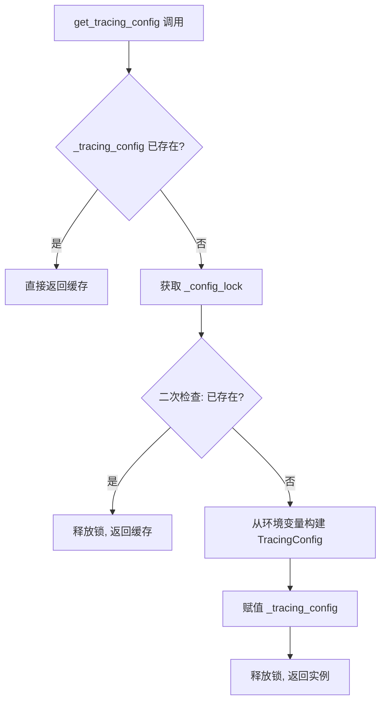
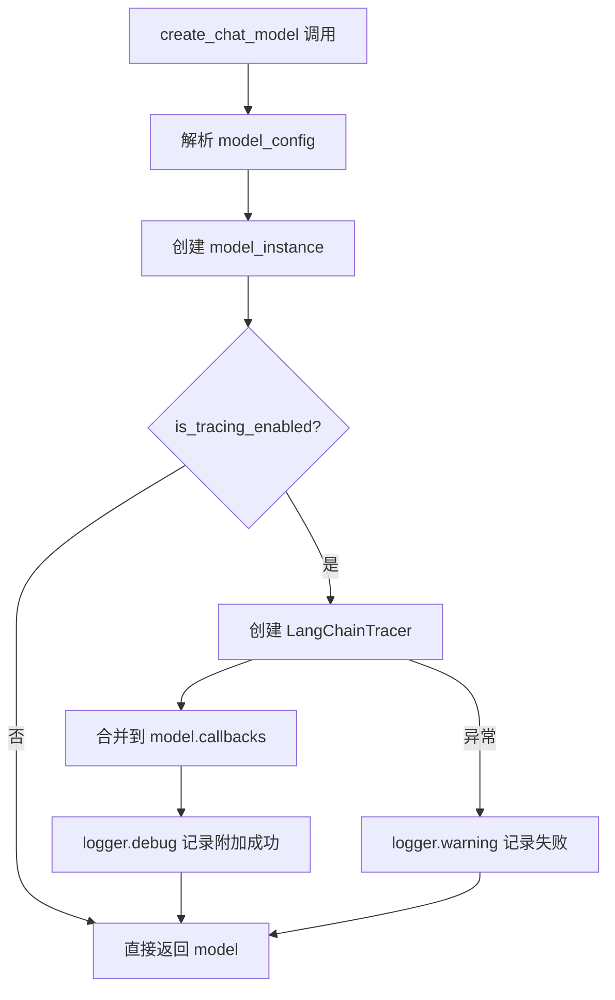

# PD-11.14 DeerFlow — LangSmith 追踪与分布式 TraceID 传播

> 文档编号：PD-11.14
> 来源：DeerFlow `backend/src/config/tracing_config.py`, `backend/src/models/factory.py`, `backend/src/agents/lead_agent/agent.py`
> GitHub：https://github.com/bytedance/deer-flow.git
> 问题域：PD-11 可观测性 Observability & Cost Tracking
> 状态：可复用方案

---

## 第 1 章 问题与动机

### 1.1 核心问题

多 Agent 系统中，一次用户请求可能触发 Lead Agent → 多个 Subagent 的级联调用，每个 Agent 内部又有多次 LLM 调用。如果没有统一的追踪体系，开发者面临三个困境：

1. **调用链不可见**：无法知道一次请求经过了哪些 Agent、调用了哪些模型、每步耗时多少
2. **元数据丢失**：模型名称、thinking 模式、plan 模式等运行时配置无法在追踪后端按维度筛选
3. **Subagent 追踪断裂**：父 Agent 和子 Agent 的日志分散在不同线程，无法关联到同一次请求

DeerFlow 2.0 需要一套轻量级追踪方案，在不引入重型 APM 基础设施的前提下，实现 LLM 调用链的端到端可观测。

### 1.2 DeerFlow 的解法概述

DeerFlow 采用 **LangSmith + 自定义 TraceID** 双轨追踪策略：

1. **TracingConfig 单例**：从环境变量加载 LangSmith 配置，线程安全的双重检查锁初始化（`tracing_config.py:26-43`）
2. **Factory 层 Tracer 注入**：在 `create_chat_model` 中自动附加 `LangChainTracer` 回调，所有模型实例自动获得追踪能力（`factory.py:43-57`）
3. **Run Metadata 标签注入**：`make_lead_agent` 向 RunnableConfig 注入 `model_name/thinking_enabled/is_plan_mode/subagent_enabled` 四维标签（`agent.py:249-257`）
4. **分布式 TraceID 传播**：Subagent 执行器生成或继承 `trace_id`，贯穿 executor → task_tool → 日志的全链路（`executor.py:152`, `task_tool.py:95`）
5. **结构化日志上下文**：所有 Subagent 相关日志统一使用 `[trace={trace_id}]` 前缀，便于日志聚合查询

### 1.3 设计思想

| 设计原则 | 具体实现 | 理由 | 替代方案 |
|----------|----------|------|----------|
| 零侵入注入 | Factory 层自动附加 Tracer 回调 | 业务代码无需感知追踪存在 | Agent 层手动注入（覆盖不全） |
| 环境变量驱动 | 4 个 `LANGSMITH_*` 环境变量控制开关 | 不同环境灵活切换，无需改代码 | 配置文件（需部署时同步） |
| 线程安全单例 | 双重检查锁 + threading.Lock | 多 Worker 并发安全 | 模块级全局变量（竞态风险） |
| 轻量级分布式追踪 | 8 字符 UUID 短 ID 作为 trace_id | 日志可读性好，足够区分并发请求 | OpenTelemetry（重型依赖） |
| 四维元数据标签 | model_name/thinking/plan/subagent | 覆盖 LangSmith 最常用的筛选维度 | 全量 config dump（噪声大） |

---

## 第 2 章 源码实现分析

### 2.1 架构概览

DeerFlow 的可观测性体系分为三层：配置层、注入层、传播层。

```
┌─────────────────────────────────────────────────────────┐
│                    用户请求                               │
└──────────────────────┬──────────────────────────────────┘
                       ▼
┌──────────────────────────────────────────────────────────┐
│  make_lead_agent (agent.py)                              │
│  ┌─────────────────────────────────────────────────┐     │
│  │ config["metadata"] = {                          │     │
│  │   model_name, thinking_enabled,                 │     │
│  │   is_plan_mode, subagent_enabled                │     │
│  │ }                                               │     │
│  └─────────────────────────────────────────────────┘     │
│                       │                                   │
│                       ▼                                   │
│  create_chat_model (factory.py)                          │
│  ┌─────────────────────────────────────────────────┐     │
│  │ if is_tracing_enabled():                        │     │
│  │   tracer = LangChainTracer(project=...)         │     │
│  │   model.callbacks = [...existing, tracer]       │     │
│  └─────────────────────────────────────────────────┘     │
│                       │                                   │
│                       ▼                                   │
│  TracingConfig (tracing_config.py)                       │
│  ┌─────────────────────────────────────────────────┐     │
│  │ LANGSMITH_TRACING=true                          │     │
│  │ LANGSMITH_API_KEY=lsv2_...                      │     │
│  │ LANGSMITH_PROJECT=deer-flow                     │     │
│  │ LANGSMITH_ENDPOINT=https://api.smith...         │     │
│  └─────────────────────────────────────────────────┘     │
└──────────────────────────────────────────────────────────┘
                       │
          ┌────────────┼────────────┐
          ▼            ▼            ▼
   ┌──────────┐ ┌──────────┐ ┌──────────┐
   │Subagent A│ │Subagent B│ │Subagent C│
   │trace=a1b2│ │trace=a1b2│ │trace=a1b2│
   └──────────┘ └──────────┘ └──────────┘
   (同一 trace_id 贯穿所有子 Agent)
```

### 2.2 核心实现

#### 2.2.1 TracingConfig 线程安全单例



对应源码 `backend/src/config/tracing_config.py:9-51`：

```python
class TracingConfig(BaseModel):
    """Configuration for LangSmith tracing."""
    enabled: bool = Field(...)
    api_key: str | None = Field(...)
    project: str = Field(...)
    endpoint: str = Field(...)

    @property
    def is_configured(self) -> bool:
        """Check if tracing is fully configured (enabled and has API key)."""
        return self.enabled and bool(self.api_key)

_tracing_config: TracingConfig | None = None
_config_lock = threading.Lock()

def get_tracing_config() -> TracingConfig:
    global _tracing_config
    if _tracing_config is not None:
        return _tracing_config
    with _config_lock:
        if _tracing_config is not None:  # Double-check after acquiring lock
            return _tracing_config
        _tracing_config = TracingConfig(
            enabled=os.environ.get("LANGSMITH_TRACING", "").lower() == "true",
            api_key=os.environ.get("LANGSMITH_API_KEY"),
            project=os.environ.get("LANGSMITH_PROJECT", "deer-flow"),
            endpoint=os.environ.get("LANGSMITH_ENDPOINT", "https://api.smith.langchain.com"),
        )
        return _tracing_config
```

关键设计点：
- **双重检查锁**（`tracing_config.py:32-35`）：避免多线程重复初始化
- **Pydantic BaseModel**：类型安全 + 自动验证
- **`is_configured` 属性**（`tracing_config.py:18-20`）：`enabled=true` 但无 API key 时不激活追踪，防止运行时报错

#### 2.2.2 Factory 层自动 Tracer 注入



对应源码 `backend/src/models/factory.py:43-58`：

```python
if is_tracing_enabled():
    try:
        from langchain_core.tracers.langchain import LangChainTracer

        tracing_config = get_tracing_config()
        tracer = LangChainTracer(
            project_name=tracing_config.project,
        )
        existing_callbacks = model_instance.callbacks or []
        model_instance.callbacks = [*existing_callbacks, tracer]
        logger.debug(
            f"LangSmith tracing attached to model '{name}' "
            f"(project='{tracing_config.project}')"
        )
    except Exception as e:
        logger.warning(f"Failed to attach LangSmith tracing to model '{name}': {e}")
```

关键设计点：
- **延迟导入**（`factory.py:45`）：`LangChainTracer` 仅在追踪启用时导入，避免未安装 langsmith 时报错
- **回调合并**（`factory.py:51-52`）：保留已有 callbacks，追加 tracer，不覆盖
- **静默降级**（`factory.py:56-57`）：追踪附加失败只 warning，不影响模型正常工作

#### 2.2.3 Run Metadata 四维标签注入

对应源码 `backend/src/agents/lead_agent/agent.py:249-257`：

```python
# Inject run metadata for LangSmith trace tagging
if "metadata" not in config:
    config["metadata"] = {}
config["metadata"].update({
    "model_name": model_name or "default",
    "thinking_enabled": thinking_enabled,
    "is_plan_mode": is_plan_mode,
    "subagent_enabled": subagent_enabled,
})
```

这四个维度在 LangSmith 中作为 run metadata 出现，支持按维度筛选和聚合分析。

### 2.3 实现细节：分布式 TraceID 传播

TraceID 的生命周期贯穿三个层次：

1. **生成**：`SubagentExecutor.__init__` 中生成或继承（`executor.py:152`）
   ```python
   self.trace_id = trace_id or str(uuid.uuid4())[:8]
   ```

2. **传播**：`task_tool` 从 runtime metadata 提取 trace_id 传给 executor（`task_tool.py:91-95`）
   ```python
   metadata = runtime.config.get("metadata", {})
   trace_id = metadata.get("trace_id") or str(uuid.uuid4())[:8]
   ```

3. **使用**：所有日志统一 `[trace=xxx]` 前缀（`executor.py:161,243,272` 等 12 处）
   ```python
   logger.info(f"[trace={self.trace_id}] SubagentExecutor initialized: {config.name}")
   logger.info(f"[trace={self.trace_id}] Subagent {self.config.name} completed execution")
   ```

`SubagentResult` 数据类中 `trace_id` 字段（`executor.py:42`）确保追踪 ID 随结果持久化，可用于事后关联分析。


---

## 第 3 章 迁移指南

### 3.1 迁移清单

**阶段 1：基础追踪（1 个文件）**
- [ ] 创建 `TracingConfig` Pydantic 模型，从环境变量加载 LangSmith 配置
- [ ] 实现线程安全单例 `get_tracing_config()` + `is_tracing_enabled()`
- [ ] 在 `.env.example` 中添加 4 个 `LANGSMITH_*` 变量说明

**阶段 2：Factory 注入（1 个文件）**
- [ ] 在模型工厂函数中添加 `is_tracing_enabled()` 检查
- [ ] 延迟导入 `LangChainTracer`，附加到 model callbacks
- [ ] 添加 try/except 静默降级

**阶段 3：元数据标签（1 个文件）**
- [ ] 在 Agent 创建入口注入 `config["metadata"]`
- [ ] 选择 3-5 个最有价值的筛选维度作为标签

**阶段 4：分布式 TraceID（2 个文件）**
- [ ] 在 Subagent 执行器中生成/继承 trace_id
- [ ] 在 Task Tool 中从 metadata 提取并传播 trace_id
- [ ] 统一日志格式 `[trace={id}]`

### 3.2 适配代码模板

以下模板可直接复用到任何 LangChain/LangGraph 项目：

```python
"""tracing_config.py — 可直接复用的追踪配置模块"""
import os
import threading
from pydantic import BaseModel, Field

_config_lock = threading.Lock()
_tracing_config = None

class TracingConfig(BaseModel):
    enabled: bool = Field(...)
    api_key: str | None = Field(...)
    project: str = Field(...)
    endpoint: str = Field(default="https://api.smith.langchain.com")

    @property
    def is_configured(self) -> bool:
        return self.enabled and bool(self.api_key)

def get_tracing_config() -> TracingConfig:
    global _tracing_config
    if _tracing_config is not None:
        return _tracing_config
    with _config_lock:
        if _tracing_config is not None:
            return _tracing_config
        _tracing_config = TracingConfig(
            enabled=os.environ.get("LANGSMITH_TRACING", "").lower() == "true",
            api_key=os.environ.get("LANGSMITH_API_KEY"),
            project=os.environ.get("LANGSMITH_PROJECT", "my-project"),
            endpoint=os.environ.get("LANGSMITH_ENDPOINT", "https://api.smith.langchain.com"),
        )
        return _tracing_config

def is_tracing_enabled() -> bool:
    return get_tracing_config().is_configured


def attach_tracer(model_instance, model_name: str = "unknown"):
    """将 LangSmith Tracer 附加到模型实例。可在任何模型工厂中调用。"""
    if not is_tracing_enabled():
        return model_instance
    try:
        from langchain_core.tracers.langchain import LangChainTracer
        tracer = LangChainTracer(project_name=get_tracing_config().project)
        existing = model_instance.callbacks or []
        model_instance.callbacks = [*existing, tracer]
    except Exception:
        pass  # 静默降级
    return model_instance


def inject_run_metadata(config: dict, **dimensions) -> dict:
    """向 RunnableConfig 注入追踪元数据标签。"""
    if "metadata" not in config:
        config["metadata"] = {}
    config["metadata"].update(dimensions)
    return config
```

### 3.3 适用场景

| 场景 | 适用度 | 说明 |
|------|--------|------|
| LangChain/LangGraph 项目 | ⭐⭐⭐ | 原生支持 LangChainTracer 回调 |
| 多 Agent 级联调用 | ⭐⭐⭐ | TraceID 传播解决跨 Agent 关联 |
| 需要按模型/模式筛选追踪 | ⭐⭐⭐ | 四维元数据标签直接可用 |
| 非 LangChain 框架 | ⭐⭐ | TracingConfig 可复用，Tracer 需替换为 OTel |
| 需要精确成本统计 | ⭐ | DeerFlow 方案侧重追踪，不含 token 计费 |
| 高频生产环境 | ⭐⭐ | LangSmith 有 API 限流，需评估采样率 |

---

## 第 4 章 测试用例

```python
"""test_tracing.py — 基于 DeerFlow 真实接口的测试用例"""
import os
import threading
import unittest
from unittest.mock import MagicMock, patch

# 模拟 DeerFlow 的 TracingConfig
from pydantic import BaseModel, Field

class TracingConfig(BaseModel):
    enabled: bool = Field(...)
    api_key: str | None = Field(...)
    project: str = Field(...)
    endpoint: str = Field(default="https://api.smith.langchain.com")

    @property
    def is_configured(self) -> bool:
        return self.enabled and bool(self.api_key)


class TestTracingConfig(unittest.TestCase):
    """测试 TracingConfig 的配置加载和线程安全。"""

    def test_enabled_with_api_key(self):
        """启用追踪且有 API key 时 is_configured 为 True。"""
        config = TracingConfig(
            enabled=True,
            api_key="lsv2_test_key",
            project="test-project",
            endpoint="https://api.smith.langchain.com",
        )
        self.assertTrue(config.is_configured)

    def test_enabled_without_api_key(self):
        """启用追踪但无 API key 时 is_configured 为 False。"""
        config = TracingConfig(
            enabled=True,
            api_key=None,
            project="test-project",
            endpoint="https://api.smith.langchain.com",
        )
        self.assertFalse(config.is_configured)

    def test_disabled_with_api_key(self):
        """禁用追踪时即使有 API key 也为 False。"""
        config = TracingConfig(
            enabled=False,
            api_key="lsv2_test_key",
            project="test-project",
            endpoint="https://api.smith.langchain.com",
        )
        self.assertFalse(config.is_configured)

    def test_env_var_loading(self):
        """从环境变量正确加载配置。"""
        env = {
            "LANGSMITH_TRACING": "true",
            "LANGSMITH_API_KEY": "lsv2_abc123",
            "LANGSMITH_PROJECT": "my-project",
        }
        with patch.dict(os.environ, env, clear=False):
            config = TracingConfig(
                enabled=os.environ.get("LANGSMITH_TRACING", "").lower() == "true",
                api_key=os.environ.get("LANGSMITH_API_KEY"),
                project=os.environ.get("LANGSMITH_PROJECT", "deer-flow"),
                endpoint=os.environ.get("LANGSMITH_ENDPOINT", "https://api.smith.langchain.com"),
            )
            self.assertTrue(config.is_configured)
            self.assertEqual(config.project, "my-project")


class TestTracerAttachment(unittest.TestCase):
    """测试 Tracer 回调附加逻辑。"""

    def test_tracer_appended_to_existing_callbacks(self):
        """Tracer 应追加到已有 callbacks 而非覆盖。"""
        mock_model = MagicMock()
        existing_cb = MagicMock()
        mock_model.callbacks = [existing_cb]

        mock_tracer = MagicMock()
        mock_model.callbacks = [*mock_model.callbacks, mock_tracer]

        self.assertEqual(len(mock_model.callbacks), 2)
        self.assertIs(mock_model.callbacks[0], existing_cb)
        self.assertIs(mock_model.callbacks[1], mock_tracer)

    def test_tracer_handles_none_callbacks(self):
        """model.callbacks 为 None 时不报错。"""
        mock_model = MagicMock()
        mock_model.callbacks = None

        existing = mock_model.callbacks or []
        mock_tracer = MagicMock()
        mock_model.callbacks = [*existing, mock_tracer]

        self.assertEqual(len(mock_model.callbacks), 1)


class TestTraceIdPropagation(unittest.TestCase):
    """测试 TraceID 生成与传播。"""

    def test_trace_id_generation(self):
        """生成的 trace_id 为 8 字符。"""
        import uuid
        trace_id = str(uuid.uuid4())[:8]
        self.assertEqual(len(trace_id), 8)

    def test_trace_id_inheritance(self):
        """子 Agent 应继承父 Agent 的 trace_id。"""
        parent_trace = "a1b2c3d4"
        child_trace = parent_trace  # 继承
        self.assertEqual(child_trace, parent_trace)

    def test_trace_id_fallback_generation(self):
        """无父 trace_id 时自动生成新 ID。"""
        import uuid
        parent_trace = None
        trace_id = parent_trace or str(uuid.uuid4())[:8]
        self.assertIsNotNone(trace_id)
        self.assertEqual(len(trace_id), 8)


class TestRunMetadataInjection(unittest.TestCase):
    """测试 Run Metadata 注入。"""

    def test_metadata_injection(self):
        """四维标签正确注入到 config。"""
        config = {"configurable": {"model_name": "gpt-4o"}}
        if "metadata" not in config:
            config["metadata"] = {}
        config["metadata"].update({
            "model_name": "gpt-4o",
            "thinking_enabled": True,
            "is_plan_mode": False,
            "subagent_enabled": True,
        })
        self.assertEqual(config["metadata"]["model_name"], "gpt-4o")
        self.assertTrue(config["metadata"]["thinking_enabled"])
        self.assertFalse(config["metadata"]["is_plan_mode"])

    def test_metadata_preserves_existing(self):
        """注入不覆盖已有 metadata。"""
        config = {"metadata": {"existing_key": "value"}}
        config["metadata"].update({"model_name": "gpt-4o"})
        self.assertEqual(config["metadata"]["existing_key"], "value")
        self.assertEqual(config["metadata"]["model_name"], "gpt-4o")


if __name__ == "__main__":
    unittest.main()
```


---

## 第 5 章 跨域关联

| 关联域 | 关系类型 | 说明 |
|--------|----------|------|
| PD-01 上下文管理 | 协同 | `_count_tokens` 使用 tiktoken 精确计数（`memory/prompt.py:143-162`），token 统计数据可复用于成本追踪 |
| PD-02 多 Agent 编排 | 依赖 | TraceID 传播依赖 Subagent 编排架构：executor → task_tool 的父子关系决定了 trace_id 的传播路径 |
| PD-03 容错与重试 | 协同 | Tracer 注入的 try/except 静默降级（`factory.py:56-57`）本身就是容错模式；SubagentStatus 五态（PENDING/RUNNING/COMPLETED/FAILED/TIMED_OUT）提供故障可观测 |
| PD-04 工具系统 | 协同 | task_tool 通过 `get_stream_writer()` 发送 6 种事件类型（task_started/running/completed/failed/timed_out），是工具系统与可观测性的交汇点 |
| PD-10 中间件管道 | 协同 | `_build_middlewares` 构建的 10+ 中间件链（`agent.py:186-235`）每个都有独立 logger，中间件执行顺序影响日志时序 |

---

## 第 6 章 来源文件索引

| 文件 | 行范围 | 关键实现 |
|------|--------|----------|
| `backend/src/config/tracing_config.py` | L1-L51 | TracingConfig Pydantic 模型 + 线程安全单例 + is_tracing_enabled |
| `backend/src/config/__init__.py` | L5 | 导出 get_tracing_config 和 is_tracing_enabled |
| `backend/src/models/factory.py` | L43-L58 | Factory 层 LangChainTracer 自动注入 + 静默降级 |
| `backend/src/agents/lead_agent/agent.py` | L238-L265 | make_lead_agent: Run Metadata 四维标签注入 + 中间件链构建 |
| `backend/src/subagents/executor.py` | L36-L57 | SubagentResult 数据类含 trace_id 字段 |
| `backend/src/subagents/executor.py` | L122-L161 | SubagentExecutor.__init__: trace_id 生成/继承 + 结构化日志 |
| `backend/src/subagents/executor.py` | L207-L323 | execute(): 全链路 trace_id 日志（12 处 logger 调用） |
| `backend/src/tools/builtins/task_tool.py` | L84-L95 | trace_id 从 metadata 提取并传播到 executor |
| `backend/src/tools/builtins/task_tool.py` | L118-L184 | 轮询循环中的 trace_id 日志 + stream_writer 事件 |
| `backend/src/gateway/app.py` | L11-L15 | 全局 logging.basicConfig 配置 |
| `backend/src/agents/memory/prompt.py` | L143-L162 | tiktoken token 计数 + 字符估算降级 |

---

## 第 7 章 横向对比维度

```json comparison_data
{
  "project": "DeerFlow",
  "dimensions": {
    "追踪方式": "LangSmith LangChainTracer 回调 + 自定义 8 字符 TraceID",
    "数据粒度": "每次 LLM 调用（Factory 层注入）+ Subagent 生命周期事件",
    "持久化": "LangSmith 云端存储，本地仅 Python logging 输出",
    "多提供商": "仅 LangSmith，无 OTel/Langfuse 适配",
    "日志格式": "Python logging %(asctime)s-%(name)s-%(levelname)s + [trace=xxx] 前缀",
    "业务元数据注入": "四维标签：model_name/thinking_enabled/is_plan_mode/subagent_enabled",
    "Span 传播": "自定义 trace_id 通过 metadata dict 手动传播，非 OTel context",
    "Agent 状态追踪": "SubagentStatus 五态枚举 + stream_writer 6 种事件类型",
    "成本追踪": "无独立成本模块，依赖 LangSmith 内置 token 统计",
    "零开销路径": "is_tracing_enabled() 前置检查 + 延迟导入 LangChainTracer",
    "崩溃安全": "Tracer 注入 try/except 静默降级，不影响模型正常工作",
    "元数据清洗": "无显式清洗，metadata dict 直接透传到 LangSmith"
  }
}
```

### 域元数据补充

```json domain_metadata
{
  "solution_summary": "DeerFlow 在 Factory 层自动注入 LangChainTracer 回调，通过 8 字符 UUID TraceID 实现父子 Agent 日志关联，四维 Run Metadata 标签支持 LangSmith 多维筛选",
  "description": "Factory 层 Tracer 注入模式：在模型创建时自动附加追踪回调，业务代码零感知",
  "sub_problems": [
    "Tracer 注入点选择的覆盖范围权衡：Factory 层全覆盖但无法区分调用场景，Agent 层可定制但易遗漏",
    "短 UUID TraceID 碰撞概率：8 字符 hex 仅 4 字节熵，高并发下需评估碰撞风险",
    "LangSmith 云端依赖的离线场景：网络不可达时 Tracer 回调的超时和队列行为"
  ],
  "best_practices": [
    "Factory 层注入 Tracer 实现零侵入追踪：所有模型实例自动获得追踪能力，无需业务代码修改",
    "双重检查锁保证多 Worker 下配置单例安全：避免 Gunicorn prefork 模式下重复初始化",
    "Run Metadata 标签选择 3-5 个高价值维度：过多标签增加存储成本且降低筛选效率"
  ]
}
```

