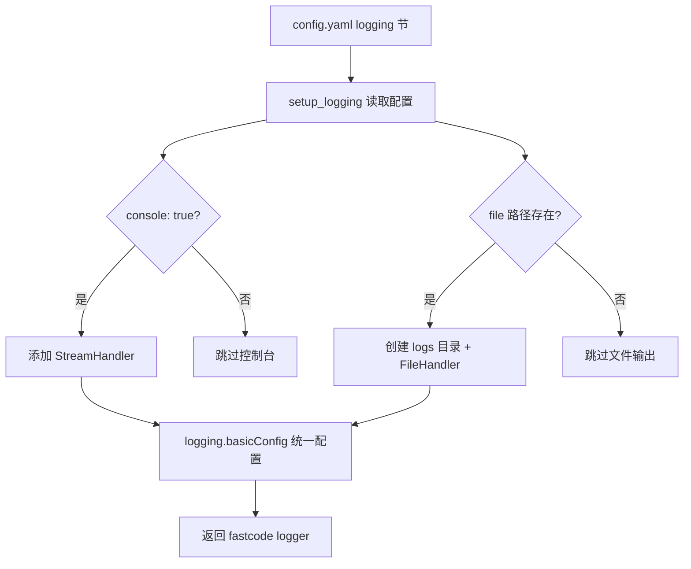
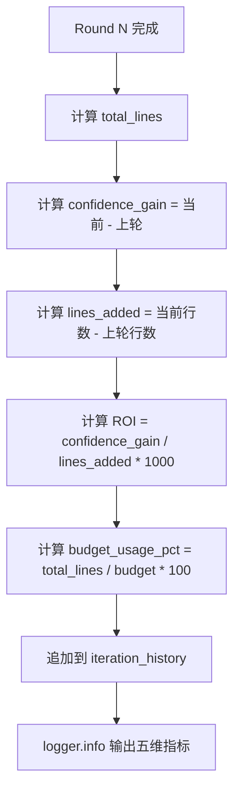
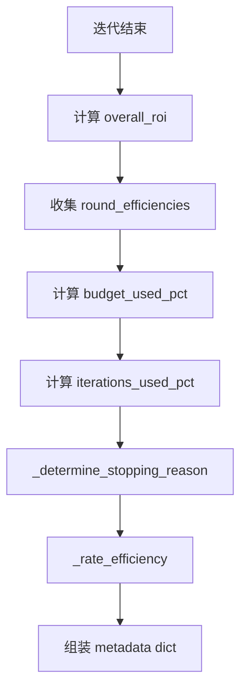

# PD-11.13 FastCode — 迭代 Agent 置信度/ROI 可观测性方案

> 文档编号：PD-11.13
> 来源：FastCode `fastcode/iterative_agent.py`, `fastcode/utils.py`, `api.py`
> GitHub：https://github.com/HKUDS/FastCode.git
> 问题域：PD-11 可观测性 Observability & Cost Tracking
> 状态：可复用方案

---

## 第 1 章 问题与动机（≥ 30 行）

### 1.1 核心问题

迭代式 Agent 系统（多轮检索 + LLM 推理）面临一个关键可观测性挑战：**每一轮迭代的"投入产出比"不透明**。传统日志只记录"做了什么"，但不回答"这一轮值不值得做"。具体表现为：

1. **置信度黑箱**：Agent 每轮检索后的置信度变化不可见，无法判断是否应该提前终止
2. **资源消耗不透明**：代码行数预算（line budget）的使用率没有实时追踪，容易超支
3. **ROI 无法量化**：每轮迭代的置信度增益与代码行数增量之间的比值（ROI）没有计算
4. **停止决策不可解释**：为什么在第 N 轮停止？是达到阈值、预算耗尽还是收益递减？
5. **效率评级缺失**：整个迭代过程的效率没有统一评分（excellent/good/acceptable/inefficient）

### 1.2 FastCode 的解法概述

FastCode 构建了一套**三层可观测性体系**，从底层日志到顶层效率分析全覆盖：

1. **配置驱动的分级日志**：`setup_logging()` 通过 YAML 配置控制日志级别、格式、输出目标（`fastcode/utils.py:14-39`）
2. **每轮迭代指标记录**：IterativeAgent 在每轮结束时记录 confidence/confidence_gain/lines_added/ROI/budget_usage_pct 五维指标（`fastcode/iterative_agent.py:270-280`）
3. **API 层 Token 追踪**：QueryResponse 模型暴露 prompt_tokens/completion_tokens/total_tokens 三个字段（`api.py:48-56`）
4. **自适应参数日志**：根据查询复杂度动态调整的 max_iterations/confidence_threshold/line_budget 全部记录（`fastcode/iterative_agent.py:147-152`）
5. **综合效率元数据**：迭代结束后生成包含 stopping_reason、efficiency_rating、round_efficiencies 的完整元数据（`fastcode/iterative_agent.py:382-416`）

### 1.3 设计思想

| 设计原则 | 具体实现 | 理由 | 替代方案 |
|----------|----------|------|----------|
| 配置驱动日志 | YAML 中定义 level/format/file/console | 部署环境不同需要不同日志级别，无需改代码 | 硬编码日志级别 |
| 每轮指标即时记录 | iteration_history 列表追加 dict | 迭代过程中就能看到趋势，不用等结束 | 只在最后汇总 |
| ROI 量化决策 | confidence_gain / lines_added * 1000 | 将"值不值得继续"从直觉变为数值判断 | 仅靠置信度阈值 |
| 四级效率评分 | excellent/good/acceptable/inefficient | 快速判断迭代质量，便于后续优化 | 只看最终置信度 |
| tiktoken 精确计数 | count_tokens() 用 tiktoken 编码后取 len | 比字符估算准确 30%+，支持多模型 | len(text)/4 估算 |

---

## 第 2 章 源码实现分析（≥ 60 行，核心章节）

### 2.1 架构概览

FastCode 的可观测性分布在三个层次：

```
┌─────────────────────────────────────────────────────────┐
│                    API 层 (api.py)                       │
│  QueryResponse: prompt_tokens / completion_tokens        │
│  /health 端点: 系统状态                                   │
│  /cache-stats 端点: 缓存统计                              │
├─────────────────────────────────────────────────────────┤
│              Agent 层 (iterative_agent.py)                │
│  iteration_history[]: 每轮 5 维指标                       │
│  _generate_iteration_metadata(): 综合效率分析             │
│  _should_continue_iteration(): 成本效益决策               │
│  _rate_efficiency(): 四级效率评分                          │
├─────────────────────────────────────────────────────────┤
│              基础设施层 (utils.py + config.yaml)           │
│  setup_logging(): 配置驱动分级日志                         │
│  count_tokens(): tiktoken 精确 Token 计数                 │
│  CacheManager.get_stats(): 缓存容量/条目统计              │
└─────────────────────────────────────────────────────────┘
```

### 2.2 核心实现

#### 2.2.1 配置驱动的分级日志系统



对应源码 `fastcode/utils.py:14-39`：

```python
def setup_logging(config: Dict[str, Any]) -> logging.Logger:
    """Setup logging configuration"""
    log_config = config.get("logging", {})
    level = getattr(logging, log_config.get("level", "INFO"))
    format_str = log_config.get("format", "%(asctime)s - %(name)s - %(levelname)s - %(message)s")
    
    # Create logs directory if it doesn't exist
    log_file = log_config.get("file", "./logs/fastcode.log")
    log_dir = os.path.dirname(log_file)
    if log_dir and not os.path.exists(log_dir):
        os.makedirs(log_dir, exist_ok=True)
    
    # Configure logging
    handlers = []
    if log_config.get("console", True):
        handlers.append(logging.StreamHandler())
    if log_file:
        handlers.append(logging.FileHandler(log_file))
    
    logging.basicConfig(
        level=level,
        format=format_str,
        handlers=handlers
    )
    
    return logging.getLogger("fastcode")
```

配置文件 `config/config.yaml:201-206` 定义了日志参数：

```yaml
logging:
  level: "INFO"  # DEBUG, INFO, WARNING, ERROR
  format: "%(asctime)s - %(name)s - %(levelname)s - %(message)s"
  file: "./logs/fastcode.log"
  console: true
```

#### 2.2.2 迭代 Agent 每轮五维指标记录



对应源码 `fastcode/iterative_agent.py:258-286`：

```python
# Calculate metrics for this round
total_lines = self._calculate_total_lines(current_elements)
prev_confidence = self.iteration_history[-1]["confidence"]
prev_lines = self.iteration_history[-1]["total_lines"]
confidence_gain = confidence - prev_confidence
lines_added = total_lines - prev_lines
roi = (confidence_gain / lines_added * 1000) if lines_added > 0 else 0.0
budget_usage_pct = (total_lines / self.adaptive_line_budget) * 100

# Record round results with detailed metrics
self.iteration_history.append({
    "round": current_round,
    "confidence": confidence,
    "elements_count": len(current_elements),
    "total_lines": total_lines,
    "confidence_gain": confidence_gain,
    "lines_added": lines_added,
    "roi": roi,
    "budget_usage_pct": budget_usage_pct
})

self.logger.info(
    f"Round {current_round} metrics: confidence={confidence:.1f} (+{confidence_gain:.1f}), "
    f"elements={len(current_elements)}, lines={total_lines} (+{lines_added}), "
    f"ROI={roi:.2f}, budget_usage={budget_usage_pct:.1f}%"
)
```

### 2.3 实现细节

#### 综合效率元数据生成

迭代结束后，`_generate_iteration_metadata()` 汇总全过程指标（`fastcode/iterative_agent.py:345-416`）：



停止原因分析 `_determine_stopping_reason()` 覆盖 5 种情况（`fastcode/iterative_agent.py:420-432`）：

- `confidence_threshold_reached`：置信度达标
- `max_iterations_reached`：迭代次数用尽
- `line_budget_exceeded`：代码行数预算超支
- `diminishing_returns`：连续两轮增益低于阈值
- `other`：其他原因

效率评级 `_rate_efficiency()` 基于 ROI 和预算使用率双维度（`fastcode/iterative_agent.py:434-444`）：

```python
def _rate_efficiency(self, overall_roi: float, budget_used_pct: float) -> str:
    if overall_roi >= 5.0 and budget_used_pct < 70:
        return "excellent"
    elif overall_roi >= 3.0 and budget_used_pct < 85:
        return "good"
    elif overall_roi >= 1.5 or budget_used_pct < 90:
        return "acceptable"
    else:
        return "inefficient"
```

#### 成本效益决策引擎

`_should_continue_iteration()` 是迭代控制的核心（`fastcode/iterative_agent.py:2268-2348`），按优先级执行 4 层检查：

1. 置信度已达标 → 停止
2. 硬性迭代上限 → 停止
3. 行数预算超支 → 停止
4. 自适应趋势分析：连续停滞（|gain| < 1.0 连续两轮）→ 停止；连续低效（drop 或 low ROI 连续两轮）→ 停止

#### Token 精确计数

`count_tokens()` 使用 tiktoken 库按模型编码精确计数（`fastcode/utils.py:90-100`）：

```python
def count_tokens(text: str, model: str = "gpt-4") -> int:
    try:
        encoding = tiktoken.encoding_for_model(model)
    except KeyError:
        encoding = tiktoken.get_encoding("cl100k_base")
    return len(encoding.encode(text, disallowed_special=()))
```

关键细节：`disallowed_special=()` 允许文本中包含 `<|endoftext|>` 等特殊 token 字符串，避免在非英文场景下计数失败。

#### API 层 Token 暴露

`api.py:48-56` 定义 QueryResponse 模型，将 token 用量透传给前端：

```python
class QueryResponse(BaseModel):
    answer: str
    query: str
    context_elements: int
    sources: List[Dict[str, Any]]
    prompt_tokens: Optional[int] = None
    completion_tokens: Optional[int] = None
    total_tokens: Optional[int] = None
    session_id: Optional[str] = None
```

`api.py:470-476` 从 answer_generator 结果中提取 token 数据：

```python
prompt_tokens = result.get("prompt_tokens")
completion_tokens = result.get("completion_tokens")
total_tokens = result.get("total_tokens")

if total_tokens is None and prompt_tokens and completion_tokens:
    total_tokens = prompt_tokens + completion_tokens
```

---

## 第 3 章 迁移指南（≥ 40 行）

### 3.1 迁移清单

**阶段 1：基础日志（1 个文件）**
- [ ] 创建 `config.yaml` 添加 logging 节（level/format/file/console）
- [ ] 实现 `setup_logging(config)` 函数，支持双输出（文件 + 控制台）
- [ ] 所有模块统一使用 `logging.getLogger(__name__)` 获取 logger

**阶段 2：迭代指标追踪（核心）**
- [ ] 在 Agent 类中添加 `iteration_history: List[Dict]` 属性
- [ ] 每轮迭代结束时计算并记录五维指标：confidence / confidence_gain / lines_added / ROI / budget_usage_pct
- [ ] 实现 `_generate_iteration_metadata()` 汇总全过程效率数据
- [ ] 实现 `_determine_stopping_reason()` 分类停止原因
- [ ] 实现 `_rate_efficiency()` 四级效率评分

**阶段 3：API 层 Token 暴露**
- [ ] 在 Response 模型中添加 prompt_tokens / completion_tokens / total_tokens 字段
- [ ] 使用 tiktoken 精确计数替代字符估算
- [ ] 添加 /health 和 /cache-stats 端点

### 3.2 适配代码模板

以下是一个可直接复用的迭代指标追踪模块：

```python
"""
Iteration Metrics Tracker — 从 FastCode 提取的可复用组件
用于任何迭代式 Agent 系统的可观测性追踪
"""
import logging
from typing import List, Dict, Any, Optional
from dataclasses import dataclass, field


@dataclass
class RoundMetrics:
    """单轮迭代指标"""
    round: int
    confidence: float
    elements_count: int
    total_lines: int
    confidence_gain: float = 0.0
    lines_added: int = 0
    roi: float = 0.0
    budget_usage_pct: float = 0.0


class IterationTracker:
    """迭代过程可观测性追踪器"""

    def __init__(self, line_budget: int = 12000, confidence_threshold: float = 95.0,
                 max_iterations: int = 4, min_confidence_gain: float = 5.0):
        self.line_budget = line_budget
        self.confidence_threshold = confidence_threshold
        self.max_iterations = max_iterations
        self.min_confidence_gain = min_confidence_gain
        self.history: List[RoundMetrics] = []
        self.logger = logging.getLogger(__name__)

    def record_round(self, round_num: int, confidence: float,
                     elements_count: int, total_lines: int) -> RoundMetrics:
        """记录一轮迭代的指标"""
        if self.history:
            prev = self.history[-1]
            confidence_gain = confidence - prev.confidence
            lines_added = total_lines - prev.total_lines
            roi = (confidence_gain / lines_added * 1000) if lines_added > 0 else 0.0
        else:
            confidence_gain = 0.0
            lines_added = total_lines
            roi = 0.0

        budget_usage_pct = (total_lines / self.line_budget) * 100

        metrics = RoundMetrics(
            round=round_num, confidence=confidence,
            elements_count=elements_count, total_lines=total_lines,
            confidence_gain=confidence_gain, lines_added=lines_added,
            roi=roi, budget_usage_pct=budget_usage_pct,
        )
        self.history.append(metrics)

        self.logger.info(
            f"Round {round_num}: confidence={confidence:.1f} (+{confidence_gain:.1f}), "
            f"lines={total_lines} (+{lines_added}), ROI={roi:.2f}, "
            f"budget={budget_usage_pct:.1f}%"
        )
        return metrics

    def should_continue(self, current_round: int, confidence: float) -> bool:
        """基于成本效益分析决定是否继续迭代"""
        if confidence >= self.confidence_threshold:
            return False
        if current_round >= self.max_iterations:
            return False
        if self.history and self.history[-1].budget_usage_pct >= 100:
            return False
        # 停滞检测：连续两轮增益 < 1.0
        if len(self.history) >= 2:
            if all(abs(h.confidence_gain) < 1.0 for h in self.history[-2:]):
                return False
        return True

    def get_stopping_reason(self) -> str:
        """分析停止原因"""
        if not self.history:
            return "no_iterations"
        final = self.history[-1]
        if final.confidence >= self.confidence_threshold:
            return "confidence_threshold_reached"
        if len(self.history) >= self.max_iterations:
            return "max_iterations_reached"
        if final.budget_usage_pct >= 100:
            return "line_budget_exceeded"
        if len(self.history) >= 2:
            if all(abs(h.confidence_gain) < self.min_confidence_gain for h in self.history[-2:]):
                return "diminishing_returns"
        return "other"

    def rate_efficiency(self) -> str:
        """四级效率评分"""
        if not self.history:
            return "no_data"
        initial = self.history[0].confidence
        final = self.history[-1].confidence
        total_gain = final - initial
        total_lines = self.history[-1].total_lines
        overall_roi = (total_gain / total_lines * 1000) if total_lines > 0 else 0.0
        budget_pct = self.history[-1].budget_usage_pct

        if overall_roi >= 5.0 and budget_pct < 70:
            return "excellent"
        elif overall_roi >= 3.0 and budget_pct < 85:
            return "good"
        elif overall_roi >= 1.5 or budget_pct < 90:
            return "acceptable"
        return "inefficient"

    def generate_metadata(self) -> Dict[str, Any]:
        """生成综合迭代元数据"""
        if not self.history:
            return {"rounds": 0}
        return {
            "rounds": len(self.history),
            "initial_confidence": self.history[0].confidence,
            "final_confidence": self.history[-1].confidence,
            "total_lines": self.history[-1].total_lines,
            "budget_used_pct": self.history[-1].budget_usage_pct,
            "stopping_reason": self.get_stopping_reason(),
            "efficiency_rating": self.rate_efficiency(),
            "round_details": [
                {"round": h.round, "confidence_gain": h.confidence_gain,
                 "lines_added": h.lines_added, "roi": h.roi}
                for h in self.history[1:]
            ],
        }
```

### 3.3 适用场景

| 场景 | 适用度 | 说明 |
|------|--------|------|
| 迭代式 RAG Agent | ⭐⭐⭐ | 完美匹配：多轮检索 + 置信度控制 |
| 多步推理 Agent | ⭐⭐⭐ | 每步推理都可记录置信度和资源消耗 |
| 代码搜索系统 | ⭐⭐⭐ | 行数预算和 ROI 概念直接适用 |
| 单轮 QA 系统 | ⭐ | 无迭代过程，只需 Token 追踪部分 |
| 流式对话系统 | ⭐⭐ | Token 追踪适用，但 ROI 概念需适配 |

---

## 第 4 章 测试用例（≥ 20 行）

```python
import pytest
from unittest.mock import MagicMock


class TestIterationTracker:
    """基于 FastCode IterativeAgent 指标追踪逻辑的测试"""

    def setup_method(self):
        """初始化 tracker"""
        from iteration_tracker import IterationTracker
        self.tracker = IterationTracker(
            line_budget=12000, confidence_threshold=95.0,
            max_iterations=4, min_confidence_gain=5.0
        )

    def test_first_round_metrics(self):
        """第一轮：confidence_gain 应为 0"""
        m = self.tracker.record_round(1, confidence=60.0, elements_count=10, total_lines=2000)
        assert m.confidence_gain == 0.0
        assert m.roi == 0.0
        assert m.budget_usage_pct == pytest.approx(16.67, rel=0.01)

    def test_roi_calculation(self):
        """ROI = confidence_gain / lines_added * 1000"""
        self.tracker.record_round(1, 60.0, 10, 2000)
        m = self.tracker.record_round(2, 75.0, 20, 5000)
        assert m.confidence_gain == 15.0
        assert m.lines_added == 3000
        assert m.roi == pytest.approx(5.0, rel=0.01)

    def test_should_continue_confidence_reached(self):
        """置信度达标时应停止"""
        self.tracker.record_round(1, 96.0, 10, 2000)
        assert self.tracker.should_continue(2, 96.0) is False

    def test_should_continue_budget_exceeded(self):
        """预算超支时应停止"""
        self.tracker.record_round(1, 50.0, 10, 12000)
        assert self.tracker.should_continue(2, 50.0) is False

    def test_stagnation_detection(self):
        """连续两轮增益 < 1.0 应停止"""
        self.tracker.record_round(1, 70.0, 10, 3000)
        self.tracker.record_round(2, 70.5, 15, 5000)
        self.tracker.record_round(3, 70.8, 18, 6000)
        assert self.tracker.should_continue(4, 70.8) is False

    def test_stopping_reason_diminishing_returns(self):
        """停止原因应为 diminishing_returns"""
        self.tracker.record_round(1, 70.0, 10, 3000)
        self.tracker.record_round(2, 72.0, 15, 5000)
        self.tracker.record_round(3, 72.5, 18, 6000)
        assert self.tracker.get_stopping_reason() == "diminishing_returns"

    def test_efficiency_rating_excellent(self):
        """高 ROI + 低预算使用 = excellent"""
        self.tracker.record_round(1, 50.0, 5, 1000)
        self.tracker.record_round(2, 95.0, 20, 5000)
        assert self.tracker.rate_efficiency() == "excellent"

    def test_efficiency_rating_inefficient(self):
        """低 ROI + 高预算使用 = inefficient"""
        self.tracker.record_round(1, 50.0, 5, 1000)
        self.tracker.record_round(2, 52.0, 50, 11000)
        assert self.tracker.rate_efficiency() == "inefficient"

    def test_metadata_generation(self):
        """元数据应包含所有关键字段"""
        self.tracker.record_round(1, 60.0, 10, 2000)
        self.tracker.record_round(2, 85.0, 25, 6000)
        meta = self.tracker.generate_metadata()
        assert meta["rounds"] == 2
        assert meta["initial_confidence"] == 60.0
        assert meta["final_confidence"] == 85.0
        assert "stopping_reason" in meta
        assert "efficiency_rating" in meta
        assert len(meta["round_details"]) == 1  # 第一轮不含 ROI 详情
```

---

## 第 5 章 跨域关联

| 关联域 | 关系类型 | 说明 |
|--------|----------|------|
| PD-01 上下文管理 | 协同 | count_tokens() 和 truncate_to_tokens() 同时服务于上下文窗口管理和 Token 计量 |
| PD-03 容错与重试 | 协同 | _should_continue_iteration() 的停滞检测本质上是一种容错机制，防止 Agent 陷入无效循环 |
| PD-04 工具系统 | 依赖 | 迭代指标追踪依赖 AgentTools 的工具调用结果来计算 elements_count 和 total_lines |
| PD-08 搜索与检索 | 依赖 | ROI 计算的 confidence_gain 来自检索质量评估，lines_added 来自检索结果的代码行数 |
| PD-12 推理增强 | 协同 | 自适应参数（max_iterations/confidence_threshold/line_budget）根据查询复杂度动态调整，属于推理增强的一部分 |

---

## 第 6 章 来源文件索引

| 文件 | 行范围 | 关键实现 |
|------|--------|----------|
| `fastcode/utils.py` | L14-L39 | setup_logging() 配置驱动分级日志 |
| `fastcode/utils.py` | L90-L100 | count_tokens() tiktoken 精确 Token 计数 |
| `fastcode/utils.py` | L103-L115 | truncate_to_tokens() Token 截断 |
| `fastcode/iterative_agent.py` | L109-L152 | _initialize_adaptive_parameters() 自适应参数设置与日志 |
| `fastcode/iterative_agent.py` | L205-L215 | Round 1 指标记录 |
| `fastcode/iterative_agent.py` | L258-L286 | Round N 五维指标计算与记录 |
| `fastcode/iterative_agent.py` | L345-L416 | _generate_iteration_metadata() 综合效率元数据 |
| `fastcode/iterative_agent.py` | L420-L444 | _determine_stopping_reason() + _rate_efficiency() |
| `fastcode/iterative_agent.py` | L2268-L2348 | _should_continue_iteration() 成本效益决策 |
| `fastcode/iterative_agent.py` | L2461-L2470 | _calculate_total_lines() 代码行数统计 |
| `fastcode/answer_generator.py` | L100-L141 | Token 计数 + 上下文截断日志 |
| `fastcode/answer_generator.py` | L171-L177 | 结果中包含 prompt_tokens |
| `fastcode/answer_generator.py` | L884-L886 | Token 用量格式化输出 |
| `api.py` | L48-L56 | QueryResponse 模型定义 token 字段 |
| `api.py` | L116-L128 | API 层日志配置（双输出） |
| `api.py` | L152-L168 | /health 健康检查端点 |
| `api.py` | L470-L476 | Token 数据提取与 total_tokens 计算 |
| `api.py` | L713-L719 | /cache-stats 缓存统计端点 |
| `fastcode/cache.py` | L182-L199 | CacheManager.get_stats() 缓存统计 |
| `fastcode/llm_utils.py` | L4-L17 | openai_chat_completion() max_tokens 降级兼容 |
| `config/config.yaml` | L201-L206 | 日志配置节 |
| `config/config.yaml` | L170-L180 | Agent 迭代参数配置 |

---

## 第 7 章 横向对比维度

> **重要：** 本章用于自动填充 Butcher Wiki 的横向对比表。

```json comparison_data
{
  "project": "FastCode",
  "dimensions": {
    "追踪方式": "Python logging 分级日志 + iteration_history 列表内存追踪",
    "数据粒度": "每轮迭代 5 维指标：confidence/gain/lines/ROI/budget%",
    "持久化": "日志文件持久化，迭代指标仅内存（随请求生命周期）",
    "多提供商": "OpenAI + Anthropic 双提供商，统一 openai_chat_completion 封装",
    "日志格式": "标准 Python logging 格式，YAML 配置驱动",
    "指标采集": "每轮迭代即时计算 ROI + 预算使用率，非事后汇总",
    "成本追踪": "tiktoken 精确 Token 计数 + API 层 prompt/completion/total 三字段",
    "日志级别": "YAML 配置 4 级：DEBUG/INFO/WARNING/ERROR",
    "预算守卫": "行数预算 + 自适应阈值 + 四级效率评分 + 5 种停止原因分析",
    "健康端点": "/health 轻量检查 + /status 完整状态 + /cache-stats 缓存统计",
    "缓存统计": "CacheManager.get_stats() 返回 volume/items，支持 disk 和 Redis"
  }
}
```

### 域元数据补充

```json domain_metadata
{
  "solution_summary": "FastCode 用 iteration_history 列表记录每轮迭代 5 维指标(confidence/gain/lines/ROI/budget%)，配合 tiktoken 精确 Token 计数和四级效率评分(excellent/good/acceptable/inefficient)实现迭代 Agent 全过程可观测",
  "description": "迭代式 Agent 的投入产出比(ROI)量化与效率评级，将停止决策从直觉变为数据驱动",
  "sub_problems": [
    "迭代 ROI 量化：每轮置信度增益与资源消耗的比值计算与趋势分析",
    "自适应参数可观测：动态调整的阈值/预算/迭代上限需要日志记录以便调优",
    "效率评级标准化：将迭代过程质量归纳为离散等级便于跨查询对比",
    "停止原因分类：区分 5 种停止原因(达标/上限/超支/递减/其他)辅助系统调优"
  ],
  "best_practices": [
    "每轮迭代即时记录五维指标而非事后汇总：便于实时监控和中途干预",
    "用 ROI(confidence_gain/lines_added*1000) 量化每轮投入产出比：将继续/停止决策数据化",
    "tiktoken 计数时设 disallowed_special=() 避免非英文文本中特殊 token 字符串导致计数失败",
    "max_tokens 参数降级兼容：先尝试 max_tokens，BadRequestError 时回退 max_completion_tokens"
  ]
}
```
