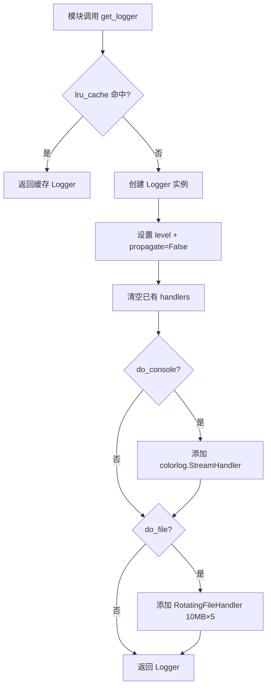
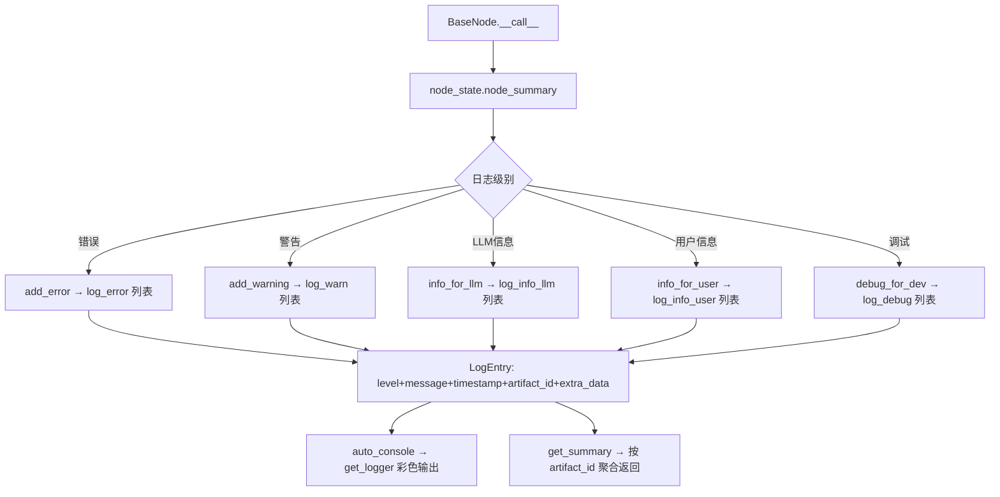
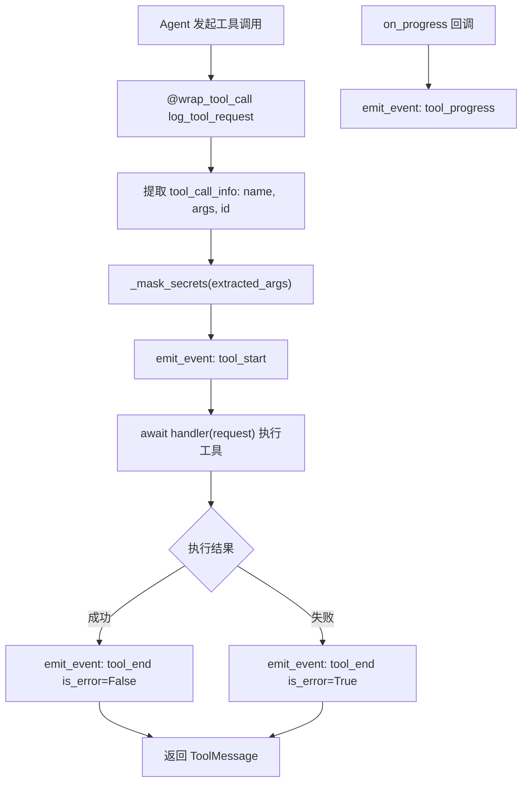

# PD-11.14 FireRed-OpenStoryline — 五级日志分层与 MCP 工具事件流可观测性

> 文档编号：PD-11.14
> 来源：FireRed-OpenStoryline `src/open_storyline/utils/logging.py` `src/open_storyline/nodes/node_summary.py` `src/open_storyline/mcp/hooks/chat_middleware.py`
> GitHub：https://github.com/FireRedTeam/FireRed-OpenStoryline.git
> 问题域：PD-11 可观测性 Observability & Cost Tracking
> 状态：可复用方案

---

## 第 1 章 问题与动机（≥ 30 行）

### 1.1 核心问题

在 Agent 驱动的多媒体创作流水线中，可观测性面临三重挑战：

1. **受众分层**：开发者需要 DEBUG 级调试信息，LLM Agent 需要结构化的错误/警告上下文来自主决策，终端用户只需要简洁的进度反馈。传统单一日志级别无法同时满足三类消费者。
2. **工具调用黑盒**：MCP 工具调用链涉及多个 Server 和 Node，调用过程中的参数、耗时、成功/失败状态对调试至关重要，但标准 MCP 协议不提供细粒度的工具级事件流。
3. **敏感信息泄露**：工具调用参数中频繁携带 API Key、Token 等凭证，日志和事件流中必须自动脱敏，否则控制台输出和 GUI 回传都会暴露密钥。

### 1.2 FireRed-OpenStoryline 的解法概述

OpenStoryline 构建了三层可观测性体系：

1. **colorlog 彩色日志工厂**（`utils/logging.py:42-113`）：`@lru_cache` 缓存的 `get_logger()` 工厂，支持 colorlog 彩色控制台 + RotatingFileHandler 文件轮转，全局统一日志格式含文件名和行号。
2. **NodeSummary 五级日志分层**（`nodes/node_summary.py:19-236`）：在标准 Python logging 之上构建 ERROR/WARNING/DEBUG/INFO_LLM/INFO_USER 五级分层，每级独立存储 `LogEntry` 列表，支持按 artifact 聚合和按级别提取。
3. **MCP 工具事件流 + 敏感信息脱敏**（`mcp/hooks/chat_middleware.py:94-221`）：`@wrap_tool_call` 中间件拦截所有工具调用，发射 `tool_start`/`tool_end`/`tool_progress` 结构化事件到 ContextVar 回调 sink，参数自动经过 `_mask_secrets()` 递归脱敏。

### 1.3 设计思想

| 设计原则 | 具体实现 | 理由 | 替代方案 |
|----------|----------|------|----------|
| 受众分离 | NodeSummary 五级日志：ERROR/WARNING 给 LLM 决策，INFO_USER 给用户，DEBUG 给开发者 | 不同消费者需要不同粒度的信息，混在一起会产生噪声 | 单一 logging.INFO 级别 + 前缀标记 |
| 日志工厂缓存 | `@lru_cache(maxsize=128)` 缓存 get_logger 实例 | 避免重复创建 handler 导致日志重复输出 | 全局 dict 手动管理 |
| 事件驱动通知 | ContextVar 回调 sink 发射结构化事件 | GUI 和 CLI 可以各自注册不同的 sink 消费事件 | WebSocket 直连 / 轮询 API |
| 安全默认 | `_mask_secrets()` 递归遍历所有嵌套结构脱敏 | 防止 API Key 泄露到控制台、日志文件、GUI 事件流 | 仅在最外层过滤 |
| Artifact 关联 | 每条日志可绑定 artifact_id，支持按产物聚合 | 多媒体流水线中每个产物（视频片段、配音等）需要独立的日志上下文 | 全局日志无关联 |

---

## 第 2 章 源码实现分析（≥ 60 行，核心章节）

### 2.1 架构概览

```
┌─────────────────────────────────────────────────────────────────┐
│                    OpenStoryline 可观测性架构                      │
├─────────────────────────────────────────────────────────────────┤
│                                                                 │
│  Layer 1: 基础日志工厂                                            │
│  ┌──────────────────────────────────────────────┐               │
│  │ get_logger() [@lru_cache]                    │               │
│  │  ├─ colorlog.StreamHandler (彩色控制台)        │               │
│  │  └─ RotatingFileHandler (10MB×5 轮转)         │               │
│  └──────────────────────────────────────────────┘               │
│       ↑ 被所有模块调用                                            │
│                                                                 │
│  Layer 2: 节点级五级日志                                          │
│  ┌──────────────────────────────────────────────┐               │
│  │ NodeSummary                                  │               │
│  │  ├─ ERROR    → log_error[]    → LLM 决策      │               │
│  │  ├─ WARNING  → log_warn[]     → LLM 决策      │               │
│  │  ├─ INFO_LLM → log_info_llm[] → LLM 上下文    │               │
│  │  ├─ INFO_USER→ log_info_user[]→ 用户展示       │               │
│  │  └─ DEBUG    → log_debug[]    → 开发者调试     │               │
│  │  每条 LogEntry: level + message + timestamp    │               │
│  │                + artifact_id + extra_data      │               │
│  └──────────────────────────────────────────────┘               │
│       ↑ 每个 BaseNode.__call__ 通过 node_state 访问               │
│                                                                 │
│  Layer 3: MCP 工具事件流                                          │
│  ┌──────────────────────────────────────────────┐               │
│  │ @wrap_tool_call log_tool_request             │               │
│  │  ├─ tool_start  {id, server, name, args}     │               │
│  │  ├─ tool_progress {progress, total, message} │               │
│  │  └─ tool_end    {id, is_error, summary}      │               │
│  │  ContextVar sink → GUI / CLI / 日志           │               │
│  │  _mask_secrets() 递归脱敏                      │               │
│  └──────────────────────────────────────────────┘               │
│                                                                 │
└─────────────────────────────────────────────────────────────────┘
```

### 2.2 核心实现

#### 2.2.1 colorlog 日志工厂



对应源码 `src/open_storyline/utils/logging.py:41-113`：
```python
@lru_cache(maxsize=128)
def get_logger(
    name: Optional[str] = None,
) -> logging.Logger:
    if name is None:
        frame = sys._getframe(1)
        name = frame.f_globals.get("__name__", "__main__")

    level = "debug"
    do_console = True
    do_file = False

    logger = logging.getLogger(name)
    level = LOG_LEVEL_MAP.get(level.lower(), logging.INFO)
    logger.setLevel(level)
    logger.propagate = False   # 防止传播到 root logger
    logger.handlers.clear()    # 清空已有 handler 防重复

    if do_console:
        console_handler = colorlog.StreamHandler()
        console_handler.setLevel(level)
        colored_formatter = colorlog.ColoredFormatter(
            f"%(log_color)s{LOG_FORMAT}",
            datefmt=date_format,
            log_colors=LOG_COLOR_MAP   # DEBUG=cyan, INFO=green, WARNING=yellow, ERROR=red
        )
        console_handler.setFormatter(colored_formatter)
        logger.addHandler(console_handler)
    return logger
```

关键设计点：
- `logger.propagate = False`（L71）：阻止日志向 root logger 传播，避免多模块重复输出
- `logger.handlers.clear()`（L72）：每次创建时清空 handler，配合 `@lru_cache` 保证幂等
- `sys._getframe(1)`（L55）：自动获取调用方模块名，无需手动传参

#### 2.2.2 NodeSummary 五级日志分层



对应源码 `src/open_storyline/nodes/node_summary.py:19-70`：
```python
@dataclass
class NodeSummary:
    ERROR: str = "ERROR"
    DEBUG: str = "DEBUG"
    WARNING: str = "WARNING"
    INFO_LLM: str = "INFO_LLM"
    INFO_USER: str = "INFO_USER"
    LOGGER_LEVELS: Tuple[str, ...] = (ERROR, DEBUG, WARNING, INFO_LLM, INFO_USER)

    log_error: List[LogEntry] = field(default_factory=list)
    log_warn: List[LogEntry] = field(default_factory=list)
    log_info_llm: List[LogEntry] = field(default_factory=list)
    log_info_user: List[LogEntry] = field(default_factory=list)
    log_debug: List[LogEntry] = field(default_factory=list)

    artifact_warnings: Dict[str, List[str]] = field(default_factory=dict)
    artifact_errors: Dict[str, List[str]] = field(default_factory=dict)

    def __post_init__(self):
        self._logger = get_logger(self.logger_name or "NodeSummary")
        if self.summary_levels is None:
            self.summary_levels = [self.ERROR, self.WARNING, self.INFO_LLM, self.INFO_USER]
```

`get_summary()` 方法（`node_summary.py:206-226`）在 `BaseNode.__call__` 返回时被调用（`base_node.py:227`），将多级日志聚合为结构化字典返回给 MCP 客户端。

#### 2.2.3 MCP 工具事件流与脱敏



对应源码 `src/open_storyline/mcp/hooks/chat_middleware.py:94-207`：
```python
@wrap_tool_call
async def log_tool_request(request, handler):
    sink = _MCP_LOG_SINK.get()          # ContextVar 获取当前 sink

    tool_call_info = request.tool_call
    tool_complete_name = tool_call_info.get("name", "")

    # 解析 server.tool_name 格式
    server_name, tool_name = "", tool_complete_name
    for s in server_names:
        prefix = f"{s}_"
        if tool_complete_name.startswith(prefix):
            server_name = s
            tool_name = tool_complete_name[len(prefix):]
            break

    # 过滤内部参数 + 脱敏
    extracted_args = _mask_secrets(extracted_args)

    # 发射 tool_start 事件
    emit_event({
        "type": "tool_start",
        "tool_call_id": tool_call_id,
        "server": server_name,
        "name": tool_name,
        "args": extracted_args,
    })

    out = await handler(request)    # 执行实际工具

    # 发射 tool_end 事件（区分 MCP 工具 vs Skill 工具）
    emit_event({
        "type": "tool_end",
        "tool_call_id": tool_call_id,
        "is_error": isError,
        "summary": _mask_secrets(summary),
    })
    return out
```

敏感信息脱敏（`chat_middleware.py:20-65`）：
```python
_SENSITIVE_KEYS = {
    "api_key", "access_token", "authorization", "token",
    "password", "secret", "x-api-key", "apikey",
}

def _mask_secrets(obj: Any) -> Any:
    if isinstance(obj, dict):
        out = {}
        for k, v in obj.items():
            if str(k).lower() in _SENSITIVE_KEYS:
                out[k] = "***"
            else:
                out[k] = _mask_secrets(v)
        return out
    if isinstance(obj, list):
        return [_mask_secrets(x) for x in obj]
    return obj
```

### 2.3 实现细节

**ContextVar 事件通道**（`chat_middleware.py:31-38`）：使用 `contextvars.ContextVar` 实现请求级隔离的事件 sink，GUI 和 CLI 可以各自注册不同的回调函数。`_MCP_ACTIVE_TOOL_CALL_ID` 追踪当前活跃的工具调用 ID，确保 `on_progress` 回调能正确关联到对应的工具调用。

**Decorator 式性能追踪**（`logging.py:137-154`）：`@log_time` 装饰器使用 `time.perf_counter()` 高精度计时，支持 `@log_time` 和 `@log_time(logger=xxx)` 两种调用方式。

**Session 生命周期日志**（`storage/session_manager.py:60-113`）：`SessionLifecycleManager` 在清理过期 session 时输出结构化日志，包含过期天数、数量限制、删除项名称等信息，使用 `threading.Lock` 非阻塞锁防止并发清理冲突。

**BaseNode 错误分级输出**（`nodes/core_nodes/base_node.py:231-245`）：`developer_mode=True` 时输出完整 traceback，否则返回 NodeSummary 聚合的结构化摘要，避免向用户暴露内部堆栈。


---

## 第 3 章 迁移指南（≥ 40 行）

### 3.1 迁移清单

**阶段 1：基础日志工厂（1-2 小时）**
- [ ] 安装依赖：`pip install colorlog`
- [ ] 复制 `get_logger()` 工厂函数，调整 `LOG_FORMAT` 和 `LOG_COLOR_MAP`
- [ ] 复制 `@log_exception` 和 `@log_time` 装饰器
- [ ] 在项目入口模块调用 `get_logger()` 验证彩色输出

**阶段 2：五级日志分层（2-3 小时）**
- [ ] 复制 `LogEntry` 和 `NodeSummary` dataclass
- [ ] 根据业务需求调整日志级别定义（如增加 `INFO_AGENT` 级别）
- [ ] 在 Agent/Node 基类中注入 `NodeSummary` 实例
- [ ] 实现 `get_summary()` 的调用点（任务完成时聚合日志）

**阶段 3：MCP 事件流（3-4 小时）**
- [ ] 定义 ContextVar 事件 sink 和事件类型枚举
- [ ] 实现 `@wrap_tool_call` 中间件（或等效的工具调用拦截器）
- [ ] 实现 `_mask_secrets()` 递归脱敏，根据项目需求扩展 `_SENSITIVE_KEYS`
- [ ] 在 GUI/CLI 层注册 sink 回调消费事件

### 3.2 适配代码模板

```python
"""可复用的五级日志分层模板"""
from dataclasses import dataclass, field
from typing import Any, Dict, List, Optional
from datetime import datetime
import logging

# 复用 get_logger 工厂（从 logging.py 复制）
from your_project.utils.logging import get_logger


@dataclass
class LogEntry:
    level: str
    message: str
    timestamp: str
    context_id: Optional[str] = None  # 替代 artifact_id，适配你的业务
    extra_data: Dict[str, Any] = field(default_factory=dict)


@dataclass
class MultiLevelLogger:
    """五级日志分层器 — 适配模板"""
    # 定义你的日志级别
    LEVELS = ("ERROR", "WARNING", "INFO_AGENT", "INFO_USER", "DEBUG")

    _logs: Dict[str, List[LogEntry]] = field(default_factory=lambda: {
        level: [] for level in MultiLevelLogger.LEVELS
    })
    _logger: Optional[logging.Logger] = field(default=None, init=False)
    logger_name: str = "MultiLevelLogger"
    auto_console: bool = True

    def __post_init__(self):
        self._logger = get_logger(self.logger_name)

    def log(self, level: str, message: str, context_id: str = None, **kwargs):
        entry = LogEntry(
            level=level,
            message=message,
            timestamp=datetime.now().isoformat(),
            context_id=context_id,
            extra_data=kwargs,
        )
        self._logs.setdefault(level, []).append(entry)
        if self.auto_console:
            py_level = {"ERROR": 40, "WARNING": 30, "DEBUG": 10}.get(level, 20)
            self._logger.log(py_level, f"[{level}] {message}")

    def get_summary(self, levels: List[str] = None) -> Dict[str, str]:
        levels = levels or ["ERROR", "WARNING", "INFO_AGENT", "INFO_USER"]
        return {
            lvl: "\n".join(f"[{e.timestamp}] {e.message}" for e in self._logs.get(lvl, []))
            for lvl in levels
        }

    def clear(self):
        for v in self._logs.values():
            v.clear()
```

```python
"""可复用的敏感信息脱敏模板"""
from typing import Any, Set

SENSITIVE_KEYS: Set[str] = {
    "api_key", "access_token", "authorization", "token",
    "password", "secret", "x-api-key", "apikey",
    # 根据项目需求扩展
}

def mask_secrets(obj: Any) -> Any:
    """递归脱敏：遍历 dict/list/tuple 中的敏感字段"""
    try:
        if isinstance(obj, dict):
            return {
                k: "***" if k.lower() in SENSITIVE_KEYS else mask_secrets(v)
                for k, v in obj.items()
            }
        if isinstance(obj, (list, tuple)):
            masked = [mask_secrets(x) for x in obj]
            return type(obj)(masked)
        return obj
    except Exception:
        return "***"
```

### 3.3 适用场景

| 场景 | 适用度 | 说明 |
|------|--------|------|
| 多媒体 Agent 流水线 | ⭐⭐⭐ | 完美匹配：多节点、多产物、需要按产物聚合日志 |
| MCP 工具调用系统 | ⭐⭐⭐ | 事件流 + 脱敏直接可用 |
| 单 Agent + 多工具 | ⭐⭐ | 五级分层有价值，但 artifact 关联可简化 |
| 纯 API 服务（无 Agent） | ⭐ | 过度设计，标准 logging + 结构化日志即可 |
| 需要分布式追踪的系统 | ⭐ | 缺少 TraceID/SpanID 传播，需补充 OTel 集成 |

---

## 第 4 章 测试用例（≥ 20 行）

```python
import pytest
from datetime import datetime
from unittest.mock import MagicMock, AsyncMock, patch
from open_storyline.nodes.node_summary import NodeSummary, LogEntry
from open_storyline.mcp.hooks.chat_middleware import _mask_secrets, _MCP_LOG_SINK


class TestNodeSummary:
    def setup_method(self):
        self.summary = NodeSummary(logger_name="test", auto_console=False)

    def test_five_levels_independent_storage(self):
        """五级日志独立存储，互不干扰"""
        self.summary.add_error("err1")
        self.summary.add_warning("warn1")
        self.summary.info_for_llm("llm1")
        self.summary.info_for_user("user1")
        self.summary.debug_for_dev("debug1")

        assert len(self.summary.log_error) == 1
        assert len(self.summary.log_warn) == 1
        assert len(self.summary.log_info_llm) == 1
        assert len(self.summary.log_info_user) == 1
        assert len(self.summary.log_debug) == 1

    def test_artifact_error_tracking(self):
        """按 artifact_id 聚合错误"""
        self.summary.add_error("fail1", artifact_id="art_001")
        self.summary.add_error("fail2", artifact_id="art_001")
        self.summary.add_error("fail3", artifact_id="art_002")

        assert len(self.summary.artifact_errors["art_001"]) == 2
        assert len(self.summary.artifact_errors["art_002"]) == 1

    def test_get_summary_filters_by_level(self):
        """get_summary 按配置的 summary_levels 过滤"""
        self.summary.add_error("err")
        self.summary.debug_for_dev("debug_only")

        result = self.summary.get_summary("test_artifact")
        # DEBUG 不在默认 summary_levels 中
        assert "DEBUG" not in result
        assert "ERROR" in result

    def test_clear_resets_all(self):
        """clear() 清空所有日志和 artifact 映射"""
        self.summary.add_error("err", artifact_id="art")
        self.summary.clear()
        assert len(self.summary.log_error) == 0
        assert len(self.summary.artifact_errors) == 0

    def test_log_entry_has_timestamp(self):
        """每条日志自动附带 ISO 时间戳"""
        self.summary.info_for_user("hello")
        entry = self.summary.log_info_user[0]
        datetime.fromisoformat(entry.timestamp)  # 不抛异常即通过


class TestMaskSecrets:
    def test_flat_dict(self):
        result = _mask_secrets({"api_key": "sk-123", "name": "test"})
        assert result["api_key"] == "***"
        assert result["name"] == "test"

    def test_nested_dict(self):
        result = _mask_secrets({"config": {"token": "abc", "url": "http://x"}})
        assert result["config"]["token"] == "***"
        assert result["config"]["url"] == "http://x"

    def test_list_of_dicts(self):
        result = _mask_secrets([{"password": "p1"}, {"key": "v"}])
        assert result[0]["password"] == "***"
        assert result[1]["key"] == "v"

    def test_case_insensitive_keys(self):
        """键名大小写不敏感"""
        result = _mask_secrets({"API_KEY": "sk-123"})
        # 注意：当前实现用 str(k).lower()，所以 API_KEY 会被匹配
        assert result["API_KEY"] == "***"

    def test_non_dict_passthrough(self):
        assert _mask_secrets("plain_string") == "plain_string"
        assert _mask_secrets(42) == 42
```


---

## 第 5 章 跨域关联

| 关联域 | 关系类型 | 说明 |
|--------|----------|------|
| PD-03 容错与重试 | 协同 | `handle_tool_errors` 中间件（`chat_middleware.py:224-268`）捕获工具异常后构造带 `isError=True` 的 ToolMessage，错误信息经 `_mask_secrets` 脱敏后返回给 LLM，LLM 可据此决定重试或降级 |
| PD-04 工具系统 | 依赖 | 事件流依赖 `@wrap_tool_call` 中间件机制，工具注册和调用链由 `node_interceptors.py` 的 `ToolInterceptor` 管理，日志与工具系统深度耦合 |
| PD-06 记忆持久化 | 协同 | `ArtifactStore`（`agent_memory.py:77-119`）在保存产物时记录 `created_at` 时间戳和 `summary` 摘要，`SessionLifecycleManager` 基于 `retention_days` 和 `max_items` 自动清理过期数据 |
| PD-10 中间件管道 | 依赖 | `log_tool_request` 和 `handle_tool_errors` 都是 `@wrap_tool_call` 装饰的中间件，通过 LangChain 的中间件管道串联执行，日志中间件的位置决定了它能观测到的信息范围 |
| PD-09 Human-in-the-Loop | 协同 | `INFO_USER` 级别日志专门面向终端用户，`tool_progress` 事件流支持 GUI 实时展示工具执行进度，两者共同构成用户感知层 |

---

## 第 6 章 来源文件索引

| 文件 | 行范围 | 关键实现 |
|------|--------|----------|
| `src/open_storyline/utils/logging.py` | L1-214 | get_logger 工厂、@log_exception、@log_time 装饰器、MCPMoviePyLogger 进度日志 |
| `src/open_storyline/nodes/node_summary.py` | L1-236 | LogEntry 数据类、NodeSummary 五级日志分层、get_summary 聚合、artifact 关联 |
| `src/open_storyline/mcp/hooks/chat_middleware.py` | L1-273 | _mask_secrets 递归脱敏、log_tool_request 事件流、on_progress 进度回调、handle_tool_errors 错误包装、PrintStreamingTokens 流式输出 |
| `src/open_storyline/mcp/hooks/node_interceptors.py` | L1-380 | ToolInterceptor 工具拦截器、依赖解析日志（树形缩进）、inject_tts_config/inject_pexels_api_key 配置注入 |
| `src/open_storyline/storage/session_manager.py` | L1-167 | SessionLifecycleManager 生命周期管理、两阶段清理策略、线程安全锁 |
| `src/open_storyline/storage/agent_memory.py` | L1-152 | ArtifactMeta 元数据、ArtifactStore 产物存储、JSON 持久化 |
| `src/open_storyline/nodes/core_nodes/base_node.py` | L206-245 | BaseNode.__call__ 中 NodeSummary 集成、developer_mode 错误分级 |
| `src/open_storyline/config.py` | L77-82 | DeveloperConfig: developer_mode、print_context 开关 |

---

## 第 7 章 横向对比维度

> **重要：** 本章用于自动填充 Butcher Wiki 的横向对比表。

```json comparison_data
{
  "project": "FireRed-OpenStoryline",
  "dimensions": {
    "追踪方式": "ContextVar 事件 sink + @wrap_tool_call 中间件拦截",
    "数据粒度": "工具调用级：tool_start/tool_progress/tool_end 三事件",
    "持久化": "ArtifactStore JSON 文件 + meta.json 元数据索引",
    "日志格式": "colorlog 彩色控制台 + LOG_FORMAT 含文件名行号",
    "日志级别": "五级分层：ERROR/WARNING/INFO_LLM/INFO_USER/DEBUG",
    "安全审计": "_mask_secrets 递归脱敏 8 类敏感键名",
    "Decorator 插桩": "@log_exception + @log_time 双装饰器非侵入式",
    "Agent 状态追踪": "NodeSummary 按 artifact_id 聚合错误/警告",
    "MCP 调试接口": "tool_progress 实时进度回调 + MCPMoviePyLogger 渲染进度",
    "日志噪声过滤": "exclude 集合过滤内部参数键 + summary_levels 控制输出级别",
    "崩溃安全": "developer_mode 分级：开发环境输出 traceback，生产环境返回结构化摘要",
    "优雅关闭": "SessionLifecycleManager 两阶段清理：过期删除 + 数量限制裁剪"
  }
}
```

### 域元数据补充

```json domain_metadata
{
  "solution_summary": "OpenStoryline 用 NodeSummary 五级日志(ERROR/WARNING/INFO_LLM/INFO_USER/DEBUG)分层 + ContextVar 事件 sink 实现受众分离的工具调用可观测性，配合 _mask_secrets 递归脱敏保护凭证安全",
  "description": "多媒体 Agent 流水线中按受众（LLM/用户/开发者）分层的日志与事件流设计",
  "sub_problems": [
    "受众分层日志：同一事件需要为 LLM 决策、用户展示、开发者调试提供不同粒度的信息",
    "工具参数内部键过滤：MCP 工具参数中混杂大量内部状态键需在日志中排除",
    "MoviePy 渲染进度桥接：第三方库的 tqdm 进度条需桥接到 MCP progress 回调协议",
    "artifact 级日志聚合：多媒体产物（视频片段/配音/字幕）各自需要独立的日志上下文"
  ],
  "best_practices": [
    "用 @lru_cache 缓存 logger 实例 + handlers.clear() 保证幂等：避免多模块重复初始化导致日志重复",
    "ContextVar 实现请求级事件 sink 隔离：GUI 和 CLI 可注册不同回调互不干扰",
    "developer_mode 开关控制错误详情级别：开发环境输出完整 traceback，生产环境返回结构化摘要"
  ]
}
```
