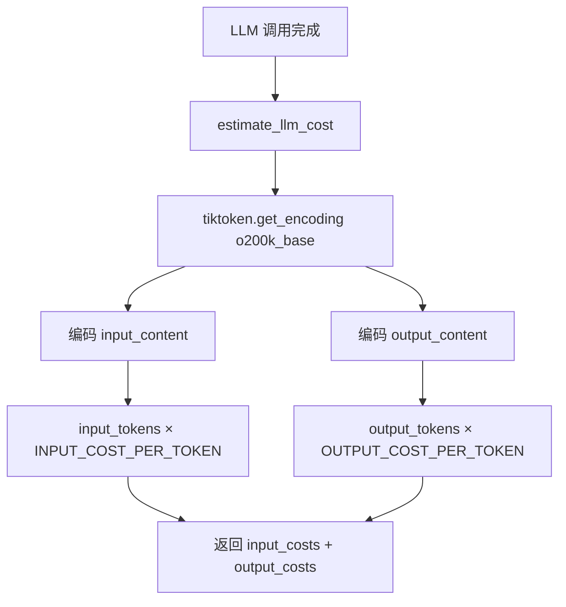
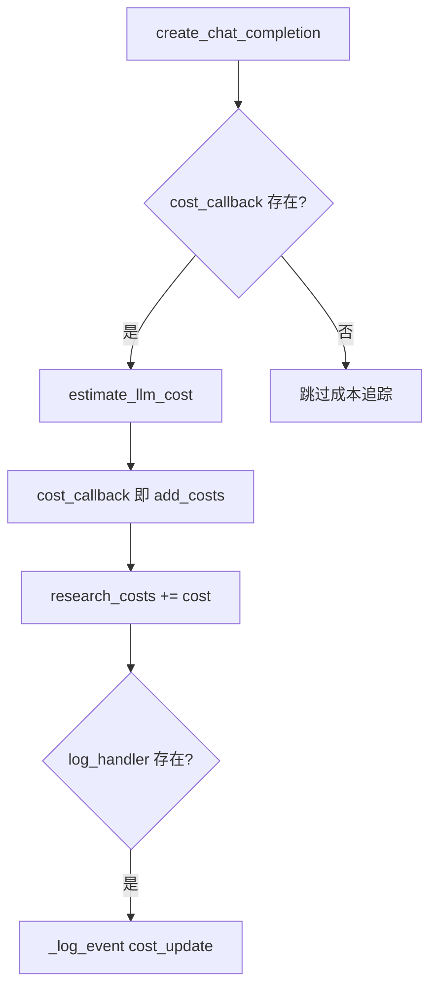
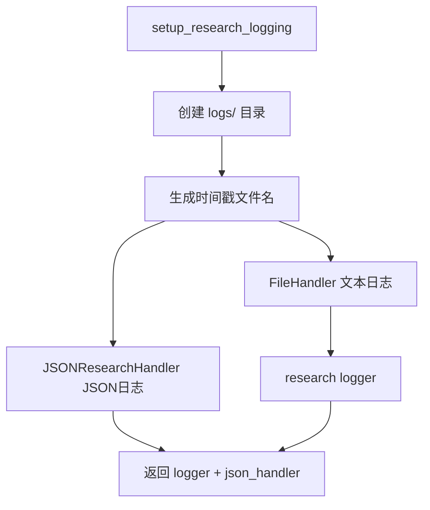

# PD-11.08 GPT-Researcher — tiktoken 成本估算与双层结构化日志

> 文档编号：PD-11.08
> 来源：GPT-Researcher `gpt_researcher/utils/costs.py`, `backend/server/logging_config.py`, `gpt_researcher/agent.py`
> GitHub：https://github.com/assafelovic/gpt-researcher.git
> 问题域：PD-11 可观测性 Observability & Cost Tracking
> 状态：可复用方案

---

## 第 1 章 问题与动机

### 1.1 核心问题

自主研究 Agent 在一次完整的研究流程中会发起大量 LLM 调用（选择 Agent 角色、生成子查询、压缩上下文、撰写报告等），同时还有 embedding 调用用于向量检索。如果不追踪这些调用的成本，用户无法预估单次研究的 API 开销，也无法在成本失控前及时止损。

此外，研究过程涉及多个异步阶段（搜索→抓取→压缩→写作），每个阶段的进度和中间产物需要结构化记录，以便前端实时展示和事后审计。

### 1.2 GPT-Researcher 的解法概述

1. **tiktoken 客户端估算**：通过 `tiktoken.get_encoding("o200k_base")` 对输入/输出文本进行精确 token 计数，乘以硬编码单价得到成本估算（`gpt_researcher/utils/costs.py:18-35`）
2. **回调链累加模式**：每个 LLM 调用点通过 `cost_callback` 参数将估算成本回传给 `GPTResearcher.add_costs()`，在 Agent 实例上累加 `research_costs` 浮点数（`gpt_researcher/agent.py:703-714`）
3. **双层日志系统**：`logging` 标准库（彩色终端 + 文件）+ `JSONResearchHandler`（结构化 JSON 事件日志），两者并行记录（`backend/server/logging_config.py:7-76`）
4. **WebSocket 实时推送**：`CustomLogsHandler` 将日志事件同时写入 JSON 文件和 WebSocket，前端实时展示研究进度（`backend/server/server_utils.py:31-77`）
5. **LangSmith 可选集成**：通过环境变量 `LANGCHAIN_TRACING_V2=true` 启用 LangChain 追踪，零代码侵入（`.env.example:31-37`）

### 1.3 设计思想

| 设计原则 | 具体实现 | 理由 | 替代方案 |
|----------|----------|------|----------|
| 客户端估算优先 | tiktoken 编码后计数 × 硬编码单价 | 不依赖 API 返回的 usage 字段，适配所有 LLM 提供商 | 从 API response.usage 提取精确值 |
| 回调链传播 | `cost_callback` 函数参数逐层传递 | 解耦成本计算与业务逻辑，调用点无需知道累加器位置 | 全局单例 CostTracker |
| 双格式日志 | 文本日志（人读）+ JSON 日志（机读） | 开发调试用文本，程序化分析用 JSON | 仅 JSON + jq 查询 |
| 零配置追踪 | LangSmith 通过环境变量启用 | 不改代码即可开启/关闭外部追踪 | 代码中显式初始化 Tracer |
| 实时推送 | WebSocket send_json 逐事件推送 | 长时间研究过程中用户需要即时反馈 | 轮询 API 获取进度 |

---

## 第 2 章 源码实现分析

### 2.1 架构概览

GPT-Researcher 的可观测性体系由三层组成：

```
┌─────────────────────────────────────────────────────────┐
│                    前端 WebSocket                        │
│         实时接收 type/content/output/metadata            │
└──────────────────────┬──────────────────────────────────┘
                       │ send_json()
┌──────────────────────▼──────────────────────────────────┐
│              CustomLogsHandler / WebSocket                │
│    ┌─────────────┐  ┌──────────────┐  ┌──────────────┐  │
│    │ JSON 文件   │  │ WebSocket    │  │ LangSmith    │  │
│    │ 事件持久化  │  │ 实时推送     │  │ (可选)       │  │
│    └─────────────┘  └──────────────┘  └──────────────┘  │
└──────────────────────┬──────────────────────────────────┘
                       │ _log_event() / add_costs()
┌──────────────────────▼──────────────────────────────────┐
│              GPTResearcher Agent 核心                     │
│  ┌──────────┐ ┌──────────┐ ┌──────────┐ ┌────────────┐ │
│  │ conduct  │ │ write    │ │ deep     │ │ context    │ │
│  │ research │ │ report   │ │ research │ │ compress   │ │
│  └────┬─────┘ └────┬─────┘ └────┬─────┘ └─────┬──────┘ │
│       │            │            │              │        │
│       ▼            ▼            ▼              ▼        │
│  cost_callback → add_costs() → research_costs += cost   │
│  estimate_llm_cost(input, output) via tiktoken           │
└─────────────────────────────────────────────────────────┘
```

### 2.2 核心实现

#### 2.2.1 tiktoken 成本估算引擎



对应源码 `gpt_researcher/utils/costs.py:1-51`：

```python
import tiktoken

# Per OpenAI Pricing Page: https://openai.com/api/pricing/
ENCODING_MODEL = "o200k_base"
INPUT_COST_PER_TOKEN = 0.000005
OUTPUT_COST_PER_TOKEN = 0.000015
IMAGE_INFERENCE_COST = 0.003825
EMBEDDING_COST = 0.02 / 1000000  # Assumes new ada-3-small

def estimate_llm_cost(input_content: str, output_content: str) -> float:
    encoding = tiktoken.get_encoding(ENCODING_MODEL)
    input_tokens = encoding.encode(input_content)
    output_tokens = encoding.encode(output_content)
    input_costs = len(input_tokens) * INPUT_COST_PER_TOKEN
    output_costs = len(output_tokens) * OUTPUT_COST_PER_TOKEN
    return input_costs + output_costs

def estimate_embedding_cost(model: str, docs: list) -> float:
    encoding = tiktoken.encoding_for_model(model)
    total_tokens = sum(len(encoding.encode(str(doc))) for doc in docs)
    return total_tokens * EMBEDDING_COST
```

关键设计点：
- 使用 `o200k_base` 编码器（GPT-4o 系列），而非旧的 `cl100k_base`
- 硬编码 OpenAI 定价，不支持运行时切换提供商价格
- embedding 成本使用 `tiktoken.encoding_for_model()` 按模型名自动选择编码器

#### 2.2.2 回调链成本累加



对应源码 `gpt_researcher/utils/llm.py:100-107` 和 `gpt_researcher/agent.py:703-719`：

```python
# llm.py:100-107 — 调用点注入
async def create_chat_completion(..., cost_callback=None, ...):
    response = await provider.get_chat_response(messages, stream, websocket, **kwargs)
    if cost_callback:
        llm_costs = estimate_llm_cost(str(messages), response)
        cost_callback(llm_costs)
    return response

# agent.py:703-719 — 累加器
def add_costs(self, cost: float) -> None:
    if not isinstance(cost, (float, int)):
        raise ValueError("Cost must be an integer or float")
    self.research_costs += cost
    if self.log_handler:
        self._log_event("research", step="cost_update", details={
            "cost": cost,
            "total_cost": self.research_costs
        })
```

回调链的传播路径：`ResearchConductor` / `ReportGenerator` / `ContextManager` / `SourceCurator` 等所有 skill 组件都通过 `self.researcher.add_costs` 引用同一个回调（`gpt_researcher/skills/writer.py:106-109`, `gpt_researcher/skills/researcher.py:82`）。

#### 2.2.3 双层日志系统



对应源码 `backend/server/logging_config.py:7-76`：

```python
class JSONResearchHandler:
    def __init__(self, json_file):
        self.json_file = json_file
        self.research_data = {
            "timestamp": datetime.now().isoformat(),
            "events": [],
            "content": {
                "query": "", "sources": [], "context": [],
                "report": "", "costs": 0.0
            }
        }

    def log_event(self, event_type: str, data: dict):
        self.research_data["events"].append({
            "timestamp": datetime.now().isoformat(),
            "type": event_type,
            "data": data
        })
        self._save_json()

    def _save_json(self):
        with open(self.json_file, 'w') as f:
            json.dump(self.research_data, f, indent=2)
```

同时，`CustomLogsHandler`（`backend/server/server_utils.py:31-77`）在 WebSocket 场景下将事件同时写入 JSON 文件和推送到前端：

```python
class CustomLogsHandler:
    def __init__(self, websocket, task: str):
        self.logs = []
        self.websocket = websocket
        sanitized_filename = sanitize_filename(f"task_{int(time.time())}_{task}")
        self.log_file = os.path.join("outputs", f"{sanitized_filename}.json")
        # 初始化 JSON 结构...

    async def send_json(self, data: Dict[str, Any]) -> None:
        if self.websocket:
            await self.websocket.send_json(data)
        # 同步写入 JSON 文件...
```

### 2.3 实现细节

**彩色终端日志**（`gpt_researcher/utils/logger.py:40-96`）：使用 `click.style` 实现按日志级别着色，自定义 `ColourizedFormatter` 继承 `logging.Formatter`，通过 `levelprefix` 字段注入颜色。

**多模型定价表**（`gpt_researcher/actions/utils.py:62-97`）：`calculate_cost()` 函数维护了一个硬编码的模型→单价映射表，支持 gpt-3.5-turbo / gpt-4 / gpt-4o / gpt-4o-mini / o3-mini 五个模型。未知模型返回默认值 `0.0001`。

**Deep Research 成本追踪**（`gpt_researcher/skills/deep_research.py:360-418`）：记录研究开始前的 `initial_costs`，结束后计算差值 `research_costs = get_costs() - initial_costs`，实现阶段级成本归属。

**LangSmith 集成**（`.env.example:31-37`）：通过 4 个环境变量启用，LangChain 框架自动拦截所有 chain/llm 调用并上报 trace，无需代码修改。


---

## 第 3 章 迁移指南

### 3.1 迁移清单

**阶段 1：成本估算基础设施**
- [ ] 安装 tiktoken：`pip install tiktoken`
- [ ] 复制 `costs.py` 的 `estimate_llm_cost` 和 `estimate_embedding_cost` 函数
- [ ] 根据实际使用的模型更新 `ENCODING_MODEL` 和单价常量
- [ ] 在 Agent 主类上添加 `research_costs: float = 0.0` 和 `add_costs()` 方法

**阶段 2：回调链接入**
- [ ] 在所有 `create_chat_completion` 调用点添加 `cost_callback` 参数
- [ ] 在 embedding 调用点添加 `estimate_embedding_cost` 回调
- [ ] 确保子组件通过 `self.agent.add_costs` 引用同一累加器

**阶段 3：结构化日志**
- [ ] 实现 `JSONResearchHandler` 或等价的结构化事件记录器
- [ ] 在 Agent 关键生命周期点（start/step/complete/error）调用 `log_event`
- [ ] 配置 `logging` 标准库的 FileHandler + StreamHandler 双输出

**阶段 4：实时推送（可选）**
- [ ] 实现 WebSocket/SSE handler 将事件推送到前端
- [ ] 添加 LangSmith 环境变量支持

### 3.2 适配代码模板

```python
"""可复用的成本追踪模块 — 从 GPT-Researcher 提取"""
import tiktoken
from dataclasses import dataclass, field
from typing import Callable, Optional
import json
import logging
from datetime import datetime
from pathlib import Path

# ---- 成本估算 ----

@dataclass
class PricingConfig:
    """可配置的模型定价，替代硬编码常量"""
    encoding_model: str = "o200k_base"
    input_cost_per_token: float = 0.000005
    output_cost_per_token: float = 0.000015
    embedding_cost_per_token: float = 0.00000002  # ada-3-small

class CostEstimator:
    def __init__(self, pricing: PricingConfig = PricingConfig()):
        self.pricing = pricing
        self._encoding = tiktoken.get_encoding(pricing.encoding_model)

    def estimate_llm_cost(self, input_text: str, output_text: str) -> float:
        input_tokens = len(self._encoding.encode(input_text))
        output_tokens = len(self._encoding.encode(output_text))
        return (input_tokens * self.pricing.input_cost_per_token +
                output_tokens * self.pricing.output_cost_per_token)

    def estimate_embedding_cost(self, docs: list[str]) -> float:
        total_tokens = sum(len(self._encoding.encode(doc)) for doc in docs)
        return total_tokens * self.pricing.embedding_cost_per_token

# ---- 成本累加器 ----

@dataclass
class CostTracker:
    total_cost: float = 0.0
    call_count: int = 0
    costs_by_stage: dict = field(default_factory=dict)
    _current_stage: str = "default"

    def add_cost(self, cost: float, stage: str = None) -> None:
        stage = stage or self._current_stage
        self.total_cost += cost
        self.call_count += 1
        self.costs_by_stage[stage] = self.costs_by_stage.get(stage, 0.0) + cost

    def set_stage(self, stage: str) -> None:
        self._current_stage = stage

    def get_callback(self) -> Callable[[float], None]:
        """返回可传递给 LLM 调用的回调函数"""
        return self.add_cost

    def summary(self) -> dict:
        return {
            "total_cost_usd": round(self.total_cost, 6),
            "call_count": self.call_count,
            "by_stage": {k: round(v, 6) for k, v in self.costs_by_stage.items()}
        }

# ---- 结构化事件日志 ----

class ResearchEventLogger:
    def __init__(self, output_path: Path):
        self.output_path = output_path
        self.events: list[dict] = []
        output_path.parent.mkdir(parents=True, exist_ok=True)

    def log(self, event_type: str, **data) -> None:
        event = {
            "timestamp": datetime.now().isoformat(),
            "type": event_type,
            "data": data
        }
        self.events.append(event)
        self._flush()

    def _flush(self) -> None:
        with open(self.output_path, 'w') as f:
            json.dump({"events": self.events}, f, indent=2, default=str)
```

### 3.3 适用场景

| 场景 | 适用度 | 说明 |
|------|--------|------|
| 单 Agent 研究流程 | ⭐⭐⭐ | 回调链简单直接，一个累加器即可 |
| 多 Agent 并行系统 | ⭐⭐ | 需要为每个 Agent 独立 CostTracker，GPT-Researcher 的全局累加不支持 |
| 多提供商混合调用 | ⭐ | 硬编码 OpenAI 定价，需要扩展 PricingConfig 支持多模型 |
| 生产级成本审计 | ⭐⭐ | tiktoken 估算有 5-15% 误差，不适合精确计费 |
| 实时成本展示 | ⭐⭐⭐ | WebSocket 推送 + JSON 持久化，前端可直接消费 |

---

## 第 4 章 测试用例

```python
import pytest
from unittest.mock import MagicMock, AsyncMock, patch
import json
import tempfile
from pathlib import Path

# ---- 成本估算测试 ----

class TestEstimateLlmCost:
    """测试 gpt_researcher/utils/costs.py 的成本估算逻辑"""

    def test_basic_cost_calculation(self):
        """验证 tiktoken 编码 + 单价计算的基本正确性"""
        from gpt_researcher.utils.costs import estimate_llm_cost
        cost = estimate_llm_cost("Hello world", "This is a response")
        assert cost > 0
        assert isinstance(cost, float)

    def test_empty_input_zero_cost(self):
        """空输入应返回接近零的成本"""
        from gpt_researcher.utils.costs import estimate_llm_cost
        cost = estimate_llm_cost("", "")
        assert cost == 0.0

    def test_cost_proportional_to_length(self):
        """长文本的成本应高于短文本"""
        from gpt_researcher.utils.costs import estimate_llm_cost
        short_cost = estimate_llm_cost("Hi", "Ok")
        long_cost = estimate_llm_cost("Hi " * 1000, "Ok " * 1000)
        assert long_cost > short_cost * 10

    def test_output_more_expensive_than_input(self):
        """相同文本作为输出应比作为输入更贵（3x 单价差）"""
        from gpt_researcher.utils.costs import estimate_llm_cost, INPUT_COST_PER_TOKEN, OUTPUT_COST_PER_TOKEN
        assert OUTPUT_COST_PER_TOKEN > INPUT_COST_PER_TOKEN

class TestEstimateEmbeddingCost:
    def test_embedding_cost_positive(self):
        from gpt_researcher.utils.costs import estimate_embedding_cost
        cost = estimate_embedding_cost("text-embedding-3-small", ["doc1", "doc2"])
        assert cost > 0

# ---- 成本累加器测试 ----

class TestAddCosts:
    def test_add_costs_accumulates(self):
        """验证 add_costs 正确累加"""
        class MockAgent:
            research_costs = 0.0
            log_handler = None
            def add_costs(self, cost):
                if not isinstance(cost, (float, int)):
                    raise ValueError
                self.research_costs += cost

        agent = MockAgent()
        agent.add_costs(0.001)
        agent.add_costs(0.002)
        assert abs(agent.research_costs - 0.003) < 1e-10

    def test_add_costs_rejects_non_numeric(self):
        """非数字输入应抛出 ValueError"""
        class MockAgent:
            research_costs = 0.0
            log_handler = None
            def add_costs(self, cost):
                if not isinstance(cost, (float, int)):
                    raise ValueError("Cost must be an integer or float")
                self.research_costs += cost

        agent = MockAgent()
        with pytest.raises(ValueError):
            agent.add_costs("not a number")

# ---- JSON 日志测试 ----

class TestJSONResearchHandler:
    def test_log_event_persists(self):
        """验证事件写入 JSON 文件"""
        with tempfile.NamedTemporaryFile(suffix='.json', delete=False) as f:
            from backend.server.logging_config import JSONResearchHandler
            handler = JSONResearchHandler(f.name)
            handler.log_event("test_event", {"key": "value"})

            with open(f.name) as rf:
                data = json.load(rf)
            assert len(data["events"]) == 1
            assert data["events"][0]["type"] == "test_event"
```


---

## 第 5 章 跨域关联

| 关联域 | 关系类型 | 说明 |
|--------|----------|------|
| PD-01 上下文管理 | 协同 | `estimate_llm_cost` 的 input_content 就是上下文窗口内容，上下文压缩直接降低成本 |
| PD-03 容错与重试 | 依赖 | 重试循环（`llm.py:100` 的 `for _ in range(10)`）会导致成本翻倍，需要在重试前检查累计成本 |
| PD-08 搜索与检索 | 协同 | embedding 成本通过 `estimate_embedding_cost` 追踪，搜索结果数量直接影响 embedding 开销 |
| PD-12 推理增强 | 依赖 | Deep Research 的多轮迭代通过 `initial_costs` 差值计算阶段成本（`deep_research.py:381`） |
| PD-02 多 Agent 编排 | 互斥 | 当前 `research_costs` 是全局累加器，多 Agent 场景下无法按角色拆分成本归属 |

---

## 第 6 章 来源文件索引

| 文件 | 行范围 | 关键实现 |
|------|--------|----------|
| `gpt_researcher/utils/costs.py` | L1-L51 | tiktoken 成本估算核心：estimate_llm_cost + estimate_embedding_cost |
| `gpt_researcher/agent.py` | L163 | research_costs 初始化为 0.0 |
| `gpt_researcher/agent.py` | L308-L326 | _log_event 事件日志辅助方法 |
| `gpt_researcher/agent.py` | L687-L719 | get_costs / add_costs 成本累加器 |
| `gpt_researcher/utils/llm.py` | L40-L112 | create_chat_completion 中的 cost_callback 注入点 |
| `gpt_researcher/utils/tools.py` | L156-L171 | 工具调用场景的成本追踪 |
| `gpt_researcher/context/compression.py` | L142-L155 | embedding 成本回调注入 |
| `gpt_researcher/skills/deep_research.py` | L360-L418 | Deep Research 阶段级成本差值计算 |
| `gpt_researcher/skills/writer.py` | L106-L109 | ReportGenerator 的 cost_callback 传递 |
| `gpt_researcher/skills/researcher.py` | L82 | ResearchConductor 的 cost_callback 传递 |
| `backend/server/logging_config.py` | L7-L76 | JSONResearchHandler + setup_research_logging |
| `backend/server/server_utils.py` | L31-L77 | CustomLogsHandler WebSocket + JSON 双写 |
| `gpt_researcher/utils/logger.py` | L1-L97 | ColourizedFormatter 彩色终端日志 |
| `gpt_researcher/actions/utils.py` | L62-L97 | calculate_cost 多模型定价表 |
| `gpt_researcher/actions/utils.py` | L145-L162 | create_cost_callback WebSocket 成本推送 |
| `.env.example` | L31-L37 | LangSmith 追踪环境变量配置 |
| `multi_agents/agents/utils/llms.py` | L1-L37 | loguru 在 multi_agents 子系统中的使用 |

---

## 第 7 章 横向对比维度

> **重要：** 本章用于自动填充 Butcher Wiki 的横向对比表。

```json comparison_data
{
  "project": "GPT-Researcher",
  "dimensions": {
    "追踪方式": "tiktoken 客户端估算 + cost_callback 回调链累加",
    "数据粒度": "单次 LLM 调用级，无 token 类型区分（input/output 合并估算）",
    "持久化": "JSON 文件全量覆写 + 文本日志文件双轨",
    "多提供商": "硬编码 OpenAI 定价，未知模型返回默认值 0.0001",
    "日志格式": "logging 文本 + JSONResearchHandler 结构化事件",
    "指标采集": "无独立指标采集，成本通过回调链内存累加",
    "可视化": "WebSocket 实时推送到前端 + JSON 文件事后分析",
    "成本追踪": "research_costs 浮点累加器，支持阶段差值计算",
    "Agent 状态追踪": "_log_event 记录 research step 生命周期事件",
    "日志噪声过滤": "propagate=False 防止 root logger 重复，无路径级过滤",
    "Span 传播": "LangSmith 通过环境变量启用，LangChain 自动注入 span",
    "日志级别": "INFO 为主，error 时 exc_info=True 输出堆栈",
    "预算守卫": "无预算上限检查，仅被动累加和记录",
    "Decorator 插桩": "无，成本追踪通过显式 cost_callback 参数传递",
    "定价表维护": "双定价表：costs.py 硬编码常量 + utils.py 模型映射字典"
  }
}
```

### 域元数据补充

```json domain_metadata
{
  "solution_summary": "GPT-Researcher 通过 tiktoken 客户端编码精确计数 token，cost_callback 回调链逐层传递成本到 Agent 累加器，JSONResearchHandler 双格式日志持久化研究事件",
  "description": "客户端 token 估算与回调链成本传播的轻量级可观测方案",
  "sub_problems": [
    "双定价表不一致：costs.py 用 per-token 常量，utils.py 用 per-1K 字典，两者可能对同一模型给出不同估算",
    "JSON 全量覆写性能：每次 log_event 都 json.dump 整个文件，高频事件下 I/O 成为瓶颈",
    "WebSocket 断连后日志丢失：CustomLogsHandler 的 send_json 在 WebSocket 关闭后静默失败，仅靠 JSON 文件兜底"
  ],
  "best_practices": [
    "阶段差值成本归属：记录阶段开始前的累计成本，结束后取差值，实现无侵入的阶段级成本拆分",
    "LangSmith 零代码集成：仅通过环境变量启用外部追踪，不在业务代码中引入 Tracer 依赖"
  ]
}
```

