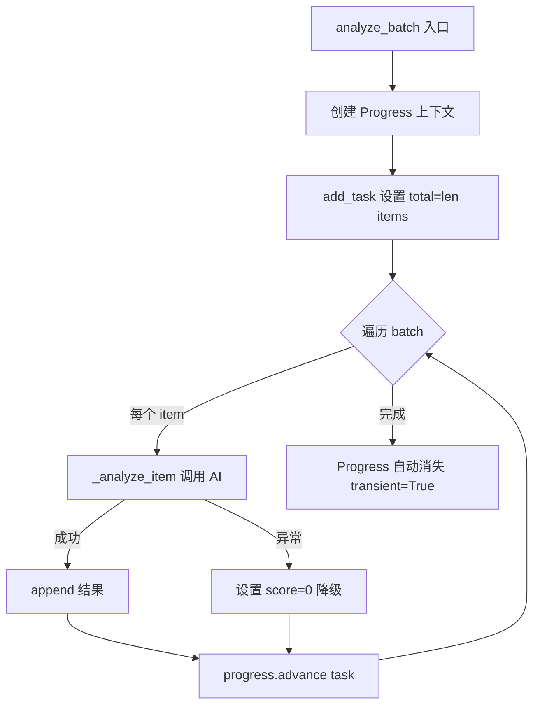
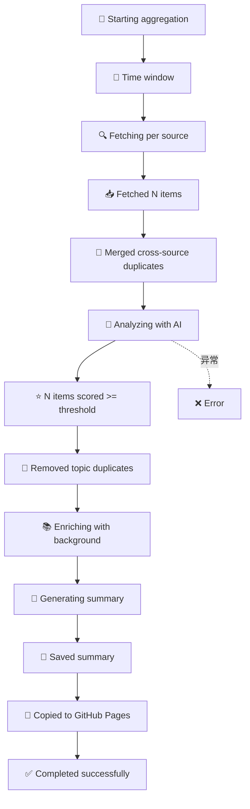

# PD-11.41 Horizon — Rich 进度可视化与 Emoji 结构化控制台输出

> 文档编号：PD-11.41
> 来源：Horizon `src/orchestrator.py` `src/ai/analyzer.py` `src/ai/enricher.py`
> GitHub：https://github.com/Thysrael/Horizon.git
> 问题域：PD-11 可观测性 Observability & Cost Tracking
> 状态：可复用方案

---

## 第 1 章 问题与动机

### 1.1 核心问题

AI 驱动的信息聚合系统需要处理多数据源并发抓取、AI 批量分析、AI 二次富化等多阶段流水线。每个阶段的耗时和进度对用户不透明：用户不知道当前在处理哪个数据源、已分析多少条目、富化进度如何。传统的纯文本 `print` 输出缺乏结构化，无法区分阶段、无法展示进度百分比、无法在终端中提供实时更新的进度条。

Horizon 作为一个 CLI 工具，不需要 Prometheus/OTel 这类重量级可观测性方案，但需要让用户在终端中清晰感知全流程状态。这是一个典型的"轻量级 CLI 可观测性"场景。

### 1.2 Horizon 的解法概述

1. **Rich Progress 四组件进度条**：使用 `SpinnerColumn + TextColumn + BarColumn + MofNCompleteColumn` 组合，为 AI 分析和富化阶段提供实时进度追踪（`src/ai/analyzer.py:26-32`，`src/ai/enricher.py:36-42`）
2. **Emoji 标记的阶段化控制台输出**：全流程 7 个阶段各有专属 emoji 标记（🌅🔍📥🤖⭐️📚✅），通过 Rich Console 的 markup 语法实现彩色输出（`src/orchestrator.py:45-149`）
3. **按数据源和子源分类统计**：抓取阶段按 source/sub-source 分层统计数量，筛选阶段按 `source_type/sub_source_label` 展示选中分布（`src/orchestrator.py:94-100`，`src/orchestrator.py:228-234`）
4. **去重过程可视化**：语义去重时输出 `title_sim` 和 `tag_overlap` 数值，让用户理解去重决策依据（`src/orchestrator.py:372-376`）
5. **transient 进度条**：Progress 设置 `transient=True`，完成后自动消失不污染终端历史（`src/ai/analyzer.py:31`）

### 1.3 设计思想

| 设计原则 | 具体实现 | 理由 | 替代方案 |
|----------|----------|------|----------|
| 零依赖可观测 | 仅依赖 Rich 库，无外部服务 | CLI 工具不应要求用户部署 Prometheus/Grafana | OTel + Jaeger 全链路追踪 |
| 阶段化 emoji 标记 | 每个流水线阶段用固定 emoji 前缀 | 人眼快速扫描定位当前阶段 | 纯文本 [INFO] 前缀 |
| 进度条自动消失 | `transient=True` 完成后清除 | 避免大量进度条残留污染终端 | 保留所有进度条历史 |
| 分层统计输出 | source → sub_source 两级统计 | 多源聚合场景需要知道每个源的贡献 | 只输出总数 |
| 去重决策透明 | 输出 Jaccard 相似度和标签重叠数 | 用户可验证去重是否合理 | 静默去重不输出 |

---

## 第 2 章 源码实现分析

### 2.1 架构概览

Horizon 的可观测性分布在三层：Orchestrator 层（阶段日志）、AI 层（进度条）、Scraper 层（logging）。

```
┌─────────────────────────────────────────────────────────┐
│                  HorizonOrchestrator                     │
│  console = Console()                                     │
│                                                          │
│  run() 全流程 7 阶段 emoji 输出                           │
│  ┌──────────┐  ┌──────────┐  ┌──────────┐               │
│  │ 🔍 Fetch  │→│ 🤖 Analyze│→│ ⭐ Filter │               │
│  │ per-source│  │ Progress │  │ per-sub  │               │
│  │ breakdown │  │ Bar      │  │ breakdown│               │
│  └──────────┘  └──────────┘  └──────────┘               │
│       ↓              ↓              ↓                    │
│  ┌──────────┐  ┌──────────┐  ┌──────────┐               │
│  │ 🧹 Dedup  │→│ 📚 Enrich │→│ 📝 Summary│               │
│  │ sim+tag   │  │ Progress │  │ per-lang │               │
│  │ logging   │  │ Bar      │  │ output   │               │
│  └──────────┘  └──────────┘  └──────────┘               │
│                                                          │
│  Scraper 层: logging.getLogger(__name__) 标准日志         │
│  AI 层: Rich Progress(Spinner+Bar+MofN) 实时进度          │
└─────────────────────────────────────────────────────────┘
```

### 2.2 核心实现

#### Rich Progress 四组件进度条



对应源码 `src/ai/analyzer.py:26-47`：

```python
with Progress(
    SpinnerColumn(),
    TextColumn("[progress.description]{task.description}"),
    BarColumn(),
    MofNCompleteColumn(),
    transient=True,
) as progress:
    task = progress.add_task("Analyzing", total=len(items))

    for i in range(0, len(items), batch_size):
        batch = items[i:i + batch_size]
        for item in batch:
            try:
                await self._analyze_item(item)
                analyzed_items.append(item)
            except Exception as e:
                print(f"Error analyzing item {item.id}: {e}")
                item.ai_score = 0.0
                item.ai_reason = "Analysis failed"
                item.ai_summary = item.title
                analyzed_items.append(item)
            progress.advance(task)
```

四个 Column 组件各司其职：`SpinnerColumn` 提供动画旋转指示器表示活跃状态，`TextColumn` 显示任务描述文字，`BarColumn` 渲染百分比进度条，`MofNCompleteColumn` 显示 `3/25` 格式的完成计数。`transient=True` 确保进度条完成后从终端清除。

ContentEnricher 使用完全相同的 Progress 配置（`src/ai/enricher.py:36-50`），保持 UI 一致性。

#### Orchestrator 阶段化 Emoji 输出



对应源码 `src/orchestrator.py:45-153`：

```python
async def run(self, force_hours: int = None) -> None:
    self.console.print("[bold cyan]🌅 Horizon - Starting aggregation...[/bold cyan]\n")
    try:
        since = self._determine_time_window(force_hours)
        self.console.print(f"📅 Fetching content since: {since.strftime('%Y-%m-%d %H:%M:%S')}\n")

        all_items = await self._fetch_all_sources(since)
        self.console.print(f"📥 Fetched {len(all_items)} items from all sources\n")
        # ... 后续阶段类似模式
        analyzed_items = await self._analyze_content(merged_items)
        self.console.print(f"🤖 Analyzed {len(analyzed_items)} items with AI\n")
        # ...
        self.console.print("[bold green]✅ Horizon completed successfully![/bold green]")
    except Exception as e:
        self.console.print(f"[bold red]❌ Error: {e}[/bold red]")
        raise
```

每个阶段遵循固定模式：emoji + 动作描述 + 数量统计。Rich markup 语法 `[bold cyan]...[/bold cyan]` 提供颜色区分。

#### 分层统计与去重透明度

对应源码 `src/orchestrator.py:228-234`（抓取阶段子源统计）：

```python
sub_counts: Dict[str, int] = defaultdict(int)
for item in items:
    sub_counts[self._sub_source_label(item)] += 1
if len(sub_counts) > 1:
    for sub, count in sorted(sub_counts.items()):
        self.console.print(f"      • {sub}: {count}")
```

对应源码 `src/orchestrator.py:94-100`（筛选阶段选中分布）：

```python
selected_counts: Dict[str, int] = defaultdict(int)
for item in important_items:
    key = f"{item.source_type.value}/{self._sub_source_label(item)}"
    selected_counts[key] += 1
for source_key, count in sorted(selected_counts.items()):
    self.console.print(f"      • {source_key}: {count}")
```

### 2.3 实现细节

**Scraper 层标准 logging**：各 Scraper 使用 `logging.getLogger(__name__)` 记录警告级别的错误信息（`src/scrapers/hackernews.py:13`，`src/scrapers/github.py:8`，`src/scrapers/telegram.py:9`，`src/scrapers/reddit.py:13`）。这些日志默认不输出到终端（未配置 handler），仅在用户主动配置 logging 时可见。

**sub_source_label 统一标签**：`_sub_source_label` 方法（`src/orchestrator.py:238-250`）根据 metadata 中的 `subreddit`/`feed_name`/`channel`/`repo` 字段生成人类可读的子源标签，确保统计输出的一致性。

**错误降级不中断进度**：AI 分析失败时设置 `ai_score=0.0` 并继续推进进度条（`src/ai/analyzer.py:42-46`），不会因单条失败阻塞整个批次。

**去重决策日志**：语义去重时输出 `title_sim` 和 `tag_overlap` 数值（`src/orchestrator.py:372-376`），使用 Rich 的 `[dim]` 标记降低视觉权重，不干扰主流程输出。


---

## 第 3 章 迁移指南

### 3.1 迁移清单

**阶段 1：基础 Rich 进度条**
- [ ] 安装依赖：`pip install rich`
- [ ] 为所有批量 AI 调用添加 `Progress(SpinnerColumn(), TextColumn(...), BarColumn(), MofNCompleteColumn(), transient=True)` 包装
- [ ] 在 `with Progress(...) as progress:` 内部用 `add_task` 注册任务，用 `advance` 推进

**阶段 2：Emoji 阶段化输出**
- [ ] 定义全流程阶段 emoji 映射表
- [ ] 用 `Console()` 替代 `print()`，使用 Rich markup 语法添加颜色
- [ ] 每个阶段输出格式统一为：`emoji + 动作 + 数量`

**阶段 3：分层统计**
- [ ] 为多源聚合场景添加 source → sub_source 两级统计
- [ ] 使用 `defaultdict(int)` 按维度聚合计数
- [ ] 在关键决策点（去重、筛选）输出决策依据

### 3.2 适配代码模板

```python
"""可复用的 Rich 进度条 + Emoji 阶段输出模板"""

from collections import defaultdict
from typing import List, Callable, TypeVar, Awaitable
from rich.console import Console
from rich.progress import (
    Progress, SpinnerColumn, TextColumn,
    BarColumn, MofNCompleteColumn,
)

T = TypeVar("T")
console = Console()


async def batch_with_progress(
    items: List[T],
    processor: Callable[[T], Awaitable[T]],
    task_name: str = "Processing",
    on_error: Callable[[T, Exception], T] | None = None,
) -> List[T]:
    """带 Rich 进度条的批量异步处理。

    Args:
        items: 待处理项列表
        processor: 异步处理函数
        task_name: 进度条显示的任务名
        on_error: 错误降级函数，返回降级后的 item

    Returns:
        处理完成的项列表
    """
    results = []
    with Progress(
        SpinnerColumn(),
        TextColumn("[progress.description]{task.description}"),
        BarColumn(),
        MofNCompleteColumn(),
        transient=True,
    ) as progress:
        task = progress.add_task(task_name, total=len(items))
        for item in items:
            try:
                result = await processor(item)
                results.append(result)
            except Exception as e:
                if on_error:
                    results.append(on_error(item, e))
                else:
                    console.print(f"[red]Error: {e}[/red]")
            progress.advance(task)
    return results


def print_stage(emoji: str, message: str, style: str = ""):
    """阶段化 emoji 输出。"""
    if style:
        console.print(f"[{style}]{emoji} {message}[/{style}]")
    else:
        console.print(f"{emoji} {message}")


def print_breakdown(counts: dict, indent: str = "      "):
    """分层统计输出。"""
    for key, count in sorted(counts.items()):
        console.print(f"{indent}• {key}: {count}")


# 使用示例
async def pipeline_example(items: list):
    print_stage("🌅", "Starting pipeline...", "bold cyan")

    # 阶段 1: 抓取
    print_stage("🔍", f"Fetching from 3 sources...")
    # ... fetch logic ...
    source_counts = defaultdict(int)
    # ... populate counts ...
    print_breakdown(source_counts)

    # 阶段 2: AI 分析（带进度条）
    print_stage("🤖", "Analyzing with AI...")
    analyzed = await batch_with_progress(
        items,
        processor=analyze_single_item,
        task_name="Analyzing",
        on_error=lambda item, e: fallback_item(item),
    )
    print_stage("⭐", f"{len(analyzed)} items analyzed")

    print_stage("✅", "Pipeline completed!", "bold green")
```

### 3.3 适用场景

| 场景 | 适用度 | 说明 |
|------|--------|------|
| CLI 批处理工具 | ⭐⭐⭐ | 最佳场景：用户在终端等待批量任务完成 |
| 多源数据聚合 | ⭐⭐⭐ | 分层统计让用户了解每个源的贡献 |
| AI 批量调用 | ⭐⭐⭐ | 进度条 + 错误降级是 AI 批处理的标配 |
| Web 服务后端 | ⭐ | 不适用：Rich 输出面向终端，Web 服务应用 structured logging |
| 长时间运行的 Agent | ⭐⭐ | 部分适用：需要额外的持久化日志，Rich 仅覆盖终端输出 |

---

## 第 4 章 测试用例

```python
"""基于 Horizon 真实函数签名的测试用例"""

import pytest
from unittest.mock import AsyncMock, MagicMock, patch
from collections import defaultdict
from datetime import datetime, timezone


class TestRichProgressIntegration:
    """测试 Rich Progress 进度条集成"""

    @pytest.mark.asyncio
    async def test_analyze_batch_progress_completes(self):
        """验证 analyze_batch 进度条正常完成"""
        from src.ai.analyzer import ContentAnalyzer

        mock_client = AsyncMock()
        mock_client.complete.return_value = '{"score": 8.0, "reason": "test", "summary": "test", "tags": ["ai"]}'

        analyzer = ContentAnalyzer(mock_client)
        items = [_make_item(f"item-{i}") for i in range(5)]

        with patch("src.ai.analyzer.Progress") as mock_progress:
            mock_ctx = MagicMock()
            mock_progress.return_value.__enter__ = MagicMock(return_value=mock_ctx)
            mock_progress.return_value.__exit__ = MagicMock(return_value=False)
            mock_ctx.add_task.return_value = "task-1"

            result = await analyzer.analyze_batch(items, batch_size=2)

            assert len(result) == 5
            assert mock_ctx.advance.call_count == 5

    @pytest.mark.asyncio
    async def test_analyze_batch_error_degradation(self):
        """验证单条分析失败时降级处理不中断进度"""
        from src.ai.analyzer import ContentAnalyzer

        mock_client = AsyncMock()
        mock_client.complete.side_effect = [
            '{"score": 9.0, "reason": "ok", "summary": "ok", "tags": []}',
            Exception("API timeout"),
            '{"score": 7.0, "reason": "ok", "summary": "ok", "tags": []}',
        ]

        analyzer = ContentAnalyzer(mock_client)
        items = [_make_item(f"item-{i}") for i in range(3)]

        result = await analyzer.analyze_batch(items, batch_size=10)

        assert len(result) == 3
        assert result[0].ai_score == 9.0
        assert result[1].ai_score == 0.0  # 降级
        assert result[1].ai_reason == "Analysis failed"
        assert result[2].ai_score == 7.0


class TestSubSourceBreakdown:
    """测试分层统计输出"""

    def test_sub_source_label_subreddit(self):
        """验证 Reddit 子源标签"""
        from src.orchestrator import HorizonOrchestrator

        item = _make_item("r1", metadata={"subreddit": "MachineLearning"})
        assert HorizonOrchestrator._sub_source_label(item) == "r/MachineLearning"

    def test_sub_source_label_feed(self):
        """验证 RSS feed 子源标签"""
        from src.orchestrator import HorizonOrchestrator

        item = _make_item("f1", metadata={"feed_name": "Hacker News Blog"})
        assert HorizonOrchestrator._sub_source_label(item) == "Hacker News Blog"

    def test_sub_source_label_channel(self):
        """验证 Telegram channel 子源标签"""
        from src.orchestrator import HorizonOrchestrator

        item = _make_item("t1", metadata={"channel": "zaihuapd"})
        assert HorizonOrchestrator._sub_source_label(item) == "@zaihuapd"

    def test_sub_source_label_fallback(self):
        """验证无特定标签时回退到 author"""
        from src.orchestrator import HorizonOrchestrator

        item = _make_item("x1", author="torvalds", metadata={})
        assert HorizonOrchestrator._sub_source_label(item) == "torvalds"


class TestDedupTransparency:
    """测试去重决策透明度"""

    def test_title_tokens_english(self):
        """验证英文标题 token 提取"""
        from src.orchestrator import HorizonOrchestrator

        tokens = HorizonOrchestrator._title_tokens("GPT-4o Released Today")
        assert "released" in tokens
        assert "today" in tokens

    def test_title_tokens_cjk_bigrams(self):
        """验证中文标题 bigram 提取"""
        from src.orchestrator import HorizonOrchestrator

        tokens = HorizonOrchestrator._title_tokens("大模型发布")
        assert "大模" in tokens
        assert "模型" in tokens
        assert "型发" in tokens


def _make_item(id: str, author: str = "test", metadata: dict = None):
    """构造测试用 ContentItem"""
    from src.models import ContentItem, SourceType

    return ContentItem(
        id=id,
        source_type=SourceType.GITHUB,
        title=f"Test item {id}",
        url="https://example.com",
        author=author,
        published_at=datetime.now(timezone.utc),
        metadata=metadata or {},
    )
```


---

## 第 5 章 跨域关联

| 关联域 | 关系类型 | 说明 |
|--------|----------|------|
| PD-01 上下文管理 | 协同 | AI 分析时截断 content 到 1000 字符（`analyzer.py:70`）、富化时截断到 4000 字符（`enricher.py:126-129`），这些截断策略影响可观测性中的"处理了多少内容"统计 |
| PD-03 容错与重试 | 依赖 | 进度条的错误降级（`score=0.0`）依赖 tenacity 的 `@retry` 装饰器先尝试重试 3 次（`analyzer.py:51-53`），重试耗尽后才触发降级 |
| PD-04 工具系统 | 协同 | AI Client 工厂模式（`client.py:191-212`）支持 4 种提供商，但可观测性层不区分提供商——所有 AI 调用共享同一个进度条 |
| PD-08 搜索与检索 | 协同 | 富化阶段的 DuckDuckGo 搜索（`enricher.py:52-74`）静默抑制 stderr 警告，搜索失败返回空列表不影响进度条推进 |
| PD-09 Human-in-the-Loop | 互斥 | Horizon 是全自动流水线，无人工审批环节；可观测性输出是单向的（系统→用户），用户无法在运行中干预 |

---

## 第 6 章 来源文件索引

| 文件 | 行范围 | 关键实现 |
|------|--------|----------|
| `src/ai/analyzer.py` | L13-47 | ContentAnalyzer 类：Rich Progress 四组件进度条 + 错误降级 |
| `src/ai/enricher.py` | L24-50 | ContentEnricher 类：相同 Progress 配置的富化进度条 |
| `src/orchestrator.py` | L25-153 | HorizonOrchestrator.run()：7 阶段 emoji 输出全流程 |
| `src/orchestrator.py` | L213-236 | _fetch_with_progress()：抓取阶段子源分层统计 |
| `src/orchestrator.py` | L238-250 | _sub_source_label()：统一子源标签生成 |
| `src/orchestrator.py` | L306-382 | _merge_topic_duplicates()：去重决策透明日志 |
| `src/orchestrator.py` | L94-100 | 筛选阶段 selected_counts 分布统计 |
| `src/main.py` | L15-75 | CLI 入口：Rich Console 初始化 + 错误处理 |
| `src/scrapers/hackernews.py` | L13 | logger = logging.getLogger(__name__) 标准日志 |
| `src/scrapers/github.py` | L8 | logger = logging.getLogger(__name__) 标准日志 |
| `src/scrapers/telegram.py` | L9,56-61 | logger 警告 + 429 rate limit 重试日志 |
| `src/scrapers/reddit.py` | L13,203-209 | logger 警告 + rate limit 重试日志 |
| `src/ai/client.py` | L191-212 | create_ai_client 工厂：4 提供商无差异化可观测 |
| `src/models.py` | L18-36 | ContentItem：ai_score/ai_reason/ai_tags 分析结果字段 |

---

## 第 7 章 横向对比维度

> **重要：** 本章用于自动填充 Butcher Wiki 的横向对比表。
> 必须严格按以下 JSON 格式输出，放在 `comparison_data` 代码块中。

```json comparison_data
{
  "project": "Horizon",
  "dimensions": {
    "追踪方式": "Rich Progress 四组件进度条 + Emoji 阶段标记，无外部追踪服务",
    "数据粒度": "按 source/sub_source 两级分层统计，单条 item 级进度",
    "持久化": "无持久化，仅终端实时输出，transient=True 完成后清除",
    "多提供商": "4 种 AI 提供商共享同一进度条，不区分提供商级指标",
    "日志格式": "Rich markup 彩色输出 + logging.getLogger 标准日志双轨",
    "可视化": "Rich SpinnerColumn+BarColumn+MofNCompleteColumn 终端内实时渲染",
    "成本追踪": "无成本追踪，AI 调用不记录 token 消耗",
    "日志级别": "Scraper 层 WARNING 级 logger，Orchestrator 层 Rich Console 直出",
    "渠道分层": "5 种数据源 × 子源标签两级分类统计",
    "去重决策透明": "输出 Jaccard title_sim 和 tag_overlap 数值辅助验证"
  }
}
```

### 域元数据补充

```json domain_metadata
{
  "solution_summary": "Horizon 用 Rich Progress 四组件进度条追踪 AI 批量分析/富化进度，Emoji 阶段标记 + source/sub_source 两级分层统计实现轻量级 CLI 可观测性",
  "description": "CLI 工具的轻量级终端可观测性：无外部服务依赖的进度可视化与阶段化输出",
  "sub_problems": [
    "去重决策可解释性：语义去重时输出相似度数值让用户验证合理性",
    "transient 进度条与日志共存：进度条自动消失后不影响上方已输出的阶段日志",
    "多源子源标签统一：不同数据源的子分类字段名不同需统一映射为人类可读标签"
  ],
  "best_practices": [
    "Rich Progress 用 transient=True 避免完成后进度条残留污染终端历史",
    "批量 AI 调用失败时设 score=0 降级而非中断，保证进度条完整推进",
    "Emoji 阶段标记比 [INFO] 前缀更利于人眼快速扫描定位当前阶段"
  ]
}
```

